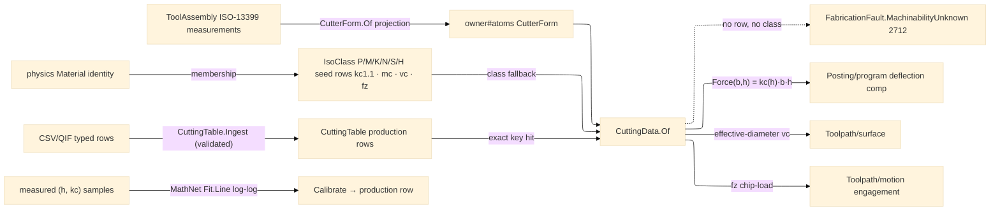

# [RASM_FABRICATION_CUTTING_DATA]

The machinability owner: the Kienzle unit-cutting-force model over the `Process/physics#CUT_PARAMETER` `Material` identity — `kc(h) = kc1.1 · h^(−mc)` (specific cutting force at chip thickness `h`, the `kc1.1` reference at 1 mm and the `mc` chip-thickness exponent), the physically-grounded force model that replaces every magic force constant downstream: `Posting/program`'s deflection compensation reads its radial force off `CuttingData.Force(b, h)` (the `0.0012 · MRR` literal is dead), `Toolpath/surface` reads the effective-diameter surface speed, and `Toolpath/motion` the chip-load budget. Seed-data policy is law: this page AUTHORS the column schema, the ISO 513 material-class row keys (`P` steel · `M` stainless · `K` cast iron · `N` non-ferrous · `S` superalloy · `H` hardened), and ONE physically-sourced representative seed row per class (handbook-range `kc1.1`/`mc` plus per-operation surface-speed and feed-per-tooth columns); per-material/per-operation PRODUCTION rows enter ONLY through the typed CSV/QIF data-INGRESS arm — never hand-transcribed vendor cards (the FreeCAD card set is copyright-excluded; its `kc` SCHEMA is the reference). A lookup missing both a production row and an admissible class fallback returns `MachinabilityUnknown` 2712 — never a silent default.

The page also owns the `CutterForm.Of(ToolAssembly)` projection (ruling 2): the owner#atoms `CutterForm` value TYPE lives on `Process/owner#FABRICATION_OWNER`; THIS page projects it from the ISO-13399 measurement set (`CuttingDiameterMeasurement` → diameter, `CornerRadiusMeasurement` → corner radius, `ToolCuttingEdgeAngleMeasurement` → taper angle, `UsableLengthMaxMeasurement` → flute length; the family classified from the measured geometry — ball when the corner radius reaches the half-diameter, flat at zero, bull between, taper on a nonzero edge angle) as a C# 14 static extension member, so the four `CutterForm` consumers (surface/removal/guard/cuttingdata) read the atoms type and the `owner→cuttingdata→magazine→owner` cycle never forms. Calibration is a growth arm on the same owner: measured `(h, kc)` force samples fit `kc1.1`/`mc` by log-log least squares over MathNet (`Fit.Line` on `ln h → ln kc`), so a shop's measured force data tightens the class seed into a production row through the same ingress.

Wire posture: HOST-LOCAL. Cutting data crosses only the in-process seam to the posting/surface/motion consumers; the ingress arm admits typed rows (the CSV/QIF PARSE is an app-boundary concern); no table type sits between wire and rail.

## [01]-[INDEX]

- [01]-[CUTTING_DATA]: owns the `IsoClass` ISO 513 axis (six class rows with `kc1.1`/`mc` + per-operation speed/feed columns and the `Material` membership sets), the `CuttingData` row record with its `Kc(h)`/`Force(b, h)` folds, the `CuttingTable` seed + ingress admission, the `CuttingData.Of(Material, CutterForm, Operation)` resolution, the `CutterForm.Of(ToolAssembly)` ISO-13399 projection, and the MathNet log-log calibration arm.

## [02]-[CUTTING_DATA]

- Owner: `IsoClass` `[SmartEnum<string>]` the ISO 513 machinability-class axis — each row binding its representative `kc1.1`/`mc`, its per-`Operation` `(SurfaceSpeed, FeedPerTooth)` map, and its `Members` `Set<Material>` (the physics identities the class covers: `mild-steel`→P, `stainless`→M, `aluminium`→N; a non-metal material belongs to NO class and resolves only through a production row); `CuttingRow` the typed production row (`Material` + `CutterFamily` + `Operation` keys, `kc1.1`/`mc`/speed/feed values) the ingress admits; `CuttingTable` the immutable admitted-row table (`Seed` = the six class rows; `Ingest` folds validated production rows in, returning a NEW table); `CuttingData` the resolved machinability receipt carrying `Kc11`/`Mc`/`SurfaceSpeed`/`FeedPerTooth` + the `ClassFallback` provenance flag + the `Kc(h)`/`Force(b, h)` folds; the `CutterForm.Of(ToolAssembly)` static extension projection.
- Cases: `IsoClass` rows 6 — `P` (1680, 0.26) · `M` (2350, 0.21) · `K` (1020, 0.25) · `N` (830, 0.23) · `S` (1370, 0.21) · `H` (2800, 0.25) — ONE representative seed row per class, handbook-sourced, production precision entering only through ingress; resolution order in `Of`: exact production row `(material, form.Family, operation)` → class fallback (the material's `IsoClass` membership, per-operation columns) → `MachinabilityUnknown` 2712; the class fallback is ADMISSIBLE (a physically-sourced representative), a hardcoded constant is not.
- Entry: `public static Fin<CuttingData> CuttingData.Of(Material material, CutterForm form, Operation operation, CuttingTable table)` (the seed-table overload `Of(material, form, operation)` binds `CuttingTable.Seed`) — routes `FabricationFault.MachinabilityUnknown(material, operation)` when neither a production row nor a class membership resolves; `public static CutterForm CutterForm.Of(ToolAssembly assembly)` the ISO-13399 projection; `public static Fin<CuttingTable> CuttingTable.Ingest(CuttingTable table, Seq<CuttingRow> rows)` the typed data-ingress arm rejecting a non-positive `kc1.1`/`mc`/speed/feed row with `GeometryFault.DegenerateInput`; `public static Fin<(double Kc11, double Mc)> Calibrate(Seq<(double H, double Kc)> samples)` the MathNet log-log fit.
- Auto: `Of` keys the production map by `(material.Key, form.Family.Key, operation.Key)`; a hit builds `CuttingData` with `ClassFallback: false`; a miss searches the `IsoClass` rows for membership, reads the class `kc1.1`/`mc` and the per-operation `(vc, fz)` column, and builds with `ClassFallback: true`; no hit routes the typed fault. `Force(b, h) = Kc(h)·b·h` is the Kienzle cutting force the deflection compensation scales by the radial fraction; `Kc(h)` guards `h > 0`. `CutterForm.Of` coerces the measurement set once (the same UnitsNet `Value`+`NativeUnits` discipline as `Tooling/magazine.Admit`) and classifies the family from measured geometry. `Ingest` validates every row and folds it over the table map — last-write-wins per key, the table immutable, the caller carrying the new table as policy state.
- Receipt: `CuttingData` IS the typed machinability evidence — the Kienzle pair, the operation columns, and the `ClassFallback` provenance flag consumers surface in traveler spec rows; no generic machinability ledger, no untyped card rows.
- Packages: `Process/physics#CUT_PARAMETER` (`Material`/`Operation` — composed), `Tooling/magazine#TOOL_MAGAZINE` (`ToolAssembly` — the projection source), `Process/owner#FABRICATION_OWNER` (`CutterForm`/`CutterFamily` — the atoms type), `MathNet.Numerics` (`Fit.Line` log-log calibration — the `.api` shared catalogue), `UnitsNet` (`Length`/`Angle` measurement coercion), Thinktecture.Runtime.Extensions, LanguageExt.Core, BCL inbox.
- Growth: a new machinability class is one `IsoClass` row; a new production row is DATA through `Ingest`, never a code edit; a QIF MeasurementResults feed is the same ingress arm with an upstream parse; a new force consumer reads `Force`/`Kc`, never a local constant; calibration widening (per-form exponents) is one column on `CuttingRow`; zero new surface.
- Boundary: this page is the ONE machinability owner and a per-generator SFM/chip-load literal, a resurrected physics-page cell table, or a magic force coefficient (`0.0012`) downstream is the deleted form — force reads `CuttingData.Force`; seed rows are CLASS representatives and hand-transcribed vendor cards are the copyright-excluded rejected form — production precision is ingress DATA; a lookup never silently defaults — `MachinabilityUnknown` 2712 is the typed miss; the `CutterForm` TYPE is owner#atoms' and re-declaring it here is the cycle-forming deleted form — this page owns only the projection; the ingress admits TYPED rows and a stringly card parser in this folder is the rejected form (the file parse is the app boundary's); `Calibrate` composes MathNet and a hand-rolled least-squares is the deleted form.

```csharp signature
// --- [RUNTIME_PRELUDE] ----------------------------------------------------------------------------------------------------------------------------
using LanguageExt;
using LanguageExt.Common;
using MathNet.Numerics;
using MTConnect.Assets.CuttingTools;
using MTConnect.Assets.CuttingTools.Measurements;
using Rasm.Fabrication.Process;
using Rasm.Numerics;
using Thinktecture;
using UnitsNet;
using static LanguageExt.Prelude;

namespace Rasm.Fabrication.Tooling;

// --- [TYPES] --------------------------------------------------------------------------------------------------------------------------------------
// ISO 513 machinability classes: ONE physically-sourced representative seed row per class (kc1.1 N/mm², mc,
// per-operation vc m/min + fz mm/tooth); production rows enter ONLY through CuttingTable.Ingest.
[SmartEnum<string>]
public sealed partial class IsoClass {
    public static readonly IsoClass P = new("p", kc11: 1680.0, mc: 0.26, Ops(180.0, 0.08), Set(Material.MildSteel));
    public static readonly IsoClass M = new("m", kc11: 2350.0, mc: 0.21, Ops(120.0, 0.05), Set(Material.Stainless));
    public static readonly IsoClass K = new("k", kc11: 1020.0, mc: 0.25, Ops(200.0, 0.10), Set<Material>());
    public static readonly IsoClass N = new("n", kc11: 830.0, mc: 0.23, Ops(500.0, 0.10), Set(Material.Aluminium));
    public static readonly IsoClass S = new("s", kc11: 1370.0, mc: 0.21, Ops(45.0, 0.04), Set<Material>());
    public static readonly IsoClass H = new("h", kc11: 2800.0, mc: 0.25, Ops(80.0, 0.05), Set<Material>());

    public double Kc11 { get; }
    public double Mc { get; }
    public Map<Operation, (double SurfaceSpeed, double FeedPerTooth)> PerOperation { get; }
    public Set<Material> Members { get; }

    // The class representative scales roughing operations off the contour column — a seed heuristic,
    // displaced by any ingested production row for the same key.
    static Map<Operation, (double, double)> Ops(double vc, double fz) =>
        Map((Operation.Contour, (vc, fz)), (Operation.Pocket, (0.9 * vc, 0.8 * fz)), (Operation.Drill, (0.6 * vc, 0.6 * fz)), (Operation.Trochoidal, (1.2 * vc, 1.1 * fz)));
}

// --- [MODELS] -------------------------------------------------------------------------------------------------------------------------------------
public readonly record struct CuttingRow(Material Material, CutterFamily Family, Operation Op, double Kc11, double Mc, double SurfaceSpeed, double FeedPerTooth);

// Immutable admitted-row table: Seed carries the class rows only; Ingest folds validated production rows in.
public sealed record CuttingTable(Map<(string Material, string Family, string Operation), CuttingRow> Rows) {
    public static readonly CuttingTable Seed = new(Map<(string, string, string), CuttingRow>());

    public static Fin<CuttingTable> Ingest(CuttingTable table, Seq<CuttingRow> rows) =>
        rows.Find(r => r.Kc11 <= 0.0 || r.Mc <= 0.0 || r.SurfaceSpeed <= 0.0 || r.FeedPerTooth <= 0.0).Match(
            Some: bad => Fin.Fail<CuttingTable>(GeometryFault.DegenerateInput($"cutting-data:non-positive-row:{bad.Material.Key}").ToError()),
            None: () => Fin.Succ(new CuttingTable(rows.Fold(table.Rows, (acc, r) => acc.AddOrUpdate((r.Material.Key, r.Family.Key, r.Op.Key), r)))));
}

public sealed record CuttingData(double Kc11, double Mc, double SurfaceSpeed, double FeedPerTooth, bool ClassFallback) {
    // Kienzle unit cutting force at chip thickness h (mm): kc = kc1.1 · h^(−mc).
    public double Kc(double h) => h <= 0.0 ? Kc11 : Kc11 * Math.Pow(h, -Mc);

    // Cutting force over chip width b × thickness h — the physically-grounded force every downstream
    // deflection/power consumer reads; the 0.0012·MRR literal is the dead form.
    public double Force(double b, double h) => Kc(h) * b * h;

    public static Fin<CuttingData> Of(Material material, CutterForm form, Operation operation) => Of(material, form, operation, CuttingTable.Seed);

    public static Fin<CuttingData> Of(Material material, CutterForm form, Operation operation, CuttingTable table) =>
        table.Rows.Find((material.Key, form.Family.Key, operation.Key)).Match(
            Some: row => Fin.Succ(new CuttingData(row.Kc11, row.Mc, row.SurfaceSpeed, row.FeedPerTooth, ClassFallback: false)),
            None: () => toSeq(IsoClass.Items).Find(c => c.Members.Contains(material))
                .Bind(c => c.PerOperation.Find(operation).Map(op => new CuttingData(c.Kc11, c.Mc, op.SurfaceSpeed, op.FeedPerTooth, ClassFallback: true)))
                .ToFin(FabricationFault.MachinabilityUnknown(material, operation).ToError()));

    // Log-log least squares over MathNet: ln kc = ln kc1.1 − mc·ln h — measured force samples tighten a
    // class seed into a production row through the same ingress.
    public static Fin<(double Kc11, double Mc)> Calibrate(Seq<(double H, double Kc)> samples) =>
        samples.Count < 2 || samples.Exists(s => s.H <= 0.0 || s.Kc <= 0.0)
            ? Fin.Fail<(double, double)>(GeometryFault.DegenerateInput("cutting-data:calibrate:insufficient").ToError())
            : Fin.Succ(Fit.Line(samples.Map(s => Math.Log(s.H)).ToArray(), samples.Map(s => Math.Log(s.Kc)).ToArray()) is var (intercept, slope)
                ? (Math.Exp(intercept), -slope)
                : default);
}

// --- [OPERATIONS] ---------------------------------------------------------------------------------------------------------------------------------
// CutterForm.Of(ToolAssembly): the ISO-13399 projection onto the owner#atoms CutterForm (ruling 2) — a C# 14
// static extension member, so consumers spell CutterForm.Of(...) while the TYPE stays on the atoms.
public static class CutterFormProjection {
    extension(CutterForm) {
        public static CutterForm Of(ToolAssembly assembly) {
            double d = Mm<CuttingDiameterMeasurement>(assembly.Asset).IfNone(assembly.Tool.Diameter);
            double cr = Mm<CornerRadiusMeasurement>(assembly.Asset).IfNone(assembly.Tool.CornerRadius);
            double taper = toSeq(assembly.Asset.CuttingToolLifeCycle.Measurements).OfType<ToolCuttingEdgeAngleMeasurement>()
                .HeadOrNone().Map(static m => m.Value).IfNone(0.0);
            double flute = Mm<UsableLengthMaxMeasurement>(assembly.Asset).IfNone(assembly.Stickout);
            CutterFamily family =
                assembly.Tool.Key.StartsWith("drill") ? CutterFamily.Drill
                : taper > 0.5 ? CutterFamily.Taper
                : cr <= 1e-9 ? CutterFamily.Flat
                : Math.Abs(cr - 0.5 * d) <= 1e-6 ? CutterFamily.Ball
                : CutterFamily.Bull;
            return new CutterForm(family, d, cr, taper, flute);
        }
    }

    static Option<double> Mm<TMeasure>(ICuttingToolAsset asset) where TMeasure : IToolingMeasurement =>
        toSeq(asset.CuttingToolLifeCycle.Measurements).OfType<TMeasure>().HeadOrNone()
            .Bind(m => Length.TryParse($"{m.Value} {m.NativeUnits ?? "mm"}", out Length len) ? Some(len.Millimeters) : Some(m.Value));
}
```


