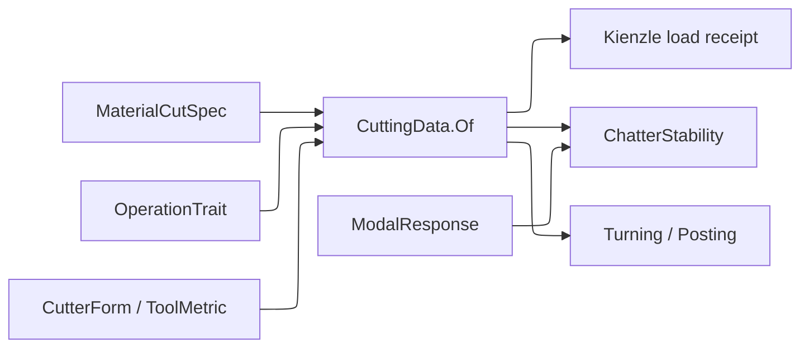

# [RASM_FABRICATION_CUTTING_DATA]

`CuttingData` resolves a material specification, cutter form, operation trait, and admitted evidence into one dimensional cutting regime and one Kienzle force model. Material seeds and operation factors generate the regime space; exact production, vendor, and calibrated rows override data without repeating a class-by-operation matrix.

`CuttingCalibration` and `ToolWear` Taylor calibration share one `PowerLawFit` owner, so log-log regression, residual, determination, and sample-domain evidence are stated once. `ChatterStability` composes the resolved tangential coefficient with every admitted machine-tool mode, samples each lobe across its full ratio search, partitions valid points at every projection gap, solves every bracketed depth crossing against the request's target depth, and recommends a stable spindle point.

Wire posture: HOST-LOCAL. `CuttingData.Of`, `FeedBasis`, `Feed`, and `Force` remain frozen in-process wires for Turning and Posting; `MachineInstance.Modal` carries the admitted modal response. `CoolantDelivery`, `Coating`, and `CoolantResponse` are the Process-family owners this page composes rather than re-mints.

## [01]-[INDEX]

- [01]-[CUTTING_DATA]: `IsoClass`, `MaterialCutSpec`, `MaterialSource`, `OperationTrait`, `CuttingTable`, `CutRegime`, `CorrectionInputs`, `CuttingData`, `PowerLawFit`, `CuttingCalibration`, `CutterFormProjection`, and `ChatterStability`.

## [02]-[CUTTING_DATA]

- Owner: `MaterialCutSpec` carries ISO group, subgroup, condition, hardness, strength, and Kienzle seed data; `OperationTrait` carries generative operation factors; `CuttingTable` carries exact rows keyed by `CuttingKey` and calibration curves; `CorrectionInputs` carries the measured evidence every Kienzle correction axis derives from; `CuttingData` owns resolved force and regime truth.
- Cases: `MaterialSource` discriminates family lookup from an exact specification at one entry; `CuttingEvidence` distinguishes exact, calibrated, vendor, production, interpolated, and generated payloads and projects each one's chip-thickness validity domain; `FeedBasis` preserves dimensional feed meaning; `CutDirection` is a policy value; `ModalEvidence` distinguishes tap-test, operational, analytical, and vendor modal provenance; `StabilityEvidence` distinguishes stable, marginal, and unstable bands; `StabilityCrossing` names each solved transition's direction.
- Entry: `CuttingData.Of(MaterialSource, CutterForm, Operation, CuttingTable, Option<CorrectionInputs>)` is the one resolution entry; `CuttingCalibration.Apply(CalibrationRequest)` is the one calibration entry; `ChatterStability.Apply(StabilityRequest)` is the one dynamic entry; `CutterFormProjection.Of(ToolAssembly, CutterFormPolicy)` is the one form projection and `CutterForm.Fits` the one form-compatibility predicate.
- Auto: exact rows resolve by `CuttingKey` lookup, calibration curves interpolate by hardness, and seed-plus-trait generation closes the remaining space. `KienzleCorrection.Of` derives rake, coating, coolant, condition, thermal, abrasion, wear, and runout factors from admitted evidence rather than unit placeholders. Specific force refuses a chip thickness outside its evidence's declared domain. Force evaluation derives the engagement arc from radial depth and diameter before projecting tangential, feed, and passive components, resultant, torque, power, and removal rate.
- Receipt: `CuttingData` carries resolved source and clamps; `PowerLawReceipt` carries coefficient, exponent, residual, determination, domain, and dispersion; `CalibrationReceipt` narrows that fit to Kienzle terms; `StabilityReceipt` carries contiguous lobe-indexed spindle-depth bands, every solved crossing with its direction, ratio-bounded gaps, modal provenance, and the target depth its margins are relative to. `FabricationFact.CuttingFit.Of` projects `PowerLawReceipt` residual and determination onto `rasm.fabrication.fit.residual` and `rasm.fabrication.fit.quality` through `Process/telemetry#FACT_PROJECTION` as kind `cutting-fit`.
- Packages: MathNet.Numerics `Fit.Line`, monotone interpolation, and `Brent.TryFindRoot`; `TensorPrimitives` finite/statistical reductions; `UnitsNet`; `NodaTime` modal evidence instants; the Process owners `Coating`, `CoolantDelivery`, `CoolantResponse`, and `CutterForm`; LanguageExt.Core; and Thinktecture.Runtime.Extensions compose directly.
- Growth: a material is one `MaterialCutSpec`; an operation is one `OperationTrait`; a measured correction is one `CuttingRow`; a hardness series is one `CalibrationCurve`; a measured mode is one `ModalMode` inside `ModalResponse`; a modal provenance is one `ModalEvidence` case.
- Boundary: repeated class-operation matrices, a second coolant vocabulary beside `CoolantDelivery`, linear scans over a keyed exact table, `Fin.Succ` query shells lifting pure values, unqualified dimensional request scalars, scalar-only force, string evidence labels, correction axes pinned at unity, engagement fraction standing in for the engagement arc, two-point unqualified fits, silent extrapolation past the evidence domain, a single transition where a lobe crosses twice, margins relative to a regime ceiling rather than the requested depth, magic classification tolerances, and chatter-blind speed selection are deleted forms.

```csharp signature
// --- [RUNTIME_PRELUDE] ----------------------------------------------------------------------------------------------------------------------------
using System.Linq;
using System.Numerics.Tensors;
using LanguageExt;
using LanguageExt.Common;
using MathNet.Numerics;
using MathNet.Numerics.Interpolation;
using MathNet.Numerics.RootFinding;
using NodaTime;
using Rasm.Fabrication.Process;
using Thinktecture;
using UnitsNet;
using static LanguageExt.Prelude;

namespace Rasm.Fabrication.Tooling;

// --- [TYPES] --------------------------------------------------------------------------------------------------------------------------------------
[SmartEnum<string>]
public sealed partial class IsoClass {
    public static readonly IsoClass P = new("P", "steel");
    public static readonly IsoClass M = new("M", "stainless-steel");
    public static readonly IsoClass K = new("K", "cast-iron");
    public static readonly IsoClass N = new("N", "nonferrous");
    public static readonly IsoClass S = new("S", "heat-resistant-superalloy");
    public static readonly IsoClass H = new("H", "hardened-material");

    public string Family { get; }
}

[SmartEnum<string>]
public sealed partial class MaterialState {
    public static readonly MaterialState Annealed = new("annealed", 0.90);
    public static readonly MaterialState Normalized = new("normalized", 1.00);
    public static readonly MaterialState Hardened = new("hardened", 1.25);
    public static readonly MaterialState Aged = new("aged", 1.10);
    public static readonly MaterialState Cast = new("cast", 1.15);
    public static readonly MaterialState Wrought = new("wrought", 1.00);
    public static readonly MaterialState Composite = new("composite", 1.30);

    public double ForceFactor { get; }
}

[SmartEnum<string>]
public sealed partial class HardnessScale {
    public static readonly HardnessScale Vickers = new("vickers");
    public static readonly HardnessScale Brinell = new("brinell");
    public static readonly HardnessScale RockwellC = new("rockwell-c");
    public static readonly HardnessScale RockwellB = new("rockwell-b");
}

[SmartEnum<string>]
public sealed partial class FeedBasis {
    public static readonly FeedBasis PerTooth = new("per-tooth");
    public static readonly FeedBasis PerRevolution = new("per-revolution");
    public static readonly FeedBasis LinearPerMinute = new("linear-per-minute");
    public static readonly FeedBasis SurfaceRatio = new("surface-ratio");
}

[SmartEnum<string>]
public sealed partial class CutDirection {
    public static readonly CutDirection Climb = new("climb");
    public static readonly CutDirection Conventional = new("conventional");
    public static readonly CutDirection Bidirectional = new("bidirectional");
}

// --- [MODELS] -------------------------------------------------------------------------------------------------------------------------------------
[ComplexValueObject]
public readonly partial struct Hardness {
    public HardnessScale Scale { get; }
    public double Value { get; }

    static partial void ValidateFactoryArguments(ref ValidationError? validationError, ref HardnessScale scale,
        ref double value) =>
        validationError = scale is null || !double.IsFinite(value) || value <= 0.0
            ? new ValidationError(message: "hardness") : null;
}

[ComplexValueObject]
public sealed partial class MaterialCutSpec {
    public Material Material { get; }
    public IsoClass Class { get; }
    public int Subgroup { get; }
    public MaterialState Condition { get; }
    public Hardness Hardness { get; }
    public Pressure UltimateStrength { get; }
    public Pressure Kc11 { get; }
    public double Mc { get; }
    public double ThermalFactor { get; }
    public double AbrasionFactor { get; }

    static partial void ValidateFactoryArguments(ref ValidationError? validationError, ref Material material,
        ref IsoClass @class, ref int subgroup, ref MaterialState condition, ref Hardness hardness,
        ref Pressure ultimateStrength, ref Pressure kc11, ref double mc, ref double thermalFactor,
        ref double abrasionFactor) =>
        validationError = material is null || @class is null || subgroup is < 1 or > 99 || condition is null
            || hardness.Scale is null || !Seq(mc, thermalFactor, abrasionFactor).ForAll(double.IsFinite)
            || ultimateStrength <= Pressure.Zero || kc11 <= Pressure.Zero || mc is <= 0.0 or >= 1.0
            || thermalFactor <= 0.0 || abrasionFactor <= 0.0
            ? new ValidationError(message: "material-cut-spec") : null;
}

[Union(ConversionFromValue = ConversionOperatorsGeneration.None)]
public abstract partial record MaterialSource {
    private MaterialSource() { }
    public sealed record Family(Material Value) : MaterialSource;
    public sealed record Spec(MaterialCutSpec Value) : MaterialSource;
}

[ComplexValueObject]
public sealed partial class OperationTrait {
    public Operation Operation { get; }
    public FeedBasis Basis { get; }
    public ScalarBand SurfaceSpeed { get; }
    public ScalarBand Feed { get; }
    public ScalarBand AxialDepth { get; }
    public ScalarBand RadialDepth { get; }
    public ScalarBand Engagement { get; }
    public ScalarBand Spindle { get; }
    public double FeedForceRatio { get; }
    public double PassiveForceRatio { get; }
    public Seq<CoolantDelivery> Coolant { get; }
    public CutDirection Direction { get; }

    static partial void ValidateFactoryArguments(ref ValidationError? validationError, ref Operation operation,
        ref FeedBasis basis, ref ScalarBand surfaceSpeed, ref ScalarBand feed, ref ScalarBand axialDepth,
        ref ScalarBand radialDepth, ref ScalarBand engagement, ref ScalarBand spindle, ref double feedForceRatio,
        ref double passiveForceRatio, ref Seq<CoolantDelivery> coolant, ref CutDirection direction) =>
        validationError = operation is null || basis is null || coolant.IsEmpty || direction is null
            || !Seq(feedForceRatio, passiveForceRatio).ForAll(static value => double.IsFinite(value) && value > 0.0)
            ? new ValidationError(message: "operation-trait") : null;
}

[ComplexValueObject]
public readonly partial struct ScalarBand {
    public double Minimum { get; }
    public double Nominal { get; }
    public double Maximum { get; }

    static partial void ValidateFactoryArguments(ref ValidationError? validationError, ref double minimum,
        ref double nominal, ref double maximum) =>
        validationError = !Seq(minimum, nominal, maximum).ForAll(double.IsFinite)
            || minimum <= 0.0 || minimum > nominal || nominal > maximum
            ? new ValidationError(message: "scalar-band") : null;

    public double Clamp(double value) => Math.Clamp(value, Minimum, Maximum);
    public bool Contains(double value) => double.IsFinite(value) && value >= Minimum && value <= Maximum;
}

[ComplexValueObject]
public sealed partial class CutRegime {
    public ScalarBand SurfaceSpeedBand { get; }
    public ScalarBand FeedBand { get; }
    public FeedBasis Basis { get; }
    public ScalarBand AxialDepthBand { get; }
    public ScalarBand RadialDepthBand { get; }
    public ScalarBand EngagementBand { get; }
    public ScalarBand SpindleBand { get; }
    public Seq<CoolantDelivery> Coolant { get; }
    public CutDirection Direction { get; }

    public double SurfaceSpeed => SurfaceSpeedBand.Nominal;
    public double Feed => FeedBand.Nominal;

    static partial void ValidateFactoryArguments(ref ValidationError? validationError, ref ScalarBand surfaceSpeedBand,
        ref ScalarBand feedBand, ref FeedBasis basis, ref ScalarBand axialDepthBand, ref ScalarBand radialDepthBand,
        ref ScalarBand engagementBand, ref ScalarBand spindleBand, ref Seq<CoolantDelivery> coolant,
        ref CutDirection direction) =>
        validationError = basis is null || coolant.IsEmpty || direction is null
            ? new ValidationError(message: "cut-regime") : null;
}

[ComplexValueObject]
public sealed partial class CorrectionInputs {
    public Angle Rake { get; }
    public Angle ReferenceRake { get; }
    public Coating Coating { get; }
    public CoolantDelivery Coolant { get; }
    public Ratio FlankConsumed { get; }
    public Length Runout { get; }
    public Length ChipThickness { get; }

    static partial void ValidateFactoryArguments(ref ValidationError? validationError, ref Angle rake,
        ref Angle referenceRake, ref Coating coating, ref CoolantDelivery coolant, ref Ratio flankConsumed,
        ref Length runout, ref Length chipThickness) =>
        validationError = coating is null || coolant is null || runout < Length.Zero
            || chipThickness <= Length.Zero || flankConsumed < Ratio.Zero || flankConsumed > Ratio.FromPercent(100)
            ? new ValidationError(message: "correction-inputs") : null;
}

[ComplexValueObject]
public readonly partial struct KienzleCorrection {
    public double ToolGeometry { get; }
    public double Coating { get; }
    public double Coolant { get; }
    public double MaterialState { get; }
    public double Thermal { get; }
    public double Abrasiveness { get; }
    public double Wear { get; }
    public double Runout { get; }

    public double Factor => ToolGeometry * Coating * Coolant * MaterialState * Thermal * Abrasiveness * Wear * Runout;

    public static KienzleCorrection? Of(MaterialCutSpec material, Option<CorrectionInputs> inputs) =>
        inputs.Map(row => Create(
                Math.Max(0.1, 1.0 - (row.Rake.Degrees - row.ReferenceRake.Degrees) / 100.0),
                row.Coating.WearFactor,
                Math.Max(0.1, 2.0 - CoolantResponse.For(row.Coolant).Evacuation),
                material.Condition.ForceFactor, material.ThermalFactor, material.AbrasionFactor,
                1.0 + row.FlankConsumed.DecimalFractions,
                1.0 + row.Runout.Millimeters / row.ChipThickness.Millimeters))
            .IfNone(() => Create(1.0, 1.0, 1.0, material.Condition.ForceFactor,
                material.ThermalFactor, material.AbrasionFactor, 1.0, 1.0));

    static partial void ValidateFactoryArguments(ref ValidationError? validationError, ref double toolGeometry,
        ref double coating, ref double coolant, ref double materialState, ref double thermal,
        ref double abrasiveness, ref double wear, ref double runout) =>
        validationError = !Seq(toolGeometry, coating, coolant, materialState, thermal, abrasiveness, wear, runout)
            .ForAll(static value => double.IsFinite(value) && value > 0.0)
            ? new ValidationError(message: "kienzle-correction") : null;
}

[ComplexValueObject]
public sealed partial class CuttingKey {
    public MaterialCutSpec Material { get; }
    public CutterFamily Form { get; }
    public Operation Operation { get; }

    static partial void ValidateFactoryArguments(ref ValidationError? validationError, ref MaterialCutSpec material,
        ref CutterFamily form, ref Operation operation) {
        validationError = material is null || form is null || operation is null
            ? new ValidationError(message: "cutting-key") : null;
    }
}

[ComplexValueObject]
public sealed partial class CuttingRow {
    public CuttingKey Key { get; }
    public Pressure Kc11 { get; }
    public double Mc { get; }
    public CutRegime Regime { get; }
    public KienzleCorrection Correction { get; }
    public double FeedForceRatio { get; }
    public double PassiveForceRatio { get; }
    public CuttingEvidence Evidence { get; }

    static partial void ValidateFactoryArguments(ref ValidationError? validationError, ref CuttingKey key,
        ref Pressure kc11, ref double mc, ref CutRegime regime, ref KienzleCorrection correction,
        ref double feedForceRatio, ref double passiveForceRatio, ref CuttingEvidence evidence) =>
        validationError = key is null || kc11 <= Pressure.Zero || !double.IsFinite(mc) || mc is <= 0.0 or >= 1.0
            || regime is null || correction is null || evidence is null
            || !Seq(feedForceRatio, passiveForceRatio).ForAll(static value => double.IsFinite(value) && value > 0.0)
            || !EvidenceValid(evidence)
            ? new ValidationError(message: "cutting-row") : null;

    private static bool EvidenceValid(CuttingEvidence evidence) => evidence.Switch(
        exact: static row => !string.IsNullOrWhiteSpace(row.Source) && !string.IsNullOrWhiteSpace(row.Revision),
        production: static row => !string.IsNullOrWhiteSpace(row.Lot) && row.Samples > 0
            && double.IsFinite(row.Residual) && row.Residual >= 0.0,
        vendor: static row => !string.IsNullOrWhiteSpace(row.Catalog) && !string.IsNullOrWhiteSpace(row.Revision)
            && row.Thickness.Minimum > 0.0,
        calibrated: static row => row.Receipt is not null,
        interpolated: static row => row.Curve is not null && row.Hardness.Scale is not null && row.Hardness.Value > 0.0,
        generated: static row => row.Material is not null && row.Operation is not null);
}

[ComplexValueObject]
public sealed partial class CalibrationPoint {
    public Hardness Hardness { get; }
    public Pressure Kc11 { get; }

    static partial void ValidateFactoryArguments(ref ValidationError? validationError, ref Hardness hardness,
        ref Pressure kc11) =>
        validationError = hardness.Scale is null || kc11 <= Pressure.Zero
            ? new ValidationError(message: "calibration-point") : null;
}

[ComplexValueObject]
public sealed partial class CalibrationCurve {
    public IsoClass Class { get; }
    public int Subgroup { get; }
    public Seq<CalibrationPoint> Points { get; }

    static partial void ValidateFactoryArguments(ref ValidationError? validationError, ref IsoClass @class,
        ref int subgroup, ref Seq<CalibrationPoint> points) =>
        validationError = @class is null || subgroup is < 1 or > 99 || points.Count < 3
            || points.Map(static point => point.Hardness.Scale).Distinct().Count != 1
            || points.Map(static point => point.Hardness).Distinct().Count != points.Count
            || points.Zip(points.Skip(1)).Exists(static pair => pair.Item1.Hardness.Value >= pair.Item2.Hardness.Value)
            ? new ValidationError(message: "calibration-curve") : null;
}

[Union(ConversionFromValue = ConversionOperatorsGeneration.None)]
public abstract partial record CuttingEvidence {
    private CuttingEvidence() { }
    public sealed record Exact(string Source, string Revision, ScalarBand Thickness) : CuttingEvidence;
    public sealed record Production(string Lot, int Samples, double Residual, ScalarBand Thickness) : CuttingEvidence;
    public sealed record Vendor(string Catalog, string Revision, ScalarBand Thickness) : CuttingEvidence;
    public sealed record Calibrated(CalibrationReceipt Receipt) : CuttingEvidence;
    public sealed record Interpolated(CalibrationCurve Curve, Hardness Hardness) : CuttingEvidence;
    public sealed record Generated(MaterialCutSpec Material, OperationTrait Operation) : CuttingEvidence;

    public Option<ScalarBand> Thickness => Switch(
        exact: static row => Some(row.Thickness),
        production: static row => Some(row.Thickness),
        vendor: static row => Some(row.Thickness),
        calibrated: static row => Optional(ScalarBand.Create(row.Receipt.ThicknessMinimum.Millimeters,
            (row.Receipt.ThicknessMinimum.Millimeters + row.Receipt.ThicknessMaximum.Millimeters) * 0.5,
            row.Receipt.ThicknessMaximum.Millimeters)),
        interpolated: static _ => None,
        generated: static _ => None);
}

[ComplexValueObject]
public sealed partial class CuttingTable {
    public Seq<MaterialCutSpec> Materials { get; }
    public Seq<OperationTrait> Operations { get; }
    public HashMap<CuttingKey, CuttingRow> Exact { get; }
    public Seq<CalibrationCurve> Curves { get; }

    static partial void ValidateFactoryArguments(ref ValidationError? validationError,
        ref Seq<MaterialCutSpec> materials, ref Seq<OperationTrait> operations,
        ref HashMap<CuttingKey, CuttingRow> exact, ref Seq<CalibrationCurve> curves) =>
        validationError = materials.IsEmpty || materials.Distinct().Count != materials.Count
            || operations.Map(static row => row.Operation).Distinct().Count != operations.Count
            || toSeq(Operation.Items).Exists(operation => !operations.Exists(row => row.Operation == operation))
            || exact.AsIterable().Exists(row => row.Key != row.Value.Key
                || !materials.Contains(row.Key.Material)
                || !operations.Exists(operation => operation.Operation == row.Key.Operation))
            || curves.Map(static row => (row.Class, row.Subgroup)).Distinct().Count != curves.Count
            || curves.Exists(curve => !materials.Exists(material => material.Class == curve.Class
                && material.Subgroup == curve.Subgroup))
            ? new ValidationError(message: "cutting-table") : null;

    public Option<MaterialCutSpec> Material(Material value) =>
        Materials.Filter(row => row.Material == value).ToSeq() is { Count: 1 } rows ? rows.Head : None;
    public Option<OperationTrait> Operation(Operation value) => Operations.Find(row => row.Operation == value);
}

[ComplexValueObject]
public readonly partial struct CutIntent {
    public Length ChipThickness { get; }
    public Length ChipWidth { get; }
    public Length AxialDepth { get; }
    public Length RadialDepth { get; }
    public Length Diameter { get; }
    public int Teeth { get; }
    public RotationalSpeed Spindle { get; }
    public Speed Feed { get; }

    public Ratio Engagement => Ratio.FromDecimalFractions(Math.Acos(Math.Clamp(
        1.0 - 2.0 * RadialDepth.Millimeters / Diameter.Millimeters, -1.0, 1.0)) / (2.0 * Math.PI));

    static partial void ValidateFactoryArguments(ref ValidationError? validationError, ref Length chipThickness,
        ref Length chipWidth, ref Length axialDepth, ref Length radialDepth, ref Length diameter,
        ref int teeth, ref RotationalSpeed spindle, ref Speed feed) =>
        validationError = !Seq(chipThickness.Millimeters, chipWidth.Millimeters, axialDepth.Millimeters,
                radialDepth.Millimeters, diameter.Millimeters, spindle.RevolutionsPerMinute, feed.MetersPerSecond)
            .ForAll(double.IsFinite)
            || Seq(chipThickness, chipWidth, axialDepth, radialDepth, diameter).Exists(static value => value <= Length.Zero)
            || radialDepth > diameter || spindle <= RotationalSpeed.Zero || teeth <= 0 || feed.MetersPerSecond <= 0.0
            ? new ValidationError(message: "cut-intent") : null;
}

public sealed record CuttingLoad(Pressure SpecificForce, Force Tangential, Force Feed, Force Passive,
    Force Resultant, Torque Torque, Power Power, double RemovalRateMm3PerMinute, Length ChipThickness,
    Ratio Engagement);

[ComplexValueObject]
public sealed partial class CuttingData {
    public Pressure Kc11 { get; }
    public double Mc { get; }
    public CutRegime Regime { get; }
    public KienzleCorrection Correction { get; }
    public CuttingEvidence Evidence { get; }
    public double FeedForceRatio { get; }
    public double PassiveForceRatio { get; }

    public double SurfaceSpeed => Regime.SurfaceSpeed;
    public double Feed => Regime.Feed;
    public FeedBasis FeedBasis => Regime.Basis;

    static partial void ValidateFactoryArguments(ref ValidationError? validationError, ref Pressure kc11,
        ref double mc, ref CutRegime regime, ref KienzleCorrection correction, ref CuttingEvidence evidence,
        ref double feedForceRatio, ref double passiveForceRatio) =>
        validationError = kc11 <= Pressure.Zero || !double.IsFinite(mc) || mc is <= 0.0 or >= 1.0
            || regime is null || correction is null || evidence is null
            || !Seq(feedForceRatio, passiveForceRatio).ForAll(static value => double.IsFinite(value) && value > 0.0)
            ? new ValidationError(message: "cutting-data") : null;

    public Fin<double> Kc(double chipThicknessMm) => Specific(chipThicknessMm).Map(static value => value.Megapascals);

    public Fin<double> Force(double chipWidthMm, double chipThicknessMm) =>
        from specific in Specific(chipThicknessMm)
        let force = specific.Megapascals * chipWidthMm * chipThicknessMm
        from admitted in double.IsFinite(force) && force > 0.0
            ? Fin.Succ(force) : Fin.Fail<double>(Error.New(message: "cutting-force"))
        select admitted;

    public Fin<CuttingLoad> Evaluate(CutIntent intent) =>
        from _ in Admit(intent)
        from specific in Specific(intent.ChipThickness.Millimeters)
        let activeEdges = Math.Max(1.0, intent.Teeth * intent.Engagement.DecimalFractions)
        let tangential = Force.FromNewtons(specific.Megapascals * intent.ChipWidth.Millimeters
            * intent.ChipThickness.Millimeters * activeEdges)
        let feed = Force.FromNewtons(tangential.Newtons * FeedForceRatio)
        let passive = Force.FromNewtons(tangential.Newtons * PassiveForceRatio)
        let resultant = Force.FromNewtons(Math.Sqrt(tangential.Newtons * tangential.Newtons
            + feed.Newtons * feed.Newtons + passive.Newtons * passive.Newtons))
        let torque = Torque.FromNewtonMeters(tangential.Newtons * intent.Diameter.Millimeters * 0.0005)
        let power = Power.FromWatts(2.0 * Math.PI * intent.Spindle.RevolutionsPerMinute * torque.NewtonMeters / 60.0)
        let removal = intent.AxialDepth.Millimeters * intent.RadialDepth.Millimeters * intent.Feed.MetersPerSecond * 60000.0
        select new CuttingLoad(specific, tangential, feed, passive, resultant, torque, power, removal,
            intent.ChipThickness, intent.Engagement);

    public static Fin<CuttingData> Of(MaterialSource source, CutterForm form, Operation operation,
        CuttingTable table, Option<CorrectionInputs> correction = default) =>
        from material in source.Switch(
            family: row => table.Material(row.Value).ToFin(FabricationFault.MachinabilityUnknown(row.Value, operation)),
            spec: row => table.Materials.Contains(row.Value)
                ? Fin.Succ(row.Value)
                : Fin.Fail<MaterialCutSpec>(FabricationFault.MachinabilityUnknown(row.Value.Material, operation)))
        from trait in table.Operation(operation)
            .ToFin(FabricationFault.MachinabilityUnknown(material.Material, operation))
        from resolved in Resolve(material, form, trait, table, correction)
        select resolved;

    private Fin<Pressure> Specific(double chipThicknessMm) =>
        from _ in double.IsFinite(chipThicknessMm) && chipThicknessMm > 0.0
            ? Fin.Succ(unit) : Fin.Fail<Unit>(Error.New(message: "chip-thickness"))
        from __ in Evidence.Thickness.ForAll(band => band.Contains(chipThicknessMm))
            ? Fin.Succ(unit) : Fin.Fail<Unit>(Error.New(message: "cutting-extrapolation"))
        let value = Kc11.Megapascals * Math.Pow(chipThicknessMm, -Mc) * Correction.Factor
        from specific in double.IsFinite(value) && value > 0.0
            ? Fin.Succ(Pressure.FromMegapascals(value))
            : Fin.Fail<Pressure>(Error.New(message: "specific-cutting-force"))
        select specific;

    private Fin<Unit> Admit(CutIntent intent) =>
        Regime.SurfaceSpeedBand.Contains(
            Math.PI * intent.Diameter.Millimeters * intent.Spindle.RevolutionsPerMinute / 1000.0)
        && Regime.FeedBand.Contains(FeedBasis.Switch(
            state: (Intent: intent, FeedMmPerMinute: intent.Feed.MetersPerSecond * 60000.0),
            perTooth: static row => row.FeedMmPerMinute / (row.Intent.Spindle.RevolutionsPerMinute * row.Intent.Teeth),
            perRevolution: static row => row.FeedMmPerMinute / row.Intent.Spindle.RevolutionsPerMinute,
            linearPerMinute: static row => row.FeedMmPerMinute,
            surfaceRatio: static row => row.Intent.RadialDepth / row.Intent.Diameter))
        && Regime.AxialDepthBand.Contains(intent.AxialDepth.Millimeters)
        && Regime.RadialDepthBand.Contains(intent.RadialDepth.Millimeters)
        && Regime.EngagementBand.Contains(intent.Engagement.DecimalFractions)
        && Regime.SpindleBand.Contains(intent.Spindle.RevolutionsPerMinute)
            ? Fin.Succ(unit) : Fin.Fail<Unit>(Error.New(message: "cut-intent-regime"));

    private static Fin<CuttingData> Resolve(MaterialCutSpec material, CutterForm form,
        OperationTrait operation, CuttingTable table, Option<CorrectionInputs> correction) =>
        Optional(CuttingKey.Create(material, form.Family, operation.Operation))
            .Bind(key => table.Exact.Find(key))
            .Map(static row => CuttingData.Create(row.Kc11, row.Mc, row.Regime, row.Correction,
                row.Evidence, row.FeedForceRatio, row.PassiveForceRatio)
                .ToFin(Error.New(message: "cutting-row")))
            .IfNone(() => Generate(material, operation, table, correction));

    private static Fin<CuttingData> Generate(MaterialCutSpec material, OperationTrait operation, CuttingTable table,
        Option<CorrectionInputs> inputs) =>
        from regime in Regime(material, operation)
        let curve = table.Curves.Find(row => row.Class == material.Class
            && row.Subgroup == material.Subgroup
            && row.Points.Head.Exists(point => point.Hardness.Scale == material.Hardness.Scale)
            && material.Hardness.Value >= row.Points.Map(static point => point.Hardness.Value).Min()
            && material.Hardness.Value <= row.Points.Map(static point => point.Hardness.Value).Max())
        let kc = curve.Map(row => Pressure.FromMegapascals(Interpolate.CubicSplineMonotone(
                row.Points.Map(static point => point.Hardness.Value).ToArray(),
                row.Points.Map(static point => point.Kc11.Megapascals).ToArray()).Interpolate(material.Hardness.Value)))
            .IfNone(material.Kc11)
        let evidence = curve.Map<CuttingEvidence>(row => new CuttingEvidence.Interpolated(row, material.Hardness))
            .IfNone(new CuttingEvidence.Generated(material, operation))
        from correction in Optional(KienzleCorrection.Of(material, inputs))
            .ToFin(Error.New(message: "kienzle-correction"))
        from generated in CuttingData.Create(kc, material.Mc, regime, correction, evidence,
                operation.FeedForceRatio, operation.PassiveForceRatio)
            .ToFin(Error.New(message: "cutting-generated"))
        select generated;

    private static Fin<CutRegime> Regime(MaterialCutSpec material, OperationTrait operation) =>
        from speed in Scale(operation.SurfaceSpeed,
                material.UltimateStrength.Megapascals / material.Kc11.Megapascals)
            .ToFin(Error.New(message: "cutting-speed-band"))
        from regime in CutRegime.Create(speed, operation.Feed, operation.Basis, operation.AxialDepth,
                operation.RadialDepth, operation.Engagement, operation.Spindle, operation.Coolant, operation.Direction)
            .ToFin(Error.New(message: "cut-regime"))
        select regime;

    private static ScalarBand? Scale(ScalarBand band, double factor) =>
        ScalarBand.Create(band.Minimum * factor, band.Nominal * factor, band.Maximum * factor);
}

// --- [CALIBRATION] --------------------------------------------------------------------------------------------------------------------------------
[ComplexValueObject]
public sealed partial class CalibrationRequest {
    public Seq<(Length ChipThickness, Pressure SpecificForce)> Samples { get; }
    public int MinimumSamples { get; }
    public Length MinimumThicknessSpan { get; }
    public double MaximumResidual { get; }
    public double MinimumRSquared { get; }

    static partial void ValidateFactoryArguments(ref ValidationError? validationError,
        ref Seq<(Length ChipThickness, Pressure SpecificForce)> samples, ref int minimumSamples,
        ref Length minimumThicknessSpan, ref double maximumResidual, ref double minimumRSquared) =>
        validationError = minimumSamples < 3 || samples.Count < minimumSamples
            || !double.IsFinite(minimumThicknessSpan.Millimeters) || minimumThicknessSpan <= Length.Zero
            || !double.IsFinite(maximumResidual) || maximumResidual <= 0.0
            || !double.IsFinite(minimumRSquared) || minimumRSquared is < 0.0 or > 1.0
            || samples.Exists(static row => !double.IsFinite(row.ChipThickness.Millimeters)
                || !double.IsFinite(row.SpecificForce.Megapascals)
                || row.ChipThickness <= Length.Zero || row.SpecificForce <= Pressure.Zero)
            || samples.Map(static row => row.ChipThickness.Millimeters).Max()
                - samples.Map(static row => row.ChipThickness.Millimeters).Min() < minimumThicknessSpan.Millimeters
            ? new ValidationError(message: "cutting-calibration-request") : null;
}

[ComplexValueObject]
public sealed partial class CalibrationReceipt {
    public Pressure Kc11 { get; }
    public double Mc { get; }
    public double RootMeanSquareResidual { get; }
    public double RSquared { get; }
    public Length ThicknessMinimum { get; }
    public Length ThicknessMaximum { get; }
    public Pressure ForceMean { get; }
    public Pressure ForceStandardDeviation { get; }
    public int Samples { get; }

    static partial void ValidateFactoryArguments(ref ValidationError? validationError, ref Pressure kc11,
        ref double mc, ref double rootMeanSquareResidual, ref double rSquared, ref Length thicknessMinimum,
        ref Length thicknessMaximum, ref Pressure forceMean, ref Pressure forceStandardDeviation, ref int samples) =>
        validationError = kc11 <= Pressure.Zero || !double.IsFinite(mc) || mc is <= 0.0 or >= 1.0
            || !double.IsFinite(rootMeanSquareResidual) || rootMeanSquareResidual < 0.0
            || !double.IsFinite(rSquared) || rSquared is < 0.0 or > 1.0
            || thicknessMinimum <= Length.Zero || thicknessMaximum <= thicknessMinimum
            || forceMean <= Pressure.Zero || forceStandardDeviation < Pressure.Zero || samples < 3
            ? new ValidationError(message: "cutting-calibration-receipt") : null;
}

public sealed record PowerLawReceipt(double Coefficient, double Exponent, double RootMeanSquareResidual,
    double RSquared, double DomainMinimum, double DomainMaximum, double Mean, double StandardDeviation, int Samples);

public static class PowerLawFit {
    public static Fin<PowerLawReceipt> Apply(Seq<(double X, double Y)> samples) {
        double[] x = samples.Map(static row => row.X).ToArray();
        double[] y = samples.Map(static row => row.Y).ToArray();
        if (x.Length < 3 || !TensorPrimitives.IsFiniteAll<double>(x) || !TensorPrimitives.IsFiniteAll<double>(y)
            || x.Any(static value => value <= 0.0) || y.Any(static value => value <= 0.0))
            return Fin.Fail<PowerLawReceipt>(Error.New(message: "power-law-samples"));
        double[] logX = new double[x.Length], logY = new double[y.Length];
        TensorPrimitives.Log<double>(x, logX);
        TensorPrimitives.Log<double>(y, logY);
        (double intercept, double slope) = Fit.Line(logX, logY);
        double[] addend = new double[x.Length], predicted = new double[x.Length];
        Array.Fill(addend, intercept);
        TensorPrimitives.MultiplyAdd<double>(logX, slope, addend, predicted);
        TensorPrimitives.Exp<double>(predicted, predicted);
        double mean = TensorPrimitives.Average<double>(y);
        double[] centered = new double[y.Length], residuals = new double[y.Length];
        TensorPrimitives.Subtract<double>(y, mean, centered);
        TensorPrimitives.Subtract<double>(y, predicted, residuals);
        double total = TensorPrimitives.SumOfSquares<double>(centered);
        double unexplained = TensorPrimitives.SumOfSquares<double>(residuals);
        double coefficient = Math.Exp(intercept);
        double exponent = -slope;
        double residual = Math.Sqrt(unexplained / y.Length);
        double determination = total <= 0.0 ? 0.0 : 1.0 - unexplained / total;
        double minimum = x.Min();
        double maximum = x.Max();
        double deviation = TensorPrimitives.StdDev<double>(y);
        return Seq(intercept, slope, coefficient, exponent, residual, determination, minimum, maximum, mean, deviation)
                .ForAll(double.IsFinite)
            && coefficient > 0.0 && exponent > 0.0 && residual >= 0.0
            && determination is >= 0.0 and <= 1.0 && minimum > 0.0 && maximum > minimum
            && mean > 0.0 && deviation >= 0.0
            ? Fin.Succ(new PowerLawReceipt(coefficient, exponent, residual, determination, minimum, maximum, mean,
                deviation, y.Length))
            : Fin.Fail<PowerLawReceipt>(Error.New(message: "power-law-degenerate"));
    }
}

public static class CuttingCalibration {
    public static Fin<CalibrationReceipt> Apply(CalibrationRequest request) =>
        from fit in PowerLawFit.Apply(request.Samples.Map(static row =>
            (row.ChipThickness.Millimeters, row.SpecificForce.Megapascals)))
        from receipt in CalibrationReceipt.Create(Pressure.FromMegapascals(fit.Coefficient), fit.Exponent,
                fit.RootMeanSquareResidual, fit.RSquared, Length.FromMillimeters(fit.DomainMinimum),
                Length.FromMillimeters(fit.DomainMaximum), Pressure.FromMegapascals(fit.Mean),
                Pressure.FromMegapascals(fit.StandardDeviation), fit.Samples)
            .ToFin(Error.New(message: "cutting-calibration-invalid"))
        from admitted in receipt.RootMeanSquareResidual <= request.MaximumResidual
            && receipt.RSquared >= request.MinimumRSquared
            ? Fin.Succ(receipt) : Fin.Fail<CalibrationReceipt>(Error.New(message: "cutting-calibration-unfit"))
        select admitted;
}

// --- [FORM_PROJECTION] ----------------------------------------------------------------------------------------------------------------------------
[ComplexValueObject]
public sealed partial class CutterFormPolicy {
    public Angle TaperFloor { get; }
    public Length RadiusTolerance { get; }
    public Length ZeroLength { get; }
    public Option<CutterFamily> DeclaredFamily { get; }

    static partial void ValidateFactoryArguments(ref ValidationError? validationError, ref Angle taperFloor,
        ref Length radiusTolerance, ref Length zeroLength, ref Option<CutterFamily> declaredFamily) =>
        validationError = taperFloor < Angle.Zero || radiusTolerance <= Length.Zero || zeroLength < Length.Zero
            ? new ValidationError(message: "cutter-form-policy") : null;
}

public static class CutterFormProjection {
    extension(CutterForm) {
        public static Fin<CutterForm> Of(ToolAssembly assembly, CutterFormPolicy policy) =>
            Fin.Succ(Geometry(assembly)).Bind(geometry =>
                from family in (policy.DeclaredFamily | Infer(assembly, policy, geometry))
                    .ToFin(Error.New(message: $"cutter-form-unclassified:{assembly.Identity}"))
                from form in CutterForm.Admit(new CutterIngress.Direct(family, geometry.Diameter,
                    geometry.Radius, geometry.Taper, geometry.Flute))
                select form);
    }

    extension(CutterForm form) {
        public bool Fits(CutterForm required, Ratio band) =>
            form.Family == required.Family && form.FluteLength >= required.FluteLength
            && Math.Abs(form.Diameter - required.Diameter) <= required.Diameter * band.DecimalFractions
            && form.CornerRadius <= required.CornerRadius + required.Diameter * band.DecimalFractions
            && Math.Abs(form.TaperAngle - required.TaperAngle)
                <= required.TaperAngle * band.DecimalFractions;
    }

    private static (double Diameter, double Radius, double Taper, double Flute) Geometry(ToolAssembly assembly) => (
        Diameter: assembly.Snapshot.Metric(ToolMeasure.CuttingDiameter)
            .OrElse(assembly.Snapshot.Metric(ToolMeasure.MaximumCuttingDiameter)).IfNone(0.0),
        Radius: assembly.Snapshot.Metric(ToolMeasure.CornerRadius).IfNone(0.0),
        Taper: assembly.Snapshot.Metric(ToolMeasure.LeadAngle)
            .OrElse(assembly.Snapshot.Metric(ToolMeasure.CuttingEdgeAngle).Map(static angle => 90.0 - angle))
            .IfNone(0.0),
        Flute: Seq(assembly.Snapshot.Metric(ToolMeasure.MaximumUsableLength),
                assembly.Snapshot.Metric(ToolMeasure.CuttingEdgeLength),
                assembly.Snapshot.Metric(ToolMeasure.MaximumDepthOfCut),
                Some(assembly.Stickout))
            .Choose(static value => value).OrderBy(static value => value).HeadOrNone().IfNone(0.0));

    private static Option<CutterFamily> Infer(ToolAssembly assembly, CutterFormPolicy policy,
        (double Diameter, double Radius, double Taper, double Flute) geometry) =>
        (Point: assembly.Snapshot.Metric(ToolMeasure.PointAngle).IsSome,
            Chamfer: assembly.Snapshot.Metric(ToolMeasure.ChamferWidth).IsSome,
            Taper: geometry.Taper > policy.TaperFloor.Degrees,
            Flat: geometry.Radius <= policy.ZeroLength.Millimeters,
            Ball: Math.Abs(geometry.Radius - geometry.Diameter * 0.5) <= policy.RadiusTolerance.Millimeters,
            Bull: geometry.Radius < geometry.Diameter * 0.5) switch {
            { Point: true } => Some(CutterFamily.Drill),
            { Chamfer: true } => Some(CutterFamily.Chamfer),
            { Taper: true } => Some(CutterFamily.Taper),
            { Flat: true } => Some(CutterFamily.Flat),
            { Ball: true } => Some(CutterFamily.Ball),
            { Bull: true } => Some(CutterFamily.Bull),
            _ => None
        };
}

// --- [CHATTER_STABILITY] --------------------------------------------------------------------------------------------------------------------------
[Union(ConversionFromValue = ConversionOperatorsGeneration.None)]
public abstract partial record ModalEvidence {
    private ModalEvidence() { }
    public sealed record TapTest(Instant At, int Averages, double Coherence) : ModalEvidence;
    public sealed record Operational(Instant At, RotationalSpeed Spindle) : ModalEvidence;
    public sealed record Analytical(string Model, string Revision) : ModalEvidence;
    public sealed record Vendor(string Catalog, string Revision) : ModalEvidence;

    public bool Grounded => Switch(
        tapTest: static row => row.Averages >= 3 && row.Coherence is > 0.0 and <= 1.0,
        operational: static row => row.Spindle > RotationalSpeed.Zero,
        analytical: static row => !string.IsNullOrWhiteSpace(row.Model) && !string.IsNullOrWhiteSpace(row.Revision),
        vendor: static row => !string.IsNullOrWhiteSpace(row.Catalog) && !string.IsNullOrWhiteSpace(row.Revision));
}

[ComplexValueObject]
public sealed partial class ModalMode {
    public double NaturalFrequencyHz { get; }
    public double DampingRatio { get; }
    public double StiffnessNewtonsPerMeter { get; }
    public double DirectionalFactor { get; }
    public ModalEvidence Evidence { get; }

    static partial void ValidateFactoryArguments(ref ValidationError? validationError, ref double naturalFrequencyHz,
        ref double dampingRatio, ref double stiffnessNewtonsPerMeter, ref double directionalFactor,
        ref ModalEvidence evidence) =>
        validationError = !double.IsFinite(naturalFrequencyHz) || naturalFrequencyHz <= 0.0
            || !double.IsFinite(stiffnessNewtonsPerMeter) || stiffnessNewtonsPerMeter <= 0.0
            || !double.IsFinite(dampingRatio) || dampingRatio is <= 0.0 or >= 1.0
            || !double.IsFinite(directionalFactor) || directionalFactor <= 0.0
            || evidence is null || !evidence.Grounded
            ? new ValidationError(message: "modal-mode") : null;
}

[ComplexValueObject]
public sealed partial class ModalResponse {
    public Seq<ModalMode> Modes { get; }
    public ModalEvidence MachineEvidence { get; }

    static partial void ValidateFactoryArguments(ref ValidationError? validationError, ref Seq<ModalMode> modes,
        ref ModalEvidence machineEvidence) =>
        validationError = modes.IsEmpty
            || modes.Map(static mode => mode.NaturalFrequencyHz).Distinct().Count != modes.Count
            || machineEvidence is null || !machineEvidence.Grounded
            ? new ValidationError(message: "modal-response") : null;
}

[ComplexValueObject]
public sealed partial class StabilityPolicy {
    public int Lobes { get; }
    public int SamplesPerLobe { get; }
    public ScalarBand SpindleSearch { get; }
    public ScalarBand FrequencyRatioSearch { get; }
    public double RootAccuracy { get; }
    public int RootIterations { get; }
    public double MarginalFraction { get; }

    static partial void ValidateFactoryArguments(ref ValidationError? validationError, ref int lobes,
        ref int samplesPerLobe, ref ScalarBand spindleSearch, ref ScalarBand frequencyRatioSearch, ref double rootAccuracy,
        ref int rootIterations, ref double marginalFraction) =>
        validationError = lobes <= 0 || samplesPerLobe < 3 || frequencyRatioSearch.Minimum <= 1.0
            || !double.IsFinite(rootAccuracy) || rootAccuracy <= 0.0 || rootIterations <= 0
            || !double.IsFinite(marginalFraction) || marginalFraction is <= 0.0 or >= 1.0
            ? new ValidationError(message: "stability-policy") : null;
}

[ComplexValueObject]
public sealed partial class StabilityRequest {
    public CuttingData Cutting { get; }
    public ModalResponse Modal { get; }
    public StabilityPolicy Policy { get; }
    public int Teeth { get; }
    public Length ChipThickness { get; }
    public Length TargetDepth { get; }

    static partial void ValidateFactoryArguments(ref ValidationError? validationError, ref CuttingData cutting,
        ref ModalResponse modal, ref StabilityPolicy policy, ref int teeth, ref Length chipThickness,
        ref Length targetDepth) =>
        validationError = cutting is null || modal is null || policy is null || teeth <= 0
            || chipThickness <= Length.Zero || targetDepth <= Length.Zero
            ? new ValidationError(message: "stability-request") : null;
}

[SmartEnum<string>]
public sealed partial class StabilityGapReason {
    public static readonly StabilityGapReason NoProjection = new("no-projection");
    public static readonly StabilityGapReason NoBand = new("no-band");
}

[SmartEnum<string>]
public sealed partial class StabilityCrossing {
    public static readonly StabilityCrossing IntoStable = new("into-stable");
    public static readonly StabilityCrossing IntoUnstable = new("into-unstable");
}

public sealed record StabilityPoint(double FrequencyRatio, RotationalSpeed Spindle, Length AxialDepthLimit,
    double Margin, StabilityEvidence Evidence);
public sealed record StabilityTransition(RotationalSpeed Spindle, StabilityCrossing Crossing);
public sealed record StabilityBand(int Mode, int Lobe, ScalarBand SpindleRpm, Seq<StabilityPoint> Points,
    Seq<StabilityTransition> Transitions);
public sealed record StabilityGap(int Mode, int Lobe, StabilityGapReason Reason,
    double FrequencyRatioMinimum, double FrequencyRatioMaximum);

[Union(ConversionFromValue = ConversionOperatorsGeneration.None)]
public abstract partial record StabilityEvidence {
    private StabilityEvidence() { }
    public sealed record Stable(double Margin) : StabilityEvidence;
    public sealed record Marginal(double Margin) : StabilityEvidence;
    public sealed record Unstable(double Deficit) : StabilityEvidence;
}

public sealed record StabilityReceipt(Seq<StabilityBand> Bands, ModalResponse Modal,
    Seq<StabilityGap> Gaps, Pressure TangentialCoefficient, ScalarBand Search, Length TargetDepth) {
    public Option<StabilityPoint> Recommend(Length depth) =>
        Bands.Bind(static band => band.Points)
            .Filter(point => point.AxialDepthLimit >= depth && point.Evidence is StabilityEvidence.Stable)
            .OrderByDescending(static point => point.Margin).HeadOrNone();
}

public static class ChatterStability {
    public static Fin<StabilityReceipt> Apply(StabilityRequest request) =>
        from coefficient in request.Cutting.Kc(request.ChipThickness.Millimeters).Map(Pressure.FromMegapascals)
        let requests = toSeq(Enumerable.Range(0, request.Modal.Modes.Count)).Bind(mode =>
            Range(0, request.Policy.Lobes).Map(lobe => (Mode: mode, Lobe: lobe, Response: request.Modal.Modes[mode])))
        from results in requests.Traverse(row => Band(row.Mode, row.Lobe, row.Response, coefficient, request).ToValidation()).As().ToFin()
        let bands = results.Bind(static row => row is StabilityAttempt.Solved solved ? solved.Bands : Seq<StabilityBand>())
        let gaps = results.Bind(static row => row switch {
            StabilityAttempt.Solved solved => solved.Gaps,
            StabilityAttempt.Rejected rejected => rejected.Gaps,
            _ => Seq<StabilityGap>(),
        })
        from _ in bands.IsEmpty ? Fin.Fail<Unit>(Error.New(message: "stability-empty")) : Fin.Succ(unit)
        select new StabilityReceipt(bands, request.Modal, gaps, coefficient, request.Policy.SpindleSearch,
            request.TargetDepth);

    [Union(ConversionFromValue = ConversionOperatorsGeneration.None)]
    private abstract partial record StabilityAttempt {
        private StabilityAttempt() { }
        public sealed record Solved(Seq<StabilityBand> Bands, Seq<StabilityGap> Gaps) : StabilityAttempt;
        public sealed record Rejected(Seq<StabilityGap> Gaps) : StabilityAttempt;
    }

    private static Fin<StabilityAttempt> Band(int mode, int lobe, ModalMode response,
        Pressure coefficient, StabilityRequest request) {
        Seq<(double Ratio, Option<StabilityPoint> Point)> projected = toSeq(Generate.LinearSpaced(
                request.Policy.SamplesPerLobe,
                request.Policy.FrequencyRatioSearch.Minimum,
                request.Policy.FrequencyRatioSearch.Maximum))
            .Map(ratio => (Ratio: ratio, Point: Project(ratio, lobe, response, coefficient, request)))
            .ToSeq();
        Seq<StabilityGap> gaps = GapRuns(projected, mode, lobe);
        return PointRuns(projected)
            .Traverse(points => BuildBand(points, mode, lobe, response, coefficient, request).ToValidation())
            .As().ToFin()
            .Map(options => options.Choose(identity).ToSeq())
            .Map<StabilityAttempt>(bands => bands.IsEmpty
                ? new StabilityAttempt.Rejected(gaps.Add(new StabilityGap(mode, lobe, StabilityGapReason.NoBand,
                    request.Policy.FrequencyRatioSearch.Minimum, request.Policy.FrequencyRatioSearch.Maximum)))
                : new StabilityAttempt.Solved(bands, gaps));
    }

    private static Fin<Option<StabilityBand>> BuildBand(Seq<StabilityPoint> candidates, int mode, int lobe,
        ModalMode response, Pressure coefficient, StabilityRequest request) {
        Seq<StabilityPoint> points = candidates.OrderBy(static point => point.Spindle.RevolutionsPerMinute).ToSeq();
        return (points.Head, points.Last, points.OrderByDescending(static point => point.AxialDepthLimit).HeadOrNone())
            .Apply(static (first, last, peak) => (First: first, Last: last, Peak: peak))
            .Bind(bounds => Optional(ScalarBand.Create(bounds.First.Spindle.RevolutionsPerMinute,
                bounds.Peak.Spindle.RevolutionsPerMinute, bounds.Last.Spindle.RevolutionsPerMinute)))
            .Map(spindle => Boundaries(points, lobe, response, coefficient, request)
                .Map(transitions => Some(new StabilityBand(mode, lobe, spindle, points, transitions))))
            .IfNone(Fin.Succ(Option<StabilityBand>.None));
    }

    private static Seq<Seq<StabilityPoint>> PointRuns(Seq<(double Ratio, Option<StabilityPoint> Point)> samples) {
        (Seq<Seq<StabilityPoint>> Closed, Seq<StabilityPoint> Open) state = samples.Fold(
            (Closed: Seq<Seq<StabilityPoint>>(), Open: Seq<StabilityPoint>()),
            static (state, sample) => sample.Point.Match(
                Some: point => (state.Closed, state.Open.Add(point)),
                None: () => state.Open.IsEmpty
                    ? state
                    : (state.Closed.Add(state.Open), Seq<StabilityPoint>())));
        return state.Open.IsEmpty ? state.Closed : state.Closed.Add(state.Open);
    }

    private static Seq<StabilityGap> GapRuns(
        Seq<(double Ratio, Option<StabilityPoint> Point)> samples,
        int mode,
        int lobe) {
        (Seq<(double Minimum, double Maximum)> Closed, Option<(double Minimum, double Maximum)> Open) state = samples.Fold(
            (Closed: Seq<(double Minimum, double Maximum)>(), Open: Option<(double Minimum, double Maximum)>.None),
            static (state, sample) => sample.Point.IsSome
                ? (state.Open.Map(run => state.Closed.Add(run)).IfNone(state.Closed),
                    Option<(double Minimum, double Maximum)>.None)
                : (state.Closed, Some(state.Open.Map(run => (run.Minimum, sample.Ratio))
                    .IfNone((sample.Ratio, sample.Ratio)))));
        Seq<(double Minimum, double Maximum)> closed = state.Open.Map(state.Closed.Add).IfNone(state.Closed);
        return closed.Map(run => new StabilityGap(mode, lobe, StabilityGapReason.NoProjection, run.Minimum, run.Maximum));
    }

    private static Option<StabilityPoint> Project(double ratio, int lobe, ModalMode response,
        Pressure coefficient, StabilityRequest request) =>
        from depth in Some(Depth(ratio, response, coefficient)).Filter(static row => double.IsFinite(row) && row > 0.0)
        let spindle = Spindle(ratio, lobe, response, request.Teeth)
        let margin = depth * 1000.0 / request.TargetDepth.Millimeters
        where request.Policy.SpindleSearch.Contains(spindle) && double.IsFinite(margin) && margin > 0.0
        select new StabilityPoint(ratio, RotationalSpeed.FromRevolutionsPerMinute(spindle), Length.FromMeters(depth),
            margin, Evidence(margin, request.Policy.MarginalFraction));

    private static Fin<Seq<StabilityTransition>> Boundaries(Seq<StabilityPoint> points, int lobe, ModalMode response,
        Pressure coefficient, StabilityRequest request) =>
        points.Zip(points.Skip(1))
            .Filter(static pair => (pair.Item1.Margin - 1.0) * (pair.Item2.Margin - 1.0) <= 0.0)
            .Traverse(pair => Brent.TryFindRoot(
                    ratio => Depth(ratio, response, coefficient) * 1000.0 / request.TargetDepth.Millimeters - 1.0,
                    pair.Item1.FrequencyRatio, pair.Item2.FrequencyRatio, request.Policy.RootAccuracy,
                    request.Policy.RootIterations, out double root)
                ? Validation<Error, StabilityTransition>.Success(new StabilityTransition(
                    RotationalSpeed.FromRevolutionsPerMinute(Spindle(root, lobe, response, request.Teeth)),
                    pair.Item2.Margin >= pair.Item1.Margin
                        ? StabilityCrossing.IntoStable : StabilityCrossing.IntoUnstable))
                : Validation<Error, StabilityTransition>.Fail(Error.New(message: "stability-root")))
            .As().ToFin();

    private static StabilityEvidence Evidence(double margin, double marginalFraction) => margin switch {
        >= 1.0 => new StabilityEvidence.Stable(margin - 1.0),
        _ when margin >= marginalFraction => new StabilityEvidence.Marginal(margin),
        _ => new StabilityEvidence.Unstable(1.0 - margin)
    };

    private static double Depth(double frequencyRatio, ModalMode response, Pressure coefficient) {
        double compliance = (1.0 - frequencyRatio * frequencyRatio)
            / (response.StiffnessNewtonsPerMeter * (Math.Pow(1.0 - frequencyRatio * frequencyRatio, 2.0)
                + Math.Pow(2.0 * response.DampingRatio * frequencyRatio, 2.0)));
        return compliance < 0.0
            ? -1.0 / (2.0 * coefficient.Pascals * response.DirectionalFactor * compliance)
            : double.NaN;
    }

    private static double Spindle(double frequencyRatio, int lobe, ModalMode response, int teeth) =>
        60.0 * response.NaturalFrequencyHz * frequencyRatio
            / (teeth * (lobe + (2.0 * Math.PI - Math.Atan2(2.0 * response.DampingRatio * frequencyRatio,
                1.0 - frequencyRatio * frequencyRatio)) / (2.0 * Math.PI)));
}
```

## [03]-[SEAMS]



## [04]-[RESEARCH]

<!-- source-only: research row template:
[TOKEN]-[OPEN|BLOCKED]: <exact question>; <verification route>.
[SPLIT_MEMBER]-[OPEN]: does `shape-core` expose `split_all`; verify against the member rail.
-->

(none)
