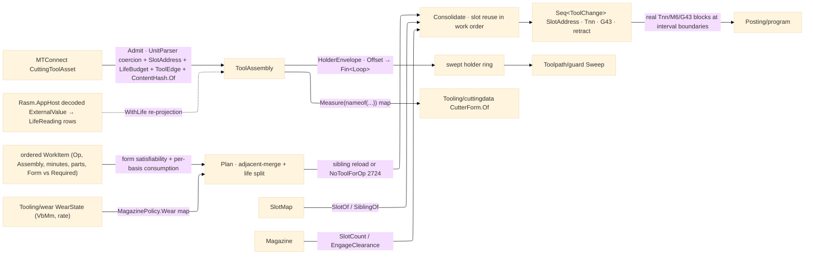

# [RASM_FABRICATION_TOOL_MAGAZINE]

The tool-magazine owner: `Magazine` the `[SmartEnum<string>]` physical magazine axis (carousel/turret/chain/rack/manual) the tool-change fold schedules against, `ToolAssembly` the fully-admitted per-slot tool — the `Process/physics#CUT_PARAMETER` `Tool` axis plus the ISO-13399 `MTConnect.NET-Common` `CuttingToolAsset` projected ONCE at `Admit` into fabrication-owned scalars, rows, and the `ContentHash.Of` identity — and the order-preserving tool-life `Schedule` fold consolidating a multi-operation job into the fewest `M6` swaps its operation order admits. The schedule is WIRED into the pipeline: the Cam fold consults it inside `Run(Cam)` conditioning, and `Posting/program` renders each `ToolChange` as the real `Tnn`/`M6`/`G43` block sequence at its interval boundary — the `Tnn` reading the projected `ProgramTool` and the `G43` offset the measured `GaugeLength`. The `ToolAssembly` holder swept envelope is the ONE `HolderEnvelope` projection `Toolpath/guard` consumes, so a stickout-limited tool tests its real holder footprint, never a zero-width spindle axis. The `Tool` cutting-data axis is `Process/physics#CUT_PARAMETER`'s — this page reads it and adds the PHYSICAL magazine/holder layer; the machinability model keyed by the assembly is `Tooling/cuttingdata`'s (`CutterForm.Of(ToolAssembly)` projects the owner#atoms `CutterForm` from the admitted measurement map there).

Admission is the ONE provider crossing: `Admit` reads the `ICuttingToolAsset` exactly once — schema-gated through `IsValid(MTConnectVersions.Version24)`, every ISO-13399 `Measurements.*` value coerced through the UnitsNet `UnitParser` off its `NativeUnits` token into the typed measurement map, the `Location` magazine address projected to the `SlotAddress` row (`LocationType` + pot — never an ad-hoc int), the `ToolLife`/`ItemLife` budgets projected to `LifeBudget` rows whose `Used` honors `CountDirection` (`UP` toward the limit, `DOWN` toward zero), the per-insert `CuttingItems` projected to `ToolEdge` rows (grade, per-edge status, per-edge life, per-edge measurements — an indexable tool wears and retires PER EDGE), the `ProcessFeedRate`/`ProcessSpindleSpeed` vendor envelope projected to `SpeedRange` rows the resolved cutting data clamps against, and `ReconditionCount` projected beside its `MaximumCount` ceiling. No `ICuttingToolAsset` or `IToolingMeasurement` survives past `Admit` — the interior is total over the admitted carrier, and every scheduler or wear read is a fabrication-owned value. Identity mints ONCE through the kernel `ContentHash.Of` federation entry over the canonical `(measurement type, value)` byte pairs — the package `GenerateHash` is MTConnect-internal provenance, never a second folder mint.

Telemetry law: in-service life values refresh through the `Rasm.AppHost` decode seam as typed `LifeReading` rows — the livewire MTConnect poll transport emits flat `ExternalValue` scalars, the AppHost decode lowers them to `(ToolLifeType, double)` readings upstream, and `WithLife` re-projects the assembly's `LifeBudget` rows against them; the seam binds designed-ahead as an injected typed-row contract and closes when the AppHost counterpart lands its decode side. XML/JSON wire serializers and HTTP/MQTT/SHDR transport are NEVER admitted here — the folder consumes only the `MTConnect.Assets.CuttingTools` model slice.

Wire posture: HOST-LOCAL. The `ToolChange` schedule and holder envelope cross only the in-process seam to the Cam conditioning and the `Posting/program` emitter; decoded life readings arrive as typed values across the AppHost seam; the asset crosses into `ToolAssembly` at the `Admit` boundary and the interior reads only projected values.

## [01]-[INDEX]

- [01]-[TOOL_MAGAZINE]: owns the `Magazine` slot-map axis, the `SlotAddress`/`LifeBudget`/`SpeedRange`/`ToolEdge`/`LifeReading` admitted rows, the `ToolAssembly` `[ComplexValueObject]`, the `SlotMap`/`WorkItem`/`ToolChange`/`MagazinePolicy` records, the order-preserving life-split `Schedule` fold, the `HolderEnvelope` projection, the `Admit`/`WithLife` catalogue boundary, and the `AdmitMagazine` span-keyed axis boundary.

## [02]-[TOOL_MAGAZINE]

- Owner: `Magazine` `[SmartEnum<string>]` (`carousel`/`turret`/`chain`/`rack`/`manual`) carrying `SlotCount` and `EngageClearance`; `SlotAddress` the projected MTConnect magazine address (`LocationType Kind` + `Pot`); `LifeBudget` the direction-honoring life row (`Basis`/`Value`/`Initial`/`Limit`/`Warning`/`Direction` with derived `Used`/`Remaining`/`Fraction`); `SpeedRange` the vendor envelope row (`Min`/`Max`/`Nominal`); `ToolEdge` the per-insert row (`Indices`/`Grade`/`Status`/`Life`/`Mm`); `ToolAssembly` `[ComplexValueObject]` the fully-admitted per-slot tool — physics `Tool`, holder `Loop`, measured scalars, measurement map, address, status set, life rows, edge rows, feed/spindle envelopes, recondition counters, and the `ContentHash.Of` `Identity`; `LifeReading` the decoded telemetry refresh row; `SlotMap` the address→assembly assignment keyed by `Identity`; `WorkItem` the ordered work row (`Op`, `Assembly`, `CutMinutes`, `Parts`, resolved `Form`, demanded `Required`); `ToolChange` the scheduled swap (`Slot`, `ProgramTool` Tnn, `LengthOffset` G43, `Retract`, `MidJob`, `ManualConfirm`); `MagazinePolicy` the schedule knobs (`SwapWeight`, `ManualConfirm`, `LifeBasis`, the `Wear` modelled-wear map); `ToolMagazine` the static surface owning `Schedule`, `HolderEnvelope`, `Admit`, `WithLife`, and `AdmitMagazine`.
- Cases: `Magazine` rows 5 — `carousel` (indexed disc, 24) · `turret` (lathe, 12) · `chain` (HMC chain, 60) · `rack` (gantry rack, 8) · `manual` (1, operator-confirmed); `Schedule` folds the ORDERED work list into tool-loaded intervals — adjacent same-`Identity` items merge into one interval (operation order is `Process/derivation`'s and never reorders here), an interval whose accumulated consumption exceeds its basis budget splits into a `MidJob` reload of an identical-`Tool` sibling slot, and a life split with NO fresh sibling routes `FabricationFault.NoToolForOp` 2724 — a worn tool retires mid-program, never phantom-reloads as itself; a work item whose demanded `Required` form the resolved assembly `Form` cannot satisfy (family, diameter band, flute reach) routes the same 2724 — the SCHEDULING failure, orthogonal to `Tooling/cuttingdata`'s missing-DATA `MachinabilityUnknown` 2712.
- Entry: `public static Fin<Seq<ToolChange>> Schedule(Magazine magazine, SlotMap slots, Seq<WorkItem> work, MagazinePolicy policy)` — `Fin<T>` routes `NoToolForOp` on form mismatch or sibling-less life exhaustion and `GeometryFault.DegenerateInput` when the distinct-tool count (after life-split reloads) exceeds `SlotCount`; `public static Fin<Loop> HolderEnvelope(ToolAssembly assembly)` projects the swept holder footprint on the rail — an offset failure is a typed failure, never a silently un-inflated ring; `public static Fin<ToolAssembly> Admit(Tool tool, ICuttingToolAsset asset, Loop holder)` the ONE provider crossing; `public static ToolAssembly WithLife(ToolAssembly assembly, Seq<LifeReading> readings)` the decoded-telemetry re-projection; `public static Fin<Magazine> AdmitMagazine(ReadOnlySpan<char> key)` the span-keyed axis boundary.
- Auto: per-basis consumption is the policy's law — `MINUTES` accumulates `CutMinutes`, `PART_COUNT` accumulates `Parts`, `WEAR` advances the modelled VB by `policy.Wear` rate × `CutMinutes` against the row's criterion (`Tooling/wear` produces the `(VbMm, RatePerMin)` receipt values the map carries — magazine schedules, wear models, never the reverse); the basis budget reads the assembly's `LifeBudget.Remaining` under `CountDirection`; `Consolidate` walks the interval sequence in work order, reusing a mounted slot at zero cost and drawing a free slot at `SwapWeight` load, each boundary emitting one `ToolChange` with its `SlotAddress`, `ProgramTool`, `GaugeLength` offset, and `EngageClearance` retract; a `manual` magazine stamps `ManualConfirm`. `HolderEnvelope` inflates the holder footprint by the projected-stickout margin through `Geometry2D/algebra#POLYGON_ALGEBRA` `Offset` — the ONE envelope `Toolpath/guard` sweeps. `Admit` coerces each measurement through `UnitParser.Default.TryParse<LengthUnit>`/`TryParse<AngleUnit>` off `NativeUnits` (an unparsed token admits the raw value), reads `FunctionalLengthMeasurement`→`GaugeLength` (`OverallToolLengthMeasurement` fallback), `UsableLengthMaxMeasurement`→`Stickout`, `ShankDiameterMeasurement`→`ShankDiameter` (the physics `Tool.Runout` column carries measured runout — a shank diameter never relabels as runout), rejects a `BROKEN`/`EXPIRED` status set, and mints `Identity` over the type-name-keyed measurement bytes.
- Receipt: the `Seq<ToolChange>` IS the typed tool-management evidence — address, Tnn, length offset, retract, life-reload and confirm flags, exactly what `Posting/program` renders as blocks; the assembly identity is the one `ContentHash.Of` digest; no generic tooling ledger.
- Packages: `Process/physics#CUT_PARAMETER` (`Tool`/`Operation` — composed), `MTConnect.NET-Common` (`MTConnect.Assets.CuttingTools` model slice — `ICuttingToolAsset`/`ICuttingToolLifeCycle`/`ICuttingItem`, `CutterStatusType`, `ToolLifeType`/`CountDirectionType`, `LocationType`, typed `Measurements.*` subtypes, `IsValid(Version)`; the `.api/api-mtconnect-net-common.md` catalogue; no wire serializer, no transport), `Rasm` (`ContentHash.Of` — the ONE identity mint), `UnitsNet` (`UnitParser.Default.TryParse<LengthUnit>`/`TryParse<AngleUnit>`, `Length.From`/`Angle.From` — the typed `NativeUnits` coercion), `Geometry2D/algebra#POLYGON_ALGEBRA` (`Offset` — the holder-envelope inflation), `Rhino.Geometry` (`Point3d`), Thinktecture.Runtime.Extensions, LanguageExt.Core, BCL inbox; cross-package: ← `Rasm.AppHost` decoded telemetry — the livewire MTConnect poll transport emits `ExternalValue` scalars whose AppHost decode lowers to the typed `LifeReading` rows `WithLife` re-projects (designed-ahead; closes when the decode counterpart lands).
- Growth: a new magazine type is one `Magazine` row; a probe-after-change verification is one `ToolChange` arm composing `Verify/probing`'s tool-length cycle writing the measured length back through `WithLife`; a new life basis is the `ToolLifeType` row the policy already selects; a per-edge schedule (rotating an indexable insert instead of swapping the body) is one `SiblingOf` widening over `ToolAssembly.Edges`; a shop-level crib/kitting tier is input-carried registry data over this page's `SlotMap` — a kitting fold beside `Schedule`, never a mutable store; zero new surface.
- Boundary: `ToolMagazine` is the ONE tool-management owner and a flat one-tool-per-toolpath assumption is the deleted form; the assembly identity is the `ContentHash.Of` digest minted ONCE at `Admit` — a `GenerateHash` call as folder identity is the second-hasher defect (K9); the asset crosses ONCE and an `ICuttingToolAsset`/`IToolingMeasurement` in any post-admission signature is the seam violation — consumers read the admitted map through `Measure(nameof(...))`; the slot key is the projected `SlotAddress` and an ad-hoc int slot is the rejected form the folder catalogue names; life arithmetic honors `CountDirection` and a bare `Value/Limit` read on a count-down controller is the inverted-remaining defect; the holder envelope is the ONE `HolderEnvelope` projection over the ONE `PolygonAlgebra.Offset` and its failure rides the rail — per-consumer re-derived footprints and a swallowed offset fallback are the deleted forms; the schedule preserves work order and a globally re-ordered interval walk is the deleted form (operation precedence is derivation's); the modelled-wear map carries `Tooling/wear`'s receipt values and a scheduler-side wear model is the deleted form; transport is AppHost livewire's — reaching for XML/JSON/SHDR from this folder is the rejected form.

```csharp signature
// --- [RUNTIME_PRELUDE] ----------------------------------------------------------------------------------------------------------------------------
using System.Buffers;
using System.Buffers.Binary;
using System.Text;
using LanguageExt;
using LanguageExt.Common;
using MTConnect.Assets.CuttingTools;
using MTConnect.Assets.CuttingTools.Measurements;
using Rasm.Domain;                        // ContentHash — the one identity mint
using Rasm.Fabrication.Geometry2D;
using Rasm.Fabrication.Process;
using Rhino.Geometry;
using Thinktecture;
using UnitsNet;
using UnitsNet.Units;
using static LanguageExt.Prelude;

namespace Rasm.Fabrication.Tooling;

// --- [TYPES] --------------------------------------------------------------------------------------------------------------------------------------
[SmartEnum<string>]
public sealed partial class Magazine {
    public static readonly Magazine Carousel = new("carousel", slotCount: 24, engageClearance: 50.0);
    public static readonly Magazine Turret = new("turret", slotCount: 12, engageClearance: 20.0);
    public static readonly Magazine Chain = new("chain", slotCount: 60, engageClearance: 60.0);
    public static readonly Magazine Rack = new("rack", slotCount: 8, engageClearance: 120.0);
    public static readonly Magazine Manual = new("manual", slotCount: 1, engageClearance: 100.0);

    public int SlotCount { get; }
    public double EngageClearance { get; }
}

// --- [MODELS] -------------------------------------------------------------------------------------------------------------------------------------
public readonly record struct SlotAddress(LocationType Kind, int Pot);

// Direction-honoring life row: UP consumes toward Limit, DOWN counts toward zero off Initial (Limit fallback).
public readonly record struct LifeBudget(ToolLifeType Basis, double Value, double Initial, double Limit, double Warning, CountDirectionType Direction) {
    public double Used => Direction == CountDirectionType.DOWN ? Math.Max(0.0, (Initial > 0.0 ? Initial : Limit) - Value) : Value;

    public double Remaining => Limit <= 0.0 ? double.PositiveInfinity : Math.Max(0.0, Limit - Used);

    public double Fraction => Limit <= 0.0 ? 1.0 : Math.Clamp(1.0 - Used / Limit, 0.0, 1.0);
}

public readonly record struct SpeedRange(double Min, double Max, double Nominal);

public sealed record ToolEdge(string Indices, string Grade, Seq<CutterStatusType> Status, Seq<LifeBudget> Life, Map<string, double> Mm);

// The fully-admitted per-slot tool: no provider type survives past Admit. Mm keys by measurement type name,
// so a consumer read is Measure(nameof(CornerRadiusMeasurement)) — symbolic at every read site.
[ComplexValueObject]
public sealed partial class ToolAssembly {
    public Tool Tool { get; }
    public Loop Holder { get; }
    public double GaugeLength { get; }
    public double Stickout { get; }
    public double ShankDiameter { get; }
    public int ProgramTool { get; }
    public SlotAddress Address { get; }
    public Seq<CutterStatusType> Status { get; }
    public Seq<LifeBudget> Life { get; }
    public Arr<ToolEdge> Edges { get; }
    public Map<string, double> Mm { get; }
    public SpeedRange Feed { get; }
    public SpeedRange Spindle { get; }
    public int Recondition { get; }
    public int ReconditionMax { get; }
    public UInt128 Identity { get; }

    public Option<double> Measure(string measurement) => Mm.Find(measurement);

    public double RemainingFraction(ToolLifeType basis) =>
        Life.Find(l => l.Basis == basis).Map(static l => l.Fraction).IfNone(1.0);

    public bool Spent => Status.Exists(static s => s is CutterStatusType.BROKEN or CutterStatusType.EXPIRED);
}

public readonly record struct LifeReading(ToolLifeType Basis, double Value);

// Op order is fixed upstream; Form is the assembly's resolved CutterForm (the caller composes CutterForm.Of),
// Required the operation's demanded form — Schedule tests the pair, never the Tool identity alone.
public readonly record struct WorkItem(Operation Op, ToolAssembly Assembly, double CutMinutes, int Parts, CutterForm Form, CutterForm Required);

public sealed record SlotMap(Seq<(SlotAddress Slot, ToolAssembly Assembly)> Slots) {
    public static readonly SlotMap Empty = new(Seq<(SlotAddress, ToolAssembly)>());

    public Option<SlotAddress> SlotOf(ToolAssembly a) =>
        Slots.Find(s => s.Assembly.Identity == a.Identity).Map(static s => s.Slot);

    // A fresh slot holding an identical-Tool sibling instance the life-split reload mounts.
    public Option<(SlotAddress Slot, ToolAssembly Assembly)> SiblingOf(ToolAssembly worn) =>
        Slots.Find(s => !s.Assembly.Spent && s.Assembly.Tool == worn.Tool && s.Assembly.Identity != worn.Identity);
}

public readonly record struct ToolChange(SlotAddress Slot, int ProgramTool, double LengthOffset, double Retract, bool MidJob, bool ManualConfirm);

// Wear carries Tooling/wear's modelled (VbMm, RatePerMin) receipt values keyed by assembly Identity — the
// WEAR life basis resolves against the MODELLED wear, never a scheduler-side wear model.
public readonly record struct MagazinePolicy(double SwapWeight, bool ManualConfirm, ToolLifeType LifeBasis, Map<UInt128, (double VbMm, double RatePerMin)> Wear) {
    public static readonly MagazinePolicy Canonical = new(SwapWeight: 1.0, ManualConfirm: false, ToolLifeType.MINUTES, Map<UInt128, (double, double)>());
}

// --- [OPERATIONS] ---------------------------------------------------------------------------------------------------------------------------------
public static class ToolMagazine {
    public static Fin<Seq<ToolChange>> Schedule(Magazine magazine, SlotMap slots, Seq<WorkItem> work, MagazinePolicy policy) =>
        work.Find(w => !Fits(w.Form, w.Required)).Match(
            Some: w => Fin.Fail<Seq<ToolChange>>(FabricationFault.NoToolForOp(w.Op, w.Required).ToError()),
            None: () => Plan(work, policy).Bind(intervals =>
                intervals.Map(static i => i.Assembly.Identity).Distinct().Count > magazine.SlotCount
                    ? Fin.Fail<Seq<ToolChange>>(GeometryFault.DegenerateInput($"magazine:overflow:{magazine.SlotCount}").ToError())
                    : Fin.Succ(Consolidate(intervals, slots, magazine, policy))));

    public static Fin<Loop> HolderEnvelope(ToolAssembly assembly) =>
        PolygonAlgebra.Offset(Seq(assembly.Holder.AsCcw()), 0.1 * Math.Max(0.0, assembly.Stickout), OffsetEnds.Polygon)
            .Bind(static rings => rings.HeadOrNone().ToFin(GeometryFault.DegenerateInput("magazine:holder-empty").ToError()));

    // Form satisfiability: family identity, diameter within 2%, flute reach at least the demanded engagement.
    static bool Fits(CutterForm form, CutterForm required) =>
        form.Family == required.Family
        && Math.Abs(form.Diameter - required.Diameter) <= 0.02 * required.Diameter
        && form.FluteLength >= required.FluteLength;

    // Order-preserving intervals: adjacent same-Identity items merge; per-basis consumption (MINUTES minutes,
    // PART_COUNT parts, WEAR modelled-rate × minutes) splits an exhausting interval into a sibling reload —
    // a sibling-less split fails typed, never a phantom reload of the worn assembly.
    static Fin<Seq<(ToolAssembly Assembly, bool MidJob)>> Plan(Seq<WorkItem> work, MagazinePolicy policy) =>
        work.Fold(Fin.Succ((Intervals: Seq<(ToolAssembly, bool)>(), Spent: Map<UInt128, double>())), (acc, item) => acc.Bind(state => {
            double cost = policy.LifeBasis switch {
                var b when b == ToolLifeType.PART_COUNT => item.Parts,
                var b when b == ToolLifeType.WEAR => policy.Wear.Find(item.Assembly.Identity).Map(w => w.RatePerMin * item.CutMinutes).IfNone(0.0),
                _ => item.CutMinutes,
            };
            double floor = policy.LifeBasis == ToolLifeType.WEAR
                ? policy.Wear.Find(item.Assembly.Identity).Map(static w => w.VbMm).IfNone(0.0)
                : item.Assembly.Life.Find(l => l.Basis == policy.LifeBasis).Map(static l => l.Used).IfNone(0.0);
            double budget = item.Assembly.Life.Find(l => l.Basis == policy.LifeBasis).Map(static l => l.Limit).IfNone(double.PositiveInfinity);
            double used = state.Spent.Find(item.Assembly.Identity).IfNone(floor) + cost;
            bool reload = used > budget && double.IsFinite(budget);
            Seq<(ToolAssembly, bool)> merged = state.Intervals.LastOrNone().Exists(last => last.Item1.Identity == item.Assembly.Identity && !reload)
                ? state.Intervals
                : state.Intervals.Add((item.Assembly, reload));
            return Fin.Succ((merged, state.Spent.AddOrUpdate(item.Assembly.Identity, reload ? cost : used)));
        })).Map(static state => state.Intervals);

    // Minimal swaps within the fixed order: a mounted assembly reuses its slot at zero cost, a MidJob reload
    // mounts the sibling's slot, a free slot carries the SwapWeight load; every boundary is one Tnn/G43 pair.
    static Seq<ToolChange> Consolidate(Seq<(ToolAssembly Assembly, bool MidJob)> intervals, SlotMap slots, Magazine magazine, MagazinePolicy policy) =>
        intervals.Map(interval => {
            SlotAddress slot = (interval.MidJob
                    ? slots.SiblingOf(interval.Assembly).Map(static s => s.Slot)
                    : slots.SlotOf(interval.Assembly))
                .IfNone(interval.Assembly.Address);
            return new ToolChange(slot, interval.Assembly.ProgramTool, interval.Assembly.GaugeLength,
                magazine.EngageClearance, interval.MidJob, policy.ManualConfirm || magazine == Magazine.Manual);
        });

    // --- [BOUNDARIES] — the MTConnect asset crosses into the fully-admitted ToolAssembly ONCE -------------------------------------------------------
    public static Fin<ToolAssembly> Admit(Tool tool, ICuttingToolAsset asset, Loop holder) {
        if (!asset.IsValid(MTConnectVersions.Version24).IsValid)
            return Fin.Fail<ToolAssembly>(GeometryFault.DegenerateInput($"tool-assembly:invalid:{asset.ToolId}").ToError());
        ICuttingToolLifeCycle life = asset.CuttingToolLifeCycle;
        Seq<CutterStatusType> status = toSeq(life.CutterStatus);
        if (status.Exists(static s => s is CutterStatusType.BROKEN or CutterStatusType.EXPIRED))
            return Fin.Fail<ToolAssembly>(GeometryFault.DegenerateInput($"tool-assembly:spent:{asset.ToolId}").ToError());
        Map<string, double> mm = Coerced(life.Measurements);
        return mm.Find(nameof(FunctionalLengthMeasurement)).BiBind(Some, () => mm.Find(nameof(OverallToolLengthMeasurement))).Match(
            Some: gauge => Fin.Succ(ToolAssembly.Create(
                tool, holder.AsCcw(), gauge,
                mm.Find(nameof(UsableLengthMaxMeasurement)).IfNone(gauge),
                mm.Find(nameof(ShankDiameterMeasurement)).IfNone(tool.Diameter),
                life.ProgramToolNumber ?? 0,
                new SlotAddress(life.Location?.Type ?? LocationType.POT, int.TryParse($"{life.Location?.Value}", out int pot) ? pot : 0),
                status, Budgets(life.ToolLife), Edges(life.CuttingItems), mm,
                Range(life.ProcessFeedRate?.Minimum, life.ProcessFeedRate?.Maximum, life.ProcessFeedRate?.Nominal),
                Range(life.ProcessSpindleSpeed?.Minimum, life.ProcessSpindleSpeed?.Maximum, life.ProcessSpindleSpeed?.Nominal),
                (int)(life.ReconditionCount?.Value ?? 0), (int)(life.ReconditionCount?.MaximumCount ?? 0),
                Identity(mm, gauge))),
            None: () => Fin.Fail<ToolAssembly>(GeometryFault.DegenerateInput($"tool-assembly:no-length:{asset.ToolId}").ToError()));
    }

    // Decoded-telemetry refresh: the AppHost ExternalValue decode lowers to LifeReading rows; the matching
    // basis rows re-project their Value — pure re-projection, no provider re-admission.
    public static ToolAssembly WithLife(ToolAssembly assembly, Seq<LifeReading> readings) =>
        ToolAssembly.Create(assembly.Tool, assembly.Holder, assembly.GaugeLength, assembly.Stickout, assembly.ShankDiameter,
            assembly.ProgramTool, assembly.Address, assembly.Status,
            assembly.Life.Map(row => readings.Find(r => r.Basis == row.Basis).Map(r => row with { Value = r.Value }).IfNone(row)),
            assembly.Edges, assembly.Mm, assembly.Feed, assembly.Spindle, assembly.Recondition, assembly.ReconditionMax, assembly.Identity);

    public static Fin<Magazine> AdmitMagazine(ReadOnlySpan<char> key) =>
        Magazine.Validate(key, null, out Magazine? m) is { } fault
            ? Fin.Fail<Magazine>(GeometryFault.DegenerateInput($"magazine:{fault.Message}").ToError())
            : Fin.Succ(m!);

    // Typed unit coercion off NativeUnits: LengthUnit → mm, AngleUnit → degrees, unparsed token → raw value.
    static Map<string, double> Coerced(IEnumerable<IToolingMeasurement> measurements) =>
        toSeq(measurements).Fold(Map<string, double>(), static (acc, m) => acc.AddOrUpdate(m.GetType().Name,
            UnitParser.Default.TryParse<LengthUnit>(m.NativeUnits, null, out LengthUnit lu) ? Length.From(m.Value, lu).Millimeters
            : UnitParser.Default.TryParse<AngleUnit>(m.NativeUnits, null, out AngleUnit au) ? Angle.From(m.Value, au).Degrees
            : m.Value));

    static Seq<LifeBudget> Budgets(IEnumerable<IToolLife> rows) =>
        toSeq(rows).Map(static l => new LifeBudget(l.Type, l.Value, l.Initial, l.Limit, l.Warning, l.CountDirection));

    static Arr<ToolEdge> Edges(IEnumerable<ICuttingItem> items) =>
        toSeq(items).Map(static i => new ToolEdge($"{i.Indices}", $"{i.Grade}", toSeq(i.CutterStatus), Budgets(i.ItemLife), Coerced(i.Measurements))).ToArr();

    static SpeedRange Range(double? min, double? max, double? nominal) => new(min ?? 0.0, max ?? 0.0, nominal ?? 0.0);

    // The ONE identity mint: (measurement type name, value) pairs in type-name order + gauge → ContentHash.Of;
    // the association survives the digest, so equal value multisets under different codes never collide.
    static UInt128 Identity(Map<string, double> mm, double gauge) {
        var buffer = new ArrayBufferWriter<byte>();
        foreach ((string key, double value) in mm.Pairs.OrderBy(static p => p.Key, StringComparer.Ordinal)) {
            Encoding.UTF8.GetBytes(key, buffer);
            BinaryPrimitives.WriteDoubleLittleEndian(buffer.GetSpan(8), value);
            buffer.Advance(8);
        }
        BinaryPrimitives.WriteDoubleLittleEndian(buffer.GetSpan(8), gauge);
        buffer.Advance(8);
        return ContentHash.Of(buffer.WrittenSpan);
    }
}
```


