# [RASM_FABRICATION_TOOL_MAGAZINE]

The tool-magazine owner combines the physical `Magazine` axis, the fully admitted `ToolAssembly`, immutable crib inventory, and the order-preserving life-aware schedule. `ToolAssembly` projects the MTConnect cutting-tool asset once into typed dimensions, per-edge state, direction-aware budgets, feed/spindle envelopes, reconditioning state, holder geometry, and one `ContentHash.Of` identity over every field that changes scheduling, posting, clearance, or wear. `CutterForm.Of(ToolAssembly, FormPolicy)` consumes the typed measurement carrier, `HolderEnvelope` supplies the guard footprint, and `ToolChange` supplies posting's `Tnn`/`M6`/`G43` block evidence.

Admission is the ONE provider crossing: `Admit` reads the `ICuttingToolAsset` exactly once — schema-gated through `IsValid(MTConnectVersions.Version24)`, every ISO-13399 `Measurements.*` magnitude taken as `Value ?? Nominal` (a row carrying neither is dropped, never zero-faked) and coerced through the UnitsNet `UnitParser` off its `NativeUnits` token into the typed measurement map, the string `ProgramToolNumber` parsed to its positive Tnn integer, the `ProgramToolGroup` sibling-group token admitted as `ToolGroup`, the `Location` magazine address projected to the `SlotAddress` row (`LocationType` + pot — never an ad-hoc int) with `NegativeOverlap`/`PositiveOverlap` projected as `ReserveBefore`/`ReserveAfter` adjacent-pot reservations, the nullable `ToolLife`/`ItemLife` budgets lowered to `LifeBudget` rows only when a `Limit` exists (`Initial` defaults by `CountDirection` — `DOWN` from the larger of `Value` and `Limit`, `UP` from zero — and `Warning` defaults to `Limit`), the per-insert `CuttingItems` projected to `ToolEdge` rows (grade, per-edge status, per-edge life, per-edge measurements — an indexable tool wears and retires PER EDGE), the `ProcessFeedRate`/`ProcessSpindleSpeed` vendor envelope projected to `SpeedRange` rows the resolved cutting data clamps against, and `ReconditionCount` projected beside its `MaximumCount` ceiling. No `ICuttingToolAsset` or `IToolingMeasurement` survives past `Admit` — the interior is total over the admitted carrier, and every scheduler or wear read is a fabrication-owned value. Identity mints ONCE through the kernel `ContentHash.Of` federation entry over the canonical `(measurement type, value)` byte pairs — the package `GenerateHash` is MTConnect-internal provenance, never a second folder mint.

Telemetry law: in-service life values refresh as typed caller-injected `LifeReading` rows. `WithLife` re-projects the assembly's `LifeBudget` rows against `(ToolLifeType, double)` readings, while transport-specific observations remain outside the package. XML/JSON wire serializers and HTTP/MQTT/SHDR transport are NEVER admitted here — the folder consumes only the `MTConnect.Assets.CuttingTools` model slice.

Wire posture: HOST-LOCAL. The `ToolChange` schedule and holder envelope cross only the in-process seam to the Cam conditioning and the `Posting/program` emitter; decoded life readings arrive as caller-injected typed values; the asset crosses into `ToolAssembly` at the `Admit` boundary and the interior reads only projected values.

## [01]-[INDEX]

- [01]-[TOOL_MAGAZINE]: owns the `Magazine` slot-map axis, the `SlotAddress`/`LifeBudget`/`SpeedRange`/`ToolEdge`/`LifeReading` admitted rows, the `ToolAssembly` `[ComplexValueObject]`, the `SlotMap`/`WorkItem`/`ToolChange`/`MagazinePolicy` records, the order-preserving life-split `Schedule` fold, the `HolderEnvelope` projection, the `Admit`/`WithLife` catalogue boundary, and the `AdmitMagazine` span-keyed axis boundary.

## [02]-[TOOL_MAGAZINE]

- Owner: `Magazine` `[SmartEnum<string>]` (`carousel`/`turret`/`chain`/`rack`/`manual`) carrying `SlotCount` and `EngageClearance`; `SlotAddress` the projected MTConnect magazine address (`LocationType Kind` + `Pot`); `MeasurementDimension` + `MeasurementValue` the typed canonical measurement row; `LifeBudget` the direction-honoring life row (`Basis`/`Value`/`Initial`/`Limit`/`Warning`/`Direction` with derived `Used`/`Remaining`/`Fraction`); `SpeedRange` the vendor envelope row; `ToolEdge` the per-insert row; `ToolAssembly` `[ComplexValueObject]` the fully-admitted per-slot tool (Tnn, `ToolGroup` sibling token, `ReserveBefore`/`ReserveAfter` oversized-tool pot reservations, and the `NominalDiameter`/`NominalCornerRadius` total `Tool.Switch` projections consumers fall back on); `LifeReading` the decoded telemetry refresh row (`Edge` targets a `ToolEdge.Indices` row, `None` targets the body); `SlotMap` the loaded address assignments plus immutable crib inventory; `KittingReceipt` the loaded/staged/missing demand evidence; `WorkItem` the ordered work row; `ToolChange` the scheduled swap carrying its operation and basis-relative trigger; `MagazinePolicy` the selected confirmation, life basis, `FormDiameterBand` satisfiability band, `HolderClearance` envelope-inflation fraction, and modelled-wear evidence; `ToolMagazine` the static surface owning `Kit`, `Schedule`, `HolderEnvelope`, `Admit`, `WithLife`, and `AdmitMagazine`.
- Cases: `Magazine` rows 5 — `carousel` (indexed disc, 24) · `turret` (lathe, 12) · `chain` (HMC chain, 60) · `rack` (gantry rack, 8) · `manual` (1, operator-confirmed); `Schedule` folds the ORDERED work list into tool-loaded intervals — adjacent same-`Identity` items merge into one interval (operation order is `Process/derivation`'s and never reorders here), an interval whose accumulated consumption exceeds its basis budget splits into a `MidJob` reload of an identical-`Tool` sibling slot, and a life split with NO fresh sibling routes `FabricationFault.NoToolForOp` 2724 — a worn tool retires mid-program, never phantom-reloads as itself; a work item whose demanded `Required` form the resolved assembly `Form` cannot satisfy (family, `FormDiameterBand` diameter band, flute reach) routes the same 2724 — the SCHEDULING failure, orthogonal to `Tooling/cuttingdata`'s missing-DATA `MachinabilityUnknown` 2712. Sibling selection keys `ToolGroup` FIRST — two assemblies sharing a `ProgramToolGroup` are interchangeable by the controller's own declaration — and falls back to full structural comparison only when either side carries no group; slot validation rejects overlapping `Pot ± Reserve` ranges so an oversized tool never double-books its neighbors.
- Entry: `Kit` classifies demand by `InterchangeableWith` against loaded then crib tooling — a group-interchangeable sibling satisfies the demand before `Missing` is reported; `Schedule` produces the tool-change rail; `HolderEnvelope(assembly, Option<MagazinePolicy>)` produces the swept footprint inflated by the policy `HolderClearance` stickout fraction (`Canonical` when omitted); `Admit` is the provider crossing; `Fin<ToolAssembly> WithLife(ToolAssembly assembly, Seq<LifeReading> readings)` validates telemetry, reprojects body budgets and `Edge`-targeted per-insert budgets, and remints the state identity; `AdmitMagazine` is the span-keyed axis boundary.
- Auto: per-basis consumption is the policy's law — `MINUTES` accumulates `CutMinutes`, `PART_COUNT` accumulates `Parts`, and `WEAR` advances modelled `VB` by rate × minutes; a `WEAR` basis demands a `MagazinePolicy.Wear` row for every loaded assembly, and a missing row fails `magazine:wear-policy` typed instead of scheduling a silently-exhausted tool; `LifeBudget.Remaining` evaluates `UP` as `Limit − Value` and `DOWN` as `Value − Limit`, while `Capacity` spans `Initial` to `Limit`. `Plan` consumes every work item across as many fresh sibling identities as its cost requires, records the cumulative within-operation trigger for each reload, threads the active sibling per tool, and retires every exhausted identity; `Consolidate` resolves every interval to a loaded slot and never falls back to the worn assembly address. `Admit` rejects an unparseable measurement unit, stores length in millimetres, angle in degrees, mass in kilograms, and unitless values as scalars with an explicit dimension row, falls back to `NominalDiameter(tool)` for a missing shank measurement (the total `Tool.Switch` — never a root member the union does not carry), projects the complete lifecycle/edge envelope, and mints identity over every scheduling-, posting-, clearance-, and wear-relevant field including group and reservation.
- Receipt: the `Seq<ToolChange>` IS the typed tool-management evidence — operation, basis-relative trigger, address, Tnn, length offset, retract, life-reload, and confirm flags, exactly what `Posting/program` binds to operation boundaries or within-operation consumption points; the assembly identity is the one `ContentHash.Of` digest; no generic tooling ledger.
- Packages: `Process/physics#CUT_PARAMETER` (`Tool`/`Operation` — composed), `MTConnect.NET-Common` (`MTConnect.Assets.CuttingTools` model slice — `ICuttingToolAsset`/`ICuttingToolLifeCycle`/`ICuttingItem`, `CutterStatusType`, `ToolLifeType`/`CountDirectionType`, `LocationType`, typed `Measurements.*` subtypes, `IsValid(Version)`; the `.api/api-mtconnect-net-common.md` catalogue; no wire serializer, no transport), `Rasm` (`ContentHash.Of` — the ONE identity mint), `UnitsNet` (`UnitParser.Default.TryParse<LengthUnit>`/`TryParse<AngleUnit>`/`TryParse<MassUnit>`, `Length.From`/`Angle.From`/`Mass.From` — the typed `NativeUnits` coercion), `Geometry2D/algebra#POLYGON_ALGEBRA` (`Offset` — the holder-envelope inflation), `Rhino.Geometry` (`Point3d`), Thinktecture.Runtime.Extensions, LanguageExt.Core, BCL inbox.
- Growth: a new magazine type is one `Magazine` row; a probe-after-change verification is one `ToolChange` arm composing `Verify/probing`'s tool-length cycle writing the measured length back through `WithLife`; a new life basis is the `ToolLifeType` row the policy already selects; a per-edge schedule (rotating an indexable insert instead of swapping the body) is one `SiblingOf` widening over `ToolAssembly.Edges` — the edge-targeted `LifeReading.Edge` refresh already carries its telemetry; a shop-level crib/kitting tier is input-carried registry data over this page's `SlotMap` — a kitting fold beside `Schedule`, never a mutable store; zero new surface.
- Boundary: `ToolMagazine` is the ONE tool-management owner and a flat one-tool-per-toolpath assumption is the deleted form; the assembly identity is the `ContentHash.Of` digest minted ONCE at `Admit` — a `GenerateHash` call as folder identity is the second-hasher defect (K9); the asset crosses ONCE and an `ICuttingToolAsset`/`IToolingMeasurement` in any post-admission signature is the seam violation — consumers read the admitted map through `Measure(nameof(...))`; the slot key is the projected `SlotAddress` and an ad-hoc int slot is the rejected form the folder catalogue names; sibling interchangeability is the controller-declared `ProgramToolGroup` first and structural equality only as the group-less fallback — a measurement-exact-equality-only criterion never fires on real measured tools; life arithmetic honors `CountDirection` and a bare `Value/Limit` read on a count-down controller is the inverted-remaining defect; every satisfiability and clearance band is a `MagazinePolicy` value and an inline numeric band is the rejected form; the holder envelope is the ONE `HolderEnvelope` projection over the ONE `PolygonAlgebra.Offset` and its failure rides the rail — per-consumer re-derived footprints and a swallowed offset fallback are the deleted forms; the schedule preserves work order and a globally re-ordered interval walk is the deleted form (operation precedence is derivation's); the modelled-wear map carries `Tooling/wear`'s receipt values and a scheduler-side wear model is the deleted form; transport is AppHost livewire's — reaching for XML/JSON/SHDR from this folder is the rejected form.

```csharp signature
// --- [RUNTIME_PRELUDE] ----------------------------------------------------------------------------------------------------------------------------
using System.Buffers;
using System.Buffers.Binary;
using System.Text;
using LanguageExt;
using LanguageExt.Common;
using MTConnect.Assets.CuttingTools;
using MTConnect.Assets.CuttingTools.Measurements;
using Rasm.Domain;
using Rasm.Fabrication.Geometry2D;
using Rasm.Fabrication.Process;
using Rhino.Geometry;
using Thinktecture;
using UnitsNet;
using UnitsNet.Units;
using static LanguageExt.Prelude;

namespace Rasm.Fabrication.Tooling;

// --- [TYPES] --------------------------------------------------------------------------------------------------------------------------------------
[SmartEnum<string>]
public sealed partial class Magazine {
    public static readonly Magazine Carousel = new("carousel", slotCount: 24, engageClearance: 50.0);
    public static readonly Magazine Turret = new("turret", slotCount: 12, engageClearance: 20.0);
    public static readonly Magazine Chain = new("chain", slotCount: 60, engageClearance: 60.0);
    public static readonly Magazine Rack = new("rack", slotCount: 8, engageClearance: 120.0);
    public static readonly Magazine Manual = new("manual", slotCount: 1, engageClearance: 100.0);

    public int SlotCount { get; }
    public double EngageClearance { get; }
}

// --- [MODELS] -------------------------------------------------------------------------------------------------------------------------------------
public readonly record struct SlotAddress(LocationType Kind, int Pot);

[SmartEnum<string>]
public sealed partial class MeasurementDimension {
    public static readonly MeasurementDimension Length = new("length");
    public static readonly MeasurementDimension Angle = new("angle");
    public static readonly MeasurementDimension Mass = new("mass");
    public static readonly MeasurementDimension Scalar = new("scalar");
}

public readonly record struct MeasurementValue(double Canonical, MeasurementDimension Dimension, string Unit);

public readonly record struct LifeBudget(ToolLifeType Basis, double Value, double Initial, double Limit, double Warning, CountDirectionType Direction) {
    public bool Valid => double.IsFinite(Value) && double.IsFinite(Initial) && double.IsFinite(Limit) && double.IsFinite(Warning)
        && (Direction == CountDirectionType.DOWN
            ? Initial >= Limit && Value <= Initial && Warning <= Initial && Warning >= Limit
            : Initial <= Limit && Value >= Initial && Warning >= Initial && Warning <= Limit);

    public double Capacity => Direction == CountDirectionType.DOWN ? Math.Max(0.0, Initial - Limit) : Math.Max(0.0, Limit - Initial);

    public double Used => Direction == CountDirectionType.DOWN ? Math.Max(0.0, Initial - Value) : Math.Max(0.0, Value - Initial);

    public double Remaining => Direction == CountDirectionType.DOWN ? Math.Max(0.0, Value - Limit) : Math.Max(0.0, Limit - Value);

    public double Fraction => Capacity <= 0.0 ? (Remaining > 0.0 ? 1.0 : 0.0) : Math.Clamp(Remaining / Capacity, 0.0, 1.0);
}

public readonly record struct SpeedRange(Option<double> Min, Option<double> Max, Option<double> Nominal);

public sealed record ToolEdge(string Indices, string Grade, Seq<CutterStatusType> Status, Seq<LifeBudget> Life, Map<string, MeasurementValue> Measurements) {
    public bool Spent => Status.Exists(static status => status is CutterStatusType.BROKEN or CutterStatusType.EXPIRED);

    public double Remaining(ToolLifeType basis) =>
        Life.Find(life => life.Basis == basis).Map(static life => life.Remaining).IfNone(double.PositiveInfinity);
}

[ComplexValueObject]
public sealed partial class ToolAssembly {
    public Tool Tool { get; }
    public Loop Holder { get; }
    public double GaugeLength { get; }
    public double Stickout { get; }
    public double ShankDiameter { get; }
    public int ProgramTool { get; }
    public Option<string> ToolGroup { get; }
    public SlotAddress Address { get; }
    public int ReserveBefore { get; }
    public int ReserveAfter { get; }
    public Seq<CutterStatusType> Status { get; }
    public Seq<LifeBudget> Life { get; }
    public Arr<ToolEdge> Edges { get; }
    public Map<string, MeasurementValue> Measurements { get; }
    public SpeedRange Feed { get; }
    public SpeedRange Spindle { get; }
    public int Recondition { get; }
    public int ReconditionMax { get; }
    public UInt128 Identity { get; }

    public static double NominalDiameter(Tool tool) => tool.Switch(
        rotary: static r => r.Diameter, wheel: static w => w.Diameter, sawBlade: static s => s.Diameter,
        turning: static t => t.CuttingEdgeLength, head: static h => h.Diameter);

    public static double NominalCornerRadius(Tool tool) => tool.Switch(
        rotary: static r => r.CornerRadius, wheel: static _ => 0.0, sawBlade: static _ => 0.0,
        turning: static t => t.NoseRadius, head: static _ => 0.0);

    public Option<double> Measure(string measurement) => Measurements.Find(measurement).Map(static value => value.Canonical);

    public double Remaining(ToolLifeType basis) {
        double body = Life.Find(life => life.Basis == basis).Map(static life => life.Remaining).IfNone(double.PositiveInfinity);
        double edge = toSeq(Edges.Filter(static item => !item.Spent).Map(item => item.Remaining(basis))
            .OrderByDescending(static remaining => remaining)).Head.IfNone(double.PositiveInfinity);
        return Math.Min(body, edge);
    }

    public bool Spent => Status.Exists(static status => status is CutterStatusType.BROKEN or CutterStatusType.EXPIRED)
        || (!Edges.IsEmpty && Edges.ForAll(static edge => edge.Spent));

    public bool InterchangeableWith(ToolAssembly other) =>
        ToolGroup.Bind(group => other.ToolGroup.Map(peer => group == peer)).IfNone(() =>
            Tool == other.Tool && Holder.Equals(other.Holder)
            && GaugeLength == other.GaugeLength && Stickout == other.Stickout && ShankDiameter == other.ShankDiameter
            && Measurements.Equals(other.Measurements) && Feed == other.Feed && Spindle == other.Spindle
            && Edges.Count == other.Edges.Count
            && Edges.ForAll(edge => other.Edges.Exists(candidate => candidate.Indices == edge.Indices && candidate.Grade == edge.Grade
                && candidate.Measurements.Equals(edge.Measurements))));
}

public readonly record struct LifeReading(ToolLifeType Basis, double Value, Option<string> Edge);

public readonly record struct WorkItem(Operation Op, ToolAssembly Assembly, double CutMinutes, int Parts, CutterForm Form, CutterForm Required);

public sealed record SlotMap(Seq<(SlotAddress Slot, ToolAssembly Assembly)> Slots, Seq<ToolAssembly> Crib) {
    public static readonly SlotMap Empty = new(Seq<(SlotAddress, ToolAssembly)>(), Seq<ToolAssembly>());

    public Option<SlotAddress> SlotOf(ToolAssembly a) =>
        Slots.Find(s => s.Assembly.Identity == a.Identity).Map(static s => s.Slot);

    public Option<(SlotAddress Slot, ToolAssembly Assembly)> SiblingOf(ToolAssembly worn, Set<UInt128> retired, ToolLifeType basis) =>
        toSeq(Slots.Filter(s => !s.Assembly.Spent && s.Assembly.InterchangeableWith(worn) && s.Assembly.Identity != worn.Identity
                && !retired.Contains(s.Assembly.Identity))
            .OrderByDescending(slot => slot.Assembly.Remaining(basis))).Head;
}

public sealed record KittingReceipt(Seq<ToolAssembly> Loaded, Seq<ToolAssembly> Staged, Seq<(Operation Op, CutterForm Required)> Missing);

public readonly record struct ToolChange(Operation Op, ToolLifeType LifeBasis, ToolLifeType TriggerBasis, double Trigger, SlotAddress Slot, int ProgramTool,
    double LengthOffset, double Retract, bool MidJob, bool ManualConfirm);

public readonly record struct MagazinePolicy(bool ManualConfirm, ToolLifeType LifeBasis, double FormDiameterBand, double HolderClearance,
    Map<UInt128, (double VbMm, double RatePerMin, double LimitMm)> Wear) {
    public static readonly MagazinePolicy Canonical = new(ManualConfirm: false, ToolLifeType.MINUTES, FormDiameterBand: 0.02,
        HolderClearance: 0.1, Map<UInt128, (double, double, double)>());
}

// --- [OPERATIONS] ---------------------------------------------------------------------------------------------------------------------------------
public static class ToolMagazine {
    public static KittingReceipt Kit(SlotMap slots, Seq<WorkItem> work) {
        (Seq<ToolAssembly> Loaded, Seq<ToolAssembly> Staged, Seq<(Operation, CutterForm)> Missing) state =
            work.Fold((Loaded: Seq<ToolAssembly>(), Staged: Seq<ToolAssembly>(), Missing: Seq<(Operation, CutterForm)>()), (receipt, demand) =>
            receipt.Loaded.Exists(a => a.InterchangeableWith(demand.Assembly)) || receipt.Staged.Exists(a => a.InterchangeableWith(demand.Assembly))
                ? receipt
                : slots.Slots.Filter(s => !s.Assembly.Spent && s.Assembly.InterchangeableWith(demand.Assembly)).Head.Match(
                    Some: loaded => (receipt.Loaded.Add(loaded.Assembly), receipt.Staged, receipt.Missing),
                    None: () => slots.Crib.Find(a => !a.Spent && a.InterchangeableWith(demand.Assembly)).Match(
                        Some: staged => (receipt.Loaded, receipt.Staged.Add(staged), receipt.Missing),
                        None: () => (receipt.Loaded, receipt.Staged, receipt.Missing.Add((demand.Op, demand.Required))))));
        return new KittingReceipt(state.Loaded, state.Staged, state.Missing);
    }

    public static Fin<Seq<ToolChange>> Schedule(Magazine magazine, SlotMap slots, Seq<WorkItem> work, MagazinePolicy policy) =>
        from _ in Validate(magazine, slots, work, policy)
        from intervals in Plan(work, slots, policy)
        from changes in intervals.Map(static i => i.Assembly.Identity).Distinct().Count > magazine.SlotCount
            ? Fin.Fail<Seq<ToolChange>>(GeometryFault.DegenerateInput($"magazine:overflow:{magazine.SlotCount}").ToError())
            : Consolidate(intervals, slots, magazine, policy)
        select changes;

    public static Fin<Loop> HolderEnvelope(ToolAssembly assembly, Option<MagazinePolicy> policy = default) =>
        policy.IfNone(MagazinePolicy.Canonical) switch {
            { HolderClearance: var clearance } when !double.IsFinite(clearance) || clearance < 0.0 =>
                Fin.Fail<Loop>(GeometryFault.DegenerateInput("magazine:holder-clearance").ToError()),
            var resolved => OffsetPolicy.Admit(OffsetJoin.Round, OffsetEnd.Polygon, miterLimit: 2.0,
                    assembly.Holder.Tolerance.Absolute.Value)
                .Bind(offsetPolicy => PolygonAlgebra.Offset(Seq(assembly.Holder.AsCcw()),
                    resolved.HolderClearance * Math.Max(0.0, assembly.Stickout), offsetPolicy))
                .Bind(static rings => rings.Head.ToFin(GeometryFault.DegenerateInput("magazine:holder-empty").ToError())),
        };

    static bool Fits(CutterForm form, CutterForm required, MagazinePolicy policy) =>
        form.Family == required.Family
        && Math.Abs(form.Diameter - required.Diameter) <= policy.FormDiameterBand * required.Diameter
        && form.FluteLength >= required.FluteLength;

    static Fin<Seq<(ToolAssembly Assembly, Operation Op, CutterForm Required, ToolLifeType LifeBasis, ToolLifeType TriggerBasis,
        double Trigger, bool MidJob)>> Plan(
        Seq<WorkItem> work, SlotMap slots, MagazinePolicy policy) =>
        work.Fold(Fin.Succ((Intervals: Seq<(ToolAssembly, Operation, CutterForm, ToolLifeType, ToolLifeType, double, bool)>(),
                Spent: Map<UInt128, double>(), Active: Map<UInt128, ToolAssembly>(), Retired: Set<UInt128>())),
            (rail, item) => rail.Bind(state => {
                ToolAssembly assembly = state.Active.Find(item.Assembly.Identity).IfNone(item.Assembly);
                double cost = policy.LifeBasis == ToolLifeType.PART_COUNT ? item.Parts : item.CutMinutes;
                return Allocate(item, assembly, cost, 0.0, slots, policy, state);
            })).Map(static state => state.Intervals);

    static Fin<(Seq<(ToolAssembly, Operation, CutterForm, ToolLifeType, ToolLifeType, double, bool)> Intervals, Map<UInt128, double> Spent,
        Map<UInt128, ToolAssembly> Active, Set<UInt128> Retired)> Allocate(WorkItem item, ToolAssembly assembly, double demand, double trigger,
        SlotMap slots, MagazinePolicy policy,
        (Seq<(ToolAssembly, Operation, CutterForm, ToolLifeType, ToolLifeType, double, bool)> Intervals, Map<UInt128, double> Spent,
            Map<UInt128, ToolAssembly> Active, Set<UInt128> Retired) state) {
        double capacity = policy.LifeBasis == ToolLifeType.WEAR
            ? policy.Wear.Find(assembly.Identity).Map(static wear => wear.RatePerMin == 0.0
                ? double.PositiveInfinity
                : Math.Max(0.0, wear.LimitMm - wear.VbMm) / wear.RatePerMin).IfNone(0.0)
            : assembly.Remaining(policy.LifeBasis);
        double available = double.IsFinite(capacity)
            ? Math.Max(0.0, capacity - state.Spent.Find(assembly.Identity).IfNone(0.0))
            : double.PositiveInfinity;
        if (demand > 0.0 && available == 0.0)
            return slots.SiblingOf(assembly, state.Retired.Add(assembly.Identity), policy.LifeBasis)
                .ToFin(FabricationFault.NoToolForOp(item.Op, item.Required).ToError())
                .Bind(sibling => Allocate(item, sibling.Assembly, demand, trigger, slots, policy,
                    (state.Intervals, state.Spent, state.Active.AddOrUpdate(item.Assembly.Identity, sibling.Assembly),
                        state.Retired.Add(assembly.Identity))));
        double consumed = Math.Min(demand, available);
        ToolLifeType triggerBasis = policy.LifeBasis == ToolLifeType.PART_COUNT ? ToolLifeType.PART_COUNT : ToolLifeType.MINUTES;
        Seq<(ToolAssembly, Operation, CutterForm, ToolLifeType, ToolLifeType, double, bool)> intervals =
            state.Intervals.Last.Exists(last => last.Item1.Identity == assembly.Identity)
                ? state.Intervals
                : state.Intervals.Add((assembly, item.Op, item.Required, policy.LifeBasis, triggerBasis, trigger, trigger > 0.0));
        (Seq<(ToolAssembly, Operation, CutterForm, ToolLifeType, ToolLifeType, double, bool)> Intervals, Map<UInt128, double> Spent,
            Map<UInt128, ToolAssembly> Active, Set<UInt128> Retired) next =
            (intervals, state.Spent.AddOrUpdate(assembly.Identity,
                state.Spent.Find(assembly.Identity).IfNone(0.0) + consumed), state.Active, state.Retired);
        if (!double.IsFinite(available) || demand <= available)
            return Fin.Succ((next.Intervals, next.Spent, next.Active.AddOrUpdate(item.Assembly.Identity, assembly), next.Retired));
        return slots.SiblingOf(assembly, next.Retired.Add(assembly.Identity), policy.LifeBasis)
            .ToFin(FabricationFault.NoToolForOp(item.Op, item.Required).ToError())
            .Bind(sibling => Allocate(item, sibling.Assembly, demand - consumed, trigger + consumed, slots, policy,
                (next.Intervals, next.Spent, next.Active.AddOrUpdate(item.Assembly.Identity, sibling.Assembly),
                    next.Retired.Add(assembly.Identity))));
    }

    static Fin<Seq<ToolChange>> Consolidate(
        Seq<(ToolAssembly Assembly, Operation Op, CutterForm Required, ToolLifeType LifeBasis, ToolLifeType TriggerBasis,
            double Trigger, bool MidJob)> intervals,
        SlotMap slots, Magazine magazine, MagazinePolicy policy) =>
        intervals.TraverseM(interval => slots.SlotOf(interval.Assembly)
            .ToFin(FabricationFault.NoToolForOp(interval.Op, interval.Required).ToError())
            .Map(slot => new ToolChange(interval.Op, interval.LifeBasis, interval.TriggerBasis, interval.Trigger, slot,
                interval.Assembly.ProgramTool, interval.Assembly.GaugeLength, magazine.EngageClearance,
                interval.MidJob, policy.ManualConfirm || magazine == Magazine.Manual))).As();

    static Fin<Unit> Validate(Magazine magazine, SlotMap slots, Seq<WorkItem> work, MagazinePolicy policy) =>
        magazine.SlotCount <= 0 || !double.IsFinite(magazine.EngageClearance) || magazine.EngageClearance < 0.0
        || !double.IsFinite(policy.FormDiameterBand) || policy.FormDiameterBand <= 0.0
        || !double.IsFinite(policy.HolderClearance) || policy.HolderClearance < 0.0
        || slots.Slots.Count > magazine.SlotCount
        || slots.Slots.Exists(row => row.Slot.Pot - row.Assembly.ReserveBefore <= 0
            || row.Slot.Pot + row.Assembly.ReserveAfter > magazine.SlotCount || row.Assembly.Spent)
        || slots.Slots.Exists(row => slots.Slots.Exists(peer => peer.Assembly.Identity != row.Assembly.Identity
            && peer.Slot.Kind == row.Slot.Kind
            && peer.Slot.Pot - peer.Assembly.ReserveBefore <= row.Slot.Pot + row.Assembly.ReserveAfter
            && row.Slot.Pot - row.Assembly.ReserveBefore <= peer.Slot.Pot + peer.Assembly.ReserveAfter))
        || slots.Slots.Map(static row => row.Assembly.Identity).Distinct().Count != slots.Slots.Count
        || slots.Slots.Map(static row => row.Assembly.ProgramTool).Distinct().Count != slots.Slots.Count
            ? Fin.Fail<Unit>(GeometryFault.DegenerateInput("magazine:slot-map").ToError())
            : work.Find(item => !double.IsFinite(item.CutMinutes) || item.CutMinutes < 0.0 || item.Parts < 0
                || !double.IsFinite(item.Form.Diameter) || item.Form.Diameter <= 0.0
                || !double.IsFinite(item.Form.FluteLength) || item.Form.FluteLength < 0.0
                || !double.IsFinite(item.Required.Diameter) || item.Required.Diameter <= 0.0
                || !double.IsFinite(item.Required.FluteLength) || item.Required.FluteLength < 0.0
                || !Fits(item.Form, item.Required, policy)).Match(
                Some: item => Fin.Fail<Unit>(FabricationFault.NoToolForOp(item.Op, item.Required).ToError()),
                None: () => policy.Wear.Pairs.Exists(static pair => !double.IsFinite(pair.Value.VbMm) || pair.Value.VbMm < 0.0
                        || !double.IsFinite(pair.Value.RatePerMin) || pair.Value.RatePerMin < 0.0
                        || !double.IsFinite(pair.Value.LimitMm) || pair.Value.LimitMm < pair.Value.VbMm)
                    || (policy.LifeBasis == ToolLifeType.WEAR
                        && slots.Slots.Exists(row => policy.Wear.Find(row.Assembly.Identity).IsNone))
                    ? Fin.Fail<Unit>(GeometryFault.DegenerateInput("magazine:wear-policy").ToError())
                    : Fin.Succ(unit));

    // --- [BOUNDARIES] -------------------------------------------------------------------------------------------------------------------------------
    public static Fin<ToolAssembly> Admit(Tool tool, ICuttingToolAsset asset, Loop holder) {
        if (!asset.IsValid(MTConnectVersions.Version24).IsValid)
            return Fin.Fail<ToolAssembly>(GeometryFault.DegenerateInput($"tool-assembly:invalid:{asset.ToolId}").ToError());
        ICuttingToolLifeCycle life = asset.CuttingToolLifeCycle;
        Seq<CutterStatusType> status = toSeq(life.CutterStatus);
        if (status.Exists(static s => s is CutterStatusType.BROKEN or CutterStatusType.EXPIRED))
            return Fin.Fail<ToolAssembly>(GeometryFault.DegenerateInput($"tool-assembly:spent:{asset.ToolId}").ToError());
        return from measurements in Coerced(life.Measurements)
               from edges in Edges(life.CuttingItems)
               from budgets in Budgets(toSeq(life.ToolLife).Map(static row =>
                   (row.Type, row.Value, row.Initial, row.Limit, row.Warning, row.CountDirection)))
               from programTool in Optional(life.ProgramToolNumber)
                   .Bind(static text => int.TryParse(text, out int number) && number > 0 ? Some(number) : None)
                   .ToFin(GeometryFault.DegenerateInput($"tool-assembly:no-program-tool:{asset.ToolId}").ToError())
               from location in Optional(life.Location)
                   .ToFin(GeometryFault.DegenerateInput($"tool-assembly:no-location:{asset.ToolId}").ToError())
               from pot in int.TryParse(location.Value, out int parsedPot) && parsedPot > 0
                   ? Fin.Succ(parsedPot)
                   : Fin.Fail<int>(GeometryFault.DegenerateInput($"tool-assembly:bad-location:{asset.ToolId}").ToError())
               from gauge in (measurements.Find(nameof(FunctionalLengthMeasurement)) | measurements.Find(nameof(OverallToolLengthMeasurement)))
                   .Map(static value => value.Canonical).ToFin(GeometryFault.DegenerateInput($"tool-assembly:no-length:{asset.ToolId}").ToError())
               from feed in Range(life.ProcessFeedRate?.Minimum, life.ProcessFeedRate?.Maximum, life.ProcessFeedRate?.Nominal, asset.ToolId)
               from spindle in Range(life.ProcessSpindleSpeed?.Minimum, life.ProcessSpindleSpeed?.Maximum,
                   life.ProcessSpindleSpeed?.Nominal, asset.ToolId)
               let recondition = life.ReconditionCount?.Value ?? 0
               let reconditionMax = life.ReconditionCount?.MaximumCount ?? 0
               from validRecondition in recondition >= 0 && reconditionMax >= recondition
                   ? Fin.Succ(unit)
                   : Fin.Fail<Unit>(GeometryFault.DegenerateInput($"tool-assembly:recondition:{asset.ToolId}").ToError())
               let ring = holder.AsCcw()
               let stickout = (measurements.Find(nameof(ProtrudingLengthMeasurement)) | measurements.Find(nameof(UsableLengthMaxMeasurement)))
                   .Map(static value => value.Canonical).IfNone(gauge)
               let shank = measurements.Find(nameof(ShankDiameterMeasurement)).Map(static value => value.Canonical)
                   .IfNone(ToolAssembly.NominalDiameter(tool))
               let group = Optional(life.ProgramToolGroup).Filter(static text => !string.IsNullOrWhiteSpace(text))
               let address = new SlotAddress(location.Type, pot)
               let reserveBefore = Math.Max(0, location.NegativeOverlap ?? 0)
               let reserveAfter = Math.Max(0, location.PositiveOverlap ?? 0)
               select ToolAssembly.Create(
                tool, ring, gauge, stickout, shank, programTool, group, address, reserveBefore, reserveAfter,
                status, budgets, edges, measurements, feed, spindle, recondition, reconditionMax,
                Identity(tool, ring, gauge, stickout, shank, programTool, group, address, reserveBefore, reserveAfter,
                    status, budgets, edges, measurements, feed, spindle, recondition, reconditionMax));
    }

    public static Fin<ToolAssembly> WithLife(ToolAssembly assembly, Seq<LifeReading> readings) {
        if (readings.Exists(static reading => !double.IsFinite(reading.Value))
            || readings.Map(static reading => (reading.Basis, Edge: reading.Edge.IfNone(""))).Distinct().Count != readings.Count
            || readings.Exists(reading => reading.Edge.Exists(edge => !assembly.Edges.Exists(row => row.Indices == edge))))
            return Fin.Fail<ToolAssembly>(GeometryFault.DegenerateInput("tool-assembly:life-reading").ToError());
        Seq<LifeBudget> life = assembly.Life.Map(row => readings.Find(reading => reading.Edge.IsNone && reading.Basis == row.Basis)
            .Map(reading => row with { Value = reading.Value }).IfNone(row));
        Arr<ToolEdge> edges = assembly.Edges.Map(edge => edge with {
            Life = edge.Life.Map(row => readings.Find(reading => reading.Edge == Some(edge.Indices) && reading.Basis == row.Basis)
                .Map(reading => row with { Value = reading.Value }).IfNone(row)) });
        if (life.Exists(static row => !row.Valid) || edges.Exists(static edge => edge.Life.Exists(static row => !row.Valid)))
            return Fin.Fail<ToolAssembly>(GeometryFault.DegenerateInput("tool-assembly:life-reading-range").ToError());
        UInt128 identity = Identity(assembly.Tool, assembly.Holder, assembly.GaugeLength, assembly.Stickout, assembly.ShankDiameter,
            assembly.ProgramTool, assembly.ToolGroup, assembly.Address, assembly.ReserveBefore, assembly.ReserveAfter,
            assembly.Status, life, edges, assembly.Measurements,
            assembly.Feed, assembly.Spindle, assembly.Recondition, assembly.ReconditionMax);
        return Fin.Succ(ToolAssembly.Create(assembly.Tool, assembly.Holder, assembly.GaugeLength, assembly.Stickout, assembly.ShankDiameter,
            assembly.ProgramTool, assembly.ToolGroup, assembly.Address, assembly.ReserveBefore, assembly.ReserveAfter,
            assembly.Status, life, edges, assembly.Measurements,
            assembly.Feed, assembly.Spindle, assembly.Recondition, assembly.ReconditionMax, identity));
    }

    public static Fin<Magazine> AdmitMagazine(ReadOnlySpan<char> key) =>
        Magazine.Validate(key, null, out Magazine? m) is { } fault
            ? Fin.Fail<Magazine>(GeometryFault.DegenerateInput($"magazine:{fault.Message}").ToError())
            : m is Magazine admitted ? Fin.Succ(admitted) : Fin.Fail<Magazine>(GeometryFault.DegenerateInput("magazine:unresolved").ToError());

    static Fin<Map<string, MeasurementValue>> Coerced(IEnumerable<IToolingMeasurement> measurements) =>
        toSeq(measurements).Choose(static measurement => Optional(measurement.Value ?? measurement.Nominal)
                .Map(magnitude => (Measurement: measurement, Magnitude: magnitude)))
            .Fold(Fin.Succ(Map<string, MeasurementValue>()), (rail, row) => rail.Bind(map =>
            !double.IsFinite(row.Magnitude)
                ? Fin.Fail<Map<string, MeasurementValue>>(GeometryFault.DegenerateInput("tool-assembly:measurement:non-finite").ToError())
                : UnitParser.Default.TryParse<LengthUnit>(row.Measurement.NativeUnits, null, out LengthUnit lengthUnit)
                ? Fin.Succ(map.AddOrUpdate(row.Measurement.GetType().Name,
                    new MeasurementValue(Length.From(row.Magnitude, lengthUnit).Millimeters, MeasurementDimension.Length, "mm")))
                : UnitParser.Default.TryParse<AngleUnit>(row.Measurement.NativeUnits, null, out AngleUnit angleUnit)
                    ? Fin.Succ(map.AddOrUpdate(row.Measurement.GetType().Name,
                        new MeasurementValue(Angle.From(row.Magnitude, angleUnit).Degrees, MeasurementDimension.Angle, "deg")))
                    : UnitParser.Default.TryParse<MassUnit>(row.Measurement.NativeUnits, null, out MassUnit massUnit)
                        ? Fin.Succ(map.AddOrUpdate(row.Measurement.GetType().Name,
                            new MeasurementValue(Mass.From(row.Magnitude, massUnit).Kilograms, MeasurementDimension.Mass, "kg")))
                        : string.IsNullOrWhiteSpace(row.Measurement.NativeUnits)
                            ? Fin.Succ(map.AddOrUpdate(row.Measurement.GetType().Name,
                                new MeasurementValue(row.Magnitude, MeasurementDimension.Scalar, "1")))
                    : Fin.Fail<Map<string, MeasurementValue>>(GeometryFault.DegenerateInput($"tool-assembly:unit:{row.Measurement.NativeUnits}").ToError())));

    static Fin<Seq<LifeBudget>> Budgets(
        Seq<(ToolLifeType Type, double Value, double? Initial, double? Limit, double? Warning, CountDirectionType Direction)> rows) =>
        rows.Choose(static row => Optional(row.Limit).Map(limit => (Row: row, Limit: limit)))
            .TraverseM(static entry => {
                double initial = entry.Row.Initial ?? (entry.Row.Direction == CountDirectionType.DOWN
                    ? Math.Max(entry.Row.Value, entry.Limit) : 0.0);
                LifeBudget budget = new(entry.Row.Type, entry.Row.Value, initial, entry.Limit,
                    entry.Row.Warning ?? entry.Limit, entry.Row.Direction);
                return budget.Valid ? Fin.Succ(budget)
                                    : Fin.Fail<LifeBudget>(GeometryFault.DegenerateInput("tool-assembly:life:range").ToError());
            }).As();

    static Fin<Arr<ToolEdge>> Edges(IEnumerable<ICuttingItem> items) =>
        toSeq(items).TraverseM(item =>
            from measurements in Coerced(item.Measurements)
            from life in Budgets(toSeq(item.ItemLife).Map(static row =>
                (row.Type, row.Value, row.Initial, row.Limit, row.Warning, row.CountDirection)))
            select new ToolEdge($"{item.Indices}", $"{item.Grade}", toSeq(item.CutterStatus), life, measurements))
            .As().Bind(rows => rows.Map(static edge => edge.Indices).Distinct().Count == rows.Count
                ? Fin.Succ(rows.ToArr())
                : Fin.Fail<Arr<ToolEdge>>(GeometryFault.DegenerateInput("tool-assembly:edge-identity").ToError()));

    static Fin<SpeedRange> Range(double? min, double? max, double? nominal, string toolId) {
        Option<double> minimum = Optional(min);
        Option<double> maximum = Optional(max);
        Option<double> target = Optional(nominal);
        bool invalid = minimum.Exists(static value => !double.IsFinite(value) || value < 0.0)
            || maximum.Exists(static value => !double.IsFinite(value) || value < 0.0)
            || target.Exists(static value => !double.IsFinite(value) || value < 0.0)
            || minimum.Bind(low => maximum.Map(high => low > high)).IfNone(false)
            || target.Bind(value => minimum.Map(low => value < low)).IfNone(false)
            || target.Bind(value => maximum.Map(high => value > high)).IfNone(false);
        return invalid ? Fin.Fail<SpeedRange>(GeometryFault.DegenerateInput($"tool-assembly:speed-range:{toolId}").ToError())
                       : Fin.Succ(new SpeedRange(minimum, maximum, target));
    }

    static UInt128 Identity(Tool tool, Loop holder, double gaugeLength, double stickout, double shankDiameter, int programTool,
        Option<string> toolGroup, SlotAddress address, int reserveBefore, int reserveAfter,
        Seq<CutterStatusType> status, Seq<LifeBudget> life, Arr<ToolEdge> edges,
        Map<string, MeasurementValue> measurements, SpeedRange feed, SpeedRange spindle, int recondition, int reconditionMax) {
        ArrayBufferWriter<byte> buffer = new();
        void Text(string value) {
            int count = Encoding.UTF8.GetByteCount(value);
            BinaryPrimitives.WriteInt32LittleEndian(buffer.GetSpan(4), count);
            buffer.Advance(4);
            Encoding.UTF8.GetBytes(value, buffer.GetSpan(count));
            buffer.Advance(count);
        }
        void Scalar(double value) { BinaryPrimitives.WriteDoubleLittleEndian(buffer.GetSpan(8), value); buffer.Advance(8); }
        void OptionalScalar(Option<double> value) => value.Match(
            Some: scalar => { buffer.GetSpan(1)[0] = 1; buffer.Advance(1); Scalar(scalar); },
            None: () => { buffer.GetSpan(1)[0] = 0; buffer.Advance(1); });
        Text(tool.Key);
        BinaryPrimitives.WriteInt32LittleEndian(buffer.GetSpan(4), programTool);
        buffer.Advance(4);
        Text(toolGroup.IfNone(""));
        Text(address.Kind.ToString());
        BinaryPrimitives.WriteInt32LittleEndian(buffer.GetSpan(4), address.Pot);
        buffer.Advance(4);
        BinaryPrimitives.WriteInt32LittleEndian(buffer.GetSpan(4), reserveBefore);
        buffer.Advance(4);
        BinaryPrimitives.WriteInt32LittleEndian(buffer.GetSpan(4), reserveAfter);
        buffer.Advance(4);
        Scalar(gaugeLength); Scalar(stickout); Scalar(shankDiameter);
        OptionalScalar(feed.Min); OptionalScalar(feed.Max); OptionalScalar(feed.Nominal);
        OptionalScalar(spindle.Min); OptionalScalar(spindle.Max); OptionalScalar(spindle.Nominal);
        BinaryPrimitives.WriteInt32LittleEndian(buffer.GetSpan(4), recondition);
        buffer.Advance(4);
        BinaryPrimitives.WriteInt32LittleEndian(buffer.GetSpan(4), reconditionMax);
        buffer.Advance(4);
        buffer.GetSpan(1)[0] = holder.Closed ? (byte)1 : (byte)0;
        buffer.Advance(1);
        foreach (Point3d point in holder.Vertices) { Scalar(point.X); Scalar(point.Y); Scalar(point.Z); }
        foreach (double bulge in holder.Bulges) Scalar(bulge);
        foreach ((string key, MeasurementValue value) in measurements.Pairs.OrderBy(static pair => pair.Key, StringComparer.Ordinal)) {
            Text(key); Text(value.Dimension.Key); Text(value.Unit); Scalar(value.Canonical);
        }
        foreach (CutterStatusType row in status.OrderBy(static row => row.ToString(), StringComparer.Ordinal)) Text(row.ToString());
        foreach (LifeBudget row in life.OrderBy(static row => row.Basis.ToString(), StringComparer.Ordinal)) {
            Text(row.Basis.ToString()); Text(row.Direction.ToString()); Scalar(row.Value); Scalar(row.Initial); Scalar(row.Limit); Scalar(row.Warning);
        }
        foreach (ToolEdge edge in edges.OrderBy(static edge => edge.Indices, StringComparer.Ordinal)) {
            Text(edge.Indices); Text(edge.Grade);
            foreach (CutterStatusType row in edge.Status.OrderBy(static row => row.ToString(), StringComparer.Ordinal)) Text(row.ToString());
            foreach (LifeBudget row in edge.Life.OrderBy(static row => row.Basis.ToString(), StringComparer.Ordinal)) {
                Text(row.Basis.ToString()); Text(row.Direction.ToString()); Scalar(row.Value); Scalar(row.Initial); Scalar(row.Limit); Scalar(row.Warning);
            }
            foreach ((string key, MeasurementValue value) in edge.Measurements.Pairs.OrderBy(static pair => pair.Key, StringComparer.Ordinal)) {
                Text(key); Text(value.Dimension.Key); Text(value.Unit); Scalar(value.Canonical);
            }
        }
        return ContentHash.Of(buffer.WrittenSpan);
    }
}
```

```mermaid
---
config:
  theme: base
  look: classic
  layout: elk
  flowchart:
    curve: linear
    padding: 25
  themeVariables:
    darkMode: true
    fontFamily: "SF Mono, Menlo, Cascadia Mono, Segoe UI Mono, Consolas, monospace"
    useGradient: false
    dropShadow: "none"
    primaryColor: "#44475A"
    primaryTextColor: "#F8F8F2"
    primaryBorderColor: "#BD93F9"
    lineColor: "#FF79C6"
    textColor: "#F8F8F2"
    titleColor: "#D6BCFA"
    clusterBkg: "#21222C"
    clusterBorder: "#D6BCFA"
    edgeLabelBackground: "#21222C"
    labelBackgroundColor: "#21222C"
  themeCSS: ".nodeLabel{font-size:13px;font-weight:500}.edgeLabel{font-size:12px;font-weight:500}.cluster-label .nodeLabel{font-size:13.5px;font-weight:700;letter-spacing:.08em}.edge-thickness-normal{stroke-width:2px}.edge-thickness-thick{stroke-width:3px}.edge-pattern-dashed,.edge-pattern-dotted{stroke-width:1.5px;stroke-dasharray:4 6}.node rect,.node circle,.node polygon,.node path,.node .outer-path{stroke-width:1.5px;filter:none!important}.cluster rect{stroke-width:1px!important;stroke-dasharray:5 4!important;filter:none!important}.marker path{transform:scale(.8);transform-origin:5px 5px}.marker circle{transform:scale(.48);transform-origin:5px 5px}.edgeLabel rect{transform-box:fill-box;transform-origin:center;transform:scale(1.1,1.2)}"
---
flowchart LR
    accTitle: Tool admission, scheduling, and consumption flow
    accDescr: Asset and telemetry evidence produce identity-bearing assemblies, ordered work consumes life by basis, consolidation emits slot-addressed tool changes, and the same assembly feeds guard, posting, cutting-data, and wear consumers.
    Asset["MTConnect CuttingToolAsset"] -->|"Admit · UnitParser coercion + SlotAddress/overlap + ToolGroup + LifeBudget + ToolEdge + ContentHash.Of"| ToolAssembly
    Telemetry["caller-injected LifeReading rows"] eTelemetry@-.->|WithLife re-projection| ToolAssembly
    Work["ordered WorkItem (Op, Assembly, minutes, parts, Form vs Required)"] -->|form satisfiability + per-basis consumption| Plan["Plan · adjacent-merge + life split"]
    Plan -->|sibling reload or NoToolForOp 2724| Consolidate["Consolidate · slot reuse in work order"]
    SlotMap -->|SlotOf / SiblingOf| Consolidate
    Magazine -->|SlotCount / EngageClearance| Consolidate
    Consolidate eChanges@--> Changes["Seq&lt;ToolChange&gt; SlotAddress · Tnn · G43 · retract"]
    ToolAssembly -->|"HolderEnvelope · Offset → Fin&lt;Loop&gt;"| Envelope["swept holder ring"]
    Envelope eGuard@--> Guard["Toolpath/guard Sweep"]
    Changes ePost@-->|real Tnn/M6/G43 blocks at interval boundaries| Post["Posting/program"]
    ToolAssembly eMeasure@-->|"Measure(nameof(...)) map"| CuttingData["Tooling/cuttingdata CutterForm.Of"]
    Wear["Tooling/wear WearState (VbMm, rate, limit)"] eWear@-->|MagazinePolicy.Wear map| Plan
    classDef primary fill:#44475A,stroke:#FF79C6,color:#F8F8F2
    classDef boundary fill:#282A36,stroke:#BD93F9,color:#F8F8F2
    classDef success fill:#50FA7BBF,stroke:#50FA7B,color:#282A36
    classDef external fill:#8BE9FDBF,stroke:#8BE9FD,color:#282A36
    classDef data fill:#FFB86CBF,stroke:#FFB86C,color:#282A36
    classDef edgeSuccess stroke:#50FA7B,color:#F8F8F2
    classDef edgeExternal stroke:#8BE9FD,color:#F8F8F2
    classDef edgeData stroke:#FFB86C,color:#F8F8F2
    classDef edgeTrace stroke:#6272A4,color:#F8F8F2,stroke-width:1.5px,stroke-dasharray:4 6
    class ToolAssembly,Plan,Consolidate primary
    class Work,SlotMap,Magazine boundary
    class Changes success
    class Asset,Telemetry,Guard,Post,CuttingData external
    class Envelope,Wear data
    class eChanges edgeSuccess
    class eGuard,ePost,eMeasure edgeExternal
    class eWear edgeData
    class eTelemetry edgeTrace
```


