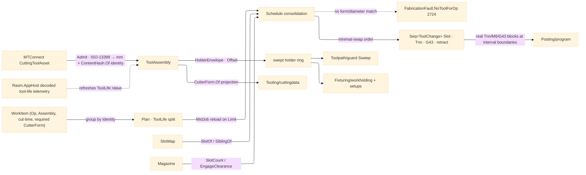

# [RASM_FABRICATION_TOOL_MAGAZINE]

The tool-magazine owner: `Magazine` the `[SmartEnum<string>]` physical magazine (carousel/turret/manual) the tool-change folds schedule against — the carousel/turret/manual slot map, the per-slot `ToolAssembly` holder geometry (taper/gauge-length/collet-runout/projected-stickout) backed by the ISO-13399 `MTConnect.NET-Common` `CuttingToolAsset` tool-data model, and the minimal-swap tool-change `Schedule` fold consolidating a multi-operation job into the fewest `M6` swaps. The schedule is WIRED into the pipeline, not an island: the Cam fold consults it inside `Run(Cam)` conditioning, and `Posting/program` consumes `Schedule` directly — each `ToolChange` becomes the real `Tnn`/`M6`/`G43` block sequence at its interval boundary, the `Tnn` reading the asset's `ProgramToolNumber` and the `G43` offset the measured `GaugeLength`. A tool change is a scheduled `M6` with retract and `G43` length offset; the `ToolAssembly` holder swept envelope is the shared input `Toolpath/guard` and `Fixturing/workholding`/`setups` consume, so a stickout-limited tool tests its real holder footprint, never a zero-width spindle axis. The `Tool` cutting-data axis is `Process/physics#CUT_PARAMETER`'s — this page reads it and adds the PHYSICAL magazine/holder layer; the machinability model keyed by the assembly is `Tooling/cuttingdata`'s (`CutterForm.Of(ToolAssembly)` projects the owner#atoms `CutterForm` from the ISO-13399 measurement set there).

The tool-DATA model is the `MTConnect.NET-Common` `CuttingToolAsset`: each `ToolAssembly` carries one `ICuttingToolAsset` whose `ICuttingToolLifeCycle` is the in-service state — the `CutterStatus` lifecycle set, the `Location` magazine slot address, the `ProcessFeedRate`/`ProcessSpindleSpeed` recommended envelope, the `ProgramToolNumber`/`ProgramToolGroup` NC binding the posting `T` word reads, the `ReconditionCount` regrind counter, the `ToolLife` budget (`MINUTES`/`PART_COUNT`/`WEAR` against `Limit`/`Warning`), and the typed `Measurements` ISO-13399 cutting geometry (each a named subtype fixing its ISO-13399 code, never a stringly `Measurement.Type`). Identity discipline: the assembly's content identity mints ONCE at `Admit` through the kernel `ContentHash.Of` federation entry over the canonical measurement bytes — the package `GenerateHash` is MTConnect-internal provenance and NEVER a second folder mint; the `Runout` column reads the REAL `ShankDiameterMeasurement` value off the measurement set (the presence-mapped `0.01`/`0.005` literal stub is dead). The in-service `ToolLife` values refresh through the `Rasm.AppHost` decoded tool-life telemetry seam (the MTConnect `-Common` model slice AppHost livewire decodes — this page is that seam's FIRST consumer); the XML/JSON wire serializer and HTTP/MQTT/SHDR transport are NOT admitted, the folder consumes only the `MTConnect.Assets.CuttingTools` model slice, the measurement rows projected through Riok.Mapperly zero-reflection partials at the one boundary.

Wire posture: HOST-LOCAL. The `ToolChange` schedule and holder envelope cross only the in-process seam to the Cam conditioning and the `Posting/program` emitter; the decoded tool-life ingress arrives as typed values across the AppHost seam; no `ICuttingToolAsset`/`IToolingMeasurement` ever sits between wire and rail — the model crosses into the canonical `ToolAssembly` at the `Admit` boundary and the interior reads only projected scalars.

## [01]-[INDEX]

- [01]-[TOOL_MAGAZINE]: owns the `Magazine` slot-map axis, the `ToolAssembly` `[ComplexValueObject]` (asset + holder geometry + `ContentHash.Of` identity), the `SlotMap`/`WorkItem`/`ToolChange`/`MagazinePolicy` records, the `Schedule` life-split minimal-swap fold, the `HolderEnvelope` projection, and the `Admit` catalogue boundary.

## [02]-[TOOL_MAGAZINE]

- Owner: `Magazine` `[SmartEnum<string>]` (`carousel`/`turret`/`manual`) carrying `SlotCount` and `EngageClearance`; `ToolAssembly` `[ComplexValueObject]` the per-slot mounted tool — the `Process/physics#CUT_PARAMETER` `Tool` axis, the bound `ICuttingToolAsset`, the holder footprint `Loop`, the measured `GaugeLength`/`Stickout`/`Runout` scalars, and the `Identity` `UInt128` minted once through `ContentHash.Of`; `SlotMap` the slot→assembly assignment keyed by `Identity`; `ToolChange` the scheduled swap (`Slot`, `ProgramTool` Tnn, `LengthOffset` G43, `Retract`, `MidJob`, `ManualConfirm`); `MagazinePolicy` the schedule knobs (`SwapWeight`, `ManualConfirm`, `LifeBasis` `ToolLifeType`); `ToolMagazine` the static surface owning `Schedule`, `HolderEnvelope`, `Admit`, and `AdmitMagazine`.
- Cases: `Magazine` rows `carousel` (indexed disc, ~24 slots) · `turret` (lathe, ~12) · `manual` (1, operator-confirmed) (3); `Schedule` groups the work list by assembly `Identity` into tool-loaded intervals (one load per tool), splits an interval whose accumulated cut exceeds the asset's `ToolLife.Limit` under the policy `LifeBasis` into a `MidJob` reload of an identical-geometry sibling slot (the worn slot's `ReconditionCount` bumps — a worn tool retires mid-program, never cuts into scrap), and orders intervals to minimize swaps; a job whose operation demands a cutter form/diameter no loaded assembly satisfies routes `FabricationFault.NoToolForOp` 2724 — the SCHEDULING failure, orthogonal to `Tooling/cuttingdata`'s missing-DATA `MachinabilityUnknown` 2712.
- Entry: `public static Fin<Seq<ToolChange>> Schedule(Magazine magazine, SlotMap slots, Seq<WorkItem> work, MagazinePolicy policy)` — `Fin<T>` routes `FabricationFault.NoToolForOp` when the assembly set has no form/diameter match for an operation and `GeometryFault.DegenerateInput` when the distinct-tool count (after life-split reloads) exceeds `SlotCount`; `public static Loop HolderEnvelope(ToolAssembly assembly)` projects the swept holder footprint guard and setups read; `public static Fin<ToolAssembly> Admit(Tool tool, ICuttingToolAsset asset, Loop holder)` is the catalogue boundary admitting an MTConnect asset ONCE — schema-validating, coercing the ISO-13399 `Measurements` `Value`+`NativeUnits` through UnitsNet `Length`, reading the REAL `ShankDiameterMeasurement` for `Runout`, and minting the `ContentHash.Of` identity; `public static Fin<Magazine> AdmitMagazine(ReadOnlySpan<char> key)` the span-keyed axis boundary.
- Auto: `Schedule` folds the `(operation, assembly, cut-time)` work list — grouping by `Identity`, life-splitting per `LifeBasis` (`MINUTES` sums cut-time, `PART_COUNT` counts, `WEAR` reads the modelled wear), counting loaded tools against `SlotCount`, ordering by `SwapWeight` (mounted tools cost zero, unmounted the swap load), and emitting one `ToolChange` per interval boundary carrying its slot, the `ProgramToolNumber` `Tnn`, the `G43` offset off `GaugeLength`, and the `EngageClearance` retract; a `manual` magazine stamps `ManualConfirm`. `HolderEnvelope` inflates the holder footprint by the projected-stickout margin through `Geometry2D/algebra#POLYGON_ALGEBRA` `Offset` — the ONE envelope guard `Sweep` unions and workholding/setups test. `Admit` reads the asset once: `FunctionalLengthMeasurement`/`OverallToolLengthMeasurement` → `GaugeLength`, `UsableLengthMaxMeasurement` → `Stickout`, `ShankDiameterMeasurement` → `Runout` (absent = 0, unmeasured), `CutterStatus` `BROKEN`/`EXPIRED` → reject, the canonical measurement bytes → `Identity`; the AppHost telemetry seam refreshes `ToolLife.Value` on the SAME asset instance, so `RemainingFraction` reads live budget without re-admission.
- Receipt: the `Seq<ToolChange>` IS the typed tool-management evidence — slot, Tnn, length offset, retract, life-reload and confirm flags, exactly what `Posting/program` renders as blocks; the assembly identity is the one `ContentHash.Of` digest; no generic tooling ledger.
- Packages: `Process/physics#CUT_PARAMETER` (`Tool`/`Operation` — composed), `MTConnect.NET-Common` (`MTConnect.Assets.CuttingTools` model slice — `ICuttingToolAsset`/`ICuttingToolLifeCycle`/`ICuttingItem`, `CutterStatusType`, `IToolLife`/`ToolLifeType`, `ILocation`, typed `Measurements.*` subtypes, `IsValid(Version)`; the `.api/api-mtconnect-net-common.md` catalogue; no wire serializer, no transport), `Rasm` (`ContentHash.Of` — the ONE identity mint), `Riok.Mapperly` (zero-reflection measurement-row projections at the `Admit` boundary), `UnitsNet` (`Length` coercion of `Value`+`NativeUnits`), `Geometry2D/algebra#POLYGON_ALGEBRA` (`Offset` — the holder-envelope inflation), `Rhino.Geometry` (`Point3d`), Thinktecture.Runtime.Extensions, LanguageExt.Core, BCL inbox; cross-package: ← `Rasm.AppHost` decoded tool-life telemetry (`.api/api-mtconnect.md` consumer rows + `Wire/livewire.md` `MtconnectLane`→`ExternalValue` decode — FIRST consumer).
- Growth: a new magazine type is one `Magazine` row; a probe-after-change verification is one `ToolChange` arm composing `Verify/probing`'s tool-length cycle writing the measured length back onto the asset; a multi-insert turning tool is the asset's `CuttingItems` set read per edge at `Admit`; a new life basis is the `ToolLifeType` row the policy already selects; zero new surface.
- Boundary: `ToolMagazine` is the ONE tool-management owner and a flat one-tool-per-toolpath assumption is the deleted form; the assembly identity is the `ContentHash.Of` digest minted ONCE at `Admit` — a `GenerateHash` call as folder identity, or any second digest, is the second-hasher defect (K9); the `Runout` column carries the real measured value and a presence-mapped literal is the dead stub; the per-slot tool composes the settled `Tool` axis AND the one asset model — a hand-rolled tool-data record beside `CuttingToolAsset` is the deleted form; a typed measurement is the named `Measurements.*` subtype and a stringly `Measurement` probe is the rejected form; the asset crosses into `ToolAssembly` ONCE and an `ICuttingToolAsset`/`IToolingMeasurement` in a sibling signature is the seam violation; the holder envelope is the ONE `HolderEnvelope` projection over the ONE `PolygonAlgebra.Offset` — per-consumer re-derived footprints are the deleted form; the schedule is the ONE swap plan `Posting/program` renders and a posting-side re-derived tool order is the deleted form; transport is AppHost livewire's — reaching for XML/JSON/SHDR from this folder is the rejected form.

```csharp signature
// --- [RUNTIME_PRELUDE] ----------------------------------------------------------------------------------------------------------------------------
using System.Buffers;
using System.Buffers.Binary;
using LanguageExt;
using LanguageExt.Common;
using MTConnect.Assets.CuttingTools;
using MTConnect.Assets.CuttingTools.Measurements;
using Rasm.Domain;                        // ContentHash — the one identity mint
using Rasm.Fabrication.Geometry2D;
using Rasm.Fabrication.Process;
using Rhino.Geometry;
using Thinktecture;
using UnitsNet;
using static LanguageExt.Prelude;

namespace Rasm.Fabrication.Tooling;

// --- [TYPES] --------------------------------------------------------------------------------------------------------------------------------------
[SmartEnum<string>]
public sealed partial class Magazine {
    public static readonly Magazine Carousel = new("carousel", slotCount: 24, engageClearance: 50.0);
    public static readonly Magazine Turret = new("turret", slotCount: 12, engageClearance: 20.0);
    public static readonly Magazine Manual = new("manual", slotCount: 1, engageClearance: 100.0);

    public int SlotCount { get; }
    public double EngageClearance { get; }
}

// --- [MODELS] -------------------------------------------------------------------------------------------------------------------------------------
// The per-slot mounted tool: the physics Tool axis, the bound ISO-13399 asset, the holder footprint, the
// projected mm scalars, and the ContentHash.Of identity minted ONCE at Admit — the grouping/sibling key.
[ComplexValueObject]
public sealed partial class ToolAssembly {
    public Tool Tool { get; }
    public ICuttingToolAsset Asset { get; }
    public Loop Holder { get; }
    public double GaugeLength { get; }
    public double Stickout { get; }
    public double Runout { get; }
    public UInt128 Identity { get; }

    public ICuttingToolLifeCycle Life => Asset.CuttingToolLifeCycle;

    public int ProgramTool => Asset.CuttingToolLifeCycle.ProgramToolNumber ?? 0;

    // Remaining budget fraction under the requested basis: 1.0 full, 0.0 expired; no matching entry = unlimited.
    // The AppHost telemetry seam refreshes ToolLife.Value on the bound asset, so this read is live.
    public double RemainingFraction(ToolLifeType basis) =>
        toSeq(Life.ToolLife).Find(l => l.Type == basis).Match(
            Some: l => l.Limit <= 0.0 ? 1.0 : Math.Clamp(1.0 - l.Value / l.Limit, 0.0, 1.0),
            None: () => 1.0);

    public bool Spent =>
        toSeq(Life.CutterStatus).Exists(s => s is CutterStatusType.BROKEN or CutterStatusType.EXPIRED);
}

public readonly record struct WorkItem(Operation Op, ToolAssembly Assembly, double CutMinutes, CutterForm Required);

public sealed record SlotMap(Seq<(int Slot, ToolAssembly Assembly)> Slots) {
    public Option<int> SlotOf(ToolAssembly a) =>
        Slots.Find(s => s.Assembly.Identity == a.Identity).Map(static s => s.Slot);

    // A fresh slot holding an identical-geometry sibling instance the life-split reload mounts.
    public Option<int> SiblingOf(ToolAssembly worn, Set<int> excluded) =>
        Slots.Find(s => !excluded.Contains(s.Slot) && !s.Assembly.Spent && s.Assembly.Tool == worn.Tool && s.Assembly.Identity != worn.Identity)
            .Map(static s => s.Slot);
}

public readonly record struct ToolChange(int Slot, int ProgramTool, double LengthOffset, double Retract, bool MidJob, bool ManualConfirm);

public readonly record struct MagazinePolicy(double SwapWeight, bool ManualConfirm, ToolLifeType LifeBasis) {
    public static readonly MagazinePolicy Canonical = new(SwapWeight: 1.0, ManualConfirm: false, ToolLifeType.MINUTES);
}

// --- [OPERATIONS] ---------------------------------------------------------------------------------------------------------------------------------
public static class ToolMagazine {
    public static Fin<Seq<ToolChange>> Schedule(Magazine magazine, SlotMap slots, Seq<WorkItem> work, MagazinePolicy policy) {
        Option<WorkItem> orphan = work.Find(w => slots.Slots.ForAll(s => s.Assembly.Tool != w.Assembly.Tool));
        if (orphan.IsSome)
            return orphan.Map(w => Fin.Fail<Seq<ToolChange>>(FabricationFault.NoToolForOp(w.Op, w.Required).ToError()))
                .IfNone(Fin.Fail<Seq<ToolChange>>(GeometryFault.DegenerateInput("magazine:orphan").ToError()));
        Seq<ToolAssembly> loaded = Plan(work, policy).Map(static i => i.Assembly).Distinct().ToSeq();
        return loaded.Count > magazine.SlotCount
            ? Fin.Fail<Seq<ToolChange>>(GeometryFault.DegenerateInput($"magazine:overflow:{loaded.Count}>{magazine.SlotCount}").ToError())
            : Fin.Succ(Consolidate(Plan(work, policy), slots, magazine, policy));
    }

    public static Loop HolderEnvelope(ToolAssembly assembly) =>
        PolygonAlgebra.Offset(Seq(assembly.Holder.AsCcw()), 0.1 * Math.Max(0.0, assembly.Stickout), OffsetEnds.Polygon)
            .Bind(rings => rings.HeadOrNone().ToFin(GeometryFault.DegenerateInput("magazine:holder-empty").ToError()))
            .IfFail(assembly.Holder.AsCcw());

    // Tool-life intervals: accumulate each tool's cut against ToolLife.Limit per LifeBasis, splitting an
    // exhausting interval into a MidJob reload of a sibling instance — the worn tool retires before scrap.
    static Seq<(ToolAssembly Assembly, bool MidJob)> Plan(Seq<WorkItem> work, MagazinePolicy policy) =>
        work.Fold((Intervals: Seq<(ToolAssembly, bool)>(), Spent: Map<UInt128, double>()),
            (acc, item) => {
                UInt128 key = item.Assembly.Identity;
                double budget = toSeq(item.Assembly.Life.ToolLife).Find(l => l.Type == policy.LifeBasis).Map(static l => l.Limit).IfNone(double.MaxValue);
                double used = acc.Spent.Find(key).IfNone(0.0) + item.CutMinutes;
                bool reload = used > budget && budget < double.MaxValue;
                return (acc.Intervals.Add((item.Assembly, reload)), acc.Spent.AddOrUpdate(key, reload ? item.CutMinutes : used));
            }).Intervals.Distinct();

    // Minimal-swap order: a mounted tool costs zero (no M6), an unmounted tool the SwapWeight load; each
    // emitted ToolChange carries the Tnn/G43 pair Posting/program renders verbatim at its interval boundary.
    static Seq<ToolChange> Consolidate(Seq<(ToolAssembly Assembly, bool MidJob)> intervals, SlotMap slots, Magazine magazine, MagazinePolicy policy) {
        Set<int> taken = toSet(intervals.Map(i => slots.SlotOf(i.Assembly)).Somes());
        var free = toSeq(Enumerable.Range(0, magazine.SlotCount).Filter(s => !taken.Contains(s)));
        return intervals
            .OrderBy(i => slots.SlotOf(i.Assembly).Match(Some: s => (double)s, None: () => magazine.SlotCount + policy.SwapWeight))
            .ToSeq()
            .Fold((Changes: Seq<ToolChange>(), Free: free), (acc, interval) => {
                (int slot, Seq<int> rest) = (interval.MidJob ? slots.SiblingOf(interval.Assembly, taken) : slots.SlotOf(interval.Assembly)).Match(
                    Some: s => (s, acc.Free),
                    None: () => acc.Free.HeadOrNone().Match(Some: f => (f, acc.Free.Tail), None: () => (acc.Changes.Count, acc.Free)));
                return (acc.Changes.Add(new ToolChange(slot, interval.Assembly.ProgramTool, interval.Assembly.GaugeLength,
                    magazine.EngageClearance, interval.MidJob, policy.ManualConfirm)), rest);
            }).Changes;
    }

    // --- [BOUNDARIES] — the MTConnect asset crosses into the canonical ToolAssembly ONCE -----------------------------------------------------------
    // ISO-13399 Measurements coerce through UnitsNet (Value+NativeUnits); Runout reads the REAL shank
    // measurement value; the identity mints through ContentHash.Of over the canonical measurement bytes.
    public static Fin<ToolAssembly> Admit(Tool tool, ICuttingToolAsset asset, Loop holder) {
        if (!asset.IsValid(MTConnectVersions.Version24).IsValid)
            return Fin.Fail<ToolAssembly>(GeometryFault.DegenerateInput($"tool-assembly:invalid:{asset.ToolId}").ToError());
        Option<double> gauge = Mm<FunctionalLengthMeasurement>(asset).BiBind(Some, () => Mm<OverallToolLengthMeasurement>(asset));
        return gauge.Match(
            Some: g => Fin.Succ(ToolAssembly.Create(tool, asset, holder.AsCcw(), g,
                          Mm<UsableLengthMaxMeasurement>(asset).IfNone(g), Mm<ShankDiameterMeasurement>(asset).IfNone(0.0), Identity(asset, g))),
            None: () => Fin.Fail<ToolAssembly>(GeometryFault.DegenerateInput($"tool-assembly:no-length:{asset.ToolId}").ToError()));
    }

    static Option<double> Mm<TMeasure>(ICuttingToolAsset asset) where TMeasure : IToolingMeasurement =>
        toSeq(asset.CuttingToolLifeCycle.Measurements).OfType<TMeasure>().HeadOrNone()
            .Bind(m => Length.TryParse($"{m.Value} {m.NativeUnits ?? "mm"}", out Length len) ? Some(len.Millimeters) : Some(m.Value));

    // The ONE identity mint: canonical measurement bytes -> kernel ContentHash.Of; GenerateHash never keys the folder.
    static UInt128 Identity(ICuttingToolAsset asset, double gauge) {
        var buffer = new ArrayBufferWriter<byte>();
        foreach (double v in toSeq(asset.CuttingToolLifeCycle.Measurements).Map(static m => m.Value).OrderBy(static v => v).Append(gauge)) {
            BinaryPrimitives.WriteDoubleLittleEndian(buffer.GetSpan(8), v);
            buffer.Advance(8);
        }
        return ContentHash.Of(buffer.WrittenSpan);
    }

    public static Fin<Magazine> AdmitMagazine(ReadOnlySpan<char> key) =>
        Magazine.Validate(key, null, out var m) is { } f
            ? Fin.Fail<Magazine>(GeometryFault.DegenerateInput($"magazine:{f.Message}").ToError())
            : Fin.Succ(m!);
}
```


