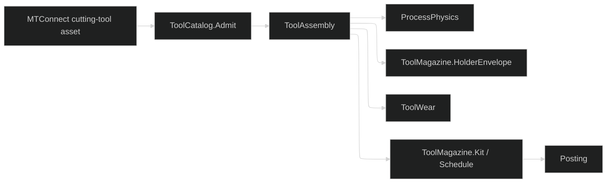

# [RASM_FABRICATION_TOOL_MAGAZINE]

`ToolAssembly` is the provider-detached physical-tool owner. Stable `Identity` survives lifecycle refreshes; `Snapshot` changes with measurements, edges, status, process ranges, reconditioning, measured offset wear, and life evidence. `ToolMagazine` admits machine-specific layout data, kits crib tools into typed slot states, schedules changes against every reserve-adjusted life basis under one selection policy, and projects the holder envelope consumed by Guard.

MTConnect types stop at `ToolCatalog.Admit`. Frozen correspondence tables carry provider measurement, status, life-basis, and placement vocabularies into domain owners, so an unmapped provider value fails typed rather than defaulting to a domain row. `MetricDimension` rows own unit admission and canonical projection, so every measurement lands as one `ToolMetric` in millimetres, degrees, grams, or decimal fractions.

Wire posture: HOST-LOCAL. `ToolAssembly`, `ToolMagazine.Schedule`, and `ToolMagazine.HolderEnvelope` are in-process wires; provider types and controller enums stop at `ToolCatalog.Admit`. `ToolWear` life and offset evidence re-enters through `ToolIngress.Refresh` under monotone observation and consumed-life guards, so scheduling reads one `ToolSnapshot` rather than a parallel wear map.

## [01]-[INDEX]

- [01]-[TOOL_MAGAZINE]: `ToolKey`, `MetricDimension`, `ToolMetric`, `ToolAssembly`, `Magazine`, `MagazineLayout`, `SlotMap`, `MagazineBehavior`, `ToolSelection`, `MagazinePolicy`, `KittingReceipt`, `ToolChange`, `ToolCatalog`, and `ToolMagazine`.

## [02]-[TOOL_MAGAZINE]

- Owner: `ToolKey` carries stable physical identity; `ToolSnapshot` carries mutable truth and owns metric and remaining-life lookup; `ToolAssembly` composes them with `Tool` and the controller offset registers; `MagazineLayout` carries admitted capacity, pot envelope, index timing, and clearance; `SlotMap` carries total placement state; `MagazinePolicy` carries reserve, retract, controller behavior, and the selection row.
- Cases: `MetricDimension` rows carry unit admission and canonical restoration delegates; `ToolTarget` distinguishes body and edge budgets; `SlotState` distinguishes empty, loaded, reserved, quarantined, and manual staging; `MagazineBehavior` is the frozen controller-capability set; `ToolSelection` rows generate the mounted-preference and life-direction ordering space; `ShortfallReason` names why a demand went unkitted; `CatalogSource` distinguishes provider digest from telemetry content; `ToolIngress` distinguishes asset admission and telemetry refresh.
- Entry: `ToolCatalog.Admit(ToolIngress)` is the one catalog boundary; `ToolMagazine.Kit(SlotMap, Seq<WorkItem>, MagazinePolicy)`, `ToolMagazine.Schedule(SlotMap, Seq<WorkItem>, MagazinePolicy)`, and `ToolMagazine.HolderEnvelope(ToolAssembly)` are one entry per distinct receipt consumer. Layout and magazine kind derive from `SlotMap`; holder allowance derives from `ToolAssembly`.
- Auto: generated factories reject blank identity, invalid ranges, duplicate edge keys, duplicate metric kinds, non-positive geometry, partial slot maps, duplicate physical tools, and inconsistent lifecycle evidence. Kitting and scheduling use state folds; a refresh advances the observation instant, preserves the exact target-basis and edge-key sets, never lowers consumed life, and retains every terminal body or edge state. Snapshot content excludes observation instants and validity windows while those fields remain on evidence. Every requested life basis resolves on the candidate or that candidate is not selectable; reserve is committed with demand; preselection resolves against the next change's slot within `PreselectDistance`.
- Receipt: `CatalogReceipt` carries admitted assembly, optional slot, typed source evidence, and observation time; `KittingReceipt` carries loaded, staged, quarantined, and reason-bearing shortfall rows over a slot map holding real reservations; `ToolChange` carries physical and controller bindings, both offset registers, geometry and measured wear offsets, magazine traverse duration, limiting-life evidence, and the next slot to preselect. `FabricationFact.ToolRefresh.Of` projects a telemetry-sourced receipt's refresh interval onto `rasm.fabrication.tool.refresh.age` through `Process/telemetry#FACT_PROJECTION` as kind `tool-refresh`; a provider-digest source projects nothing.
- Packages: MTConnect.NET-Common cutting-tool model, `UnitsNet` dynamic quantity admission, `NodaTime` evidence windows and durations, `FrozenDictionary` correspondence tables, `ContentHash.Of`, `PolygonAlgebra`, LanguageExt.Core, Thinktecture.Runtime.Extensions, and RhinoCommon compose directly.
- Growth: a provider measurement is one `ToolMeasure` row and one `ProviderMeasure` table row; a physical dimension is one `MetricDimension` row carrying its own admission and restoration; a provider life basis is one `ProviderLife` table row targeting `ToolLifeBasis`; a provider placement is one `ProviderSlot` table row targeting `SlotKind`; a slot topology is one `Magazine` row with admitted `MagazineLayout` data; a lifecycle state is one `ToolAvailability` row; a controller capability is one `MagazineBehavior` row; a scheduling preference is one `ToolSelection` row.
- Boundary: provider enums, provider hashes as identity, dimension-per-case metric siblings, hand-written provider switches beside generated owners, unmapped provider values defaulting to a domain row, mutable snapshot identity, parallel wear state, single-basis scheduling, absent life budgets read as exhausted, tool groups substituting for geometric interchangeability, preselection naming its own slot, reserve that is checked but not committed, invented infinite capacity, fixed magazine dimensions, and shortfall rows without a reason are deleted forms. `CanonicalHash` is the length-framing statement kernel.

```csharp signature
// --- [RUNTIME_PRELUDE] ----------------------------------------------------------------------------------------------------------------------------
using System.Buffers;
using System.Buffers.Binary;
using System.Collections.Frozen;
using System.Globalization;
using System.Text;
using LanguageExt;
using LanguageExt.Common;
using MTConnect;
using MTConnect.Assets.CuttingTools;
using MTConnect.Assets.CuttingTools.Measurements;
using NodaTime;
using Rasm.Domain;
using Rasm.Fabrication.Geometry2D;
using Rasm.Fabrication.Process;
using Rhino.Geometry;
using Thinktecture;
using UnitsNet;
using static LanguageExt.Prelude;

namespace Rasm.Fabrication.Tooling;

// --- [TYPES] --------------------------------------------------------------------------------------------------------------------------------------
[ValueObject<string>]
public sealed partial class ToolKey {
    static partial void ValidateFactoryArguments(ref ValidationError? validationError, ref string value) {
        value = value?.Trim() ?? string.Empty;
        validationError = value.Length == 0 ? new ValidationError(message: "tool-key") : null;
    }
}

[ValueObject<string>]
public sealed partial class ToolEdgeKey {
    static partial void ValidateFactoryArguments(ref ValidationError? validationError, ref string value) {
        value = value?.Trim() ?? string.Empty;
        validationError = value.Length == 0 ? new ValidationError(message: "tool-edge-key") : null;
    }
}

[SmartEnum<string>]
public sealed partial class Magazine {
    public static readonly Magazine Carousel = new("carousel");
    public static readonly Magazine Turret = new("turret");
    public static readonly Magazine Chain = new("chain");
    public static readonly Magazine Rack = new("rack");
    public static readonly Magazine Manual = new("manual");
}

[SmartEnum<string>]
public sealed partial class MagazineBehavior {
    public static readonly MagazineBehavior Confirm = new("confirm");
    public static readonly MagazineBehavior Preselect = new("preselect");
    public static readonly MagazineBehavior FixedPot = new("fixed-pot");
    public static readonly MagazineBehavior DualArm = new("dual-arm");
    public static readonly MagazineBehavior LoadWhileRunning = new("load-while-running");
    public static readonly MagazineBehavior OrientSpindle = new("orient-spindle");
}

[SmartEnum<string>]
public sealed partial class ToolSelection {
    public static readonly ToolSelection SpareFirst = new("spare-first", false, static spare => -spare);
    public static readonly ToolSelection ExhaustFirst = new("exhaust-first", false, static spare => spare);
    public static readonly ToolSelection MountedSpareFirst = new("mounted-spare-first", true, static spare => -spare);
    public static readonly ToolSelection MountedExhaustFirst = new("mounted-exhaust-first", true, static spare => spare);

    public bool PreferMounted { get; }
    public Func<double, double> Rank { get; }

    public (int Mounted, double Life) Order(bool mounted, double spare) =>
        (PreferMounted && mounted ? 0 : 1, Rank(spare));
}

[SmartEnum<string>]
public sealed partial class SlotKind {
    public static readonly SlotKind Pot = new("pot");
    public static readonly SlotKind Station = new("station");
    public static readonly SlotKind Spindle = new("spindle");
    public static readonly SlotKind Rack = new("rack");
    public static readonly SlotKind Turret = new("turret");
    public static readonly SlotKind Manual = new("manual");
}

[SmartEnum<string>]
public sealed partial class ToolAvailability {
    public static readonly ToolAvailability Ready = new("ready", false, false);
    public static readonly ToolAvailability Allocated = new("allocated", false, false);
    public static readonly ToolAvailability Measured = new("measured", false, false);
    public static readonly ToolAvailability Reconditioned = new("reconditioned", false, false);
    public static readonly ToolAvailability Quarantined = new("quarantined", true, false);
    public static readonly ToolAvailability Expired = new("expired", true, true);
    public static readonly ToolAvailability Broken = new("broken", true, true);
    public static readonly ToolAvailability Retired = new("retired", true, true);

    public bool BlocksUse { get; }
    public bool Terminal { get; }
}

[SmartEnum<string>]
public sealed partial class MetricDimension {
    public static readonly MetricDimension Length = new("length", "mm",
        static (value, unit) => Admit<UnitsNet.Length>(value, unit).Map(static row => row.Millimeters),
        static canonical => UnitsNet.Length.FromMillimeters(canonical));
    public static readonly MetricDimension Angle = new("angle", "deg",
        static (value, unit) => Admit<UnitsNet.Angle>(value, unit).Map(static row => row.Degrees),
        static canonical => UnitsNet.Angle.FromDegrees(canonical));
    public static readonly MetricDimension Mass = new("mass", "g",
        static (value, unit) => Admit<UnitsNet.Mass>(value, unit).Map(static row => row.Grams),
        static canonical => UnitsNet.Mass.FromGrams(canonical));
    public static readonly MetricDimension Scalar = new("scalar", "1",
        static (value, _) => double.IsFinite(value) ? Some(value) : None,
        static canonical => Ratio.FromDecimalFractions(canonical));

    public string CanonicalUnit { get; }
    public Func<double, string, Option<double>> Canonical { get; }
    public Func<double, IQuantity> Restore { get; }

    private static Option<TQuantity> Admit<TQuantity>(double value, string unit) where TQuantity : IQuantity =>
        Quantity.TryFromUnitAbbreviation(CultureInfo.InvariantCulture, value.ToQuantityValue(), unit,
            out IQuantity? quantity) && quantity is TQuantity typed ? Some(typed) : None;
}

[SmartEnum<string>]
public sealed partial class ToolMeasure {
    public static readonly ToolMeasure CuttingDiameter = new("cutting-diameter", MetricDimension.Length);
    public static readonly ToolMeasure MaximumCuttingDiameter = new("maximum-cutting-diameter", MetricDimension.Length);
    public static readonly ToolMeasure CornerRadius = new("corner-radius", MetricDimension.Length);
    public static readonly ToolMeasure CuttingEdgeLength = new("cutting-edge-length", MetricDimension.Length);
    public static readonly ToolMeasure MaximumUsableLength = new("maximum-usable-length", MetricDimension.Length);
    public static readonly ToolMeasure FunctionalLength = new("functional-length", MetricDimension.Length);
    public static readonly ToolMeasure OverallLength = new("overall-length", MetricDimension.Length);
    public static readonly ToolMeasure ShankDiameter = new("shank-diameter", MetricDimension.Length);
    public static readonly ToolMeasure ShankLength = new("shank-length", MetricDimension.Length);
    public static readonly ToolMeasure ShankHeight = new("shank-height", MetricDimension.Length);
    public static readonly ToolMeasure CuttingEdgeAngle = new("cutting-edge-angle", MetricDimension.Angle);
    public static readonly ToolMeasure LeadAngle = new("lead-angle", MetricDimension.Angle);
    public static readonly ToolMeasure PointAngle = new("point-angle", MetricDimension.Angle);
    public static readonly ToolMeasure DriveAngle = new("drive-angle", MetricDimension.Angle);
    public static readonly ToolMeasure MaximumBodyLength = new("maximum-body-length", MetricDimension.Length);
    public static readonly ToolMeasure MaximumBodyDiameter = new("maximum-body-diameter", MetricDimension.Length);
    public static readonly ToolMeasure MaximumDepthOfCut = new("maximum-depth-of-cut", MetricDimension.Length);
    public static readonly ToolMeasure InscribedCircleDiameter = new("inscribed-circle-diameter", MetricDimension.Length);
    public static readonly ToolMeasure InsertWidth = new("insert-width", MetricDimension.Length);
    public static readonly ToolMeasure WiperEdgeLength = new("wiper-edge-length", MetricDimension.Length);
    public static readonly ToolMeasure Weight = new("weight", MetricDimension.Mass);
    public static readonly ToolMeasure ProtrudingLength = new("protruding-length", MetricDimension.Length);
    public static readonly ToolMeasure FlangeDiameter = new("flange-diameter", MetricDimension.Length);
    public static readonly ToolMeasure MaximumFlangeDiameter = new("maximum-flange-diameter", MetricDimension.Length);
    public static readonly ToolMeasure ChamferWidth = new("chamfer-width", MetricDimension.Length);
    public static readonly ToolMeasure ChamferFlatLength = new("chamfer-flat-length", MetricDimension.Length);
    public static readonly ToolMeasure CuttingHeight = new("cutting-height", MetricDimension.Length);
    public static readonly ToolMeasure StepDiameterLength = new("step-diameter-length", MetricDimension.Length);
    public static readonly ToolMeasure StepIncludedAngle = new("step-included-angle", MetricDimension.Angle);
    public static readonly ToolMeasure CuttingReferencePoint = new("cutting-reference-point", MetricDimension.Scalar);
    public static readonly ToolMeasure ToolOrientation = new("tool-orientation", MetricDimension.Angle);

    public MetricDimension Dimension { get; }
}

// --- [MODELS] -------------------------------------------------------------------------------------------------------------------------------------
[ComplexValueObject]
public readonly partial struct SlotAddress {
    public SlotKind Kind { get; }
    public string MagazineId { get; }
    public int Position { get; }

    static partial void ValidateFactoryArguments(ref ValidationError? validationError, ref SlotKind kind,
        ref string magazineId, ref int position) {
        magazineId = magazineId?.Trim() ?? string.Empty;
        validationError = kind is null || magazineId.Length == 0 || position < 0
            ? new ValidationError(message: "slot-address") : null;
    }
}

[Union(ConversionFromValue = ConversionOperatorsGeneration.None)]
public abstract partial record ToolTarget {
    private ToolTarget() { }
    public sealed record Body : ToolTarget;
    public sealed record Edge(ToolEdgeKey Key) : ToolTarget;
}

[ComplexValueObject]
public readonly partial struct LifeBudget {
    public ToolTarget Target { get; }
    public ToolLifeBasis Basis { get; }
    public double Used { get; }
    public double Warning { get; }
    public double Limit { get; }
    public Instant ObservedAt { get; }
    public Option<Interval> Validity { get; }

    public double Remaining => Math.Max(0.0, Limit - Used);
    public double FractionRemaining => Limit <= 0.0 ? 0.0 : Math.Clamp(Remaining / Limit, 0.0, 1.0);

    static partial void ValidateFactoryArguments(ref ValidationError? validationError, ref ToolTarget target,
        ref ToolLifeBasis basis, ref double used, ref double warning, ref double limit, ref Instant observedAt,
        ref Option<Interval> validity) =>
        validationError = target is null || basis is null || !Seq(used, warning, limit).ForAll(double.IsFinite)
            || used < 0.0 || warning < 0.0 || warning > limit || limit <= 0.0
            || validity.Exists(window => !window.Contains(observedAt))
            ? new ValidationError(message: "life-budget") : null;
}

[ComplexValueObject]
public readonly partial struct MetricBand {
    public double Value { get; }
    public Option<double> Minimum { get; }
    public Option<double> Maximum { get; }
    public Option<double> Nominal { get; }
    public string Unit { get; }
    public int SignificantDigits { get; }

    static partial void ValidateFactoryArguments(ref ValidationError? validationError, ref double value,
        ref Option<double> minimum, ref Option<double> maximum, ref Option<double> nominal,
        ref string unit, ref int significantDigits) {
        unit = unit?.Trim() ?? string.Empty;
        Seq<double> values = Seq(value).Concat(minimum).Concat(maximum).Concat(nominal);
        validationError = unit.Length == 0 || significantDigits < 0 || values.Exists(static row => !double.IsFinite(row))
            || (minimum, maximum).Apply(static (lo, hi) => lo > hi).IfNone(false)
            || minimum.Exists(lo => value < lo || nominal.Exists(row => row < lo))
            || maximum.Exists(hi => value > hi || nominal.Exists(row => row > hi))
            ? new ValidationError(message: "metric-band") : null;
    }
}

[ComplexValueObject]
public sealed partial class ToolMetric {
    public ToolMeasure Kind { get; }
    public MetricBand Source { get; }

    public double Canonical => Kind.Dimension.Canonical(Source.Value, Source.Unit).IfNone(double.NaN);
    public IQuantity Quantity => Kind.Dimension.Restore(Canonical);

    static partial void ValidateFactoryArguments(ref ValidationError? validationError, ref ToolMeasure kind,
        ref MetricBand source) =>
        validationError = kind is null || source is null
            || kind.Dimension.Canonical(source.Value, source.Unit).IsNone
            ? new ValidationError(message: "tool-metric") : null;
}

[ComplexValueObject]
public sealed partial class ToolEdge {
    public ToolEdgeKey Key { get; }
    public Option<string> Grade { get; }
    public Option<string> Locus { get; }
    public Option<string> ProgramToolGroup { get; }
    public Seq<string> Manufacturers { get; }
    public Seq<ToolAvailability> Status { get; }
    public Seq<LifeBudget> Life { get; }
    public Seq<ToolMetric> Metrics { get; }

    public bool Spent => Status.Exists(static state => state.Terminal)
        || (!Life.IsEmpty && Life.Exists(static budget => budget.Remaining <= 0.0));

    static partial void ValidateFactoryArguments(ref ValidationError? validationError, ref ToolEdgeKey key,
        ref Option<string> grade, ref Option<string> locus, ref Option<string> programToolGroup,
        ref Seq<string> manufacturers, ref Seq<ToolAvailability> status,
        ref Seq<LifeBudget> life, ref Seq<ToolMetric> metrics) {
        grade = grade.Map(static value => value.Trim()).Filter(static value => value.Length > 0);
        locus = locus.Map(static value => value.Trim()).Filter(static value => value.Length > 0);
        programToolGroup = programToolGroup.Map(static value => value.Trim()).Filter(static value => value.Length > 0);
        validationError = key is null || status.IsEmpty
            || life.Exists(row => row.Target is not ToolTarget.Edge edge || edge.Key != key)
            ? new ValidationError(message: "tool-edge") : null;
    }
}

[ComplexValueObject]
public sealed partial class ToolSnapshot {
    public Seq<ToolAvailability> Status { get; }
    public Seq<LifeBudget> Life { get; }
    public Arr<ToolEdge> Edges { get; }
    public Seq<ToolMetric> Metrics { get; }
    public ProcessRange Feed { get; }
    public ProcessRange Spindle { get; }
    public int ReconditionCount { get; }
    public Option<int> ReconditionLimit { get; }
    public Length LengthWear { get; }
    public Length RadiusWear { get; }
    public Instant ObservedAt { get; }
    public UInt128 Content { get; }

    public bool Spent => Status.Exists(static state => state.Terminal)
        || (!Edges.IsEmpty && Edges.ForAll(static edge => edge.Spent))
        || Life.Exists(static budget => budget.Remaining <= 0.0);

    public Option<double> Metric(ToolMeasure kind) =>
        Metrics.Find(row => row.Kind == kind).Map(static row => row.Canonical);

    public Option<double> Remaining(ToolLifeBasis basis) =>
        Life.Filter(row => row.Basis == basis)
            .Concat(Edges.Filter(static edge => !edge.Spent)
                .Bind(edge => edge.Life.Filter(row => row.Basis == basis)))
            .Map(static row => row.Remaining).OrderBy(static value => value).HeadOrNone();

    static partial void ValidateFactoryArguments(ref ValidationError? validationError, ref Seq<ToolAvailability> status,
        ref Seq<LifeBudget> life, ref Arr<ToolEdge> edges, ref Seq<ToolMetric> metrics, ref ProcessRange feed,
        ref ProcessRange spindle, ref int reconditionCount, ref Option<int> reconditionLimit,
        ref Length lengthWear, ref Length radiusWear, ref Instant observedAt, ref UInt128 content) =>
        validationError = status.IsEmpty || content == UInt128.Zero || reconditionCount < 0
            || reconditionLimit.Exists(limit => limit < reconditionCount)
            || edges.Map(static edge => edge.Key).Distinct().Count != edges.Count
            || metrics.Map(static row => row.Kind).Distinct().Count != metrics.Count
            ? new ValidationError(message: "tool-snapshot") : null;
}

[ComplexValueObject]
public sealed partial class ToolAssembly {
    public ToolKey Key { get; }
    public string SerialNumber { get; }
    public string Archetype { get; }
    public string DefinitionFormat { get; }
    public string Definition { get; }
    public Tool Tool { get; }
    public Loop Holder { get; }
    public double GaugeLength { get; }
    public double Stickout { get; }
    public double ShankDiameter { get; }
    public Length HolderAllowance { get; }
    public int ReserveBefore { get; }
    public int ReserveAfter { get; }
    public int ProgramTool { get; }
    public int LengthRegister { get; }
    public int RadiusRegister { get; }
    public Option<SlotAddress> HomeSlot { get; }
    public Option<string> ToolGroup { get; }
    public string ConnectionCode { get; }
    public OffsetPolicy EnvelopePolicy { get; }
    public ToolSnapshot Snapshot { get; }
    public UInt128 Identity { get; }

    public bool Spent => Snapshot.Spent;
    public ProcessRange Feed => Snapshot.Feed;
    public ProcessRange Spindle => Snapshot.Spindle;
    public EquipmentEnvelope Equipment => new(Tool, Identity, Feed, Spindle, Spent);
    public double RadiusOffset => Snapshot.Metric(ToolMeasure.CuttingDiameter)
        .OrElse(Snapshot.Metric(ToolMeasure.MaximumCuttingDiameter)).Map(static row => row * 0.5).IfNone(0.0);

    static partial void ValidateFactoryArguments(ref ValidationError? validationError, ref ToolKey key,
        ref string serialNumber, ref string archetype, ref string definitionFormat, ref string definition,
        ref Tool tool, ref Loop holder, ref double gaugeLength, ref double stickout, ref double shankDiameter,
        ref Length holderAllowance,
        ref int reserveBefore, ref int reserveAfter, ref int programTool, ref int lengthRegister,
        ref int radiusRegister, ref Option<SlotAddress> homeSlot, ref Option<string> toolGroup,
        ref string connectionCode, ref OffsetPolicy envelopePolicy,
        ref ToolSnapshot snapshot, ref UInt128 identity) {
        serialNumber = serialNumber?.Trim() ?? string.Empty;
        archetype = archetype?.Trim() ?? string.Empty;
        definitionFormat = definitionFormat?.Trim() ?? string.Empty;
        definition = definition?.Trim() ?? string.Empty;
        connectionCode = connectionCode?.Trim() ?? string.Empty;
        validationError = key is null || serialNumber.Length == 0 || tool is null || holder is null || !holder.Closed
            || !Seq(gaugeLength, stickout, shankDiameter).ForAll(static value => double.IsFinite(value) && value > 0.0)
            || holderAllowance < Length.Zero
            || reserveBefore < 0 || reserveAfter < 0 || programTool < 0 || lengthRegister < 0 || radiusRegister < 0
            || snapshot is null || identity == UInt128.Zero
            ? new ValidationError(message: "tool-assembly") : null;
    }

    public bool InterchangeableWith(ToolAssembly other) =>
        ToolGroup == other.ToolGroup && ConnectionCode == other.ConnectionCode
        && Tool == other.Tool && Holder.Equals(other.Holder) && GaugeLength == other.GaugeLength
        && Stickout == other.Stickout && ShankDiameter == other.ShankDiameter
        && HolderAllowance == other.HolderAllowance;
}

[ComplexValueObject]
public sealed partial class MagazineLayout {
    public Magazine Kind { get; }
    public string Id { get; }
    public Seq<SlotAddress> Slots { get; }
    public Length EngageClearance { get; }
    public int PreselectDistance { get; }
    public Duration IndexStep { get; }
    public Duration ArmSwing { get; }
    public Length SlotDiameter { get; }
    public Length SlotLength { get; }
    public Mass SlotMass { get; }

    public Option<int> Span(SlotAddress from, SlotAddress to) => from.MagazineId != Id || to.MagazineId != Id
        || !Slots.Contains(from) || !Slots.Contains(to)
        ? None
        : Some(Kind == Magazine.Carousel || Kind == Magazine.Chain || Kind == Magazine.Turret
            ? Math.Min(Math.Abs(from.Position - to.Position),
                Slots.Count - Math.Abs(from.Position - to.Position))
            : Math.Abs(from.Position - to.Position));

    public Duration Traverse(Option<SlotAddress> from, SlotAddress to, Set<MagazineBehavior> behaviors) =>
        ArmSwing + IndexStep * (behaviors.Contains(MagazineBehavior.DualArm)
            ? 0.0
            : from.Bind(row => Span(row, to)).Map(static row => (double)row).IfNone(Slots.Count * 0.5));

    public bool Admits(ToolAssembly assembly) =>
        assembly.Snapshot.Metric(ToolMeasure.MaximumBodyDiameter).ForAll(row => row <= SlotDiameter.Millimeters)
        && assembly.Snapshot.Metric(ToolMeasure.OverallLength).ForAll(row => row <= SlotLength.Millimeters)
        && assembly.Snapshot.Metric(ToolMeasure.Weight).ForAll(row => row <= SlotMass.Grams);

    static partial void ValidateFactoryArguments(ref ValidationError? validationError, ref Magazine kind,
        ref string id, ref Seq<SlotAddress> slots, ref Length engageClearance, ref int preselectDistance,
        ref Duration indexStep, ref Duration armSwing, ref Length slotDiameter, ref Length slotLength,
        ref Mass slotMass) {
        id = id?.Trim() ?? string.Empty;
        bool circular = kind == Magazine.Carousel || kind == Magazine.Chain || kind == Magazine.Turret;
        validationError = kind is null || id.Length == 0 || slots.IsEmpty || slots.Distinct().Count != slots.Count
            || slots.Exists(slot => slot.MagazineId != id) || engageClearance < Length.Zero || preselectDistance < 0
            || circular && (slots.Exists(slot => slot.Position < 0 || slot.Position >= slots.Count)
                || slots.Map(static slot => slot.Position).Distinct().Count != slots.Count)
            || indexStep < Duration.Zero || armSwing < Duration.Zero
            || slotDiameter <= Length.Zero || slotLength <= Length.Zero || slotMass <= Mass.Zero
            ? new ValidationError(message: "magazine-layout") : null;
    }
}

[Union(ConversionFromValue = ConversionOperatorsGeneration.None)]
public abstract partial record SlotState {
    private SlotState() { }
    public sealed record Empty : SlotState;
    public sealed record Loaded(ToolAssembly Assembly) : SlotState;
    public sealed record Reserved(Operation Operation, CutterForm Required) : SlotState;
    public sealed record Quarantined(ToolAssembly Assembly, string Reason) : SlotState;
    public sealed record Manual(ToolAssembly Assembly) : SlotState;
}

[ComplexValueObject]
public sealed partial class SlotMap {
    public MagazineLayout Layout { get; }
    public HashMap<SlotAddress, SlotState> Slots { get; }
    public Seq<ToolAssembly> Crib { get; }

    public Option<SlotAddress> SlotOf(ToolAssembly assembly) => Slots.AsIterable().Choose(row =>
        Assembly(row.Value).Filter(value => value.Identity == assembly.Identity).Map(_ => row.Key)).HeadOrNone();

    public static Option<ToolAssembly> Assembly(SlotState state) => state switch {
        SlotState.Loaded row => Some(row.Assembly), SlotState.Manual row => Some(row.Assembly),
        SlotState.Quarantined row => Some(row.Assembly), _ => None
    };

    internal Option<SlotMap> Load(SlotAddress slot, ToolAssembly assembly) =>
        from state in Slots.Find(slot).Filter(static state => state is SlotState.Empty)
        from updated in Optional(Create(Layout, Slots.SetItem(slot, new SlotState.Loaded(assembly)),
            Crib.Filter(candidate => candidate.Identity != assembly.Identity).ToSeq()))
        select updated;

    static partial void ValidateFactoryArguments(ref ValidationError? validationError, ref MagazineLayout layout,
        ref HashMap<SlotAddress, SlotState> slots, ref Seq<ToolAssembly> crib) {
        Seq<UInt128> installed = slots.AsIterable().Choose(row => Assembly(row.Value))
            .Map(static assembly => assembly.Identity).ToSeq();
        Seq<UInt128> identities = installed.Concat(crib.Map(static assembly => assembly.Identity));
        validationError = layout is null || slots.Count != layout.Slots.Count
            || layout.Slots.Exists(slot => !slots.ContainsKey(slot))
            || identities.Distinct().Count != identities.Count || crib.Exists(static assembly => assembly.Spent)
            || slots.AsIterable().Exists(static row => row.Value switch {
                SlotState.Loaded { Assembly.Spent: true } or SlotState.Manual { Assembly.Spent: true } => true,
                SlotState.Quarantined value => string.IsNullOrWhiteSpace(value.Reason),
                SlotState.Reserved { Operation: null } or SlotState.Reserved { Required: null } => true,
                _ => false
            })
            || Overlaps(slots)
            ? new ValidationError(message: "slot-map") : null;
    }

    private static bool Overlaps(HashMap<SlotAddress, SlotState> slots) => slots.AsIterable().Exists(row =>
        slots.AsIterable().Exists(peer => row.Key != peer.Key && row.Key.MagazineId == peer.Key.MagazineId
            && (Assembly(row.Value), Assembly(peer.Value)).Apply((tool, other) =>
                row.Key.Position - tool.ReserveBefore <= peer.Key.Position + other.ReserveAfter
                && peer.Key.Position - other.ReserveBefore <= row.Key.Position + tool.ReserveAfter).IfNone(false)));
}

[ComplexValueObject]
public sealed partial class LifeDemand {
    public HashMap<ToolLifeBasis, double> Required { get; }
    public Ratio Reserve { get; }

    static partial void ValidateFactoryArguments(ref ValidationError? validationError,
        ref HashMap<ToolLifeBasis, double> required, ref Ratio reserve) =>
        validationError = required.IsEmpty
            || required.AsIterable().Exists(static row => row.Key is null || !double.IsFinite(row.Value) || row.Value <= 0.0)
            || reserve < Ratio.Zero || reserve > Ratio.FromPercent(100)
            ? new ValidationError(message: "life-demand") : null;

    public double Claim(double value, Ratio policyReserve) =>
        value * (1.0 + Math.Max(Reserve.DecimalFractions, policyReserve.DecimalFractions));

    public Option<double> Spare(ToolAssembly assembly, ToolLifeBasis basis,
        HashMap<(UInt128 Tool, ToolLifeBasis Basis), double> committed, MagazinePolicy policy) =>
        assembly.Snapshot.Remaining(basis).Map(remaining => remaining
            - committed.Find((assembly.Identity, basis)).IfNone(0.0)
            - Claim(Required.Find(basis).IfNone(0.0), policy.ReserveFloor));

    public Option<(ToolLifeBasis Basis, double Spare)> Limiting(ToolAssembly assembly,
        HashMap<(UInt128 Tool, ToolLifeBasis Basis), double> committed, MagazinePolicy policy) =>
        Required.AsIterable().Map(static row => row.Key).ToSeq()
            .Traverse(basis => Spare(assembly, basis, committed, policy).Map(spare => (Basis: basis, Spare: spare)))
            .As().Bind(static rows => rows.OrderBy(static row => row.Spare).HeadOrNone());
}

[ComplexValueObject]
public sealed partial class WorkItem {
    public Operation Op { get; }
    public ToolAssembly Assembly { get; }
    public LifeDemand Demand { get; }
    public CutterForm Form { get; }
    public CutterForm Required { get; }
    public Ratio FormDiameterBand { get; }

    static partial void ValidateFactoryArguments(ref ValidationError? validationError, ref Operation op,
        ref ToolAssembly assembly, ref LifeDemand demand, ref CutterForm form, ref CutterForm required,
        ref Ratio formDiameterBand) =>
        validationError = op is null || assembly is null || demand is null || form is null || required is null
            || formDiameterBand < Ratio.Zero || formDiameterBand > Ratio.FromPercent(100)
            ? new ValidationError(message: "work-item") : null;
}

[ComplexValueObject]
public sealed partial class MagazinePolicy {
    public Set<MagazineBehavior> Behaviors { get; }
    public ToolSelection Selection { get; }
    public Ratio ReserveFloor { get; }
    public Length SafeRetract { get; }

    static partial void ValidateFactoryArguments(ref ValidationError? validationError,
        ref Set<MagazineBehavior> behaviors, ref ToolSelection selection, ref Ratio reserveFloor,
        ref Length safeRetract) =>
        validationError = behaviors.Exists(static behavior => behavior is null) || selection is null
            || reserveFloor < Ratio.Zero || reserveFloor > Ratio.FromPercent(100) || safeRetract < Length.Zero
            ? new ValidationError(message: "magazine-policy") : null;
}

[SmartEnum<string>]
public sealed partial class ShortfallReason {
    public static readonly ShortfallReason NoInterchangeable = new("no-interchangeable");
    public static readonly ShortfallReason FormMismatch = new("form-mismatch");
    public static readonly ShortfallReason NoFreeSlot = new("no-free-slot");
    public static readonly ShortfallReason SlotEnvelope = new("slot-envelope");
    public static readonly ShortfallReason AllSpent = new("all-spent");
}

public sealed record KitShortfall(Operation Op, CutterForm Required, ShortfallReason Reason);
public sealed record KittingReceipt(Seq<ToolAssembly> Loaded, Seq<ToolAssembly> Staged,
    Seq<(Operation Op, CutterForm Required)> Reserved, Seq<ToolAssembly> Quarantined,
    Seq<KitShortfall> Missing, SlotMap Slots);
public readonly record struct ToolChange(Operation Op, double Trigger, SlotAddress Slot,
    int ProgramTool, int LengthRegister, int RadiusRegister, double LengthOffset, double RadiusOffset,
    double LengthWearOffset, double RadiusWearOffset, double Retract, Duration Elapsed,
    Set<MagazineBehavior> Behaviors, ToolAssembly Assembly, Option<ToolAssembly> Previous,
    Option<SlotAddress> PreviousSlot, Option<string> ToolGroup, Option<SlotAddress> PreselectedSlot,
    ToolLifeBasis LimitingBasis, double RemainingAfterDemand);

[Union(ConversionFromValue = ConversionOperatorsGeneration.None)]
public abstract partial record CatalogSource {
    private CatalogSource() { }
    public sealed record Provider(string Digest) : CatalogSource;
    public sealed record Telemetry(UInt128 Content, Instant Previous) : CatalogSource;
}

public sealed record CatalogReceipt(ToolAssembly Assembly, Option<SlotAddress> Slot, CatalogSource Source,
    Instant ObservedAt);

[Union(ConversionFromValue = ConversionOperatorsGeneration.None)]
public abstract partial record ToolIngress {
    private ToolIngress() { }
    public sealed record Asset(CuttingToolAsset Value, Tool Tool, Loop Holder, OffsetPolicy EnvelopePolicy,
        Length HolderAllowance, int LengthRegister, int RadiusRegister, Instant ObservedAt) : ToolIngress;
    public sealed record Refresh(ToolAssembly Current, Seq<LifeBudget> Life, Seq<ToolAvailability> Status,
        Arr<ToolEdge> Edges, Length LengthWear, Length RadiusWear, Instant ObservedAt) : ToolIngress;
}

// --- [OPERATIONS] ---------------------------------------------------------------------------------------------------------------------------------
public static class ToolCatalog {
    public static Fin<CatalogReceipt> Admit(ToolIngress ingress) => ingress.Switch(
        asset: static row => AdmitAsset(row.Value, row.Tool, row.Holder, row.EnvelopePolicy,
            row.HolderAllowance, row.LengthRegister, row.RadiusRegister, row.ObservedAt),
        refresh: static row => Refresh(row.Current, row.Life, row.Status, row.Edges,
            row.LengthWear, row.RadiusWear, row.ObservedAt));

    private static readonly FrozenDictionary<Type, ToolMeasure> ProviderMeasure = Seq(
        (typeof(CuttingDiameterMeasurement), ToolMeasure.CuttingDiameter),
        (typeof(CuttingDiameterMaxMeasurement), ToolMeasure.MaximumCuttingDiameter),
        (typeof(CornerRadiusMeasurement), ToolMeasure.CornerRadius),
        (typeof(CuttingEdgeLengthMeasurement), ToolMeasure.CuttingEdgeLength),
        (typeof(UsableLengthMaxMeasurement), ToolMeasure.MaximumUsableLength),
        (typeof(FunctionalLengthMeasurement), ToolMeasure.FunctionalLength),
        (typeof(OverallToolLengthMeasurement), ToolMeasure.OverallLength),
        (typeof(ShankDiameterMeasurement), ToolMeasure.ShankDiameter),
        (typeof(ShankLengthMeasurement), ToolMeasure.ShankLength),
        (typeof(ShankHeightMeasurement), ToolMeasure.ShankHeight),
        (typeof(ToolCuttingEdgeAngleMeasurement), ToolMeasure.CuttingEdgeAngle),
        (typeof(ToolLeadAngleMeasurement), ToolMeasure.LeadAngle),
        (typeof(PointAngleMeasurement), ToolMeasure.PointAngle),
        (typeof(DriveAngleMeasurement), ToolMeasure.DriveAngle),
        (typeof(BodyLengthMaxMeasurement), ToolMeasure.MaximumBodyLength),
        (typeof(BodyDiameterMaxMeasurement), ToolMeasure.MaximumBodyDiameter),
        (typeof(DepthOfCutMaxMeasurement), ToolMeasure.MaximumDepthOfCut),
        (typeof(IncribedCircleDiameterMeasurement), ToolMeasure.InscribedCircleDiameter),
        (typeof(InsertWidthMeasurement), ToolMeasure.InsertWidth),
        (typeof(WiperEdgeLengthMeasurement), ToolMeasure.WiperEdgeLength),
        (typeof(WeightMeasurement), ToolMeasure.Weight),
        (typeof(ProtrudingLengthMeasurement), ToolMeasure.ProtrudingLength),
        (typeof(FlangeDiameterMeasurement), ToolMeasure.FlangeDiameter),
        (typeof(FlangeDiameterMaxMeasurement), ToolMeasure.MaximumFlangeDiameter),
        (typeof(ChamferWidthMeasurement), ToolMeasure.ChamferWidth),
        (typeof(ChamferFlatLengthMeasurement), ToolMeasure.ChamferFlatLength),
        (typeof(CuttingHeightMeasurement), ToolMeasure.CuttingHeight),
        (typeof(StepDiameterLengthMeasurement), ToolMeasure.StepDiameterLength),
        (typeof(StepIncludedAngleMeasurement), ToolMeasure.StepIncludedAngle),
        (typeof(CuttingReferencePointMeasurement), ToolMeasure.CuttingReferencePoint),
        (typeof(ToolOrientationMeasurement), ToolMeasure.ToolOrientation))
        .ToFrozenDictionary(static row => row.Item1, static row => row.Item2);

    private static readonly FrozenDictionary<CutterStatusType, ToolAvailability> ProviderStatus = Seq(
        (CutterStatusType.NEW, ToolAvailability.Ready),
        (CutterStatusType.AVAILABLE, ToolAvailability.Ready),
        (CutterStatusType.USED, ToolAvailability.Ready),
        (CutterStatusType.UNALLOCATED, ToolAvailability.Ready),
        (CutterStatusType.ALLOCATED, ToolAvailability.Allocated),
        (CutterStatusType.MEASURED, ToolAvailability.Measured),
        (CutterStatusType.RECONDITIONED, ToolAvailability.Reconditioned),
        (CutterStatusType.EXPIRED, ToolAvailability.Expired),
        (CutterStatusType.BROKEN, ToolAvailability.Broken),
        (CutterStatusType.UNAVAILABLE, ToolAvailability.Quarantined),
        (CutterStatusType.NOT_REGISTERED, ToolAvailability.Quarantined),
        (CutterStatusType.UNKNOWN, ToolAvailability.Quarantined))
        .ToFrozenDictionary(static row => row.Item1, static row => row.Item2);

    private static readonly FrozenDictionary<ToolLifeType, ToolLifeBasis> ProviderLife = Seq(
        (ToolLifeType.MINUTES, ToolLifeBasis.Minutes),
        (ToolLifeType.PART_COUNT, ToolLifeBasis.PartCount),
        (ToolLifeType.WEAR, ToolLifeBasis.Wear))
        .ToFrozenDictionary(static row => row.Item1, static row => row.Item2);

    private static readonly FrozenDictionary<LocationType, SlotKind> ProviderSlot = Seq(
        (LocationType.POT, SlotKind.Pot),
        (LocationType.STATION, SlotKind.Station),
        (LocationType.SPINDLE, SlotKind.Spindle))
        .ToFrozenDictionary(static row => row.Item1, static row => row.Item2);

    private static Fin<CatalogReceipt> AdmitAsset(CuttingToolAsset asset, Tool tool, Loop holder,
        OffsetPolicy envelopePolicy, Length holderAllowance, int lengthRegister, int radiusRegister,
        Instant observedAt) =>
        let validation = asset.IsValid(MTConnectVersions.Version24)
        from _ in validation.IsValid
            ? Fin.Succ(unit)
            : Fin.Fail<Unit>(Error.New(message: $"tool-asset-schema:{validation.Message}"))
        from lifecycle in Optional(asset.CuttingToolLifeCycle).ToFin(Error.New(message: "tool-lifecycle"))
        from metrics in toSeq(lifecycle.Measurements).Traverse(AdmitMetric).As()
        from edges in toSeq(lifecycle.CuttingItems).Traverse(item => AdmitEdge(item, observedAt)).As().Map(static rows => rows.ToArr())
        from life in toSeq(lifecycle.ToolLife).Traverse(row => AdmitLife(new ToolTarget.Body(), row, observedAt)).As()
        from status in Status(lifecycle.CutterStatus)
        let serial = Optional(asset.SerialNumber).Filter(static value => !string.IsNullOrWhiteSpace(value))
            .OrElse(Optional(asset.ToolId).Filter(static value => !string.IsNullOrWhiteSpace(value)))
        from rawIdentity in serial.ToFin(Error.New(message: "tool-key"))
        let identityText = rawIdentity.Trim()
        from key in ToolKey.Create(identityText).ToFin(Error.New(message: "tool-key"))
        from programTool in int.TryParse(lifecycle.ProgramToolNumber, NumberStyles.Integer, CultureInfo.InvariantCulture, out int toolNumber)
            ? Fin.Succ(toolNumber) : Fin.Fail<int>(Error.New(message: "program-tool-number"))
        let feedRate = Optional(lifecycle.ProcessFeedRate)
        let spindleSpeed = Optional(lifecycle.ProcessSpindleSpeed)
        from feed in Range(feedRate.Bind(static row => Optional(row.Minimum)), feedRate.Bind(static row => Optional(row.Maximum)),
            feedRate.Bind(static row => Optional(row.Nominal)), feedRate.Bind(static row => Optional(row.Value)), "feed")
        from spindle in Range(spindleSpeed.Bind(static row => Optional(row.Minimum)), spindleSpeed.Bind(static row => Optional(row.Maximum)),
            spindleSpeed.Bind(static row => Optional(row.Nominal)), spindleSpeed.Bind(static row => Optional(row.Value)), "spindle")
        let placement = AdmitPlacement(lifecycle.Location)
        let stable = CanonicalHash(Seq(identityText, asset.ToolId ?? string.Empty))
        let reconditionCount = lifecycle.ReconditionCount?.Value ?? 0
        let reconditionLimit = Optional(lifecycle.ReconditionCount?.MaximumCount)
        let snapshot = SnapshotContent(stable, status, life, edges, metrics, feed, spindle,
            reconditionCount, reconditionLimit, Length.Zero, Length.Zero)
        from state in ToolSnapshot.Create(status, life, edges, metrics, feed, spindle,
            reconditionCount, reconditionLimit, Length.Zero, Length.Zero,
            observedAt, snapshot).ToFin(Error.New(message: "tool-snapshot"))
        from assembly in ToolAssembly.Create(key, identityText,
            asset.CuttingToolArchetypeReference?.ToString() ?? string.Empty,
            asset.CuttingToolDefinition?.Format.ToString() ?? string.Empty,
            asset.CuttingToolDefinition?.Value ?? string.Empty, tool, holder,
            state.Metric(ToolMeasure.FunctionalLength).IfNone(0.0),
            state.Metric(ToolMeasure.ProtrudingLength).IfNone(0.0),
            state.Metric(ToolMeasure.ShankDiameter).IfNone(0.0), holderAllowance,
            placement.Map(static row => row.ReserveBefore).IfNone(0),
            placement.Map(static row => row.ReserveAfter).IfNone(0), programTool,
            lengthRegister == 0 ? programTool : lengthRegister,
            radiusRegister == 0 ? programTool : radiusRegister,
            placement.Map(static row => row.Address),
            Optional(lifecycle.ProgramToolGroup), lifecycle.ConnectionCodeMachineSide ?? string.Empty, envelopePolicy,
            state, stable).ToFin(Error.New(message: "tool-assembly-admission"))
        select new CatalogReceipt(assembly, placement.Map(static row => row.Address),
            new CatalogSource.Provider(asset.GenerateHash(includeTimestamp: false)), observedAt);

    private static Fin<CatalogReceipt> Refresh(ToolAssembly current, Seq<LifeBudget> life,
        Seq<ToolAvailability> status, Arr<ToolEdge> edges, Length lengthWear, Length radiusWear,
        Instant observedAt) =>
        from _ in observedAt > current.Snapshot.ObservedAt
            ? Fin.Succ(unit) : Fin.Fail<Unit>(Error.New(message: "tool-refresh-stale"))
        from __ in Monotone(current.Snapshot, life, status, edges)
            ? Fin.Succ(unit) : Fin.Fail<Unit>(Error.New(message: "tool-refresh-regressed"))
        from next in ToolSnapshot.Create(status, life, edges, current.Snapshot.Metrics, current.Feed, current.Spindle,
            current.Snapshot.ReconditionCount, current.Snapshot.ReconditionLimit, lengthWear, radiusWear, observedAt,
            SnapshotContent(current.Identity, status, life, edges, current.Snapshot.Metrics,
                current.Feed, current.Spindle, current.Snapshot.ReconditionCount,
                current.Snapshot.ReconditionLimit, lengthWear, radiusWear))
            .ToFin(Error.New(message: "tool-snapshot-refresh"))
        from assembly in ToolAssembly.Create(current.Key, current.SerialNumber, current.Archetype,
            current.DefinitionFormat, current.Definition, current.Tool, current.Holder, current.GaugeLength,
            current.Stickout, current.ShankDiameter, current.HolderAllowance, current.ReserveBefore,
            current.ReserveAfter, current.ProgramTool, current.LengthRegister, current.RadiusRegister,
            current.HomeSlot, current.ToolGroup, current.ConnectionCode,
            current.EnvelopePolicy, next, current.Identity).ToFin(Error.New(message: "tool-refresh"))
        select new CatalogReceipt(assembly, current.HomeSlot,
            new CatalogSource.Telemetry(next.Content, current.Snapshot.ObservedAt), observedAt);

    private static bool Monotone(ToolSnapshot previous, Seq<LifeBudget> life,
        Seq<ToolAvailability> status, Arr<ToolEdge> edges) {
        Seq<LifeBudget> priorLife = previous.Life.Concat(previous.Edges.Bind(static edge => edge.Life));
        Seq<LifeBudget> nextLife = life.Concat(edges.Bind(static edge => edge.Life));
        Seq<(string Target, ToolLifeBasis Basis)> priorKeys = priorLife
            .Map(static row => (TargetKey(row.Target), row.Basis));
        Seq<(string Target, ToolLifeBasis Basis)> nextKeys = nextLife
            .Map(static row => (TargetKey(row.Target), row.Basis));
        bool unique = priorKeys.Distinct().Count == priorKeys.Count && nextKeys.Distinct().Count == nextKeys.Count;
        bool coverage = priorKeys.ForAll(nextKeys.Contains) && nextKeys.ForAll(priorKeys.Contains);
        bool exposure = priorLife.ForAll(prior => nextLife
            .Find(row => row.Basis == prior.Basis && TargetKey(row.Target) == TargetKey(prior.Target))
            .Exists(row => row.Used >= prior.Used));
        bool bodyStatus = previous.Status.Filter(static row => row.Terminal).ForAll(status.Contains);
        Seq<ToolEdgeKey> priorEdges = previous.Edges.Map(static edge => edge.Key).ToSeq();
        Seq<ToolEdgeKey> nextEdges = edges.Map(static edge => edge.Key).ToSeq();
        bool edgeCoverage = priorEdges.ForAll(nextEdges.Contains) && nextEdges.ForAll(priorEdges.Contains);
        bool edgeStatus = previous.Edges.ForAll(prior => edges.Find(row => row.Key == prior.Key)
            .Exists(next => prior.Status.Filter(static row => row.Terminal).ForAll(next.Status.Contains)));
        return unique && coverage && exposure && bodyStatus && edgeCoverage && edgeStatus;
    }

    private static Fin<ToolMetric> AdmitMetric(IToolingMeasurement measurement) =>
        from kind in Optional(ProviderMeasure.GetValueOrDefault(measurement.GetType()))
            .ToFin(Error.New(message: $"tool-measurement:{measurement.GetType().Name}"))
        let token = string.IsNullOrWhiteSpace(measurement.Units)
            ? string.IsNullOrWhiteSpace(measurement.NativeUnits) ? kind.Dimension.CanonicalUnit : measurement.NativeUnits
            : measurement.Units
        from source in MetricBand.Create(measurement.Value, Optional(measurement.Minimum),
            Optional(measurement.Maximum), Optional(measurement.Nominal), token, measurement.SignificantDigits)
            .ToFin(Error.New(message: "tool-measurement-band"))
        from metric in ToolMetric.Create(kind, source)
            .ToFin(Error.New(message: $"tool-measurement-unit:{kind.Key}:{token}"))
        select metric;

    private static Fin<ToolEdge> AdmitEdge(ICuttingItem item, Instant observedAt) =>
        from key in ToolEdgeKey.Create(item.ItemId ?? string.Join('-', item.Indices)).ToFin(Error.New(message: "tool-edge-key"))
        from metrics in toSeq(item.Measurements).Traverse(AdmitMetric).As()
        from life in toSeq(item.ItemLife).Traverse(row => AdmitLife(new ToolTarget.Edge(key), row, observedAt)).As()
        from status in Status(item.CutterStatus)
        from edge in ToolEdge.Create(key, Optional(item.Grade), Optional(item.Locus), Optional(item.ProgramToolGroup),
            toSeq(item.Manufacturers), status, life, metrics)
            .ToFin(Error.New(message: "tool-edge"))
        select edge;

    private static Fin<LifeBudget> AdmitLife(ToolTarget target, IToolLife life, Instant observedAt) =>
        from basis in Optional(ProviderLife.GetValueOrDefault(life.Type))
            .ToFin(Error.New(message: $"tool-life-basis:{life.Type}"))
        let used = life.CountDirection == CountDirectionType.DOWN
            ? life.Initial - life.Value : life.Value - life.Initial
        from budget in LifeBudget.Create(target, basis, Math.Max(0.0, used),
            Math.Abs(life.Warning - life.Initial), Math.Abs(life.Limit - life.Initial), observedAt, None)
            .ToFin(Error.New(message: "tool-life"))
        select budget;

    private static Fin<Seq<ToolAvailability>> Status(IEnumerable<CutterStatusType> status) =>
        toSeq(status).Traverse(static value => Optional(ProviderStatus.GetValueOrDefault(value))
            .ToFin(Error.New(message: $"tool-cutter-status:{value}"))).As()
            .Map(static rows => rows.Distinct().ToSeq());

    private static Option<(SlotAddress Address, int ReserveBefore, int ReserveAfter)> AdmitPlacement(ILocation? location) =>
        from value in Optional(location)
        from kind in Optional(ProviderSlot.GetValueOrDefault(value.Type))
        from position in int.TryParse(value.Value, NumberStyles.Integer, CultureInfo.InvariantCulture, out int parsed)
            ? Some(parsed) : None
        from magazineId in Optional(value.ToolMagazine ?? value.Turret ?? value.ToolRack
            ?? value.ToolBar ?? value.AutomaticToolChanger)
        from address in Optional(SlotAddress.Create(kind, magazineId, position))
        select (Address: address, ReserveBefore: Math.Max(0, value.NegativeOverlap ?? 0),
            ReserveAfter: Math.Max(0, value.PositiveOverlap ?? 0));

    private static UInt128 SnapshotContent(UInt128 identity, Seq<ToolAvailability> status,
        Seq<LifeBudget> life, Arr<ToolEdge> edges, Seq<ToolMetric> metrics, ProcessRange feed,
        ProcessRange spindle, int reconditionCount, Option<int> reconditionLimit,
        Length lengthWear, Length radiusWear) => CanonicalHash(
        Seq(identity.ToString("x", CultureInfo.InvariantCulture))
            .Concat(status.OrderBy(static row => row.Key).Map(static row => row.Key))
            .Concat(life.OrderBy(static row => TargetKey(row.Target)).ThenBy(static row => row.Basis.Key)
                .Bind(static row => Seq(TargetKey(row.Target)).Concat(LifeTokens(row))))
            .Concat(edges.OrderBy(static edge => edge.Key.ToString()).Bind(static edge =>
                Seq(edge.Key.ToString(), edge.Grade.IfNone(""), edge.Locus.IfNone(""), edge.ProgramToolGroup.IfNone(""))
                .Concat(edge.Manufacturers.OrderBy(static row => row))
                .Concat(edge.Status.OrderBy(static row => row.Key).Map(static row => row.Key))
                .Concat(edge.Life.OrderBy(static row => row.Basis.Key).Bind(LifeTokens))
                .Concat(edge.Metrics.OrderBy(static row => row.Kind.Key).Bind(MetricTokens))))
            .Concat(metrics.OrderBy(static row => row.Kind.Key).Bind(MetricTokens))
            .Concat(RangeTokens("feed", feed))
            .Concat(RangeTokens("spindle", spindle))
            .Add(reconditionCount.ToString(CultureInfo.InvariantCulture))
            .Add(reconditionLimit.Map(static value => value.ToString(CultureInfo.InvariantCulture)).IfNone(""))
            .Add(lengthWear.Millimeters.ToString("R", CultureInfo.InvariantCulture))
            .Add(radiusWear.Millimeters.ToString("R", CultureInfo.InvariantCulture)));

    private static UInt128 CanonicalHash(IEnumerable<string> fields) {
        ArrayBufferWriter<byte> buffer = new();
        fields.Iter(field => {
            int length = Encoding.UTF8.GetByteCount(field);
            BinaryPrimitives.WriteInt32LittleEndian(buffer.GetSpan(sizeof(int)), length);
            buffer.Advance(sizeof(int));
            Encoding.UTF8.GetBytes(field, buffer.GetSpan(length));
            buffer.Advance(length);
        });
        return ContentHash.Of(buffer.WrittenSpan);
    }

    private static string TargetKey(ToolTarget target) => target is ToolTarget.Edge edge
        ? $"edge:{edge.Key}" : "body";

    private static Seq<string> LifeTokens(LifeBudget life) => Seq(
        life.Basis.Key,
        life.Used.ToString("R", CultureInfo.InvariantCulture),
        life.Warning.ToString("R", CultureInfo.InvariantCulture),
        life.Limit.ToString("R", CultureInfo.InvariantCulture));

    private static Seq<string> MetricTokens(ToolMetric metric) =>
        Seq(metric.Kind.Key, metric.Kind.Dimension.CanonicalUnit,
            metric.Canonical.ToString("R", CultureInfo.InvariantCulture)).Concat(SourceTokens(metric.Source));

    private static Seq<string> SourceTokens(MetricBand source) => Seq(
        source.Value.ToString("R", CultureInfo.InvariantCulture),
        source.Minimum.Map(static value => value.ToString("R", CultureInfo.InvariantCulture)).IfNone(""),
        source.Maximum.Map(static value => value.ToString("R", CultureInfo.InvariantCulture)).IfNone(""),
        source.Nominal.Map(static value => value.ToString("R", CultureInfo.InvariantCulture)).IfNone(""),
        source.Unit, source.SignificantDigits.ToString(CultureInfo.InvariantCulture));

    private static Seq<string> RangeTokens(string name, ProcessRange range) => Seq(name,
        range.Minimum.Map(static value => value.ToString("R", CultureInfo.InvariantCulture)).IfNone(""),
        range.Maximum.Map(static value => value.ToString("R", CultureInfo.InvariantCulture)).IfNone(""),
        range.Nominal.Map(static value => value.ToString("R", CultureInfo.InvariantCulture)).IfNone(""),
        range.Current.Map(static value => value.ToString("R", CultureInfo.InvariantCulture)).IfNone(""));

    private static Fin<ProcessRange> Range(Option<double> minimum, Option<double> maximum,
        Option<double> nominal, Option<double> current, string axis) =>
        Optional(ProcessRange.Create(minimum, maximum, nominal, current))
            .ToFin(Error.New(message: $"tool-{axis}-range"));
}

public static class ToolMagazine {
    public static Fin<KittingReceipt> Kit(SlotMap slots, Seq<WorkItem> work, MagazinePolicy policy) => work.IsEmpty
        ? Fin.Fail<KittingReceipt>(Error.New(message: "magazine-work-empty"))
        : Fin.Succ(work.DistinctBy(static row =>
                (row.Op, row.Assembly.Identity, row.Required, row.FormDiameterBand)).ToSeq()
            .Fold(new KittingReceipt(
                slots.Slots.AsIterable().Choose(static row => row.Value is SlotState.Loaded or SlotState.Manual
                    ? SlotMap.Assembly(row.Value) : None).ToSeq(),
                Seq<ToolAssembly>(),
                Seq<(Operation Op, CutterForm Required)>(),
                slots.Slots.AsIterable().Choose(static row => row.Value is SlotState.Quarantined value
                    ? Some(value.Assembly) : None).ToSeq(),
                Seq<KitShortfall>(), slots),
                (receipt, demand) => Allocate(receipt, demand, policy)));

    public static Fin<Seq<ToolChange>> Schedule(SlotMap slots, Seq<WorkItem> work, MagazinePolicy policy) =>
        from state in work.FoldM<Fin, ScheduleState>(ScheduleState.Empty,
            (current, item) => Step(current, slots, item, policy)).As()
        select Preselect(state.Changes, slots.Layout, policy);

    private static Seq<ToolChange> Preselect(Seq<ToolChange> changes, MagazineLayout layout, MagazinePolicy policy) =>
        policy.Behaviors.Contains(MagazineBehavior.Preselect) && layout.PreselectDistance > 0
            ? changes.Zip(changes.Skip(1)).Map(pair => pair.Item1 with {
                    PreselectedSlot = Some(pair.Item2.Slot).Filter(next => layout.Span(pair.Item1.Slot, next)
                        .Exists(span => span <= layout.PreselectDistance))
                }).ToSeq().Concat(changes.Last.ToSeq())
            : changes;

    public static Fin<Loop> HolderEnvelope(ToolAssembly assembly) =>
        assembly.Holder.Closed && assembly.GaugeLength > 0.0 && assembly.Stickout > 0.0
            ? PolygonAlgebra.Apply(new PolygonOp.Offset(Seq(assembly.Holder),
                    new OffsetField.Uniform(Math.Max(assembly.ShankDiameter * 0.5
                        + assembly.HolderAllowance.Millimeters, 0.0)), assembly.EnvelopePolicy))
                .Bind(static trace => trace is PolygonTrace.Regions regions
                    ? regions.Result.Nodes.Filter(static node => !node.IsHole).Map(static node => node.Boundary)
                        .HeadOrNone().ToFin(Error.New(message: "holder-envelope"))
                    : Fin.Fail<Loop>(Error.New(message: "holder-envelope-trace")))
            : Fin.Fail<Loop>(Error.New(message: "holder-envelope-input"));

    [Union(ConversionFromValue = ConversionOperatorsGeneration.None)]
    private abstract partial record KitCandidate {
        private KitCandidate() { }
        public sealed record Installed(ToolAssembly Assembly) : KitCandidate;
        public sealed record Staged(ToolAssembly Assembly, SlotMap Slots) : KitCandidate;
        public sealed record Missing(ShortfallReason Reason) : KitCandidate;
    }

    private sealed record ScheduleState(Option<ToolAssembly> Current, Set<UInt128> Retired,
        HashMap<(UInt128 Tool, ToolLifeBasis Basis), double> Committed,
        HashMap<(Operation Op, ToolLifeBasis Basis), double> OperationCommitted, Seq<ToolChange> Changes) {
        public static readonly ScheduleState Empty = new(None, Set<UInt128>(),
            HashMap<(UInt128, ToolLifeBasis), double>(), HashMap<(Operation, ToolLifeBasis), double>(), Seq<ToolChange>());
    }

    private static KittingReceipt Allocate(KittingReceipt receipt, WorkItem demand, MagazinePolicy policy) =>
        Classify(receipt.Slots, demand, policy).Switch(
            installed: row => receipt.Loaded.Exists(tool => tool.Identity == row.Assembly.Identity)
                ? receipt : receipt with { Loaded = receipt.Loaded.Add(row.Assembly) },
            staged: row => receipt with {
                Loaded = receipt.Loaded.Add(row.Assembly), Staged = receipt.Staged.Add(row.Assembly), Slots = row.Slots
            },
            missing: row => {
                (SlotMap Slots, Seq<(Operation Op, CutterForm Required)> Reserved) reservation = Reserve(receipt.Slots, demand);
                return receipt with {
                    Missing = receipt.Missing.Add(new KitShortfall(demand.Op, demand.Required, row.Reason)),
                    Reserved = receipt.Reserved.Concat(reservation.Reserved),
                    Slots = reservation.Slots,
                };
            });

    private static KitCandidate Classify(SlotMap slots, WorkItem demand, MagazinePolicy policy) =>
        !demand.Form.Fits(demand.Required, demand.FormDiameterBand)
            ? new KitCandidate.Missing(ShortfallReason.FormMismatch)
            : Mounted(slots, demand).Map<KitCandidate>(static tool => new KitCandidate.Installed(tool))
                .IfNone(() => slots.Crib
                    .Find(candidate => candidate.InterchangeableWith(demand.Assembly) && !candidate.Spent)
                    .Map<KitCandidate>(tool => !slots.Layout.Admits(tool)
                        ? new KitCandidate.Missing(ShortfallReason.SlotEnvelope)
                        : Free(slots, tool, policy).Bind(slot => slots.Load(slot, tool))
                            .Map<KitCandidate>(updated => new KitCandidate.Staged(tool, updated))
                            .IfNone(() => new KitCandidate.Missing(ShortfallReason.NoFreeSlot)))
                    .IfNone(() => slots.Crib.Exists(candidate => candidate.InterchangeableWith(demand.Assembly))
                        ? new KitCandidate.Missing(ShortfallReason.AllSpent)
                        : new KitCandidate.Missing(ShortfallReason.NoInterchangeable)));

    private static Option<ToolAssembly> Mounted(SlotMap slots, WorkItem demand) =>
        slots.Slots.AsIterable().Choose(row => SlotMap.Assembly(row.Value)
            .Filter(tool => row.Value is not SlotState.Quarantined
                && tool.InterchangeableWith(demand.Assembly) && !tool.Spent)).HeadOrNone();

    private static Option<SlotAddress> Free(SlotMap slots, ToolAssembly tool, MagazinePolicy policy) =>
        policy.Behaviors.Contains(MagazineBehavior.FixedPot)
            ? tool.HomeSlot.Filter(slot => slots.Slots.Find(slot).Exists(static state => state is SlotState.Empty))
            : slots.Slots.AsIterable().Find(static row => row.Value is SlotState.Empty).Map(static row => row.Key);

    private static (SlotMap Slots, Seq<(Operation Op, CutterForm Required)> Reserved) Reserve(
        SlotMap slots,
        WorkItem demand) =>
        slots.Slots.AsIterable().Find(static row => row.Value is SlotState.Empty)
            .Bind(row => Optional(SlotMap.Create(slots.Layout,
                slots.Slots.SetItem(row.Key, new SlotState.Reserved(demand.Op, demand.Required)), slots.Crib)))
            .Map(updated => (updated, Seq((demand.Op, demand.Required))))
            .IfNone((slots, Seq<(Operation Op, CutterForm Required)>()));

    private static Fin<ScheduleState> Step(ScheduleState state, SlotMap slots, WorkItem item, MagazinePolicy policy) =>
        from _ in item.Form.Fits(item.Required, item.FormDiameterBand)
            ? Fin.Succ(unit) : Fin.Fail<Unit>(Error.New(message: $"tool-form:{item.Op.Key}"))
        from selected in Select(slots, item, state, policy)
        from toSlot in slots.SlotOf(selected.Tool).ToFin(Error.New(message: "tool-slot-missing"))
        let candidate = selected.Tool
        let previousSlot = state.Current.Bind(slots.SlotOf)
        let trigger = state.OperationCommitted.Find((item.Op, selected.Basis)).IfNone(0.0)
        let changed = state.Current.ForAll(current => current.Identity != candidate.Identity)
        let behaviors = slots.Layout.Kind == Magazine.Manual
            ? policy.Behaviors.Add(MagazineBehavior.Confirm) : policy.Behaviors
        let change = new ToolChange(item.Op, trigger, toSlot,
            candidate.ProgramTool, candidate.LengthRegister, candidate.RadiusRegister,
            candidate.GaugeLength, candidate.RadiusOffset,
            candidate.Snapshot.LengthWear.Millimeters, candidate.Snapshot.RadiusWear.Millimeters,
            Math.Max(slots.Layout.EngageClearance.Millimeters, policy.SafeRetract.Millimeters),
            slots.Layout.Traverse(previousSlot, toSlot, behaviors),
            behaviors, candidate, state.Current, previousSlot, candidate.ToolGroup, None,
            selected.Basis, selected.Spare)
        let committed = item.Demand.Required.AsIterable().Fold(state.Committed, (map, row) =>
            map.SetItem((candidate.Identity, row.Key), map.Find((candidate.Identity, row.Key)).IfNone(0.0)
                + item.Demand.Claim(row.Value, policy.ReserveFloor)))
        let operationCommitted = item.Demand.Required.AsIterable().Fold(state.OperationCommitted, (map, row) =>
            map.SetItem((item.Op, row.Key), map.Find((item.Op, row.Key)).IfNone(0.0) + row.Value))
        let retired = item.Demand.Required.AsIterable().Exists(row =>
            candidate.Snapshot.Remaining(row.Key).ForAll(remaining =>
                remaining - committed.Find((candidate.Identity, row.Key)).IfNone(0.0) <= 0.0))
            ? state.Retired.Add(candidate.Identity) : state.Retired
        select state with {
            Current = Some(candidate), Retired = retired,
            Committed = committed, OperationCommitted = operationCommitted,
            Changes = changed ? state.Changes.Add(change) : state.Changes
        };

    private static Fin<(ToolAssembly Tool, ToolLifeBasis Basis, double Spare)> Select(SlotMap slots, WorkItem item,
        ScheduleState state, MagazinePolicy policy) =>
        slots.Slots.AsIterable().Choose(row => SlotMap.Assembly(row.Value)
                .Filter(tool => row.Value is not SlotState.Quarantined && !state.Retired.Contains(tool.Identity)
                    && !tool.Spent && tool.InterchangeableWith(item.Assembly))
                .Bind(tool => item.Demand.Limiting(tool, state.Committed, policy)
                    .Filter(static life => life.Spare >= 0.0)
                    .Map(life => (Tool: tool, life.Basis, life.Spare))))
            .OrderBy(row => policy.Selection.Order(
                state.Current.Exists(current => current.Identity == row.Tool.Identity), row.Spare))
            .HeadOrNone().ToFin(Error.New(message: $"tool-life:{item.Op.Key}"));
}
```

## [03]-[SEAMS]


