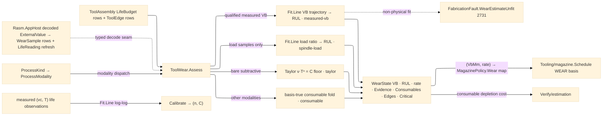

# [RASM_FABRICATION_TOOL_WEAR]

The tool-wear owner: ONE `ToolWear.Assess` fold projecting the wear state of the mounted `ToolAssembly` across every process class — the extended Taylor tool-life law `v·Tⁿ = C` with the ISO 3685 flank-wear criterion (`VB` 0.3 mm uniform) as the catalog FLOOR, a condition-based remaining-useful-life estimate fitted over decoded telemetry as the measured DISPLACER (a flank-wear trajectory when measured `VB` points qualify, a spindle-load-ratio inference when only load samples exist), and the cross-modality consumable state (inserts/endmills for cutting, torch nozzles, waterjet orifices, laser optics, EDM wire guides, extruder nozzles, press-brake dies, weld contact tips) folded off the assembly's admitted `LifeBudget` rows. The dispatch discriminates on the `Process/family#PROCESS_FAMILY` `ProcessModality`: a `subtractive` process assesses the `VB` criterion (only mechanical cutting grows flank wear), every other modality — the thermal/abrasive/erosion rows of `ModalityClass.Removal` included — folds its consumable rows; one entry, no per-modality sibling folds. Every fit rides MathNet `Fit.Line`: the wear trajectory fits `VB` against cumulative cut minutes, the load arm fits spindle-load ratio against cut minutes, and `Calibrate` fits the Taylor pair log-log (`ln v = ln C − n·ln T`) from measured `(v, T)` life observations exactly as `Tooling/cuttingdata.Calibrate` tightens the Kienzle seed — measured shop data displaces the handbook row through the same discipline, never a hand-rolled least squares.

Telemetry law: wear reads DECODED telemetry only — the `Rasm.AppHost` livewire MTConnect poll transport emits flat `ExternalValue` scalars whose AppHost decode lowers to the typed `LifeReading` rows `Tooling/magazine.WithLife` re-projects and to the typed `WearSample` rows this page fits (designed-ahead; the seam closes when the decode counterpart lands); XML/JSON wire serializers and HTTP/MQTT/SHDR transport are NEVER admitted here. The receipt is consumed twice: `Tooling/magazine.Schedule`'s `WEAR` life basis reads the MODELLED wear through the `MagazinePolicy.Wear` map this page's `(VbMm, WearRatePerMin)` values populate — magazine schedules, wear models, never the reverse — and `Verify/estimation` prices tooling off the per-job consumable depletion the `Consumables` rows carry. A too-thin or non-physical trajectory routes `FabricationFault.WearEstimateUnfit` 2731 — the missing-EVIDENCE failure, orthogonal to `NoToolForOp` 2724 (scheduling exhaustion) and `MachinabilityUnknown` 2712 (missing cutting DATA).

Wire posture: HOST-LOCAL. `WearState` crosses only the in-process seam to the magazine scheduler and the estimation fold; decoded telemetry arrives as typed values across the AppHost seam; no wear model type sits between wire and rail.

## [01]-[INDEX]

- [01]-[TOOL_WEAR]: owns the `Consumable` cross-modality axis (nine rows keyed by `ProcessKind`, each fixing its life `Basis` and criterion `Limit`), the `WearEvidence` provenance vocabulary, the `WearSample` decoded-telemetry row, the `WearPolicy` operating point + Taylor seed + load-ratio gate, the `ConsumableRow`/`EdgeWear`/`WearState` receipts, the ONE `ToolWear.Assess` modality-discriminated fold, and the `Calibrate` log-log Taylor fit.

## [02]-[TOOL_WEAR]

- Owner: `Consumable` `[SmartEnum<string>]` the cross-modality consumable axis — each row binding its `Processes` `Set<ProcessKind>` membership, its life `Basis` (`ToolLifeType` — `WEAR` = VB mm per ISO 3685, `MINUTES` = arc-on/cut minutes, `PART_COUNT` = strokes), and its representative criterion `Limit`; `WearEvidence` `[SmartEnum<string>]` the receipt provenance (`measured-vb`/`spindle-load`/`taylor`/`consumable`); `WearSample` the typed decoded-telemetry row (`Instant` stamp, cumulative cut minutes, spindle-load %, optional measured `VB`); `WearPolicy` the operating point (`OperatingVc` — the resolved cutting speed, consumers consult `CuttingData.Of` first) + the extended-Taylor seed pair (`TaylorN`/`TaylorC`) + the break-in filter, minimum-sample gate, and spindle-load limit ratio; `ConsumableRow` the per-consumable depletion row (`Kind`/`Used`/`Limit`/`Warning`/`Remaining` fraction — `Used`/`Limit`/`Warning` read the assembly's LIVE `LifeBudget` row of the matching basis when one rides the asset, the representative criterion otherwise); `EdgeWear` the per-insert remaining-fraction row off `ToolAssembly.Edges`; `WearState` the wear receipt (`VbMm`, `RulMinutes`, `WearRatePerMin`, `Evidence`, the `Consumables` rows, the `Edges` rows, the `Critical` tightest row); `ToolWear` the static surface owning `Assess` and `Calibrate`.
- Cases: `Consumable` rows 9 — `insert` {turn, WEAR 0.3} · `endmill` {mill/route, WEAR 0.3} · `nozzle` {plasma/oxyfuel, MINUTES 480} · `orifice` {waterjet, MINUTES 2400} · `optic` {laser, MINUTES 12000} · `wire-guide` {edm-wire, MINUTES 6000} · `extruder-nozzle` {additive, MINUTES 15000} · `die` {press-brake, PART_COUNT 1e6} · `contact-tip` {weld, MINUTES 600} — representative handbook criteria, live asset budgets displacing per row; `Assess` arms 4, evidence-graded — `subtractive` with qualified measured-`VB` points → the fitted trajectory (`measured-vb`), `subtractive` with load samples only → the load-ratio inference (`spindle-load`), `subtractive` bare → the Taylor projection (`taylor` — `T = (C/v)^(1/n)`, VB advancing linearly toward the criterion), every other modality → the consumable fold (`consumable` — the tightest remaining FRACTION across ALL bases, so a `PART_COUNT` die depletes exactly as a `MINUTES` nozzle does); a `BROKEN`/`EXPIRED` assembly short-circuits to RUL 0 as a RECEIPT, never a fault.
- Entry: `public static Fin<WearState> Assess(ProcessKind process, ToolAssembly assembly, Seq<WearSample> telemetry, WearPolicy policy)` — the ONE polymorphic entry, the evidence grade selected by what the telemetry actually carries, never by mere non-emptiness; `Fin<T>` routes `FabricationFault.WearEstimateUnfit(Tool, samples)` 2731 on a non-physical fitted rate and `GeometryFault.DegenerateInput` on a degenerate operating point; `public static Fin<(double N, double C)> Calibrate(Seq<(double SpeedVc, double LifeMinutes)> observations)` the log-log Taylor fit over MathNet `Fit.Line`.
- Auto: `Assess` builds the `ConsumableRow` set off `Consumable` membership for the process, each row's `Used`/`Limit`/`Warning` reading the assembly's live `LifeBudget` row of its basis (direction-honoring `Used`, refreshed through `Tooling/magazine.WithLife`) with the representative criterion as the no-budget fallback; the trajectory arm sorts post-break-in measured-`VB` points by cut minutes, fits `(cutMinutes → VB)` through `Fit.Line`, and projects `RUL = (VB_limit − VB_now)/rate`; the load arm fits `(cutMinutes → SpindleLoadPct)` and projects RUL to the policy `LoadRatioLimit` crossing — the no-VB displacer the `WearSample` load column exists for; the Taylor arm projects life from the policy pair at the operating speed and advances VB proportionally over consumed minutes; the consumable arm takes the tightest remaining fraction across every row and its basis-true RUL. Per-edge state folds beside the body: each `ToolAssembly.Edges` row yields an `EdgeWear` remaining fraction off its own `LifeBudget` rows, the tightest edge governing an indexable tool's effective remaining life. `Tooling/magazine.Schedule` resolves its `WEAR` life basis against the `(VbMm, WearRatePerMin)` values projected into `MagazinePolicy.Wear`; `Verify/estimation` folds `Consumables` depletion into the tooling cost line.
- Receipt: `WearState` IS the typed wear evidence — the VB estimate, the RUL, the fitted rate, the `WearEvidence` provenance row, the consumable rows, the per-edge rows, and the tightest `Critical` row; no generic wear ledger, no untyped condition blob.
- Packages: `Tooling/magazine#TOOL_MAGAZINE` (`ToolAssembly`/`LifeBudget`/`ToolEdge` — the admitted live-budget carrier, composed), `Process/physics#CUT_PARAMETER` (`Tool` — the fault payload axis), `Process/family#PROCESS_FAMILY` (`ProcessKind`/`ProcessModality` — the modality dispatch), `MathNet.Numerics` (`Fit.Line` — the shared `libs/csharp/.api/api-mathnet-numerics.md` catalogue row), `MTConnect.NET-Common` (`ToolLifeType`/`CutterStatusType` — the model-slice vocabularies riding the admitted rows), `NodaTime` (`Instant` sample stamps), `Rasm.Numerics` (`GeometryFault` band-2400), Thinktecture.Runtime.Extensions, LanguageExt.Core, BCL inbox; cross-package: ← `Rasm.AppHost` decoded telemetry (`ExternalValue` scalars lowered to `LifeReading`/`WearSample` typed rows — designed-ahead, closing when the decode counterpart lands).
- Growth: a new consumable is one `Consumable` row (process membership + basis + criterion); a per-material Taylor pair is a `WearPolicy` value tightened through `Calibrate`, never a page-local table; crater/notch criteria (`KT`, `VB_max`) are criterion columns on the WEAR rows; acoustic-emission or power-signature displacers are one `WearSample` column plus one evidence row; zero new surface.
- Boundary: this page is the ONE wear owner — magazine's `WEAR` life-split reads the modelled `(VbMm, WearRatePerMin)` through its policy map and a scheduler-side wear model is the deleted form; telemetry is DECODED only and reaching for XML/JSON/SHDR transport from this folder is the rejected form; the Taylor pair and every criterion are DATA (policy values, consumable rows, live budgets) — an inline life constant in a fold body is the named defect; every fit composes MathNet `Fit.Line` and a hand-rolled least squares is the deleted form; the consumable axis is ONE table and a per-process wear sibling (`TorchWear`/`DieWear`) is the deleted fragmentation; the evidence grade is the `WearEvidence` row and a boolean provenance flag is the collapsed form; depletion is basis-true — a MINUTES-filtered RUL that leaves a `PART_COUNT` die undepletable is the named coverage defect this rebuild closed.

```csharp signature
// --- [RUNTIME_PRELUDE] ----------------------------------------------------------------------------------------------------------------------------
using LanguageExt;
using LanguageExt.Common;
using MathNet.Numerics;
using MTConnect.Assets.CuttingTools;
using NodaTime;
using Rasm.Fabrication.Process;
using Rasm.Numerics;
using Thinktecture;
using static LanguageExt.Prelude;

namespace Rasm.Fabrication.Tooling;

// --- [TYPES] --------------------------------------------------------------------------------------------------------------------------------------
// Cross-modality consumable axis: Basis fixes the Limit unit (WEAR = VB mm per ISO 3685, MINUTES = arc-on/cut
// minutes, PART_COUNT = strokes). Representative handbook criteria — live asset budgets displace per row.
[SmartEnum<string>]
public sealed partial class Consumable {
    public static readonly Consumable Insert = new("insert", Set(ProcessKind.Turn), ToolLifeType.WEAR, limit: 0.3);
    public static readonly Consumable Endmill = new("endmill", Set(ProcessKind.Mill, ProcessKind.Route), ToolLifeType.WEAR, limit: 0.3);
    public static readonly Consumable Nozzle = new("nozzle", Set(ProcessKind.Plasma, ProcessKind.Oxyfuel), ToolLifeType.MINUTES, limit: 480.0);
    public static readonly Consumable Orifice = new("orifice", Set(ProcessKind.Waterjet), ToolLifeType.MINUTES, limit: 2400.0);
    public static readonly Consumable Optic = new("optic", Set(ProcessKind.Laser), ToolLifeType.MINUTES, limit: 12000.0);
    public static readonly Consumable WireGuide = new("wire-guide", Set(ProcessKind.EdmWire), ToolLifeType.MINUTES, limit: 6000.0);
    public static readonly Consumable ExtruderNozzle = new("extruder-nozzle", Set(ProcessKind.Additive), ToolLifeType.MINUTES, limit: 15000.0);
    public static readonly Consumable Die = new("die", Set(ProcessKind.PressBrake), ToolLifeType.PART_COUNT, limit: 1_000_000.0);
    public static readonly Consumable ContactTip = new("contact-tip", Set(ProcessKind.Weld), ToolLifeType.MINUTES, limit: 600.0);

    public Set<ProcessKind> Processes { get; }
    public ToolLifeType Basis { get; }
    public double Limit { get; }

    public static Seq<Consumable> For(ProcessKind process) => toSeq(Items).Filter(c => c.Processes.Contains(process));
}

[SmartEnum<string>]
public sealed partial class WearEvidence {
    public static readonly WearEvidence MeasuredVb = new("measured-vb");
    public static readonly WearEvidence SpindleLoad = new("spindle-load");
    public static readonly WearEvidence Taylor = new("taylor");
    public static readonly WearEvidence ConsumableBudget = new("consumable");
}

// --- [MODELS] -------------------------------------------------------------------------------------------------------------------------------------
// One decoded telemetry row: CutMinutes is cumulative in-cut time, VbMm a measured flank-wear point,
// SpindleLoadPct the load-ratio displacer the no-VB arm fits. Rows arrive TYPED across the AppHost seam.
public readonly record struct WearSample(Instant At, double CutMinutes, double SpindleLoadPct, Option<double> VbMm);

public readonly record struct ConsumableRow(Consumable Kind, double Used, double Limit, double Warning, double Remaining);

public readonly record struct EdgeWear(string Indices, double Remaining);

// OperatingVc is the resolved cutting speed (consumers consult CuttingData.Of first); TaylorN/TaylorC the
// extended-Taylor pair v·Tⁿ = C — a carbide/steel representative seed, displaced by Calibrate;
// LoadRatioLimit the spindle-load % ceiling the load arm projects RUL against.
public readonly record struct WearPolicy(double OperatingVc, double TaylorN, double TaylorC, double BreakInMinutes, int MinSamples, double LoadRatioLimit) {
    public static readonly WearPolicy Canonical = new(OperatingVc: 180.0, TaylorN: 0.25, TaylorC: 400.0, BreakInMinutes: 2.0, MinSamples: 4, LoadRatioLimit: 140.0);
}

public sealed record WearState(double VbMm, double RulMinutes, double WearRatePerMin, WearEvidence Evidence,
    Seq<ConsumableRow> Consumables, Seq<EdgeWear> Edges, Option<ConsumableRow> Critical);

// --- [OPERATIONS] ---------------------------------------------------------------------------------------------------------------------------------
public static class ToolWear {
    // ONE modality-discriminated entry, evidence-graded: subtractive assesses the VB criterion (measured
    // trajectory when qualified points exist, load-ratio inference when only load samples exist, Taylor floor
    // otherwise); every other modality folds its consumable budget rows basis-true.
    public static Fin<WearState> Assess(ProcessKind process, ToolAssembly assembly, Seq<WearSample> telemetry, WearPolicy policy) {
        Seq<ConsumableRow> rows = Rows(process, assembly);
        Seq<EdgeWear> edges = assembly.Edges.ToSeq().Map(e => new EdgeWear(e.Indices,
            e.Life.Map(static l => l.Fraction).OrderBy(static f => f).HeadOrNone().IfNone(1.0)));
        Seq<(double T, double Vb)> vb = telemetry.Filter(s => s.CutMinutes > policy.BreakInMinutes)
            .Map(s => s.VbMm.Map(v => (s.CutMinutes, v))).Somes().OrderBy(static p => p.CutMinutes).ToSeq();
        Seq<(double T, double Load)> load = telemetry.Filter(s => s.CutMinutes > policy.BreakInMinutes && s.SpindleLoadPct > 0.0)
            .Map(static s => (s.CutMinutes, s.SpindleLoadPct)).OrderBy(static p => p.CutMinutes).ToSeq();
        return assembly.Spent
            ? Fin.Succ(new WearState(VbLimit(rows), RulMinutes: 0.0, WearRatePerMin: 0.0, WearEvidence.ConsumableBudget, rows, edges, Critical(rows)))
            : process.Modality == ProcessModality.Subtractive
                ? vb.Count >= policy.MinSamples ? Trajectory(assembly, vb, rows, edges)
                : load.Count >= policy.MinSamples ? LoadRatio(assembly, load, policy, rows, edges)
                : Taylor(assembly, policy, rows, edges)
                : Fin.Succ(Budget(rows, edges));
    }

    // Taylor calibration off measured (vc, T) life observations: ln v = ln C − n·ln T via Fit.Line log-log —
    // shop life data tightens the seed pair exactly as cuttingdata.Calibrate tightens the Kienzle row.
    public static Fin<(double N, double C)> Calibrate(Seq<(double SpeedVc, double LifeMinutes)> observations) =>
        observations.Count < 2 || observations.Exists(static o => o.SpeedVc <= 0.0 || o.LifeMinutes <= 0.0)
            ? Fin.Fail<(double, double)>(GeometryFault.DegenerateInput("tool-wear:calibrate:insufficient").ToError())
            : Fin.Succ(Fit.Line(observations.Map(static o => Math.Log(o.LifeMinutes)).ToArray(), observations.Map(static o => Math.Log(o.SpeedVc)).ToArray()))
                .Map(static fit => (-fit.Item2, Math.Exp(fit.Item1)));

    // Extended Taylor v·Tⁿ = C: projected life T = (C/v)^(1/n); VB advances proportionally over consumed
    // minutes toward the criterion — the catalog floor a measured displacer replaces.
    static Fin<WearState> Taylor(ToolAssembly assembly, WearPolicy policy, Seq<ConsumableRow> rows, Seq<EdgeWear> edges) {
        if (policy.OperatingVc <= 0.0 || policy.TaylorN <= 0.0 || policy.TaylorC <= 0.0)
            return Fin.Fail<WearState>(GeometryFault.DegenerateInput($"tool-wear:taylor:{policy.OperatingVc}").ToError());
        double life = Math.Pow(policy.TaylorC / policy.OperatingVc, 1.0 / policy.TaylorN);
        double used = assembly.Life.Find(static l => l.Basis == ToolLifeType.MINUTES).Map(static l => l.Used).IfNone(0.0);
        double vbLim = VbLimit(rows);
        return Fin.Succ(new WearState(
            Math.Clamp(vbLim * used / Math.Max(life, 1e-9), 0.0, vbLim),
            Math.Max(0.0, life - used), vbLim / Math.Max(life, 1e-9), WearEvidence.Taylor, rows, edges, Critical(rows)));
    }

    // Condition-based RUL over measured VB: post-break-in points fit a linear wear rate over cut time;
    // RUL = (VB_limit − VB_now)/rate. A non-physical rate routes 2731 — never a guess.
    static Fin<WearState> Trajectory(ToolAssembly assembly, Seq<(double T, double Vb)> pts, Seq<ConsumableRow> rows, Seq<EdgeWear> edges) {
        (double intercept, double rate) = Fit.Line(pts.Map(static p => p.T).ToArray(), pts.Map(static p => p.Vb).ToArray());
        double vbNow = Math.Max(0.0, intercept + rate * pts.Last.T);
        double vbLim = VbLimit(rows);
        return rate <= 0.0
            ? Fin.Fail<WearState>(FabricationFault.WearEstimateUnfit(assembly.Tool, pts.Count).ToError())
            : Fin.Succ(new WearState(vbNow, Math.Max(0.0, (vbLim - vbNow) / rate), rate, WearEvidence.MeasuredVb, rows, edges, Critical(rows)));
    }

    // Load-ratio inference: no measured VB, so the spindle-load rise projects RUL to the policy ceiling;
    // VB reports the load-fraction-scaled criterion — condition evidence, one grade below measured-vb.
    static Fin<WearState> LoadRatio(ToolAssembly assembly, Seq<(double T, double Load)> pts, WearPolicy policy, Seq<ConsumableRow> rows, Seq<EdgeWear> edges) {
        (double intercept, double rate) = Fit.Line(pts.Map(static p => p.T).ToArray(), pts.Map(static p => p.Load).ToArray());
        double now = intercept + rate * pts.Last.T;
        double vbLim = VbLimit(rows);
        return rate <= 0.0 || policy.LoadRatioLimit <= now
            ? rate <= 0.0
                ? Fin.Fail<WearState>(FabricationFault.WearEstimateUnfit(assembly.Tool, pts.Count).ToError())
                : Fin.Succ(new WearState(vbLim, RulMinutes: 0.0, WearRatePerMin: 0.0, WearEvidence.SpindleLoad, rows, edges, Critical(rows)))
            : Fin.Succ(new WearState(vbLim * Math.Clamp(now / policy.LoadRatioLimit, 0.0, 1.0),
                (policy.LoadRatioLimit - now) / rate, rate * vbLim / policy.LoadRatioLimit, WearEvidence.SpindleLoad, rows, edges, Critical(rows)));
    }

    // Basis-true consumable verdict: the tightest remaining FRACTION governs (a PART_COUNT die depletes
    // exactly as a MINUTES nozzle); RulMinutes projects from MINUTES rows alone — other bases carry no clock.
    static WearState Budget(Seq<ConsumableRow> rows, Seq<EdgeWear> edges) =>
        new(VbMm: 0.0,
            rows.Filter(static r => r.Kind.Basis == ToolLifeType.MINUTES).Map(static r => Math.Max(0.0, r.Limit - r.Used))
                .OrderBy(static m => m).HeadOrNone().IfNone(double.PositiveInfinity),
            WearRatePerMin: 0.0, WearEvidence.ConsumableBudget, rows, edges, Critical(rows));

    // Live-budget rows: the assembly's admitted LifeBudget of the matching basis (direction-honoring Used,
    // asset Limit/Warning) displaces the representative criterion; an absent budget reads fresh.
    static Seq<ConsumableRow> Rows(ProcessKind process, ToolAssembly assembly) =>
        Consumable.For(process).Map(c => assembly.Life.Find(l => l.Basis == c.Basis).Match(
            Some: budget => new ConsumableRow(c, budget.Used, budget.Limit > 0.0 ? budget.Limit : c.Limit, budget.Warning,
                budget.Limit > 0.0 ? budget.Fraction : Math.Clamp(1.0 - budget.Used / c.Limit, 0.0, 1.0)),
            None: () => new ConsumableRow(c, Used: 0.0, c.Limit, Warning: 0.0, Remaining: 1.0)));

    static Option<ConsumableRow> Critical(Seq<ConsumableRow> rows) => rows.OrderBy(static r => r.Remaining).HeadOrNone();

    static double VbLimit(Seq<ConsumableRow> rows) =>
        rows.Find(static r => r.Kind.Basis == ToolLifeType.WEAR).Map(static r => r.Limit).IfNone(0.3);
}
```


