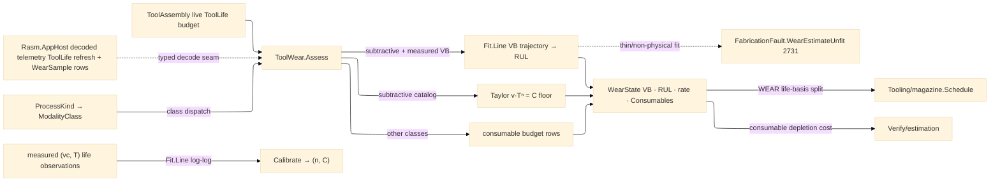

# [RASM_FABRICATION_TOOL_WEAR]

The tool-wear owner: ONE `ToolWear.Assess` fold projecting the wear state of the mounted `ToolAssembly` across every process class — the extended Taylor tool-life law `v·Tⁿ = C` with the ISO 3685 flank-wear criterion (`VB` 0.3 mm uniform) as the catalog FLOOR, a condition-based remaining-useful-life estimate fitted over DECODED MTConnect telemetry as the measured DISPLACER, and the cross-modality consumable state (inserts/endmills for cutting, torch nozzles, waterjet orifices, laser optics, EDM wire guides, extruder nozzles, press-brake dies, weld contact tips) folded off the live `ToolLife` budget as typed rows. The dispatch is class-discriminated on the `Process/family#PROCESS_FAMILY` `ModalityClass` superset: a `subtractive` process assesses the VB trajectory (telemetry-backed when post-break-in measured points exist, Taylor-projected otherwise), every other class folds its consumable rows — one entry, no per-modality sibling folds. Both fits ride MathNet `Fit.Line` (the shared-catalog least-squares line): the wear trajectory fits `VB` against cumulative cut minutes directly, and `Calibrate` fits the Taylor pair log-log (`ln v = ln C − n·ln T`) from measured `(v, T)` life observations exactly as `Tooling/cuttingdata.Calibrate` tightens the Kienzle seed — measured shop data displaces the handbook row through the same discipline, never a hand-rolled least squares.

Telemetry law: wear reads DECODED telemetry ONLY — the `Rasm.AppHost` livewire `MtconnectLane`→`ExternalValue` decode refreshes `ToolLife.Value` on the bound asset (the seam `Tooling/magazine` admits and this page reads live), and measured flank-wear points arrive as typed `WearSample` rows across the same seam; XML/JSON wire serializers and HTTP/MQTT/SHDR transport are NEVER admitted here. The receipt is consumed twice: `Tooling/magazine.Schedule`'s `WEAR` life basis reads the MODELLED wear this page owns (the life-split's `WEAR` arm resolves against `WearState.VbMm` vs the criterion — magazine schedules, wear models, never the reverse), and `Verify/estimation` prices tooling off the per-job consumable depletion the `Consumables` rows carry. A too-thin or non-physical trajectory routes `FabricationFault.WearEstimateUnfit` 2731 — the missing-EVIDENCE failure, orthogonal to `NoToolForOp` 2724 (scheduling exhaustion) and `MachinabilityUnknown` 2712 (missing cutting DATA).

Wire posture: HOST-LOCAL. `WearState` crosses only the in-process seam to the magazine scheduler and the estimation fold; decoded telemetry arrives as typed values across the AppHost seam; no wear model type sits between wire and rail.

## [01]-[INDEX]

- [01]-[TOOL_WEAR]: owns the `Consumable` cross-modality axis (nine rows keyed by `ProcessKind`, grouped by `ModalityClass`, each fixing its life `Basis` and criterion `Limit`), the `WearSample` decoded-telemetry row, the `WearPolicy` operating point + Taylor seed pair, the `ConsumableRow`/`WearState` receipts, the ONE `ToolWear.Assess` class-discriminated fold, and the `Calibrate` log-log Taylor fit.

## [02]-[TOOL_WEAR]

- Owner: `Consumable` `[SmartEnum<string>]` the cross-modality consumable axis — each row binding its `Processes` `Set<ProcessKind>` membership, its `ModalityClass` group, its life `Basis` (`ToolLifeType` — `WEAR` = VB mm per ISO 3685, `MINUTES` = arc-on/cut minutes, `PART_COUNT` = strokes), and its representative criterion `Limit`; `WearSample` the typed decoded-telemetry row (`Instant` stamp, cumulative cut minutes, spindle-load %, optional measured `VB`); `WearPolicy` the operating point (`OperatingVc` — the resolved cutting speed, consumers consult `CuttingData.Of` first) + the extended-Taylor seed pair (`TaylorN`/`TaylorC`) + the break-in filter and minimum-sample gate; `ConsumableRow` the per-consumable depletion row (`Used`/`Limit`/`Remaining`); `WearState` the wear receipt (`VbMm`, `RulMinutes`, `WearRatePerMin`, the `ConditionBacked` provenance flag, the `Consumables` rows); `ToolWear` the static surface owning `Assess` and `Calibrate`.
- Cases: `Consumable` rows 9 — `insert` {turn, WEAR 0.3} · `endmill` {mill/route, WEAR 0.3} · `nozzle` {plasma/oxyfuel, MINUTES 480} · `orifice` {waterjet, MINUTES 2400} · `optic` {laser, MINUTES 12000} · `wire-guide` {edm-wire, MINUTES 6000} · `extruder-nozzle` {additive, MINUTES 15000} · `die` {press-brake, PART_COUNT 1e6} · `contact-tip` {weld, MINUTES 600} — representative handbook criteria, production limits displacing through policy; `Assess` arms 3, class-discriminated — `subtractive` + telemetry → the fitted VB trajectory (condition-backed), `subtractive` catalog → the Taylor projection (`T = (C/v)^(1/n)`, VB advancing linearly toward the criterion), every other class → the consumable-state fold (RUL = the tightest `MINUTES`-basis remaining budget); a `BROKEN`/`EXPIRED` asset short-circuits to RUL 0 as a RECEIPT, never a fault.
- Entry: `public static Fin<WearState> Assess(ProcessKind process, ToolAssembly assembly, Seq<WearSample> telemetry, WearPolicy policy)` — the ONE polymorphic entry, an empty `telemetry` selecting the catalog floor and populated rows the condition-based displacer; `Fin<T>` routes `FabricationFault.WearEstimateUnfit(Tool, samples)` 2731 on a post-break-in sample count under `MinSamples` or a non-positive fitted rate, and `GeometryFault.DegenerateInput` on a degenerate operating point; `public static Fin<(double N, double C)> Calibrate(Seq<(double SpeedVc, double LifeMinutes)> observations)` the log-log Taylor fit over MathNet `Fit.Line`.
- Auto: `Assess` builds the `ConsumableRow` set off `Consumable` membership for the process, reading each row's `Used` from the live asset `ToolLife` entry of its basis (the AppHost decode refreshes `ToolLife.Value` in place, so every read is current); the subtractive trajectory arm filters samples past `BreakInMinutes`, keeps the measured-`VB` points, fits `(cutMinutes → VB)` through `Fit.Line`, and projects `RUL = (VB_limit − VB_now)/rate`; the Taylor arm projects life from the policy pair at the operating speed and advances VB proportionally over consumed minutes; the consumable arm takes the tightest remaining `MINUTES` budget. `Tooling/magazine.Schedule` resolves its `WEAR` life basis against the returned `VbMm` vs the WEAR-row criterion; `Verify/estimation` folds `Consumables` depletion into the tooling cost line.
- Receipt: `WearState` IS the typed wear evidence — the VB estimate, the RUL, the fitted rate, the `ConditionBacked` provenance flag (trajectory-fitted vs Taylor-projected), and the consumable rows; no generic wear ledger, no untyped condition blob.
- Packages: `Tooling/magazine#TOOL_MAGAZINE` (`ToolAssembly` — the live-budget asset, composed), `Process/physics#CUT_PARAMETER` (`Tool` — the fault payload axis), `Process/family#PROCESS_FAMILY` (`ProcessKind`/`ProcessModality`/`ModalityClass` — the class dispatch), `MathNet.Numerics` (`Fit.Line` — the shared `libs/csharp/.api/api-mathnet-numerics.md` catalogue row), `MTConnect.NET-Common` (`ToolLifeType`/`CutterStatusType` — the model slice, never transport), `NodaTime` (`Instant` sample stamps), `Rasm.Numerics` (`GeometryFault` band-2400), Thinktecture.Runtime.Extensions, LanguageExt.Core, BCL inbox; cross-package: ← `Rasm.AppHost` decoded telemetry (`Wire/livewire.md` `MtconnectLane`→`ExternalValue` decode — the `ToolLife` refresh and the typed `WearSample` rows ride the seam `magazine` admits).
- Growth: a new consumable is one `Consumable` row (process membership + class + basis + criterion); a per-material Taylor pair is a `WearPolicy` value tightened through `Calibrate`, never a page-local table; spindle-load-only wear inference (no measured VB) is one widening of the trajectory arm reading the load-ratio signal already on `WearSample`; crater/notch criteria (`KT`, `VB_max`) are criterion columns on the WEAR rows; zero new surface.
- Boundary: this page is the ONE wear owner — magazine's `WEAR` life-split READS the modelled wear and a scheduler-side wear model is the deleted form; telemetry is DECODED only and reaching for XML/JSON/SHDR transport from this folder is the rejected form; the Taylor pair and every criterion are DATA (policy values and consumable rows) — an inline life constant in a fold body is the named defect; both fits compose MathNet `Fit.Line` and a hand-rolled least squares is the deleted form (no optimization surface beyond the pinned package is ever named); the consumable axis is ONE table and a per-process wear sibling (`TorchWear`/`DieWear`) is the deleted fragmentation; a raw-string consumable kind at a call site is the named defect — the typed row travels.

```csharp signature
// --- [RUNTIME_PRELUDE] ----------------------------------------------------------------------------------------------------------------------------
using LanguageExt;
using LanguageExt.Common;
using MathNet.Numerics;
using MTConnect.Assets.CuttingTools;
using NodaTime;
using Rasm.Fabrication.Process;
using Rasm.Numerics;
using Thinktecture;
using static LanguageExt.Prelude;

namespace Rasm.Fabrication.Tooling;

// --- [TYPES] --------------------------------------------------------------------------------------------------------------------------------------
// Cross-modality consumable axis: Basis fixes the Limit unit (WEAR = VB mm per ISO 3685, MINUTES = arc-on/cut
// minutes, PART_COUNT = strokes). Representative handbook criteria — production limits displace via policy.
[SmartEnum<string>]
public sealed partial class Consumable {
    public static readonly Consumable Insert = new("insert", Set(ProcessKind.Turn), ModalityClass.Removal, ToolLifeType.WEAR, limit: 0.3);
    public static readonly Consumable Endmill = new("endmill", Set(ProcessKind.Mill, ProcessKind.Route), ModalityClass.Removal, ToolLifeType.WEAR, limit: 0.3);
    public static readonly Consumable Nozzle =
        new("nozzle", Set(ProcessKind.Plasma, ProcessKind.Oxyfuel), ModalityClass.Removal, ToolLifeType.MINUTES, limit: 480.0);
    public static readonly Consumable Orifice = new("orifice", Set(ProcessKind.Waterjet), ModalityClass.Removal, ToolLifeType.MINUTES, limit: 2400.0);
    public static readonly Consumable Optic = new("optic", Set(ProcessKind.Laser), ModalityClass.Removal, ToolLifeType.MINUTES, limit: 12000.0);
    public static readonly Consumable WireGuide = new("wire-guide", Set(ProcessKind.EdmWire), ModalityClass.Removal, ToolLifeType.MINUTES, limit: 6000.0);
    public static readonly Consumable ExtruderNozzle =
        new("extruder-nozzle", Set(ProcessKind.Additive), ModalityClass.Additive, ToolLifeType.MINUTES, limit: 15000.0);
    public static readonly Consumable Die = new("die", Set(ProcessKind.PressBrake), ModalityClass.Formed, ToolLifeType.PART_COUNT, limit: 1_000_000.0);
    public static readonly Consumable ContactTip = new("contact-tip", Set(ProcessKind.Weld), ModalityClass.Joined, ToolLifeType.MINUTES, limit: 600.0);

    public Set<ProcessKind> Processes { get; }
    public ModalityClass Class { get; }
    public ToolLifeType Basis { get; }
    public double Limit { get; }

    public static Seq<Consumable> For(ProcessKind process) => toSeq(Items).Filter(c => c.Processes.Contains(process));
}

// --- [MODELS] -------------------------------------------------------------------------------------------------------------------------------------
// One decoded telemetry row: CutMinutes is cumulative in-cut time, VbMm a measured flank-wear point. Rows
// arrive TYPED across the AppHost decode seam — this page never sees XML/JSON/SHDR transport.
public readonly record struct WearSample(Instant At, double CutMinutes, double SpindleLoadPct, Option<double> VbMm);

public readonly record struct ConsumableRow(Consumable Kind, double Used, double Limit, double Remaining);

// OperatingVc is the resolved cutting speed (consumers consult CuttingData.Of first); TaylorN/TaylorC the
// extended-Taylor pair v·Tⁿ = C — a carbide/steel representative seed, displaced by Calibrate.
public readonly record struct WearPolicy(double OperatingVc, double TaylorN, double TaylorC, double BreakInMinutes, int MinSamples) {
    public static readonly WearPolicy Canonical = new(OperatingVc: 180.0, TaylorN: 0.25, TaylorC: 400.0, BreakInMinutes: 2.0, MinSamples: 4);
}

public sealed record WearState(double VbMm, double RulMinutes, double WearRatePerMin, bool ConditionBacked, Seq<ConsumableRow> Consumables);

// --- [OPERATIONS] ---------------------------------------------------------------------------------------------------------------------------------
public static class ToolWear {
    // ONE class-discriminated entry: subtractive assesses the VB criterion (measured trajectory when post-
    // break-in points exist, Taylor floor otherwise); every other class folds its consumable budget rows.
    public static Fin<WearState> Assess(ProcessKind process, ToolAssembly assembly, Seq<WearSample> telemetry, WearPolicy policy) {
        Seq<ConsumableRow> rows = Rows(process, assembly);
        return assembly.Spent
            ? Fin.Succ(new WearState(VbLimit(rows), RulMinutes: 0.0, WearRatePerMin: 0.0, ConditionBacked: false, rows))
            : process.Modality == ProcessModality.Subtractive
                ? telemetry.IsEmpty ? Taylor(assembly, policy, rows) : Trajectory(assembly, telemetry, policy, rows)
                : Fin.Succ(new WearState(VbMm: 0.0, MinutesRemaining(rows), WearRatePerMin: 0.0, ConditionBacked: false, rows));
    }

    // Taylor calibration off measured (vc, T) life observations: ln v = ln C − n·ln T via Fit.Line log-log —
    // shop life data tightens the seed pair exactly as cuttingdata.Calibrate tightens the Kienzle row.
    public static Fin<(double N, double C)> Calibrate(Seq<(double SpeedVc, double LifeMinutes)> observations) =>
        observations.Count < 2 || observations.Exists(o => o.SpeedVc <= 0.0 || o.LifeMinutes <= 0.0)
            ? Fin.Fail<(double, double)>(GeometryFault.DegenerateInput("tool-wear:calibrate:insufficient").ToError())
            : Fin.Succ(Fit.Line(observations.Map(o => Math.Log(o.LifeMinutes)).ToArray(), observations.Map(o => Math.Log(o.SpeedVc)).ToArray())
                is var (lnC, negN) ? (-negN, Math.Exp(lnC)) : default);

    // Extended Taylor v·Tⁿ = C: projected life T = (C/v)^(1/n); VB advances proportionally over consumed
    // minutes toward the criterion — the catalog floor a measured trajectory displaces.
    static Fin<WearState> Taylor(ToolAssembly assembly, WearPolicy policy, Seq<ConsumableRow> rows) {
        if (policy.OperatingVc <= 0.0 || policy.TaylorN <= 0.0 || policy.TaylorC <= 0.0)
            return Fin.Fail<WearState>(GeometryFault.DegenerateInput($"tool-wear:taylor:{policy.OperatingVc}").ToError());
        double life = Math.Pow(policy.TaylorC / policy.OperatingVc, 1.0 / policy.TaylorN);
        double used = Used(assembly, ToolLifeType.MINUTES);
        double vbLim = VbLimit(rows);
        return Fin.Succ(new WearState(
            Math.Clamp(vbLim * used / Math.Max(life, 1e-9), 0.0, vbLim),
            Math.Max(0.0, life - used), vbLim / Math.Max(life, 1e-9), ConditionBacked: false, rows));
    }

    // Condition-based RUL: post-break-in measured VB points fit a linear wear rate over cumulative cut time;
    // RUL = (VB_limit − VB_now)/rate. Too few points or a non-physical rate routes 2731 — never a guess.
    static Fin<WearState> Trajectory(ToolAssembly assembly, Seq<WearSample> telemetry, WearPolicy policy, Seq<ConsumableRow> rows) {
        Seq<(double T, double Vb)> pts = telemetry.Filter(s => s.CutMinutes > policy.BreakInMinutes)
            .Map(s => s.VbMm.Map(vb => (s.CutMinutes, vb))).Somes().ToSeq();
        if (pts.Count < policy.MinSamples)
            return Fin.Fail<WearState>(FabricationFault.WearEstimateUnfit(assembly.Tool, pts.Count).ToError());
        (double intercept, double rate) = Fit.Line(pts.Map(static p => p.T).ToArray(), pts.Map(static p => p.Vb).ToArray());
        double vbNow = Math.Max(0.0, intercept + rate * pts.Last.T);
        double vbLim = VbLimit(rows);
        return rate <= 0.0
            ? Fin.Fail<WearState>(FabricationFault.WearEstimateUnfit(assembly.Tool, pts.Count).ToError())
            : Fin.Succ(new WearState(vbNow, Math.Max(0.0, (vbLim - vbNow) / rate), rate, ConditionBacked: true, rows));
    }

    // Consumable rows off the LIVE asset budget: the AppHost decode refreshes ToolLife.Value in place, so
    // Used reads current depletion without re-admission; an absent basis entry reads 0 (fresh consumable).
    static Seq<ConsumableRow> Rows(ProcessKind process, ToolAssembly assembly) =>
        Consumable.For(process).Map(c => {
            double used = Used(assembly, c.Basis);
            return new ConsumableRow(c, used, c.Limit, c.Limit <= 0.0 ? 1.0 : Math.Clamp(1.0 - used / c.Limit, 0.0, 1.0));
        });

    static double Used(ToolAssembly assembly, ToolLifeType basis) =>
        toSeq(assembly.Life.ToolLife).Find(l => l.Type == basis).Map(static l => l.Value).IfNone(0.0);

    static double VbLimit(Seq<ConsumableRow> rows) =>
        rows.Find(static r => r.Kind.Basis == ToolLifeType.WEAR).Map(static r => r.Limit).IfNone(0.3);

    static double MinutesRemaining(Seq<ConsumableRow> rows) =>
        rows.Filter(static r => r.Kind.Basis == ToolLifeType.MINUTES).Map(static r => Math.Max(0.0, r.Limit - r.Used))
            .OrderBy(static m => m).HeadOrNone().IfNone(double.PositiveInfinity);
}
```


