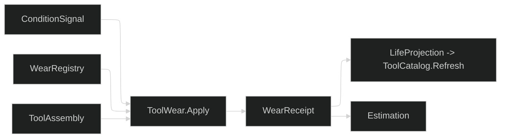

# [RASM_FABRICATION_TOOL_WEAR]

`ToolWear` admits timestamped body, edge, and consumable observations; projects each criterion through an explicit `WearChannel`; fits condition trajectories; derives conservative remaining life; and returns one maintenance decision with its evidence. Subtractive wear and non-subtractive consumption share `ToolLifeBasis` without manufacturing flank-wear fields for unrelated modalities.

`WearRegistry` closes every admitted `ProcessKind` explicitly. Each process is `Tracked` with criteria, consumable specifications, or both, or `Untracked` with a stated reason; uncovered processes cannot become empty success or infinite life. Limits, warnings, reconditioning, and prices remain admitted shop data rather than taxonomy constants.

Wire posture: HOST-LOCAL. `WearState`, `ConsumableRow`, and `CriticalWear` remain named receipt wires; `LifeProjection` feeds `ToolCatalog.Refresh` as window-bounded body-or-edge multi-basis life evidence. `PowerLawFit` in `Tooling/cuttingdata` owns the log-log regression both calibration rails compose.

## [01]-[INDEX]

- [01]-[TOOL_WEAR]: `WearMechanism`, `WearScope`, `WearValueKind`, `ConditionSignal`, `WearChannel`, `WearCriterion`, `ConsumableKind`, `WearApplicability`, `WearRegistry`, `WearPolicy`, `ModelDiagnostic`, `WearState`, `ConsumableRow`, `CriticalWear`, `WearReceipt`, and `ToolWear`.

## [02]-[TOOL_WEAR]

- Owner: `ConditionSignal` owns measured condition; `WearChannel` rows own the signal-component projection and its canonical unit; `WearCriterion` owns terminal and threshold criteria; `WearRegistry` owns process applicability; `TaylorModel` and `ModelDiagnostic` own phase-aware evolution; `WearReceipt` owns forecast and maintenance truth.
- Cases: `ConditionSignal` distinguishes geometry, load, vibration, acoustic, thermal, composition, surface, dimensional, and terminal evidence; `WearCriterion` distinguishes one channel-typed `Threshold` from `TerminalStatus`, the channel row fixing the value kind; `WearApplicability` distinguishes `Tracked` from reasoned `Untracked`; `WearState` distinguishes tool, consumable, status, and unconsumed evidence; `MaintenanceAction` distinguishes continue, monitor, inspect, rotate, replace, recondition, retire, and not-applicable.
- Entry: `ToolWear.Apply(WearRequest)` is the one polymorphic entry over assessment and Taylor calibration.
- Auto: admission accumulates malformed signal, time, target, channel-kind, registry, and budget rows; count channels reject fractional thresholds and Taylor currents. Taylor fallback carries the criterion's channel through condition, state, and evidence, and a channel mismatch fails typed. Assessment groups by target, projects through the declared channel row, removes policy-defined outliers, fits the exposure trajectory, and classifies phase jointly from consumed fraction and the monotone spline's start-to-end derivative ratio, so a curve that steepens reads accelerated before its limit fraction says so. Missing specification, missing reading, untracked-process readings, stale windows, and terminal status fail typed.
- Receipt: `WearReceipt` carries all states, consumable rows, critical row, maintenance action, model diagnostics, and window-bounded `LifeProjection`; projection groups tool states by target and life basis, then retains the most conservative whole forecast per key; `ModelDiagnostic` carries slope, intercept, residual, determination, sample domain, last observed value, and both endpoint derivatives; `TaylorCalibrationReceipt` narrows one `PowerLawReceipt` to the fitted speed coefficient under admitted feed/depth/load exponents. `FabricationFact.ToolWear.Of` projects the critical state onto `rasm.fabrication.tool.wear` and `rasm.fabrication.fit.residual` through `Process/telemetry#FACT_PROJECTION` as kind `tool-wear`, and a receipt without a critical state projects nothing.
- Packages: `NodaTime` `Instant`, `Duration`, and `Interval.Contains`; MathNet.Numerics `Fit.Line` and `IInterpolation.Differentiate` over monotone cubic interpolation; `TensorPrimitives` finite/statistical reductions; `PowerLawFit`; LanguageExt.Core folds/traversals; Thinktecture.Runtime.Extensions; `UnitsNet`; and MTConnect-derived status through `ToolAssembly` compose directly.
- Growth: a mechanism is one `WearMechanism`; a signal is one `ConditionSignal` case with its `WearChannel` projection rows; a consumable taxonomy item is one `ConsumableKind`; process applicability is one registry row; a maintenance disposition is one `MaintenanceAction` case.
- Boundary: mechanism-to-signal guesswork, a hand-written channel-by-signal switch beside the generated channel vocabulary, value-kind-per-criterion sibling cases, applicability cases that differ only by which half is empty, hardcoded consumable limits, uncovered-process empty success, invented zero budgets, infinite fallback life, one global flank criterion, phase read from the limit fraction alone while the page claims trajectory classification, a line fitted to a resampled spline rather than the observations, a current value taken outside the admitted rows, point-estimate scheduling, zero-filled modality fields, untyped edges, bare `Seq.Last`, swallowed fit failures, and status-only spent inference are deleted forms.

```csharp signature
// --- [RUNTIME_PRELUDE] ----------------------------------------------------------------------------------------------------------------------------
using System.Linq;
using System.Numerics.Tensors;
using LanguageExt;
using LanguageExt.Common;
using MathNet.Numerics;
using MathNet.Numerics.Interpolation;
using NodaTime;
using Rasm.Fabrication.Process;
using Thinktecture;
using UnitsNet;
using static LanguageExt.Prelude;

namespace Rasm.Fabrication.Tooling;

// --- [TYPES] --------------------------------------------------------------------------------------------------------------------------------------
[SmartEnum<string>]
public sealed partial class WearMechanism {
    public static readonly WearMechanism Flank = new("flank");
    public static readonly WearMechanism Crater = new("crater");
    public static readonly WearMechanism Notch = new("notch");
    public static readonly WearMechanism Chipping = new("chipping");
    public static readonly WearMechanism Fracture = new("fracture");
    public static readonly WearMechanism ThermalCrack = new("thermal-crack");
    public static readonly WearMechanism PlasticDeformation = new("plastic-deformation");
    public static readonly WearMechanism BuiltUpEdge = new("built-up-edge");
    public static readonly WearMechanism Abrasion = new("abrasion");
    public static readonly WearMechanism Adhesion = new("adhesion");
    public static readonly WearMechanism Diffusion = new("diffusion");
    public static readonly WearMechanism Oxidation = new("oxidation");
}

[SmartEnum<string>]
public sealed partial class WearPhase {
    public static readonly WearPhase BreakIn = new("break-in");
    public static readonly WearPhase Steady = new("steady");
    public static readonly WearPhase Accelerated = new("accelerated");
    public static readonly WearPhase Terminal = new("terminal");
}

[SmartEnum<string>]
public sealed partial class WearScope {
    public static readonly WearScope Body = new("body");
    public static readonly WearScope Edge = new("edge");
    public static readonly WearScope Any = new("any");

    public bool Admits(ToolTarget target) => this == Any
        || this == Body && target is ToolTarget.Body
        || this == Edge && target is ToolTarget.Edge;
}

[SmartEnum<string>]
public sealed partial class WearValueKind {
    public static readonly WearValueKind Linear = new("linear");
    public static readonly WearValueKind Scalar = new("scalar");
    public static readonly WearValueKind Count = new("count");
}

[SmartEnum<string>]
public sealed partial class ConsumableKind {
    public static readonly ConsumableKind CuttingEdge = new("cutting-edge");
    public static readonly ConsumableKind GrindingWheel = new("grinding-wheel");
    public static readonly ConsumableKind SawBlade = new("saw-blade");
    public static readonly ConsumableKind LaserOptic = new("laser-optic");
    public static readonly ConsumableKind PlasmaElectrode = new("plasma-electrode");
    public static readonly ConsumableKind PlasmaNozzle = new("plasma-nozzle");
    public static readonly ConsumableKind Abrasive = new("abrasive");
    public static readonly ConsumableKind MixingTube = new("mixing-tube");
    public static readonly ConsumableKind WireElectrode = new("wire-electrode");
    public static readonly ConsumableKind ExtrusionNozzle = new("extrusion-nozzle");
    public static readonly ConsumableKind DepositionNozzle = new("deposition-nozzle");
    public static readonly ConsumableKind BuildPlate = new("build-plate");
    public static readonly ConsumableKind Recoater = new("recoater");
    public static readonly ConsumableKind VatFilm = new("vat-film");
    public static readonly ConsumableKind ResinFilter = new("resin-filter");
    public static readonly ConsumableKind PowderSieve = new("powder-sieve");
    public static readonly ConsumableKind OxyfuelTip = new("oxyfuel-tip");
    public static readonly ConsumableKind WeldElectrode = new("weld-electrode");
    public static readonly ConsumableKind ContactTip = new("contact-tip");
    public static readonly ConsumableKind ShieldingMedium = new("shielding-medium");
    public static readonly ConsumableKind BrakeTooling = new("brake-tooling");
}

// --- [SIGNALS] ------------------------------------------------------------------------------------------------------------------------------------
[Union(ConversionFromValue = ConversionOperatorsGeneration.None)]
public abstract partial record ConditionSignal {
    private ConditionSignal() { }
    public sealed record Flank(Length Average, Length Maximum) : ConditionSignal;
    public sealed record Crater(Length Depth, Length Width) : ConditionSignal;
    public sealed record Notch(Length Depth) : ConditionSignal;
    public sealed record EdgeDamage(int Chips, bool Fractured) : ConditionSignal;
    public sealed record Load(Force Force, Torque Torque, Power Power) : ConditionSignal;
    public sealed record Vibration(double RootMeanSquare, double Kurtosis, double CrestFactor) : ConditionSignal;
    public sealed record Acoustic(double RootMeanSquare, double BurstRate) : ConditionSignal;
    public sealed record Thermal(Temperature Temperature) : ConditionSignal;
    public sealed record Composition(double DiffusionIndex, double OxideFraction,
        double AbrasiveParticleIndex) : ConditionSignal;
    public sealed record Surface(Length RoughnessRa, Length RoughnessRz) : ConditionSignal;
    public sealed record Dimensional(Length Drift) : ConditionSignal;
    public sealed record Status(Seq<ToolAvailability> States) : ConditionSignal;
}

[SmartEnum<string>]
public sealed partial class WearChannel {
    public static readonly WearChannel FlankAverage = new("flank-average", WearValueKind.Linear, "mm",
        static signal => signal is ConditionSignal.Flank row ? Some(row.Average.Millimeters) : None);
    public static readonly WearChannel FlankMaximum = new("flank-maximum", WearValueKind.Linear, "mm",
        static signal => signal is ConditionSignal.Flank row ? Some(row.Maximum.Millimeters) : None);
    public static readonly WearChannel CraterDepth = new("crater-depth", WearValueKind.Linear, "mm",
        static signal => signal is ConditionSignal.Crater row ? Some(row.Depth.Millimeters) : None);
    public static readonly WearChannel CraterWidth = new("crater-width", WearValueKind.Linear, "mm",
        static signal => signal is ConditionSignal.Crater row ? Some(row.Width.Millimeters) : None);
    public static readonly WearChannel NotchDepth = new("notch-depth", WearValueKind.Linear, "mm",
        static signal => signal is ConditionSignal.Notch row ? Some(row.Depth.Millimeters) : None);
    public static readonly WearChannel SurfaceRa = new("surface-ra", WearValueKind.Linear, "mm",
        static signal => signal is ConditionSignal.Surface row ? Some(row.RoughnessRa.Millimeters) : None);
    public static readonly WearChannel SurfaceRz = new("surface-rz", WearValueKind.Linear, "mm",
        static signal => signal is ConditionSignal.Surface row ? Some(row.RoughnessRz.Millimeters) : None);
    public static readonly WearChannel DimensionalDrift = new("dimensional-drift", WearValueKind.Linear, "mm",
        static signal => signal is ConditionSignal.Dimensional row ? Some(row.Drift.Millimeters) : None);
    public static readonly WearChannel Force = new("force", WearValueKind.Scalar, "N",
        static signal => signal is ConditionSignal.Load row ? Some(row.Force.Newtons) : None);
    public static readonly WearChannel Torque = new("torque", WearValueKind.Scalar, "N*m",
        static signal => signal is ConditionSignal.Load row ? Some(row.Torque.NewtonMeters) : None);
    public static readonly WearChannel Power = new("power", WearValueKind.Scalar, "W",
        static signal => signal is ConditionSignal.Load row ? Some(row.Power.Watts) : None);
    public static readonly WearChannel VibrationRms = new("vibration-rms", WearValueKind.Scalar, "1",
        static signal => signal is ConditionSignal.Vibration row ? Some(row.RootMeanSquare) : None);
    public static readonly WearChannel VibrationKurtosis = new("vibration-kurtosis", WearValueKind.Scalar, "1",
        static signal => signal is ConditionSignal.Vibration row ? Some(row.Kurtosis) : None);
    public static readonly WearChannel VibrationCrest = new("vibration-crest", WearValueKind.Scalar, "1",
        static signal => signal is ConditionSignal.Vibration row ? Some(row.CrestFactor) : None);
    public static readonly WearChannel AcousticRms = new("acoustic-rms", WearValueKind.Scalar, "1",
        static signal => signal is ConditionSignal.Acoustic row ? Some(row.RootMeanSquare) : None);
    public static readonly WearChannel AcousticBurstRate = new("acoustic-burst-rate", WearValueKind.Scalar, "1/s",
        static signal => signal is ConditionSignal.Acoustic row ? Some(row.BurstRate) : None);
    public static readonly WearChannel Temperature = new("temperature", WearValueKind.Scalar, "degC",
        static signal => signal is ConditionSignal.Thermal row ? Some(row.Temperature.DegreesCelsius) : None);
    public static readonly WearChannel Diffusion = new("diffusion", WearValueKind.Scalar, "1",
        static signal => signal is ConditionSignal.Composition row ? Some(row.DiffusionIndex) : None);
    public static readonly WearChannel Oxide = new("oxide", WearValueKind.Scalar, "1",
        static signal => signal is ConditionSignal.Composition row ? Some(row.OxideFraction) : None);
    public static readonly WearChannel AbrasiveParticle = new("abrasive-particle", WearValueKind.Scalar, "1",
        static signal => signal is ConditionSignal.Composition row ? Some(row.AbrasiveParticleIndex) : None);
    public static readonly WearChannel ChipCount = new("chip-count", WearValueKind.Count, "1",
        static signal => signal is ConditionSignal.EdgeDamage row ? Some((double)row.Chips) : None);
    public static readonly WearChannel Fracture = new("fracture", WearValueKind.Count, "1",
        static signal => signal is ConditionSignal.EdgeDamage row ? Some(row.Fractured ? 1.0 : 0.0) : None);

    public WearValueKind Kind { get; }
    public string Unit { get; }
    public Func<ConditionSignal, Option<double>> Project { get; }
}

[Union(ConversionFromValue = ConversionOperatorsGeneration.None)]
public abstract partial record WearCriterion {
    private WearCriterion() { }
    public sealed record Threshold(WearScope Scope, WearMechanism Mechanism, WearChannel Channel,
        ToolLifeBasis Basis, double Warning, double Limit) : WearCriterion;
    public sealed record TerminalStatus(WearScope Scope, Seq<ToolAvailability> States) : WearCriterion;
}

[ComplexValueObject]
public sealed partial class WearSample {
    public ToolTarget Target { get; }
    public ProcessKind Process { get; }
    public Instant At { get; }
    public HashMap<ToolLifeBasis, double> Exposure { get; }
    public Seq<ConditionSignal> Signals { get; }

    static partial void ValidateFactoryArguments(ref ValidationError? validationError, ref ToolTarget target,
        ref ProcessKind process, ref Instant at, ref HashMap<ToolLifeBasis, double> exposure,
        ref Seq<ConditionSignal> signals) =>
        validationError = target is null || process is null || exposure.IsEmpty || signals.IsEmpty
            || exposure.AsIterable().Exists(static row => !double.IsFinite(row.Value) || row.Value < 0.0)
            || signals.Exists(static signal => !SignalValid(signal))
            ? new ValidationError(message: "wear-sample") : null;

    private static bool SignalValid(ConditionSignal signal) => signal.Switch(
        flank: static row => row.Average >= Length.Zero && row.Maximum >= row.Average,
        crater: static row => row.Depth >= Length.Zero && row.Width >= Length.Zero,
        notch: static row => row.Depth >= Length.Zero,
        edgeDamage: static row => row.Chips >= 0,
        load: static row => row.Force >= Force.Zero && row.Torque >= Torque.Zero && row.Power >= Power.Zero,
        vibration: static row => Seq(row.RootMeanSquare, row.Kurtosis, row.CrestFactor)
            .ForAll(static value => double.IsFinite(value) && value >= 0.0),
        acoustic: static row => Seq(row.RootMeanSquare, row.BurstRate)
            .ForAll(static value => double.IsFinite(value) && value >= 0.0),
        thermal: static row => double.IsFinite(row.Temperature.DegreesCelsius),
        composition: static row => Seq(row.DiffusionIndex, row.OxideFraction, row.AbrasiveParticleIndex)
            .ForAll(static value => double.IsFinite(value) && value >= 0.0),
        surface: static row => row.RoughnessRa >= Length.Zero && row.RoughnessRz >= row.RoughnessRa,
        dimensional: static row => double.IsFinite(row.Drift.Millimeters),
        status: static row => !row.States.IsEmpty);
}

// --- [CONSUMABLE_REGISTRY] ------------------------------------------------------------------------------------------------------------------------
[ValueObject<string>]
public sealed partial class ConsumableKey {
    static partial void ValidateFactoryArguments(ref ValidationError? validationError, ref string value) {
        value = value?.Trim() ?? string.Empty;
        validationError = value.Length == 0 ? new ValidationError(message: "consumable-key") : null;
    }
}

[ComplexValueObject]
public sealed partial class ConsumableSpec {
    public ConsumableKey Key { get; }
    public ConsumableKind Kind { get; }
    public ToolLifeBasis Basis { get; }
    public double Warning { get; }
    public double Limit { get; }
    public bool Reconditionable { get; }
    public int MaximumReconditions { get; }
    public string Evidence { get; }

    static partial void ValidateFactoryArguments(ref ValidationError? validationError, ref ConsumableKey key,
        ref ConsumableKind kind, ref ToolLifeBasis basis, ref double warning, ref double limit,
        ref bool reconditionable, ref int maximumReconditions, ref string evidence) {
        evidence = evidence?.Trim() ?? string.Empty;
        validationError = key is null || kind is null || basis is null || !double.IsFinite(warning)
            || !double.IsFinite(limit) || warning < 0.0 || warning > limit || limit <= 0.0
            || maximumReconditions < 0 || (!reconditionable && maximumReconditions != 0) || evidence.Length == 0
            ? new ValidationError(message: "consumable-spec") : null;
    }
}

[Union(ConversionFromValue = ConversionOperatorsGeneration.None)]
public abstract partial record WearApplicability {
    private WearApplicability() { }
    public sealed record Tracked(Seq<WearCriterion> Criteria, Seq<ConsumableSpec> Specs) : WearApplicability;
    public sealed record Untracked(string Reason) : WearApplicability;
}

public sealed record ProcessWear(ProcessKind Process, WearApplicability Applicability);

[ComplexValueObject]
public sealed partial class WearRegistry {
    public Seq<ProcessWear> Rows { get; }

    static partial void ValidateFactoryArguments(ref ValidationError? validationError, ref Seq<ProcessWear> rows) =>
        validationError = rows.Map(static row => row.Process).Distinct().Count != rows.Count
            || toSeq(ProcessKind.Items).Exists(process => !rows.Exists(row => row.Process == process))
            || rows.Exists(static row => row.Applicability.Switch(
                tracked: static value => value.Criteria.IsEmpty && value.Specs.IsEmpty
                    || value.Criteria.Exists(static criterion => !CriterionValid(criterion))
                    || value.Specs.Map(static spec => spec.Key).Distinct().Count != value.Specs.Count,
                untracked: static value => string.IsNullOrWhiteSpace(value.Reason)))
            ? new ValidationError(message: "wear-registry") : null;

    public Option<WearApplicability> For(ProcessKind process) => Rows.Find(row => row.Process == process)
        .Map(static row => row.Applicability);

    private static bool CriterionValid(WearCriterion criterion) => criterion.Switch(
        threshold: static row => row.Scope is not null && row.Mechanism is not null && row.Basis is not null
            && row.Channel is not null && double.IsFinite(row.Warning) && double.IsFinite(row.Limit)
            && row.Warning >= 0.0 && row.Limit > row.Warning
            && (row.Channel.Kind != WearValueKind.Count
                || (double.IsInteger(row.Warning) && double.IsInteger(row.Limit))),
        terminalStatus: static row => row.Scope is not null && !row.States.IsEmpty);
}

public sealed record ConsumableReading(ConsumableKey Key, ToolLifeBasis Basis, double Used,
    int Reconditions, Instant At);

// --- [MODELS] -------------------------------------------------------------------------------------------------------------------------------------
[ComplexValueObject]
public sealed partial class TaylorModel {
    public ToolLifeBasis Basis { get; }
    public double Constant { get; }
    public double SpeedExponent { get; }
    public double FeedExponent { get; }
    public double DepthExponent { get; }
    public double LoadExponent { get; }

    static partial void ValidateFactoryArguments(ref ValidationError? validationError, ref ToolLifeBasis basis,
        ref double constant, ref double speedExponent, ref double feedExponent, ref double depthExponent,
        ref double loadExponent) =>
        validationError = basis is null || !Seq(constant, speedExponent, feedExponent, depthExponent, loadExponent)
            .ForAll(double.IsFinite) || constant <= 0.0
            || Seq(speedExponent, feedExponent, depthExponent, loadExponent).Exists(static value => value <= 0.0)
            ? new ValidationError(message: "taylor-model") : null;

    public double Life(Speed speed, Speed feed, Length depth, Force load) =>
        Constant / (Math.Pow(speed.MetersPerSecond, SpeedExponent) * Math.Pow(feed.MetersPerSecond, FeedExponent)
            * Math.Pow(depth.Millimeters, DepthExponent) * Math.Pow(load.Newtons, LoadExponent));
}

[ComplexValueObject]
public sealed partial class WearPolicy {
    public int MinimumSamples { get; }
    public Interval Window { get; }
    public Duration MaximumGap { get; }
    public double OutlierSigma { get; }
    public double MinimumRSquared { get; }
    public double ConfidenceMultiplier { get; }
    public double BreakInFraction { get; }
    public double AcceleratedFraction { get; }
    public double InspectionFraction { get; }
    public double CurvatureBand { get; }
    public Option<TaylorModel> Taylor { get; }

    static partial void ValidateFactoryArguments(ref ValidationError? validationError, ref int minimumSamples,
        ref Interval window, ref Duration maximumGap, ref double outlierSigma, ref double minimumRSquared,
        ref double confidenceMultiplier, ref double breakInFraction, ref double acceleratedFraction,
        ref double inspectionFraction, ref double curvatureBand, ref Option<TaylorModel> taylor) =>
        validationError = minimumSamples < 3 || maximumGap <= Duration.Zero
            || !Seq(outlierSigma, minimumRSquared, confidenceMultiplier, breakInFraction, acceleratedFraction,
                    inspectionFraction, curvatureBand)
                .ForAll(double.IsFinite)
            || outlierSigma <= 0.0 || minimumRSquared is < 0.0 or > 1.0 || confidenceMultiplier <= 0.0
            || breakInFraction is <= 0.0 or >= 1.0 || acceleratedFraction <= breakInFraction
            || acceleratedFraction >= 1.0 || inspectionFraction is <= 0.0 or >= 1.0
            || curvatureBand is <= 0.0 or >= 1.0
            ? new ValidationError(message: "wear-policy") : null;
}

public sealed record ForecastBand(double Consumed, double WarningAt, double LimitAt,
    double Estimate, double StandardError, double Conservative, ToolLifeBasis Basis, WearPhase Phase) {
    public static ForecastBand Of(double consumed, double warningAt, double limitAt, double estimate,
        double standardError, double confidenceMultiplier, ToolLifeBasis basis, WearPhase phase) =>
        new(consumed, Math.Clamp(warningAt, 0.0, limitAt), limitAt, Math.Max(0.0, estimate), standardError,
            Math.Max(0.0, estimate - confidenceMultiplier * standardError), basis, phase);
}
public sealed record ModelDiagnostic(double Slope, double Intercept, double RootMeanSquareResidual,
    double RSquared, int Samples, double FirstExposure, double LastExposure, double LastValue,
    double SlopeFirst, double SlopeLast, Instant First, Instant Last) {
    public double Curvature => SlopeFirst <= 0.0 ? 1.0 : SlopeLast / SlopeFirst;
}

[Union(ConversionFromValue = ConversionOperatorsGeneration.None)]
public abstract partial record WearEvidence {
    private WearEvidence() { }
    public sealed record Measured(WearChannel Channel, Seq<WearSample> Samples, Condition Current,
        ModelDiagnostic Diagnostic) : WearEvidence;
    public sealed record Condition(ConditionSignal Signal) : WearEvidence;
    public sealed record Taylor(TaylorModel Model, WearChannel Channel, double Current,
        Speed Speed, Speed Feed, Length Depth, Force Load) : WearEvidence;
    public sealed record Budget(ConsumableSpec Spec, ConsumableReading Reading) : WearEvidence;
    public sealed record Terminal(Seq<ToolAvailability> Status, Instant At) : WearEvidence;
}

[Union(ConversionFromValue = ConversionOperatorsGeneration.None)]
public abstract partial record WearState {
    private WearState() { }
    public sealed record Tool(ToolTarget Target, WearMechanism Mechanism, WearChannel Channel, double Current,
        double Warning, double Limit, ForecastBand Remaining, WearEvidence Evidence) : WearState;
    public sealed record Consumable(ConsumableKey Key, ConsumableKind Kind, double Current,
        double Warning, double Limit, ForecastBand Remaining, WearEvidence Evidence) : WearState;
    public sealed record Status(ToolTarget Target, Seq<ToolAvailability> States, bool Terminal,
        WearEvidence Evidence) : WearState;
    public sealed record Unconsumed(ProcessKind Process, string Reason) : WearState;
}

public sealed record ConsumableRow(ConsumableKey Key, ConsumableKind Kind, ToolLifeBasis Basis,
    double Used, double Limit, double ConservativeRemaining, bool Reconditionable, int Reconditions,
    int MaximumReconditions, string Evidence);
public sealed record CriticalWear(WearState State, ToolLifeBasis Basis, double ConservativeRemaining,
    double FractionRemaining);

[Union(ConversionFromValue = ConversionOperatorsGeneration.None)]
public abstract partial record MaintenanceAction {
    private MaintenanceAction() { }
    public sealed record Continue(CriticalWear Critical) : MaintenanceAction;
    public sealed record Monitor(WearState.Status Status) : MaintenanceAction;
    public sealed record Inspect(CriticalWear Critical, double Within) : MaintenanceAction;
    public sealed record Rotate(ToolEdgeKey Edge, CriticalWear Critical) : MaintenanceAction;
    public sealed record Replace(CriticalWear Critical) : MaintenanceAction;
    public sealed record Recondition(ConsumableKey Key, int NextCycle, CriticalWear Critical) : MaintenanceAction;
    public sealed record Retire(CriticalWear Critical) : MaintenanceAction;
    public sealed record NotApplicable(ProcessKind Process, string Reason) : MaintenanceAction;
}

public sealed record WearReceipt(Seq<WearState> States, Seq<ConsumableRow> Consumables,
    Option<CriticalWear> Critical, MaintenanceAction Action, Seq<ModelDiagnostic> Diagnostics,
    Seq<LifeBudget> LifeProjection, Instant AssessedAt);

[ComplexValueObject]
public sealed partial class TaylorCondition {
    public ToolTarget Target { get; }
    public ToolLifeBasis Basis { get; }
    public WearChannel Channel { get; }
    public double Consumed { get; }
    public Speed Speed { get; }
    public Speed Feed { get; }
    public Length Depth { get; }
    public Force Load { get; }
    public double Current { get; }
    public double RelativeUncertainty { get; }

    static partial void ValidateFactoryArguments(ref ValidationError? validationError, ref ToolTarget target,
        ref ToolLifeBasis basis, ref WearChannel channel, ref double consumed, ref Speed speed,
        ref Speed feed, ref Length depth, ref Force load, ref double current, ref double relativeUncertainty) =>
        validationError = target is null || basis is null || channel is null
            || !double.IsFinite(consumed) || consumed < 0.0
            || speed.MetersPerSecond <= 0.0 || feed.MetersPerSecond <= 0.0
            || depth <= Length.Zero || load.Newtons <= 0.0
            || !double.IsFinite(current) || current < 0.0 || !double.IsFinite(relativeUncertainty)
            || channel is not null && channel.Kind == WearValueKind.Count && current != Math.Truncate(current)
            || relativeUncertainty is < 0.0 or >= 1.0
            ? new ValidationError(message: "taylor-condition") : null;
}

[ComplexValueObject]
public sealed partial class WearAssessment {
    public ProcessKind Process { get; }
    public ToolAssembly Assembly { get; }
    public Seq<WearSample> Samples { get; }
    public Seq<ConsumableReading> Consumables { get; }
    public Option<TaylorCondition> Taylor { get; }
    public WearRegistry Registry { get; }
    public WearPolicy Policy { get; }
    public Instant AssessedAt { get; }

    static partial void ValidateFactoryArguments(ref ValidationError? validationError, ref ProcessKind process,
        ref ToolAssembly assembly, ref Seq<WearSample> samples, ref Seq<ConsumableReading> consumables,
        ref Option<TaylorCondition> taylor, ref WearRegistry registry, ref WearPolicy policy,
        ref Instant assessedAt) =>
        validationError = process is null || assembly is null || registry is null || policy is null
            || !policy.Window.Contains(assessedAt) || samples.Exists(sample => sample.Process != process)
            || samples.Exists(sample => !policy.Window.Contains(sample.At)
                || sample.Target is ToolTarget.Edge edge
                    && !assembly.Snapshot.Edges.Exists(candidate => candidate.Key == edge.Key))
            || taylor.Exists(condition => condition.Target is ToolTarget.Edge edge
                && !assembly.Snapshot.Edges.Exists(candidate => candidate.Key == edge.Key))
            || consumables.Exists(row => !policy.Window.Contains(row.At) || !double.IsFinite(row.Used)
                || row.Used < 0.0 || row.Reconditions < 0)
            || consumables.Map(static row => (row.Key, row.Basis)).Distinct().Count != consumables.Count
            ? new ValidationError(message: "wear-assessment") : null;
}

[ComplexValueObject]
public sealed partial class TaylorSample {
    public Speed Speed { get; }
    public Speed Feed { get; }
    public Length Depth { get; }
    public Force Load { get; }
    public double Life { get; }

    static partial void ValidateFactoryArguments(ref ValidationError? validationError, ref Speed speed,
        ref Speed feed, ref Length depth, ref Force load, ref double life) =>
        validationError = speed.MetersPerSecond <= 0.0 || feed.MetersPerSecond <= 0.0
            || depth <= Length.Zero || load.Newtons <= 0.0
            || !double.IsFinite(life) || life <= 0.0 ? new ValidationError(message: "taylor-sample") : null;
}

[ComplexValueObject]
public sealed partial class TaylorCalibration {
    public Seq<TaylorSample> Samples { get; }
    public ToolLifeBasis Basis { get; }
    public double FeedExponent { get; }
    public double DepthExponent { get; }
    public double LoadExponent { get; }
    public int MinimumSamples { get; }
    public double MaximumResidual { get; }
    public double MinimumRSquared { get; }
    public Speed MinimumSpeedSpan { get; }

    static partial void ValidateFactoryArguments(ref ValidationError? validationError, ref Seq<TaylorSample> samples,
        ref ToolLifeBasis basis, ref double feedExponent, ref double depthExponent, ref double loadExponent,
        ref int minimumSamples, ref double maximumResidual, ref double minimumRSquared, ref Speed minimumSpeedSpan) =>
        validationError = basis is null || minimumSamples < 3 || samples.Count < minimumSamples
            || !Seq(feedExponent, depthExponent, loadExponent, maximumResidual)
                .ForAll(static value => double.IsFinite(value) && value > 0.0)
            || !double.IsFinite(minimumRSquared) || minimumRSquared is < 0.0 or > 1.0
            || minimumSpeedSpan.MetersPerSecond <= 0.0
            || samples.Map(static row => row.Speed.MetersPerSecond).Max()
                - samples.Map(static row => row.Speed.MetersPerSecond).Min() < minimumSpeedSpan.MetersPerSecond
            ? new ValidationError(message: "taylor-calibration") : null;
}

[ComplexValueObject]
public sealed partial class TaylorCalibrationReceipt {
    public TaylorModel Model { get; }
    public double RootMeanSquareResidual { get; }
    public double RSquared { get; }
    public Speed SpeedMinimum { get; }
    public Speed SpeedMaximum { get; }
    public int Samples { get; }

    static partial void ValidateFactoryArguments(ref ValidationError? validationError, ref TaylorModel model,
        ref double rootMeanSquareResidual, ref double rSquared, ref Speed speedMinimum, ref Speed speedMaximum,
        ref int samples) =>
        validationError = model is null || !double.IsFinite(rootMeanSquareResidual) || rootMeanSquareResidual < 0.0
            || !double.IsFinite(rSquared) || rSquared is < 0.0 or > 1.0
            || speedMinimum.MetersPerSecond <= 0.0
            || speedMaximum.MetersPerSecond <= speedMinimum.MetersPerSecond || samples < 3
            ? new ValidationError(message: "taylor-calibration-receipt") : null;
}

[Union(ConversionFromValue = ConversionOperatorsGeneration.None)]
public abstract partial record WearRequest {
    private WearRequest() { }
    public sealed record Assess(WearAssessment Value) : WearRequest;
    public sealed record Calibrate(TaylorCalibration Value) : WearRequest;
}

[Union(ConversionFromValue = ConversionOperatorsGeneration.None)]
public abstract partial record WearResult {
    private WearResult() { }
    public sealed record Assessment(WearReceipt Receipt) : WearResult;
    public sealed record Calibration(TaylorCalibrationReceipt Receipt) : WearResult;
}

// --- [OPERATIONS] ---------------------------------------------------------------------------------------------------------------------------------
public static class ToolWear {
    public static Fin<WearResult> Apply(WearRequest request) => request.Switch(
        assess: static row => Assess(row.Value).Map<WearResult>(static receipt => new WearResult.Assessment(receipt)),
        calibrate: static row => Calibrate(row.Value).Map<WearResult>(static receipt => new WearResult.Calibration(receipt)));

    private static Fin<WearReceipt> Assess(WearAssessment request) =>
        from applicability in request.Registry.For(request.Process)
            .ToFin(FabricationFault.WearEstimateUnfit(request.Assembly.Tool, request.Samples.Count))
        from _ in InputFits(applicability, request)
        from toolStates in ToolStates(applicability, request)
        from consumableStates in ConsumableStates(applicability, request)
        let states = toolStates.Concat(consumableStates.Map<WearState>(static row => row.State))
        let critical = Critical(states)
        let action = critical.Map(row => Action(row, request, consumableStates))
            .IfNone(() => states.Choose(static state => state is WearState.Status row ? Some(row) : None)
                .HeadOrNone().Map<MaintenanceAction>(static row => new MaintenanceAction.Monitor(row))
                .IfNone(() => new MaintenanceAction.NotApplicable(request.Process,
                    states.Choose(static state => state is WearState.Unconsumed row ? Some(row.Reason) : None)
                        .HeadOrNone().IfNone("no-terminal-consumption"))))
        from life in Project(states, request.Policy, request.AssessedAt)
        select new WearReceipt(states, consumableStates.Choose(static row => row.Row), critical, action,
            toolStates.Choose(static state => state is WearState.Tool tool && tool.Evidence is WearEvidence.Measured measured
                ? Some(measured.Diagnostic) : None), life, request.AssessedAt);

    private static Fin<Unit> InputFits(WearApplicability applicability, WearAssessment request) => applicability switch {
        WearApplicability.Untracked when !request.Samples.IsEmpty || request.Taylor.IsSome || !request.Consumables.IsEmpty =>
            Fin.Fail<Unit>(Error.New(message: "wear-untracked-input")),
        WearApplicability.Tracked { Criteria.IsEmpty: true } when !request.Samples.IsEmpty || request.Taylor.IsSome =>
            Fin.Fail<Unit>(Error.New(message: "wear-tool-input")),
        WearApplicability.Tracked { Specs.IsEmpty: true } when !request.Consumables.IsEmpty =>
            Fin.Fail<Unit>(Error.New(message: "wear-consumable-input")),
        _ => Fin.Succ(unit)
    };

    private static Fin<Seq<WearState>> ToolStates(WearApplicability applicability, WearAssessment request) {
        Seq<WearCriterion> criteria = applicability is WearApplicability.Tracked tracked
            ? tracked.Criteria : Seq<WearCriterion>();
        if (criteria.IsEmpty)
            return Fin.Succ(Seq<WearState>());
        Seq<ToolTarget> targets = request.Samples.Map(static sample => sample.Target)
            .Concat(request.Taylor.Map(static condition => condition.Target).ToSeq()).Distinct().ToSeq();
        Seq<(ToolTarget Target, WearCriterion Criterion)> pairs = targets.Bind(target =>
            criteria.Filter(criterion => Scope(criterion).Admits(target))
                .Map(criterion => (Target: target, Criterion: criterion))).ToSeq();
        return targets.IsEmpty || criteria.Exists(criterion => !targets.Exists(Scope(criterion).Admits))
            || targets.Exists(target => !criteria.Exists(criterion => Scope(criterion).Admits(target)))
            ? Fin.Fail<Seq<WearState>>(FabricationFault.WearEstimateUnfit(request.Assembly.Tool, 0))
            : pairs.Traverse(pair => Forecast(pair.Target, pair.Criterion, request)).As();
    }

    private static WearScope Scope(WearCriterion criterion) => criterion.Switch(
        threshold: static row => row.Scope, terminalStatus: static row => row.Scope);

    private static Fin<WearState> Forecast(ToolTarget target, WearCriterion criterion, WearAssessment request) {
        Seq<WearSample> samples = request.Samples.Filter(sample => sample.Target == target)
            .OrderBy(static sample => sample.At).ToSeq();
        if (samples.Count < request.Policy.MinimumSamples && criterion is not WearCriterion.TerminalStatus)
            return request.Taylor.Filter(condition => condition.Target == target)
                .ToFin(FabricationFault.WearEstimateUnfit(request.Assembly.Tool, samples.Count))
                .Bind(condition => TaylorForecast(target, criterion, condition, request.Policy));
        return criterion.Switch(
            state: (target, request, samples),
            threshold: static (state, row) => MeasuredForecast(state.target, row, state.samples, state.request.Policy),
            terminalStatus: static (state, row) => TerminalForecast(state.target, row, state.samples, state.request));
    }

    private static Fin<WearState> TaylorForecast(ToolTarget target, WearCriterion criterion,
        TaylorCondition condition, WearPolicy policy) => criterion.Switch(
        state: (target, condition, policy),
        threshold: static (state, row) => TaylorState(state.target, row, state.condition, state.policy),
        terminalStatus: static (_, _) => Fin.Fail<WearState>(Error.New(message: "taylor-terminal-status")));

    private static Fin<WearState> TaylorState(ToolTarget target, WearCriterion.Threshold criterion,
        TaylorCondition condition, WearPolicy policy) =>
        from _ in condition.Basis == criterion.Basis
            ? Fin.Succ(unit) : Fin.Fail<Unit>(Error.New(message: "taylor-life-basis"))
        from channel in condition.Channel == criterion.Channel
            ? Fin.Succ(unit) : Fin.Fail<Unit>(Error.New(message: "taylor-wear-channel"))
        from model in policy.Taylor.ToFin(Error.New(message: "taylor-model-missing"))
        from __ in model.Basis == criterion.Basis
            ? Fin.Succ(unit) : Fin.Fail<Unit>(Error.New(message: "taylor-model-basis"))
        let total = model.Life(condition.Speed, condition.Feed, condition.Depth, condition.Load)
        let estimate = Math.Max(0.0, total - condition.Consumed)
        let standard = total * condition.RelativeUncertainty
        let limitAt = Math.Max(total, condition.Consumed)
        from ___ in double.IsFinite(total) && total > 0.0 && double.IsFinite(estimate)
            ? Fin.Succ(unit) : Fin.Fail<Unit>(Error.New(message: "taylor-forecast"))
        select (WearState)new WearState.Tool(target, criterion.Mechanism, criterion.Channel, condition.Current,
            criterion.Warning, criterion.Limit,
            ForecastBand.Of(condition.Consumed, total * criterion.Warning / criterion.Limit,
                limitAt, estimate, standard, policy.ConfidenceMultiplier, criterion.Basis,
                Phase(criterion.Limit <= 0.0 ? 1.0 : condition.Current / criterion.Limit, None, policy)),
            new WearEvidence.Taylor(model, condition.Channel, condition.Current,
                condition.Speed, condition.Feed, condition.Depth, condition.Load));

    private static Fin<WearState> MeasuredForecast(ToolTarget target, WearCriterion.Threshold criterion,
        Seq<WearSample> samples, WearPolicy policy) =>
        from values in Extract(criterion.Channel, criterion.Basis, samples)
        from fit in FitTrajectory(values, policy)
        from observed in samples.Filter(sample => sample.At == fit.Last).Bind(static sample => sample.Signals)
            .Filter(signal => criterion.Channel.Project(signal).IsSome).Last
            .ToFin(Error.New(message: "wear-channel-current"))
        select (WearState)new WearState.Tool(target, criterion.Mechanism, criterion.Channel, fit.LastValue,
            criterion.Warning, criterion.Limit,
            Remaining(criterion.Warning, criterion.Limit, criterion.Basis, fit, policy),
            new WearEvidence.Measured(criterion.Channel, samples, new WearEvidence.Condition(observed), fit));

    private static WearPhase Phase(double consumedFraction, Option<double> curvature, WearPolicy policy) =>
        (Consumed: consumedFraction, Curvature: curvature.IfNone(1.0)) switch {
            { Consumed: >= 1.0 } => WearPhase.Terminal,
            var row when row.Consumed >= policy.AcceleratedFraction
                || row.Curvature > 1.0 + policy.CurvatureBand => WearPhase.Accelerated,
            var row when row.Consumed <= policy.BreakInFraction
                || row.Curvature < 1.0 - policy.CurvatureBand => WearPhase.BreakIn,
            _ => WearPhase.Steady
        };

    private static Fin<WearState> TerminalForecast(ToolTarget target, WearCriterion.TerminalStatus criterion,
        Seq<WearSample> samples, WearAssessment request) =>
        samples.Bind(static sample => sample.Signals)
            .Choose(static signal => signal is ConditionSignal.Status row ? Some(row) : None).Last
            .ToFin(FabricationFault.WearEstimateUnfit(request.Assembly.Tool, samples.Count))
            .Map(row => (WearState)new WearState.Status(target, row.States,
                row.States.Exists(criterion.States.Contains), new WearEvidence.Terminal(row.States, request.AssessedAt)));

    private sealed record ConsumableAssessment(WearState State, Option<ConsumableRow> Row, Option<ConsumableSpec> Spec);

    private static Fin<Seq<ConsumableAssessment>> ConsumableStates(WearApplicability applicability,
        WearAssessment request) {
        if (applicability is WearApplicability.Untracked untracked)
            return request.Consumables.IsEmpty
                ? Fin.Succ(Seq(new ConsumableAssessment(
                    new WearState.Unconsumed(request.Process, untracked.Reason), None, None)))
                : Fin.Fail<Seq<ConsumableAssessment>>(Error.New(message: "wear-untracked-reading"));
        Seq<ConsumableSpec> specs = applicability is WearApplicability.Tracked tracked
            ? tracked.Specs : Seq<ConsumableSpec>();
        return request.Consumables.ForAll(reading => specs.Exists(spec => spec.Key == reading.Key && spec.Basis == reading.Basis))
            ? specs.Traverse(spec => Consumable(spec, request)).As()
            : Fin.Fail<Seq<ConsumableAssessment>>(Error.New(message: "wear-consumable-unknown"));
    }

    private static Fin<ConsumableAssessment> Consumable(ConsumableSpec spec, WearAssessment request) =>
        from reading in request.Consumables.Find(row => row.Key == spec.Key && row.Basis == spec.Basis)
            .ToFin(FabricationFault.WearEstimateUnfit(request.Assembly.Tool, request.Consumables.Count))
        let remaining = Math.Max(0.0, spec.Limit - reading.Used)
        let forecast = ForecastBand.Of(reading.Used, spec.Warning, spec.Limit, remaining, 0.0,
            request.Policy.ConfidenceMultiplier, spec.Basis,
            remaining <= 0.0 ? WearPhase.Terminal : WearPhase.Steady)
        let state = new WearState.Consumable(spec.Key, spec.Kind, reading.Used, spec.Warning, spec.Limit,
            forecast, new WearEvidence.Budget(spec, reading))
        select new ConsumableAssessment(state,
            Some(new ConsumableRow(spec.Key, spec.Kind, spec.Basis, reading.Used, spec.Limit, remaining,
                spec.Reconditionable, reading.Reconditions, spec.MaximumReconditions, spec.Evidence)), Some(spec));

    private static Fin<Seq<(double Exposure, double Value, Instant At)>> Extract(
        WearChannel channel, ToolLifeBasis basis, Seq<WearSample> samples) =>
        samples.Choose(sample => sample.Exposure.Find(basis).Bind(exposure =>
                sample.Signals.Choose(signal => channel.Project(signal).Map(value => (exposure, value, sample.At)))
                    .HeadOrNone())).ToSeq()
            is { IsEmpty: false } values
            ? Fin.Succ(values)
            : Fin.Fail<Seq<(double Exposure, double Value, Instant At)>>(
                Error.New(message: "wear-channel-signal"));

    private static Fin<ModelDiagnostic> FitTrajectory(Seq<(double Exposure, double Value, Instant At)> raw,
        WearPolicy policy) {
        double[] source = raw.Map(static row => row.Value).ToArray();
        if (raw.Count < policy.MinimumSamples || !TensorPrimitives.IsFiniteAll<double>(source))
            return Fin.Fail<ModelDiagnostic>(Error.New(message: "wear-samples"));
        double mean = TensorPrimitives.Average<double>(source);
        double sigma = TensorPrimitives.StdDev<double>(source);
        Seq<(double Exposure, double Value, Instant At)> rows = sigma <= 0.0 ? raw
            : raw.Filter(row => Math.Abs(row.Value - mean) <= policy.OutlierSigma * sigma).ToSeq();
        Option<(double Exposure, double Value, Instant At)> first = rows.Head;
        Option<(double Exposure, double Value, Instant At)> last = rows.Last;
        return (first, last).Apply((a, b) => (First: a, Last: b)).ToFin(Error.New(message: "wear-window"))
            .Bind(bounds => rows.Count >= policy.MinimumSamples
                && !rows.Zip(rows.Skip(1)).Exists(pair => pair.Item2.At - pair.Item1.At > policy.MaximumGap)
                && !rows.Zip(rows.Skip(1)).Exists(pair => pair.Item2.Exposure <= pair.Item1.Exposure)
                ? FitRows(rows, policy, bounds.First.At, bounds.Last.At)
                : Fin.Fail<ModelDiagnostic>(Error.New(message: "wear-gap")));
    }

    private static Fin<ModelDiagnostic> FitRows(Seq<(double Exposure, double Value, Instant At)> rows,
        WearPolicy policy, Instant first, Instant last) {
        double[] x = rows.Map(static row => row.Exposure).ToArray();
        double[] y = rows.Map(static row => row.Value).ToArray();
        (double intercept, double slope) = Fit.Line(x, y);
        double[] residuals = y.Zip(x, (value, exposure) => value - (intercept + slope * exposure)).ToArray();
        double unexplained = TensorPrimitives.SumOfSquares<double>(residuals);
        double residual = Math.Sqrt(unexplained / residuals.Length);
        double mean = TensorPrimitives.Average<double>(y);
        double total = TensorPrimitives.SumOfSquares<double>(y.Map(value => value - mean).ToArray());
        double r2 = total <= 0.0 ? 0.0 : 1.0 - unexplained / total;
        IInterpolation trajectory = Interpolate.CubicSplineMonotone(x, y);
        return double.IsFinite(slope) && slope > 0.0 && r2 >= policy.MinimumRSquared
            ? Fin.Succ(new ModelDiagnostic(slope, intercept, residual, r2, rows.Count, x[0], x[^1], y[^1],
                trajectory.Differentiate(x[0]), trajectory.Differentiate(x[^1]), first, last))
            : Fin.Fail<ModelDiagnostic>(Error.New(message: "wear-fit"));
    }

    private static ForecastBand Remaining(double warning, double limit, ToolLifeBasis basis,
        ModelDiagnostic fit, WearPolicy policy) {
        double limitAt = Math.Max(fit.LastExposure, (limit - fit.Intercept) / fit.Slope);
        double estimate = Math.Max(0.0, limitAt - fit.LastExposure);
        double standard = fit.RootMeanSquareResidual / fit.Slope;
        return ForecastBand.Of(fit.LastExposure, (warning - fit.Intercept) / fit.Slope,
            limitAt, estimate, standard, policy.ConfidenceMultiplier, basis,
            Phase(limit <= 0.0 ? 0.0 : fit.LastValue / limit, Some(fit.Curvature), policy));
    }

    private static Option<CriticalWear> Critical(Seq<WearState> states) => states.Choose(static state => state switch {
        WearState.Tool row => Some(new CriticalWear(row, row.Remaining.Basis, row.Remaining.Conservative,
            row.Remaining.LimitAt <= 0.0 ? 0.0
                : Math.Clamp(row.Remaining.Conservative / row.Remaining.LimitAt, 0.0, 1.0))),
        WearState.Consumable row => Some(new CriticalWear(row, row.Remaining.Basis, row.Remaining.Conservative,
            row.Remaining.LimitAt <= 0.0 ? 0.0
                : Math.Clamp(row.Remaining.Conservative / row.Remaining.LimitAt, 0.0, 1.0))),
        WearState.Status row when row.Terminal => Some(new CriticalWear(row, ToolLifeBasis.Wear, 0.0, 0.0)),
        _ => None
    }).OrderBy(static row => row.FractionRemaining).HeadOrNone();

    private static MaintenanceAction Action(CriticalWear critical, WearAssessment request,
        Seq<ConsumableAssessment> consumables) =>
        critical.State is WearState.Consumable consumable && critical.FractionRemaining <= 0.0
            ? NextCycle(consumable, consumables)
                .Map<MaintenanceAction>(cycle => new MaintenanceAction.Recondition(consumable.Key, cycle, critical))
                .IfNone(() => new MaintenanceAction.Replace(critical))
            : (critical.State, critical.FractionRemaining) switch {
                (WearState.Status, _) => new MaintenanceAction.Retire(critical),
                (WearState.Tool { Target: ToolTarget.Edge edge }, <= 0.0) =>
                    new MaintenanceAction.Rotate(edge.Key, critical),
                (_, <= 0.0) => new MaintenanceAction.Replace(critical),
                (_, var fraction) when fraction <= request.Policy.InspectionFraction =>
                    new MaintenanceAction.Inspect(critical, critical.ConservativeRemaining),
                _ => new MaintenanceAction.Continue(critical)
            };

    private static Option<int> NextCycle(WearState.Consumable consumable, Seq<ConsumableAssessment> consumables) =>
        consumables.Find(candidate => candidate.Spec.Exists(spec => spec.Key == consumable.Key
                && spec.Reconditionable))
            .Bind(static candidate => candidate.Row)
            .Filter(static row => row.Reconditions < row.MaximumReconditions)
            .Map(static row => row.Reconditions + 1);

    private static Fin<Seq<LifeBudget>> Project(Seq<WearState> states, WearPolicy policy, Instant assessedAt) =>
        states.Choose(static state => state is WearState.Tool row ? Some(row) : None)
            .GroupBy(static row => (row.Target, row.Remaining.Basis))
            .Map(static group => group.OrderBy(static row => row.Remaining.Conservative)
                .ThenBy(static row => row.Remaining.LimitAt <= 0.0
                    ? 0.0
                    : row.Remaining.Conservative / row.Remaining.LimitAt)
                .Head())
            .Traverse(row => LifeBudget.Create(row.Target, row.Remaining.Basis,
                    row.Remaining.Consumed, row.Remaining.WarningAt, row.Remaining.LimitAt, assessedAt,
                    Some(policy.Window))
                .ToFin(Error.New(message: "wear-life-projection"))).As();

    private static Fin<TaylorCalibrationReceipt> Calibrate(TaylorCalibration request) =>
        from fit in PowerLawFit.Apply(request.Samples.Map(row => (row.Speed.MetersPerSecond,
            row.Life * Math.Pow(row.Feed.MetersPerSecond, request.FeedExponent)
                * Math.Pow(row.Depth.Millimeters, request.DepthExponent)
                * Math.Pow(row.Load.Newtons, request.LoadExponent))))
        from model in Optional(TaylorModel.Create(request.Basis, fit.Coefficient, fit.Exponent,
            request.FeedExponent, request.DepthExponent, request.LoadExponent))
            .ToFin(Error.New(message: "taylor-model-invalid"))
        from receipt in TaylorCalibrationReceipt.Create(model, fit.RootMeanSquareResidual, fit.RSquared,
                Speed.FromMetersPerSecond(fit.DomainMinimum), Speed.FromMetersPerSecond(fit.DomainMaximum),
                fit.Samples)
            .ToFin(Error.New(message: "taylor-calibration-invalid"))
        from admitted in fit.RootMeanSquareResidual <= request.MaximumResidual
            && fit.RSquared >= request.MinimumRSquared
            ? Fin.Succ(receipt)
            : Fin.Fail<TaylorCalibrationReceipt>(Error.New(message: "taylor-calibration-unfit"))
        select admitted;
}
```

## [03]-[SEAMS]


