# [RASM_FABRICATION_TOOL_WEAR]

The tool-wear owner is one `ToolWear.Assess` fold over the mounted `ToolAssembly`. Subtractive processes resolve measured flank-wear trajectory, normalized spindle-load inference, or the extended Taylor floor; every other modality resolves its consumable budget. `WearSample` carries an `Instant`, cumulative NodaTime `Duration`, normalized load ratio, and optional measured `VB`. Admission sorts by stamp and rejects duplicate stamps, decreasing exposure, non-finite ratios, and invalid wear values before any fit. MathNet `Fit.Line` owns every regression.

Telemetry enters only as decoded `LifeReading` and `WearSample` rows. `Tooling/magazine.Schedule` reads `(VbMm, WearRatePerMin, WearLimitMm)` through `MagazinePolicy.Wear`, so remaining wear capacity and projected consumption share one criterion. A thin or non-physical fit routes `WearEstimateUnfit` 2731.

Wire posture: HOST-LOCAL. `WearState` crosses only the in-process seam to the magazine scheduler and the estimation fold; decoded telemetry arrives as caller-injected typed values; no wear model type sits between wire and rail.

## [01]-[INDEX]

- [01]-[TOOL_WEAR]: owns the `Consumable` cross-modality axis (twenty rows keyed by `ProcessKind`, each fixing its life `Basis` and criterion `Limit`), the `WearEvidence` provenance vocabulary, the `WearSample` decoded-telemetry row, the `WearPolicy` operating point + Taylor seed + load-ratio gate + exact auxiliary budgets, the `ConsumableRow`/`EdgeWear`/`WearState` receipts, the ONE `ToolWear.Assess` modality-discriminated fold, and the `Calibrate` log-log Taylor fit.

## [02]-[TOOL_WEAR]

- Owner: `Consumable` binds process membership, life basis, and representative limit; `WearEvidence` distinguishes measured VB, normalized load, Taylor, consumable budget, and terminal asset status; `WearSample` carries typed time and normalized load; `WearPolicy` carries operating speed, Taylor pair, break-in duration, sample threshold, load-ratio ceiling, VB limit, and exact-key auxiliary budgets; `ConsumableRow` and `EdgeWear` carry normalized used/limit/warning/remaining data; `CriticalWear` closes over body or edge evidence; `WearState` is the complete receipt.
- Cases: the twenty consumable rows cover cutting inserts/endmills; plasma nozzle/electrode and oxyfuel tip; waterjet orifice/mixing tube; laser optic/protective window/nozzle; EDM guide/wire spool; additive nozzle/recoater/build plate; press-brake die/punch; and weld contact tip/gas nozzle/liner. A process carrying two consumables on the same life basis requires an exact `WearPolicy.Budgets` row for each, so one controller total never masquerades as several independent assets. `Assess` selects measured VB, spindle load, Taylor, consumable budget, or asset-status evidence. `BROKEN`/`EXPIRED` yields a zero-RUL asset-status receipt. `CriticalWear` selects the tightest body or insert edge rather than hiding edge exhaustion behind a body-only option.
- Entry: `public static Fin<WearState> Assess(ProcessKind process, ToolAssembly assembly, Seq<WearSample> telemetry, WearPolicy policy)` — the ONE polymorphic entry, the evidence grade selected by what the telemetry actually carries, never by mere non-emptiness; `Fin<T>` routes `FabricationFault.WearEstimateUnfit(Tool, samples)` 2731 on a non-physical fitted rate and `GeometryFault.DegenerateInput` on a degenerate operating point; `public static Fin<(double N, double C)> Calibrate(Seq<(double SpeedVc, double LifeMinutes)> observations)` the log-log Taylor fit over MathNet `Fit.Line`.
- Auto: live budgets normalize both `UP` and `DOWN` controllers to capacity, used amount, warning amount, and remaining fraction. Exact auxiliary budgets override a body-basis row; a unique-basis consumable can consume the body row, while a shared-basis family must carry exact keyed budgets. Measured and load fits use cumulative exposure minutes derived from `Duration`; Taylor uses the same time basis. Edge rows retain their tightest live budget and terminal status evidence. `Critical` compares body and edge fractions. Magazine scheduling consumes `(VbMm, WearRatePerMin, WearLimitMm)`.
- Receipt: `WearState` IS the typed wear evidence — the VB estimate, the RUL, the fitted rate, the `WearEvidence` provenance row, the consumable rows, the per-edge rows, and the tightest `Critical` row; no generic wear ledger, no untyped condition blob.
- Packages: `Tooling/magazine#TOOL_MAGAZINE` (`ToolAssembly`/`LifeBudget`/`ToolEdge` — the admitted live-budget carrier, composed), `Process/physics#CUT_PARAMETER` (`Tool` — the fault payload axis), `Process/family#PROCESS_FAMILY` (`ProcessKind`/`ProcessModality` — the modality dispatch), `MathNet.Numerics` (`Fit.Line` — the shared `libs/csharp/.api/api-mathnet-numerics.md` catalogue row), `MTConnect.NET-Common` (`ToolLifeType`/`CutterStatusType` — the model-slice vocabularies riding the admitted rows), `NodaTime` (`Instant` sample stamps and cumulative `Duration` exposure), `Rasm.Numerics` (`GeometryFault` band-2400), Thinktecture.Runtime.Extensions, LanguageExt.Core, BCL inbox. Decoded `LifeReading` and `WearSample` rows are caller-injected boundary values; no transport type crosses this owner.
- Growth: a new consumable is one `Consumable` row (process membership + basis + criterion) plus an exact policy-budget row when its process already carries that basis; a per-material Taylor pair is a `WearPolicy` value tightened through `Calibrate`, never a page-local table; crater/notch criteria (`KT`, `VB_max`) are criterion columns on the WEAR rows; acoustic-emission or power-signature displacers are one `WearSample` column plus one evidence row; zero new surface.
- Boundary: this page is the one wear owner. Magazine reads the three-field model receipt and never recomputes wear. Telemetry transport is excluded. Taylor and criterion values remain policy/data. Every fit composes MathNet. Consumables remain one process-keyed table, evidence is a closed vocabulary, and depletion stays basis-true.

```csharp signature
// --- [RUNTIME_PRELUDE] ----------------------------------------------------------------------------------------------------------------------------
using LanguageExt;
using LanguageExt.Common;
using MathNet.Numerics;
using MTConnect.Assets.CuttingTools;
using NodaTime;
using Rasm.Fabrication.Process;
using Rasm.Numerics;
using Thinktecture;
using static LanguageExt.Prelude;

namespace Rasm.Fabrication.Tooling;

// --- [TYPES] --------------------------------------------------------------------------------------------------------------------------------------
[SmartEnum<string>]
public sealed partial class Consumable {
    public static readonly Consumable Insert = new("insert", Set(ProcessKind.Turn), ToolLifeType.WEAR, limit: 0.3);
    public static readonly Consumable Endmill = new("endmill", Set(ProcessKind.Mill, ProcessKind.Route), ToolLifeType.WEAR, limit: 0.3);
    public static readonly Consumable PlasmaNozzle = new("plasma-nozzle", Set(ProcessKind.Plasma), ToolLifeType.MINUTES, limit: 480.0);
    public static readonly Consumable PlasmaElectrode = new("plasma-electrode", Set(ProcessKind.Plasma), ToolLifeType.MINUTES, limit: 360.0);
    public static readonly Consumable OxyfuelTip = new("oxyfuel-tip", Set(ProcessKind.Oxyfuel), ToolLifeType.MINUTES, limit: 1200.0);
    public static readonly Consumable Orifice = new("orifice", Set(ProcessKind.Waterjet), ToolLifeType.MINUTES, limit: 2400.0);
    public static readonly Consumable MixingTube = new("mixing-tube", Set(ProcessKind.Waterjet), ToolLifeType.MINUTES, limit: 1200.0);
    public static readonly Consumable Optic = new("optic", Set(ProcessKind.Laser), ToolLifeType.MINUTES, limit: 12000.0);
    public static readonly Consumable ProtectiveWindow = new("protective-window", Set(ProcessKind.Laser), ToolLifeType.MINUTES, limit: 3600.0);
    public static readonly Consumable LaserNozzle = new("laser-nozzle", Set(ProcessKind.Laser), ToolLifeType.MINUTES, limit: 2400.0);
    public static readonly Consumable WireGuide = new("wire-guide", Set(ProcessKind.EdmWire), ToolLifeType.MINUTES, limit: 6000.0);
    public static readonly Consumable WireSpool = new("wire-spool", Set(ProcessKind.EdmWire), ToolLifeType.MINUTES, limit: 960.0);
    public static readonly Consumable ExtruderNozzle = new("extruder-nozzle", Set(ProcessKind.Additive), ToolLifeType.MINUTES, limit: 15000.0);
    public static readonly Consumable Recoater = new("recoater", Set(ProcessKind.Additive), ToolLifeType.MINUTES, limit: 30000.0);
    public static readonly Consumable BuildPlate = new("build-plate", Set(ProcessKind.Additive), ToolLifeType.PART_COUNT, limit: 250.0);
    public static readonly Consumable Die = new("die", Set(ProcessKind.PressBrake), ToolLifeType.PART_COUNT, limit: 1_000_000.0);
    public static readonly Consumable Punch = new("punch", Set(ProcessKind.PressBrake), ToolLifeType.PART_COUNT, limit: 750_000.0);
    public static readonly Consumable ContactTip = new("contact-tip", Set(ProcessKind.Weld), ToolLifeType.MINUTES, limit: 600.0);
    public static readonly Consumable GasNozzle = new("gas-nozzle", Set(ProcessKind.Weld), ToolLifeType.MINUTES, limit: 1800.0);
    public static readonly Consumable Liner = new("liner", Set(ProcessKind.Weld), ToolLifeType.MINUTES, limit: 12000.0);

    public Set<ProcessKind> Processes { get; }
    public ToolLifeType Basis { get; }
    public double Limit { get; }

    public static Seq<Consumable> For(ProcessKind process) => toSeq(Items).Filter(c => c.Processes.Contains(process));
}

[SmartEnum<string>]
public sealed partial class WearEvidence {
    public static readonly WearEvidence MeasuredVb = new("measured-vb");
    public static readonly WearEvidence SpindleLoad = new("spindle-load");
    public static readonly WearEvidence Taylor = new("taylor");
    public static readonly WearEvidence ConsumableBudget = new("consumable");
    public static readonly WearEvidence AssetStatus = new("asset-status");
}

// --- [MODELS] -------------------------------------------------------------------------------------------------------------------------------------
public readonly record struct WearSample(Instant At, Duration CutExposure, double LoadRatio, Option<double> VbMm);

public readonly record struct ConsumableRow(Consumable Kind, double Used, double Limit, double Warning, double Remaining);

public readonly record struct EdgeWear(string Indices, double Used, double Limit, double Warning, double Remaining, WearEvidence Evidence);

[Union(ConversionFromValue = ConversionOperatorsGeneration.None)]
public abstract partial record CriticalWear {
    private CriticalWear() { }

    public sealed record Body(ConsumableRow Row) : CriticalWear;
    public sealed record Edge(EdgeWear Row) : CriticalWear;
}

public readonly record struct WearPolicy(double OperatingVc, double TaylorN, double TaylorC, Duration BreakIn, int MinSamples,
    double LoadRatioLimit, double VbLimitMm, Map<string, LifeBudget> Budgets) {
    public static readonly WearPolicy Canonical = new(OperatingVc: 180.0, TaylorN: 0.25, TaylorC: 400.0,
        Duration.FromMinutes(2.0), MinSamples: 4, LoadRatioLimit: 1.4, VbLimitMm: 0.3, Map<string, LifeBudget>());
}

public sealed record WearState(double VbMm, double WearLimitMm, double RulMinutes, double WearRatePerMin, WearEvidence Evidence,
    Seq<ConsumableRow> Consumables, Seq<EdgeWear> Edges, Option<CriticalWear> Critical);

// --- [OPERATIONS] ---------------------------------------------------------------------------------------------------------------------------------
public static class ToolWear {
    public static Fin<WearState> Assess(ProcessKind process, ToolAssembly assembly, Seq<WearSample> telemetry, WearPolicy policy) =>
        Validate(process, policy).Bind(_ => Normalize(telemetry)).Bind(samples => Rows(process, assembly, policy).Bind(rows => {
            Seq<EdgeWear> edges = Edges(assembly);
            Seq<(double T, double Vb)> vb = samples.Filter(s => s.CutExposure > policy.BreakIn)
                .Map(s => s.VbMm.Map(v => (s.CutExposure.TotalMinutes, v))).Somes().ToSeq();
            Seq<(double T, double Load)> load = samples.Filter(s => s.CutExposure > policy.BreakIn && s.LoadRatio > 0.0)
                .Map(static s => (s.CutExposure.TotalMinutes, s.LoadRatio)).ToSeq();
            return assembly.Spent
                ? Fin.Succ(new WearState(VbLimit(rows, policy), VbLimit(rows, policy), RulMinutes: 0.0, WearRatePerMin: 0.0,
                    WearEvidence.AssetStatus, rows, edges, Critical(rows, edges)))
                : process.Modality == ProcessModality.Subtractive
                    ? vb.Count >= policy.MinSamples ? Trajectory(assembly, vb, policy, rows, edges)
                    : load.Count >= policy.MinSamples ? LoadRatio(assembly, load, policy, rows, edges)
                    : Taylor(assembly, policy, rows, edges)
                    : Fin.Succ(Budget(rows, edges));
        }));

    public static Fin<(double N, double C)> Calibrate(Seq<(double SpeedVc, double LifeMinutes)> observations) =>
        observations.Count < 2 || observations.Exists(static o => !double.IsFinite(o.SpeedVc) || o.SpeedVc <= 0.0
            || !double.IsFinite(o.LifeMinutes) || o.LifeMinutes <= 0.0)
            ? Fin.Fail<(double, double)>(GeometryFault.DegenerateInput("tool-wear:calibrate:insufficient").ToError())
            : Fin.Succ(Fit.Line(observations.Map(static o => Math.Log(o.LifeMinutes)).ToArray(), observations.Map(static o => Math.Log(o.SpeedVc)).ToArray()))
                .Bind(static fit => {
                    double n = -fit.Item2;
                    double c = Math.Exp(fit.Item1);
                    return double.IsFinite(n) && n > 0.0 && double.IsFinite(c) && c > 0.0
                        ? Fin.Succ((n, c))
                        : Fin.Fail<(double, double)>(GeometryFault.DegenerateInput("tool-wear:calibrate:unfit").ToError());
                });

    static Fin<WearState> Taylor(ToolAssembly assembly, WearPolicy policy, Seq<ConsumableRow> rows, Seq<EdgeWear> edges) {
        if (!double.IsFinite(policy.OperatingVc) || policy.OperatingVc <= 0.0 || !double.IsFinite(policy.TaylorN)
            || policy.TaylorN <= 0.0 || !double.IsFinite(policy.TaylorC) || policy.TaylorC <= 0.0)
            return Fin.Fail<WearState>(GeometryFault.DegenerateInput($"tool-wear:taylor:{policy.OperatingVc}").ToError());
        double life = Math.Pow(policy.TaylorC / policy.OperatingVc, 1.0 / policy.TaylorN);
        if (!double.IsFinite(life) || life <= 0.0)
            return Fin.Fail<WearState>(FabricationFault.WearEstimateUnfit(assembly.Tool, 0).ToError());
        double used = assembly.Life.Find(static l => l.Basis == ToolLifeType.MINUTES).Map(static l => l.Used).IfNone(0.0);
        double vbLim = VbLimit(rows, policy);
        return Fin.Succ(new WearState(
            Math.Clamp(vbLim * used / life, 0.0, vbLim),
            vbLim, Math.Max(0.0, life - used), vbLim / life, WearEvidence.Taylor, rows, edges, Critical(rows, edges)));
    }

    static Fin<WearState> Trajectory(ToolAssembly assembly, Seq<(double T, double Vb)> pts, WearPolicy policy,
        Seq<ConsumableRow> rows, Seq<EdgeWear> edges) {
        (double intercept, double rate) = Fit.Line(pts.Map(static p => p.T).ToArray(), pts.Map(static p => p.Vb).ToArray());
        double vbNow = Math.Max(0.0, intercept + rate * pts.Last.T);
        double vbLim = VbLimit(rows, policy);
        return !double.IsFinite(vbNow) || !double.IsFinite(rate) || rate <= 0.0
            ? Fin.Fail<WearState>(FabricationFault.WearEstimateUnfit(assembly.Tool, pts.Count).ToError())
            : Fin.Succ(new WearState(vbNow, vbLim, Math.Max(0.0, (vbLim - vbNow) / rate), rate,
                WearEvidence.MeasuredVb, rows, edges, Critical(rows, edges)));
    }

    static Fin<WearState> LoadRatio(ToolAssembly assembly, Seq<(double T, double Load)> pts, WearPolicy policy,
        Seq<ConsumableRow> rows, Seq<EdgeWear> edges) {
        (double intercept, double rate) = Fit.Line(pts.Map(static p => p.T).ToArray(), pts.Map(static p => p.Load).ToArray());
        double now = intercept + rate * pts.Last.T;
        double vbLim = VbLimit(rows, policy);
        bool unfit = !double.IsFinite(now) || now < 0.0 || !double.IsFinite(rate) || rate <= 0.0;
        return unfit
            ? Fin.Fail<WearState>(FabricationFault.WearEstimateUnfit(assembly.Tool, pts.Count).ToError())
            : policy.LoadRatioLimit <= now
                ? Fin.Succ(new WearState(vbLim, vbLim, RulMinutes: 0.0, WearRatePerMin: 0.0,
                    WearEvidence.SpindleLoad, rows, edges, Critical(rows, edges)))
                : Fin.Succ(new WearState(vbLim * Math.Clamp(now / policy.LoadRatioLimit, 0.0, 1.0), vbLim,
                    (policy.LoadRatioLimit - now) / rate, rate * vbLim / policy.LoadRatioLimit,
                    WearEvidence.SpindleLoad, rows, edges, Critical(rows, edges)));
    }

    static WearState Budget(Seq<ConsumableRow> rows, Seq<EdgeWear> edges) =>
        new(VbMm: 0.0, WearLimitMm: 0.0,
            RulMinutes: toSeq(rows.Filter(static r => r.Kind.Basis == ToolLifeType.MINUTES).Map(static r => Math.Max(0.0, r.Limit - r.Used))
                .OrderBy(static m => m)).Head.IfNone(double.PositiveInfinity),
            WearRatePerMin: 0.0, Evidence: WearEvidence.ConsumableBudget, Consumables: rows, Edges: edges,
            Critical: Critical(rows, edges));

    static Fin<Seq<ConsumableRow>> Rows(ProcessKind process, ToolAssembly assembly, WearPolicy policy) =>
        Consumable.For(process).TraverseM(c => (policy.Budgets.Find(c.Key) | assembly.Life.Find(l => l.Basis == c.Basis)).Match(
            Some: budget => budget.Basis == c.Basis && budget.Valid
                ? Fin.Succ(new ConsumableRow(c, budget.Used, budget.Capacity > 0.0 ? budget.Capacity : c.Limit,
                    budget.Direction == CountDirectionType.DOWN ? Math.Max(0.0, budget.Initial - budget.Warning)
                        : Math.Max(0.0, budget.Warning - budget.Initial),
                    budget.Capacity > 0.0 ? budget.Fraction : Math.Clamp(1.0 - budget.Used / c.Limit, 0.0, 1.0)))
                : Fin.Fail<ConsumableRow>(GeometryFault.DegenerateInput($"tool-wear:budget:{c.Key}").ToError()),
            None: () => Fin.Succ(new ConsumableRow(c, Used: 0.0, c.Limit, Warning: 0.0, Remaining: 1.0)))).As();

    static Seq<EdgeWear> Edges(ToolAssembly assembly) =>
        assembly.Edges.ToSeq().Map(edge => edge.Spent
            ? new EdgeWear(edge.Indices, Used: 1.0, Limit: 1.0, Warning: 1.0, Remaining: 0.0, WearEvidence.AssetStatus)
            : toSeq(edge.Life.OrderBy(static life => life.Fraction)).Head.Match(
                Some: life => new EdgeWear(edge.Indices, life.Used, life.Capacity,
                    life.Direction == CountDirectionType.DOWN ? Math.Max(0.0, life.Initial - life.Warning) : Math.Max(0.0, life.Warning - life.Initial),
                    life.Fraction, WearEvidence.ConsumableBudget),
                None: () => new EdgeWear(edge.Indices, Used: 0.0, Limit: double.PositiveInfinity,
                    Warning: 0.0, Remaining: 1.0, WearEvidence.ConsumableBudget)));

    static Option<CriticalWear> Critical(Seq<ConsumableRow> rows, Seq<EdgeWear> edges) {
        Option<ConsumableRow> body = toSeq(rows.OrderBy(static row => row.Remaining)).Head;
        Option<EdgeWear> edge = toSeq(edges.OrderBy(static row => row.Remaining)).Head;
        return body.Match(
            Some: bodyRow => edge.Match<Option<CriticalWear>>(
                Some: edgeRow => bodyRow.Remaining <= edgeRow.Remaining
                    ? new CriticalWear.Body(bodyRow) : new CriticalWear.Edge(edgeRow),
                None: () => new CriticalWear.Body(bodyRow)),
            None: () => edge.Map(static edgeRow => (CriticalWear)new CriticalWear.Edge(edgeRow)));
    }

    static Fin<Unit> Validate(ProcessKind process, WearPolicy policy) =>
        double.IsFinite(policy.OperatingVc) && policy.OperatingVc > 0.0
        && double.IsFinite(policy.TaylorN) && policy.TaylorN > 0.0
        && double.IsFinite(policy.TaylorC) && policy.TaylorC > 0.0
        && policy.BreakIn >= Duration.Zero && policy.MinSamples >= 2
        && double.IsFinite(policy.LoadRatioLimit) && policy.LoadRatioLimit > 1.0
        && double.IsFinite(policy.VbLimitMm) && policy.VbLimitMm > 0.0
        && !Consumable.For(process).Exists(row => Consumable.For(process).Filter(peer => peer.Basis == row.Basis).Count > 1
            && policy.Budgets.Find(row.Key).IsNone)
            ? Fin.Succ(unit)
            : Fin.Fail<Unit>(GeometryFault.DegenerateInput("tool-wear:policy").ToError());

    static Fin<Seq<WearSample>> Normalize(Seq<WearSample> telemetry) {
        (Seq<WearSample> Rows, Option<Instant> LastAt, Option<Duration> LastCut) initial = (Seq<WearSample>(), None, None);
        return telemetry.OrderBy(static sample => sample.At).ToSeq().Fold(Fin.Succ(initial), (rail, sample) => rail.Bind(state =>
            sample.CutExposure < Duration.Zero || !double.IsFinite(sample.LoadRatio) || sample.LoadRatio < 0.0
            || sample.VbMm.Exists(static vb => !double.IsFinite(vb) || vb < 0.0)
            || state.LastAt.Exists(at => sample.At <= at) || state.LastCut.Exists(cut => sample.CutExposure < cut)
                ? Fin.Fail<(Seq<WearSample>, Option<Instant>, Option<Duration>)>(
                    GeometryFault.DegenerateInput($"tool-wear:telemetry:{sample.At}").ToError())
                : Fin.Succ((state.Rows.Add(sample), Some(sample.At), Some(sample.CutExposure)))))
            .Map(static state => state.Rows);
    }

    static double VbLimit(Seq<ConsumableRow> rows, WearPolicy policy) =>
        rows.Find(static row => row.Kind.Basis == ToolLifeType.WEAR).Map(static row => row.Limit).IfNone(policy.VbLimitMm);
}
```

```mermaid
---
config:
  theme: base
  look: classic
  layout: elk
  flowchart:
    curve: linear
    padding: 25
  themeVariables:
    darkMode: true
    fontFamily: "SF Mono, Menlo, Cascadia Mono, Segoe UI Mono, Consolas, monospace"
    useGradient: false
    dropShadow: "none"
    primaryColor: "#44475A"
    primaryTextColor: "#F8F8F2"
    primaryBorderColor: "#BD93F9"
    lineColor: "#FF79C6"
    textColor: "#F8F8F2"
    titleColor: "#D6BCFA"
    clusterBkg: "#21222C"
    clusterBorder: "#D6BCFA"
    edgeLabelBackground: "#21222C"
    labelBackgroundColor: "#21222C"
  themeCSS: ".nodeLabel{font-size:13px;font-weight:500}.edgeLabel{font-size:12px;font-weight:500}.cluster-label .nodeLabel{font-size:13.5px;font-weight:700;letter-spacing:.08em}.edge-thickness-normal{stroke-width:2px}.edge-thickness-thick{stroke-width:3px}.edge-pattern-dashed,.edge-pattern-dotted{stroke-width:1.5px;stroke-dasharray:4 6}.node rect,.node circle,.node polygon,.node path,.node .outer-path{stroke-width:1.5px;filter:none!important}.cluster rect{stroke-width:1px!important;stroke-dasharray:5 4!important;filter:none!important}.marker path{transform:scale(.8);transform-origin:5px 5px}.marker circle{transform:scale(.48);transform-origin:5px 5px}.edgeLabel rect{transform-box:fill-box;transform-origin:center;transform:scale(1.1,1.2)}"
---
flowchart LR
    accTitle: Evidence-graded wear assessment and consumption flow
    accDescr: Decoded telemetry, process modality, body budgets, and edge budgets select a measured, inferred, modelled, or consumable estimator, and the resulting state drives magazine life allocation and estimation cost.
    Telemetry["caller-injected WearSample rows + LifeReading refresh"] eTelemetry@-.->|typed boundary rows| Assess["ToolWear.Assess"]
    Process["ProcessKind → ProcessModality"] -->|modality dispatch| Assess
    Assembly["ToolAssembly LifeBudget rows + ToolEdge rows"] --> Assess
    Assess -->|qualified measured VB| Trajectory["Fit.Line VB trajectory → RUL · measured-vb"]
    Assess -->|load samples only| LoadArm["Fit.Line load ratio → RUL · spindle-load"]
    Assess -->|bare subtractive| Taylor["Taylor v·Tⁿ = C floor · taylor"]
    Assess -->|other modalities| Rows["basis-true consumable fold · consumable"]
    Trajectory eUnfit@-.->|non-physical fit| Unfit["FabricationFault.WearEstimateUnfit 2731"]
    Trajectory eMeasured@--> State["WearState VB · RUL · rate · Evidence · Consumables · Edges · Critical"]
    LoadArm eLoad@--> State
    Taylor eTaylor@--> State
    Rows eRows@--> State
    Observations["measured (vc, T) life observations"] eCalibrate@-->|Fit.Line log-log| Calibrate["Calibrate → (n, C)"]
    State eMagazine@-->|"(VbMm, rate, limit) → MagazinePolicy.Wear map"| Magazine["Tooling/magazine.Schedule WEAR basis"]
    State eEstimation@-->|consumable depletion cost| Estimation["Verify/estimation"]
    classDef primary fill:#44475A,stroke:#FF79C6,color:#F8F8F2
    classDef boundary fill:#282A36,stroke:#BD93F9,color:#F8F8F2
    classDef success fill:#50FA7BBF,stroke:#50FA7B,color:#282A36
    classDef error fill:#FF555580,stroke:#FF5555,color:#F8F8F2
    classDef external fill:#8BE9FDBF,stroke:#8BE9FD,color:#282A36
    classDef data fill:#FFB86CBF,stroke:#FFB86C,color:#282A36
    classDef edgeSuccess stroke:#50FA7B,color:#F8F8F2
    classDef edgeError stroke:#FF5555,stroke-width:3px,color:#F8F8F2
    classDef edgeExternal stroke:#8BE9FD,color:#F8F8F2
    classDef edgeTrace stroke:#6272A4,color:#F8F8F2,stroke-width:1.5px,stroke-dasharray:4 6
    class Assess,Trajectory,LoadArm,Taylor,Rows primary
    class Process,Assembly boundary
    class Telemetry,Magazine,Estimation external
    class Observations data
    class State,Calibrate success
    class Unfit error
    class eTelemetry edgeTrace
    class eUnfit edgeError
    class eMeasured,eLoad,eTaylor,eRows,eCalibrate edgeSuccess
    class eMagazine,eEstimation edgeExternal
```


