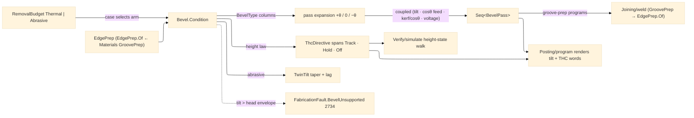

# [RASM_FABRICATION_BEVEL]

The beveled-edge cutting owner and THE torch-height-control custodian: `Bevel` the static surface whose ONE `Condition` fold turns a contour plus a per-edge prep demand into tilted, coupled, height-lawed cut passes for the plasma/laser/waterjet head family. `BevelType` is the closed six-row edge-prep axis — `I` (square) · `V` (top bevel) · `A` (under bevel, the inverse tilt) · `Y` (top bevel + vertical land) · `X` (top + under meeting mid-thickness, the double-V) · `K` (top bevel + land + under bevel, three cuts) — each row binding its pass count, tilt sides, and land flag, so a multi-pass prep is ROW DATA and never a per-shape generator family. The per-edge condition row is COUPLED, never independent knobs: a tilt of θ cuts the effective thickness `t/cos θ`, so the feed derates by `cos θ`, the kerf offset widens to `kerf/cos θ` projected onto the face, and the arc-voltage setpoint rises with standoff-along-beam — one `BevelPass` row carries `(tilt, feedFactor, kerfOffset, arcVoltage)` together because changing one without the others ships a wandering cut face. The waterjet arm compensates twin-tilt: the jet's natural taper (~1°) cancels by tilting the head into the taper (`TaperCompDeg`), and the jet's trailing lag tilts in the travel direction (`LagCompDeg`, speed- and thickness-derived) — the abrasive analogue of arc-voltage law, with THC `Off` (a waterjet has no arc to sense).

THE THC/Z-LAW CUSTODIANSHIP: pierce-height percentage rows (pierce at `PierceHeightFactor ×` cut height — the 150-200% standoff that survives dross blowback, dropping to cut height after the pierce delay), the arc-voltage height loop (the sensed arc voltage IS the standoff signal; the loop tracks the `BevelPass.ArcVoltage` setpoint), corner SAMPLE-HOLD with anti-dive (as the corner slowdown drops speed below the hold fraction, arc voltage rises at constant height — a naive loop reads that as "too high" and DIVES the torch into the plate; the law freezes the loop on the sampled voltage until speed recovers), and small-hole disable (a hole under `SmallHoleFactor ×` thickness never stabilizes the arc — THC `Off` for the feature). These laws live HERE as the ONE owner and emit as typed `ThcDirective` spans (`Track(voltage)` · `Hold` · `Off`) the posting AST renders as dialect words — a THC decision inside `Posting/program` is the deleted form; posting RENDERS what bevel directs. Groove-prep demand enters at the Materials boundary: `EdgePrep.Of(GroovePrep, edge)` maps the `Rasm.Materials` `Component/joint` `GroovePrep` row (its `BevelAngleDeg`/`IncludedAngleDeg`, `RootFaceMm` land) onto the local prep row — the joining vocabulary is Materials-owned and CONSUMED, never re-minted; `Joining/weld` hands its groove-prep rows through exactly this boundary when it lands its bead-stack fold, and `Forming/tube` routes coping/fishmouth edge bevels through the same `Condition` entry.

Wire posture: HOST-LOCAL. `BevelPass` rows and `ThcDirective` spans cross only the in-process seam to the posting emitter and the simulate walk — never a browser or peer wire.

## [01]-[INDEX]

- [01]-[BEVEL]: owns the `BevelType` edge-prep axis, the `EdgePrep`/`BevelPolicy`/`ThcPolicy` demand and law models, the `ThcDirective` union, the coupled `BevelPass` condition row, the `TwinTilt` waterjet compensation pair, and the ONE `Bevel.Condition` fold — tilted pass generation, coupled feed/kerf/voltage derivation, THC directive spans, taper-lag compensation.

## [02]-[BEVEL]

- Owner: `BevelType` `[SmartEnum<string>]` the six-row prep axis binding `Cuts`/`TopBevel`/`UnderBevel`/`Land` columns; `EdgePrep` the per-edge demand row (edge index, bevel type, face angle, land, root face) with the `Of(GroovePrep, edge)` Materials boundary map; `ThcPolicy` the height-law knobs (pierce-height factor, cut height, corner hold fraction, small-hole factor); `ThcDirective` `[Union]` (`Track(double ArcVoltage)` · `Hold` · `Off`) the per-span height command posting renders; `BevelPass` the coupled per-pass condition row (pass ordinal, tilt, feed factor, kerf offset, arc voltage, moves, THC directive); `TwinTilt` the waterjet `(TaperCompDeg, LagCompDeg)` pair; `BevelPolicy` the head envelope (max tilt, rotator admission) + the `ThcPolicy`; `Beveled` the receipt (passes, twin-tilt, pierce count); `Bevel` the static surface owning `Condition`.
- Cases: `BevelType` rows 6 — `I` {cuts 1, no tilt, no land} · `V` {1, top} · `A` {1, under} · `Y` {2, top + land} · `X` {2, top + under} · `K` {3, top + land + under} — the pass EXPANSION is table-driven off the row columns (top-bevel pass at `+θ`, land pass at `0°`, under-bevel pass at `−θ`), so a new prep shape is one row, never a new generator; the budget CASE selects the compensation arm — `Thermal` (plasma/laser: arc-voltage THC law, kerf from the budget's `KerfWidth`) · `Abrasive` (waterjet: twin-tilt taper-lag, THC `Off`, kerf from jet diameter) — any other budget case is an inadmissible demand routed typed.
- Entry: `public static Fin<Beveled> Condition(Seq<Move> contour, EdgePrep prep, RemovalBudget budget, BevelPolicy policy)` — the ONE bevel fold: expands the prep row into its tilted pass set over the contour, derives each pass's coupled `(feedFactor, kerfOffset, arcVoltage)` from the budget case and the tilt, assigns the THC directive spans under the height law, and compensates twin-tilt on the abrasive arm; a demanded tilt beyond `policy.MaxTiltDeg` (or a rotator-demanding row on a non-rotator head) routes `FabricationFault.BevelUnsupported(prep.Bevel, angle)` 2734; a non-thermal/non-abrasive budget routes the kernel `GeometryFault.DegenerateInput` (bevel is a beam/jet concern — a milling chamfer is `CutterForm` chamfer's, never this page's).
- Auto: `Condition` reads the `BevelType` columns to expand passes (top `+θ`, land `0`, under `−θ` — under-bevel passes flag the flip/rotator demand), derates feed by `cos θ`, widens kerf to `budget.KerfWidth / cos θ` handed to the `Geometry2D/algebra#POLYGON_ALGEBRA` offset as the tilted-kerf compensation value (the offset itself stays the algebra's — this page computes the VALUE, never a second offset), and sets arc voltage from the budget's cut chemistry plus the tilt-standoff term; the THC spans mint per move run — `Track(v)` on steady cutting, `Hold` across every corner-slowdown span (the `Verify/simulate` speed profile and the posting corner rows both read the SAME hold spans, so the anti-dive law has one author), `Off` inside small-hole features and on the whole abrasive arm; `Posting/program` renders directive spans as dialect THC words and `Verify/simulate` walks them for height-state accounting; `Joining/weld` maps `GroovePrep → EdgePrep.Of` per welded edge so groove prep programs ride this fold; `Forming/tube` saddle developments route their end-prep bevels here.
- Receipt: `Beveled` carries the ordered `BevelPass` rows (each with its moves, coupled conditions, and THC directive), the `TwinTilt` compensation pair, and the pierce count — typed evidence for posting, simulate, and estimation; no generic bevel ledger.
- Packages: `Process/physics#CUT_PARAMETER` (`RemovalBudget.Thermal`/`Abrasive` — the cut-chemistry scalars, composed), `Process/owner#FABRICATION_OWNER` (`Move`/`Loop`/`CutterForm` chamfer boundary), Clipper2 (via `Geometry2D/algebra#POLYGON_ALGEBRA` — the tilted-kerf offset consumer seam), `Rasm.Materials` `Component/joint#GroovePrep` (the groove vocabulary — CONSUMED at the `EdgePrep.Of` boundary, never re-minted), Thinktecture.Runtime.Extensions (`[SmartEnum<string>]`/`[Union]`), LanguageExt.Core, BCL inbox.
- Growth: a new prep shape is one `BevelType` row (a J-prep radiused row lands with its radius column when the joining demand names it); a new height law (capacitive sensing for laser, plate-rider for oxyfuel) is one `ThcDirective` producer arm under the same span model; a rotary-bevel-head axis map (tilt+rotate simultaneous) is one column on `BevelPolicy`; per-amperage voltage seed tables enter through `Tooling/cuttingdata`'s ingress arm, never a page-local dictionary; zero new entrypoints.
- Boundary: bevel is the ONE edge-prep and THC owner — a posting-side THC decision, a motion-side tilt column, or a second height-law site is the deleted form (posting RENDERS directives, simulate WALKS them); the groove vocabulary is Materials' (`GrooveGeometry`/`GroovePrep`) and a local groove-geometry re-mint is the deleted form — `EdgePrep.Of` is the boundary map; the kerf offset VALUE is computed here but the offset FOLD is `Geometry2D/algebra`'s — a bevel-local polygon offset is the deleted form; the coupled row travels whole and an independent per-knob setter API is the deleted form; a tilt beyond the head envelope FAILS typed with `BevelUnsupported` and a silently clamped angle is the named defect; the milling chamfer is `CutterForm`'s chamfer family and a bevel arm for a contact cutter is the rejected form.

```csharp signature
// --- [RUNTIME_PRELUDE] ------------------------------------------------------------------------------------------------------------------------------
using LanguageExt;
using LanguageExt.Common;
using Rasm.Fabrication.Process;
using Rasm.Materials.Component;
using Rasm.Numerics;
using Rhino.Geometry;
using Thinktecture;
using static LanguageExt.Prelude;

namespace Rasm.Fabrication.Toolpath;

// --- [TYPES] ----------------------------------------------------------------------------------------------------------------------------------------
// Pass expansion is table-driven: top-bevel pass at +θ, land pass at 0°, under-bevel pass at −θ.
[SmartEnum<string>]
public sealed partial class BevelType {
    public static readonly BevelType I = new("i", cuts: 1, topBevel: false, underBevel: false, land: false);
    public static readonly BevelType V = new("v", cuts: 1, topBevel: true, underBevel: false, land: false);
    public static readonly BevelType A = new("a", cuts: 1, topBevel: false, underBevel: true, land: false);
    public static readonly BevelType Y = new("y", cuts: 2, topBevel: true, underBevel: false, land: true);
    public static readonly BevelType X = new("x", cuts: 2, topBevel: true, underBevel: true, land: false);
    public static readonly BevelType K = new("k", cuts: 3, topBevel: true, underBevel: true, land: true);

    public int Cuts { get; }
    public bool TopBevel { get; }
    public bool UnderBevel { get; }
    public bool Land { get; }
}

// --- [MODELS] ---------------------------------------------------------------------------------------------------------------------------------------
// The Materials boundary map: GroovePrep is the joining vocabulary (Rasm.Materials Component/joint) — consumed, never re-minted.
public readonly record struct EdgePrep(int EdgeIndex, BevelType Bevel, double AngleDeg, double LandMm, double RootFaceMm) {
    public static EdgePrep Of(GroovePrep prep, int edge) =>
        new(edge,
            prep.Geometry.DoubleSided ? BevelType.X : prep.RootFaceMm > 0.0 ? BevelType.Y : BevelType.V,
            prep.BevelAngleDeg > 0.0 ? prep.BevelAngleDeg : 0.5 * prep.IncludedAngleDeg,
            LandMm: prep.RootFaceMm, RootFaceMm: prep.RootFaceMm);
}

public readonly record struct ThcPolicy(double PierceHeightFactor, double CutHeightMm, double CornerHoldFraction, double SmallHoleFactor) {
    public static readonly ThcPolicy Default = new(PierceHeightFactor: 1.8, CutHeightMm: 1.5, CornerHoldFraction: 0.85, SmallHoleFactor: 1.25);
}

public readonly record struct BevelPolicy(double MaxTiltDeg, bool Rotator, ThcPolicy Thc) {
    public static readonly BevelPolicy Default = new(MaxTiltDeg: 45.0, Rotator: true, Thc: ThcPolicy.Default);
}

// The per-span height command posting RENDERS and simulate WALKS: Track on steady cut, Hold across
// corner-slowdown spans (anti-dive sample-hold), Off inside small holes and on the abrasive arm.
[Union(ConversionFromValue = ConversionOperatorsGeneration.None)]
public abstract partial record ThcDirective {
    private ThcDirective() { }

    public sealed record Track(double ArcVoltage) : ThcDirective;
    public sealed record Hold : ThcDirective;
    public sealed record Off : ThcDirective;
}

// The COUPLED condition row: tilt, feed derate, projected kerf, and voltage setpoint travel together.
public sealed record BevelPass(int Pass, double TiltDeg, double FeedFactor, double KerfOffsetMm, double ArcVoltage, Seq<Move> Moves, ThcDirective Thc);

public readonly record struct TwinTilt(double TaperCompDeg, double LagCompDeg);

public sealed record Beveled(Seq<BevelPass> Passes, TwinTilt Tilt, int Pierces);

// --- [OPERATIONS] -----------------------------------------------------------------------------------------------------------------------------------
public static class Bevel {
    // The ONE bevel fold: table-driven pass expansion, coupled condition derivation per pass, THC spans
    // under the height law, twin-tilt on the abrasive arm. Tilt past the head envelope fails typed.
    public static Fin<Beveled> Condition(Seq<Move> contour, EdgePrep prep, RemovalBudget budget, BevelPolicy policy) =>
        prep.AngleDeg > policy.MaxTiltDeg || (prep.Bevel.UnderBevel && !policy.Rotator)
            ? Fin.Fail<Beveled>(FabricationFault.BevelUnsupported(prep.Bevel, prep.AngleDeg).ToError())
            : budget switch {
                RemovalBudget.Thermal th => Fin.Succ(new Beveled(
                    Expand(contour, prep, th.KerfWidth, baseVoltage: 8.0 * th.AssistPressure + 100.0, policy),
                    new TwinTilt(0.0, 0.0), Pierces(prep))),
                RemovalBudget.Abrasive ab => Fin.Succ(new Beveled(
                    Expand(contour, prep, kerf: 1.0, baseVoltage: 0.0, policy) is { } passes
                        ? passes.Map(p => p with { Thc = new ThcDirective.Off() }) : Seq<BevelPass>(),
                    new TwinTilt(TaperCompDeg: 1.0, LagCompDeg: Math.Atan2(ab.TraverseSpeed, 60.0 * ab.JetPressure) * 180.0 / Math.PI),
                    Pierces(prep))),
                _ => Fin.Fail<Beveled>(GeometryFault.DegenerateInput($"bevel:non-beam-budget:{prep.Bevel.Key}").ToError()),
            };

    // Table-driven expansion off the BevelType columns; the kerf offset VALUE = kerf/cosθ is handed to
    // the Geometry2D offset — the fold never re-implements the offset.
    static Seq<BevelPass> Expand(Seq<Move> contour, EdgePrep prep, double kerf, double baseVoltage, BevelPolicy policy) {
        double rad = prep.AngleDeg * Math.PI / 180.0;
        Seq<(double Tilt, int Ord)> tilts =
            (prep.Bevel.TopBevel ? Seq((+prep.AngleDeg, 0)) : Seq<(double, int)>()) +
            (prep.Bevel.Land ? Seq((0.0, 1)) : Seq<(double, int)>()) +
            (prep.Bevel.UnderBevel ? Seq((-prep.AngleDeg, 2)) : Seq<(double, int)>()) +
            (prep.Bevel == BevelType.I ? Seq((0.0, 0)) : Seq<(double, int)>());
        return tilts.Map(t => new BevelPass(
            Pass: t.Ord,
            TiltDeg: t.Tilt,
            FeedFactor: Math.Cos(Math.Abs(t.Tilt) * Math.PI / 180.0),
            KerfOffsetMm: kerf / Math.Max(0.1, Math.Cos(Math.Abs(t.Tilt) * Math.PI / 180.0)),
            ArcVoltage: baseVoltage * (1.0 + 0.15 * Math.Abs(Math.Sin(rad))),
            Moves: contour,
            Thc: new ThcDirective.Track(baseVoltage * (1.0 + 0.15 * Math.Abs(Math.Sin(rad))))));
    }

    static int Pierces(EdgePrep prep) => prep.Bevel.Cuts;
}
```


