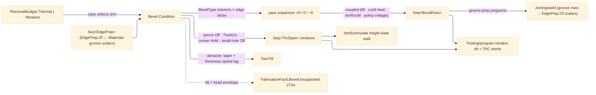

# [RASM_FABRICATION_BEVEL]

The beveled-edge cutting owner and THE torch-height-control custodian: `Bevel` the static surface whose ONE `Condition` fold turns a contour plus its PER-EDGE prep demands into tilted, coupled, height-lawed cut passes for the plasma/laser/waterjet head family. `BevelType` is the closed six-row edge-prep axis — `I` (square) · `V` (top bevel) · `A` (under bevel, the inverse tilt) · `Y` (top bevel + vertical land) · `X` (top + under meeting mid-thickness, the double-V) · `K` (top bevel + land + under bevel, three cuts) — each row binding its pass count, tilt sides, and land flag, so a multi-pass prep is ROW DATA and never a per-shape generator family. The per-edge condition row is COUPLED, never independent knobs: a tilt of θ cuts the effective thickness `t/cos θ`, so the feed derates by `cos θ`, the kerf offset widens to `kerf/cos θ` projected onto the face, and the arc-voltage setpoint rises with standoff-along-beam — one `BevelPass` row carries `(tilt, feedFactor, kerfOffset, arcVoltage)` together because changing one without the others ships a wandering cut face. The waterjet arm compensates twin-tilt: the jet's natural taper (~1°) cancels by tilting the head into the taper (`TaperCompDeg`), and the jet's trailing lag tilts in the travel direction (`LagCompDeg` — speed- AND thickness-derived, the lag growing with both) — the abrasive analogue of arc-voltage law, with THC `Off` (a waterjet has no arc to sense).

THE THC/Z-LAW CUSTODIANSHIP, MINTED AS SPANS: pierce-height percentage rows (pierce at `PierceHeightFactor ×` cut height — the 150-200% standoff that survives dross blowback, dropping to cut height after the pierce delay — the leading span of every pass is the `Off` pierce window), the arc-voltage height loop (the sensed arc voltage IS the standoff signal; the steady spans `Track` the pass's `ArcVoltage` setpoint derived from the policy's base-voltage row and the tilt-standoff term — never from an unrelated budget scalar), corner SAMPLE-HOLD with anti-dive (as the corner slowdown drops speed below the hold fraction, arc voltage rises at constant height — a naive loop reads that as "too high" and DIVES the torch into the plate; the law freezes the loop on the sampled voltage across every corner whose turn exceeds the hold threshold, one `Hold` span per qualifying corner), and small-hole disable (a closed feature under `SmallHoleFactor ×` thickness never stabilizes the arc — the WHOLE pass emits one `Off` span). These laws live HERE as the ONE owner and emit as typed `ThcSpan` rows — `(From, To, ThcDirective)` move-index windows carrying `Track(voltage)` · `Hold` · `Off` — the posting AST renders as dialect words and the simulate walk height-integrates; a THC decision inside `Posting/program` is the deleted form; posting RENDERS what bevel directs.

Groove-prep demand enters at the STRATA-LAWFUL raw-scalar boundary: `EdgePrep.Of(edge, bevelAngleDeg, includedAngleDeg, rootFaceMm, doubleSided)` — the joining vocabulary (`GroovePrep`, `GrooveGeometry`) is `Rasm.Materials`-owned and its VALUES cross the seam as raw scalars per the package's no-peer-reference law, never as a Materials type in a Fabrication signature; `Joining/weld` lowers its groove rows to these scalars when it calls, and `Forming/tube` routes coping/fishmouth edge bevels through the same `Condition` entry. The scalar map covers the groove-originated rows (`V`/`Y`/`X`/`K` — double-sided and root-face discriminated); `I` is the no-prep row and `A` the caller's orientation flip, neither a groove product.

Wire posture: HOST-LOCAL. `BevelPass` rows and `ThcSpan` windows cross only the in-process seam to the posting emitter and the simulate walk — never a browser or peer wire.

## [01]-[INDEX]

- [01]-[BEVEL]: owns the `BevelType` edge-prep axis, the `EdgePrep`/`BevelPolicy`/`ThcPolicy` demand and law models, the `ThcDirective` union and `ThcSpan` window row, the coupled `BevelPass` condition row, the `TwinTilt` waterjet compensation pair, and the ONE `Bevel.Condition` fold — per-edge tilted pass generation, coupled feed/kerf/voltage derivation, THC span minting, taper-lag compensation.

## [02]-[BEVEL]

- Owner: `BevelType` `[SmartEnum<string>]` the six-row prep axis binding `Cuts`/`TopBevel`/`UnderBevel`/`Land` columns; `EdgePrep` the per-edge demand row (edge index, bevel type, face angle, land, root face) with the `Of(edge, bevelAngleDeg, includedAngleDeg, rootFaceMm, doubleSided)` raw-scalar Materials boundary map; `ThcPolicy` the height-law knobs (pierce-height factor, cut height, corner hold fraction, small-hole factor, base arc voltage, tilt voltage gain — the voltage seed is a POLICY row the cuttingdata ingress lane refines, never a budget-scalar fiction); `ThcDirective` `[Union]` (`Track(double ArcVoltage)` · `Hold` · `Off`) the height command; `ThcSpan` the `(From, To, Directive)` move-index window posting renders; `BevelPass` the coupled per-pass condition row (pass ordinal, edge, tilt, feed factor, kerf offset, arc voltage, moves, THC spans); `TwinTilt` the waterjet `(TaperCompDeg, LagCompDeg)` pair; `BevelPolicy` the head envelope (max tilt, rotator admission, abrasive kerf seed) + the `ThcPolicy`; `Beveled` the receipt (passes, twin-tilt, pierce count); `Bevel` the static surface owning `Condition`.
- Cases: `BevelType` rows 6 — `I` {cuts 1, no tilt, no land} · `V` {1, top} · `A` {1, under} · `Y` {2, top + land} · `X` {2, top + under} · `K` {3, top + land + under} — the pass EXPANSION is table-driven off the row columns (top-bevel pass at `+θ`, land pass at `0°`, under-bevel pass at `−θ`), so a new prep shape is one row, never a new generator; the budget CASE selects the compensation arm — `Thermal` (plasma/laser: arc-voltage THC span law, kerf from the budget's `KerfWidth`) · `Abrasive` (waterjet: twin-tilt taper-lag, one `Off` span, kerf from the policy's abrasive kerf seed — the jet-diameter column lands on `ModalityPhysics.Abrasive` and defeats the seed) — any other budget case is an inadmissible demand routed typed.
- Entry: `public static Fin<Beveled> Condition(Seq<Move> contour, Seq<EdgePrep> preps, RemovalBudget budget, double thicknessMm, BevelPolicy policy)` — the ONE bevel fold, per-edge by INPUT SHAPE (one prep row conditions its edge slice, a whole-contour prep rides `EdgeIndex = -1`): expands each prep row into its tilted pass set over its edge, derives each pass's coupled `(feedFactor, kerfOffset, arcVoltage)` from the budget case and the tilt, mints the THC spans under the height law, and compensates twin-tilt on the abrasive arm; a demanded tilt beyond `policy.MaxTiltDeg` (or a rotator-demanding row on a non-rotator head) routes `FabricationFault.BevelUnsupported(prep.Bevel, angle)` 2734; an empty prep set or a non-thermal/non-abrasive budget routes the kernel `GeometryFault.DegenerateInput` (bevel is a beam/jet concern — a milling chamfer is `CutterForm` chamfer's, never this page's).
- Auto: `Condition` reads the `BevelType` columns to expand passes (top `+θ`, land `0`, under `−θ` — under-bevel passes flag the flip/rotator demand), derates feed by `cos θ`, widens kerf to `kerf / cos θ` handed to the `Geometry2D/algebra#POLYGON_ALGEBRA` offset as the tilted-kerf compensation VALUE (the offset itself stays the algebra's — this page computes the value, never a second offset), and sets arc voltage from the policy base-voltage row plus the tilt-standoff term; the THC spans mint per pass — the leading `Off` pierce window, `Track(v)` on steady runs, `Hold` across every corner whose turn cosine drops below `CornerHoldFraction` (the `Verify/simulate` speed profile and the posting corner rows both read the SAME hold spans, so the anti-dive law has one author), `Off` for the whole pass inside small-hole features (closed slice whose bound diagonal < `SmallHoleFactor × thickness`) and on the whole abrasive arm; `Posting/program` renders span windows as dialect THC words and `Verify/simulate` walks them for height-state accounting; `Joining/weld` lowers groove rows to the `EdgePrep.Of` scalars per welded edge and `Forming/tube` saddle developments route their end-prep bevels here.
- Receipt: `Beveled` carries the ordered `BevelPass` rows (each with its edge, moves, coupled conditions, and THC spans), the `TwinTilt` compensation pair, and the pierce count — typed evidence for posting, simulate, and estimation; no generic bevel ledger.
- Packages: `Process/physics#CUT_PARAMETER` (`RemovalBudget.Thermal`/`Abrasive` — the cut-chemistry scalars, composed), `Process/owner#FABRICATION_OWNER` (`Move`/`Loop`/`CutterForm` chamfer boundary), `Geometry2D/algebra#POLYGON_ALGEBRA` (the tilted-kerf offset consumer seam — the VALUE crosses, the fold stays there), Thinktecture.Runtime.Extensions (`[SmartEnum<string>]`/`[Union]`), LanguageExt.Core, BCL inbox; the `Rasm.Materials` groove vocabulary is CONSUMED as raw scalars at the `EdgePrep.Of` boundary per the no-peer-reference strata law — no Materials type enters a Fabrication signature.
- Growth: a new prep shape is one `BevelType` row (a J-prep radiused row lands with its radius column when the joining demand names it); a new height law (capacitive sensing for laser, plate-rider for oxyfuel) is one `ThcDirective` producer arm under the same span model; a rotary-bevel-head axis map (tilt+rotate simultaneous) is one column on `BevelPolicy`; per-amperage voltage seed tables enter through `Tooling/cuttingdata`'s ingress arm and defeat the policy base row, never a page-local dictionary; zero new entrypoints.
- Boundary: bevel is the ONE edge-prep and THC owner — a posting-side THC decision, a motion-side tilt column, or a second height-law site is the deleted form (posting RENDERS span windows, simulate WALKS them); the groove vocabulary is Materials' and a local groove-geometry re-mint OR a Materials type in a signature is the deleted form — `EdgePrep.Of` is the raw-scalar boundary map; the kerf offset VALUE is computed here but the offset FOLD is `Geometry2D/algebra`'s — a bevel-local polygon offset is the deleted form; the coupled row travels whole and an independent per-knob setter API is the deleted form; a tilt beyond the head envelope FAILS typed with `BevelUnsupported` and a silently clamped angle is the named defect; the arc-voltage seed is a policy/cuttingdata row and a voltage derived from an unrelated budget scalar is the deleted fiction; the milling chamfer is `CutterForm`'s chamfer family and a bevel arm for a contact cutter is the rejected form.

```csharp signature
// --- [RUNTIME_PRELUDE] ------------------------------------------------------------------------------------------------------------------------------
using LanguageExt;
using LanguageExt.Common;
using Rasm.Fabrication.Process;
using Rasm.Numerics;
using Rhino.Geometry;
using Thinktecture;
using static LanguageExt.Prelude;

namespace Rasm.Fabrication.Toolpath;

// --- [TYPES] ----------------------------------------------------------------------------------------------------------------------------------------
// Pass expansion is table-driven: top-bevel pass at +θ, land pass at 0°, under-bevel pass at −θ.
[SmartEnum<string>]
public sealed partial class BevelType {
    public static readonly BevelType I = new("i", cuts: 1, topBevel: false, underBevel: false, land: false);
    public static readonly BevelType V = new("v", cuts: 1, topBevel: true, underBevel: false, land: false);
    public static readonly BevelType A = new("a", cuts: 1, topBevel: false, underBevel: true, land: false);
    public static readonly BevelType Y = new("y", cuts: 2, topBevel: true, underBevel: false, land: true);
    public static readonly BevelType X = new("x", cuts: 2, topBevel: true, underBevel: true, land: false);
    public static readonly BevelType K = new("k", cuts: 3, topBevel: true, underBevel: true, land: true);

    public int Cuts { get; }
    public bool TopBevel { get; }
    public bool UnderBevel { get; }
    public bool Land { get; }
}

// --- [MODELS] ---------------------------------------------------------------------------------------------------------------------------------------
// The raw-scalar Materials boundary: GroovePrep is the joining vocabulary (Rasm.Materials) — its VALUES cross
// as scalars per the no-peer-reference strata law; V/Y/X/K discriminate on double-sided × root-face.
public readonly record struct EdgePrep(int EdgeIndex, BevelType Bevel, double AngleDeg, double LandMm, double RootFaceMm) {
    public static EdgePrep Of(int edge, double bevelAngleDeg, double includedAngleDeg, double rootFaceMm, bool doubleSided) =>
        new(edge,
            doubleSided
                ? rootFaceMm > 0.0 ? BevelType.K : BevelType.X
                : rootFaceMm > 0.0 ? BevelType.Y : BevelType.V,
            bevelAngleDeg > 0.0 ? bevelAngleDeg : 0.5 * includedAngleDeg,
            LandMm: rootFaceMm, RootFaceMm: rootFaceMm);
}

// The height-law knobs: the voltage seed is a POLICY row (cuttingdata refines it), never a budget-scalar read.
public readonly record struct ThcPolicy(
    double PierceHeightFactor, double CutHeightMm, double CornerHoldFraction, double SmallHoleFactor,
    double BaseArcVoltage, double TiltVoltageGain) {
    public static readonly ThcPolicy Default =
        new(PierceHeightFactor: 1.8, CutHeightMm: 1.5, CornerHoldFraction: 0.85, SmallHoleFactor: 1.25, BaseArcVoltage: 130.0, TiltVoltageGain: 0.15);

    public double VoltageAt(double tiltDeg) => BaseArcVoltage * (1.0 + TiltVoltageGain * Math.Abs(Math.Sin(tiltDeg * Math.PI / 180.0)));
}

public readonly record struct BevelPolicy(double MaxTiltDeg, bool Rotator, double AbrasiveKerfMm, ThcPolicy Thc) {
    public static readonly BevelPolicy Default = new(MaxTiltDeg: 45.0, Rotator: true, AbrasiveKerfMm: 1.0, Thc: ThcPolicy.Default);
}

// The per-window height command posting RENDERS and simulate WALKS: Track on steady cut, Hold across
// corner-slowdown windows (anti-dive sample-hold), Off in the pierce window, small holes, and the abrasive arm.
[Union(ConversionFromValue = ConversionOperatorsGeneration.None)]
public abstract partial record ThcDirective {
    private ThcDirective() { }

    public sealed record Track(double ArcVoltage) : ThcDirective;
    public sealed record Hold : ThcDirective;
    public sealed record Off : ThcDirective;
}

public readonly record struct ThcSpan(int From, int To, ThcDirective Directive);

// The COUPLED condition row: tilt, feed derate, projected kerf, voltage setpoint, and spans travel together.
public sealed record BevelPass(
    int Pass, int EdgeIndex, double TiltDeg, double FeedFactor, double KerfOffsetMm, double ArcVoltage, Seq<Move> Moves, Seq<ThcSpan> Thc);

public readonly record struct TwinTilt(double TaperCompDeg, double LagCompDeg);

public sealed record Beveled(Seq<BevelPass> Passes, TwinTilt Tilt, int Pierces);

// --- [OPERATIONS] -----------------------------------------------------------------------------------------------------------------------------------
public static class Bevel {
    const double JetTaperDeg = 1.0;   // the waterjet's natural kerf taper the head tilts into — a law-table datum

    // The ONE bevel fold: per-edge table-driven pass expansion, coupled condition derivation, THC span minting
    // under the height law, twin-tilt on the abrasive arm. Tilt past the head envelope fails typed.
    public static Fin<Beveled> Condition(Seq<Move> contour, Seq<EdgePrep> preps, RemovalBudget budget, double thicknessMm, BevelPolicy policy) =>
        preps.IsEmpty || contour.IsEmpty
            ? Fin.Fail<Beveled>(GeometryFault.DegenerateInput("bevel:empty-demand").ToError())
            : preps.Find(p => p.AngleDeg > policy.MaxTiltDeg || (p.Bevel.UnderBevel && !policy.Rotator)).Match(
                Some: p => Fin.Fail<Beveled>(FabricationFault.BevelUnsupported(p.Bevel, p.AngleDeg).ToError()),
                None: () => budget switch {
                    RemovalBudget.Thermal th => Fin.Succ(new Beveled(
                        preps.Bind(p => Expand(contour, p, th.KerfWidth, policy, thicknessMm, thermal: true)),
                        new TwinTilt(0.0, 0.0),
                        Pierces(preps))),
                    RemovalBudget.Abrasive ab => Fin.Succ(new Beveled(
                        preps.Bind(p => Expand(contour, p, policy.AbrasiveKerfMm, policy, thicknessMm, thermal: false)),
                        new TwinTilt(
                            TaperCompDeg: JetTaperDeg,
                            LagCompDeg: Math.Atan2(ab.TraverseSpeed * thicknessMm, 1000.0 * ab.JetPressure) * 180.0 / Math.PI),
                        Pierces(preps))),
                    _ => Fin.Fail<Beveled>(GeometryFault.DegenerateInput("bevel:non-beam-budget").ToError()),
                });

    // Table-driven expansion off the BevelType columns over the prep's edge slice; the kerf offset VALUE
    // kerf/cosθ is handed onward to the Geometry2D offset — the fold never re-implements the offset.
    static Seq<BevelPass> Expand(Seq<Move> contour, EdgePrep prep, double kerf, BevelPolicy policy, double thicknessMm, bool thermal) {
        Seq<Move> slice = Slice(contour, prep.EdgeIndex);
        Seq<(double Tilt, int Ord)> tilts =
            (prep.Bevel.TopBevel ? Seq((+prep.AngleDeg, 0)) : Seq<(double, int)>()) +
            (prep.Bevel.Land ? Seq((0.0, 1)) : Seq<(double, int)>()) +
            (prep.Bevel.UnderBevel ? Seq((-prep.AngleDeg, 2)) : Seq<(double, int)>()) +
            (prep.Bevel == BevelType.I ? Seq((0.0, 0)) : Seq<(double, int)>());
        return tilts.Map(t => new BevelPass(
            Pass: t.Ord,
            EdgeIndex: prep.EdgeIndex,
            TiltDeg: t.Tilt,
            FeedFactor: Math.Cos(Math.Abs(t.Tilt) * Math.PI / 180.0),
            KerfOffsetMm: kerf / Math.Max(0.1, Math.Cos(Math.Abs(t.Tilt) * Math.PI / 180.0)),
            ArcVoltage: policy.Thc.VoltageAt(t.Tilt),
            Moves: slice,
            Thc: Spans(slice, policy.Thc, thicknessMm, policy.Thc.VoltageAt(t.Tilt), thermal)));
    }

    static Seq<Move> Slice(Seq<Move> contour, int edge) =>
        edge < 0 || edge + 1 >= contour.Count ? contour : contour.Skip(edge).Take(2).ToSeq();

    // The THC span law: abrasive and small-hole passes emit one Off window; a thermal pass leads with the Off
    // pierce window, Tracks the setpoint on steady runs, and Holds across every corner whose turn cosine drops
    // below the hold fraction — the sample-hold anti-dive spans posting renders and simulate walks.
    static Seq<ThcSpan> Spans(Seq<Move> moves, ThcPolicy thc, double thicknessMm, double voltage, bool thermal) =>
        !thermal || SmallHole(moves, thc, thicknessMm)
            ? Seq(new ThcSpan(0, Math.Max(moves.Count - 1, 0), new ThcDirective.Off()))
            : new ThcSpan(0, 0, new ThcDirective.Off()).Cons(
                toSeq(Enumerable.Range(1, Math.Max(moves.Count - 1, 0))).Map(i =>
                    Turns(moves, i, thc.CornerHoldFraction)
                        ? new ThcSpan(Math.Max(i - 1, 1), i, new ThcDirective.Hold())
                        : new ThcSpan(i, i, new ThcDirective.Track(voltage))));

    // Corner qualifies for sample-hold when the junction turn drops the speed under the hold fraction:
    // cos θ < CornerHoldFraction is the geometric proxy the slowdown law and this span law share.
    static bool Turns(Seq<Move> moves, int i, double holdFraction) {
        if (i <= 0 || i + 1 >= moves.Count) return false;
        Vector3d din = moves[i].To - moves[i - 1].To;
        Vector3d dout = moves[i + 1].To - moves[i].To;
        din.Unitize(); dout.Unitize();
        return din * dout < holdFraction;
    }

    static bool SmallHole(Seq<Move> moves, ThcPolicy thc, double thicknessMm) =>
        moves.Count >= 3 && moves.Head.To.DistanceTo(moves.Last.To) < 1e-6
            && new BoundingBox(moves.Map(static m => m.To).ToArray()).Diagonal.Length < thc.SmallHoleFactor * thicknessMm;

    static int Pierces(Seq<EdgePrep> preps) => preps.Map(static p => p.Bevel.Cuts).Sum();
}
```


