# [RASM_FABRICATION_BEVEL]

The beveled-edge cutting owner and height-control custodian: `Bevel.Condition` turns per-edge prep demand into process-specific, kerf-offset, direction-aware beam blocks. `BevelType` carries square, V, A, Y, X, K, J, and U preparation rows. J and U roots expand through `RootSamples` over the radius, and each pass carries its cross-section rise and run; `RootRadiusMm` is executable geometry rather than decorative metadata. A `BevelBlock` couples the offset move, tool axis, commanded height, and cutting posture. Every pass prepends a non-cutting pierce block at pierce height before repeating the first XY point at cut height; the first geometric segment therefore remains executable instead of being consumed by the pierce window. Thermal and abrasive budgets are insufficient process discriminants by themselves, so `ProcessKind` selects plasma arc-voltage tracking, laser capacitive height, oxyfuel plate riding, or waterjet twin-tilt with height control off.

THE THC/Z-LAW CUSTODIANSHIP, MINTED AS SPANS: pierce-height percentage rows (pierce at `PierceHeightFactor ×` cut height — the 150-200% standoff that survives dross blowback, dropping to cut height after the pierce delay — the leading span of every pass is the `Off` pierce window), the arc-voltage height loop (the sensed arc voltage IS the standoff signal; the steady spans `Track` the pass's `ArcVoltage` setpoint derived from the policy's base-voltage row and the tilt-standoff term — never from an unrelated budget scalar), corner SAMPLE-HOLD with anti-dive (as the corner slowdown drops speed below the hold fraction, arc voltage rises at constant height — a naive loop reads that as "too high" and DIVES the torch into the plate; the law freezes the loop on the sampled voltage across every corner whose turn exceeds the hold threshold, one `Hold` span per qualifying corner), and small-hole disable (a closed feature under `SmallHoleFactor ×` thickness never stabilizes the arc — the WHOLE pass emits one `Off` span). These laws live HERE as the ONE owner and emit as typed `ThcSpan` rows — `(From, To, ThcDirective)` half-open windows over the pass's BLOCK stream, the prepended pierce block at ordinal zero, carrying `Track(voltage)` · `Hold` · `Off` — proven ordered, in-bounds, and non-overlapping by `ThcSpan.Admit` before the pass seals; the posting AST renders the windows against the same block ordinals and the simulate walk height-integrates them; a THC decision inside `Posting/program` or a renderer mapping windows onto geometric segment ordinals is the deleted form; posting RENDERS what bevel directs.

Groove-prep demand enters at the raw-scalar boundary `EdgePrep.Of(edge, bevelAngleDeg, includedAngleDeg, rootOpeningMm, rootFaceMm, rootRadiusMm, depthMm, doubleSided)`. The joining vocabulary remains `Rasm.Materials`-owned, and only its values cross into Fabrication. `Joining/weld.md` lowers groove rows to these scalars; `Forming/tube.md` routes coping and fishmouth edge preparations through the same `Condition` entry. Root face and sidedness select `V`/`Y`/`X`/`K`, while positive root radius selects `J` or `U`; `I` and `A` remain direct fabrication rows. `RootOpeningMm` contributes half the joint gap to the stock-side setback, and `DepthMm` bounds the tilted cross-section instead of assuming every preparation consumes full wall thickness.

Wire posture: HOST-LOCAL. `BevelPass` rows and `ThcSpan` windows cross only the in-process seam to the posting emitter and the simulate walk — never a browser or peer wire.

## [01]-[INDEX]

- [01]-[BEVEL]: owns the `BevelType` edge-prep axis, the `EdgePrep`/`BevelPolicy`/`ThcPolicy` demand and law models, the `ThcDirective` union and `ThcSpan` window row, the coupled `BevelPass` condition row, the `TwinTilt` waterjet compensation pair, and the ONE `Bevel.Condition` fold — per-edge tilted pass generation, coupled feed/kerf/voltage derivation, THC span minting, taper-lag compensation.

## [02]-[BEVEL]

- Owner: `BevelType` is the eight-row prep axis; `EdgePrep` carries edge, angles, root opening, root face, root radius, and depth — the root face IS the land, one column, never two; `BevelPolicy` carries head, calibrated abrasive, root-sampling, and model-tolerance law; `ThcPolicy` owns height and voltage law; `ThcDirective` carries arc-voltage, capacitive, plate-rider, hold, and off commands; `ThcSpan` is a half-open block-index window whose `Admit` proves the whole set ordered, in-bounds, and non-overlapping before a pass seals; `BevelBlock` couples geometry, axis, height, and cutting posture; `BevelPass` couples the conditioned block stream with pierce delay, feed factor, executable feed, kerf, voltage, root-section coordinates, and THC spans; `TwinTilt` records direction-aware waterjet compensation; `Beveled` is the receipt; `Bevel` owns `Condition`.
- Cases: `BevelType` rows 8 — `I` {cuts 1, no tilt, no land} · `V` {1, top} · `A` {1, under} · `Y` {2, top + land} · `X` {2, top + under} · `K` {3, top + land + under} · `J` {sampled top radius} · `U` {sampled double-sided radius}. Pass expansion is table-driven from these row columns. `ProcessBudget.Thermal` serves plasma, laser, and oxyfuel with process-specific height directives; `ProcessBudget.Abrasive` serves waterjet with twin-tilt taper and lag compensation. Any other process/budget pair is inadmissible.
- Entry: `public static Fin<Beveled> Condition(ProcessKind process, Seq<Move> contour, Seq<EdgePrep> preps, ProcessBudget budget, double thicknessMm, BevelPolicy policy)` is the ONE bevel fold. Admission rejects invalid edge indices, root geometry, process/budget pairs, tilt envelopes, and non-rotator undercuts before expansion.
- Auto: `Condition` expands top `+θ`, land `0`, and under `−θ` passes. J and U rows sample the circular root from land to flank under `RootSamples`, deriving `RootRiseMm = r(1−cos φ)` and `RootRunMm = r sin φ` per pass. The offset combines half the root opening, beam kerf, sampled root run, and the remaining-depth tilt projection. Every edge path offsets through `ArcAlgebra.ArcOffset`, derates the process budget's executable speed by `cos θ`, derives its tool axis, and mints process-specific height spans. Plasma tracks arc voltage, laser carries capacitive height, oxyfuel carries plate-rider height, and waterjet alone emits calibrated `TwinTilt` taper and speed-pressure lag rows while holding height control off. Thermal spans lead with the pierce `Off` window and carry the budget's pierce delay, hold across qualifying corners, and remain off for small closed features. `Posting/program.md` renders the spans and `Verify/simulate.md` walks them.
- Receipt: `Beveled` carries the ordered `BevelPass` rows (each with its edge, moves, coupled conditions, and THC spans), the `TwinTilt` compensation pair, and the pierce count — typed evidence for posting, simulate, and estimation; no generic bevel ledger.
- Packages: `Process/physics.md` (`ProcessBudget.Thermal`/`Abrasive`), `Process/owner.md` (`Move`/`Loop`/`CutterForm`), `Geometry2D/arcs.md` (`ArcAlgebra.ArcOffset` for open per-edge paths), Thinktecture.Runtime.Extensions, LanguageExt.Core, BCL inbox. The `Rasm.Materials` groove vocabulary crosses only as raw scalars at `EdgePrep.Of`.
- Growth: a new prep shape is one `BevelType` row (a J-prep radiused row lands with its radius column when the joining demand names it); a new height law (capacitive sensing for laser, plate-rider for oxyfuel) is one `ThcDirective` producer arm under the same span model; a rotary-bevel-head axis map (tilt+rotate simultaneous) is one column on `BevelPolicy`; per-amperage voltage seed tables enter through `Tooling/cuttingdata`'s ingress arm and defeat the policy base row, never a page-local dictionary; zero new entrypoints.
- Boundary: bevel is the ONE edge-prep and THC owner — a posting-side THC decision, a motion-side tilt column, or a second height-law site is the deleted form (posting RENDERS span windows, simulate WALKS them); the groove vocabulary is Materials' and a local groove-geometry re-mint OR a Materials type in a signature is the deleted form — `EdgePrep.Of` is the raw-scalar boundary map; the kerf offset VALUE is computed here but the offset FOLD is `Geometry2D/algebra`'s — a bevel-local polygon offset is the deleted form; the coupled row travels whole and an independent per-knob setter API is the deleted form; a tilt beyond the head envelope FAILS typed with `BevelUnsupported` and a silently clamped angle is the named defect; the arc-voltage seed is a policy/cuttingdata row and a voltage derived from an unrelated budget scalar is the deleted fiction; the milling chamfer is `CutterForm`'s chamfer family and a bevel arm for a contact cutter is the rejected form.

```csharp signature
// --- [RUNTIME_PRELUDE] ------------------------------------------------------------------------------------------------------------------------------
using LanguageExt;
using LanguageExt.Common;
using Rasm.Domain;
using Rasm.Fabrication.Geometry2D;
using Rasm.Fabrication.Process;
using Rasm.Numerics;
using Rhino.Geometry;
using Thinktecture;
using static LanguageExt.Prelude;

namespace Rasm.Fabrication.Toolpath;

// --- [TYPES] ----------------------------------------------------------------------------------------------------------------------------------------
// Pass expansion is table-driven: top-bevel pass at +θ, land pass at 0°, under-bevel pass at −θ.
[SmartEnum<string>]
public sealed partial class BevelType {
    public static readonly BevelType I = new("i", topBevel: false, underBevel: false, land: false, radiused: false);
    public static readonly BevelType V = new("v", topBevel: true, underBevel: false, land: false, radiused: false);
    public static readonly BevelType A = new("a", topBevel: false, underBevel: true, land: false, radiused: false);
    public static readonly BevelType Y = new("y", topBevel: true, underBevel: false, land: true, radiused: false);
    public static readonly BevelType X = new("x", topBevel: true, underBevel: true, land: false, radiused: false);
    public static readonly BevelType K = new("k", topBevel: true, underBevel: true, land: true, radiused: false);
    public static readonly BevelType J = new("j", topBevel: true, underBevel: false, land: true, radiused: true);
    public static readonly BevelType U = new("u", topBevel: true, underBevel: true, land: true, radiused: true);

    public bool TopBevel { get; }
    public bool UnderBevel { get; }
    public bool Land { get; }
    public bool Radiused { get; }
}

// --- [MODELS] ---------------------------------------------------------------------------------------------------------------------------------------
// The raw-scalar Materials boundary: GroovePrep is the joining vocabulary (Rasm.Materials) — its VALUES cross
// as scalars per the no-peer-reference strata law; V/Y/X/K discriminate on double-sided × root-face.
public readonly record struct EdgePrep(
    int EdgeIndex, BevelType Bevel, double AngleDeg, double RootOpeningMm,
    double RootFaceMm, double RootRadiusMm, double DepthMm) {
    public static EdgePrep Of(
        int edge, double bevelAngleDeg, double includedAngleDeg, double rootOpeningMm,
        double rootFaceMm, double rootRadiusMm, double depthMm, bool doubleSided) =>
        new(edge,
            rootRadiusMm > 0.0
                ? doubleSided ? BevelType.U : BevelType.J
                : doubleSided
                    ? rootFaceMm > 0.0 ? BevelType.K : BevelType.X
                    : rootFaceMm > 0.0 ? BevelType.Y : BevelType.V,
            bevelAngleDeg > 0.0 ? bevelAngleDeg : 0.5 * includedAngleDeg,
            RootOpeningMm: rootOpeningMm,
            RootFaceMm: rootFaceMm, RootRadiusMm: rootRadiusMm, DepthMm: depthMm);
}

// The height-law knobs: the voltage seed is a POLICY row (cuttingdata refines it), never a budget-scalar read.
public readonly record struct ThcPolicy(
    double PierceHeightFactor, double CutHeightMm, double CornerHoldFraction, double SmallHoleFactor,
    double BaseArcVoltage, double TiltVoltageGain) {
    public static readonly ThcPolicy Default =
        new(PierceHeightFactor: 1.8, CutHeightMm: 1.5, CornerHoldFraction: 0.85, SmallHoleFactor: 1.25, BaseArcVoltage: 130.0, TiltVoltageGain: 0.15);

    public double VoltageAt(double tiltDeg) => BaseArcVoltage * (1.0 + TiltVoltageGain * Math.Abs(Math.Sin(tiltDeg * Math.PI / 180.0)));
}

public readonly record struct BevelPolicy(
    double MaxTiltDeg, bool Rotator, double AbrasiveKerfMm, double JetTaperDeg, double LagGain,
    int RootSamples, Context Tolerance, ThcPolicy Thc) {
    public static BevelPolicy Default(Context tolerance) =>
        new(MaxTiltDeg: 45.0, Rotator: true, AbrasiveKerfMm: 1.0, JetTaperDeg: 1.0, LagGain: 1.0,
            RootSamples: 6, Tolerance: tolerance, Thc: ThcPolicy.Default);
}

// The per-window height command posting RENDERS and simulate WALKS: Track on steady cut, Hold across
// corner-slowdown windows (anti-dive sample-hold), Off in the pierce window, small holes, and the abrasive arm.
[Union(ConversionFromValue = ConversionOperatorsGeneration.None)]
public abstract partial record ThcDirective {
    private ThcDirective() { }

    public sealed record Track(double ArcVoltage) : ThcDirective;
    public sealed record Capacitive(double HeightMm) : ThcDirective;
    public sealed record PlateRide(double HeightMm) : ThcDirective;
    public sealed record Hold : ThcDirective;
    public sealed record Off : ThcDirective;
}

// The window indices address the pass's BLOCK stream — the prepended pierce block is ordinal zero — never a
// geometric segment ordinal; a renderer maps blocks, not loop spans. Admit is the ONE interval-set proof every
// producer and renderer shares: in-bounds half-open windows, strictly ordered, non-overlapping by construction.
public readonly record struct ThcSpan(int FromInclusive, int ToExclusive, ThcDirective Directive) {
    public static Fin<Seq<ThcSpan>> Admit(Seq<ThcSpan> spans, int blockCount) =>
        spans.ForAll(span => span.Directive is not null
                && span.FromInclusive >= 0 && span.FromInclusive < span.ToExclusive && span.ToExclusive <= blockCount)
            && toSeq(Enumerable.Range(1, Math.Max(spans.Count - 1, 0)))
                .ForAll(index => spans[index - 1].ToExclusive <= spans[index].FromInclusive)
            ? Fin.Succ(spans)
            : Fin.Fail<Seq<ThcSpan>>(GeometryFault.DegenerateInput("bevel:thc-span-set").ToError());
}

public readonly record struct BevelBlock(Move Move, Vector3d ToolAxis, double HeightMm, bool Cutting);

// The COUPLED condition row: tilt, feed derate, projected kerf, voltage setpoint, and spans travel together.
public sealed record BevelPass(
    int Pass, int EdgeIndex, double TiltDeg, double FeedFactor, double FeedMmPerMin, double KerfOffsetMm, double ArcVoltage,
    double PierceDelaySeconds, double RootOpeningMm, double RootFaceMm, double RootRadiusMm,
    double DepthMm, double RootRiseMm, double RootRunMm,
    Seq<BevelBlock> Blocks, Seq<ThcSpan> Thc);

public readonly record struct TwinTilt(int Pass, int Block, double TaperCompDeg, double LagCompDeg, Vector3d ToolAxis);

public sealed record Beveled(Seq<BevelPass> Passes, Seq<TwinTilt> Tilt, int Pierces);

// --- [OPERATIONS] -----------------------------------------------------------------------------------------------------------------------------------
public static class Bevel {
    // The ONE bevel fold: per-edge table-driven pass expansion, coupled condition derivation, THC span minting
    // under the height law, twin-tilt on the abrasive arm. Tilt past the head envelope fails typed.
    public static Fin<Beveled> Condition(
        ProcessKind process, Seq<Move> contour, Seq<EdgePrep> preps,
        ProcessBudget budget, double thicknessMm, BevelPolicy policy) =>
        preps.IsEmpty || contour.Count < 2 || !Positive(thicknessMm) || !ValidPolicy(policy)
            || preps.Map(static prep => prep.EdgeIndex).Distinct().Count != preps.Count
            || preps.Count > 1 && preps.Exists(static prep => prep.EdgeIndex == -1)
            || contour.Exists(static move => !Target(move).IsValid)
            ? Fin.Fail<Beveled>(GeometryFault.DegenerateInput("bevel:empty-demand").ToError())
            : preps.Find(p => !ValidPrep(p, contour.Count, thicknessMm, policy)
                    || p.Bevel.Radiused && p.RootRadiusMm <= 0.0
                    || p.Bevel.UnderBevel && !policy.Rotator).Match(
                Some: p => Fin.Fail<Beveled>(FabricationFault.BevelUnsupported(p.Bevel, p.AngleDeg).ToError()),
                None: () => budget switch {
                    // PierceTime admits ZERO per the canonical physics rule — producer and consumer share one law;
                    // a zero-delay pierce still leads with its Off window, the delay merely being instantaneous.
                    ProcessBudget.Thermal thermal when (process == ProcessKind.Plasma || process == ProcessKind.Laser || process == ProcessKind.Oxyfuel)
                        && Nonnegative(thermal.PierceTime) && Positive(thermal.KerfWidth) && Positive(thermal.CutSpeed) && Nonnegative(thermal.AssistPressure) =>
                        ExpandAll(process, contour, preps, thermal.KerfWidth, thermal.CutSpeed, thermal.PierceTime,
                            policy, thicknessMm, new TwinTiltSeed(0.0, 0.0)),
                    ProcessBudget.Abrasive abrasive when process == ProcessKind.Waterjet
                        && Positive(abrasive.JetPressure) && Positive(abrasive.AbrasiveRate) && Positive(abrasive.TraverseSpeed) =>
                        ExpandAll(process, contour, preps, policy.AbrasiveKerfMm, abrasive.TraverseSpeed, 0.0, policy, thicknessMm,
                            new TwinTiltSeed(policy.JetTaperDeg,
                                policy.LagGain * Math.Atan2(abrasive.TraverseSpeed * thicknessMm, 1000.0 * abrasive.JetPressure) * 180.0 / Math.PI)),
                    _ => Fin.Fail<Beveled>(GeometryFault.DegenerateInput("bevel:non-beam-budget").ToError()),
                });

    private readonly record struct TwinTiltSeed(double TaperCompDeg, double LagCompDeg);

    static Fin<Beveled> ExpandAll(
        ProcessKind process, Seq<Move> contour, Seq<EdgePrep> preps, double kerf, double feed, double pierceDelaySeconds,
        BevelPolicy policy, double thicknessMm, TwinTiltSeed twin) =>
        preps.Bind(prep => EdgeRows(contour, prep))
            .TraverseM(prep => Expand(process, contour, prep, kerf, feed, pierceDelaySeconds, policy, thicknessMm, twin))
            .As()
            .Map(rows => {
                Seq<BevelPass> passes = rows.Bind(static pass => pass);
                Seq<TwinTilt> tilt = process == ProcessKind.Waterjet
                    ? passes.Bind(pass => pass.Blocks.Map((block, index) =>
                        new TwinTilt(pass.Pass, index, twin.TaperCompDeg, twin.LagCompDeg, block.ToolAxis)))
                    : Seq<TwinTilt>();
                return new Beveled(passes, tilt, passes.Count);
            });

    static Seq<EdgePrep> EdgeRows(Seq<Move> contour, EdgePrep prep) =>
        prep.EdgeIndex >= 0
            ? Seq(prep)
            : toSeq(Enumerable.Range(0, contour.Count - 1)).Map(edge => prep with { EdgeIndex = edge });

    // Table-driven expansion off the BevelType columns over the prep's edge slice; the kerf offset VALUE
    // kerf/cosθ is handed onward to the Geometry2D offset — the fold never re-implements the offset.
    static Fin<Seq<BevelPass>> Expand(
        ProcessKind process, Seq<Move> contour, EdgePrep prep, double kerf, double feed, double pierceDelaySeconds,
        BevelPolicy policy, double thicknessMm, TwinTiltSeed twin) {
        Seq<Move> slice = Slice(contour, prep.EdgeIndex);
        bool smallFeature = SmallHole(contour, policy.Tolerance, policy.Thc, thicknessMm);
        Seq<(double Tilt, int Ord, double RootRise, double RootRun)> tilts = PassAngles(prep, policy.RootSamples);
        return tilts.Traverse(t => {
            double cosine = Math.Cos(Math.Abs(t.Tilt) * Math.PI / 180.0);
            double offset = 0.5 * prep.RootOpeningMm + 0.5 * kerf / Math.Max(0.1, cosine)
                + Math.Sign(t.Tilt) * (t.RootRun
                    + 0.5 * (prep.DepthMm - t.RootRise) * Math.Tan(Math.Abs(t.Tilt) * Math.PI / 180.0));
            return Conditioned(slice, offset, t.Tilt, policy.Tolerance, policy.Thc, twin).Bind(blocks =>
                ThcSpan.Admit(Spans(blocks, process, policy.Thc, smallFeature, policy.Thc.VoltageAt(t.Tilt)), blocks.Count)
                    .Map(thc => new BevelPass(
                        Pass: t.Ord,
                        EdgeIndex: prep.EdgeIndex,
                        TiltDeg: t.Tilt,
                        FeedFactor: cosine,
                        FeedMmPerMin: feed * cosine,
                        KerfOffsetMm: offset,
                        ArcVoltage: policy.Thc.VoltageAt(t.Tilt),
                        PierceDelaySeconds: pierceDelaySeconds,
                        RootOpeningMm: prep.RootOpeningMm,
                        RootFaceMm: prep.RootFaceMm,
                        RootRadiusMm: prep.RootRadiusMm,
                        DepthMm: prep.DepthMm,
                        RootRiseMm: t.RootRise,
                        RootRunMm: t.RootRun,
                        Blocks: blocks,
                        Thc: thc)));
        });
    }

    static Seq<(double Tilt, int Ord, double RootRise, double RootRun)> PassAngles(EdgePrep prep, int samples) {
        if (!prep.Bevel.Radiused)
            return (prep.Bevel.TopBevel ? Seq((+prep.AngleDeg, 0, 0.0, 0.0)) : Seq<(double, int, double, double)>())
                + (prep.Bevel.Land ? Seq((0.0, 1, 0.0, 0.0)) : Seq<(double, int, double, double)>())
                + (prep.Bevel.UnderBevel ? Seq((-prep.AngleDeg, 2, 0.0, 0.0)) : Seq<(double, int, double, double)>())
                + (prep.Bevel == BevelType.I ? Seq((0.0, 0, 0.0, 0.0)) : Seq<(double, int, double, double)>());

        Seq<(double Tilt, int Ord, double RootRise, double RootRun)> top =
            toSeq(Enumerable.Range(0, samples + 1)).Map(i => RootSample(prep, i, samples, sign: +1, ordinal: i));
        Seq<(double Tilt, int Ord, double RootRise, double RootRun)> under = prep.Bevel.UnderBevel
            ? toSeq(Enumerable.Range(1, samples)).Map(i => RootSample(prep, i, samples, sign: -1, ordinal: samples + i))
            : Seq<(double, int, double, double)>();
        return top + under;
    }

    static (double Tilt, int Ord, double RootRise, double RootRun) RootSample(
        EdgePrep prep, int index, int samples, int sign, int ordinal) {
        double phi = prep.AngleDeg * index / samples * Math.PI / 180.0;
        return (sign * phi * 180.0 / Math.PI, ordinal,
            prep.RootRadiusMm * (1.0 - Math.Cos(phi)), sign * prep.RootRadiusMm * Math.Sin(phi));
    }

    static Seq<Move> Slice(Seq<Move> contour, int edge) =>
        edge < 0 ? contour : contour.Skip(edge).Take(2).ToSeq();

    static Fin<Seq<BevelBlock>> Conditioned(
        Seq<Move> moves, double offset, double tiltDeg, Context tolerance, ThcPolicy thc, TwinTiltSeed twin) {
        return Loop.Admit(moves.Map(Target).ToArr(), closed: false, Bulges(moves), tolerance)
            .Bind(subject => ArcAlgebra.ArcOffset(subject, offset))
            .Bind(offsets => offsets.Count == 1 && offsets.Head.Count == moves.Count
                ? Fin.Succ(Pierce(offsets.Head.Vertices.Map((point, index) => {
                    Vector3d tangent = offsets.Head.At(Math.Min(index + 1, offsets.Head.Count - 1))
                        - offsets.Head.At(Math.Max(index - 1, 0));
                    tangent.Unitize();
                    Vector3d normal = new(-tangent.Y, tangent.X, 0.0);
                    Vector3d axis = Vector3d.ZAxis;
                    axis.Transform(Transform.Rotation((tiltDeg + twin.TaperCompDeg) * Math.PI / 180.0, tangent, Point3d.Origin));
                    axis.Transform(Transform.Rotation(twin.LagCompDeg * Math.PI / 180.0, normal, Point3d.Origin));
                    Move conditioned = Retarget(moves[index], new Point3d(point.X, point.Y, point.Z + thc.CutHeightMm));
                    return new BevelBlock(conditioned, axis, thc.CutHeightMm, Cutting: true);
                }).ToSeq(), thc))
                : Fin.Fail<Seq<BevelBlock>>(GeometryFault.DegenerateInput("bevel:offset-topology").ToError()));
    }

    static Seq<BevelBlock> Pierce(Seq<BevelBlock> cutting, ThcPolicy thc) {
        BevelBlock first = cutting.Head;
        double height = thc.CutHeightMm * thc.PierceHeightFactor;
        Point3d target = Target(first.Move);
        Move move = new Move.Rapid(new Point3d(target.X, target.Y, target.Z - thc.CutHeightMm + height));
        return Seq(new BevelBlock(move, first.ToolAxis, height, Cutting: false)) + cutting;
    }

    // The THC span law: abrasive and small-hole passes emit one Off window; a thermal pass leads with the Off
    // pierce window, Tracks the setpoint on steady runs, and Holds across every corner whose turn cosine drops
    // below the hold fraction. Runs of one directive COALESCE into single half-open windows — posting renders
    // and simulate walks the sample-hold anti-dive WINDOWS, never a per-block row stream.
    static Seq<ThcSpan> Spans(
        Seq<BevelBlock> blocks, ProcessKind process, ThcPolicy thc, bool smallFeature, double voltage) {
        Seq<Move> moves = blocks.Map(static block => block.Move);
        if (process == ProcessKind.Waterjet || smallFeature)
            return Seq(new ThcSpan(0, blocks.Count, new ThcDirective.Off()));
        Seq<ThcDirective> perBlock = toSeq(Enumerable.Range(0, blocks.Count)).Map(index =>
            index == 0 ? new ThcDirective.Off()
            : Turns(moves, index, thc.CornerHoldFraction) ? new ThcDirective.Hold()
            : process == ProcessKind.Plasma ? new ThcDirective.Track(voltage)
            : process == ProcessKind.Laser ? new ThcDirective.Capacitive(thc.CutHeightMm)
            : (ThcDirective)new ThcDirective.PlateRide(thc.CutHeightMm));
        return perBlock.Map(static (directive, index) => (Directive: directive, Index: index))
            .Fold(Seq<ThcSpan>(), static (spans, row) => spans.LastOrNone()
                .Filter(last => last.Directive == row.Directive && last.ToExclusive == row.Index)
                .Match(
                    Some: last => spans.Init.Add(last with { ToExclusive = row.Index + 1 }),
                    None: () => spans.Add(new ThcSpan(row.Index, row.Index + 1, row.Directive))));
    }

    // Corner qualifies for sample-hold when the junction turn drops the speed under the hold fraction:
    // cos θ < CornerHoldFraction is the geometric proxy the slowdown law and this span law share.
    static bool Turns(Seq<Move> moves, int i, double holdFraction) {
        if (i <= 1 || i + 1 >= moves.Count) return false;
        Vector3d din = Target(moves[i]) - Target(moves[i - 1]);
        Vector3d outgoing = Target(moves[i + 1]) - Target(moves[i]);
        din.Unitize(); outgoing.Unitize();
        return din * outgoing < holdFraction;
    }

    static bool SmallHole(Seq<Move> moves, Context tolerance, ThcPolicy thc, double thicknessMm) =>
        moves.Count >= 3
            && Math.Hypot(Target(moves.Head).X - Target(moves.Last).X, Target(moves.Head).Y - Target(moves.Last).Y) <= tolerance.Absolute.Value
            && Math.Hypot(
                moves.Map(static move => Target(move).X).Max() - moves.Map(static move => Target(move).X).Min(),
                moves.Map(static move => Target(move).Y).Max() - moves.Map(static move => Target(move).Y).Min())
                < thc.SmallHoleFactor * thicknessMm;

    static Point3d Target(Move move) => move.Switch(
        rapid: static row => row.Target,
        linear: static row => row.Target,
        circular: static row => row.Target);

    static Move Retarget(Move move, Point3d target) => move.Switch(
        state: target,
        rapid: static (point, _) => new Move.Rapid(point),
        linear: static (point, row) => new Move.Linear(point, row.Feed),
        circular: static (point, row) => new Move.Circular(point, row.Feed,
            row.Arc with { Center = new Point3d(row.Arc.Center.X, row.Arc.Center.Y, point.Z) }));

    static Arr<double> Bulges(Seq<Move> moves) =>
        toSeq(Enumerable.Range(0, moves.Count)).Map(index => index + 1 < moves.Count
            ? Bulge(Target(moves[index]), moves[index + 1])
            : 0.0).ToArr();

    static double Bulge(Point3d from, Move arrival) => arrival.Switch(
        state: from,
        rapid: static (_, _) => 0.0,
        linear: static (_, _) => 0.0,
        circular: static (start, row) => {
            Vector3d a = start - row.Arc.Center;
            Vector3d b = row.Target - row.Arc.Center;
            double minor = Vector3d.VectorAngle(a, b);
            double cross = Vector3d.CrossProduct(a, b).Z;
            bool ccw = row.Arc.Sense == RotationSense.Counterclockwise;
            double sweep = (ccw && cross >= 0.0) || (!ccw && cross <= 0.0) ? minor : 2.0 * Math.PI - minor;
            return Math.Tan((ccw ? sweep : -sweep) / 4.0);
        });

    static bool ValidPrep(EdgePrep prep, int contourCount, double thicknessMm, BevelPolicy policy) =>
        prep.Bevel is not null && prep.EdgeIndex >= -1 && prep.EdgeIndex < contourCount - 1
        && Nonnegative(prep.AngleDeg) && prep.AngleDeg <= policy.MaxTiltDeg
        && (!(prep.Bevel.TopBevel || prep.Bevel.UnderBevel) || prep.AngleDeg > 0.0)
        && Nonnegative(prep.RootOpeningMm)
        && Nonnegative(prep.RootFaceMm) && Positive(prep.DepthMm)
        && prep.RootFaceMm + prep.DepthMm <= thicknessMm
        && Nonnegative(prep.RootRadiusMm) && prep.RootRadiusMm <= prep.DepthMm;

    static bool ValidPolicy(BevelPolicy policy) =>
        policy.Tolerance is not null && Positive(policy.MaxTiltDeg) && policy.MaxTiltDeg < 90.0
        && Positive(policy.AbrasiveKerfMm) && Nonnegative(policy.JetTaperDeg) && Nonnegative(policy.LagGain)
        && policy.RootSamples >= 2
        && double.IsFinite(policy.Thc.PierceHeightFactor) && policy.Thc.PierceHeightFactor >= 1.0
        && Positive(policy.Thc.CutHeightMm)
        && Positive(policy.Thc.CornerHoldFraction) && policy.Thc.CornerHoldFraction <= 1.0
        && Positive(policy.Thc.SmallHoleFactor) && Positive(policy.Thc.BaseArcVoltage)
        && Nonnegative(policy.Thc.TiltVoltageGain);

    static bool Positive(double value) => double.IsFinite(value) && value > 0.0;

    static bool Nonnegative(double value) => double.IsFinite(value) && value >= 0.0;
}
```

```mermaid
---
config:
  theme: base
  look: classic
  layout: elk
  flowchart:
    curve: linear
    padding: 25
  themeVariables:
    darkMode: true
    fontFamily: "SF Mono, Menlo, Cascadia Mono, Segoe UI Mono, Consolas, monospace"
    useGradient: false
    dropShadow: "none"
    background: "#282A36"
    primaryColor: "#44475A"
    primaryTextColor: "#F8F8F2"
    primaryBorderColor: "#BD93F9"
    lineColor: "#FF79C6"
    textColor: "#F8F8F2"
    edgeLabelBackground: "#21222C"
    labelBackgroundColor: "#21222C"
  themeCSS: ".nodeLabel{font-size:13px;font-weight:500}.edgeLabel{font-size:12px;font-weight:500}.cluster-label .nodeLabel{font-size:13.5px;font-weight:700;letter-spacing:.08em}.edge-thickness-normal{stroke-width:2px}.edge-thickness-thick{stroke-width:3px}.edge-pattern-dashed,.edge-pattern-dotted{stroke-width:1.5px;stroke-dasharray:4 6}.node rect,.node circle,.node polygon,.node path,.node .outer-path{stroke-width:1.5px;filter:none!important}.cluster rect{stroke-width:1px!important;stroke-dasharray:5 4!important;filter:none!important}.marker path{transform:scale(.8);transform-origin:5px 5px}.marker circle{transform:scale(.48);transform-origin:5px 5px}.edgeLabel rect{transform-box:fill-box;transform-origin:center;transform:scale(1.1,1.2)}"
---
flowchart LR
    accTitle: Bevel and height-control conditioning
    accDescr: Bevel.Condition expands edge preparations into offset beam blocks with tool axes and height directives.
    Prep["Seq&lt;EdgePrep&gt; (opening · face · radius · depth)"] --> Condition["Bevel.Condition"]
    Budget["ProcessBudget Thermal | Abrasive"] -->|case selects arm| Condition
    Condition -->|"BevelType columns × edge slices"| Expand["pass expansion +θ / 0 / −θ"]
    Expand -->|"coupled (tilt · feed · opening/kerf/depth offset · pierce delay)"| Passes["Seq&lt;BevelPass&gt;"]
    Condition -->|"pierce Off · Track(v) · corner Hold · small-hole Off"| Thc["Seq&lt;ThcSpan&gt; windows"]
    Condition -->|"waterjet only: calibrated taper + thickness·speed/pressure lag"| Twin["TwinTilt"]
    Fault["FabricationFault.BevelUnsupported 2734"]
    Condition -.->|tilt > head envelope| Fault
    Passes --> Post["Posting/program renders tilt + THC words"]
    Thc --> Post
    Thc --> Sim["Verify/simulate height-state walk"]
    Passes -->|groove-prep programs| Weld["Joining/weld (groove rows → EdgePrep.Of scalars)"]
    class Prep,Budget data
    class Condition,Expand,Thc,Twin primary
    class Passes success
    class Post,Sim,Weld boundary
    class Fault error
    classDef primary fill:#44475A,stroke:#FF79C6,color:#F8F8F2
    classDef success fill:#50FA7BBF,stroke:#50FA7B,color:#282A36
    classDef data fill:#FFB86CBF,stroke:#FFB86C,color:#282A36
    classDef boundary fill:#282A36,stroke:#BD93F9,color:#F8F8F2
    classDef error fill:#FF555580,stroke:#FF5555,color:#F8F8F2
    linkStyle 6 stroke:#FF5555,stroke-width:2px
```


