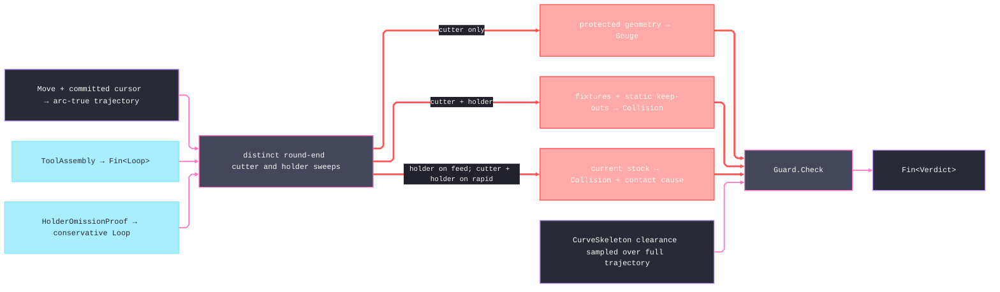

# [RASM_FABRICATION_GUARD]

`Guard` is the fail-closed per-move safety owner inside the CAM fold. It preserves cutter and holder envelopes as distinct fields because they have different stock semantics: the cutter may remove current stock during a feed move, while the holder may never intersect it; both cutter and holder remain forbidden against fixtures, static keep-outs, protected finished geometry, and every rapid obstacle. Combining both envelopes before testing stock rejects every legitimate cut and erases the collision cause.

Every geometric leg stays on `Fin`: cutter sweep, rail-bound `ToolMagazine.HolderEnvelope`, holder sweep, keep-out clipping, BVH decoding, and protected-geometry clipping. `HolderSweep.Swept` without a mounted `ToolAssembly` fails closed. `HolderSweep.Omitted` omits assembly resolution only: `HolderOmissionProof.Admit` binds the cutter, setup, assembly identity, guarded spatial scope, and a conservative holder envelope after proving that the actual admitted holder footprint has no area outside it; guard still sweeps that envelope. Missing, mismatched, or geometry-free evidence fails closed. A clearance-plane shortcut proves that every stock, fixture, keep-out, and protected loop lies below the plane and admits no mounted clearance channel before it returns `Clear`. A channel pinch also fails typed; guard does not invent an unverified lift because `Link.Route` owns travel and the owner-atom `Move` cannot carry a guard proof.

Wire posture: HOST-LOCAL. `Verdict` crosses only to `Toolpath/motion.md` through `Cam`; failures remain typed on the common `Fin` rail.

## [01]-[INDEX]

- [01]-[GUARD]: owns `GuardPolicy`, `Part`, `Stock`, the distinct cutter/holder sweep, and the one `Guard.Check` safety fold.

## [02]-[GUARD]

- Owner: `Part` carries the committed cursor and protected finished loops. `Stock` carries the raw blank, setup snapshots, static keep-outs, cutter, optional admitted tool assembly, optional kernel clearance channel, optional static-set index, and policy. `GuardPolicy` carries clearance and gouge thresholds, the holder posture and optional omission proof, the geometric `Context` used by admitted sweep loops, admitted polygon-offset policy, maximum sweep and channel-probe capacities, clearance-probe pitch, and the arc chord error that derives circular-trajectory subdivision and enters every constructed `ExclusionZone`. `SweptEnvelope` is file-local computation state absorbed into `Guard`; `Verdict` carries only committed safety outcomes.
- Cases: `Verdict.Clear` commits, `Verdict.Gouge(Point3d)` names the protected-surface witness, and `Verdict.Collision(ExclusionZone, CollisionContact)` preserves both obstacle and cutter-versus-holder cause. `HolderSweep.Swept` resolves and sweeps the mounted assembly; `HolderSweep.Omitted` sweeps the proof-carried conservative envelope admitted against the identified assembly without resolving that assembly during each move.
- Entry: `public static Fin<Verdict> Check(Move move, Part part, Stock stock, Fixture fixture)` is the only public operation. It returns geometry/provider failures on the failure rail and never converts a failed check into `Clear`.
- Auto: every move lowers to an arc-true open trajectory first — a circular move rides its `ArcCenter` and `RotationSense` as one bulged span densified at `ArcChordErrorMm` — and cutter and holder sweep separately along that trajectory as round-end open-path offsets, the exact disc-swept envelopes, closed by construction under the algebra region contract; the holder disc radius bounds its spinning footprint. Protected geometry tests the cutter envelope. Static and fixture obstacles test each envelope and retain the first contact cause. Current stock tests the holder envelope for feed and both envelopes for rapid. `Stock.Current(setup)` selects the latest snapshot at or before the operation, falling back to the raw blank. The mounted BVH prunes only the static set, validates every returned ordinal, and rejects any non-`Result/Hits` answer. Channel probes walk every trajectory span at `ClearanceProbeStepMm`, including both endpoints. The rapid clearance-plane fast path is admitted only when all carried obstacle heights are at or below the plane and no clearance channel is mounted.
- Receipt: `Verdict` is the safety receipt; an unmounted required holder, malformed BVH answer, provider failure, or channel pinch is a `Fin` failure and cannot masquerade as a geometric verdict.
- Packages: `Tooling/magazine.md` (`ToolAssembly`, `ToolMagazine.HolderEnvelope`), `Fixturing/workholding.md` (`Fixture`, `ExclusionZone`), `Geometry2D/algebra.md` (`Offset` with `OffsetJoin.Round`/`OffsetEnd.Round`, `Clip`, `PolygonBoolean`, `PolygonFill`), `Geometry2D/arcs.md` (`ArcAlgebra.Densify`), kernel `Rasm.Meshing` (`CurveSkeleton.Clearance`), kernel `Rasm.Spatial` (`Spatial.Apply`, `SpatialOp.Query`, `SpatialQuery.Range`, `QueryResult.Hits`), `Process/owner.md` atoms (`CutterForm`, `Move`, `Loop`, `StockSnapshot`), LanguageExt.Core, Thinktecture.Runtime.Extensions, RhinoCommon.
- Growth: simultaneous tool-axis motion first widens the owner atom and the kinematic seam, then adds orientation to the existing sweep; a near-miss is one `Verdict` case; routed recovery remains `Link` policy.
- Boundary: guard owns verdicts, not travel. A combined cutter/holder stock test, implicit holder omission, unbound `Fin<Loop>` passed as geometry, malformed-index fallback, three-point-only channel probe, automatic unverified lift, or swallowed algebra failure is a deleted form.

```csharp signature
// --- [RUNTIME_PRELUDE] ----------------------------------------------------------------------------------------------------------------------------
using LanguageExt;
using LanguageExt.Common;
using Rasm.Domain;
using Rasm.Fabrication.Fixturing;
using Rasm.Fabrication.Geometry2D;
using Rasm.Fabrication.Process;
using Rasm.Fabrication.Tooling;
using Rasm.Meshing;
using Rasm.Numerics;
using Rasm.Spatial;
using Rhino.Geometry;
using Thinktecture;
using static LanguageExt.Prelude;

namespace Rasm.Fabrication.Toolpath;

// --- [TYPES] --------------------------------------------------------------------------------------------------------------------------------------
[SmartEnum<string>]
public sealed partial class HolderSweep {
    public static readonly HolderSweep Swept = new("swept");
    public static readonly HolderSweep Omitted = new("omitted");
}

// --- [MODELS] -------------------------------------------------------------------------------------------------------------------------------------
public sealed record HolderOmissionProof {
    public CutterForm Cutter { get; }
    public int Operation { get; }
    public UInt128 AssemblyIdentity { get; }
    public BoundingBox Scope { get; }
    public Loop ConservativeEnvelope { get; }

    private HolderOmissionProof(
        CutterForm cutter,
        int operation,
        UInt128 assemblyIdentity,
        BoundingBox scope,
        Loop conservativeEnvelope) {
        Cutter = cutter;
        Operation = operation;
        AssemblyIdentity = assemblyIdentity;
        Scope = scope;
        ConservativeEnvelope = conservativeEnvelope;
    }

    public static Fin<HolderOmissionProof> Admit(
        CutterForm cutter,
        int operation,
        BoundingBox scope,
        Loop conservativeEnvelope,
        ToolAssembly assembly) =>
        cutter is not null
        && assembly is not null
        && assembly.Identity != UInt128.Zero
        && operation >= 0
        && scope.IsValid
        && conservativeEnvelope is not null
        && conservativeEnvelope.Closed
        && conservativeEnvelope.Count >= 3
        && conservativeEnvelope.Vertices.All(scope.Contains)
            ? ToolMagazine.HolderEnvelope(assembly).Bind(actual => PolygonAlgebra.Clip(
                    Seq1(actual),
                    Seq1(conservativeEnvelope),
                    PolygonBoolean.Difference,
                    PolygonFill.NonZero)
                .Bind(outside => outside.IsEmpty
                    ? Fin.Succ(new HolderOmissionProof(cutter, operation, assembly.Identity, scope, conservativeEnvelope.AsCcw()))
                    : Fin.Fail<HolderOmissionProof>(GeometryFault.DegenerateInput("guard:holder-proof-underbound").ToError())))
            : Fin.Fail<HolderOmissionProof>(GeometryFault.DegenerateInput("guard:holder-proof").ToError());
}

public readonly record struct GuardPolicy(
    double ClearancePlane,
    double GougeTolerance,
    HolderSweep Holder,
    Option<HolderOmissionProof> HolderProof,
    Context Tolerance,
    Rasm.Fabrication.Geometry2D.OffsetPolicy Offset,
    int MaximumSweepSegments,
    int MaximumClearanceProbes,
    double ClearanceProbeStepMm,
    double ArcChordErrorMm) {
    public Fin<Unit> Admit(double cutterRadius) =>
        double.IsFinite(ClearancePlane)
        && GougeTolerance >= 0.0
        && double.IsFinite(GougeTolerance)
        && cutterRadius > 0.0
        && double.IsFinite(cutterRadius)
        && Holder is not null
        && Tolerance is not null
        && Offset is not null
        && MaximumSweepSegments >= 8
        && MaximumSweepSegments <= Array.MaxLength
        && MaximumClearanceProbes >= 1
        && MaximumClearanceProbes < Array.MaxLength
        && ClearanceProbeStepMm > 0.0
        && double.IsFinite(ClearanceProbeStepMm)
        && ArcChordErrorMm > 0.0
        && double.IsFinite(ArcChordErrorMm)
        && (Holder == HolderSweep.Omitted ? HolderProof.IsSome : HolderProof.IsNone)
            ? SweepSegments(cutterRadius).Map(static _ => unit)
            : Fin.Fail<Unit>(GeometryFault.DegenerateInput("guard:policy").ToError());

    public Fin<int> SweepSegments(double cutterRadius) =>
        from halfAngle in cutterRadius > 0.0 && ArcChordErrorMm > 0.0
            ? Fin.Succ(Math.Acos(Math.Clamp(1.0 - (ArcChordErrorMm / cutterRadius), -1.0, 1.0)))
            : Fin.Fail<double>(GeometryFault.DegenerateInput("guard:sweep-radius").ToError())
        let demand = Math.Max(8.0, Math.Ceiling(Math.Tau / (2.0 * halfAngle)))
        from segments in halfAngle > 0.0 && double.IsFinite(demand) && demand <= MaximumSweepSegments
            ? Fin.Succ((int)demand)
            : Fin.Fail<int>(GeometryFault.DegenerateInput("guard:sweep-capacity").ToError())
        select segments;

    public Fin<int> ClearanceSegments(double length) =>
        from demand in length >= 0.0 && double.IsFinite(length)
            ? Fin.Succ(Math.Ceiling(length / ClearanceProbeStepMm))
            : Fin.Fail<double>(GeometryFault.DegenerateInput("guard:clearance-length").ToError())
        from segments in double.IsFinite(demand) && demand <= MaximumClearanceProbes
            ? Fin.Succ(Math.Max(1, (int)demand))
            : Fin.Fail<int>(GeometryFault.DegenerateInput("guard:clearance-capacity").ToError())
        select segments;
}

public sealed record Part(Point3d Cursor, Seq<Loop> Protected);

public sealed record Stock(
    Seq<Loop> RawBlank,
    Seq<ExclusionZone> Keepouts,
    Seq<StockSnapshot> Snapshots,
    CutterForm Cutter,
    Option<ToolAssembly> Assembly,
    Option<CurveSkeleton> Channel,
    Option<SpatialIndex> Index,
    GuardPolicy Policy) {
    public double Radius => Cutter.Diameter * 0.5;

    public Seq<Loop> Current(int setup) =>
        Snapshots.Filter(snapshot => snapshot.Setup <= setup)
            .OrderByDescending(static snapshot => snapshot.Setup)
            .HeadOrNone()
            .Map(static snapshot => snapshot.Machined.ToSeq())
            .IfNone(RawBlank);

    // The stock keep-out satisfies the workholding six-field contract: Keepouts carry exact arc topology, Walls
    // carry the ONCE-densified polygons every segment test reads, and Height: MaxValue blocks at every Z.
    public Fin<ExclusionZone> CurrentZone(Fixture fixture) {
        Seq<Loop> current = Current(fixture.Operation);
        return current.Traverse(loop => loop.Bulges.ForAll(static bulge => bulge == 0.0)
                ? Fin.Succ(loop)
                : ArcAlgebra.Densify(loop, Policy.ArcChordErrorMm).Map(static receipt => receipt.Result))
            .As()
            .Map(walls => new ExclusionZone(
                fixture.Operation, WorkholdingKind.SacrificialBed, current, walls, double.MaxValue, Policy.ArcChordErrorMm));
    }
}

file sealed record SweptEnvelope(Seq<Loop> Cutter, Seq<Loop> Holder) {
    public Seq<Loop> Combined => Cutter.Concat(Holder);

    public BoundingBox Bound(Seq<Loop> loops) =>
        loops.Map(static loop => loop.Bound()).Fold(BoundingBox.Empty, BoundingBox.Union);
}

[Union(ConversionFromValue = ConversionOperatorsGeneration.None)]
public abstract partial record Verdict {
    private Verdict() { }

    public sealed record Clear : Verdict;
    public sealed record Gouge(Point3d Surface) : Verdict;
    public sealed record Collision(ExclusionZone Obstacle, CollisionContact Contact) : Verdict;
}

// --- [OPERATIONS] ---------------------------------------------------------------------------------------------------------------------------------
public static class Guard {
    public static Fin<Verdict> Check(Move move, Part part, Stock stock, Fixture fixture) =>
        from _ in stock.Policy.Admit(stock.Radius)
        from __ in HolderEvidence(part.Cursor, Target(move), stock, fixture)
        from verdict in (ClearedByPlane(move, part, stock, fixture)
            ? Fin.Succ<Verdict>(new Verdict.Clear())
            : from spine in Trajectory(move, part.Cursor, stock.Policy)
              from swept in Sweep(spine, stock)
              from gouged in Gouged(swept.Cutter, part.Protected, stock.Policy.GougeTolerance, stock.Policy.Offset)
              from struck in gouged.IsSome
                  ? Fin.Succ(Option<Verdict.Collision>.None)
                  : Struck(move, part.Cursor, swept, stock, fixture)
              from pinched in gouged.IsSome || struck.IsSome ? Fin.Succ(false) : Pinched(spine, stock)
              from _ in pinched
                  ? Fin.Fail<Unit>(GeometryFault.DegenerateInput("guard:channel-clearance").ToError())
                  : Fin.Succ(unit)
              select gouged.Match(
                  Some: point => (Verdict)new Verdict.Gouge(point),
                  None: () => struck.Match(
                      Some: collision => (Verdict)collision,
                      None: () => new Verdict.Clear())))
        select verdict;

    private static Fin<Unit> HolderEvidence(Point3d from, Point3d to, Stock stock, Fixture fixture) =>
        stock.Policy.Holder == HolderSweep.Swept
            ? stock.Assembly.IsSome
                ? Fin.Succ(unit)
                : Fin.Fail<Unit>(GeometryFault.DegenerateInput("guard:holder-unmounted").ToError())
            : stock.Policy.HolderProof.Match(
                Some: proof => proof.Operation == fixture.Operation
                    && proof.Cutter == stock.Cutter
                    && proof.Scope.IsValid
                    && proof.ConservativeEnvelope.Closed
                    && proof.ConservativeEnvelope.Count >= 3
                    && proof.Scope.Contains(from)
                    && proof.Scope.Contains(to)
                        ? Fin.Succ(unit)
                        : Fin.Fail<Unit>(GeometryFault.DegenerateInput("guard:holder-proof-mismatch").ToError()),
                None: () => Fin.Fail<Unit>(GeometryFault.DegenerateInput("guard:holder-proof-missing").ToError()));

    private static bool ClearedByPlane(Move move, Part part, Stock stock, Fixture fixture) =>
        move is Move.Rapid
        && Math.Min(part.Cursor.Z, Target(move).Z) >= stock.Policy.ClearancePlane
        && stock.Channel.IsNone
        && stock.Keepouts.Concat(fixture.Zones).All(zone => zone.Height <= stock.Policy.ClearancePlane)
        && part.Protected.Concat(stock.Current(fixture.Operation))
            .All(loop => loop.Bound().Max.Z <= stock.Policy.ClearancePlane);

    // The arc-true trajectory: a straight move is its own open span; a circular move lowers to ONE bulged span
    // (bulge from the ArcCenter sweep sagitta, a coincident-endpoint move as two half-circle spans) and the arcs
    // owner densifies it at the policy chord error, so the swept envelopes and every channel probe follow the
    // real path — never the endpoint chord. Densified spans stay within the policy sweep capacity.
    private static Fin<Loop> Trajectory(Move move, Point3d cursor, GuardPolicy policy) =>
        move.Switch(
            state: (Cursor: cursor, Policy: policy),
            rapid: static (state, row) => Loop.Admit(Arr(state.Cursor, row.Target), closed: false, Arr<double>.Empty, state.Policy.Tolerance),
            linear: static (state, row) => Loop.Admit(Arr(state.Cursor, row.Target), closed: false, Arr<double>.Empty, state.Policy.Tolerance),
            circular: static (state, row) => ArcSpan(state.Cursor, row.Target, row.Arc, state.Policy)
                .Bind(span => ArcAlgebra.Densify(span, state.Policy.ArcChordErrorMm))
                .Bind(receipt => receipt.Result.Spans <= state.Policy.MaximumSweepSegments
                    ? Fin.Succ(receipt.Result)
                    : Fin.Fail<Loop>(GeometryFault.DegenerateInput("guard:sweep-capacity").ToError())));

    private static Fin<Loop> ArcSpan(Point3d from, Point3d to, ArcCenter arc, GuardPolicy policy) {
        Vector3d a = from - arc.Center;
        Vector3d b = to - arc.Center;
        double radius = a.Length;
        if (!double.IsFinite(radius) || radius <= 0.0 || Math.Abs(radius - b.Length) > policy.ArcChordErrorMm)
            return Fin.Fail<Loop>(GeometryFault.DegenerateInput("guard:arc-motion").ToError());
        bool clockwise = arc.Sense == RotationSense.Clockwise;
        if (from.DistanceTo(to) <= policy.Tolerance.Absolute.Value) {
            Point3d opposite = new(2.0 * arc.Center.X - from.X, 2.0 * arc.Center.Y - from.Y, from.Z);
            double half = clockwise ? -1.0 : 1.0;
            return Loop.Admit(Arr(from, opposite, to), closed: false, Arr(half, half, 0.0), policy.Tolerance);
        }
        double minor = Vector3d.VectorAngle(a, b);
        double cross = Vector3d.CrossProduct(a, b).Z;
        bool ccw = !clockwise;
        double sweep = (ccw && cross >= 0.0) || (!ccw && cross <= 0.0) ? minor : Math.Tau - minor;
        return Loop.Admit(Arr(from, to), closed: false, Arr(Math.Tan((ccw ? sweep : -sweep) / 4.0), 0.0), policy.Tolerance);
    }

    // The sweep IS the algebra owner's open-path round-end offset: an open trajectory inflated by radius r is the
    // exact disc-swept envelope, and the closed result satisfies every downstream region contract by construction.
    // The holder footprint spins with the spindle, so its planar sweep is the disc of its bounding radius.
    private static Fin<SweptEnvelope> Sweep(Loop spine, Stock stock) =>
        from sweepPolicy in OffsetPolicy.Admit(
            OffsetJoin.Round, OffsetEnd.Round, miterLimit: 2.0, stock.Policy.Tolerance.Absolute.Value)
        from cutter in PolygonAlgebra.Offset(Seq(spine), stock.Radius, sweepPolicy)
        from holderShape in stock.Policy.Holder == HolderSweep.Omitted
            ? stock.Policy.HolderProof.Match(
                Some: proof => Fin.Succ(proof.ConservativeEnvelope),
                None: () => Fin.Fail<Loop>(GeometryFault.DegenerateInput("guard:holder-proof-missing").ToError()))
            : stock.Assembly.Match(
                Some: ToolMagazine.HolderEnvelope,
                None: () => Fin.Fail<Loop>(GeometryFault.DegenerateInput("guard:holder-unmounted").ToError()))
        from holderRadius in FootprintRadius(holderShape, stock.Policy)
        from holder in PolygonAlgebra.Offset(Seq(spine), holderRadius, sweepPolicy)
        select new SweptEnvelope(cutter, holder);

    // Bounding spindle radius of a tool-centered footprint: bulged rims densify first, and the chord error rides
    // the bound so the disc stays a conservative superset of the true rim — fail-closed by construction.
    private static Fin<double> FootprintRadius(Loop footprint, GuardPolicy policy) =>
        (footprint.Bulges.ForAll(static bulge => bulge == 0.0)
            ? Fin.Succ(footprint)
            : ArcAlgebra.Densify(footprint, policy.ArcChordErrorMm).Map(static receipt => receipt.Result))
        .Bind(rim => {
            double radius = rim.Vertices.Fold(0.0, static (bound, vertex) =>
                Math.Max(bound, Math.Sqrt((vertex.X * vertex.X) + (vertex.Y * vertex.Y))));
            return radius > 0.0 && double.IsFinite(radius)
                ? Fin.Succ(radius + policy.ArcChordErrorMm)
                : Fin.Fail<double>(GeometryFault.DegenerateInput("guard:holder-footprint").ToError());
        });

    private static Fin<Option<Point3d>> Gouged(
        Seq<Loop> cutter,
        Seq<Loop> protectedLoops,
        double tolerance,
        Rasm.Fabrication.Geometry2D.OffsetPolicy offset) =>
        (tolerance <= 0.0
            ? Fin.Succ(cutter)
            : PolygonAlgebra.Offset(cutter, -Math.Abs(tolerance), offset))
        .Bind(envelope => FirstWitness(protectedLoops, loop =>
            PolygonAlgebra.Clip(
                envelope,
                Seq(loop),
                PolygonBoolean.Intersection,
                PolygonFill.NonZero)
                .Map(static overlap => overlap.HeadOrNone()
                    .Filter(static region => region.Count > 0)
                    .Map(static region => region.At(0)))));

    private static Fin<Option<Verdict.Collision>> Struck(Move move, Point3d cursor, SweptEnvelope swept, Stock stock, Fixture fixture) =>
        from statics in StaticCandidates(swept, stock)
        let obstacles = statics.Concat(fixture.Zones).Filter(zone => Math.Min(cursor.Z, Target(move).Z) < zone.Height)
        from cutterFixed in FirstOverlap(swept.Cutter, obstacles)
        from holderFixed in cutterFixed.IsSome ? Fin.Succ(Option<ExclusionZone>.None) : FirstOverlap(swept.Holder, obstacles)
        let fixedHit = Collision(cutterFixed, holderFixed)
        from stockZone in stock.CurrentZone(fixture)
        from cutterStock in fixedHit.IsSome || move is not Move.Rapid
            ? Fin.Succ(Option<ExclusionZone>.None)
            : Overlaps(swept.Cutter, stockZone)
        from holderStock in fixedHit.IsSome || cutterStock.IsSome
            ? Fin.Succ(Option<ExclusionZone>.None)
            : Overlaps(swept.Holder, stockZone)
        select fixedHit.IsSome ? fixedHit : Collision(cutterStock, holderStock);

    private static Option<Verdict.Collision> Collision(Option<ExclusionZone> cutter, Option<ExclusionZone> holder) =>
        cutter.Match(
            Some: zone => Some(new Verdict.Collision(zone, CollisionContact.Cutter)),
            None: () => holder.Map(zone => new Verdict.Collision(zone, CollisionContact.Holder)));

    private static Fin<Seq<ExclusionZone>> StaticCandidates(SweptEnvelope swept, Stock stock) =>
        swept.Combined.IsEmpty
            ? Fin.Succ(Seq<ExclusionZone>())
            : stock.Index.Match(
                None: () => Fin.Succ(stock.Keepouts),
                Some: index => Spatial.Apply(new SpatialOp.Query(index, new SpatialQuery.Range(swept.Bound(swept.Combined), None)))
                    .Bind(answer => answer is SpatialAnswer.Result { Value: QueryResult.Hits hits }
                        ? hits.Ids.Exists(id => id < 0 || id >= stock.Keepouts.Count)
                            ? Fin.Fail<Seq<ExclusionZone>>(GeometryFault.DegenerateInput("guard:index-ordinal").ToError())
                            : Fin.Succ(hits.Ids.Map(id => stock.Keepouts[id]))
                        : Fin.Fail<Seq<ExclusionZone>>(GeometryFault.DegenerateInput("guard:index-answer").ToError())));

    private static Fin<Option<ExclusionZone>> FirstOverlap(Seq<Loop> envelope, Seq<ExclusionZone> zones) =>
        FirstWitness(zones, zone => Overlaps(envelope, zone));

    private static Fin<Option<ExclusionZone>> Overlaps(Seq<Loop> envelope, ExclusionZone zone) =>
        envelope.IsEmpty
            ? Fin.Succ(Option<ExclusionZone>.None)
            : FirstWitness(zone.Keepouts, keepout =>
                PolygonAlgebra.Clip(
                    envelope,
                    Seq(keepout),
                    PolygonBoolean.Intersection,
                    PolygonFill.NonZero).Map(overlap => overlap.IsEmpty ? Option<ExclusionZone>.None : Some(zone)));

    private static Fin<Option<TWitness>> FirstWitness<TRow, TWitness>(Seq<TRow> rows, Func<TRow, Fin<Option<TWitness>>> probe) =>
        rows.Fold(
            Fin.Succ(Option<TWitness>.None),
            (state, row) => state.Bind(found => found.IsSome ? Fin.Succ(found) : probe(row)));

    // Channel probes walk every densified trajectory span at the probe pitch, both endpoints included, so an
    // arc that pinches only mid-flight still fails typed.
    private static Fin<bool> Pinched(Loop spine, Stock stock) =>
        stock.Channel.Match(
            None: () => Fin.Succ(false),
            Some: channel => toSeq(Enumerable.Range(0, spine.Spans)).TraverseM(span => {
                Point3d from = spine.At(span);
                Point3d to = spine.At(span + 1);
                return stock.Policy.ClearanceSegments(from.DistanceTo(to)).Map(segments =>
                    Range(0, segments + 1).Exists(index => {
                        Point3d point = from + ((double)index / segments * (to - from));
                        return channel.Clearance(point).Radius < stock.Radius;
                    }));
            }).As().Map(static pinches => pinches.Exists(identity)));

    private static Point3d Target(Move move) =>
        move.Switch(
            rapid: static row => row.Target,
            linear: static row => row.Target,
            circular: static row => row.Target);
}
```


