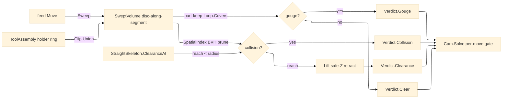

# [RASM_FABRICATION_GUARD]

The collision-and-gouge guard sub-domain: `Guard` the static owner producing the swept tool-plus-holder envelope every feed move passes through and a closed `Verdict` `[Union]` (`Clear`/`Gouge`/`Collision`/`Clearance`) `Toolpath/motion#CAM_MOTION` `Cam.Solve` consults before committing each feed move — the mandatory professional-CAM safety floor the milling-biased folder lacks. A move's swept volume is the tool disc dragged along the segment (the `Polygon/clipper#POLYGON_ALGEBRA` precision-correct `MinkowskiSum` of the segment with the tool-radius disc) unioned with the holder offset ring (the `Process/magazine#TOOL_MAGAZINE` `ToolAssembly` holder footprint inflated by the projected stickout), tested against TWO distinct geometries held separately so a gouge separates from a collision: the part-keep geometry (the finished surface a `Gouge` must not cut, the `FabricationInput.Profiles`) and the stock/fixture keep-out (the `Collision` obstacle, the `FabricationInput.Keepouts` plus the `Nesting/workholding#WORKHOLDING` `ExclusionZone` fixture set). The reach check reads the realized `Toolpath/skeleton#STRAIGHT_SKELETON` `ClearanceAt(Loop, Point3d)` inscribed-radius lookup (the wavefront-time channel half-width per point) so a stickout-limited tool tests its local reach against the channel rather than re-deriving a distance transform. The `Clearance` verdict carries the collision-aware safe-Z lift trajectory — the retract-plane-up, traverse-over, plunge-down path routing a blocked move around both keep-outs — the retract the motion page names as growth but never owns. The broad-phase prune reads the kernel `Rasm/Spatial/index#SPATIAL_INDEX` `SpatialIndex` BVH so a move tests only the keep-out zones whose AABB its swept envelope overlaps, never an O(n) all-zones scan. The owner composes the `Process/owner#FABRICATION_OWNER` `Loop`/`Edge3`/`Move` shared vocabulary; it computes no hash and operates on raw coordinate doubles at the interior.

Wire posture: HOST-LOCAL. The `Verdict` and the lifted `Move` retract cross only the in-process seam to the `Toolpath/motion#CAM_MOTION` `Cam.Solve` consumer — never a browser or peer wire. The `SweptVolume`/`Verdict`/`GuardPolicy` records are host-local types that never sit between wire and rail.

## [01]-[INDEX]

- [01]-[GUARD]: owns the `SweptVolume` swept tool-plus-holder envelope, the `Verdict` `[Union]` (`Clear`/`Gouge`/`Collision`/`Clearance`), and the `Guard` fold — `Sweep` (move → swept polygon over the Minkowski substrate), `Check` (swept vs part-keep/stock-keep-out exclusion through the BVH broad-phase and the skeleton reach), and `Lift` (blocked-move → collision-aware safe-Z retract).

## [02]-[GUARD]

- Owner: `SweptVolume` the swept tool-plus-holder envelope a `Move` drags — the tool-radius disc Minkowski-summed along the segment unioned with the holder offset ring, the precision-correct polygon the `Check` tests; `Verdict` `[Union]` the closed per-move safety result (`Clear` no exclusion covers the swept envelope · `Gouge` carrying the violated part-surface `Point3d` where the envelope cut the finished part-keep · `Collision` carrying the obstacle keep-out `ExclusionZone` the envelope struck · `Clearance` carrying the lifted retract `Seq<Move>` routing the blocked move over both keep-outs) read by a generated total `Switch`; `GuardPolicy` the guard knobs (the clearance-plane Z height the lift retracts to, the gouge tolerance the part-keep test admits, the holder-included flag gating the holder ring into the sweep, and the stickout the holder envelope projects); `Guard` the static surface owning `Sweep` (the move → swept polygon), `Check` (the swept vs `Part`/`Stock`/`Fixture` exclusion verdict over the BVH broad-phase and the `ClearanceAt` reach), and `Lift` (the blocked-move → clearance-plane retract trajectory).
- Cases: the `Verdict` arms `Clear` · `Gouge` · `Collision` · `Clearance` (4), the four-state verdict the `Check`/`Lift` fold produces and the generated `Switch` reads, never a parallel boolean pass; a swept envelope is tested against the part-keep (a `Gouge` on intersection) AND the stock-keep-out (a `Collision` on intersection), the two geometries held distinct so the cause is typed, and a blocked move's `Lift` is the `Clearance` verdict carrying the safe-Z retract, never a silent cut-through.
- Entry: `public static Verdict Check(Move move, Point3d cursor, double toolRadius, GuardInput keep, GuardPolicy policy, SpatialIndex index)` — the total per-move safety verdict a generator queries before committing a feed move, the `Verdict` `[Union]` carrying the typed cause; `public static SweptVolume Sweep(Move move, Point3d cursor, double toolRadius, Option<Loop> holder, GuardPolicy policy)` projects the swept tool-plus-holder envelope; `public static Seq<Move> Lift(Move blocked, Point3d cursor, GuardPolicy policy)` is the collision-aware retract trajectory the `Clearance` verdict carries. A rapid move is `Clear` by contract (the guard tests feed moves, a rapid clears above the work); a feed move whose swept envelope intersects no exclusion is `Clear`.
- Auto: `Guard.Sweep` builds the move's swept polygon — the tool-radius disc (a `policy`-faceted circle `Loop`) `Polygon/clipper#POLYGON_ALGEBRA` `MinkowskiSum`med along the `Edge3(cursor, move.To)` segment so the disc-along-segment is the precision-correct `decimalPlaces`-scaled stadium, unioned through `Clip` `ClipOp.Union` with the holder offset ring (the `ToolAssembly` holder footprint `Offset` by the projected stickout) when `policy.HolderIncluded`; `Check` broad-phase-prunes the keep-out set through the `SpatialIndex` `Range` query over the swept envelope's bound (only the zones whose AABB overlaps reach the narrow phase), then tests the swept polygon against the part-keep loops (the `FabricationInput.Profiles`) — an intersection (the swept envelope `Clip` `ClipOp.Intersection` against a part-keep loop yields a non-empty region, or a part-keep vertex lies inside the swept envelope via `Loop.Covers`) routes `Gouge` carrying the violated surface point — and against the stock/fixture keep-out set (the `FabricationInput.Keepouts` plus the `Fixture.Zones` `ExclusionZone` set) — an intersection routes `Collision` carrying the obstacle; the reach check reads `StraightSkeleton.ClearanceAt(channel, move.To)` so a stickout-limited tool whose local channel half-width is below the tool radius (the tool cannot reach the cut without the holder fouling the wall) routes `Collision` against the channel rather than re-deriving a distance transform; a move clearing both keep-outs is `Clear`. `Lift` is the collision-aware retract: rather than the blocked feed, it emits a `Rapid` up to `policy.ClearancePlane` Z, a `Rapid` traverse over to the target XY (the clearance-plane traverse clearing every keep-out by construction since the plane sits above the fixture height), and a `Rapid` plunge down to the target — the safe-Z trajectory the `Clearance` verdict carries so `Cam.Solve` substitutes the lift for the blocked move; `Cam.Solve` consults `Check` per feed move and folds the `Verdict` — a `Gouge`/`Collision` routes the typed fault, a `Clearance` substitutes the lifted retract, a `Clear` commits the move.
- Receipt: the `Verdict` IS the typed safety evidence — `Gouge` carries the violated part point, `Collision` the obstacle zone, `Clearance` the lifted retract move set, `Clear` the no-op — the per-move safety contract `Cam.Solve` reads directly; no generic collision ledger, the verdict a typed cause not a logged event.
- Packages: `Rhino.Geometry` (`Point3d`/`Vector3d`/`BoundingBox` — composed), the `Process/owner#FABRICATION_OWNER` `Loop.Covers` (the part-keep containment, composing the kernel `Predicate.Orient2D` transitively), Clipper2 (via `Polygon/clipper#POLYGON_ALGEBRA` — the `MinkowskiSum` swept stadium, the `Offset` holder ring, the `Clip` exclusion test), `Rasm.Spatial` (`SpatialIndex.Build`/`Query`, `SpatialQuery.Range` — the keep-out broad-phase, composed, never a local BVH), `Toolpath/skeleton#STRAIGHT_SKELETON` (`ClearanceAt` — the channel reach lookup, settled), `Process/magazine#TOOL_MAGAZINE` (`ToolAssembly` holder footprint — the swept holder ring), Thinktecture.Runtime.Extensions (`[Union]`), LanguageExt.Core, BCL inbox.
- Growth: a 5-axis tilt envelope (a swept volume under a tilting tool axis) is one orientation column on `Sweep`; a 3D keep-out volume gating by Z is one `GuardInput` height column plus one `Check` Z-test arm; a feed-rate-aware lift (a controlled retract instead of a rapid) is one `Lift` arm reading the `Posting/program#CUT_PROGRAM` `Feedrate`; a tab-relocation arm moving a part-retention tab off a clamp is one `Lift` arm composing the posting `Tabs`; zero new surface.
- Boundary: `Guard` is the ONE swept-envelope safety owner and a second collision surface is the deleted form — the swept geometry rides the one `Polygon/clipper#POLYGON_ALGEBRA` Minkowski/offset/clip owner, the broad-phase the one kernel `SpatialIndex`, and the reach the one `Toolpath/skeleton#STRAIGHT_SKELETON` `ClearanceAt`, never a parallel collision kernel; the part-keep and the stock-keep-out are held DISTINCT so a gouge against the finished surface routes `Gouge` and a collision against a clamp routes `Collision`, never one merged exclusion that loses the cause; the swept envelope is the precision-correct `MinkowskiSum` disc-along-segment (the `decimalPlaces`-scaled `Minkowski.Sum` facade, never the `Clipper.MinkowskiSum` shorthand that drops precision) and a hand-rolled per-vertex offset stadium is the deleted form; the reach check reads `StraightSkeleton.ClearanceAt` the wavefront clearance field encodes and a re-derived distance transform or a second inscribed-circle pass is the deleted form; the keep-out broad-phase reads the kernel `SpatialIndex` BVH and an O(n) all-zones scan or a local acceleration structure is the deleted form; the `Verdict` is read through the generated total `Switch` and a `verdict switch` cascade with a `_` catch-all is the deleted form — a new verdict case breaks the build until its arm lands; the lift is the collision-aware safe-Z retract the `Clearance` verdict carries and a blocked move that silently cuts through is the rejected form — a feed move that gouges or collides routes a typed fault or substitutes the lift, never an uncaught crash; the side verdict reads `Predicate.Orient2D` exact sign through `Loop.Covers` and a naive `double` cross is the named robustness defect; the holder envelope reads the `Process/magazine#TOOL_MAGAZINE` `ToolAssembly` geometry and a zero-width spindle-axis stand-in is the rejected form the magazine's real holder footprint replaces.

```csharp signature
// --- [RUNTIME_PRELUDE] --------------------------------------------------------------------
using LanguageExt;
using Rasm.Fabrication.Fixturing;
using Rasm.Fabrication.Geometry2D;
using Rasm.Fabrication.Process;
using Rasm.Numerics;
using Rasm.Spatial;
using Rhino.Geometry;
using Thinktecture;
using static LanguageExt.Prelude;

namespace Rasm.Fabrication.Toolpath;

// --- [MODELS] -----------------------------------------------------------------------------
public readonly record struct GuardPolicy(double ClearancePlane, double GougeTolerance, bool HolderIncluded, double Stickout) {
    public static readonly GuardPolicy Default = new(ClearancePlane: 25.0, GougeTolerance: 0.01, HolderIncluded: true, Stickout: 30.0);
}

public readonly record struct GuardInput(Seq<Loop> PartKeep, Seq<ExclusionZone> StockKeep, Option<Loop> Holder, Loop Channel);

public sealed record SweptVolume(Seq<Loop> Envelope) {
    public BoundingBox Bound => PolygonAlgebra.Bounds(Envelope);
}

[Union(ConversionFromValue = ConversionOperatorsGeneration.None)]
public abstract partial record Verdict {
    private Verdict() { }

    public sealed record Clear : Verdict;
    public sealed record Gouge(Point3d Surface) : Verdict;
    public sealed record Collision(ExclusionZone Obstacle) : Verdict;
    public sealed record Clearance(Seq<Move> Retract) : Verdict;
}

// --- [OPERATIONS] -------------------------------------------------------------------------
public static class Guard {
    public static SweptVolume Sweep(Move move, Point3d cursor, double toolRadius, Option<Loop> holder, GuardPolicy policy) {
        Loop disc = Disc(toolRadius, segments: 24);
        Seq<Loop> stadium = PolygonAlgebra.MinkowskiSum(Segment(cursor, move.To), disc).IfFail(Seq(disc));
        return policy.HolderIncluded
            ? holder.Match(
                Some: h => new SweptVolume(PolygonAlgebra.Clip(stadium, Ring(h, policy.Stickout, cursor, move.To), ClipOp.Union).IfFail(stadium)),
                None: () => new SweptVolume(stadium))
            : new SweptVolume(stadium);
    }

    public static Verdict Check(Move move, Point3d cursor, double toolRadius, GuardInput keep, GuardPolicy policy, SpatialIndex index) {
        if (move.Rapid) return new Verdict.Clear();
        SweptVolume swept = Sweep(move, cursor, toolRadius, keep.Holder, policy);
        return Gouged(swept, keep.PartKeep).Match(
            Some: surface => (Verdict)new Verdict.Gouge(surface),
            None: () => Struck(swept, keep.StockKeep, index).Match(
                Some: zone => new Verdict.Collision(zone),
                None: () => StraightSkeleton.ClearanceAt(keep.Channel, move.To).IfFail(double.MaxValue) < toolRadius
                    ? new Verdict.Clearance(Lift(move, cursor, policy))
                    : new Verdict.Clear()));
    }

    public static Seq<Move> Lift(Move blocked, Point3d cursor, GuardPolicy policy) =>
        Seq(new Move(cursor with { Z = policy.ClearancePlane }, Rapid: true, Feed: 0.0),
            new Move(new Point3d(blocked.To.X, blocked.To.Y, policy.ClearancePlane), Rapid: true, Feed: 0.0),
            new Move(blocked.To, Rapid: true, Feed: 0.0));

    static Option<Point3d> Gouged(SweptVolume swept, Seq<Loop> partKeep) =>
        partKeep.Bind(static l => toSeq(l.Vertices))
            .Find(v => swept.Envelope.Exists(e => e.Covers(v)))
            .Match(Some: Some, None: () => partKeep
                .Find(l => PolygonAlgebra.Clip(swept.Envelope, Seq(l), ClipOp.Intersection).Map(static r => !r.IsEmpty).IfFail(false))
                .Map(l => l.At(0)));

    static Option<ExclusionZone> Struck(SweptVolume swept, Seq<ExclusionZone> zones, SpatialIndex index) {
        Seq<int> near = (index.Query(new SpatialQuery.Range(swept.Bound, None)) as QueryResult.Hits)?.Ids ?? Seq<int>();
        return near.Map(i => zones[i])
            .Find(z => swept.Envelope.Exists(e => PolygonAlgebra.Clip(Seq(e), Seq(z.Keepout), ClipOp.Intersection).Map(static r => !r.IsEmpty).IfFail(false)));
    }

    static Loop Segment(Point3d a, Point3d b) => new(Arr(a, b), Closed: false);

    // The holder footprint inflated by the stickout-derived clearance margin and centered on the
    // move's tool-tip travel — the envelope a stickout-limited tool must keep clear of the walls.
    static Seq<Loop> Ring(Loop holder, double stickout, Point3d a, Point3d b) {
        Point3d mid = a + 0.5 * (b - a);
        Loop placed = new Loop(holder.Vertices.Map(v => new Point3d(v.X + mid.X, v.Y + mid.Y, 0.0)).ToArr(), Closed: true).AsCcw();
        return PolygonAlgebra.Offset(Seq(placed), 0.1 * Math.Max(0.0, stickout), OffsetEnds.Polygon).IfFail(Seq(placed));
    }

    static Loop Disc(double radius, int segments) =>
        new Loop(toArr(Enumerable.Range(0, segments).Select(i => {
            double t = 2.0 * Math.PI * i / segments;
            return new Point3d(radius * Math.Cos(t), radius * Math.Sin(t), 0.0);
        })), Closed: true).AsCcw();
}
```


