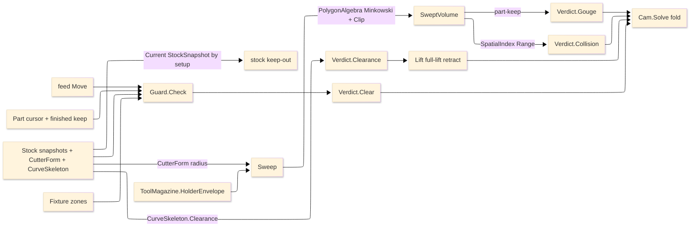

# [RASM_FABRICATION_GUARD]

The guard owner is the design-time per-feed-move safety gate inside the Cam fold. It sweeps the cutter radius from owner#atoms `CutterForm`, unions the magazine-owned `HolderEnvelope`, reads the current input-carried `StockSnapshot` by setup before falling back to the raw blank, prunes obstacles through the kernel BVH, and returns the typed `Verdict` that either commits, faults, or substitutes a full-lift retract. `Verify/removal` remains the verify-time truth owner; guard owns only the design-time floor before a move commits.

Wire posture: HOST-LOCAL. `Verdict` and lifted `Move` rows cross only the in-process seam to `Toolpath/motion#CAM_MOTION` and then to posting through owner-side `Motion`.

## [01]-[INDEX]

- [01]-[GUARD]: owns `Part` per-move context, `Stock` current-snapshot context, `SweptVolume`, `Verdict`, and `Guard.Check`/`Sweep`/`Lift`.

## [02]-[GUARD]

- Owner: `Part` carries the committed cursor and finished part-keep loops; `Stock` carries raw blank fallback, stock keep-outs, setup snapshots, `CutterForm`, optional `ToolAssembly`, kernel `CurveSkeleton`, kernel `SpatialIndex`, and `GuardPolicy`; `SweptVolume` carries the cutter-plus-holder swept polygon set; `Verdict` carries the four safety outcomes; `Guard` owns the one per-move safety fold.
- Cases: `Verdict.Clear` commits the feed move, `Verdict.Gouge(Point3d)` faults a finished-surface cut, `Verdict.Collision(ExclusionZone)` faults stock or fixture impact, and `Verdict.Clearance(Seq<Move>)` substitutes the full-lift retract. Part-keep and stock/fixture keep-out geometry stay distinct so the typed cause survives the fold.
- Entry: `public static Verdict Check(Move move, Part part, Stock stock, Fixture fixture)` is the ruled guard entry. `public static SweptVolume Sweep(Move move, Point3d cursor, CutterForm cutter, Option<ToolAssembly> assembly, GuardPolicy policy)` projects the cutter-plus-holder envelope. `public static Seq<Move> Lift(Move blocked, Point3d cursor, GuardPolicy policy)` emits the last-resort full-lift row.
- In-seams: `Toolpath/motion#CAM_MOTION` supplies the committed cursor and calls `Check` for each feed move; `Fixturing/setups` supplies the operation-scoped `Fixture` and per-op collision context.
- Out-seams: `Toolpath/skeleton#SKELETON_WALK` and kernel `OffsetOp.Clearance`/`CurveSkeleton.Clearance(Point3d)` supply channel clearance; `Tooling/magazine#TOOL_MAGAZINE` supplies `HolderEnvelope`; `Geometry2D/algebra#POLYGON_ALGEBRA` supplies Minkowski/offset/clip; `Fixturing/workholding#WORKHOLDING` supplies `ExclusionZone`; kernel `Spatial/index` supplies the BVH broad-phase; owner#atoms supplies `CutterForm`, `Move`, `Loop`, `StockSnapshot`, and `ContentKey`-backed stock state.
- Auto: `Check` ignores rapid moves, sweeps the feed segment, tests part-keep first, then stock and fixture keep-outs through the BVH. `Stock.Current` selects the matching or latest prior setup snapshot and falls back to `RawBlank` only when `Snapshots` is empty. `CurveSkeleton.Clearance(move.To)` supplies the local channel half-width; a radius overflow returns `Clearance(Lift(...))`, never a second distance transform. `Cam.Solve` folds `Gouge` and `Collision` into typed `FabricationFault` arms, substitutes `Clearance` retract moves, and commits `Clear`.
- Receipt: `Verdict` is the safety receipt. `Gouge` carries the violated surface point, `Collision` carries the obstacle `ExclusionZone`, `Clearance` carries the retract trajectory, and `Clear` carries the no-op success.
- Packages: RhinoCommon `Point3d`/`BoundingBox`; LanguageExt `Seq<T>`/`Option<T>`/`Fin<T>`; Thinktecture `[Union]`; `Rasm.Meshing` `CurveSkeleton.Clearance`; `Rasm.Spatial` `SpatialIndex`/`SpatialQuery.Range`; Clipper2 through `PolygonAlgebra`; owner#atoms `CutterForm`/`Move`/`Loop`/`StockSnapshot`; magazine `ToolAssembly`/`ToolMagazine.HolderEnvelope`; workholding `Fixture`/`ExclusionZone`.
- Growth: a 5-axis tilt envelope is one orientation column on `Sweep`; a Z-aware volume obstacle is one `ExclusionZone` height predicate; a skim or obstacle-routed retract lands in `Toolpath/link#LINK`, not here; a new stock state lands as one `StockSnapshot` projection row.
- Boundary: guard is the only design-time swept-envelope safety owner. Kernel clearance replaces the retired straight-skeleton lookup; magazine owns holder projection; algebra owns Minkowski/clip; workholding owns fixture zones; the kernel BVH owns broad-phase pruning. A local collision kernel, local holder footprint, local BVH, raw blank read when snapshots exist, second clearance field, or guard-side retract router is the deleted form.

```csharp signature
// --- [RUNTIME_PRELUDE] --------------------------------------------------------------------
using LanguageExt;
using Rasm.Fabrication.Fixturing;
using Rasm.Fabrication.Geometry2D;
using Rasm.Fabrication.Process;
using Rasm.Fabrication.Tooling;
using Rasm.Meshing;
using Rasm.Spatial;
using Rhino.Geometry;
using Thinktecture;
using static LanguageExt.Prelude;

namespace Rasm.Fabrication.Toolpath;

// --- [MODELS] -----------------------------------------------------------------------------
public readonly record struct GuardPolicy(double ClearancePlane, double GougeTolerance, bool HolderIncluded, int DiscSegments) {
    public static readonly GuardPolicy Default = new(ClearancePlane: 25.0, GougeTolerance: 0.01, HolderIncluded: true, DiscSegments: 24);
}

public sealed record Part(Point3d Cursor, Seq<Loop> Keep);

public sealed record Stock(
    Seq<Loop> RawBlank,
    Seq<ExclusionZone> Keepouts,
    Seq<StockSnapshot> Snapshots,
    CutterForm Cutter,
    Option<ToolAssembly> Assembly,
    CurveSkeleton Channel,
    SpatialIndex Index,
    GuardPolicy Policy) {
    public double Radius => Cutter.Diameter * 0.5;

    public Seq<Loop> Current(int setup) =>
        Snapshots.IsEmpty
            ? RawBlank
            : Snapshot(setup).Map(static snapshot => snapshot.Machined.ToSeq()).IfNone(Seq<Loop>());

    public ExclusionZone CurrentZone(Fixture fixture) =>
        new(Operation: fixture.Operation, Kind: WorkholdingKind.SacrificialBed, Keepouts: Current(fixture.Operation), Height: double.MaxValue);

    public Seq<ExclusionZone> Obstacles(Fixture fixture) =>
        Seq(CurrentZone(fixture)).Concat(Keepouts).Concat(fixture.Zones);

    Option<StockSnapshot> Snapshot(int setup) =>
        Snapshots.Filter(snapshot => snapshot.Setup <= setup)
            .OrderByDescending(static snapshot => snapshot.Setup)
            .HeadOrNone()
            .BiBind(Some, () => Snapshots.OrderByDescending(static snapshot => snapshot.Setup).HeadOrNone());
}

public sealed record SweptVolume(Seq<Loop> Envelope) {
    public BoundingBox Bound => PolygonAlgebra.Bounds(Envelope);
}

[Union(ConversionFromValue = ConversionOperatorsGeneration.None)]
public abstract partial record Verdict {
    private Verdict() { }

    public sealed record Clear : Verdict;
    public sealed record Gouge(Point3d Surface) : Verdict;
    public sealed record Collision(ExclusionZone Obstacle) : Verdict;
    public sealed record Clearance(Seq<Move> Retract) : Verdict;
}

// --- [OPERATIONS] -------------------------------------------------------------------------
public static class Guard {
    public static SweptVolume Sweep(Move move, Point3d cursor, CutterForm cutter, Option<ToolAssembly> assembly, GuardPolicy policy) {
        Loop disc = Disc(cutter.Diameter * 0.5, Math.Max(8, policy.DiscSegments));
        Seq<Loop> stadium = PolygonAlgebra.MinkowskiSum(Segment(cursor, move.To), disc).IfFail(Seq(disc));
        Option<Loop> holder = policy.HolderIncluded ? assembly.Map(ToolMagazine.HolderEnvelope) : None;
        return holder.Match(
            Some: loop => new SweptVolume(PolygonAlgebra.Clip(stadium, Place(loop, cursor, move.To), ClipOp.Union).IfFail(stadium)),
            None: () => new SweptVolume(stadium));
    }

    public static Verdict Check(Move move, Part part, Stock stock, Fixture fixture) {
        if (move.Rapid) return new Verdict.Clear();
        SweptVolume swept = Sweep(move, part.Cursor, stock.Cutter, stock.Assembly, stock.Policy);
        return Gouged(swept, part.Keep, stock.Policy.GougeTolerance).Match(
            Some: surface => (Verdict)new Verdict.Gouge(surface),
            None: () => Struck(swept, stock.Obstacles(fixture), stock.Index).Match(
                Some: zone => new Verdict.Collision(zone),
                None: () => stock.Channel.Clearance(move.To) < stock.Radius
                    ? new Verdict.Clearance(Lift(move, part.Cursor, stock.Policy))
                    : new Verdict.Clear()));
    }

    public static Seq<Move> Lift(Move blocked, Point3d cursor, GuardPolicy policy) =>
        Seq(new Move(cursor with { Z = policy.ClearancePlane }, Rapid: true, Feed: 0.0),
            new Move(new Point3d(blocked.To.X, blocked.To.Y, policy.ClearancePlane), Rapid: true, Feed: 0.0),
            new Move(blocked.To, Rapid: true, Feed: 0.0));

    static Option<Point3d> Gouged(SweptVolume swept, Seq<Loop> partKeep, double tolerance) {
        Seq<Loop> envelope = Math.Abs(tolerance) <= 0.0
            ? swept.Envelope
            : PolygonAlgebra.Offset(swept.Envelope, -Math.Abs(tolerance), OffsetEnds.Polygon).IfFail(swept.Envelope);
        return partKeep.Bind(static loop => toSeq(loop.Vertices))
            .Find(point => envelope.Exists(loop => loop.Covers(point)))
            .Match(
                Some: Some,
                None: () => partKeep
                    .Find(loop => PolygonAlgebra.Clip(envelope, Seq(loop), ClipOp.Intersection).Map(static cut => !cut.IsEmpty).IfFail(false))
                    .Map(static loop => loop.At(0)));
    }

    static Option<ExclusionZone> Struck(SweptVolume swept, Seq<ExclusionZone> zones, SpatialIndex index) {
        Seq<int> near = (index.Query(new SpatialQuery.Range(swept.Bound, None)) as QueryResult.Hits)?.Ids ?? Seq<int>();
        return near.Map(i => zones[i])
            .Find(zone => zone.Keepouts.Exists(keepout =>
                swept.Envelope.Exists(envelope =>
                    PolygonAlgebra.Clip(Seq(envelope), Seq(keepout), ClipOp.Intersection).Map(static cut => !cut.IsEmpty).IfFail(false))));
    }

    static Seq<Loop> Place(Loop holder, Point3d a, Point3d b) {
        Point3d mid = a + 0.5 * (b - a);
        Loop placed = new(holder.Vertices.Map(vertex => new Point3d(vertex.X + mid.X, vertex.Y + mid.Y, 0.0)).ToArr(), Closed: true);
        return Seq(placed.AsCcw());
    }

    static Loop Segment(Point3d a, Point3d b) =>
        new(Arr(a, b), Closed: false);

    static Loop Disc(double radius, int segments) =>
        new Loop(toArr(Enumerable.Range(0, segments).Select(i => {
            double t = 2.0 * Math.PI * i / segments;
            return new Point3d(radius * Math.Cos(t), radius * Math.Sin(t), 0.0);
        })), Closed: true).AsCcw();
}
```


