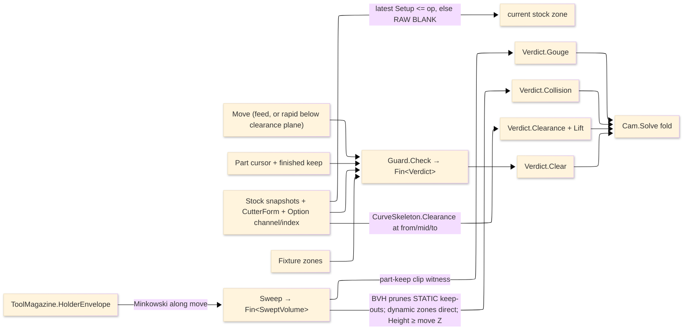

# [RASM_FABRICATION_GUARD]

The guard owner is the design-time per-move safety gate inside the Cam fold, and it fails CLOSED: every geometric leg of the verdict — the Minkowski sweep, the holder union, the keep-out clip — rides the `Fin` rail, so a failed algebra operation is a typed safety fault, never a substituted envelope that lets `Verdict.Clear` derive from broken geometry. `Check` sweeps the cutter radius from owner#atoms `CutterForm`, sweeps the magazine-owned `HolderEnvelope` along the same segment, reads the current input-carried `StockSnapshot` by setup with the RAW BLANK as the conservative fallback, prunes the static keep-outs through the kernel BVH when an index is mounted, gates rapids that dip below the clearance plane, and returns the typed `Verdict` that commits, faults, or substitutes a full-lift retract. `Verify/removal` remains the verify-time truth owner; guard owns only the design-time floor before a move commits.

Wire posture: HOST-LOCAL. `Verdict` and lifted `Move` rows cross only the in-process seam to `Toolpath/motion#CAM_MOTION` and then to posting through owner-side `Motion`.

## [01]-[INDEX]

- [01]-[GUARD]: owns `Part` per-move context, `Stock` current-snapshot context, `HolderSweep` policy rows, `SweptVolume`, `Verdict`, and `Guard.Check`/`Sweep`/`Lift`.

## [02]-[GUARD]

- Owner: `Part` carries the committed cursor and finished part-keep loops; `Stock` carries raw blank fallback, static stock keep-outs, setup snapshots, `CutterForm`, optional `ToolAssembly`, the optional kernel `CurveSkeleton` channel, the optional kernel `SpatialIndex` over the static keep-outs, and `GuardPolicy`; `HolderSweep` is the holder-envelope policy vocabulary; `SweptVolume` carries the cutter-plus-holder swept polygon set; `Verdict` carries the four safety outcomes; `Guard` owns the one per-move safety fold.
- Cases: `Verdict.Clear` commits the move, `Verdict.Gouge(Point3d)` faults a finished-surface cut, `Verdict.Collision(ExclusionZone)` faults stock or fixture impact, and `Verdict.Clearance(Seq<Move>)` substitutes the full-lift retract. `HolderSweep` rows `swept` (holder Minkowski-swept along the move beside the cutter) and `omitted` (cutter-only, for holders proven clear by setup planning). Part-keep and stock/fixture keep-out geometry stay distinct so the typed cause survives the fold.
- Entry: `public static Fin<Verdict> Check(Move move, Part part, Stock stock, Fixture fixture)` is the ruled guard entry — the `Fin` failure side carries the geometric-algebra fault when the safety computation itself cannot complete. `public static Fin<SweptVolume> Sweep(Move move, Point3d cursor, CutterForm cutter, Option<ToolAssembly> assembly, GuardPolicy policy)` projects the cutter-plus-holder envelope. `public static Seq<Move> Lift(Move blocked, Point3d cursor, GuardPolicy policy)` emits the last-resort full-lift row.
- In-seams: `Toolpath/motion#CAM_MOTION` supplies the committed cursor and folds `Check` per move; `Fixturing/setups` supplies the operation-scoped `Fixture` and per-op collision context.
- Out-seams: kernel `CurveSkeleton.Clearance(Point3d)` supplies channel half-width; `Tooling/magazine#TOOL_MAGAZINE` supplies `HolderEnvelope`; `Geometry2D/algebra#POLYGON_ALGEBRA` supplies `Minkowski.Sum`/`Offset`/`Clip`; `Fixturing/workholding#WORKHOLDING` supplies `ExclusionZone`/`Fixture.Zones`; kernel `Spatial.Apply(SpatialOp.Query(index, SpatialQuery.Range(...)))` supplies the BVH broad-phase; owner#atoms supplies `CutterForm`, `Move`, `Loop`, `StockSnapshot`.
- Auto: `Check` gates rapids — a rapid whose endpoints both sit at or above `GuardPolicy.ClearancePlane` is `Clear` by the clearance-plane contract, a rapid dipping below it takes the full obstacle test like a feed move. `Stock.Current(setup)` selects the latest snapshot with `Setup <= setup`; when none qualifies the fallback is `RawBlank` — the conservative MORE-material state — never a later-setup snapshot that under-guards. The obstacle test is two-phase: the mounted `SpatialIndex` (built over `Keepouts` extents in declaration order, so hit ids ARE `Keepouts` ordinals) prunes the static set, while the dynamic zones — the current stock zone and `fixture.Zones` — always test directly, so no id space ever aliases. A zone whose `Height` sits below the move's lowest Z is skipped — the Z-aware predicate. Channel clearance probes at cursor, midpoint, and target so a mid-segment pinch is caught; a radius overflow returns `Clearance(Lift(...))`, never a second distance transform. `Cam.Solve` folds `Gouge`/`Collision` into typed `FabricationFault` arms, substitutes `Clearance` retracts, and commits `Clear`.
- Receipt: `Verdict` is the safety receipt. `Gouge` carries a violated-surface point taken from the actual clip intersection, `Collision` the obstacle `ExclusionZone`, `Clearance` the retract trajectory, `Clear` the no-op success; the `Fin` failure side carries the algebra fault with its locus.
- Packages: RhinoCommon `Point3d`/`BoundingBox`; LanguageExt `Seq<T>`/`Option<T>`/`Fin<T>`; Thinktecture `[Union]`/`[SmartEnum<string>]`; `Rasm.Meshing` `CurveSkeleton.Clearance`; `Rasm.Spatial` (`Spatial.Apply`, `SpatialOp.Query`, `SpatialQuery.Range`, `SpatialAnswer.Result`, `QueryResult.Hits`); Clipper2 through `PolygonAlgebra`; owner#atoms `CutterForm`/`Move`/`Loop`/`StockSnapshot`; magazine `ToolAssembly`/`ToolMagazine.HolderEnvelope`; workholding `Fixture`/`ExclusionZone`.
- Growth: a 5-axis tilt envelope is one orientation column on `Sweep`; a new holder posture is one `HolderSweep` row; a near-miss warning tier is one `Verdict` case breaking every fold at compile time; a skim or obstacle-routed retract lands in `Toolpath/link#LINK`, not here; a new stock state is one `StockSnapshot` projection row.
- Boundary: guard is the only design-time swept-envelope safety owner. Kernel clearance replaces the retired straight-skeleton lookup; magazine owns holder projection; algebra owns Minkowski/clip; workholding owns fixture zones; the kernel BVH owns broad-phase pruning of the STATIC set only. A fail-open geometry fallback (`IfFail` substituting a plausible envelope), a local collision kernel, a local holder footprint, a BVH id space spanning dynamically composed zones, a raw-blank read when a qualifying snapshot exists, a future-setup snapshot fallback, and a guard-side retract router are the deleted forms.

```csharp signature
// --- [RUNTIME_PRELUDE] --------------------------------------------------------------------
using LanguageExt;
using Rasm.Fabrication.Fixturing;
using Rasm.Fabrication.Geometry2D;
using Rasm.Fabrication.Process;
using Rasm.Fabrication.Tooling;
using Rasm.Meshing;
using Rasm.Spatial;
using Rhino.Geometry;
using Thinktecture;
using static LanguageExt.Prelude;

namespace Rasm.Fabrication.Toolpath;

// --- [TYPES] ------------------------------------------------------------------------------
[SmartEnum<string>]
public sealed partial class HolderSweep {
    public static readonly HolderSweep Swept = new("swept");
    public static readonly HolderSweep Omitted = new("omitted");
}

// --- [MODELS] -----------------------------------------------------------------------------
public readonly record struct GuardPolicy(double ClearancePlane, double GougeTolerance, HolderSweep Holder, int DiscSegments) {
    public static readonly GuardPolicy Default = new(ClearancePlane: 25.0, GougeTolerance: 0.01, HolderSweep.Swept, DiscSegments: 24);
}

public sealed record Part(Point3d Cursor, Seq<Loop> Keep);

public sealed record Stock(
    Seq<Loop> RawBlank,
    Seq<ExclusionZone> Keepouts,
    Seq<StockSnapshot> Snapshots,
    CutterForm Cutter,
    Option<ToolAssembly> Assembly,
    Option<CurveSkeleton> Channel,
    Option<SpatialIndex> Index,
    GuardPolicy Policy) {
    public double Radius => Cutter.Diameter * 0.5;

    // Conservative selection: the latest snapshot at or before this setup, else the RAW BLANK — a
    // later-setup snapshot models LESS material than is present and under-guards.
    public Seq<Loop> Current(int setup) =>
        Snapshots.Filter(snapshot => snapshot.Setup <= setup)
            .OrderByDescending(static snapshot => snapshot.Setup)
            .HeadOrNone()
            .Map(static snapshot => snapshot.Machined.ToSeq())
            .IfNone(RawBlank);

    public ExclusionZone CurrentZone(Fixture fixture) =>
        new(Operation: fixture.Operation, Kind: WorkholdingKind.SacrificialBed, Keepouts: Current(fixture.Operation), Height: double.MaxValue);

    public Seq<ExclusionZone> Dynamic(Fixture fixture) => CurrentZone(fixture).Cons(fixture.Zones);
}

public sealed record SweptVolume(Seq<Loop> Envelope) {
    public BoundingBox Bound =>
        Envelope.Map(static loop => loop.Bound()).Fold(BoundingBox.Empty, BoundingBox.Union);
}

[Union(ConversionFromValue = ConversionOperatorsGeneration.None)]
public abstract partial record Verdict {
    private Verdict() { }

    public sealed record Clear : Verdict;
    public sealed record Gouge(Point3d Surface) : Verdict;
    public sealed record Collision(ExclusionZone Obstacle) : Verdict;
    public sealed record Clearance(Seq<Move> Retract) : Verdict;
}

// --- [OPERATIONS] -------------------------------------------------------------------------
public static class Guard {
    public static Fin<SweptVolume> Sweep(Move move, Point3d cursor, CutterForm cutter, Option<ToolAssembly> assembly, GuardPolicy policy) =>
        from stadium in PolygonAlgebra.Minkowski.Sum(Segment(cursor, move.To), Disc(cutter.Diameter * 0.5, Math.Max(8, policy.DiscSegments)))
        from holder in policy.Holder == HolderSweep.Swept
            ? assembly.Map(row => PolygonAlgebra.Minkowski.Sum(Segment(cursor, move.To), ToolMagazine.HolderEnvelope(row)))
                .IfNone(Fin.Succ(Seq<Loop>()))
            : Fin.Succ(Seq<Loop>())
        from envelope in holder.IsEmpty
            ? Fin.Succ(stadium)
            : PolygonAlgebra.Clip(stadium, holder, ClipOp.Union)
        select new SweptVolume(envelope);

    public static Fin<Verdict> Check(Move move, Part part, Stock stock, Fixture fixture) =>
        move.Rapid && Math.Min(part.Cursor.Z, move.To.Z) >= stock.Policy.ClearancePlane
            ? Fin.Succ<Verdict>(new Verdict.Clear())
            : from swept in Sweep(move, part.Cursor, stock.Cutter, stock.Assembly, stock.Policy)
              from gouged in Gouged(swept, part.Keep, stock.Policy.GougeTolerance)
              from struck in gouged.IsSome ? Fin.Succ(Option<ExclusionZone>.None) : Struck(move, part.Cursor, swept, stock, fixture)
              select gouged.Match(
                  Some: surface => (Verdict)new Verdict.Gouge(surface),
                  None: () => struck.Match(
                      Some: zone => (Verdict)new Verdict.Collision(zone),
                      None: () => Pinched(move, part.Cursor, stock)
                          ? new Verdict.Clearance(Lift(move, part.Cursor, stock.Policy))
                          : new Verdict.Clear()));

    public static Seq<Move> Lift(Move blocked, Point3d cursor, GuardPolicy policy) =>
        Seq(new Move(cursor with { Z = policy.ClearancePlane }, Rapid: true, Feed: 0.0),
            new Move(new Point3d(blocked.To.X, blocked.To.Y, policy.ClearancePlane), Rapid: true, Feed: 0.0),
            new Move(blocked.To, Rapid: true, Feed: 0.0));

    // Gouge witness: the vertex probe answers fast; the clip fallback reports a point ON the actual
    // intersection region, never an arbitrary part corner.
    static Fin<Option<Point3d>> Gouged(SweptVolume swept, Seq<Loop> partKeep, double tolerance) =>
        (tolerance <= 0.0
            ? Fin.Succ(swept.Envelope)
            : PolygonAlgebra.Offset(swept.Envelope, -Math.Abs(tolerance), OffsetEnds.Polygon))
        .Bind(envelope =>
            partKeep.Bind(static loop => toSeq(loop.Vertices))
                .Find(point => envelope.Exists(loop => loop.Covers(point)))
                .Match(
                    Some: point => Fin.Succ(Optional(point)),
                    None: () => partKeep.Fold(
                        Fin.Succ(Option<Point3d>.None),
                        (state, loop) => state.Bind(found => found.IsSome
                            ? Fin.Succ(found)
                            : PolygonAlgebra.Clip(envelope, Seq(loop), ClipOp.Intersect)
                                .Map(static cut => cut.HeadOrNone().Map(static overlap => overlap.At(0)))))));

    // Two-phase obstacle test: the mounted BVH prunes the STATIC keep-outs (hit ids are Keepouts
    // ordinals by the index construction law); dynamic zones always test directly — no id aliasing.
    static Fin<Option<ExclusionZone>> Struck(Move move, Point3d cursor, SweptVolume swept, Stock stock, Fixture fixture) =>
        StaticCandidates(swept, stock).Bind(candidates =>
            candidates.Concat(stock.Dynamic(fixture))
                .Filter(zone => zone.Height >= Math.Min(cursor.Z, move.To.Z))
                .Fold(
                    Fin.Succ(Option<ExclusionZone>.None),
                    (state, zone) => state.Bind(found => found.IsSome ? Fin.Succ(found) : Overlaps(swept, zone))));

    static Fin<Seq<ExclusionZone>> StaticCandidates(SweptVolume swept, Stock stock) =>
        stock.Index.Match(
            None: () => Fin.Succ(stock.Keepouts),
            Some: index => Spatial.Apply(new SpatialOp.Query(index, new SpatialQuery.Range(swept.Bound, None)))
                .Map(answer => answer switch {
                    SpatialAnswer.Result { Value: QueryResult.Hits hits } => hits.Ids.Map(id => stock.Keepouts[id]),
                    _ => stock.Keepouts,
                }));

    static Fin<Option<ExclusionZone>> Overlaps(SweptVolume swept, ExclusionZone zone) =>
        zone.Keepouts.Fold(
            Fin.Succ(false),
            (state, keepout) => state.Bind(hit => hit
                ? Fin.Succ(true)
                : PolygonAlgebra.Clip(swept.Envelope, Seq(keepout), ClipOp.Intersect).Map(static cut => !cut.IsEmpty)))
        .Map(hit => hit ? Optional(zone) : None);

    // Channel pinch probes cursor, midpoint, and target — a mid-segment narrowing is caught, and an
    // unmounted channel field skips the gate rather than faking a clearance.
    static bool Pinched(Move move, Point3d cursor, Stock stock) =>
        stock.Channel.Map(channel =>
            Seq(cursor, cursor + 0.5 * (move.To - cursor), move.To)
                .Exists(point => channel.Clearance(point).Radius < stock.Radius))
            .IfNone(false);

    static Loop Segment(Point3d a, Point3d b) => new(Arr(a, b), Closed: false);

    static Loop Disc(double radius, int segments) =>
        new Loop(toArr(Enumerable.Range(0, segments).Select(i => {
            double t = 2.0 * Math.PI * i / segments;
            return new Point3d(radius * Math.Cos(t), radius * Math.Sin(t), 0.0);
        })), Closed: true).AsCcw();
}
```


