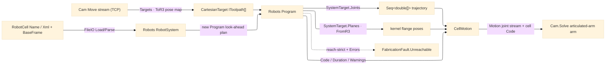

# [RASM_FABRICATION_ROBOT_CELL]

The articulated-robot-cell owner: `RobotProgram` the static surface that drives a serial-chain `Move` stream through the admitted `Robots` (visose) cell — loading the named/embedded cell, mapping each TCP `Move` to a `CartesianTarget` waypoint, compiling the toolpath through the look-ahead-planned `Robots` `Program`, and folding the planner's reach/limit/singularity diagnostics into the typed band-2500 `FabricationFault`. This supersedes the hand-rolled DH forward-kinematics matrix product and the damped-least-squares Jacobian IK the page formerly sketched: `Robots` owns per-mechanism DH/Modified-DH FK, closed-form analytic IK with `RobotConfigurations` branch selection, joint-limit/singularity/reach validation, and the per-`Manufacturers` post-processor — a re-derived solver is the deleted form. The `articulated-arm` `Process/family#PROCESS_FAMILY` `KinematicClass` machines (the ABB/KUKA/UR/Staubli/Franka/Doosan/Fanuc/Igus/Jaka cells) take this owner; the `cartesian-gantry`/`rotary-spindle` machines need no IK — their `Toolpath/motion#CAM_MOTION` `Move` stream IS the machine coordinate set the `Posting/program#CUT_PROGRAM` G-code emitter renders, so this owner is reached ONLY when `FabricationInput.Cell` is present.

The public `Robots` solve is the `Program` compiler: `new Program(name, robotSystem, toolpaths)` solves every waypoint, runs the jerk/accel-limited look-ahead motion planner (threading the previous-pose continuation internally so the joint trajectory stays continuous across waypoints), validates the chain, and posts the per-`Manufacturers` dialect, exposing the planned per-waypoint `SystemTarget.Joints`/`SystemTarget.Planes`, the `Errors`/`Warnings` diagnostic streams, the planned `Duration`, and the `Code` line set. There is NO typed solve exception — feasibility, joint-limit, singularity, and reach faults populate `Program.Errors`, so the owner folds a non-empty `Errors` into `FabricationFault.Unreachable` rather than catching. The analytic-vs-numerical and spherical-vs-offset-wrist solver SELECTION is made internally by the concrete cell `FileIO` loads; the public lever is the cell choice plus the `RobotConfigurations` branch hint on the `CartesianTarget`, never a solver-class instantiation — every analytic/numerical/external-axis/group kinematics class is `internal` and a design page cannot name one.

Wire posture: HOST-LOCAL. The joint-angle trajectory and the posted cell `Code` cross only the in-process seam to the `Toolpath/motion#CAM_MOTION` `Motion` result and onward to a downstream controller writer — never a browser or peer wire. The `RobotCell`/`CellPolicy`/`CellMotion` records are host-local types that never sit between wire and rail.

Geometry boundary: the whole `Robots` API geometry vocabulary is `Rhino3dm`'s `Rhino.Geometry.*` (`Plane`/`Point3d`/`Vector3d`/`Mesh`/`Transform`), a SEPARATE assembly and namespace from the kernel's RhinoCommon `Rhino.Geometry.*` — the two are binary-distinct types. The owner is the ONE seam that boundary-maps: an `extern alias` disambiguates the `Rhino3dm` assembly (`R3`), the kernel-canonical TCP pose converts to an `R3.Plane` on the way in and the planned `Joints` (plain `double[]`, no geometry) and flange `Planes` map back on the way out, and a RhinoCommon geometry instance is NEVER passed into a `Robots` parameter nor a `Robots`/`Rhino3dm` geometry instance escaped into a sibling RhinoCommon signature.

## [01]-[INDEX]

- [01]-[ROBOT_CELL]: owns the `RobotCell`/`CellPolicy` descriptors, the `RobotProgram` fold loading the `Robots` cell and compiling the `Move` stream through the look-ahead-planned `Program`, the RhinoCommon↔Rhino3dm pose boundary-map, and the `CellMotion` joint-trajectory-plus-posted-code receipt the `Toolpath/motion#CAM_MOTION` `Cam.Solve` consumes; the `Robots` `Program.Errors` fold into `FabricationFault.Unreachable`.

## [02]-[ROBOT_CELL]

- Owner: `RobotCell` the loaded-cell descriptor every robot-cell solve reads — the library `Name` (the visose cell roster key `FileIO.LoadRobotSystem` resolves) OR the embedded `Xml` (the `FileIO.ParseRobotSystem` no-library-lookup path), the kernel-canonical `BaseFrame` cell-base pose, and the kernel-canonical `ToolFrame` TCP definition (the tool-axis orientation each `Move` position composes into a full `CartesianTarget` frame) — all RhinoCommon `Plane`/`string` types, no `Robots`/`Rhino3dm` type on the descriptor so the `Process/owner#FABRICATION_OWNER` `FabricationInput` carries it boundary-free; `CellPolicy` the solve/post knobs (the `Program` `StepSize` interpolation step, the `LoadMeshes` headless-solve toggle, the `RobotConfigurations` IK-branch hint disambiguating the lefty/righty × up/down × flip multi-solution arm, the `Motions` interpolation kind a feed `Move` requests, and the reach-strict flag selecting whether a non-empty `Program.Errors` routes a fault or threads onto the receipt) composing the `Robots` `RobotConfigurations`/`Motions` package vocabularies directly, never a re-minted in-folder mirror; `CellMotion` the per-cell solve receipt (the per-waypoint `Seq<double[]>` joint trajectory, the flange/TCP kernel `Plane`s mapped back from `Rhino3dm`, the planned cycle `Duration`, the posted dialect `Code` line set, the `Warnings` stream, and the reached flag); `RobotProgram` the static surface owning `Solve` (the `Move`-stream-to-`CellMotion` fold), `Load` (the `FileIO` cell ingress), `Targets` (the `Move`-to-`CartesianTarget` waypoint map), and the `ToR3`/`FromR3` pose boundary-map.
- Cases: the cell ingress is one `RobotCell.Xml.Match` arm pair — a `Some` embedded XML routes `FileIO.ParseRobotSystem`, a `None` named cell routes `FileIO.LoadRobotSystem` against the visose library — and the waypoint kind is one `Move.Rapid` discriminant selecting `Motions.Joint` (a rapid reposition, PTP joint-space) from the `CellPolicy.Motion` feed interpolation (`Linear` Cartesian by default), never a parallel rapid/feed target family; the solver branch is the cell's internal analytic/numerical selection plus the `RobotConfigurations` hint, never a named solver class.
- Entry: `public static Fin<CellMotion> Solve(RobotCell cell, Seq<Move> moves, CellPolicy policy)` — the ONE robot-cell solve the `Toolpath/motion#CAM_MOTION` `Cam.Solve` calls for an `articulated-arm` machine; `Fin<T>` routes `GeometryFault.DegenerateInput` when the cell fails to load (an unknown library name, an unparseable embedded XML — the `FileIO` throw lowered ONCE at the load boundary) and `FabricationFault.Unreachable` when a reach-strict `CellPolicy` reads a non-empty `Robots` `Program.Errors` (unreachable target / out-of-limit joint / singularity), each lowered with `.ToError()`; the body loads the cell, maps the `Move` stream to the `CartesianTarget` toolpath, compiles the `Program`, and reads the planned `SystemTarget` trajectory plus the posted `Code`.
- Auto: `Solve` binds `Load` then `Compile`. `Load` runs the `FileIO` ingress under `Try` — `cell.Xml.Match(Some: xml => FileIO.ParseRobotSystem(xml, ToR3(cell.BaseFrame)), None: () => FileIO.LoadRobotSystem(cell.Name, ToR3(cell.BaseFrame), loadMeshes: policy.LoadMeshes))` — lowering the unrecoverable load throw to `GeometryFault.DegenerateInput` so the cell construction never escapes the boundary, the `BaseFrame` boundary-mapped to an `R3.Plane` on the way in. `Targets` maps each `Move` to a `CartesianTarget(ToR3(ToolAt(cell.ToolFrame, m.To)), policy.Configuration, m.Rapid ? Motions.Joint : policy.Motion)` — the TCP goal is the cell `ToolFrame` orientation seated at the move position (so a position-only `Move` becomes a full IK-driving pose), the `RobotConfigurations` hint pinned per policy, the `Motions` kind discriminated by the rapid/feed flag — the waypoint stream typed as `IReadOnlyList<IToolpath>` since `Target : IToolpath`. `Compile` constructs `new Program("rasm", system, toolpaths, stepSize: policy.StepSize)` — the ctor runs the look-ahead motion planner over the toolpath, solving every waypoint's FK/IK, timing the trajectory, and posting the `Manufacturers` dialect — then reads `program.Targets` (the `IReadOnlyList<SystemTarget>` the planner produced) projecting each `SystemTarget.Joints` (the flattened per-group joint vector) into the `Seq<double[]>` trajectory and each `SystemTarget.Planes` back through `FromR3` into the kernel flange poses, the `program.Duration` planned cycle time, the flattened `program.Code` posted line set, and the `program.Warnings`; a reach-strict `policy` with a non-empty `program.Errors` routes `FabricationFault.Unreachable`, a permissive policy threads the `Warnings`/`Errors` count onto the receipt unfailed. The previous-pose continuation that keeps the joint trajectory continuous across waypoints (the wrist-flip / redundant-axis disambiguation) is the `Program` planner's internal job — the owner never hand-threads a `prevJoints` seed.
- Receipt: the `CellMotion` IS the typed kinematics evidence — the `Seq<double[]>` joint trajectory, the flange/TCP kernel poses, the planned `Duration`, the posted dialect `Code`, and the `Warnings` the `Toolpath/motion#CAM_MOTION` `Motion` result threads onward; no generic kinematics ledger, the trajectory and the posted program the typed `Robots`-sourced evidence, the `Code` the robot dialect (RAPID/KRL/URScript/VAL3/…) distinct from the `Posting/program#CUT_PROGRAM` CNC G-code the gantry/lathe machines render.
- Packages: `Robots` (visose; the `FileIO.LoadRobotSystem`/`ParseRobotSystem` cell ingress, the `CartesianTarget`/`JointTarget`/`Target : IToolpath` waypoint vocabulary, the `Motions`/`RobotConfigurations` enums, the `new Program(name, robotSystem, toolpaths, stepSize)` look-ahead compiler, the `Program.Targets`/`Errors`/`Warnings`/`Code`/`Duration`/`Save`, the `SystemTarget.Joints`/`Planes`, and the `KinematicSolution.Joints`/`Planes`/`Errors`/`Configuration` per-waypoint receipt — the SOLE host-neutral serial-chain robot-kinematics owner, the `.api/api-robots.md` catalogue, this folder its admitter; the analytic/numerical/external-axis/group solver classes are `internal` and never named), `Rhino3dm` (the `Robots` geometry substrate, `extern alias`-disambiguated as `R3` and reached ONLY through the `ToR3`/`FromR3` pose map), `Rasm`/Vectors (`Plane`/`Point3d`/`Vector3d` — the kernel RhinoCommon vocabulary, composed), `Rasm.Numerics` (the band-2400 `GeometryFault` — composed for the load failure), LanguageExt.Core (`Fin`/`Seq`/`Option`/`Try` — the rail and the load-boundary convert), BCL inbox.
- Growth: a multi-mechanism cell with an external track/positioner axis is the `Robots` `MechanicalGroup` the loaded cell already coordinates — the external-axis values ride the `Target.External` column on the `CartesianTarget` waypoint, zero new owner surface; a custom controller dialect is a custom `IPostProcessor` passed to `FileIO.LoadRobotSystem`/`ParseRobotSystem`, the dialect-override seam, never a posting-local emitter; a live upload is the `Robots` `IRemote.Upload(IProgram)` channel the loaded cell exposes (the `SSH.NET` transitive-floor SFTP path on the UR/Franka remotes), one `Solve` follow-on arm; a 5-axis tilt strategy is one orientation column on `ToolAt` feeding the `CartesianTarget` frame; zero new surface.
- Boundary: `RobotProgram` is the ONE robot-cell kinematics owner and a hand-rolled DH forward-kinematics matrix product or a damped-least-squares Jacobian IK solver is the DELETED form this owner supersedes — `Robots` owns the FK/IK, the joint-limit/singularity/reach validation, the look-ahead plan, and the per-`Manufacturers` post, and a re-derived solver beside it is the rejected reinvention the `Process/family#PROCESS_FAMILY` roster forbids; the public solve is the `Program` compiler and an `internal` solver-class instantiation (`SphericalWristKinematics`/`OffsetWristKinematics`/`NumericalKinematics`/`TrackKinematics`/`PositionerKinematics`/`MechanicalGroupKinematics`/`CustomKinematics`) named as a type is the rejected form — the public lever is the cell choice plus the `RobotConfigurations` branch hint, never a solver instance; the reach contract is the `Robots` `Program.Errors` stream folded to `FabricationFault.Unreachable` and an exception caught over the diagnostic strings is the named defect — the no-exception channel is the typed-fault source, the `Solve` rail total over every cell; the geometry seam is the ONE `ToR3`/`FromR3` boundary-map and a RhinoCommon `Rhino.Geometry` instance passed into a `Robots`/`Rhino3dm` parameter (the namespaces are binary-distinct) or a `Rhino3dm` `Plane` escaping `Solve` into a sibling RhinoCommon signature is the seam violation — the joint `double[]` carries no geometry and crosses freely, the pose maps at the one edge; collision is NOT this owner — the `Robots` `Program.CheckCollisions`/`Collision` surface throws `NotSupportedException` on the `Rhino3dm` build the folder targets, so the swept tool-plus-holder guard is the `Toolpath/guard#GUARD` owner's concern, never a cell-level collision call here; the posted cell `Code` is the `Robots` robot dialect and the `Posting/program#CUT_PROGRAM` CNC G-code emitter is the DISJOINT gantry/lathe owner — a robot cell never routes its trajectory through the G-code AST, an `articulated-arm` `Motion` carrying its `CellMotion.Code` and a `cartesian-gantry` `Motion` carrying the `Move` stream the G-code `Emit` renders, the two emitters one-per-machine-class meeting at the `FabricationResult.Motion` receipt; the cell descriptor carries only kernel types and a `Robots`/`Rhino3dm` type on `RobotCell` or `CellMotion` crossing into the `FabricationInput`/`FabricationResult` is the seam violation — the `Robots` types live only inside the `Solve` body.

```csharp signature
extern alias R3;
// --- [RUNTIME_PRELUDE] --------------------------------------------------------------------
using LanguageExt;
using LanguageExt.Common;
using Rasm.Fabrication.Process;
using Rasm.Numerics;
using Rhino.Geometry;                              // RhinoCommon — the kernel geometry vocabulary
using Robots;                                       // the visose cell + look-ahead-planned program owner
using static LanguageExt.Prelude;

namespace Rasm.Fabrication.Kinematics;

// --- [MODELS] -----------------------------------------------------------------------------
// The loaded-cell descriptor the FabricationInput carries: Name selects a visose library cell,
// Xml the embedded-cell parse; BaseFrame/ToolFrame are KERNEL (RhinoCommon) poses, no Robots type.
public readonly record struct RobotCell(string Name, Option<string> Xml, Plane BaseFrame, Plane ToolFrame);

public sealed record CellPolicy(double StepSize, bool LoadMeshes, RobotConfigurations Configuration, Motions Motion, bool ReachStrict) {
    public static readonly CellPolicy Canonical = new(StepSize: 1.0, LoadMeshes: false, RobotConfigurations.None, Motions.Linear, ReachStrict: false);
}

public sealed record CellMotion(Seq<double[]> Joints, Seq<Plane> Flanges, double Duration, Seq<string> Code, Seq<string> Warnings, bool Reached);

// --- [OPERATIONS] -------------------------------------------------------------------------
public static class RobotProgram {
    public static Fin<CellMotion> Solve(RobotCell cell, Seq<Move> moves, CellPolicy policy) =>
        Load(cell, policy).Bind(system => Compile(system, cell, moves, policy));

    // The Robots cell ingress: an embedded XML parses with no library lookup, a name resolves the
    // visose roster; the unrecoverable FileIO throw lowers ONCE here to a kernel degenerate-input.
    static Fin<RobotSystem> Load(RobotCell cell, CellPolicy policy) =>
        Try(() => cell.Xml.Match(
                Some: xml => FileIO.ParseRobotSystem(xml, ToR3(cell.BaseFrame)),
                None: () => FileIO.LoadRobotSystem(cell.Name, ToR3(cell.BaseFrame), loadMeshes: policy.LoadMeshes)))
            .Match(Succ: Fin.Succ,
                   Fail: e => Fin.Fail<RobotSystem>(GeometryFault.DegenerateInput($"robot-cell:load:{cell.Name}:{e.Message}").ToError()));

    // new Program(...) runs the look-ahead motion planner over the toolpath — solving every waypoint's
    // FK/IK, timing the trajectory, threading the previous-pose continuation internally, and posting
    // the Manufacturers dialect; a non-empty Errors under a reach-strict policy is the Unreachable fault.
    static Fin<CellMotion> Compile(RobotSystem system, RobotCell cell, Seq<Move> moves, CellPolicy policy) {
        var program = new Program("rasm", system, Targets(cell, moves, policy), stepSize: policy.StepSize);
        Seq<string> errors = toSeq(program.Errors);
        return policy.ReachStrict && !errors.IsEmpty
            ? Fin.Fail<CellMotion>(FabricationFault.Unreachable($"robot-cell:{cell.Name}:{errors.Head}").ToError())
            : Fin.Succ(new CellMotion(
                Joints:   toSeq(program.Targets).Map(static t => t.Joints),
                Flanges:  toSeq(program.Targets).Bind(static t => toSeq(t.Planes).Map(FromR3)),
                Duration: program.Duration,
                Code:     toSeq(program.Code ?? []).Bind(toSeq).Bind(toSeq),
                Warnings: toSeq(program.Warnings),
                Reached:  errors.IsEmpty));
    }

    // Each feed Move is a CartesianTarget (TCP pose -> inverse kinematics); the orientation is the
    // cell tool-down frame seated at the move position, a rapid taking the Joint PTP interpolation.
    static IReadOnlyList<IToolpath> Targets(RobotCell cell, Seq<Move> moves, CellPolicy policy) =>
        moves.Map(m => (IToolpath)new CartesianTarget(
            ToR3(new Plane(m.To, cell.ToolFrame.XAxis, cell.ToolFrame.YAxis)),
            policy.Configuration,
            m.Rapid ? Motions.Joint : policy.Motion)).ToArray();

    // --- [BOUNDARIES] — the ONE RhinoCommon <-> Rhino3dm pose seam -------------------------
    static R3::Rhino.Geometry.Plane ToR3(Plane p) =>
        new(new R3::Rhino.Geometry.Point3d(p.Origin.X, p.Origin.Y, p.Origin.Z),
            new R3::Rhino.Geometry.Vector3d(p.XAxis.X, p.XAxis.Y, p.XAxis.Z),
            new R3::Rhino.Geometry.Vector3d(p.YAxis.X, p.YAxis.Y, p.YAxis.Z));

    static Plane FromR3(R3::Rhino.Geometry.Plane p) =>
        new(new Point3d(p.Origin.X, p.Origin.Y, p.Origin.Z),
            new Vector3d(p.XAxis.X, p.XAxis.Y, p.XAxis.Z),
            new Vector3d(p.YAxis.X, p.YAxis.Y, p.YAxis.Z));
}
```



## [03]-[RESEARCH]

- [PROGRAM_PLANNER] The `Robots` `Program` ctor IS the toolpath compiler: it runs the `ProgramMotionPlanner` look-ahead over the `IReadOnlyList<IToolpath>` waypoint stream, solving every `CartesianTarget` (TCP `Plane` → inverse kinematics) and `JointTarget` (joints → forward kinematics) waypoint into a planned `SystemTarget`, timing the jerk/accel-limited trajectory, and posting the per-`Manufacturers` dialect. The consumer reads the planned `SystemTarget.Joints` (the per-group joint vector, radians) and `SystemTarget.Planes` (the chain + flange + TCP frames) off `program.Targets`, the planned cycle `program.Duration`, and the posted `program.Code` (the `List<List<List<string>>>` per-group/per-file/per-line dialect output) flattened to the receipt — never a per-waypoint solver loop the consumer hand-threads, the planner owning the previous-pose continuation that resolves the wrist-flip / redundant-axis multiplicity across the waypoint stream. The `RobotConfigurations` flag (`Shoulder`/`Elbow`/`Wrist` OR-combinable branch posture) is the sole public IK-branch lever pinned on the `CartesianTarget`; the analytic-vs-numerical and spherical-vs-offset-wrist solver selection is the concrete cell's internal decision, made when `FileIO` loads the cell from the library, never a solver class the page names.
- [GEOMETRY_BOUNDARY] The `Robots` geometry substrate is `Rhino3dm` 8.17.0 — a managed binding shipping a real `runtimes/osx-arm64/native/librhino3dm_native.dylib` whose `Rhino.Geometry.*` (`Plane`/`Point3d`/`Vector3d`/`Mesh`/`Transform`) is a binary-distinct assembly and namespace from the kernel's RhinoCommon `Rhino.Geometry.*`. The `extern alias R3` disambiguates the `Rhino3dm` reference, and the `ToR3`/`FromR3` pose map is the ONE place a kernel `Plane` crosses into the `Robots` API and a planned flange `Plane` crosses back; the joint `double[]` carries no geometry and passes through unchanged. The collision surface is firewalled out: the `Robots` `Collision` type (and the `Program.CheckCollisions` that produces it) throws `NotSupportedException("Collisions are not available when Robots is built against rhino3dm")` on every member access under this build, so the swept tool-plus-holder collision guard is wholly the `Toolpath/guard#GUARD` owner's concern over the `Polygon/clipper#POLYGON_ALGEBRA` Minkowski substrate, never a cell-level `CheckCollisions` call — the one verified-unavailable member the design routes around rather than around which the design pretends.
