# [RASM_FABRICATION_LINK]

The rapid-travel owner: `Link.Route` orders the committed cut set and mints every non-cutting move between cuts. Endpoint cost is directed because each `CutElement` has a fixed entry and exit, and every hop prices through the SAME retract resolver that later emits it — the directed cheapest insertion, the bounded directed 2-opt improvement, the input-order baseline, and the receipt all pay one obstacle-aware metric, so a short straight hop that demands a long lift or routed escape orders by its true cost, and a blocked pair prices unreachable so ordering steers around what emission rejects. An undirected MST over symmetrized costs cannot carry an approximation bound for this problem: the cheaper reverse hop can weight the tree while the emitted order pays the expensive forward hop. Between consecutive elements, `direct`, `skim`, `full-lift`, and `routed` resolve from typed keep-out height rows. `Skim` uses the minimum blocker-clearing Z when the required rise stays within `MaxSkimRise`; `full-lift` uses the declared clearance plane for taller bounded fixtures; any unbounded blocker routes A* over its visibility corners. Kernel query failure remains on the `Fin` rail, and an unreachable visibility graph routes `LinkBlocked` 2733.

The broad phase builds the kernel BVH once. Every corridor query returns `Fin<Seq<int>>`; only a genuine `SpatialAnswer.Result` proceeds to `PolygonAlgebra.ClipOpen`, and unexpected answers fail typed instead of becoming a clear verdict. `KeepoutRule` aligns each input keep-out with `TopZ` and `Unbounded`, so Z admission is data rather than a global ceiling fiction. `Home` is a REQUIRED route endpoint — the one initial cursor this fold and the committing fold share: `Seed` emits and accounts the home-to-first-element retract through the resolver before the first committed feed chain, so no origin-to-entry travel exists outside the receipt.

Wire posture: HOST-LOCAL. The linked `Move` stream and the `LinkReceipt` cross only the in-process seam back to the `Cam` fold and forward to `Verify/simulate.md` time accounting — never a browser or peer wire.

## [01]-[INDEX]

- [01]-[LINK]: owns the `RetractKind` axis, the `CutElement`/`LinkPolicy`/`LinkReceipt`/`Linked` models, and the ONE `Link.Route` fold — resolver-priced directed cheapest insertion plus bounded directed 2-opt, per-pair retract selection over the kernel BVH and `ClipOpen` clearance probes, and A* obstacle escape — the single owner of every non-cutting move between committed cuts, home leg included.

## [02]-[LINK]

- Owner: `RetractKind` is the four-row retract axis; `KeepoutRule` carries index, top Z, and unbounded posture; `CutElement` is the fixed-entry/fixed-exit tour unit; `LinkPolicy` carries clearance, skim-rise, inflation, direct-Z, tour-improvement, keep-out, and home policy; `LinkReceipt` carries rapid distance, baseline, retract census, and routed escapes; `Linked` carries moves plus receipt; `Link` owns `Route`.
- Cases: the `RetractKind` rows 4 — `direct` (feed-height straight traverse; corridor BVH-pruned and `ClipOpen`-clear against every keep-out, ΔZ within `DirectTolerance`) · `skim` (hop at the maximum blocking `TopZ` plus `SkimMargin`; admitted when every blocker is bounded and the rise stays within `MaxSkimRise`) · `full-lift` (clearance-plane up-over-down for taller bounded fixtures) · `routed` (A* corner-graph path at the clearance plane over unbounded blockers) — resolved in that order per consecutive pair, the first admitted row winning; the tour itself is one directed order, never a per-strategy family.
- Entry: `public static Fin<Linked> Route(Seq<CutElement> elements, FabricationInput input, LinkPolicy policy)` is the one linking fold. Empty input folds to the empty `Linked` identity; the body inflates keep-outs once, builds the kernel BVH once, prices the directed hop matrix through the retract resolver, inserts every fixed-entry element under that resolver cost, performs at most `TourPasses` directed 2-opt sweeps, emits the home-to-first retract, and resolves every subsequent `exit → rapid path → entry` seam. Invalid element or keep-out rows route `GeometryFault.DegenerateInput`; corner-inflation and spatial-query failures propagate typed; an unreachable A* visibility graph prices unreachable during ordering and routes `FabricationFault.LinkBlocked(from, to)` 2733 at emission.
- Auto: `Route` validates every element and keep-out row, builds one clearance field, prices every directed pair plus the home legs through the resolver once, performs directed insertion and 2-opt under the policy pass bound, emits the home seed, and folds each pair through the retract resolver. A* remains QuikGraph-owned; tour construction does not claim an inapplicable metric bound.
- Receipt: `LinkReceipt` carries `RapidLengthMm`, `NaiveRapidLengthMm` (the input-order baseline under the same resolver metric, home leg included), the per-`RetractKind` count map, and `RoutedEscapes` — the typed routing evidence `Verify/simulate` time-integrates and `Verify/estimation` prices; no generic tour ledger.
- Packages: QuikGraph (`AdjacencyGraph`/`SEdge`/`ShortestPathsAStar` for the visibility escape), kernel `Spatial/index` (`Spatial.Apply` + `SpatialOp.Build`/`Query` + `SpatialQuery.Range` + `QueryResult.Hits` + `SpatialKind.Bvh` + `BuildPolicy.Canonical`), `Geometry2D/algebra.md` (`Offset` corner inflation and `ClipOpen` corridor narrow phase), `Process/owner.md` (`Move`/`Edge3`/`FabricationInput`), `Toolpath/guard.md` (swept-motion verdicts), Thinktecture.Runtime.Extensions, LanguageExt.Core, BCL inbox.
- Growth: a new retract row is one `RetractKind` row + one resolver arm (a feed-rate-limited controlled descent, a helical drop); a tour objective beyond rapid length (pierce-weighted, thermal-dwell-weighted) is one edge-weight policy column on `LinkPolicy`; per-keep-out ceilings (replacing the one policy ceiling) are one height column on the keep-out row when fixturing lands it; zero new entrypoints.
- Boundary: Link is the ONE routing owner. A symmetrized-undirected tour over fixed directed endpoints, a Euclidean ordering surrogate beside obstacle-priced emission, a bool-returning spatial probe, a home point used only as a root hint, a raster escape, or a blind rapid is the deleted form. Guard owns swept-motion safety; Link owns route selection over guard-compatible clearance evidence.

```csharp signature
// --- [RUNTIME_PRELUDE] ------------------------------------------------------------------------------------------------------------------------------
using LanguageExt;
using LanguageExt.Common;
using QuikGraph;
using QuikGraph.Algorithms;
using Rasm.Fabrication.Geometry2D;
using Rasm.Fabrication.Process;
using Rasm.Numerics;
using Rasm.Spatial;
using Rhino.Geometry;
using Thinktecture;
using static LanguageExt.Prelude;

namespace Rasm.Fabrication.Toolpath;

// --- [TYPES] ----------------------------------------------------------------------------------------------------------------------------------------
[SmartEnum<string>]
public sealed partial class RetractKind {
    public static readonly RetractKind Direct = new("direct");
    public static readonly RetractKind Skim = new("skim");
    public static readonly RetractKind FullLift = new("full-lift");
    public static readonly RetractKind Routed = new("routed");
}

// --- [MODELS] ---------------------------------------------------------------------------------------------------------------------------------------
// Unbounded names the keep-out indices rising past the clearance plane (clamp towers, tombstones) — the set
// the routed escape navigates; every other keep-out is cleared by the plane law.
public readonly record struct KeepoutRule(int Index, double TopZ, bool Unbounded);

// Home is a REQUIRED route endpoint — the one initial cursor Link and the committing fold share, so no
// origin-to-entry travel exists outside the retract resolver. The default is the workholding free-fixture
// cursor datum; the composing fold passes the admitted fixture's initial cursor.
public sealed record LinkPolicy(
    double ClearancePlane, double MaxSkimRise, double SkimMargin, double CornerMargin, double DirectTolerance,
    int TourPasses, Arr<KeepoutRule> Keepouts, Point3d Home) {
    public static readonly LinkPolicy Default =
        new(ClearancePlane: 25.0, MaxSkimRise: 5.0, SkimMargin: 2.0, CornerMargin: 1.0,
            DirectTolerance: 0.5, TourPasses: 4, Keepouts: Arr<KeepoutRule>.Empty, Home: Point3d.Origin);
}

// One tour unit: a fused chain (common-line / chain-cut / bridged group) is ONE element — one pierce, one entry, one exit.
public sealed record CutElement(Point3d Entry, Point3d Exit, Seq<Move> Feed) {
    public static Fin<CutElement> Of(Seq<Move> feed) =>
        feed.IsEmpty
            ? Fin.Fail<CutElement>(GeometryFault.DegenerateInput("link:empty-element").ToError())
            : Fin.Succ(new CutElement(Target(feed.Head), Target(feed.Last), feed));

    static Point3d Target(Move move) => move.Switch(
        rapid: static row => row.Target,
        linear: static row => row.Target,
        circular: static row => row.Target);
}

public sealed record LinkReceipt(double RapidLengthMm, double NaiveRapidLengthMm, Map<RetractKind, int> Retracts, int RoutedEscapes);

public sealed record Linked(Seq<Move> Moves, LinkReceipt Receipt);

// Route-local clearance field: inflated keep-outs, their boxes, and the kernel BVH — built ONCE per Route.
internal sealed record RouteField(Seq<Loop> Inflated, BoundingBox[] Bounds, Option<SpatialIndex> Index, LinkPolicy Policy);

// --- [OPERATIONS] -----------------------------------------------------------------------------------------------------------------------------------
public static class Link {
    // Directed insertion and bounded 2-opt precede per-pair retract selection and the A* escape.
    public static Fin<Linked> Route(Seq<CutElement> elements, FabricationInput input, LinkPolicy policy) =>
        elements.IsEmpty ? Fin.Succ(new Linked(Seq<Move>(), new LinkReceipt(0.0, 0.0, Map<RetractKind, int>(), 0)))
        : elements.Find(e => e.Feed.IsEmpty || !e.Entry.IsValid || !e.Exit.IsValid
                || e.Feed.Exists(static move => !Target(move).IsValid)
                || e.Entry.DistanceTo(Target(e.Feed.Head)) > 1e-9
                || e.Exit.DistanceTo(Target(e.Feed.Last)) > 1e-9).IsSome
            ? Fin.Fail<Linked>(GeometryFault.DegenerateInput("link:invalid-element").ToError())
            : !double.IsFinite(policy.ClearancePlane) || !double.IsFinite(policy.MaxSkimRise)
                || !double.IsFinite(policy.SkimMargin) || !double.IsFinite(policy.CornerMargin)
                || !double.IsFinite(policy.DirectTolerance) || policy.ClearancePlane <= 0.0
                || policy.MaxSkimRise < 0.0 || policy.SkimMargin < 0.0 || policy.CornerMargin <= 0.0
                || policy.DirectTolerance < 0.0 || policy.TourPasses < 0
                || !policy.Home.IsValid
                ? Fin.Fail<Linked>(GeometryFault.DegenerateInput("link:policy").ToError())
                : policy.Keepouts.Count != input.Keepouts.Count
                    || toSeq(policy.Keepouts).Map((rule, index) => rule.Index == index).Exists(static aligned => !aligned)
                    || policy.Keepouts.Exists(rule => !double.IsFinite(rule.TopZ)
                        || !rule.Unbounded && rule.TopZ >= policy.ClearancePlane)
                    ? Fin.Fail<Linked>(GeometryFault.DegenerateInput("link:keepout-height-policy").ToError())
                    : Field(input, policy).Bind(field => Costs(elements, field).Bind(costs => {
                        Seq<int> order = Tour(costs, policy);
                        return Seed(order, elements, field, costs).Bind(seed => Fold(order.Tail, elements, field, seed));
                    }));

    // The clearance field: corner-inflated keep-outs (failure propagates — never uninflated fallback) and the
    // kernel BVH over their boxes, built through the ONE Spatial.Apply entry.
    static Fin<RouteField> Field(FabricationInput input, LinkPolicy policy) =>
        input.Keepouts.IsEmpty
            ? Fin.Succ(new RouteField(Seq<Loop>(), [], Option<SpatialIndex>.None, policy))
            : toSeq(input.Keepouts).TraverseM(loop =>
                OffsetPolicy.Admit(OffsetJoin.Round, OffsetEnd.Polygon, miterLimit: 2.0, loop.Tolerance.Absolute.Value)
                    .Bind(offsetPolicy => PolygonAlgebra.Offset(Seq(loop), policy.CornerMargin, offsetPolicy))
                    .Bind(rows => rows.Count == 1
                        ? Fin.Succ(rows.Head)
                        : Fin.Fail<Loop>(GeometryFault.DegenerateInput($"link:keepout-offset-topology:{rows.Count}").ToError())))
                .As().Bind(inflated => {
                BoundingBox[] bounds = [.. inflated.Map(static loop => Planar(loop.Bound()))];
                return Spatial.Apply(new SpatialOp.Build(SpatialKind.Bvh, bounds, BuildPolicy.Canonical)).Bind(answer =>
                    answer is SpatialAnswer.Index built
                        ? Fin.Succ(new RouteField(inflated, bounds, Some(built.Value), policy))
                        : Fin.Fail<RouteField>(GeometryFault.DegenerateInput("link:spatial-build-answer").ToError()));
            });

    // The ONE directed rapid cost: the same resolver that emits the moves prices every hop, so tour ordering,
    // the input-order baseline, and the receipt share one metric — lift and routed-escape costs shape the order.
    // A blocked pair prices +∞ so ordering steers around it; emission stays the typed enforcement.
    sealed record TourCosts(double[][] Hops, double[] FromHome);

    static Fin<TourCosts> Costs(Seq<CutElement> elements, RouteField field) =>
        toSeq(Enumerable.Range(0, elements.Count)).TraverseM(i =>
                toSeq(Enumerable.Range(0, elements.Count)).TraverseM(j => i == j
                        ? Fin.Succ(0.0)
                        : HopCost(elements[i].Exit, elements[j].Entry, field))
                    .As().Map(static row => row.ToArray()))
            .As()
            .Bind(rows => toSeq(Enumerable.Range(0, elements.Count))
                .TraverseM(j => HopCost(field.Policy.Home, elements[j].Entry, field))
                .As().Map(home => new TourCosts([.. rows], [.. home])));

    static Fin<double> HopCost(Point3d from, Point3d to, RouteField field) =>
        RapidPath(from, to, field).Map(static path => path.Map(static hop => hop.Length).IfNone(double.PositiveInfinity));

    // Fixed entry/exit endpoints make hop costs directed. Cheapest insertion followed by bounded directed
    // 2-opt preserves that fact over the resolver-priced matrix; no symmetric metric bound is claimed.
    static Seq<int> Tour(TourCosts costs, LinkPolicy policy) {
        int count = costs.FromHome.Length;
        int start = toSeq(Enumerable.Range(0, count)).OrderBy(i => costs.FromHome[i]).Head;
        Seq<int> inserted = Insert(costs, Seq(start), toSet(Enumerable.Range(0, count).Where(i => i != start)));
        return Enumerable.Range(0, Math.Max(policy.TourPasses, 0)).Fold(inserted, (order, _) => Improve(costs, order));
    }

    static Seq<int> Insert(TourCosts costs, Seq<int> order, Set<int> remaining) =>
        remaining.IsEmpty ? order : (from node in remaining
                                      from position in toSeq(Enumerable.Range(1, order.Count))
                                      let before = order[position - 1]
                                      let after = position < order.Count ? Some(order[position]) : Option<int>.None
                                      let delta = costs.Hops[before][node] + after.Map(a => costs.Hops[node][a] - costs.Hops[before][a]).IfNone(0.0)
                                      orderby delta
                                      select (node, position)).HeadOrNone().Map(best =>
                                          Insert(costs, order.Take(best.position).Concat(Seq(best.node)).Concat(order.Skip(best.position)).ToSeq(), remaining.Remove(best.node)))
            .IfNone(order);

    static Seq<int> Improve(TourCosts costs, Seq<int> order) =>
        (from i in toSeq(Enumerable.Range(1, Math.Max(order.Count - 2, 0)))
         from j in toSeq(Enumerable.Range(i + 1, order.Count - i - 1))
         let candidate = order.Take(i).Concat(order.Skip(i).Take(j - i + 1).Rev()).Concat(order.Skip(j + 1)).ToSeq()
         let gain = Cost(costs, order) - Cost(costs, candidate)
         where gain > 1e-9
         orderby gain descending
         select candidate).HeadOrNone().IfNone(order);

    // The ordering objective includes the home leg — the same law Seed pays and Naive judges input order under.
    static double Cost(TourCosts costs, Seq<int> order) =>
        costs.FromHome[order.Head]
        + order.Tail.Fold((At: order.Head, Cost: 0.0), (state, next) => (next, state.Cost + costs.Hops[state.At][next])).Cost;

    static double Naive(TourCosts costs) =>
        costs.FromHome.Length == 0
            ? 0.0
            : costs.FromHome[0] + toSeq(Enumerable.Range(0, costs.FromHome.Length - 1)).Fold(0.0, (sum, i) => sum + costs.Hops[i][i + 1]);

    static Fin<(Seq<Move> Moves, LinkReceipt Receipt, int At)> Seed(Seq<int> order, Seq<CutElement> elements, RouteField field, TourCosts costs) =>
        Retract(field.Policy.Home, elements[order.Head].Entry, field).Map(hop =>
            (hop.Moves + elements[order.Head].Feed,
             new LinkReceipt(hop.Length, Naive(costs), Map((hop.Kind, 1)), hop.Kind == RetractKind.Routed ? 1 : 0),
             order.Head));

    static Fin<Linked> Fold(Seq<int> remaining, Seq<CutElement> elements, RouteField field, (Seq<Move> Moves, LinkReceipt Receipt, int At) seed) =>
        remaining.Fold(
            Fin.Succ(seed),
            (acc, next) => acc.Bind(s => Retract(elements[s.At].Exit, elements[next].Entry, field).Map(hop =>
                (s.Moves + hop.Moves + elements[next].Feed,
                 new LinkReceipt(s.Receipt.RapidLengthMm + hop.Length, s.Receipt.NaiveRapidLengthMm,
                                 s.Receipt.Retracts.AddOrUpdate(hop.Kind, static n => n + 1, 1),
                                 s.Receipt.RoutedEscapes + (hop.Kind == RetractKind.Routed ? 1 : 0)),
                 next))))
            .Map(static s => new Linked(s.Moves, s.Receipt));

    // Direct preserves endpoint Z; bounded blockers choose minimum skim or clearance-plane full lift; unbounded
    // blockers route around at clearance. Every spatial answer remains typed; None means no admissible path —
    // the pricing lane reads it as +∞ while the emission lane lifts it into LinkBlocked 2733.
    static Fin<Option<(Seq<Move> Moves, double Length, RetractKind Kind)>> RapidPath(Point3d from, Point3d to, RouteField field) =>
        Blockers(field, from, to, Math.Max(from.Z, to.Z)).Bind(blocked =>
            blocked.IsEmpty && Math.Abs(from.Z - to.Z) <= field.Policy.DirectTolerance
                ? Fin.Succ(Some((Seq<Move>(new Move.Rapid(to)), from.DistanceTo(to), RetractKind.Direct)))
                : blocked.Exists(id => Rule(field, id).Unbounded)
                    ? Escape(from, to, field).Map(path => path.Map(moves => (moves, PathLength(from, moves), RetractKind.Routed)))
                    : Fin.Succ(Some(Lifted(from, to, field, blocked))));

    static Fin<(Seq<Move> Moves, double Length, RetractKind Kind)> Retract(Point3d from, Point3d to, RouteField field) =>
        RapidPath(from, to, field).Bind(path => path.ToFin(FabricationFault.LinkBlocked(from, to).ToError()));

    static (Seq<Move> Moves, double Length, RetractKind Kind) Lifted(Point3d from, Point3d to, RouteField field, Seq<int> blockers) {
        double floor = Math.Max(from.Z, to.Z);
        double skim = blockers.Map(id => Rule(field, id).TopZ).Fold(floor, Math.Max) + field.Policy.SkimMargin;
        bool isSkim = skim - floor <= field.Policy.MaxSkimRise && skim <= field.Policy.ClearancePlane;
        return Hopped(from, to, isSkim ? skim : field.Policy.ClearancePlane, isSkim ? RetractKind.Skim : RetractKind.FullLift);
    }

    static KeepoutRule Rule(RouteField field, int id) => field.Policy.Keepouts[id];

    // The ONE clearance kernel: BVH Range prune over the corridor AABB, then the ClipOpen centerline narrow
    // phase against the pruned, subset-filtered inflated loops — an empty Inside census IS the clear verdict.
    static Fin<Seq<int>> Blockers(RouteField field, Point3d from, Point3d to, double atZ) =>
        field.Index.Match(
            None: () => Fin.Succ(Seq<int>()),
            Some: index => Spatial.Apply(new SpatialOp.Query(index, new SpatialQuery.Range(
                    Planar(new BoundingBox(Seq(from, to).ToArray())), Option<Sphere>.None)))
                .Bind(answer => answer is SpatialAnswer.Result { Value: QueryResult.Hits hits }
                    ? hits.Ids.TraverseM(id => PolygonAlgebra.ClipOpen(Seq1(new Edge3(from, to)), Seq(field.Inflated[id]), PolygonFill.NonZero)
                            .Map(clipped => (Rule(field, id).Unbounded || Rule(field, id).TopZ >= atZ) && !clipped.Inside.IsEmpty
                                ? Some(id) : Option<int>.None))
                        .As()
                        .Map(static rows => rows.Bind(static row => row.ToSeq()))
                    : Fin.Fail<Seq<int>>(GeometryFault.DegenerateInput("link:spatial-query-answer").ToError())));

    static BoundingBox Planar(BoundingBox box) =>
        new(new Point3d(box.Min.X, box.Min.Y, 0.0), new Point3d(box.Max.X, box.Max.Y, 0.0));

    // A* over the visibility graph of inflated UNBOUNDED keep-out corners plus the endpoints, edges admitted
    // where the corridor clears the unbounded subset; the path rides the clearance plane.
    static Fin<Option<Seq<Move>>> Escape(Point3d from, Point3d to, RouteField field) {
        Point3d liftedFrom = new(from.X, from.Y, field.Policy.ClearancePlane);
        Point3d liftedTo = new(to.X, to.Y, field.Policy.ClearancePlane);
        Seq<Point3d> corners = toSeq(Enumerable.Range(0, field.Inflated.Count))
            .Filter(id => Rule(field, id).Unbounded)
            .Bind(id => toSeq(field.Inflated[id].Vertices)
                .Map(point => new Point3d(point.X, point.Y, field.Policy.ClearancePlane)));
        Seq<Point3d> verts = liftedFrom.Cons(liftedTo.Cons(corners));
        Seq<(int From, int To)> pairs = from i in toSeq(Enumerable.Range(0, verts.Count))
                                        from j in toSeq(Enumerable.Range(0, verts.Count))
                                        where i != j
                                        select (i, j);
        return pairs.TraverseM(pair => Blockers(field, verts[pair.From], verts[pair.To], field.Policy.ClearancePlane)
                .Map(blocked => blocked.Exists(id => Rule(field, id).Unbounded)
                    ? Option<SEdge<int>>.None : Some(new SEdge<int>(pair.From, pair.To))))
            .As()
            .Map(edges => {
                AdjacencyGraph<int, SEdge<int>> graph = new();
                graph.AddVertexRange(Enumerable.Range(0, verts.Count));
                graph.AddEdgeRange(edges.Bind(static edge => edge.ToSeq()));
                TryFunc<int, IEnumerable<SEdge<int>>> paths = graph.ShortestPathsAStar(
                    edge => verts[edge.Source].DistanceTo(verts[edge.Target]), vertex => verts[vertex].DistanceTo(liftedTo), 0);
                return paths(1, out IEnumerable<SEdge<int>>? route) && route is not null
                    ? Some(Seq<Move>(new Move.Rapid(liftedFrom))
                        + toSeq(route).Map(edge => (Move)new Move.Rapid(verts[edge.Target]))
                        + Seq<Move>(new Move.Rapid(to)))
                    : Option<Seq<Move>>.None;
            });
    }

    static (Seq<Move> Moves, double Length, RetractKind Kind) Hopped(Point3d from, Point3d to, double z, RetractKind kind) =>
        (Seq<Move>(new Move.Rapid(new Point3d(from.X, from.Y, z)),
             new Move.Rapid(new Point3d(to.X, to.Y, z)),
             new Move.Rapid(to)),
         Math.Abs(z - from.Z) + new Point3d(from.X, from.Y, z).DistanceTo(new Point3d(to.X, to.Y, z)) + Math.Abs(z - to.Z),
         kind);

    static double PathLength(Point3d from, Seq<Move> path) =>
        path.Fold((Length: 0.0, At: from), static (acc, move) => {
            Point3d target = Target(move);
            return (acc.Length + acc.At.DistanceTo(target), target);
        }).Length;

    static Point3d Target(Move move) => move.Switch(
        rapid: static row => row.Target,
        linear: static row => row.Target,
        circular: static row => row.Target);
}
```

```mermaid
---
config:
  theme: base
  look: classic
  layout: elk
  flowchart:
    curve: linear
    padding: 25
  themeVariables:
    darkMode: true
    fontFamily: "SF Mono, Menlo, Cascadia Mono, Segoe UI Mono, Consolas, monospace"
    useGradient: false
    dropShadow: "none"
    background: "#282A36"
    primaryColor: "#44475A"
    primaryTextColor: "#F8F8F2"
    primaryBorderColor: "#BD93F9"
    lineColor: "#FF79C6"
    textColor: "#F8F8F2"
    edgeLabelBackground: "#21222C"
    labelBackgroundColor: "#21222C"
  themeCSS: ".nodeLabel{font-size:13px;font-weight:500}.edgeLabel{font-size:12px;font-weight:500}.cluster-label .nodeLabel{font-size:13.5px;font-weight:700;letter-spacing:.08em}.edge-thickness-normal{stroke-width:2px}.edge-thickness-thick{stroke-width:3px}.edge-pattern-dashed,.edge-pattern-dotted{stroke-width:1.5px;stroke-dasharray:4 6}.node rect,.node circle,.node polygon,.node path,.node .outer-path{stroke-width:1.5px;filter:none!important}.cluster rect{stroke-width:1px!important;stroke-dasharray:5 4!important;filter:none!important}.marker path{transform:scale(.8);transform-origin:5px 5px}.marker circle{transform:scale(.48);transform-origin:5px 5px}.edgeLabel rect{transform-box:fill-box;transform-origin:center;transform:scale(1.1,1.2)}"
---
flowchart LR
    accTitle: Directed rapid-link routing
    accDescr: Link.Route orders fixed-entry cut elements and resolves typed direct, lifted, or obstacle-routed moves.
    Elements["Seq&lt;CutElement&gt; (Cam generators · fused chains as one element)"] --> Route["Link.Route"]
    Route -->|"resolver-priced directed insertion · bounded directed 2-opt"| Tour["fixed-entry visit order"]
    Field["RouteField — Offset inflation + Spatial.Apply BVH build (once)"] --> Resolve
    Tour -->|per consecutive pair| Resolve["retract resolver cheapest-first"]
    Resolve -->|"all clear + ΔZ ≤ tol"| Direct["direct"]
    Resolve -->|"bounded blockers only → ceiling + margin"| Skim["skim"]
    Resolve -->|"bounded blocker rise > skim limit → clearance plane"| FullLift["full-lift"]
    Resolve -->|"A* unbounded corner visibility graph"| Routed["routed"]
    Resolve -.->|no admissible path| Blocked["FabricationFault.LinkBlocked 2733"]
    Kernel["SpatialQuery.Range prune → PolygonAlgebra.ClipOpen centerline"] --> Resolve
    Direct --> Linked["Linked · Moves + LinkReceipt"]
    Skim --> Linked
    FullLift --> Linked
    Routed --> Linked
    Linked -->|time integration| Simulate["Verify/simulate"]
    class Elements,Field data
    class Route,Tour,Resolve primary
    class Direct,Skim,FullLift,Routed,Kernel,Simulate boundary
    class Linked success
    class Blocked error
    classDef primary fill:#44475A,stroke:#FF79C6,color:#F8F8F2
    classDef success fill:#50FA7BBF,stroke:#50FA7B,color:#282A36
    classDef data fill:#FFB86CBF,stroke:#FFB86C,color:#282A36
    classDef boundary fill:#282A36,stroke:#BD93F9,color:#F8F8F2
    classDef error fill:#FF555580,stroke:#FF5555,color:#F8F8F2
```


