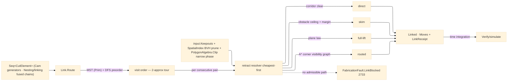

# [RASM_FABRICATION_LINK]

The rapid-travel owner: `Link` the static surface whose ONE `Route` fold orders the committed cut set and mints every non-cutting move between cuts — the tour, the retract selection, and the obstacle-routed escape are ONE concern owned HERE, so no generator ever emits its elements in input order and no sibling ever hand-rolls an up-over-down retract. The tour is the MST/DFS 2-approximation over the element endpoint graph: element exit→entry rapid costs weight a `QuikGraph` undirected graph, `MinimumSpanningTreePrim` extracts the spanning tree, and a `DepthFirstSearchAlgorithm` preorder walk over the tree yields the visit order (the classic ≤2×optimal tour bound — a Held-Karp exact solve on a thousand-hole peck grid is the rejected form, the 2-approx the professional-CAM standard). Between consecutive elements the retract KIND resolves per pair by clearance probes, cheapest first: `direct` (the straight traverse at feed height clears every keep-out — zero lift), `skim` (a short hop at the local obstacle ceiling plus the skim margin), `full-lift` (the clearance-plane up-over-down the plane's above-fixture height clears by construction). A pair whose straight corridor is blocked even at the clearance plane (a keep-out unbounded in Z — a rising clamp tower, a fourth-axis tombstone) routes the A* escape: `ShortestPathsAStar` over the visibility graph of margin-inflated keep-out corners (Euclidean heuristic, admissible; `ShortestPathsDijkstra` the degenerate-heuristic fallback), edges admitted only where the corridor clears the narrow phase; an unreachable goal routes `FabricationFault.LinkBlocked` 2733, never a silent cut-through. Broad-phase pruning reads the kernel `Rasm/Spatial/index#SPATIAL_INDEX` `SpatialIndex` BVH over the keep-out set; narrow-phase corridor tests ride the `Geometry2D/algebra#POLYGON_ALGEBRA` `Clip` intersection exactly as `Toolpath/guard#GUARD` tests swept envelopes — guard stays the per-move SAFETY verdict and Link the ROUTING owner: guard says a move is blocked, Link decides where the tool goes instead.

This page kills two landed defects by ownership transfer: the `Toolpath/motion#CAM_MOTION` peck emission stops walking `input.Profiles` order (the `Cam` fold now folds its generated elements through `Route` before the cell hand-off), and the `Toolpath/guard#GUARD` `Lift` demotes to the `full-lift` ROW of this page's retract axis (guard keeps `Lift` only as the last-resort trajectory its `Clearance` verdict carries when a caller consults `Check` outside the linked fold). `Nesting/linking#CUT_LINKING` chain and common-line groups arrive as pre-fused `CutElement`s — one pierce, one entry, one exit per chain — so the tour never splits a fused chain. The owner composes the `Process/owner#FABRICATION_OWNER` `Move`/`Edge3` vocabulary, computes no hash, and operates on raw coordinate doubles.

Wire posture: HOST-LOCAL. The linked `Move` stream and the `LinkReceipt` cross only the in-process seam back to the `Cam` fold and forward to `Verify/simulate#PROGRAM_SIMULATE` time accounting — never a browser or peer wire.

## [01]-[INDEX]

- [01]-[LINK]: owns the `RetractKind` axis, the `CutElement`/`LinkPolicy`/`LinkReceipt`/`Linked` models, and the ONE `Link.Route` fold — MST/DFS tour, per-pair retract selection, A* obstacle escape — the single owner of every non-cutting move between committed cuts.

## [02]-[LINK]

- Owner: `RetractKind` `[SmartEnum<string>]` (`direct`/`skim`/`full-lift`/`routed`) the retract axis a pair resolves onto cheapest-first; `CutElement` the tour unit (entry point, exit point, committed feed chain — a `Nesting/linking` fused chain is ONE element); `LinkPolicy` the routing knobs (clearance-plane Z, skim margin, corner-inflation margin for the visibility graph, feed-height direct tolerance); `LinkReceipt` the typed routing evidence (rapid length, input-order baseline length, per-kind retract counts, routed-escape count); `Linked` the result pair (ordered `Move` stream + receipt); `Link` the static surface owning `Route`.
- Cases: the `RetractKind` rows 4 — `direct` (straight feed-height traverse, zero lift; admitted when the corridor's swept AABB prunes empty through the BVH and the narrow-phase `Clip` intersection is empty) · `skim` (hop at local-obstacle ceiling + margin; admitted when every pruned keep-out's height column sits below the skim plane) · `full-lift` (clearance-plane up-over-down; admitted by construction of the plane law) · `routed` (A* corner-graph path at the clearance plane; the arm of last resort) — resolved in that order per consecutive pair, the first admitted row winning; the tour itself is ONE shape (MST + DFS preorder), never a per-strategy tour family.
- Entry: `public static Fin<Linked> Route(Seq<CutElement> elements, FabricationInput input, LinkPolicy policy)` — the ONE linking fold: empty input folds to the empty `Linked` identity; the body builds the endpoint graph, extracts the Prim MST, walks the DFS preorder from the element nearest the machine home (or `policy` start), then per consecutive pair resolves the retract row and emits `exit → rapids → entry` between the committed feed chains; keep-outs read `input.Keepouts` plus the profiles' part-keep; an A* escape with no admissible path routes `FabricationFault.LinkBlocked(from, to)` 2733; a degenerate element set (an element with an empty feed chain) routes the kernel `GeometryFault.DegenerateInput`.
- Auto: `Route` internalizes the whole orchestration — the consumer hands elements and gets a linked stream, never builds a graph, an index, or a retract: the endpoint graph weights `exit(i)→entry(j)` Euclidean cost; `MinimumSpanningTreePrim` (the `api-quikgraph.md` weighted-spanning row) extracts the tree; `DepthFirstSearchAlgorithm` over the MST-restricted adjacency records `DiscoverVertex` preorder as the visit order; per pair the retract resolver probes `direct` (BVH `Range` prune over the corridor AABB → narrow-phase `Clip` against pruned zones), then `skim`, then `full-lift`, then `routed` — the A* visibility graph mints vertices from margin-inflated keep-out corners plus the pair endpoints, admits edges whose corridors clear the narrow phase, and calls `ShortestPathsAStar` with the Euclidean goal heuristic (`ShortestPathsDijkstra` when the heuristic degenerates); `Cam.Solve` folds every multi-element strategy (peck point sets, contour ring families, pocket islands) through `Route` before the `Kinematics/cell` hand-off; `Nesting/linking` chains arrive pre-fused so pierce count is already minimal — Link never re-splits a chain.
- Receipt: `LinkReceipt` carries `RapidLengthMm`, `NaiveRapidLengthMm` (the input-order baseline the tour is judged against), the per-`RetractKind` count map, and `RoutedEscapes` — the typed routing evidence `Verify/simulate` time-integrates and `Verify/estimation` prices; no generic tour ledger.
- Packages: QuikGraph (`UndirectedGraph`/`SEdge`, `MinimumSpanningTreePrim`, `DepthFirstSearchAlgorithm`, `ShortestPathsAStar`/`ShortestPathsDijkstra` — the shared-tier `api-quikgraph.md` catalog rows, composed), `Rasm.Spatial` (`SpatialIndex` BVH `Range` broad-phase — composed, never a local structure), Clipper2 (via `Geometry2D/algebra#POLYGON_ALGEBRA` `Clip` — the corridor narrow phase), `Process/owner#FABRICATION_OWNER` (`Move`/`Edge3`/`FabricationInput`), `Toolpath/guard#GUARD` (the clearance-verdict contract — guard verdicts feed the resolver, routing never re-derives safety), Thinktecture.Runtime.Extensions, LanguageExt.Core, BCL inbox.
- Growth: a new retract row is one `RetractKind` row + one resolver arm (a feed-rate-limited controlled descent, a helical drop); a tour objective beyond rapid length (pierce-weighted, thermal-dwell-weighted) is one edge-weight policy column on `LinkPolicy`; a 3D obstacle graph (Z-varying keep-out ceilings) is one height column on the visibility vertex mint; zero new entrypoints.
- Boundary: Link is the ONE routing owner and a generator-local ordering (the dead peck input-order emission), a sibling-local retract (the dead guard up-over-down as a routing policy), or a second tour surface is the deleted form; guard owns per-move SAFETY verdicts and Link owns ROUTING — a Link-side gouge test re-deriving guard's swept envelope is the deleted form, the resolver reads guard's contract; the tour is the MST/DFS 2-approximation and an exact TSP solve or a greedy nearest-neighbor without the tree bound is the rejected form; the broad phase is the kernel `SpatialIndex` and an O(n·m) all-pairs corridor scan is the deleted form; the escape graph mints from keep-out corners and a rasterized grid A* is the rejected form (resolution-bound where the visibility graph is exact); a blocked pair FAILS typed with `LinkBlocked` and a silent straight-line rapid through a keep-out is the named safety defect.

```csharp signature
// --- [RUNTIME_PRELUDE] ------------------------------------------------------------------------------------------------------------------------------
using LanguageExt;
using LanguageExt.Common;
using QuikGraph;
using QuikGraph.Algorithms;
using QuikGraph.Algorithms.Search;
using Rasm.Fabrication.Geometry2D;
using Rasm.Fabrication.Process;
using Rasm.Numerics;
using Rasm.Spatial;
using Rhino.Geometry;
using Thinktecture;
using static LanguageExt.Prelude;

namespace Rasm.Fabrication.Toolpath;

// --- [TYPES] ----------------------------------------------------------------------------------------------------------------------------------------
[SmartEnum<string>]
public sealed partial class RetractKind {
    public static readonly RetractKind Direct = new("direct");
    public static readonly RetractKind Skim = new("skim");
    public static readonly RetractKind FullLift = new("full-lift");
    public static readonly RetractKind Routed = new("routed");
}

// --- [MODELS] ---------------------------------------------------------------------------------------------------------------------------------------
public readonly record struct LinkPolicy(double ClearancePlane, double SkimMargin, double CornerMargin, double DirectTolerance, Option<Point3d> Home) {
    public static readonly LinkPolicy Default = new(ClearancePlane: 25.0, SkimMargin: 2.0, CornerMargin: 1.0, DirectTolerance: 0.5, Home: default);
}

// One tour unit: a Nesting/linking fused chain (common-line / chain-cut / bridged group) is ONE element — one pierce, one entry, one exit.
public sealed record CutElement(Point3d Entry, Point3d Exit, Seq<Move> Feed) {
    public static CutElement Of(Seq<Move> feed) => new(feed.Head.To, feed.Last.To, feed);
}

public sealed record LinkReceipt(double RapidLengthMm, double NaiveRapidLengthMm, Map<RetractKind, int> Retracts, int RoutedEscapes);

public sealed record Linked(Seq<Move> Moves, LinkReceipt Receipt);

// --- [OPERATIONS] -----------------------------------------------------------------------------------------------------------------------------------
public static class Link {
    // The ONE linking fold: tour (MST + DFS preorder), then per-pair retract resolution cheapest-first,
    // then the A* corner-graph escape; a pair with no admissible route fails typed — never a blind rapid.
    public static Fin<Linked> Route(Seq<CutElement> elements, FabricationInput input, LinkPolicy policy) =>
        elements.IsEmpty ? Fin.Succ(new Linked(Seq<Move>(), new LinkReceipt(0.0, 0.0, default, 0)))
        : elements.Find(static e => e.Feed.IsEmpty).IsSome
            ? Fin.Fail<Linked>(GeometryFault.DegenerateInput("link:empty-element").ToError())
            : Tour(elements, policy).Fold(elements, input, policy);

    // MST over the exit->entry endpoint graph, DFS preorder as the visit order — the 2-approx tour. The MST edge set
    // expands BOTH directions into an AdjacencyGraph so the cataloged DepthFirstSearchAlgorithm (an IVertexListGraph
    // event fold) walks the undirected tree; DiscoverVertex fires once per vertex, so the fold IS the preorder.
    static Seq<int> Tour(Seq<CutElement> elements, LinkPolicy policy) {
        UndirectedGraph<int, SEdge<int>> graph = new();
        graph.AddVertexRange(Enumerable.Range(0, elements.Count));
        graph.AddEdgeRange(from i in Enumerable.Range(0, elements.Count)
                           from j in Enumerable.Range(i + 1, elements.Count - i - 1)
                           select new SEdge<int>(i, j));
        double W(SEdge<int> e) => elements[e.Source].Exit.DistanceTo(elements[e.Target].Entry);
        AdjacencyGraph<int, SEdge<int>> tree = new();
        tree.AddVertexRange(Enumerable.Range(0, elements.Count));
        tree.AddEdgeRange(graph.MinimumSpanningTreePrim(W).SelectMany(static e => new[] { e, new SEdge<int>(e.Target, e.Source) }));
        int start = policy.Home.Match(
            Some: h => Enumerable.Range(0, elements.Count).OrderBy(i => elements[i].Entry.DistanceTo(h)).First(),
            None: () => 0);
        Seq<int> order = Seq<int>();
        DepthFirstSearchAlgorithm<int, SEdge<int>> dfs = new(tree);
        dfs.DiscoverVertex += v => order = order.Add(v);
        dfs.Compute(start);
        return order;
    }

    // Retract resolution per consecutive pair: direct -> skim -> full-lift -> routed; broad phase is the
    // kernel SpatialIndex BVH over input.Keepouts, narrow phase the PolygonAlgebra.Clip corridor test.
    static Fin<Linked> Fold(this Seq<int> order, Seq<CutElement> elements, FabricationInput input, LinkPolicy policy) =>
        order.Tail.Fold(
            Fin.Succ((Moves: elements[order.Head].Feed, Receipt: new LinkReceipt(0.0, Naive(elements), default, 0), At: order.Head)),
            (acc, next) => acc.Bind(s => Retract(elements[s.At].Exit, elements[next].Entry, input, policy).Map(hop =>
                (s.Moves + hop.Moves + elements[next].Feed,
                 new LinkReceipt(s.Receipt.RapidLengthMm + hop.Length, s.Receipt.NaiveRapidLengthMm,
                                 s.Receipt.Retracts.AddOrUpdate(hop.Kind, static n => n + 1, 1),
                                 s.Receipt.RoutedEscapes + (hop.Kind == RetractKind.Routed ? 1 : 0)),
                 next))))
            .Map(s => new Linked(s.Moves, s.Receipt));

    // direct: the feed-height corridor clears the pruned keep-outs. skim: local obstacle ceiling + margin.
    // full-lift: the clearance plane clears by construction. routed: ShortestPathsAStar over the margin-
    // inflated keep-out corner visibility graph (ShortestPathsDijkstra on a degenerate heuristic); an
    // unreachable goal routes LinkBlocked 2733.
    static Fin<(Seq<Move> Moves, double Length, RetractKind Kind)> Retract(Point3d from, Point3d to, FabricationInput input, LinkPolicy policy) =>
        CorridorClear(from, to, input) ? Fin.Succ((Seq(new Move(to, Rapid: true, Feed: 0.0)), from.DistanceTo(to), RetractKind.Direct))
        : SkimPlane(from, to, input, policy).Match(
            Some: z => Fin.Succ((Hop(from, to, z), HopLength(from, to, z), RetractKind.Skim)),
            None: () => PlaneClear(from, to, input, policy)
                ? Fin.Succ((Hop(from, to, policy.ClearancePlane), HopLength(from, to, policy.ClearancePlane), RetractKind.FullLift))
                : Escape(from, to, input, policy).Match(
                    Some: path => Fin.Succ((path, path.Fold((0.0, from), (a, m) => (a.Item1 + a.Item2.DistanceTo(m.To), m.To)).Item1, RetractKind.Routed)),
                    None: () => Fin.Fail<(Seq<Move>, double, RetractKind)>(FabricationFault.LinkBlocked(from, to).ToError())));

    static Option<Seq<Move>> Escape(Point3d from, Point3d to, FabricationInput input, LinkPolicy policy) {
        Seq<Point3d> corners = toSeq(input.Keepouts).Bind(k => toSeq(
            PolygonAlgebra.Offset(Seq(k), policy.CornerMargin, OffsetEnds.Polygon).IfFail(Seq(k)).Bind(l => toSeq(l.Vertices))));
        Seq<Point3d> verts = from.Cons(to.Cons(corners));
        var graph = new AdjacencyGraph<int, SEdge<int>>();
        graph.AddVertexRange(Enumerable.Range(0, verts.Count));
        graph.AddEdgeRange(from i in Enumerable.Range(0, verts.Count)
                           from j in Enumerable.Range(0, verts.Count)
                           where i != j && CorridorClear(verts[i], verts[j], input)
                           select new SEdge<int>(i, j));
        var paths = graph.ShortestPathsAStar(e => verts[e.Source].DistanceTo(verts[e.Target]), v => verts[v].DistanceTo(to), 0);
        return paths(1, out IEnumerable<SEdge<int>>? edges)
            ? Some(toSeq(edges!).Map(e => new Move(verts[e.Target] with { Z = policy.ClearancePlane }, Rapid: true, Feed: 0.0)))
            : None;
    }

    static Seq<Move> Hop(Point3d from, Point3d to, double z) =>
        Seq(new Move(from with { Z = z }, Rapid: true, Feed: 0.0),
            new Move(new Point3d(to.X, to.Y, z), Rapid: true, Feed: 0.0),
            new Move(to, Rapid: true, Feed: 0.0));

    static double HopLength(Point3d from, Point3d to, double z) =>
        (z - from.Z) + new Point3d(from.X, from.Y, z).DistanceTo(new Point3d(to.X, to.Y, z)) + (z - to.Z);

    static double Naive(Seq<CutElement> elements) =>
        elements.Tail.Fold((0.0, elements.Head.Exit), (a, e) => (a.Item1 + a.Item2.DistanceTo(e.Entry), e.Exit)).Item1;
}
```


