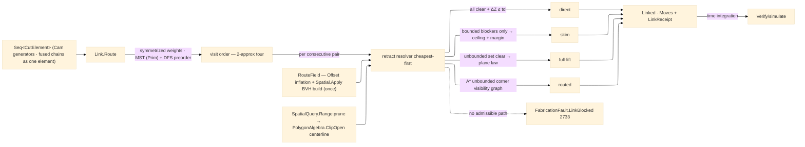

# [RASM_FABRICATION_LINK]

The rapid-travel owner: `Link` the static surface whose ONE `Route` fold orders the committed cut set and mints every non-cutting move between cuts — the tour, the retract selection, and the obstacle-routed escape are ONE concern owned HERE, so no generator ever emits its elements in input order and no sibling ever hand-rolls an up-over-down retract. The tour is the MST/DFS 2-approximation over the element endpoint graph: element hop costs — SYMMETRIZED as the cheaper of the two directed exit→entry rapids, the metric the undirected tree demands — weight a `QuikGraph` undirected graph, `MinimumSpanningTreePrim` extracts the spanning tree, and a `DepthFirstSearchAlgorithm` preorder walk over the tree yields the visit order (the classic ≤2×optimal tour bound — a Held-Karp exact solve on a thousand-hole peck grid is the rejected form, the 2-approx the professional-CAM standard). Between consecutive elements the retract KIND resolves per pair by clearance probes, cheapest first: `direct` (the feed-height straight traverse — XY corridor clear against every keep-out and the endpoint ΔZ inside the policy's direct tolerance), `skim` (a hop at the declared keep-out ceiling plus the skim margin — admitted when only Z-BOUNDED keep-outs block the feed-height corridor), `full-lift` (the clearance-plane up-over-down the plane's above-fixture height clears by construction). A pair whose corridor is blocked even at the clearance plane — a keep-out the policy declares Z-UNBOUNDED, the rising clamp tower or fourth-axis tombstone — routes the A* escape: `ShortestPathsAStar` over the visibility graph of margin-inflated unbounded-keep-out corners (Euclidean heuristic, admissible), edges admitted only where the corridor clears the narrow phase; an unreachable goal routes `FabricationFault.LinkBlocked` 2733, never a silent cut-through.

The clearance probes are REAL composed seams, not named stubs: the broad phase builds the kernel BVH ONCE per route — `Spatial.Apply(SpatialOp.Build(SpatialKind.Bvh, inflatedBounds, BuildPolicy.Canonical))` over the margin-inflated keep-out boxes — and prunes each corridor through `SpatialOp.Query(index, SpatialQuery.Range(corridorBox, None))`; the narrow phase tests the corridor centerline as one `Edge3` through `PolygonAlgebra.ClipOpen` against the pruned inflated loops — an empty `Inside` census IS the clear verdict, exactly the open-subject clip `Toolpath/guard#GUARD` composes for swept envelopes. Guard stays the per-move SAFETY verdict and Link the ROUTING owner: guard says a move is blocked, Link decides where the tool goes instead — the guard `Lift` demotes to the `full-lift` ROW of this page's retract axis (guard keeps `Lift` only as the last-resort trajectory its `Clearance` verdict carries when a caller consults `Check` outside the linked fold). The `Cam` fold folds its generated elements through `Route` before the cell hand-off, retiring the peck input-order emission; a `Nesting/linking` fused chain — one pierce, one entry, one exit — enters as ONE `CutElement` minted by the composing consumer at the plan boundary, so the tour never splits a fused chain. The owner composes the `Process/owner#FABRICATION_OWNER` `Move`/`Edge3` vocabulary, computes no hash, and operates on raw coordinate doubles.

Wire posture: HOST-LOCAL. The linked `Move` stream and the `LinkReceipt` cross only the in-process seam back to the `Cam` fold and forward to `Verify/simulate#PROGRAM_SIMULATE` time accounting — never a browser or peer wire.

## [01]-[INDEX]

- [01]-[LINK]: owns the `RetractKind` axis, the `CutElement`/`LinkPolicy`/`LinkReceipt`/`Linked` models, and the ONE `Link.Route` fold — MST/DFS tour, per-pair retract selection over the kernel-BVH + `ClipOpen` clearance probes, A* obstacle escape — the single owner of every non-cutting move between committed cuts.

## [02]-[LINK]

- Owner: `RetractKind` `[SmartEnum<string>]` (`direct`/`skim`/`full-lift`/`routed`) the retract axis a pair resolves onto cheapest-first; `CutElement` the tour unit (entry point, exit point, committed feed chain — a fused chain is ONE element); `LinkPolicy` the routing knobs (clearance-plane Z, keep-out ceiling Z, skim margin, corner-inflation margin, feed-height direct ΔZ tolerance, the Z-unbounded keep-out index set, optional home); `LinkReceipt` the typed routing evidence (rapid length, input-order baseline length, per-kind retract counts, routed-escape count); `Linked` the result pair (ordered `Move` stream + receipt); `Link` the static surface owning `Route`.
- Cases: the `RetractKind` rows 4 — `direct` (feed-height straight traverse; corridor BVH-pruned and `ClipOpen`-clear against every keep-out, ΔZ within `DirectTolerance`) · `skim` (hop at `KeepoutCeiling + SkimMargin`; admitted when the feed-height blockers are all Z-bounded) · `full-lift` (clearance-plane up-over-down; admitted when the unbounded set leaves the corridor clear — the plane clears bounded keep-outs by construction) · `routed` (A* corner-graph path at the clearance plane over the unbounded set; the arm of last resort) — resolved in that order per consecutive pair, the first admitted row winning; the tour itself is ONE shape (MST + DFS preorder), never a per-strategy tour family.
- Entry: `public static Fin<Linked> Route(Seq<CutElement> elements, FabricationInput input, LinkPolicy policy)` — the ONE linking fold: empty input folds to the empty `Linked` identity; the body inflates the keep-outs once, builds the kernel BVH once, builds the endpoint graph, extracts the Prim MST, walks the DFS preorder from the element nearest the machine home (or `policy` start), then per consecutive pair resolves the retract row and emits `exit → rapids → entry` between the committed feed chains; keep-outs read `input.Keepouts`; an A* escape with no admissible path routes `FabricationFault.LinkBlocked(from, to)` 2733; a degenerate element set (an element with an empty feed chain) routes the kernel `GeometryFault.DegenerateInput`; the corner-inflation offset failure PROPAGATES typed — never a fallback to uninflated corners.
- Auto: `Route` internalizes the whole orchestration — the consumer hands elements and gets a linked stream, never builds a graph, an index, or a retract: the endpoint graph weights each undirected edge with the symmetrized exit/entry cost; `MinimumSpanningTreePrim` (the `api-quikgraph.md` weighted-spanning row) extracts the tree; `DepthFirstSearchAlgorithm` over the MST-restricted adjacency records `DiscoverVertex` preorder as the visit order (the event-fold closure is the QuikGraph event model's named boundary seam); per pair the retract resolver probes `direct` → `skim` → `full-lift` → `routed` over the ONE clearance kernel (BVH `Range` prune → `ClipOpen` centerline test, subset-filtered per row); the A* visibility graph mints vertices from the inflated unbounded-keep-out corners plus the pair endpoints, admits edges whose corridors clear, and calls `ShortestPathsAStar` with the Euclidean goal heuristic; `Cam.Solve` folds every multi-element strategy (peck point sets, contour ring families, pocket islands) through `Route` before the `Kinematics/cell` hand-off.
- Receipt: `LinkReceipt` carries `RapidLengthMm`, `NaiveRapidLengthMm` (the input-order baseline the tour is judged against), the per-`RetractKind` count map, and `RoutedEscapes` — the typed routing evidence `Verify/simulate` time-integrates and `Verify/estimation` prices; no generic tour ledger.
- Packages: QuikGraph (`UndirectedGraph`/`AdjacencyGraph`/`SEdge`, `MinimumSpanningTreePrim`, `DepthFirstSearchAlgorithm`, `ShortestPathsAStar` — the shared-tier `api-quikgraph.md` catalog rows, composed), kernel `Spatial/index` (`Spatial.Apply` + `SpatialOp.Build`/`Query` + `SpatialQuery.Range` + `QueryResult.Hits` + `SpatialKind.Bvh` + `BuildPolicy.Canonical` — the ONE broad-phase owner, composed, never a local structure), `Geometry2D/algebra#POLYGON_ALGEBRA` (`Offset` corner inflation, `ClipOpen` corridor narrow phase), `Process/owner#FABRICATION_OWNER` (`Move`/`Edge3`/`FabricationInput`), `Toolpath/guard#GUARD` (the clearance-verdict contract — guard verdicts feed the resolver, routing never re-derives safety), Thinktecture.Runtime.Extensions, LanguageExt.Core, BCL inbox.
- Growth: a new retract row is one `RetractKind` row + one resolver arm (a feed-rate-limited controlled descent, a helical drop); a tour objective beyond rapid length (pierce-weighted, thermal-dwell-weighted) is one edge-weight policy column on `LinkPolicy`; per-keep-out ceilings (replacing the one policy ceiling) are one height column on the keep-out row when fixturing lands it; zero new entrypoints.
- Boundary: Link is the ONE routing owner and a generator-local ordering (the dead peck input-order emission), a sibling-local retract (the dead guard up-over-down as a routing policy), or a second tour surface is the deleted form; guard owns per-move SAFETY verdicts and Link owns ROUTING — a Link-side gouge test re-deriving guard's swept envelope is the deleted form, the resolver reads guard's contract; the tour is the MST/DFS 2-approximation and an exact TSP solve or a greedy nearest-neighbor without the tree bound is the rejected form; the broad phase is the kernel `Spatial.Apply` BVH and an O(n·m) all-pairs corridor scan is the deleted form; the escape graph mints from keep-out corners and a rasterized grid A* is the rejected form (resolution-bound where the visibility graph is exact); a blocked pair FAILS typed with `LinkBlocked` and a silent straight-line rapid through a keep-out is the named safety defect; a swallowed inflation or clip failure is the deleted form — the rail carries every Geometry2D verdict through.

```csharp signature
// --- [RUNTIME_PRELUDE] ------------------------------------------------------------------------------------------------------------------------------
using LanguageExt;
using LanguageExt.Common;
using QuikGraph;
using QuikGraph.Algorithms;
using QuikGraph.Algorithms.Search;
using Rasm.Fabrication.Geometry2D;
using Rasm.Fabrication.Process;
using Rasm.Numerics;
using Rasm.Spatial;
using Rhino.Geometry;
using Thinktecture;
using static LanguageExt.Prelude;

namespace Rasm.Fabrication.Toolpath;

// --- [TYPES] ----------------------------------------------------------------------------------------------------------------------------------------
[SmartEnum<string>]
public sealed partial class RetractKind {
    public static readonly RetractKind Direct = new("direct");
    public static readonly RetractKind Skim = new("skim");
    public static readonly RetractKind FullLift = new("full-lift");
    public static readonly RetractKind Routed = new("routed");
}

// --- [MODELS] ---------------------------------------------------------------------------------------------------------------------------------------
// Unbounded names the keep-out indices rising past the clearance plane (clamp towers, tombstones) — the set
// the routed escape navigates; every other keep-out is cleared by the plane law.
public sealed record LinkPolicy(
    double ClearancePlane, double KeepoutCeiling, double SkimMargin, double CornerMargin, double DirectTolerance,
    Set<int> Unbounded, Option<Point3d> Home) {
    public static readonly LinkPolicy Default =
        new(ClearancePlane: 25.0, KeepoutCeiling: 10.0, SkimMargin: 2.0, CornerMargin: 1.0, DirectTolerance: 0.5, Unbounded: default, Home: default);
}

// One tour unit: a fused chain (common-line / chain-cut / bridged group) is ONE element — one pierce, one entry, one exit.
public sealed record CutElement(Point3d Entry, Point3d Exit, Seq<Move> Feed) {
    public static CutElement Of(Seq<Move> feed) => new(feed.Head.To, feed.Last.To, feed);
}

public sealed record LinkReceipt(double RapidLengthMm, double NaiveRapidLengthMm, Map<RetractKind, int> Retracts, int RoutedEscapes);

public sealed record Linked(Seq<Move> Moves, LinkReceipt Receipt);

// Route-local clearance field: inflated keep-outs, their boxes, and the kernel BVH — built ONCE per Route.
internal sealed record RouteField(Seq<Loop> Inflated, BoundingBox[] Bounds, Option<SpatialIndex> Index, LinkPolicy Policy);

// --- [OPERATIONS] -----------------------------------------------------------------------------------------------------------------------------------
public static class Link {
    // The ONE linking fold: tour (MST + DFS preorder), then per-pair retract resolution cheapest-first,
    // then the A* corner-graph escape; a pair with no admissible route fails typed — never a blind rapid.
    public static Fin<Linked> Route(Seq<CutElement> elements, FabricationInput input, LinkPolicy policy) =>
        elements.IsEmpty ? Fin.Succ(new Linked(Seq<Move>(), new LinkReceipt(0.0, 0.0, default, 0)))
        : elements.Find(static e => e.Feed.IsEmpty).IsSome
            ? Fin.Fail<Linked>(GeometryFault.DegenerateInput("link:empty-element").ToError())
            : Field(input, policy).Bind(field => Fold(Tour(elements, policy), elements, field));

    // The clearance field: corner-inflated keep-outs (failure propagates — never uninflated fallback) and the
    // kernel BVH over their boxes, built through the ONE Spatial.Apply entry.
    static Fin<RouteField> Field(FabricationInput input, LinkPolicy policy) =>
        input.Keepouts.IsEmpty
            ? Fin.Succ(new RouteField(Seq<Loop>(), [], Option<SpatialIndex>.None, policy))
            : PolygonAlgebra.Offset(toSeq(input.Keepouts), policy.CornerMargin, OffsetEnds.Polygon).Bind(inflated => {
                BoundingBox[] bounds = [.. inflated.Map(static loop => loop.Bound())];
                return Spatial.Apply(new SpatialOp.Build(SpatialKind.Bvh, bounds, BuildPolicy.Canonical)).Map(answer =>
                    new RouteField(inflated, bounds, answer is SpatialAnswer.Index built ? Some(built.Value) : Option<SpatialIndex>.None, policy));
            });

    // MST over the symmetrized endpoint graph, DFS preorder as the visit order — the 2-approx tour. The MST
    // edge set expands BOTH directions into an AdjacencyGraph so the cataloged DepthFirstSearchAlgorithm walks
    // the undirected tree; DiscoverVertex fires once per vertex, so the event fold IS the preorder (the event
    // closure is the QuikGraph event model's named boundary seam).
    static Seq<int> Tour(Seq<CutElement> elements, LinkPolicy policy) {
        UndirectedGraph<int, SEdge<int>> graph = new();
        graph.AddVertexRange(Enumerable.Range(0, elements.Count));
        graph.AddEdgeRange(from i in Enumerable.Range(0, elements.Count)
                           from j in Enumerable.Range(i + 1, elements.Count - i - 1)
                           select new SEdge<int>(i, j));
        double W(SEdge<int> e) => Math.Min(
            elements[e.Source].Exit.DistanceTo(elements[e.Target].Entry),
            elements[e.Target].Exit.DistanceTo(elements[e.Source].Entry));
        AdjacencyGraph<int, SEdge<int>> tree = new();
        tree.AddVertexRange(Enumerable.Range(0, elements.Count));
        tree.AddEdgeRange(graph.MinimumSpanningTreePrim(W).SelectMany(static e => new[] { e, new SEdge<int>(e.Target, e.Source) }));
        int start = policy.Home.Match(
            Some: h => Enumerable.Range(0, elements.Count).OrderBy(i => elements[i].Entry.DistanceTo(h)).First(),
            None: () => 0);
        Seq<int> order = Seq<int>();
        DepthFirstSearchAlgorithm<int, SEdge<int>> dfs = new(tree);
        dfs.DiscoverVertex += v => order = order.Add(v);
        dfs.Compute(start);
        return order;
    }

    static Fin<Linked> Fold(Seq<int> order, Seq<CutElement> elements, RouteField field) =>
        order.Tail.Fold(
            Fin.Succ((Moves: elements[order.Head].Feed, Receipt: new LinkReceipt(0.0, Naive(elements), default, 0), At: order.Head)),
            (acc, next) => acc.Bind(s => Retract(elements[s.At].Exit, elements[next].Entry, field).Map(hop =>
                (s.Moves + hop.Moves + elements[next].Feed,
                 new LinkReceipt(s.Receipt.RapidLengthMm + hop.Length, s.Receipt.NaiveRapidLengthMm,
                                 s.Receipt.Retracts.AddOrUpdate(hop.Kind, static n => n + 1, 1),
                                 s.Receipt.RoutedEscapes + (hop.Kind == RetractKind.Routed ? 1 : 0)),
                 next))))
            .Map(static s => new Linked(s.Moves, s.Receipt));

    // Cheapest-first per pair: direct (all keep-outs clear + ΔZ tolerance) → skim (only bounded keep-outs
    // block) → full-lift (unbounded set clear at the plane) → routed (A* over the unbounded corner graph);
    // an unreachable goal routes LinkBlocked 2733.
    static Fin<(Seq<Move> Moves, double Length, RetractKind Kind)> Retract(Point3d from, Point3d to, RouteField field) =>
        Math.Abs(from.Z - to.Z) <= field.Policy.DirectTolerance && Clear(field, from, to, All)
            ? Fin.Succ((Seq(new Move(to, Rapid: true, Feed: 0.0)), from.DistanceTo(to), RetractKind.Direct))
        : Clear(field, from, to, UnboundedOnly)
            ? Clear(field, from, to, BoundedOnly)
                ? Fin.Succ(Hopped(from, to, field.Policy.KeepoutCeiling + field.Policy.SkimMargin, RetractKind.Skim))
                : Fin.Succ(Hopped(from, to, field.Policy.ClearancePlane, RetractKind.FullLift))
            : Escape(from, to, field).Match(
                Some: path => Fin.Succ((path, PathLength(from, path), RetractKind.Routed)),
                None: () => Fin.Fail<(Seq<Move>, double, RetractKind)>(FabricationFault.LinkBlocked(from, to).ToError()));

    static bool All(RouteField field, int id) => true;
    static bool UnboundedOnly(RouteField field, int id) => field.Policy.Unbounded.Contains(id);
    static bool BoundedOnly(RouteField field, int id) => !field.Policy.Unbounded.Contains(id);

    // The ONE clearance kernel: BVH Range prune over the corridor AABB, then the ClipOpen centerline narrow
    // phase against the pruned, subset-filtered inflated loops — an empty Inside census IS the clear verdict.
    static bool Clear(RouteField field, Point3d from, Point3d to, Func<RouteField, int, bool> subset) =>
        field.Index.Match(
            None: () => true,
            Some: index => Spatial.Apply(new SpatialOp.Query(index, new SpatialQuery.Range(
                    new BoundingBox(Seq(from, to).ToArray()), Option<Sphere>.None)))
                .Map(answer => answer is SpatialAnswer.Result { Value: QueryResult.Hits hits }
                    ? PolygonAlgebra.ClipOpen(
                        Seq(new Edge3(from, to)),
                        hits.Ids.Filter(id => subset(field, id)).Map(id => field.Inflated[id]))
                        .Inside.IsEmpty
                    : true)
                .IfFail(false));

    // A* over the visibility graph of inflated UNBOUNDED keep-out corners plus the endpoints, edges admitted
    // where the corridor clears the unbounded subset; the path rides the clearance plane.
    static Option<Seq<Move>> Escape(Point3d from, Point3d to, RouteField field) {
        Seq<Point3d> corners = toSeq(Enumerable.Range(0, field.Inflated.Count))
            .Filter(id => field.Policy.Unbounded.Contains(id))
            .Bind(id => toSeq(field.Inflated[id].Vertices));
        Seq<Point3d> verts = from.Cons(to.Cons(corners));
        AdjacencyGraph<int, SEdge<int>> graph = new();
        graph.AddVertexRange(Enumerable.Range(0, verts.Count));
        graph.AddEdgeRange(from i in Enumerable.Range(0, verts.Count)
                           from j in Enumerable.Range(0, verts.Count)
                           where i != j && Clear(field, verts[i], verts[j], UnboundedOnly)
                           select new SEdge<int>(i, j));
        TryFunc<int, IEnumerable<SEdge<int>>> paths = graph.ShortestPathsAStar(
            e => verts[e.Source].DistanceTo(verts[e.Target]), v => verts[v].DistanceTo(to), 0);
        return paths(1, out IEnumerable<SEdge<int>>? edges)
            ? Some(toSeq(edges!).Map(e => new Move(
                new Point3d(verts[e.Target].X, verts[e.Target].Y, field.Policy.ClearancePlane), Rapid: true, Feed: 0.0)))
            : None;
    }

    static (Seq<Move> Moves, double Length, RetractKind Kind) Hopped(Point3d from, Point3d to, double z, RetractKind kind) =>
        (Seq(new Move(new Point3d(from.X, from.Y, z), Rapid: true, Feed: 0.0),
             new Move(new Point3d(to.X, to.Y, z), Rapid: true, Feed: 0.0),
             new Move(to, Rapid: true, Feed: 0.0)),
         Math.Abs(z - from.Z) + new Point3d(from.X, from.Y, z).DistanceTo(new Point3d(to.X, to.Y, z)) + Math.Abs(z - to.Z),
         kind);

    static double PathLength(Point3d from, Seq<Move> path) =>
        path.Fold((Length: 0.0, At: from), static (acc, move) => (acc.Length + acc.At.DistanceTo(move.To), move.To)).Length;

    static double Naive(Seq<CutElement> elements) =>
        elements.Tail.Fold((0.0, elements.Head.Exit), static (a, e) => (a.Item1 + a.Item2.DistanceTo(e.Entry), e.Exit)).Item1;
}
```


