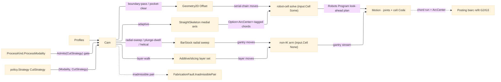

# [RASM_FABRICATION_MOTION]

The CAM-motion owner: the toolpath motion kernel one `Cam` static fold dispatches over the `(ProcessModality, CutStrategy)` cross-product — the engagement `CutStrategy` (the `Process/family#PROCESS_FAMILY` axis: `boundary-pass`/`pocket-clear`/`peck`/`adaptive`/`radial-sweep`/`plunge-dwell`/`helical`/`layer-walk`) lands its move geometry ONCE and the `ProcessModality` off `input.Process` selects the envelope, so a process-agnostic strategy stops masquerading as a process-bound row: the milling `boundary-pass`/`pocket-clear`/`peck`/`adaptive`, the turning `radial-sweep`/`plunge-dwell` (the lathe arms composing the `Toolpath/turning#TURNING` `Turning.Generate(LatheOp)` owner over the revolved envelope — the ZX sweep, tool-nose comp, and pass folds are the turning owner's), the DISTINCT `helical` thread/ramp (the dead `Turn` alias — lathe threading with ISO depth degression is `LatheOp.Thread`'s), the thermal `boundary-pass` (laser/plasma/waterjet sharing the contour generator, the pierce/lead differing by modality and conditioned at posting), and the additive `layer-walk` (the perimeter-and-infill reading the `Additive/slicing#SLICING` layer set) are all ONE strategy row read across every admitting modality, the `ProcessModality.Admits(CutStrategy)` relation routing an inadmissible pair (turning's `radial-sweep` on a `thermal` laser) to `FabricationFault.InadmissiblePair` rather than a silent empty move set. `boundary-pass` and `pocket-clear` route their offsetting through the `Geometry2D/algebra#POLYGON_ALGEBRA` Clipper2 substrate — the constant-offset contour rings and the inward pocket clearing are integer-robust polygon offsets, never a hand-rolled per-vertex-normal `OffsetRing` that self-intersects on a reflex vertex. The `adaptive` strategy is the dominant HEM (high-efficiency machining) class — an adaptive-clearing toolpath holding constant material-removal rate and radial engagement — driven by the `Toolpath/skeleton#STRAIGHT_SKELETON` straight-skeleton/medial-axis primitive, the one place no managed library exists and the author-kernel posture is correct and forward; the constant-engagement step is realized over the linear `Move` chord stream and its variable-radius circular-arc identity is recovered at posting by the `Posting/program#CUT_PROGRAM` `BIARC_ARC_EMISSION` biarc refit, the `Move` carrying an `Option<ArcCenter>` column the refit fills so a `G2`/`G3` arc block emits where the chord run is curvature-faithful. The generator reads its per-process budget from the `Process/physics#CUT_PARAMETER` `RemovalBudget` case (the `SubtractiveBudget` MRR for `adaptive`, the `ThermalBudget` cut-speed for the thermal `boundary-pass`, the `AdditiveBudget` layer geometry for `layer-walk`) selected by the `ProcessKind.ProcessModality`. The kernel composes the `Process/owner#FABRICATION_OWNER` `Loop`/`Move`/`FabricationPolicy.Cam`/`FabricationResult.Motion` shared vocabulary, hands each serial-chain-targeting move set to the `Kinematics/cell#ROBOT_CELL` `RobotProgram.Solve` (the admitted `Robots` look-ahead `Program` owning the FK/IK, the joint-limit/singularity/reach validation, and the cell-dialect post; the gantry-driven `radial-sweep`/thermal/`layer-walk` kinds whose `input.Cell` is `None` take the non-IK arm directly), and reads the kernel `Rasm/Numerics/predicates#ROBUST_PREDICATES` `Predicate.Orient2D` exact orientation where a side verdict is needed. It is dispatched by the `Process/owner#FABRICATION_OWNER` `Run` fold's `Cam` policy case; it mints no second owner surface, computes no hash, and operates on raw coordinate doubles at the interior.

Wire posture: HOST-LOCAL. The `Motion` toolpath/joint stream crosses only the in-process seam to the `Posting/program#CUT_PROGRAM` emitter — never a browser or peer wire.

## [01]-[INDEX]

- [01]-[CAM_MOTION]: owns the `(ProcessModality, CutStrategy)` cross-product move generators over the Geometry2D offset and the `Cam` fold handing each serial-chain move set to the `Kinematics/cell#ROBOT_CELL` robot-cell solve; one motion owner over the strategy×modality dispatch, the `CutStrategy` axis itself owned by `Process/family#PROCESS_FAMILY`.

## [02]-[CAM_MOTION]

- Owner: `Cam` the static motion fold over the `(ProcessModality, CutStrategy)` pair (the modality read off `input.Process`, the strategy off `policy.Strategy`) generating the cut moves through the `Generate` generated total `Switch`, then handing each serial-chain-targeting move set to the `Kinematics/cell#ROBOT_CELL` `RobotProgram.Solve` and emitting the `Motion` joint stream; `ArcCenter` the readonly arc-identity column the `Move` carries (`Option<ArcCenter>`) recording the `(Center, Clockwise)` a constant-engagement arc segment resolves to, the linear chord stream the `Posting/program#CUT_PROGRAM` `BIARC_ARC_EMISSION` biarc refit reads; `EngagementPolicy` the constant-engagement knobs (`TargetAngle`/`MaxAxialDepth`). The `CutStrategy` engagement axis and the `ProcessModality.Admits(CutStrategy)` relation are owned at `Process/family#PROCESS_FAMILY` — this page composes them, never re-mints a parallel motion enum.
- Cases: the `(ProcessModality, CutStrategy)` `Generate` arms — `boundary-pass` (constant-offset boundary passes via Geometry2D `Offset`, the milling-contour/thermal-contour/routing strategy a modality envelopes: a `subtractive` modality cuts the rings, a `thermal` modality the pierce/lead conditioned at posting) · `pocket-clear` (inward continuous spiral via repeated Geometry2D `Offset` rings) · `peck` (peck-cycle point set — hole-to-hole ORDER is `Toolpath/link#LINK` `Link.Route`'s tour, never input order) · `adaptive` (adaptive-clearing HEM over the straight-skeleton medial axis, constant MRR and radial engagement, emitting the `Option<ArcCenter>`-tagged chord stream) · `radial-sweep` (the lathe arm composing `Toolpath/turning#TURNING` `Turning.Generate` — `LatheOp.TurnRough` off this strategy row, the face/profile/thread/part family the turning owner's) · `plunge-dwell` (the groove plunge-and-dwell radial cut; the lathe groove family deepens on `LatheOp.Groove`) · `helical` (the DISTINCT constant-lead thread/ramp generator — the dead `Turn` alias; lathe threading is `LatheOp.Thread`'s) · `layer-walk` (the additive perimeter-and-infill move set walking the `Additive/slicing#SLICING` layer contour at the `AdditiveBudget` layer height under the `SeamPolicy` seam-placement row) (8 strategy arms × the modality envelope), the `(ProcessModality, CutStrategy)` cross-product PARTIAL — an inadmissible pair routes `FabricationFault.InadmissiblePair`, never an empty move set.
- Entry: `public static Fin<FabricationResult> Solve(FabricationPolicy.Cam policy, FabricationInput input)` — `Fin<T>` routes `FabricationFault.InadmissiblePair` when `input.Process.Modality.Admits(policy.Strategy)` is false, `FabricationFault.OpenLoop` on a non-closed toolpath boundary, the kernel `GeometryFault.DegenerateInput` on an empty profile, and `FabricationFault.Unreachable` when a reach-strict `CellPolicy` robot-cell solve folds a non-empty `Robots` `Program.Errors` (the routing the `Kinematics/cell#ROBOT_CELL` owner performs, propagated through the `Fin`), each lowered with `.ToError()`; the body gates the `(ProcessModality, CutStrategy)` pair against `Admits`, dispatches it to the move generator, then hands the serial-chain move set to the `Kinematics/cell#ROBOT_CELL` solve, emitting the `Motion` joint stream.
- Auto: `Cam.Solve` reads `policy.Strategy` and `input.Process.Modality`, and on `Admits` success dispatches the `CutStrategy` through the generated total `Switch` in `Generate`, threading the `(policy, loop, modality)` state into each arm — `boundary-pass` folds the boundary loop inward by `ToolRadius + k·StepOver` constant Geometry2D offsets for `Passes` rings (the thermal modality emitting one ring, the pierce/lead owned at posting, so the arm is modality-thin); `pocket-clear` generates the inward clearing as successive Geometry2D offset rings stitched into one continuous path so the cutter never lifts; `peck` emits one peck element per hole — hole-to-hole ordering and retracts are `Link.Route`'s tour, the input-order emission the dead form; `adaptive` reads the `Toolpath/skeleton#STRAIGHT_SKELETON` medial axis of the pocket, then walks it with a variable radial step sized per point from the `StraightSkeleton.ClearanceAt` local channel half-width and the `EngagementPolicy.TargetAngle` so the cutter holds constant radial engagement (a wide channel takes a coarse step, a narrowing channel a finer step), the per-pass step further bounded by the `EngagementPolicy.MaxAxialDepth` stickout-derived cap, and each curving arc segment tagged with its `ArcCenter` (the bisector-normal circle center through the segment endpoints) on the emitted `Move` so the posting biarc refit recovers the `G2`/`G3` block — the constant-engagement HEM strategy a uniform `len/stepOver` march cannot give since it ignores the channel width; `radial-sweep` hands the profile to `Turning.Generate` (`LatheOp.TurnRough` — the true ZX sweep over the `Bounds`-fitted revolved envelope, the tool-nose comp and pass folds the turning owner's); `plunge-dwell` plunges to the groove centroid and dwells (the lathe groove family deepens on `LatheOp.Groove`); `helical` generates the distinct constant-lead thread/ramp helix, never a `Turn` alias; `layer-walk` walks the `Additive/slicing#SLICING` layer contour set as the per-layer perimeter-and-infill move sequence at the `AdditiveBudget` layer height under three strengthened rows — `SeamPolicy` seam placement (nearest/aligned/random/user delegate-scored start vertex, the previous layer's seam exit threaded as the nearest anchor), comb routing (perimeter↔infill travels `ClipOpen`-clipped inside the region boundary, never across it), and monotonic infill ordering (one sweep direction per layer so thermal and surface artifacts stay directional). After move generation the fold links the per-element move sets through `Toolpath/link#LINK` `Link.Route` (the MST/DFS tour + retract selection — every multi-element strategy rides it), then hands the linked stream to the `Kinematics/cell#ROBOT_CELL` `RobotProgram.Solve` when `input.Cell` is present — the admitted `Robots` look-ahead `Program` solving every waypoint's FK/IK, threading the previous-pose continuation internally (the wrist-flip / redundant-axis disambiguation the planner owns), and posting the cell dialect; under a permissive `CellPolicy` it emits the `Motion` carrying the per-target joint trajectory, the planned `Duration`, the posted cell `Code`, and the reached flag, and under a reach-strict `CellPolicy` a non-empty `Program.Errors` (unreachable / joint-limit / singularity) routes `FabricationFault.Unreachable` — the robot-cell solve the one producer of `Unreachable`, the reach contract the cell's own joint-limit/singularity/reach validation, not a hand-rolled residual; the gantry-driven `radial-sweep`/thermal/`layer-walk` kinds whose `input.Cell` is `None` take the non-IK arm directly (the empty-cell `Motion` carrying the bare move stream the `Posting/program#CUT_PROGRAM` G-code emitter renders), the robot-cell drive reserved for the `articulated-arm` serial-chain machines.
- Receipt: the `Motion` carries the ordered `Move` list (rapid/feed with feedrate plus the `Option<ArcCenter>` arc identity), the per-target joint-angle stream, the final IK position residual, and the reached flag — the typed motion evidence the posting owner consumes; no generic motion ledger.
- Packages: `Rhino.Geometry` (`Point3d`/`Vector3d` — composed), `Rasm.Numerics` (`Predicate.Orient2D` — settled, the side verdict), Clipper2 (via `Geometry2D/algebra#POLYGON_ALGEBRA` — the contour/pocket offset), `Process/family#PROCESS_FAMILY` (`CutStrategy`/`ProcessModality.Admits` — composed), `Toolpath/turning#TURNING` (`Turning.Generate(LatheOp)` — the lathe-operation owner the radial-sweep arm composes), `Toolpath/link#LINK` (`Link.Route` — the tour/retract owner the fold links every multi-element strategy through), `Kinematics/cell#ROBOT_CELL` (`RobotProgram.Solve` — the `Robots` robot-cell FK/IK + look-ahead-program seam the `articulated-arm` path composes, the joint trajectory and posted cell `Code` read back boundary-mapped), Thinktecture.Runtime.Extensions, LanguageExt.Core, BCL inbox.
- Growth: a new engagement strategy is one `CutStrategy` row at `Process/family#PROCESS_FAMILY` plus one `Generate` `Switch` arm here and its addition to every admitting modality's `Strategies` set, the generated dispatch breaking the build until the arm lands — a new process reusing an existing strategy adds ZERO arms (a routing contour and a thermal contour are both `boundary-pass`); a new retract kind is one `Toolpath/link#LINK` `RetractKind` row + resolver arm (guard's `Lift` stays the last-resort trajectory its `Clearance` verdict carries — never a motion-local retract); a 5-axis tilt strategy is one orientation column on the `adaptive` arm; the variable-radius G2/G3 arc emission of the constant-engagement walk is the realized `Option<ArcCenter>` `Move` column the `BIARC_ARC_EMISSION` posting fold renders, the linear `Move` sample stream the chord input the biarc fit refits; zero new surface.
- Boundary: CAM is the ONE motion owner over the `(ProcessModality, CutStrategy)` pair and a `ContourPath`/`PocketPath`/`DrillCycle`/`TurningPass`/`ThermalPath`/`SlicePath` sibling family is the deleted form — every process toolpath is one `Generate` `Switch` arm; the flat 11-row `ToolpathKind` conflating strategy with modality (turn-rough/turn-finish/face/groove/thread/thermal-contour/slice-layer beside contour/pocket/drill/trochoidal) is the deleted form this factoring retires — a strategy lands once on the `CutStrategy` axis and the modality envelopes it, the turning rows collapsing onto `radial-sweep`/`plunge-dwell`/`helical`, the thermal contour onto `boundary-pass`, the additive walk onto `layer-walk`, never an axis re-encoding the modality; the `(ProcessModality, CutStrategy)` cross-product is gated by the `Process/family#PROCESS_FAMILY` `ProcessModality.Admits(CutStrategy)` relation and a silent empty move set on an inadmissible pair is the deleted form — the dispatch queries `Admits` and routes `FabricationFault.InadmissiblePair`; the per-strategy behavior lives in the `Generate` generated total `Switch` arm and a parallel `Spiral`/`Adaptive`/`Thermal` boolean column beside the strategy the dispatch already reads is the deleted form — one axis carries one discriminant, never a second flag the arm re-derives; the thermal `boundary-pass` SHARES the contour generator and a parallel thermal-only contour kernel is the deleted form — the pierce/lead conditioning is owned at posting, not a second offset routine; the boundary-pass and pocket-clear offsetting route the one `Geometry2D/algebra#POLYGON_ALGEBRA` Clipper2 owner and a hand-rolled `OffsetRing` is the deleted form; the `adaptive` clearing reads the `Toolpath/skeleton#STRAIGHT_SKELETON` medial-axis primitive and a per-vertex spiral approximation of HEM is the rejected form; the radial step holds constant engagement off the `ClearanceAt` local channel half-width and a uniform `stepOver` march ignoring the channel width is the deleted form — the engagement walk reads the wavefront clearance field the skeleton already encodes, never a re-derived distance transform, and the per-pass step is bounded by the `EngagementPolicy.MaxAxialDepth` stickout cap; the variable-radius arc identity rides the `Option<ArcCenter>` `Move` column the posting biarc refit reads and a CAM-side G2/G3 word emission is the deleted form — the move stream stays linear chords, the arc recovered ONCE at posting, never a second arc-aware offset call site; the `layer-walk` generator reads the `Additive/slicing#SLICING` layer set and a CAM-local re-slice is the deleted form; the serial-chain FK/IK is owned at `Kinematics/cell#ROBOT_CELL` (the admitted `Robots` cell solve) and a CAM-local kinematics re-mint or a hand-rolled DH/IK solver is the deleted form — the `Move` stream hands to `RobotProgram.Solve`, never a re-derived Jacobian; the side verdict reads `Predicate.Orient2D` exact sign and a `double` cross at the call site is the named robustness defect; element-to-element ordering is `Link.Route`'s tour and a generator-local input-order emission is the deleted form; the lathe operation family is `Toolpath/turning#TURNING`'s `LatheOp` and a motion-local ZX sweep body is the deleted form.

```csharp signature
// --- [RUNTIME_PRELUDE] --------------------------------------------------------------------
using LanguageExt;
using LanguageExt.Common;
using Rasm.Fabrication.Additive;
using Rasm.Fabrication.Geometry2D;
using Rasm.Fabrication.Kinematics;
using Rasm.Fabrication.Process;
using Rasm.Numerics;
using Rhino.Geometry;
using Thinktecture;
using static LanguageExt.Prelude;

namespace Rasm.Fabrication.Toolpath;

// --- [TYPES] ------------------------------------------------------------------------------
public readonly record struct EngagementPolicy(double TargetAngle, double MaxAxialDepth) {
    public static readonly EngagementPolicy Default = new(TargetAngle: 60.0, MaxAxialDepth: double.PositiveInfinity);
}

// Seam scoring is a delegate column on the row (minimum score wins the start vertex) — a new
// placement policy is one row, never a switch edit. `random` is the deterministic golden-ratio scatter.
[SmartEnum<string>]
public sealed partial class SeamPolicy {
    public static readonly SeamPolicy Nearest = new("nearest", static (l, prev, i) => l.At(i).DistanceTo(prev));
    public static readonly SeamPolicy Aligned = new("aligned", static (l, _, i) => {
        Vector3d a = l.At(i) - l.At(i - 1); a.Unitize();
        Vector3d b = l.At(i + 1) - l.At(i); b.Unitize();
        return a * b;                                              // smallest dot = sharpest corner hides the seam
    });
    public static readonly SeamPolicy Random = new("random", static (l, _, i) => (i * 0.6180339887) % 1.0);
    public static readonly SeamPolicy User = new("user", static (_, _, i) => i);

    public Func<Loop, Point3d, int, double> Score { get; }
}

// --- [OPERATIONS] -------------------------------------------------------------------------
public static class Cam {
    public static Fin<FabricationResult> Solve(FabricationPolicy.Cam policy, FabricationInput input) =>
        !input.Process.Modality.Admits(policy.Strategy)
            ? Fin.Fail<FabricationResult>(FabricationFault.InadmissiblePair((input.Process.Modality, policy.Strategy)).ToError())
            : input.Profiles.IsEmpty
                ? Fin.Fail<FabricationResult>(GeometryFault.DegenerateInput("cam:no-profile").ToError())
                : toSeq(input.Profiles).Map(static (i, l) => (Index: i, Loop: l)).Find(static t => !t.Loop.Closed).Match(
                    Some: t => Fin.Fail<FabricationResult>(FabricationFault.OpenLoop(FabConcern.Toolpath, t.Index).ToError()),
                    None: () => {
                        // Emission order is Link.Route's tour (Toolpath/link) — never input order: the fold
                        // links the per-profile elements, then the articulated-arm path hands the linked TCP
                        // stream to the Robots cell solve; a gantry/lathe (Cell None) takes the non-IK arm.
                        Seq<CutElement> cuts = toSeq(input.Profiles)
                            .Map(loop => Generate(policy, loop.AsCcw(), input))
                            .Filter(static ms => !ms.IsEmpty)
                            .Map(CutElement.Of);
                        return Link.Route(cuts, input, LinkPolicy.Default).Bind(linked => input.Cell.Match(
                            None: () => Fin.Succ((FabricationResult)new FabricationResult.Motion(linked.Moves, Seq<double[]>(), 0.0, true, Seq<string>())),
                            Some: cell => RobotProgram.Solve(cell, linked.Moves, policy.Cell)
                                .Map(cm => (FabricationResult)new FabricationResult.Motion(linked.Moves, cm.Joints, cm.Duration, cm.Reached, cm.Code))));
                    });

    static Seq<Move> Generate(FabricationPolicy.Cam p, Loop loop, FabricationInput input) =>
        p.Strategy.Switch(
            state:        (p, loop, input),
            boundaryPass: static s => Contour(s.loop, s.p.ToolRadius, s.p.StepOver, s.p.Passes),
            pocketClear:  static s => Pocket(s.loop, s.p.ToolRadius, s.p.StepOver),
            peck:         static s => Peck(s.loop, s.p.ToolRadius),
            adaptive:     static s => Adaptive(s.loop, s.p.ToolRadius, s.p.StepOver, s.p.Engagement),
            radialSweep:  static s => TurnDelegate(s.loop, s.p, s.input),
            plungeDwell:  static s => Plunge(s.loop, s.p.ToolRadius),
            helical:      static s => Helix(s.loop, s.p.ToolRadius, s.p.StepOver, s.p.Passes),
            layerWalk:    static s => SliceWalk(s.loop, SeamPolicy.Nearest));

    // The lathe arm delegates to the Toolpath/turning owner — ZX sweep, nose comp, spindle law, and pass
    // folds live there; the stock envelope composes the kernel enclosing-cylinder fit via BarStock.Of.
    static Seq<Move> TurnDelegate(Loop profile, FabricationPolicy.Cam p, FabricationInput input) =>
        input.Model.Bind(m => BarStock.Of(m, Vector3d.ZAxis).ToOption()).Match(
            Some: stock => Turning.Generate(
                    new LatheOp.TurnRough(RoughCycle.G71Longitudinal, DepthOfCut: p.StepOver, AllowanceX: 0.5, AllowanceZ: 0.1),
                    new TurnJob(profile, stock, p.Cutter, NosePosition.P3, new SpindleMode.Css(SurfaceMpm: 200.0, MaxRpm: 4000.0),
                        // Seed budget: the Cam fold's physics consult threads the measured Subtractive budget here.
                        new RemovalBudget.Subtractive(0.0, 0.0, p.StepOver, 0.0)))
                .IfFail(Seq<Move>()),
            None: () => Seq<Move>());

    // helical is a DISTINCT constant-lead thread/ramp generator (the dead Turn alias); lathe threading
    // with ISO depth degression is Toolpath/turning LatheOp.Thread's — never re-derived here.
    static Seq<Move> Helix(Loop profile, double radius, double lead, int turns) {
        Point3d c = Centroid(profile);
        return toSeq(Enumerable.Range(0, Math.Max(1, turns) * 24 + 1)).Map(i => {
            double t = 2.0 * Math.PI * i / 24.0;
            return new Move(new Point3d(c.X + radius * Math.Cos(t), c.Y + radius * Math.Sin(t), c.Z - lead * t / (2.0 * Math.PI)), Rapid: false, Feed: 1.0);
        });
    }

    static Seq<Move> Plunge(Loop profile, double radius) {
        Point3d c = Centroid(profile);
        return Seq(new Move(c with { Y = c.Y + 5.0 }, Rapid: true, Feed: 0.0), new Move(c, Rapid: false, Feed: 0.3));
    }

    // Comb routing (perimeter↔infill travels ClipOpen-clipped inside the region, never across it) and
    // monotonic infill ordering (one sweep direction per layer) ride this arm as conditioning rows.
    static Seq<Move> SliceWalk(Loop layerContour, SeamPolicy seam) {
        Loop ccw = layerContour.AsCcw();
        int start = Enumerable.Range(0, ccw.Count).OrderBy(i => seam.Score(ccw, Point3d.Origin, i)).First();   // Origin = the threaded previous-layer seam exit
        return toSeq(Enumerable.Range(0, ccw.Count + 1)).Map(i => new Move(ccw.At(start + i), Rapid: false, Feed: 1.0));
    }

    static Seq<Move> Contour(Loop loop, double radius, double stepOver, int passes) =>
        toSeq(Enumerable.Range(0, Math.Max(1, passes)))
            .Bind(k => PolygonAlgebra.Offset(Seq(loop), -(radius + k * stepOver), OffsetEnds.Polygon).IfFail(Seq<Loop>()))
            .Bind(ring => toSeq(ring.Vertices))
            .Map(p => new Move(p, Rapid: false, Feed: 1.0));

    static Seq<Move> Pocket(Loop loop, double radius, double stepOver) {
        Seq<Move> Rings(double depth) =>
            PolygonAlgebra.Offset(Seq(loop), -(radius + depth), OffsetEnds.Polygon).Match(
                Succ: ring => ring.IsEmpty
                    ? Seq<Move>()
                    : toSeq(ring).Bind(r => toSeq(r.Vertices)).Map(p => new Move(p, Rapid: false, Feed: 1.0)).Concat(Rings(depth + stepOver)),
                Fail: _ => Seq<Move>());
        return Rings(0.0);
    }

    // ONE peck element per hole; hole-to-hole ordering and retracts are Link.Route's tour — never input order.
    static Seq<Move> Peck(Loop loop, double radius) {
        Point3d c = Centroid(loop);
        return Seq(new Move(c with { Z = c.Z + 5.0 }, Rapid: true, Feed: 0.0), new Move(c, Rapid: false, Feed: 0.5));
    }

    static Seq<Move> Adaptive(Loop loop, double radius, double stepOver, EngagementPolicy engage) =>
        StraightSkeleton.MedialAxis(loop).Match(
            Succ: axis => axis.Bind(seg => Engage(loop, seg, radius, stepOver, engage)),
            Fail: _ => Seq<Move>());

    static Seq<Move> Engage(Loop loop, Edge3 seg, double radius, double stepOver, EngagementPolicy engage) {
        double len = seg.A.DistanceTo(seg.B);
        double half = Math.Max(radius, 1e-6);
        double engageRatio = Math.Clamp(engage.TargetAngle / 180.0, 1e-3, 1.0);
        double axialCap = double.IsPositiveInfinity(engage.MaxAxialDepth) ? double.MaxValue : Math.Max(1e-3, engage.MaxAxialDepth);
        return toSeq(Walk(loop, seg, len, half, radius, stepOver, engageRatio, axialCap, t: 0.0, first: true));
    }

    // The walk emits linear chords; an adaptive turn carries its osculating ArcCenter so the
    // posting biarc refit recovers the G2/G3 block — never a CAM-side arc word.
    static IEnumerable<Move> Walk(
        Loop loop, Edge3 seg, double len, double half, double radius, double stepOver, double engageRatio, double axialCap, double t, bool first) {
        double s = t * len;
        Point3d here = seg.A + (s / Math.Max(len, 1e-9)) * (seg.B - seg.A);
        Vector3d dir = seg.B - seg.A; dir.Unitize();
        Vector3d nrm = new(-dir.Y, dir.X, 0.0);
        double clearance = StraightSkeleton.ClearanceAt(loop, here).IfFail(half);
        Option<ArcCenter> arc = first || clearance <= 1e-6 ? None : Some(new ArcCenter(here + clearance * nrm, Clockwise: false));
        yield return new Move(here, Rapid: first, Feed: 1.0, Arc: arc);
        if (s >= len) yield break;
        double radialStep = Math.Max(1e-3, Math.Min(axialCap, engageRatio * Math.Min(clearance, radius + stepOver)));
        foreach (Move m in Walk(loop, seg, len, half, radius, stepOver, engageRatio, axialCap, t + radialStep / Math.Max(len, 1e-9), first: false))
            yield return m;
    }

    static Point3d Centroid(Loop loop) =>
        loop.Vertices.Fold(Point3d.Origin, static (acc, v) => acc + v) / Math.Max(1, loop.Count);
}
```


