# [RASM_FABRICATION_MOTION]

The CAM-motion owner closes the admitted `(ProcessModality, CutStrategy)` cross-product under one `Cam` fold. `EngagementPolicy` is the composite policy `FabricationPolicy.Cam` carries: admitted physics, measured cutting data, surface and IT-grade finish demand, contour compensation side, engagement limits, hole/seam/infill/thread/lathe choices, seam reference, planar-offset policy, pencil angle, explicit surface sampling, minimum travel clearance, guard and link policies, the `MotionMounts` execution evidence, and rapid rate. Every determining knob is carried; no canonical physics row, ambient processor count, hidden hole selection, or signature-local retry/control value exists.

`Cam.Generate` returns `Seq<CutElement>`. Contour depths, pocket rings, medial arcs, surface drives, holes, raster fills, and turning programs preserve their independent element boundaries until `Link.Route` inserts travel. Axial passes change Z; radial stepover changes planar geometry. The generator never uses pass count as an offset-only surrogate or feeds between islands, rings, graph components, native paths, or fill strokes.

## [01]-[INDEX]

- [01]-[CAM_MOTION]: owns `EngagementPolicy`, `MotionMounts`, seam/hole/lathe policy rows, `MotionRun`, all 15 strategy arms, element linking, workholding/guard conditioning, and the machine/cell solve boundary.

## [02]-[CAM_MOTION]

- Owner: `EngagementPolicy` is the `[ComplexValueObject]` policy owner; `EntryPolicy` is the per-variant payload family for tangential arc, ramp, plunge, and helical entry; `SeamPolicy` and `HoleCycle` are constructor-bound behavior rows; `LathePolicy` carries explicit turning choices; `Cam` owns `Solve` and `Generate`. `MotionMounts` is the execution-evidence union: `Floor` is the deliberate descriptor-free case, and `Mounted` carries the fixture, holder assembly, clearance channel, spatial index, and machine kinematics the derivation seam composes onto the policy. `MotionRun` is the admitted execution carrier built from policy, input, and the carried mounts.
- Cases: all 15 `CutStrategy` rows land in the generated total switch. Planar contour, pocket, hole, adaptive, turning, helix/thread, additive-layer, six surface/multi-axis rows each compose their owning page. Multi-axis rows reach the surface admission and fail until owner-atom orientation exists; they never emit false Z-only motion.
- Entry: `Solve(FabricationPolicy.Cam, FabricationInput)` is the owner-side fold. `Generate((ProcessModality, CutStrategy), MotionRun)` is the admitted element dispatch. Both return `Fin`; independent policy-axis defects accumulate per named axis at `EngagementPolicy.Admit`, independent profile defects accumulate at the closed-boundary gate, and dependent generation aborts.
- Auto: `EngagementPolicy.Resolve` folds the budget case against the process modality and returns feed, compensation, and step-down only for physically matching pairs. `ContourCompensation` applies the resolved cutter/kerf radius and `Tolerance.Allowance(FinishGrade)` as one signed centerline offset; pocket admission applies the same finish allowance inward before decomposition. `Solve` links the generated elements with the carried `LinkPolicy`, conditions every move through workholding, guards every committed segment from the admitted home cursor, then solves the robot or machine descriptor. The descriptor-free floor integrates feed/rapid duration in seconds with arc-true circular lengths from that same cursor, returns empty joint rows and cell code, and never claims kinematic reach; it is the `MotionMounts.Floor` case selected on the carried policy, while `MotionMounts.Mounted` threads the derivation-composed fixture, `ToolAssembly`, clearance channel, spatial index, and kinematics through `MotionRun` into workholding conditioning, guard evidence, and the `MachineTool.Solve` arm, and a swept-holder guard policy without a mounted assembly fails at `EngagementPolicy.Admit`.
- Receipt: `FabricationResult.Motion` carries atom-safe moves, joint rows, seconds, and cell code; reach is asserted only by a machine or cell solve. Plane receipts and directives stay local; a turning program with directives that `Move` cannot encode is rejected rather than silently stripped.
- Packages: `Process/owner.md` atoms, `Process/family.md`, `Process/physics.md`, `Process/faults.md`, `Tooling/cuttingdata.md`, `Spec/tolerance.md`, `Geometry2D/algebra.md`, `Geometry2D/arcs.md`, kernel `Rasm.Meshing`, `Toolpath/partition.md`, `Toolpath/skeleton.md`, `Toolpath/surface.md`, `Toolpath/turning.md`, `Toolpath/link.md`, `Toolpath/guard.md`, `Fixturing/workholding.md`, `Kinematics/machine.md`, `Kinematics/cell.md`, LanguageExt.Core, Thinktecture.Runtime.Extensions, RhinoCommon, BCL inbox.
- Growth: a new strategy is one family row, one modality admission, and one total-switch arm. New hole or seam behavior is one smart-enum row. Orientation, canned-cycle identity, spindle synchronization, and dwell first widen their atom/wire owners, then flow through the existing rows.
- Boundary: fabricated physics, zero sentinels, hardwired free-fixture execution, dead policy fields, strategy rosters beside generated dispatch, axial-as-radial passes, island feed joins, automatic guard lifts, discarded turning directives, hidden hole selection, and ambient concurrency are deleted forms.

```csharp signature
// --- [RUNTIME_PRELUDE] ----------------------------------------------------------------------------------------------------------------------------
using LanguageExt;
using LanguageExt.Common;
using Rasm.Fabrication.Fixturing;
using Rasm.Fabrication.Geometry2D;
using Rasm.Fabrication.Kinematics;
using Rasm.Fabrication.Process;
using Rasm.Fabrication.Spec;
using Rasm.Fabrication.Tooling;
using Rasm.Meshing;
using Rasm.Numerics;
using Rasm.Spatial;
using Rhino.Geometry;
using Thinktecture;
using static LanguageExt.Prelude;

namespace Rasm.Fabrication.Toolpath;

// --- [TYPES] --------------------------------------------------------------------------------------------------------------------------------------
[Union(ConversionFromValue = ConversionOperatorsGeneration.None)]
public abstract partial record EntryPolicy {
    private EntryPolicy() { }

    public sealed record TangentialArc : EntryPolicy;
    public sealed record Ramp(double LengthMm, double ClearanceMm) : EntryPolicy;
    public sealed record Plunge(double ClearanceMm) : EntryPolicy;
    public sealed record Helix(double RadiusMm, double PitchMm, double ClearanceMm) : EntryPolicy;
}

[SmartEnum<string>]
public sealed partial class ContourCompensation {
    public static readonly ContourCompensation Centerline = new("centerline", static (_, _) => 0.0);
    public static readonly ContourCompensation Inside = new("inside", static (radius, allowance) => -(radius + allowance));
    public static readonly ContourCompensation Outside = new("outside", static (radius, allowance) => radius + allowance);

    [UseDelegateFromConstructor]
    public partial double Signed(double radius, double allowance);
}

[SmartEnum<string>]
public sealed partial class SeamPolicy {
    public static readonly SeamPolicy Nearest = new("nearest", NearestScore);
    public static readonly SeamPolicy Farthest = new("farthest", FarthestScore);
    public static readonly SeamPolicy SharpestConcave = new("sharpest-concave", SharpestConcaveScore);
    public static readonly SeamPolicy Aligned = new("aligned", AlignedScore);
    public static readonly SeamPolicy Distributed = new("distributed", DistributedScore);

    [UseDelegateFromConstructor]
    public partial double Score(Loop perimeter, Point3d reference, int layer, int index);

    private static double NearestScore(Loop perimeter, Point3d reference, int layer, int index) =>
        perimeter.At(index).DistanceTo(reference);

    private static double FarthestScore(Loop perimeter, Point3d reference, int layer, int index) =>
        -perimeter.At(index).DistanceTo(reference);

    private static double SharpestConcaveScore(Loop perimeter, Point3d reference, int layer, int index) {
        Point3d previous = perimeter.At(index - 1);
        Point3d current = perimeter.At(index);
        Point3d next = perimeter.At(index + 1);
        double deflection = Math.PI - Vector3d.VectorAngle(current - previous, next - current);
        return Predicate.Orient2D(previous, current, next) == Sign.Negative
            ? -Math.Abs(deflection)
            : double.PositiveInfinity;
    }

    private static double AlignedScore(Loop perimeter, Point3d reference, int layer, int index) {
        Point3d center = perimeter.Bound().Center;
        Vector3d axis = reference - center;
        Vector3d radial = perimeter.At(index) - center;
        return axis.IsTiny() || radial.IsTiny() ? double.PositiveInfinity : Vector3d.VectorAngle(axis, radial);
    }

    private static double DistributedScore(Loop perimeter, Point3d reference, int layer, int index) {
        int target = (int)Math.Floor((layer * 0.6180339887498948 % 1.0) * perimeter.Count);
        int distance = Math.Abs(index - target);
        return Math.Min(distance, perimeter.Count - distance);
    }
}

[SmartEnum<string>]
public sealed partial class HoleCycle {
    public static readonly HoleCycle Spot = new("spot", static (top, law, feed) => Single(top, law, feed, Math.Min(law.Depth, law.StepDown * 0.5), 1.0));
    public static readonly HoleCycle Drill = new("drill", static (top, law, feed) => Single(top, law, feed, law.Depth, 1.0));
    public static readonly HoleCycle Peck = new("peck", static (top, law, feed) => Pecks(top, law, feed, FullRetract));
    public static readonly HoleCycle ChipBreak = new("chip-break", static (top, law, feed) => Pecks(top, law, feed, PartialRetract));
    public static readonly HoleCycle DeepHole = new("deep-hole", static (top, law, feed) => Pecks(top, law with { StepDown = law.StepDown * 0.5 }, feed, FullRetract));
    public static readonly HoleCycle Ream = new("ream", static (top, law, feed) => Single(top, law, feed, law.Depth, 0.5));
    public static readonly HoleCycle Bore = new("bore", static (top, law, feed) => Single(top, law, feed, law.Depth, 0.6));
    public static readonly HoleCycle FineBore = new("fine-bore", static (top, law, feed) => Single(top, law, feed, law.Depth, 0.35));
    public static readonly HoleCycle Counterbore = new("counterbore", static (top, law, feed) => Single(top, law, feed, law.Depth, 0.75));
    public static readonly HoleCycle Countersink = new("countersink", static (top, law, feed) => Single(top, law, feed, Math.Min(law.Depth, law.StepDown), 0.5));

    [UseDelegateFromConstructor]
    public partial Seq<Move> Expand(Point3d top, HoleLaw law, double feed);

    private static Seq<Move> Single(Point3d top, HoleLaw law, double feed, double depth, double feedScale) =>
        Seq(
            (Move)new Move.Rapid(AtZ(top, top.Z + law.Clearance)),
            new Move.Linear(AtZ(top, top.Z - depth), feed * feedScale),
            new Move.Rapid(AtZ(top, top.Z + law.Clearance)));

    private static Seq<Move> Pecks(Point3d top, HoleLaw law, double feed, Func<Point3d, HoleLaw, double, double> retractAt) =>
        Seq1<Move>(new Move.Rapid(AtZ(top, top.Z + law.Clearance))).Concat(
            Range(1, Math.Max(1, (int)Math.Ceiling(law.Depth / law.StepDown))).Bind(step => {
                double depth = Math.Min(law.Depth, step * law.StepDown);
                return Seq(
                    (Move)new Move.Linear(AtZ(top, top.Z - depth), feed),
                    new Move.Rapid(AtZ(top, retractAt(top, law, depth))));
            }));

    private static double FullRetract(Point3d top, HoleLaw law, double depth) =>
        top.Z + law.Clearance;

    private static double PartialRetract(Point3d top, HoleLaw law, double depth) =>
        top.Z - Math.Max(0.0, depth - (law.StepDown * law.RetractFraction));

    private static Point3d AtZ(Point3d point, double z) => new(point.X, point.Y, z);
}

// --- [MODELS] -------------------------------------------------------------------------------------------------------------------------------------
public readonly record struct HoleLaw(double Clearance, double StepDown, double Depth, double RetractFraction) {
    public static HoleLaw Of(EngagementPolicy policy, double stepDown) =>
        new(
            policy.HoleClearanceMm,
            Math.Min(policy.MaxAxialDepth, stepDown),
            policy.HoleDepthMm + policy.HoleBreakthroughMm,
            policy.HoleRetractFraction);
}

public sealed record LathePolicy(
    RoughCycle Rough,
    SpindleMode Spindle,
    NosePosition Tip,
    double AllowanceX,
    double AllowanceZ,
    double GroovePeckFraction,
    double GrooveDwellRevolutions);

file sealed record LatheLaw(LatheOp Rough, LatheOp Groove, SpindleMode Spindle, NosePosition Tip) {
    public static LatheLaw Of(FabricationPolicy.Cam policy, ProcessBudget.Turning budget) =>
        new(
            new LatheOp.TurnRough(
                policy.Engagement.Turning.Rough,
                budget.DepthOfCut,
                policy.Engagement.Turning.AllowanceX,
                policy.Engagement.Turning.AllowanceZ),
            new LatheOp.Groove(
                policy.Cutter.Diameter,
                budget.DepthOfCut,
                policy.Engagement.Turning.GroovePeckFraction,
                policy.Engagement.Turning.GrooveDwellRevolutions),
            policy.Engagement.Turning.Spindle,
            policy.Engagement.Turning.Tip);
}

// The execution-evidence carrier the derivation seam composes onto the Cam policy: Floor is the deliberate
// descriptor-free case; Mounted carries fixture, holder assembly, clearance channel, spatial index, and kinematics.
[Union(ConversionFromValue = ConversionOperatorsGeneration.None)]
public abstract partial record MotionMounts {
    private MotionMounts() { }

    public sealed record Floor : MotionMounts;
    public sealed record Mounted(
        Fixture Fixture,
        Option<ToolAssembly> Assembly,
        Option<CurveSkeleton> Channel,
        Option<SpatialIndex> Index,
        Option<MachineKinematics> Kinematics) : MotionMounts;
}

[ComplexValueObject]
public sealed partial class EngagementPolicy {
    public ProcessBudget Budget { get; }
    public Option<CuttingData> Cutting { get; }
    public double TargetAngle { get; }
    public double MaxAxialDepth { get; }
    public RaTarget Finish { get; }
    public ItGrade FinishGrade { get; }
    public ContourCompensation Contour { get; }
    public EntryPolicy Entry { get; }
    public AdaptiveSense Sense { get; }
    public HoleCycle Hole { get; }
    public double HoleDepthMm { get; }
    public double HoleBreakthroughMm { get; }
    public double HoleClearanceMm { get; }
    public double HoleRetractFraction { get; }
    public SeamPolicy Seam { get; }
    public Point3d SeamReference { get; }
    public PartitionStrategy Infill { get; }
    public Rasm.Fabrication.Geometry2D.OffsetPolicy PlanarOffset { get; }
    public double MinimumTravelClearanceMm { get; }
    public double ThreadPitchMm { get; }
    public double PencilContactAngleDeg { get; }
    public SurfaceSampling Sampling { get; }
    public GuardPolicy Guard { get; }
    public LinkPolicy Link { get; }
    public MotionMounts Mounts { get; }
    public LathePolicy Turning { get; }
    public double RapidFeedMmPerMinute { get; }

    public Fin<Unit> Admit(CutterForm cutter) {
        Seq<Error> faults = Seq(
            (Ok: TargetAngle is > 0.0 and <= 180.0 && double.IsFinite(TargetAngle), Axis: "target-angle"),
            (Ok: MaxAxialDepth >= 0.0 && double.IsFinite(MaxAxialDepth), Axis: "axial-depth"),
            (Ok: FinishGrade.Number is >= 1 and <= 18 && FinishGrade.Diameter is not null
                && FinishGrade.ToleranceMicrometers > 0.0 && double.IsFinite(FinishGrade.ToleranceMicrometers)
                && FinishGrade.FinishingAllowanceFactor >= 0.0 && double.IsFinite(FinishGrade.FinishingAllowanceFactor), Axis: "finish-grade"),
            (Ok: Contour is not null, Axis: "contour"),
            (Ok: Valid(Entry), Axis: "entry"),
            (Ok: HoleDepthMm > 0.0 && double.IsFinite(HoleDepthMm)
                && HoleBreakthroughMm >= 0.0 && double.IsFinite(HoleBreakthroughMm)
                && HoleClearanceMm >= 0.0 && double.IsFinite(HoleClearanceMm)
                && HoleRetractFraction is >= 0.0 and <= 1.0 && double.IsFinite(HoleRetractFraction), Axis: "hole"),
            (Ok: SeamReference.IsValid, Axis: "seam-reference"),
            (Ok: PlanarOffset is not null, Axis: "planar-offset"),
            (Ok: MinimumTravelClearanceMm >= 0.0 && double.IsFinite(MinimumTravelClearanceMm), Axis: "travel-clearance"),
            (Ok: ThreadPitchMm > 0.0 && double.IsFinite(ThreadPitchMm), Axis: "thread-pitch"),
            (Ok: PencilContactAngleDeg is >= 0.0 and <= 90.0 && double.IsFinite(PencilContactAngleDeg), Axis: "pencil-angle"),
            (Ok: Sampling.MinimumStepMm > 0.0 && Sampling.MaximumStepMm >= Sampling.MinimumStepMm
                && double.IsFinite(Sampling.MinimumStepMm) && double.IsFinite(Sampling.MaximumStepMm)
                && Sampling.CosLimit is >= -1.0 and <= 1.0 && double.IsFinite(Sampling.CosLimit)
                && Sampling.Threads >= 1
                && Sampling.MaximumTriangles >= 1 && Sampling.MaximumTriangles <= Array.MaxLength / 9
                && Sampling.MaximumGroups >= 1
                && Sampling.MaximumPointsPerGroup >= 1 && Sampling.MaximumPointsPerGroup <= Array.MaxLength / 4, Axis: "sampling"),
            (Ok: Mounts is not null, Axis: "mounts"),
            (Ok: Guard.Holder != HolderSweep.Swept
                || Mounts is MotionMounts.Mounted { Assembly.IsSome: true }, Axis: "holder-mount"),
            (Ok: Turning.AllowanceX >= 0.0 && Turning.AllowanceZ >= 0.0
                && Turning.GroovePeckFraction is > 0.0 and <= 1.0 && Turning.GrooveDwellRevolutions >= 0.0, Axis: "turning"),
            (Ok: RapidFeedMmPerMinute > 0.0 && double.IsFinite(RapidFeedMmPerMinute), Axis: "rapid-feed"))
            .Filter(static row => !row.Ok)
            .Map(static row => GeometryFault.DegenerateInput($"engagement:{row.Axis}").ToError());
        return faults.IsEmpty
            ? Guard.Admit(cutter.Diameter * 0.5)
            : Fin.Fail<Unit>(Error.Many([.. faults]));
    }

    private static bool Valid(EntryPolicy entry) =>
        entry is not null
        && entry.Switch(
            tangentialArc: static _ => true,
            ramp: static row => row.LengthMm > 0.0 && row.ClearanceMm >= 0.0
                && double.IsFinite(row.LengthMm) && double.IsFinite(row.ClearanceMm),
            plunge: static row => row.ClearanceMm >= 0.0 && double.IsFinite(row.ClearanceMm),
            helix: static row => row.RadiusMm > 0.0 && row.PitchMm > 0.0 && row.ClearanceMm >= 0.0
                && double.IsFinite(row.RadiusMm) && double.IsFinite(row.PitchMm) && double.IsFinite(row.ClearanceMm));

    public Fin<(double Feed, double Compensation, double StepDown)> Resolve(ProcessModality modality, CutterForm cutter) =>
        Budget.Switch(
            state: (Modality: modality, Cutter: cutter),
            subtractive: static (state, budget) => state.Modality == ProcessModality.Subtractive
                ? Admit(budget.FeedRate, state.Cutter.Diameter * 0.5, budget.DepthOfCut)
                : Mismatch(state.Modality, "subtractive"),
            turning: static (state, budget) => state.Modality == ProcessModality.Subtractive
                ? Admit(budget.FeedPerRevolution, budget.NoseRadius, budget.DepthOfCut)
                : Mismatch(state.Modality, "turning"),
            thermal: static (state, budget) => state.Modality == ProcessModality.Thermal
                ? Admit(budget.CutSpeed, budget.KerfWidth * 0.5, 0.0)
                : Mismatch(state.Modality, "thermal"),
            abrasive: static (state, _) => Mismatch(state.Modality, "abrasive-kerf-unresolved"),
            fff: static (state, budget) => state.Modality == ProcessModality.Additive
                ? Admit(budget.PrintSpeed, budget.ExtrusionWidth * 0.5, budget.LayerHeight)
                : Mismatch(state.Modality, "fff"),
            deposition: static (state, _) => Mismatch(state.Modality, "deposition-traverse-unresolved"),
            erosion: static (state, _) => Mismatch(state.Modality, "erosion-kerf-unresolved"),
            resin: static (state, _) => Mismatch(state.Modality, "resin-noncontinuous"),
            powder: static (state, _) => Mismatch(state.Modality, "powder-layer-unresolved"),
            formed: static (state, _) => Mismatch(state.Modality, "formed-non-cam"));

    private static Fin<(double Feed, double Compensation, double StepDown)> Admit(double feed, double compensation, double stepDown) =>
        feed > 0.0 && compensation >= 0.0 && stepDown >= 0.0
        && double.IsFinite(feed) && double.IsFinite(compensation) && double.IsFinite(stepDown)
            ? Fin.Succ((feed, compensation, stepDown))
            : Fin.Fail<(double, double, double)>(GeometryFault.DegenerateInput("engagement:resolved-physics").ToError());

    private static Fin<(double Feed, double Compensation, double StepDown)> Mismatch(ProcessModality modality, string budget) =>
        Fin.Fail<(double, double, double)>(GeometryFault.DegenerateInput($"engagement:{modality.Key}:{budget}").ToError());
}

public sealed record MotionRun(
    FabricationPolicy.Cam Policy,
    FabricationInput Input,
    Fixture Fixture,
    Stock Stock,
    Option<MachineKinematics> Kinematics,
    double Feed,
    double Compensation,
    double StepDown,
    double Chord) {
    public (ProcessModality Modality, CutStrategy Strategy) Pair => (Input.Process.Modality, Policy.Strategy);

    public static Fin<MotionRun> Of(FabricationPolicy.Cam policy, FabricationInput input) =>
        from _ in policy.Engagement.Admit(policy.Cutter)
        from physics in policy.Engagement.Resolve(input.Process.Modality, policy.Cutter)
        from chord in Tolerance.ScallopStep(policy.Engagement.Finish, policy.Cutter)
        let mounts = policy.Engagement.Mounts.Switch(
            floor: static _ => (Fixture: Fixture.Free, Assembly: Option<ToolAssembly>.None,
                Channel: Option<CurveSkeleton>.None, Index: Option<SpatialIndex>.None,
                Kinematics: Option<MachineKinematics>.None),
            mounted: static row => (row.Fixture, row.Assembly, row.Channel, row.Index, row.Kinematics))
        select new MotionRun(
                policy,
                input,
                mounts.Fixture,
                new Stock(
                    input.Profiles.ToSeq(),
                    input.Keepouts.IsEmpty
                        ? Seq<ExclusionZone>()
                        : Seq1(new ExclusionZone(
                            mounts.Fixture.Operation,
                            WorkholdingKind.Clamp,
                            input.Keepouts.ToSeq(),
                            Seq<Loop>(),
                            double.MaxValue,
                            policy.Engagement.Guard.ArcChordErrorMm)),
                    input.Snapshots,
                    policy.Cutter,
                    mounts.Assembly,
                    mounts.Channel,
                    mounts.Index,
                    policy.Engagement.Guard),
                mounts.Kinematics,
                physics.Feed,
                physics.Compensation,
                physics.StepDown,
                chord);
}

// --- [OPERATIONS] ---------------------------------------------------------------------------------------------------------------------------------
public static class Cam {
    public static Fin<FabricationResult> Solve(FabricationPolicy.Cam policy, FabricationInput input) =>
        from _ in input.Process.Modality.Admits(policy.Strategy)
            ? Fin.Succ(unit)
            : Fin.Fail<Unit>(FabricationFault.InadmissiblePair(
                new RelationFault.ModalityStrategy(input.Process.Modality, policy.Strategy)).ToError())
        from __ in ClosedGate(policy.Strategy, input)
        from run in MotionRun.Of(policy, input)
        from elements in Generate(run.Pair, run)
        from linked in Link.Route(
            elements,
            input,
            policy.Engagement.Link with {
                ClearancePlane = Math.Max(policy.Engagement.Link.ClearancePlane, policy.Engagement.MinimumTravelClearanceMm),
            })
        from solved in Commit(run, linked.Moves)
        select (FabricationResult)solved;

    public static Fin<Seq<CutElement>> Generate((ProcessModality Modality, CutStrategy Strategy) pair, MotionRun run) =>
        pair.Modality != run.Pair.Modality || pair.Strategy != run.Pair.Strategy || !pair.Modality.Admits(pair.Strategy)
            ? Fin.Fail<Seq<CutElement>>(FabricationFault.InadmissiblePair(
                new RelationFault.ModalityStrategy(pair.Modality, pair.Strategy)).ToError())
            : pair.Strategy.Switch(
            boundaryPass: _ => Contour(run),
            pocketClear:  _ => Pocket(run),
            peck:         _ => Holes(run),
            adaptive:     _ => Adaptive(run),
            radialSweep:  _ => Turn(run, static law => law.Rough),
            plungeDwell:  _ => Turn(run, static law => law.Groove),
            helical:      _ => Helical(run, run.StepDown),
            threadMill:   _ => Helical(run, run.Policy.Engagement.ThreadPitchMm),
            layerWalk:    _ => LayerWalk(run),
            waterline:    _ => Surface(run, SurfaceWaterline(run)),
            scallop:      _ => Surface(run, policy => new SurfaceStrategy.Scallop(policy, SurfaceLayoutKind.ConstantStepover)),
            pencil:       _ => Surface(run, policy => new SurfaceStrategy.Pencil(
                policy,
                SurfaceLayoutKind.ConstantStepover,
                run.Policy.Engagement.PencilContactAngleDeg)),
            rest:         _ => Rest(run),
            threePlusTwo: _ => Surface(run, policy => new SurfaceStrategy.ThreePlusTwo(policy, SurfaceLayoutKind.ConstantStepover, Arr(run.Input.View))),
            swarf:        _ => Surface(run, policy => new SurfaceStrategy.Swarf(policy, SurfaceLayoutKind.Morph, run.Input.View, run.Policy.Pass.StepOver)));

    private static Fin<Unit> ClosedGate(CutStrategy strategy, FabricationInput input) =>
        !DemandsClosed(strategy)
            ? Fin.Succ(unit)
            : toSeq(input.Profiles)
                .Map((loop, index) => (Index: index, loop.Closed))
                .Filter(static row => !row.Closed) is var open && open.IsEmpty
                ? Fin.Succ(unit)
                : Fin.Fail<Unit>(Error.Many([.. open.Map(row => FabricationFault.OpenLoop(FabConcern.Toolpath, row.Index).ToError())]));

    private static bool DemandsClosed(CutStrategy strategy) =>
        strategy.Switch(
            boundaryPass: static _ => true,
            pocketClear:  static _ => true,
            peck:         static _ => true,
            adaptive:     static _ => true,
            radialSweep:  static _ => false,
            plungeDwell:  static _ => false,
            helical:      static _ => true,
            threadMill:   static _ => true,
            layerWalk:    static _ => true,
            waterline:    static _ => false,
            scallop:      static _ => false,
            pencil:       static _ => false,
            rest:         static _ => false,
            threePlusTwo: static _ => false,
            swarf:        static _ => false);

    private static Fin<FabricationResult.Motion> Commit(MotionRun run, Seq<Move> linked) =>
        from conditioned in Workholding.Condition(linked, run.Fixture)
        let home = run.Policy.Engagement.Link.Home.IfNone(run.Fixture.InitialCursor)
        from guarded in conditioned.Fold(
            Fin.Succ((Cursor: home, Accepted: Seq<Move>())),
            (state, move) => state.Bind(cursor => Guarded(run, cursor, move)))
        from solved in run.Input.Cell.Match(
            Some: cell => RobotProgram.Solve(cell, guarded.Accepted, run.Policy.Cell),
            None: () => run.Kinematics.Match(
                Some: kinematics => MachineTool.Solve(kinematics, guarded.Accepted),
                None: () => Fin.Succ(Floor(guarded.Accepted, run.Policy.Engagement.RapidFeedMmPerMinute, home))))
        select solved;

    private static FabricationResult.Motion Floor(Seq<Move> moves, double rapidFeed, Point3d start) =>
        new(
            moves,
            Joints: Seq<Arr<double>>(),
            Duration: moves.Fold(
                (Seconds: 0.0, At: start),
                (state, move) => {
                    double length = move.Switch(
                        state: state.At,
                        rapid: static (at, row) => at.DistanceTo(row.Target),
                        linear: static (at, row) => at.DistanceTo(row.Target),
                        circular: static (at, row) => SweptLength(at, row));
                    double speed = Feed(move).IfNone(rapidFeed);
                    return (state.Seconds + (speed > 0.0 ? 60.0 * length / speed : 0.0), Target(move));
                }).Seconds,
            CellCode: Seq<string>());

    private static double SweptLength(Point3d from, Move.Circular row) {
        Vector3d entry = from - row.Arc.Center;
        Vector3d exit = row.Target - row.Arc.Center;
        double radius = entry.Length;
        if (radius <= 0.0 || !double.IsFinite(radius))
            return from.DistanceTo(row.Target);
        double theta = Vector3d.VectorAngle(entry, exit);
        bool shortIsCcw = (entry.X * exit.Y) - (entry.Y * exit.X) >= 0.0;
        double sweep = (row.Arc.Sense == RotationSense.Counterclockwise) == shortIsCcw ? theta : Math.Tau - theta;
        return Math.Sqrt(Math.Pow(radius * sweep, 2.0) + Math.Pow(row.Target.Z - from.Z, 2.0));
    }

    private static Fin<(Point3d Cursor, Seq<Move> Accepted)> Guarded(
        MotionRun run,
        (Point3d Cursor, Seq<Move> Accepted) state,
        Move move) =>
        Guard.Check(move, new Part(state.Cursor, Seq<Loop>()), run.Stock, run.Fixture).Bind(verdict =>
            verdict.Switch(
                state: (State: state, Move: move, Run: run),
                clear: static (context, _) => Fin.Succ((Target(context.Move), context.State.Accepted.Add(context.Move))),
                gouge: static (context, fault) => Fin.Fail<(Point3d, Seq<Move>)>(
                    FabricationFault.Gouge(fault.Surface, context.Run.Policy.Cutter).ToError()),
                collision: static (_, fault) => Fin.Fail<(Point3d, Seq<Move>)>(
                    FabricationFault.Collision(fault.Obstacle, fault.Contact).ToError())));

    private static Fin<Seq<CutElement>> Contour(MotionRun run) =>
        toSeq(run.Input.Profiles).Traverse(loop =>
            Depths(run).Traverse(depth => ContourPass(run, loop, depth)).Map(static passes => passes.Bind(identity)))
        .Map(static profiles => profiles.Bind(identity));

    private static Fin<Seq<CutElement>> ContourPass(MotionRun run, Loop loop, double depth) {
        double delta = run.Policy.Engagement.Contour.Signed(
            run.Compensation,
            Tolerance.Allowance(run.Policy.Engagement.FinishGrade));
        Fin<Seq<Loop>> centerlines = delta == 0.0
            ? Fin.Succ(Seq1(loop.AsCcw()))
            : PolygonAlgebra.Offset(Seq1(loop.AsCcw()), delta, run.Policy.Engagement.PlanarOffset);
        return centerlines.Bind(offsets => offsets.IsEmpty
            ? Fin.Fail<Seq<CutElement>>(GeometryFault.DegenerateInput("cam:contour-inaccessible").ToError())
            : offsets.Traverse(ring =>
                from conditioned in Entry(
                    run.Policy.Engagement.Entry,
                    ring,
                    run.Feed,
                    depth,
                    Math.Max(run.Compensation * 0.5, run.Chord),
                    run.Chord)
                from element in CutElement.Of(conditioned.Lead
                    .Concat(AtDepth(Perimeter(ring, run.Feed, run.Policy.Engagement.Sense), depth))
                    .Concat(conditioned.Exit))
                select element));
    }

    private static Fin<(Seq<Move> Lead, Seq<Move> Exit)> Entry(
        EntryPolicy policy,
        Loop ring,
        double feed,
        double depth,
        double leadRadius,
        double chord) =>
        policy.Switch<Fin<(Seq<Move> Lead, Seq<Move> Exit)>>(
            tangentialArc: _ =>
                from leadPolicy in LeadPolicy.Admit(0.0, leadRadius, feed, LeadKind.In)
                from exitPolicy in LeadPolicy.Admit(0.0, leadRadius, feed, LeadKind.Out)
                from lead in ArcAlgebra.LeadArc(ring, leadPolicy)
                from exit in ArcAlgebra.LeadArc(ring, exitPolicy)
                select (AtDepth(lead, depth), AtDepth(exit, depth)),
            ramp: row => RampEntry(ring, feed, depth, row),
            plunge: row => Fin.Succ((
                Seq<Move>(
                    new Move.Rapid(AtZ(ring.At(0), ring.At(0).Z + row.ClearanceMm)),
                    new Move.Linear(AtZ(ring.At(0), ring.At(0).Z - depth), feed)),
                Seq<Move>())),
            helix: row => HelixEntry(ring, feed, depth, row, chord));

    private static Fin<(Seq<Move> Lead, Seq<Move> Exit)> RampEntry(
        Loop ring,
        double feed,
        double depth,
        EntryPolicy.Ramp policy) {
        Vector3d tangent = ring.At(1) - ring.At(0);
        if (!tangent.Unitize())
            return Fin.Fail<(Seq<Move>, Seq<Move>)>(GeometryFault.DegenerateInput("cam:ramp-entry").ToError());
        Point3d start = ring.At(0) - (tangent * policy.LengthMm);
        return Fin.Succ((
            Seq<Move>(
                new Move.Rapid(AtZ(start, start.Z + policy.ClearanceMm)),
                new Move.Linear(AtZ(ring.At(0), ring.At(0).Z - depth), feed)),
            Seq<Move>()));
    }

    private static Fin<(Seq<Move> Lead, Seq<Move> Exit)> HelixEntry(
        Loop ring,
        double feed,
        double depth,
        EntryPolicy.Helix policy,
        double chord) {
        if (chord <= 0.0 || !double.IsFinite(chord))
            return Fin.Fail<(Seq<Move>, Seq<Move>)>(GeometryFault.DegenerateInput("cam:helix-entry-chord").ToError());
        Point3d center = ring.Bound().Center;
        int samples = Math.Max(8, (int)Math.Ceiling(Math.Tau * policy.RadiusMm / chord));
        int turns = Math.Max(1, (int)Math.Ceiling(depth / policy.PitchMm));
        Seq<Point3d> points = Range(0, (turns * samples) + 1).Map(index => {
            double angle = Math.Tau * index / samples;
            return new Point3d(
                center.X + (policy.RadiusMm * Math.Cos(angle)),
                center.Y + (policy.RadiusMm * Math.Sin(angle)),
                center.Z - Math.Min(depth, policy.PitchMm * index / samples));
        }).ToSeq();
        return points.Exists(point => !ring.Covers(point))
            ? Fin.Fail<(Seq<Move>, Seq<Move>)>(GeometryFault.DegenerateInput("cam:helix-entry-outside").ToError())
            : Fin.Succ((
                Seq1<Move>(new Move.Rapid(AtZ(points.Head, points.Head.Z + policy.ClearanceMm))).Concat(
                    points.Tail.Map(point => (Move)new Move.Circular(
                        point,
                        feed,
                        new ArcCenter(new Point3d(center.X, center.Y, point.Z), RotationSense.Counterclockwise)))),
                Seq<Move>()));
    }

    private static Fin<Seq<CutElement>> Pocket(MotionRun run) =>
        toSeq(run.Input.Profiles).Traverse(profile =>
            PolygonAlgebra.Offset(
                Seq1(profile.AsCcw()),
                -(run.Compensation + Tolerance.Allowance(run.Policy.Engagement.FinishGrade)),
                run.Policy.Engagement.PlanarOffset).Bind(accessible =>
                    accessible.IsEmpty
                        ? Fin.Fail<Seq<CutElement>>(GeometryFault.DegenerateInput("cam:pocket-inaccessible").ToError())
                        : accessible.Traverse(region => Partition.Seed(PartitionStrategy.PocketRegion, region).Bind(regions =>
                        Depths(run).Traverse(depth => regions.Traverse(cell =>
                            Rings(cell, run.Policy.Pass.StepOver, run.Policy.Engagement.PlanarOffset).Bind(rings => rings.Traverse(ring =>
                                CutElement.Of(AtDepth(Perimeter(ring, run.Feed, run.Policy.Engagement.Sense), depth))))))
                        .Map(static depths => depths.Bind(identity).Bind(identity))))
                    .Map(static regions => regions.Bind(identity))))
        .Map(static profiles => profiles.Bind(identity));

    private static Fin<Seq<Loop>> Rings(
        Loop region,
        double stepOver,
        Rasm.Fabrication.Geometry2D.OffsetPolicy offset) =>
        stepOver <= 0.0
            ? Fin.Fail<Seq<Loop>>(GeometryFault.DegenerateInput("cam:pocket-stepover").ToError())
            : Range(0, RingCap(region, stepOver)).Fold(
                Fin.Succ((Rings: Seq1(region), Frontier: Seq1(region))),
                (state, _) => state.Bind(current => current.Frontier.IsEmpty
                    ? Fin.Succ(current)
                    : PolygonAlgebra.Offset(current.Frontier, -stepOver, offset)
                        .Map(next => (current.Rings.Concat(next), next))))
              .Map(static state => state.Rings);

    private static int RingCap(Loop region, double stepOver) =>
        (int)Math.Ceiling(region.Bound().Diagonal.Length / Math.Max(stepOver, 1e-6)) + 2;

    private static Fin<Seq<CutElement>> Holes(MotionRun run) =>
        run.StepDown <= 0.0 || run.Policy.Engagement.MaxAxialDepth <= 0.0
            ? Fin.Fail<Seq<CutElement>>(GeometryFault.DegenerateInput("cam:hole-stepdown").ToError())
            : Tops(run).Bind(tops => tops.Traverse(top => CutElement.Of(run.Policy.Engagement.Hole.Expand(
                top,
                HoleLaw.Of(run.Policy.Engagement, run.StepDown),
                run.Feed))));

    private static Fin<Seq<Point3d>> Tops(MotionRun run) {
        Seq<Point3d> centers = toSeq(run.Input.Profiles).Map(static loop => loop.Bound().Center);
        return run.Input.Model.Match(
            Some: model => SurfacePath.Sample(
                    new SurfaceStrategy.DrillFamily(SurfacePolicyOf(run), centers.ToArr()),
                    model,
                    run.Policy.Cutter)
                .Map(static elements => elements.Bind(static element => element.Feed).Map(Target)),
            None: () => Fin.Succ(centers));
    }

    private static Fin<Seq<CutElement>> Adaptive(MotionRun run) =>
        toSeq(run.Input.Profiles).Traverse(loop =>
            Offsetting.Apply(new OffsetOp.Medial(Ring(loop), Rasm.Meshing.OffsetPolicy.Canonical)).Bind(result =>
                result is OffsetResult.Axis axis
                    ? Skeleton.Walk(axis.Medial, run.Policy.Cutter, run.Policy.Engagement)
                        .Bind(elements => Depths(run)
                            .Traverse(depth => elements.Traverse(element => AtDepth(element, depth)))
                            .Map(static depths => depths.Bind(identity)))
                    : Fin.Fail<Seq<CutElement>>(GeometryFault.DegenerateInput("cam:medial-result").ToError())))
        .Map(static profiles => profiles.Bind(identity));

    private static Fin<Seq<CutElement>> Turn(MotionRun run, Func<LatheLaw, LatheOp> operation) =>
        from model in run.Input.Model.ToFin(GeometryFault.DegenerateInput("cam:turn-model").ToError())
        from stock in BarStock.Of(model, Vector3d.ZAxis)
        from profile in toSeq(run.Input.Profiles).HeadOrNone().ToFin(GeometryFault.DegenerateInput("cam:turn-profile").ToError())
        from cutting in run.Policy.Engagement.Cutting.ToFin(GeometryFault.DegenerateInput("cam:turn-cutting-data").ToError())
        from _ in cutting.FeedBasis == FeedBasis.PerRevolution
            ? Fin.Succ(unit)
            : Fin.Fail<Unit>(GeometryFault.DegenerateInput($"cam:turn-feed-basis:{cutting.FeedBasis.Key}").ToError())
        from budget in run.Policy.Engagement.Budget is ProcessBudget.Turning turning
            ? Fin.Succ(turning)
            : Fin.Fail<ProcessBudget.Turning>(GeometryFault.DegenerateInput("cam:turn-budget").ToError())
        let law = LatheLaw.Of(run.Policy, budget)
        from program in Turning.Generate(
            operation(law),
            new TurnJob(profile, stock, run.Policy.Cutter, law.Tip, law.Spindle, cutting, budget))
        from element in program.Directives.IsEmpty
            ? CutElement.Of(program.Moves)
            : Fin.Fail<CutElement>(GeometryFault.DegenerateInput("cam:turn-directive-unrepresentable").ToError())
        select Seq1(element);

    private static Fin<Seq<CutElement>> Helical(MotionRun run, double lead) =>
        lead <= 0.0
            ? Fin.Fail<Seq<CutElement>>(GeometryFault.DegenerateInput("cam:helix-lead").ToError())
            : toSeq(run.Input.Profiles).Traverse(loop => {
                Point3d center = loop.Bound().Center;
                double radius = loop.Vertices.Min(point => point.DistanceTo(center)) - run.Compensation;
                if (radius <= 0.0 || run.Chord <= 0.0 || !double.IsFinite(radius) || !double.IsFinite(run.Chord))
                    return Fin.Fail<CutElement>(GeometryFault.DegenerateInput("cam:helix-radius").ToError());
                int samples = Math.Max(8, (int)Math.Ceiling(Math.Tau * radius / run.Chord));
                int turns = Math.Max(1, run.Policy.Pass.Passes);
                Seq<Move> moves = Range(0, (turns * samples) + 1).Map(index => {
                    double angle = Math.Tau * index / samples;
                    Point3d point = new(
                        center.X + (radius * Math.Cos(angle)),
                        center.Y + (radius * Math.Sin(angle)),
                        center.Z - (lead * index / samples));
                    return index == 0
                        ? (Move)new Move.Rapid(point)
                        : new Move.Circular(
                            point,
                            run.Feed,
                            new ArcCenter(new Point3d(center.X, center.Y, point.Z), RotationSense.Counterclockwise));
                }).ToSeq();
                return CutElement.Of(moves);
            });

    private static Fin<Seq<CutElement>> LayerWalk(MotionRun run) =>
        run.StepDown <= 0.0 || run.Policy.Pass.StepOver <= 0.0 || !double.IsFinite(run.Policy.Pass.StepOver)
            ? Fin.Fail<Seq<CutElement>>(GeometryFault.DegenerateInput("cam:layer-geometry").ToError())
            : Range(0, Math.Max(1, run.Policy.Pass.Passes)).Traverse(layer =>
              toSeq(run.Input.Profiles).Traverse(loop => {
                Seq<Edge3> raster = Raster(loop, run.Policy.Pass.StepOver);
                return Partition.Seed(run.Policy.Engagement.Infill, loop, raster).Bind(partition => {
                    int seam = Range(0, loop.Count).Fold(
                        (Index: 0, Score: double.PositiveInfinity),
                        (best, index) =>
                            run.Policy.Engagement.Seam.Score(loop, run.Policy.Engagement.SeamReference, layer, index)
                                is var score && score < best.Score
                                ? (index, score)
                                : best).Index;
                    Seq<Move> perimeter = Range(0, loop.Count + 1)
                        .Map(index => LayerMove(loop.At(seam + index), layer, run.StepDown, run.Feed))
                        .ToSeq();
                    return from perimeterElement in CutElement.Of(perimeter)
                           from fill in partition.Inside.Traverse(edge => CutElement.Of(Seq(
                               LayerMove(edge.A, layer, run.StepDown, run.Feed),
                               LayerMove(edge.B, layer, run.StepDown, run.Feed))))
                           select Seq1(perimeterElement).Concat(fill);
                });
              })).Map(static layers => layers.Bind(identity).Bind(identity));

    private static Move LayerMove(Point3d point, int layer, double height, double feed) =>
        new Move.Linear(AtZ(point, point.Z + (layer * height)), feed);

    private static Seq<Edge3> Raster(Loop loop, double spacing) {
        BoundingBox box = loop.Bound();
        int rows = Math.Max(1, (int)Math.Ceiling((box.Max.Y - box.Min.Y) / Math.Max(spacing, 1e-6))) + 1;
        return Range(0, rows).Map(index => {
            double y = Math.Min(box.Max.Y, box.Min.Y + (index * spacing));
            Point3d from = new(box.Min.X, y, box.Min.Z);
            Point3d to = new(box.Max.X, y, box.Min.Z);
            return index % 2 == 0 ? new Edge3(from, to) : new Edge3(to, from);
        }).ToSeq();
    }

    private static Fin<Seq<CutElement>> Rest(MotionRun run) =>
        run.Input.Residual.ToFin(GeometryFault.DegenerateInput("cam:rest-residual").ToError())
            .Bind(residual => Surface(run, policy => new SurfaceStrategy.Rest(policy, SurfaceLayoutKind.ConstantStepover, residual)));

    private static Fin<Seq<CutElement>> Surface(MotionRun run, Func<SurfacePolicy, SurfaceStrategy> strategy) =>
        run.Input.Model.ToFin(GeometryFault.DegenerateInput("cam:surface-model").ToError())
            .Bind(model => SurfacePath.Sample(strategy(SurfacePolicyOf(run)), model, run.Policy.Cutter));

    private static Func<SurfacePolicy, SurfaceStrategy> SurfaceWaterline(MotionRun run) =>
        policy => new SurfaceStrategy.Waterline(
            policy,
            Depths(run).Map(static depth => -depth).ToArr(),
            policy.Sampling.CosLimit < 1.0 ? WaterlineMode.Adaptive : WaterlineMode.Standard);

    private static SurfacePolicy SurfacePolicyOf(MotionRun run) =>
        new(run.Policy.Engagement.Sampling, run.Policy.Engagement, None);

    private static Seq<double> Depths(MotionRun run) {
        double step = Math.Min(run.Policy.Engagement.MaxAxialDepth, run.StepDown);
        return step > 0.0
            ? Range(1, Math.Max(1, run.Policy.Pass.Passes)).Map(pass => pass * step).ToSeq()
            : Seq1(0.0);
    }

    private static Seq<Move> Perimeter(Loop ring, double feed, AdaptiveSense sense) {
        Loop ccw = ring.AsCcw();
        return Range(0, ccw.Count + 1)
            .Map(index => (Move)new Move.Linear(ccw.At(sense == AdaptiveSense.Climb ? index : -index), feed))
            .ToSeq();
    }

    private static Seq<Move> AtDepth(Seq<Move> moves, double depth) =>
        moves.Map(move => move.Switch(
            state: depth,
            rapid: static (value, row) => (Move)new Move.Rapid(AtZ(row.Target, row.Target.Z - value)),
            linear: static (value, row) => new Move.Linear(AtZ(row.Target, row.Target.Z - value), row.Feed),
            circular: static (value, row) => new Move.Circular(
                AtZ(row.Target, row.Target.Z - value),
                row.Feed,
                new ArcCenter(AtZ(row.Arc.Center, row.Arc.Center.Z - value), row.Arc.Sense))));

    private static Fin<CutElement> AtDepth(CutElement element, double depth) =>
        CutElement.Of(AtDepth(element.Feed, depth));

    private static Point3d Target(Move move) =>
        move.Switch(
            rapid: static row => row.Target,
            linear: static row => row.Target,
            circular: static row => row.Target);

    private static Option<double> Feed(Move move) =>
        move.Switch(
            rapid: static _ => Option<double>.None,
            linear: static row => Some(row.Feed),
            circular: static row => Some(row.Feed));

    private static Point3d AtZ(Point3d point, double z) => new(point.X, point.Y, z);

    private static Polyline Ring(Loop loop) {
        Loop ccw = loop.AsCcw();
        return new Polyline(ccw.Vertices.Add(ccw.Vertices[0]));
    }
}
```

```mermaid
---
config:
  theme: base
  look: classic
  layout: elk
  flowchart:
    curve: linear
    padding: 25
  themeVariables:
    darkMode: true
    fontFamily: "SF Mono, Menlo, Cascadia Mono, Segoe UI Mono, Consolas, monospace"
    useGradient: false
    dropShadow: "none"
    background: "#282A36"
    primaryColor: "#44475A"
    primaryTextColor: "#F8F8F2"
    primaryBorderColor: "#BD93F9"
    lineColor: "#FF79C6"
    textColor: "#F8F8F2"
    edgeLabelBackground: "#21222C"
    labelBackgroundColor: "#21222C"
  themeCSS: ".nodeLabel{font-size:13px;font-weight:500}.edgeLabel{font-size:12px;font-weight:500}.cluster-label .nodeLabel{font-size:13.5px;font-weight:700;letter-spacing:.08em}.edge-thickness-normal{stroke-width:2px}.edge-thickness-thick{stroke-width:3px}.edge-pattern-dashed,.edge-pattern-dotted{stroke-width:1.5px;stroke-dasharray:4 6}.node rect,.node circle,.node polygon,.node path,.node .outer-path{stroke-width:1.5px;filter:none!important}.cluster rect{stroke-width:1px!important;stroke-dasharray:5 4!important;filter:none!important}.marker path{transform:scale(.8);transform-origin:5px 5px}.marker circle{transform:scale(.48);transform-origin:5px 5px}.edgeLabel rect{transform-box:fill-box;transform-origin:center;transform:scale(1.1,1.2)}"
---
flowchart LR
  accTitle: Fabrication motion algebra
  accDescr: One engagement carrier resolves process physics, generates independently routable cutting elements, conditions every linked move, guards it fail closed, and lowers the result against admitted machine capability.
  Policy["EngagementPolicy full carrier"] --> Resolve["budget × modality Resolve"]
  Input["FabricationInput"] --> Run["MotionRun.Of"]
  Resolve --> Run
  Run --> Generate["15-arm Cam.Generate"]
  Conditioning["EntryPolicy · ContourCompensation · IT allowance"] --> Generate
  Generate --> Elements["Seq&lt;CutElement&gt; preserving every island/path/span"]
  Elements --> Link["carried LinkPolicy"]
  Link --> Workholding["Condition every move"]
  Workholding --> Guard["Guard.Check fail closed"]
  Guard --> Solve["RobotProgram · MachineTool · deliberate Cartesian floor"]
  Solve --> Motion["FabricationResult.Motion"]
  classDef primary fill:#44475A,stroke:#FF79C6,color:#F8F8F2
  classDef boundary fill:#282A36,stroke:#BD93F9,color:#F8F8F2
  classDef external fill:#8BE9FDBF,stroke:#8BE9FD,color:#282A36
  classDef data fill:#FFB86CBF,stroke:#FFB86C,color:#282A36
  class Policy,Input,Conditioning boundary
  class Resolve,Run,Generate,Link,Workholding,Guard primary
  class Elements,Motion data
  class Solve external
```


