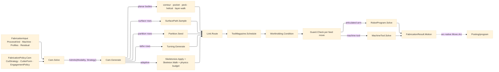

# [RASM_FABRICATION_MOTION]

The CAM-motion owner closes the `(ProcessModality, CutStrategy)` cross-product under one `Cam` fold. `Cam.Generate((ProcessModality, CutStrategy), MotionRun)` owns every 2.5D generator body, dispatches surface rows to `SurfacePath.Sample`, dispatches point-site regioning to `Partition.Seed`, dispatches turning rows to `Turning.Generate`, reads rest stock from `FabricationInput.Residual`, links every cut element through `Link.Route`, consults `ToolMagazine.Schedule`, conditions every committed feed move through `Workholding.Condition` and `Guard.Check`, then emits the conditioned `Motion` through `MachineTool.Solve` or `RobotProgram.Solve`. The fold emits owner-atom `Move` rows only; `CutProgram` remains posting-local, `Option<ArcCenter>` feeds the arc-native posting rail, and egress result cases never carry plane-internal AST or solver state.

## [01]-[INDEX]

- [01]-[CAM_MOTION]: owns `MotionRun`, `MotionElement`, `PeckCycle`, `LayerWalkPolicy`, `HelicalLaw`, the full strategy dispatch, the conditioning fold, and the machine/robot solve boundary.

## [02]-[CAM_MOTION]

- Owner: `Cam` owns `Solve`, `Generate`, and the committed-motion conditioning chain. `MotionRun` carries policy, input, fixture, guard stock, schedule context, and kinematics. `MotionElement`, `PeckCycle`, `LayerWalkPolicy`, and `HelicalLaw` keep generator state local.
- Cases: all 15 `CutStrategy` rows land as a body or dispatch arm in the fence. Planar rows emit contour, pocket, peck, adaptive, helix, and layer geometry; lathe rows dispatch `Turning.Generate`; surface and multi-axis rows dispatch `SurfacePath.Sample` and then `MachineTool.Solve`.
- Entry: `public static Fin<FabricationResult> Solve(FabricationPolicy.Cam policy, FabricationInput input)` is the owner-side CAM fold. `public static Fin<Seq<Move>> Generate((ProcessModality Modality, CutStrategy Strategy) pair, MotionRun run)` is the generator dispatch the fold calls after `ProcessModality.Admits` succeeds.
- Auto: `Solve` gates `Admits`, builds `MotionRun`, routes elements through `Link.Route`, consults `ToolMagazine.Schedule`, commits through `Workholding.Condition`, folds feed moves through `Guard.Check`, and solves robot or machine kinematics. `Generate` composes each strategy with its owning plane. `Motion` is already conditioned, so posting never applies kerf, tab, pierce, or lead compensation a second time.
- Receipt: `FabricationResult.Motion` is the public evidence: ordered atom-safe `Move` rows, machine or robot joint rows, duration, reached flag, and optional cell code. `ToolChange`, `LinkReceipt`, guard verdicts, surface receipts, partition diagrams, lathe operations, and machine blocks stay plane-local.
- Packages: `Process/owner#FABRICATION_OWNER` (`FabricationPolicy.Cam`, `FabricationInput`, `FabricationResult.Motion`, `Move`, `ArcCenter`, `Loop`, `CutterForm`, `ResidualStock`), `Process/family#PROCESS_FAMILY` (`ProcessModality.Admits`, `CutStrategy`, `CutDimensionality`, `Machine.Topology`), `Process/physics#CUT_PARAMETER` (`RemovalParameter.Budget`, `RemovalBudget.Subtractive`), `Tooling/magazine#TOOL_MAGAZINE` (`ToolMagazine.Schedule`, `WorkItem`, `SlotMap`, `MagazinePolicy`, `ToolAssembly`), `Toolpath/skeleton#SKELETON_WALK` (`Skeleton.Walk`), `Toolpath/surface#SURFACE_PATH` (`SurfacePath.Sample`), `Toolpath/partition#PARTITION` (`Partition.Seed`), `Toolpath/turning#TURNING` (`Turning.Generate`, `LatheOp`, `BarStock`), `Toolpath/link#LINK` (`Link.Route`), `Fixturing/workholding#WORKHOLDING` (`Workholding.Condition`), `Toolpath/guard#GUARD` (`Guard.Check`), `Kinematics/machine#MACHINE_TOOL` (`MachineTool.Solve`), `Kinematics/cell#ROBOT_CELL` (`RobotProgram.Solve`), LanguageExt.Core, Thinktecture.Runtime.Extensions, Rhino.Geometry, BCL inbox.
- Growth: a new strategy is one `CutStrategy` row, one `Generate` arm, and one admission-set edit on each admitting `ProcessModality`. Surface, retract, guard, and topology growth land on their owning planes. The CAM surface stays two entries.
- Boundary: `Cam` is the only motion generator owner. Strategy variation is a dispatch arm, modality variation is an admitted pair, and machine variation is a solve boundary. Turning, surface, partition, skeleton, Link, Guard, Workholding, ToolMagazine, MachineTool, RobotProgram, and Posting keep their owned mechanics.

```csharp signature
// --- [RUNTIME_PRELUDE] --------------------------------------------------------------------
using LanguageExt;
using LanguageExt.Common;
using Rasm.Fabrication.Fixturing;
using Rasm.Fabrication.Geometry2D;
using Rasm.Fabrication.Kinematics;
using Rasm.Fabrication.Process;
using Rasm.Fabrication.Spec;
using Rasm.Fabrication.Tooling;
using Rasm.Meshing;
using Rhino.Geometry;
using Thinktecture;
using static LanguageExt.Prelude;

namespace Rasm.Fabrication.Toolpath;

// --- [MODELS] -----------------------------------------------------------------------------
public sealed record MotionRun(
    FabricationPolicy.Cam Policy,
    FabricationInput Input,
    Fixture Fixture,
    Stock Stock,
    Magazine Magazine,
    SlotMap Slots,
    Seq<WorkItem> Work,
    MachineKinematics Kinematics,
    Material Material,
    ToolAssembly Assembly,
    Operation Operation) {
    public (ProcessModality Modality, CutStrategy Strategy) Pair => (Input.Process.Modality, Policy.Strategy);

    public static Fin<MotionRun> Of(FabricationPolicy.Cam policy, FabricationInput input) =>
        MotionContext.Of(policy, input);
}

public sealed record MotionElement(Seq<Move> Feed) {
    public Fin<CutElement> ToCut() =>
        Feed.IsEmpty
            ? Fin.Fail<CutElement>(GeometryFault.DegenerateInput("cam:empty-element").ToError())
            : Fin.Succ(CutElement.Of(Feed));
}

public readonly record struct PeckCycle(double Clearance, double StepDown, double Depth, double DwellSeconds) {
    public static readonly PeckCycle Canonical = new(Clearance: 5.0, StepDown: 2.0, Depth: 12.0, DwellSeconds: 0.25);
}

public readonly record struct LayerWalkPolicy(SeamPolicy Seam, PartitionStrategy Infill, double TravelClearance) {
    public static readonly LayerWalkPolicy Canonical = new(SeamPolicy.Nearest, PartitionStrategy.PenPlot, TravelClearance: 2.0);
}

public readonly record struct HelicalLaw(double Radius, double Lead, int Turns, int SamplesPerTurn) {
    public static HelicalLaw Of(FabricationPolicy.Cam policy) =>
        new(policy.Cutter.Diameter * 0.5, Math.Max(policy.StepOver, 1e-3), Math.Max(1, policy.Passes), SamplesPerTurn: 48);
}

public readonly record struct EngagementBudget(RemovalBudget.Subtractive Budget, EngagementPolicy Engagement) {
    public EngagementPolicy Bound =>
        new(
            TargetAngle: Engagement.TargetAngle,
            MaxAxialDepth: Math.Min(
                Engagement.MaxAxialDepth,
                Math.Max(1e-3, Budget.DepthOfCut)));
}

// --- [OPERATIONS] -------------------------------------------------------------------------
public static class Cam {
    public static Fin<FabricationResult> Solve(FabricationPolicy.Cam policy, FabricationInput input) =>
        !input.Process.Modality.Admits(policy.Strategy)
            ? Fin.Fail<FabricationResult>(FabricationFault.InadmissiblePair((input.Process.Modality, policy.Strategy)).ToError())
            : OpenProfile(input).Match(
                Some: row => Fin.Fail<FabricationResult>(FabricationFault.OpenLoop(FabConcern.Toolpath, row.Index).ToError()),
                None: () => MotionRun.Of(policy, input).Bind(run =>
                    Elements(run).Bind(elements =>
                        elements.Traverse(static e => e.ToCut()).Bind(cuts =>
                            ToolMagazine.Schedule(run.Magazine, run.Slots, run.Work, MagazinePolicy.Canonical).Bind(_ =>
                                Link.Route(cuts, input, LinkPolicy.Default).Bind(linked =>
                                    Commit(run, linked.Moves).Bind(solved =>
                                        Fin.Succ((FabricationResult)solved))))))));

    public static Fin<Seq<Move>> Generate((ProcessModality Modality, CutStrategy Strategy) pair, MotionRun run) =>
        pair.Strategy.Switch(
            boundaryPass:  _ => Contour(run),
            pocketClear:   _ => Pocket(run),
            peck:          _ => Peck(run),
            adaptive:      _ => Adaptive(run),
            radialSweep:   _ => Turn(run, new LatheOp.TurnRough(RoughCycle.G71Longitudinal, run.Policy.StepOver, AllowanceX: 0.5, AllowanceZ: 0.1)),
            plungeDwell:   _ => Turn(run, new LatheOp.Groove(Width: run.Policy.Cutter.Diameter, Depth: run.Policy.StepOver, PeckFraction: 0.4, DwellRevs: 1.0)),
            helical:       _ => Helical(run),
            threadMill:    _ => Surface(run, SurfaceThread(run)),
            layerWalk:     _ => LayerWalk(run),
            waterline:     _ => Surface(run, SurfaceWaterline(run)),
            scallop:       _ => Surface(run, SurfaceScallop(run)),
            pencil:        _ => Surface(run, SurfacePencil(run)),
            rest:          _ => Rest(run),
            threePlusTwo:  _ => Surface(run, SurfaceThreePlusTwo(run)),
            swarf:         _ => Surface(run, SurfaceSwarf(run)));

    static Option<(int Index, Loop Loop)> OpenProfile(FabricationInput input) =>
        toSeq(input.Profiles).Map(static (index, loop) => (Index: index, Loop: loop)).Find(static row => !row.Loop.Closed);

    static Fin<Seq<MotionElement>> Elements(MotionRun run) =>
        toSeq(run.Input.Profiles)
            .Map(loop => run with { Input = run.Input with { Profiles = Arr(loop.AsCcw()) } })
            .Traverse(local => Generate(local.Pair, local).Map(moves => new MotionElement(moves)))
            .Map(static rows => rows.ToSeq());

    static Fin<FabricationResult.Motion> Commit(MotionRun run, Seq<Move> linked) =>
        Workholding.Condition(linked, run.Fixture)
            .Bind(conditioned => conditioned.Fold(
                Fin.Succ((Cursor: Point3d.Origin, Accepted: Seq<Move>())),
                (state, move) => state.Bind(cursor => Guarded(run, cursor, move))))
            .Bind(state => run.Input.Cell.Match(
                Some: cell => RobotProgram.Solve(cell, state.Accepted, run.Policy.Cell),
                None: () => MachineTool.Solve(run.Kinematics, state.Accepted)));

    static Fin<(Point3d Cursor, Seq<Move> Accepted)> Guarded(
        MotionRun run,
        (Point3d Cursor, Seq<Move> Accepted) state,
        Move move) =>
        Guard.Check(move, new Part(state.Cursor, run.Input.Keepouts), run.Stock, run.Fixture) switch {
            Verdict.Clear => Fin.Succ((move.To, state.Accepted.Add(move))),
            Verdict.Clearance clearance => Fin.Succ((move.To, state.Accepted.Concat(clearance.Retract).Add(move))),
            Verdict.Gouge gouge => Fin.Fail<(Point3d, Seq<Move>)>(FabricationFault.Gouge(gouge.Surface, run.Policy.Cutter).ToError()),
            Verdict.Collision collision => Fin.Fail<(Point3d, Seq<Move>)>(FabricationFault.Collision(collision.Obstacle).ToError()),
            _ => Fin.Fail<(Point3d, Seq<Move>)>(GeometryFault.DegenerateInput("cam:guard-verdict").ToError()),
        };

    static Fin<Seq<Move>> Contour(MotionRun run) =>
        PolygonAlgebra.Offset(run.Input.Profiles, -(run.Policy.Cutter.Diameter * 0.5), OffsetEnds.Polygon)
            .Map(static loops => loops.Bind(static loop => toSeq(loop.Vertices).Map(static point => new Move(point, Rapid: false, Feed: 1.0))));

    static Fin<Seq<Move>> Pocket(MotionRun run) =>
        run.Input.Profiles.HeadOrNone().ToFin(GeometryFault.DegenerateInput("cam:pocket-profile").ToError())
            .Bind(loop => Partition.Seed(PartitionStrategy.PocketRegion, loop))
            .Map(regions => regions.Bind(region => PolygonAlgebra.Offset(Seq(region), -run.Policy.StepOver, OffsetEnds.Polygon).IfFail(Seq(region)))
                .Bind(static loop => toSeq(loop.Vertices).Map(static point => new Move(point, Rapid: false, Feed: 1.0))));

    static Fin<Seq<Move>> Peck(MotionRun run) =>
        run.Input.Profiles.HeadOrNone().ToFin(GeometryFault.DegenerateInput("cam:peck-profile").ToError())
            .Bind(loop => Partition.Seed(PartitionStrategy.Stipple, loop))
            .Map(regions => regions.Map(static cell => cell.Bound().Center).Bind(center => PeckAt(center, PeckCycle.Canonical)));

    static Seq<Move> PeckAt(Point3d center, PeckCycle cycle) =>
        Range(1, Math.Max(1, (int)Math.Ceiling(cycle.Depth / cycle.StepDown))).Bind(step => {
            double z = center.Z - Math.Min(cycle.Depth, step * cycle.StepDown);
            return Seq(
                new Move(new Point3d(center.X, center.Y, cycle.Clearance), Rapid: true, Feed: 0.0),
                new Move(new Point3d(center.X, center.Y, z), Rapid: false, Feed: 1.0),
                new Move(new Point3d(center.X, center.Y, cycle.Clearance), Rapid: true, Feed: 0.0));
        });

    static Fin<Seq<Move>> Adaptive(MotionRun run) =>
        RemovalParameter.Budget(run.Input.Process, run.Material, run.Assembly, run.Operation)
            .Bind(static budget => budget is RemovalBudget.Subtractive sub
                ? Fin.Succ(sub)
                : Fin.Fail<RemovalBudget.Subtractive>(GeometryFault.DegenerateInput("cam:adaptive-budget").ToError()))
            .Bind(budget => run.Input.Profiles.HeadOrNone().ToFin(GeometryFault.DegenerateInput("cam:adaptive-profile").ToError())
                .Bind(loop => Skeletonize.Apply(new SkeletonOp.Medial(loop.AsCcw()))
                    .Bind(skeleton => Skeleton.Walk(skeleton, new EngagementBudget(budget, run.Policy.Engagement).Bound))));

    static Fin<Seq<Move>> Turn(MotionRun run, LatheOp op) =>
        run.Input.Model.ToFin(GeometryFault.DegenerateInput("cam:turn-model").ToError())
            .Bind(model => BarStock.Of(model, Vector3d.ZAxis))
            .Bind(stock => run.Input.Profiles.HeadOrNone().ToFin(GeometryFault.DegenerateInput("cam:turn-profile").ToError())
                .Bind(profile => RemovalParameter.Budget(run.Input.Process, run.Material, run.Assembly, run.Operation)
                    .Bind(static budget => budget is RemovalBudget.Subtractive sub
                        ? Fin.Succ(sub)
                        : Fin.Fail<RemovalBudget.Subtractive>(GeometryFault.DegenerateInput("cam:turn-budget").ToError()))
                    .Bind(budget => Turning.Generate(op, new TurnJob(profile, stock, run.Policy.Cutter, NosePosition.P3, new SpindleMode.Css(200.0, 4000.0), budget)))));

    static Fin<Seq<Move>> Helical(MotionRun run) =>
        run.Input.Profiles.HeadOrNone().ToFin(GeometryFault.DegenerateInput("cam:helical-profile").ToError())
            .Map(loop => {
                HelicalLaw law = HelicalLaw.Of(run.Policy);
                Point3d center = loop.Bound().Center;
                int samples = law.Turns * law.SamplesPerTurn;
                return Range(0, samples + 1).Map(index => {
                    double angle = Math.Tau * index / law.SamplesPerTurn;
                    Point3d point = new(center.X + law.Radius * Math.Cos(angle), center.Y + law.Radius * Math.Sin(angle), center.Z - law.Lead * index / law.SamplesPerTurn);
                    Point3d arcCenter = new(center.X, center.Y, point.Z);
                    return new Move(point, Rapid: index == 0, Feed: 1.0, Arc: index == 0 ? None : Some(new ArcCenter(arcCenter, Clockwise: false)));
                });
            });

    static Fin<Seq<Move>> LayerWalk(MotionRun run) =>
        run.Input.Profiles.HeadOrNone().ToFin(GeometryFault.DegenerateInput("cam:layer-profile").ToError())
            .Bind(loop => Partition.Seed(LayerWalkPolicy.Canonical.Infill, loop)
                .Map(infill => OrderedLayer(loop.AsCcw(), infill, LayerWalkPolicy.Canonical)));

    static Seq<Move> OrderedLayer(Loop perimeter, Seq<Loop> infill, LayerWalkPolicy policy) {
        int seam = Range(0, perimeter.Count).OrderBy(index => policy.Seam.Score(perimeter, Point3d.Origin, index)).Head;
        Seq<Move> boundary = Range(0, perimeter.Count + 1).Map(index => new Move(perimeter.At(seam + index), Rapid: false, Feed: 1.0));
        Seq<Move> fill = PolygonAlgebra.NestingOrder(infill.ToArr())
            .Bind(index => toSeq(infill[index].Vertices).OrderBy(static point => point.X).Map(static point => new Move(point, Rapid: false, Feed: 1.0)));
        return boundary.Concat(Comb(boundary.Last.To, fill.HeadOrNone().Map(static move => move.To), policy)).Concat(fill);
    }

    static Seq<Move> Comb(Point3d from, Option<Point3d> to, LayerWalkPolicy policy) =>
        to.Match(
            Some: point => Seq(
                new Move(new Point3d(from.X, from.Y, from.Z + policy.TravelClearance), Rapid: true, Feed: 0.0),
                new Move(new Point3d(point.X, point.Y, point.Z + policy.TravelClearance), Rapid: true, Feed: 0.0),
                new Move(point, Rapid: true, Feed: 0.0)),
            None: () => Seq<Move>());

    static Fin<Seq<Move>> Rest(MotionRun run) =>
        run.Input.Residual.ToFin(GeometryFault.DegenerateInput("cam:rest-residual").ToError())
            .Bind(residual => Surface(run, SurfaceRest(run, residual)));

    static Fin<Seq<Move>> Surface(MotionRun run, SurfaceStrategy strategy) =>
        run.Input.Model.ToFin(GeometryFault.DegenerateInput("cam:surface-model").ToError())
            .Bind(model => SurfacePath.Sample(strategy, model, run.Policy.Cutter));

    static SurfaceStrategy SurfaceWaterline(MotionRun run) =>
        new SurfaceStrategy.Waterline(SurfacePolicyOf(run), Arr(0.0, run.Policy.StepOver), Adaptive: false);

    static SurfaceStrategy SurfaceScallop(MotionRun run) =>
        new SurfaceStrategy.Scallop(SurfacePolicyOf(run), SurfaceDriveSetOf(SurfaceLayoutKind.ConstantStepover, run));

    static SurfaceStrategy SurfacePencil(MotionRun run) =>
        new SurfaceStrategy.Pencil(SurfacePolicyOf(run), SurfaceDriveSetOf(SurfaceLayoutKind.Flowline, run), ContactAngleDeg: 25.0);

    static SurfaceStrategy SurfaceRest(MotionRun run, ResidualStock stock) =>
        new SurfaceStrategy.Rest(SurfacePolicyOf(run), SurfaceDriveSetOf(SurfaceLayoutKind.CrossField, run), stock);

    static SurfaceStrategy SurfaceThreePlusTwo(MotionRun run) =>
        new SurfaceStrategy.ThreePlusTwo(SurfacePolicyOf(run), SurfaceDriveSetOf(SurfaceLayoutKind.GeodesicParallel, run), Arr(run.Input.View));

    static SurfaceStrategy SurfaceSwarf(MotionRun run) =>
        new SurfaceStrategy.Swarf(SurfacePolicyOf(run), SurfaceDriveSetOf(SurfaceLayoutKind.Morph, run), run.Input.View, FlankOffsetMm: run.Policy.StepOver);

    static SurfaceStrategy SurfaceThread(MotionRun run) =>
        new SurfaceStrategy.ThreadMill(SurfacePolicyOf(run), SurfaceDriveSetOf(SurfaceLayoutKind.ConstantStepover, run), PitchMm: run.Policy.StepOver, DepthMm: run.Policy.Cutter.Diameter);

    static SurfacePolicy SurfacePolicyOf(MotionRun run) =>
        new(RaTarget.Fine, new SurfaceSampling(0.05, run.Policy.StepOver, 0.98, Environment.ProcessorCount, 256),
            new SurfaceEngagement(new RemovalBudget.Subtractive(0.0, 1.0, run.Policy.StepOver, 0.0), run.Policy.Engagement, run.Policy.StepOver, run.Policy.StepOver));

    static SurfaceDriveSet SurfaceDriveSetOf(SurfaceLayoutKind kind, MotionRun run) =>
        new(kind, run.Input.Profiles.Bind(loop => toSeq(loop.Vertices).Map(point => new SurfaceDrive(kind, Arr(point), None, 0.0))), run.Policy.StepOver);
}
```


