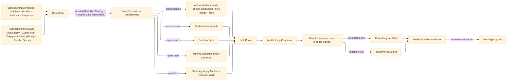

# [RASM_FABRICATION_MOTION]

The CAM-motion owner closes the `(ProcessModality, CutStrategy)` cross-product under one `Cam` fold and MINTS the Toolpath engagement vocabulary: `EngagementPolicy` — the physics-admitted budget, the engagement bounds, the finish target, and the cut sense — is the one policy value `FabricationPolicy.Cam` carries and every generator arm reads, so feed, compensation, step-down, and chord sizing all derive from the admitted `RemovalBudget` case and no arm re-derives physics or carries a unit literal. `Cam.Solve` gates `ProcessModality.Admits`, gates closed-profile demand per strategy (lathe arms admit the open ZX profile by design; every open profile of a closed-demand strategy accumulates into ONE `ManyErrors` refusal), builds `MotionRun` inline from exactly what `FabricationInput` carries, dispatches `Cam.Generate` to per-strategy `CutElement` chains, links them through `Link.Route`, conditions through `Workholding.Condition`, folds every committed move through the fail-closed `Guard.Check`, then solves machine or robot kinematics. The fold emits owner-atom `Move` rows only; `CutProgram` remains posting-local, `Option<ArcCenter>` feeds the arc-native posting rail, and egress result cases never carry plane-internal AST or solver state.

## [01]-[INDEX]

- [01]-[CAM_MOTION]: owns `EngagementPolicy`, `SeamPolicy`, `HoleCycle`/`HoleLaw`, `LatheLaw`, `HelicalLaw`, `LayerWalkPolicy`, `MotionRun`, the full 15-arm strategy dispatch, the conditioning fold, and the machine/robot solve boundary.

## [02]-[CAM_MOTION]

- Owner: `Cam` owns `Solve`, `Generate`, and the committed-motion conditioning chain. `EngagementPolicy` is the Toolpath-minted policy leaf `Process/owner` imports; `SeamPolicy` the layer-walk seam-scoring vocabulary; `HoleCycle` the hole-making cycle family; `LatheLaw`/`HelicalLaw`/`LayerWalkPolicy` the budget-derived generator laws; `MotionRun` the run context built from `(policy, input)` alone — the phantom external context builder is dead.
- Cases: all 15 `CutStrategy` rows land as one `Generate` arm each. `boundary-pass` is the multi-pass compensated contour with tangent lead arcs and cut-sense orientation; `pocket-clear` is offset-to-exhaustion clearing over Voronoi regions; `peck` is the hole-making family expanding `HoleCycle` rows at profile centers (top-of-hole Z sampled through `SurfaceStrategy.DrillFamily` when a model is mounted); `adaptive` routes the kernel 2D medial (`Offsetting.Apply(OffsetOp.Medial(...))` → `OffsetResult.Axis`) into `Skeleton.Walk`; `radial-sweep`/`plunge-dwell` dispatch `Turning.Generate` under `LatheLaw`; `helical` and `thread-mill` are the one helix generator at budget lead versus thread pitch; `layer-walk` walks perimeter-then-infill under `SeamPolicy`; the six surface rows dispatch `SurfacePath.Sample`.
- Entry: `public static Fin<FabricationResult> Solve(FabricationPolicy.Cam policy, FabricationInput input)` is the owner-side CAM fold. `public static Fin<Seq<CutElement>> Generate((ProcessModality Modality, CutStrategy Strategy) pair, MotionRun run)` is the generator dispatch the fold calls after admission — elements, not flat moves, so linking composes without re-segmentation.
- Auto: `EngagementPolicy.Feed` and `EngagementPolicy.Compensation(cutter)` are the two budget-case projections every arm shares — subtractive feeds ride `FeedRate` and compensate by cutter radius, thermal feeds ride `CutSpeed` and compensate by `KerfWidth/2`, abrasive/erosion ride their traverse and wire columns — so modality genuinely changes generated motion, never just the admission gate. `Solve` builds `MotionRun` from input truth only: `Fixture.Free` on the direct path (the setup-scoped fixture arrives when `Fixturing/setups` drives the derive pipeline), input keep-outs as one clamp-kind `ExclusionZone`, snapshots and raw blank from the input carry, and `Option.None` channel/index (the kernel channel and BVH mount when the derivation composes them — absent means the gate is skipped, never faked). Tool scheduling is NOT consulted here: `FabricationInput` carries no magazine, so the `ToolMagazine.Schedule` gate lives on the `Process/derivation` orchestrator where the work list exists; the former phantom-fed consult is dead.
- Receipt: `FabricationResult.Motion` is the public evidence: ordered atom-safe `Move` rows, machine or robot joint rows, duration, reached flag, and optional cell code. `LinkReceipt`, guard verdicts, surface receipts, partition diagrams, and lathe operations stay plane-local.
- Packages: `Process/owner#FABRICATION_OWNER` (`FabricationPolicy.Cam`, `FabricationInput`, `FabricationResult.Motion`, `Move`, `ArcCenter`, `Loop`, `CutterForm`, `ResidualStock`), `Process/family#PROCESS_FAMILY` (`ProcessModality.Admits`, `CutStrategy`, `CutDimensionality`), `Process/physics#CUT_PARAMETER` (`RemovalBudget` — admitted ONCE into `EngagementPolicy` by the policy author via `RemovalParameter.Budget`/`CuttingData`, never re-derived per arm), `Spec/tolerance#TOLERANCE` (`RaTarget`, `Tolerance.ScallopStep`), `Geometry2D/algebra#POLYGON_ALGEBRA` (`Offset`, `Clip`, `Area`, `NestingOrder`), `Geometry2D/arcs#ARC_ALGEBRA` (`LeadArc`, `LeadKind`, `AdaptiveSense`), kernel `Rasm.Meshing` (`Offsetting.Apply`, `OffsetOp.Medial`, `OffsetResult.Axis`, `OffsetPolicy.Canonical`), `Toolpath/skeleton#SKELETON_WALK` (`Skeleton.Walk`), `Toolpath/surface#SURFACE_PATH` (`SurfacePath.Sample`, `SurfaceStrategy`, `SurfaceLayoutKind`, `SurfacePolicy`, `SurfaceSampling`), `Toolpath/partition#PARTITION` (`Partition.Seed`), `Toolpath/turning#TURNING` (`Turning.Generate`, `LatheOp`, `TurnJob`, `BarStock`, `SpindleMode`, `NosePosition`, `RoughCycle`), `Toolpath/link#LINK` (`Link.Route`, `LinkPolicy`, `CutElement`), `Fixturing/workholding#WORKHOLDING` (`Workholding.Condition`, `Fixture`, `ExclusionZone`, `WorkholdingKind`), `Toolpath/guard#GUARD` (`Guard.Check`, `Stock`, `Part`, `GuardPolicy`, `Verdict`), `Kinematics/machine#MACHINE_TOOL` (`MachineTool.Solve`), `Kinematics/cell#ROBOT_CELL` (`RobotProgram.Solve`), LanguageExt.Core, Thinktecture.Runtime.Extensions, Rhino.Geometry, BCL inbox.
- Growth: a new strategy is one `CutStrategy` row, one `Generate` arm, and one admission-set edit on each admitting `ProcessModality`; a new hole cycle is one `HoleCycle` row; a new seam posture is one `SeamPolicy` row; surface, retract, guard, and topology growth land on their owning planes. The CAM surface stays two entries.
- Boundary: `Cam` is the only motion generator owner. Strategy variation is a dispatch arm, modality variation is a budget-case projection, machine variation is a solve boundary. Turning, surface, partition, skeleton, Link, Guard, Workholding, MachineTool, RobotProgram, and Posting keep their owned mechanics. A per-arm physics re-derivation, a fabricated zero budget, a unit-literal feed, a caller-built `SurfaceDriveSet`, and a phantom-fed context builder are the deleted forms.

```csharp signature
// --- [RUNTIME_PRELUDE] --------------------------------------------------------------------
using LanguageExt;
using LanguageExt.Common;
using Rasm.Fabrication.Fixturing;
using Rasm.Fabrication.Geometry2D;
using Rasm.Fabrication.Kinematics;
using Rasm.Fabrication.Process;
using Rasm.Fabrication.Spec;
using Rasm.Meshing;
using Rasm.Numerics;
using Rhino.Geometry;
using Thinktecture;
using static LanguageExt.Prelude;

namespace Rasm.Fabrication.Toolpath;

// --- [CONSTANTS] ----------------------------------------------------------------------------
// Named sampling anchors for the surface dispatch — policy rows, never inline literals in arms.
static class SamplingDefaults {
    public const double MinStepFraction = 0.25;
    public const double CosLimit = 0.98;
    public const int MaxIterations = 256;
}

// --- [MODELS] -------------------------------------------------------------------------------
// The Toolpath-minted engagement leaf Process/owner imports onto FabricationPolicy.Cam: the physics
// budget is ADMITTED ONCE here by the policy author (RemovalParameter.Budget / CuttingData at the
// mint site); every generator arm derives feed, compensation, and step-down from it.
public sealed record EngagementPolicy(RemovalBudget Budget, double TargetAngle, double MaxAxialDepth, RaTarget Finish, AdaptiveSense Sense) {
    public static readonly EngagementPolicy Canonical = new(
        new RemovalBudget.Subtractive(SpindleRpm: 8000.0, FeedRate: 800.0, DepthOfCut: 1.0, MaterialRemovalRate: 800.0),
        TargetAngle: 40.0, MaxAxialDepth: 2.0, new RaTarget(Micrometers: 3.2, ScallopCoefficient: 1.0), AdaptiveSense.Climb);

    // The one feed projection: each budget case names its motion-speed column; resin exposure has no
    // XY feed and projects zero, which the additive plane never consumes as a cut feed.
    public double Feed => Budget.Switch(
        subtractive: static b => b.FeedRate,
        thermal:     static b => b.CutSpeed,
        abrasive:    static b => b.TraverseSpeed,
        additive:    static b => b.PrintSpeed,
        deposition:  static b => b.WireFeedRate,
        erosion:     static b => b.WireFeed,
        resin:       static _ => 0.0,
        powder:      static b => b.ScanSpeed,
        formed:      static _ => 0.0);

    // The one compensation projection: contact processes compensate by cutter radius, beam/jet/wire
    // processes by their kerf or tool half-width.
    public double Compensation(CutterForm cutter) => Budget.Switch(
        subtractive: _ => cutter.Diameter * 0.5,
        thermal:     static b => b.KerfWidth * 0.5,
        abrasive:    _ => cutter.Diameter * 0.5,
        additive:    static b => b.ExtrusionWidth * 0.5,
        deposition:  _ => cutter.Diameter * 0.5,
        erosion:     _ => cutter.Diameter * 0.5,
        resin:       _ => 0.0,
        powder:      static b => b.HatchSpacing * 0.5,
        formed:      _ => 0.0);

    public double StepDown => Budget.Switch(
        subtractive: static b => b.DepthOfCut,
        thermal:     static _ => 0.0,
        abrasive:    static _ => 0.0,
        additive:    static b => b.LayerHeight,
        deposition:  static _ => 0.0,
        erosion:     static _ => 0.0,
        resin:       static b => b.CureDepth,
        powder:      static _ => 0.0,
        formed:      static _ => 0.0);
}

// Layer-walk seam scoring rows: Nearest anchors the seam at the vertex closest to the reference,
// Sharpest at the most concave corner so the witness line hides in geometry.
[SmartEnum<string>]
public sealed partial class SeamPolicy {
    public static readonly SeamPolicy Nearest = new("nearest", NearestScore);
    public static readonly SeamPolicy Sharpest = new("sharpest", SharpestScore);

    [UseDelegateFromConstructor]
    public partial double Score(Loop perimeter, Point3d reference, int index);

    static double NearestScore(Loop perimeter, Point3d reference, int index) => perimeter.At(index).DistanceTo(reference);

    static double SharpestScore(Loop perimeter, Point3d reference, int index) =>
        (perimeter.At(index) - perimeter.At(index - 1)) is var into && (perimeter.At(index + 1) - perimeter.At(index)) is var outof
            ? Vector3d.VectorAngle(into, outof)
            : 0.0;
}

public readonly record struct HoleLaw(double Clearance, double StepDown, double Depth, double DwellSeconds) {
    // Depth is the pass ladder (passes x budget step-down); the retract clearance is one step above top.
    public static HoleLaw Of(EngagementPolicy engagement, int passes) =>
        new(
            Clearance: Math.Max(1e-3, engagement.StepDown),
            StepDown: Math.Max(1e-3, engagement.StepDown),
            Depth: Math.Max(1, passes) * Math.Max(1e-3, engagement.StepDown),
            DwellSeconds: 0.0);
}

// The hole-making family: each row expands one canned-cycle shape to explicit Move rows; posting-side
// cycle-word recovery consumes the expanded stream until a cycle-identity column lands on the atoms.
[SmartEnum<string>]
public sealed partial class HoleCycle {
    public static readonly HoleCycle Spot = new("spot", SpotMoves);
    public static readonly HoleCycle Drill = new("drill", DrillMoves);
    public static readonly HoleCycle Peck = new("peck", PeckMoves);
    public static readonly HoleCycle Tap = new("tap", TapMoves);
    public static readonly HoleCycle Bore = new("bore", BoreMoves);

    [UseDelegateFromConstructor]
    public partial Seq<Move> Expand(Point3d top, HoleLaw law, double feed);

    static Seq<Move> SpotMoves(Point3d top, HoleLaw law, double feed) =>
        Approach(top, law).Concat(Seq(
            new Move(top with { Z = top.Z - (law.StepDown * 0.5) }, Rapid: false, Feed: feed),
            new Move(top with { Z = top.Z + law.Clearance }, Rapid: true, Feed: 0.0)));

    static Seq<Move> DrillMoves(Point3d top, HoleLaw law, double feed) =>
        Approach(top, law).Concat(Seq(
            new Move(top with { Z = top.Z - law.Depth }, Rapid: false, Feed: feed),
            new Move(top with { Z = top.Z + law.Clearance }, Rapid: true, Feed: 0.0)));

    static Seq<Move> PeckMoves(Point3d top, HoleLaw law, double feed) =>
        Approach(top, law).Concat(
            Range(1, Math.Max(1, (int)Math.Ceiling(law.Depth / law.StepDown))).ToSeq().Bind(step => Seq(
                new Move(top with { Z = top.Z - Math.Min(law.Depth, step * law.StepDown) }, Rapid: false, Feed: feed),
                new Move(top with { Z = top.Z + law.Clearance }, Rapid: true, Feed: 0.0))));

    static Seq<Move> TapMoves(Point3d top, HoleLaw law, double feed) =>
        Approach(top, law).Concat(Seq(
            new Move(top with { Z = top.Z - law.Depth }, Rapid: false, Feed: feed),
            new Move(top with { Z = top.Z + law.Clearance }, Rapid: false, Feed: feed)));

    static Seq<Move> BoreMoves(Point3d top, HoleLaw law, double feed) =>
        Approach(top, law).Concat(Seq(
            new Move(top with { Z = top.Z - law.Depth }, Rapid: false, Feed: feed),
            new Move(top with { Z = top.Z + law.Clearance }, Rapid: false, Feed: feed)));

    static Seq<Move> Approach(Point3d top, HoleLaw law) =>
        Seq1(new Move(top with { Z = top.Z + law.Clearance }, Rapid: true, Feed: 0.0));
}

// Lathe generator law derived from the budget: cycle depth is the budget step-down, allowances are
// stepover fractions, CSS surface speed recovers from the spindle floor at tool diameter.
public sealed record LatheLaw(LatheOp Rough, LatheOp Groove, SpindleMode Spindle, NosePosition Tip) {
    public static Fin<LatheLaw> Of(FabricationPolicy.Cam policy) =>
        policy.Engagement.Budget is RemovalBudget.Subtractive budget
            ? Fin.Succ(new LatheLaw(
                new LatheOp.TurnRough(RoughCycle.G71Longitudinal, budget.DepthOfCut, AllowanceX: policy.StepOver * 0.5, AllowanceZ: policy.StepOver * 0.1),
                new LatheOp.Groove(Width: policy.Cutter.Diameter, Depth: budget.DepthOfCut, PeckFraction: policy.Engagement.TargetAngle / 180.0, DwellRevs: 1.0),
                new SpindleMode.Css(SurfaceMpm: budget.SpindleRpm * Math.PI * policy.Cutter.Diameter / 1000.0, MaxRpm: budget.SpindleRpm),
                NosePosition.P3))
            : Fin.Fail<LatheLaw>(GeometryFault.DegenerateInput("cam:lathe-non-subtractive-budget").ToError());
}

public readonly record struct HelicalLaw(double Radius, double Lead, int Turns, int SamplesPerTurn) {
    // Lead is the budget step-down for helical entry and the THREAD PITCH (policy StepOver carries the
    // lead for the thread-mill strategy); samples honor the scallop chord around the circumference.
    public static HelicalLaw Of(double radius, double lead, int turns, double chord) =>
        new(radius, Math.Max(lead, 1e-3), Math.Max(1, turns),
            SamplesPerTurn: Math.Max(8, (int)Math.Ceiling(Math.Tau * Math.Max(radius, 1e-3) / Math.Max(chord, 1e-3))));
}

public readonly record struct LayerWalkPolicy(SeamPolicy Seam, PartitionStrategy Infill, double TravelClearance) {
    public static Fin<LayerWalkPolicy> Of(EngagementPolicy engagement) =>
        engagement.Budget is RemovalBudget.Additive budget
            ? Fin.Succ(new LayerWalkPolicy(SeamPolicy.Nearest, PartitionStrategy.PenPlot, TravelClearance: 2.0 * budget.LayerHeight))
            : Fin.Fail<LayerWalkPolicy>(GeometryFault.DegenerateInput("cam:layer-non-additive-budget").ToError());
}

public sealed record MotionRun(
    FabricationPolicy.Cam Policy, FabricationInput Input, Fixture Fixture, Stock Stock, Option<MachineKinematics> Kinematics) {
    public (ProcessModality Modality, CutStrategy Strategy) Pair => (Input.Process.Modality, Policy.Strategy);

    public double Chord => Tolerance.ScallopStep(Policy.Engagement.Finish, Policy.Cutter);

    // Built from exactly what the input carries: Free fixture on the direct path, input keep-outs as one
    // clamp-kind zone, carried snapshots, None channel/index/kinematics until the derivation mounts them.
    public static MotionRun Of(FabricationPolicy.Cam policy, FabricationInput input) =>
        new(policy, input, Fixture.Free,
            new Stock(
                RawBlank: input.Profiles.ToSeq(),
                Keepouts: input.Keepouts.IsEmpty
                    ? Seq<ExclusionZone>()
                    : Seq1(new ExclusionZone(Operation: 0, WorkholdingKind.Clamp, input.Keepouts.ToSeq(), Height: double.MaxValue)),
                Snapshots: input.Snapshots,
                Cutter: policy.Cutter,
                Assembly: None,
                Channel: None,
                Index: None,
                GuardPolicy.Default),
            Kinematics: None);
}

// --- [OPERATIONS] -------------------------------------------------------------------------
public static class Cam {
    // Strategies whose planar bodies demand closed profiles; the lathe pair admits the open ZX profile
    // by design and the surface rows never read profiles.
    static readonly Set<CutStrategy> RequiresClosed = Set(
        CutStrategy.BoundaryPass, CutStrategy.PocketClear, CutStrategy.Peck, CutStrategy.Adaptive,
        CutStrategy.Helical, CutStrategy.ThreadMill, CutStrategy.LayerWalk);

    public static Fin<FabricationResult> Solve(FabricationPolicy.Cam policy, FabricationInput input) =>
        from _ in input.Process.Modality.Admits(policy.Strategy)
            ? Fin.Succ(unit)
            : Fin.Fail<Unit>(FabricationFault.InadmissiblePair((input.Process.Modality, policy.Strategy)).ToError())
        from __ in ClosedGate(policy.Strategy, input)
        let run = MotionRun.Of(policy, input)
        from elements in Generate(run.Pair, run)
        from linked in Link.Route(elements, input, LinkPolicy.Default)
        from solved in Commit(run, linked.Moves)
        select (FabricationResult)solved;

    public static Fin<Seq<CutElement>> Generate((ProcessModality Modality, CutStrategy Strategy) pair, MotionRun run) =>
        pair.Strategy.Switch(
            boundaryPass: _ => Contour(run),
            pocketClear:  _ => Pocket(run),
            peck:         _ => Holes(run),
            adaptive:     _ => Adaptive(run),
            radialSweep:  _ => Turn(run, static law => law.Rough),
            plungeDwell:  _ => Turn(run, static law => law.Groove),
            helical:      _ => Helical(run, run.Policy.Engagement.StepDown),
            threadMill:   _ => Helical(run, run.Policy.StepOver),
            layerWalk:    _ => LayerWalk(run),
            waterline:    _ => Surface(run, SurfaceWaterline(run)),
            scallop:      _ => Surface(run, policy => new SurfaceStrategy.Scallop(policy, SurfaceLayoutKind.ConstantStepover)),
            pencil:       _ => Surface(run, policy => new SurfaceStrategy.Pencil(policy, SurfaceLayoutKind.Flowline, ContactAngleDeg: 25.0)),
            rest:         _ => Rest(run),
            threePlusTwo: _ => Surface(run, policy => new SurfaceStrategy.ThreePlusTwo(policy, SurfaceLayoutKind.ConstantStepover, Arr(run.Input.View))),
            swarf:        _ => Surface(run, policy => new SurfaceStrategy.Swarf(policy, SurfaceLayoutKind.Morph, run.Input.View, FlankOffsetMm: run.Policy.StepOver)));

    // Every open profile of a closed-demand strategy accumulates — the boundary reports THE set, not the
    // first offender; ManyErrors is the aggregate the Fin rail already carries.
    static Fin<Unit> ClosedGate(CutStrategy strategy, FabricationInput input) =>
        !RequiresClosed.Contains(strategy)
            ? Fin.Succ(unit)
            : toSeq(input.Profiles).Map(static (loop, index) => (Index: index, loop.Closed)).Filter(static row => !row.Closed) is var open && open.IsEmpty
                ? Fin.Succ(unit)
                : Fin.Fail<Unit>(Error.Many([.. open.Map(row => FabricationFault.OpenLoop(FabConcern.Toolpath, row.Index).ToError())]));

    static Fin<FabricationResult.Motion> Commit(MotionRun run, Seq<Move> linked) =>
        from conditioned in Workholding.Condition(linked, run.Fixture)
        from guarded in conditioned.Fold(
            Fin.Succ((Cursor: LinkPolicy.Default.Home.IfNone(Point3d.Origin), Accepted: Seq<Move>())),
            (state, move) => state.Bind(cursor => Guarded(run, cursor, move)))
        from solved in run.Input.Cell.Match(
            Some: cell => RobotProgram.Solve(cell, guarded.Accepted, run.Policy.Cell),
            None: () => run.Kinematics.Match(
                Some: kinematics => MachineTool.Solve(kinematics, guarded.Accepted),
                None: () => Fin.Succ(Floor(guarded.Accepted, run.Policy.Engagement.Feed))))
        select solved;

    // The cell-free cartesian pass-through floor: linear duration only; the jerk-true trajectory law runs
    // once the derivation mounts a MachineKinematics descriptor on the run.
    static FabricationResult.Motion Floor(Seq<Move> moves, double feed) =>
        new(moves, Joints: Seq<double[]>(),
            Duration: moves.Fold((Time: 0.0, At: moves.HeadOrNone().Map(static m => m.To).IfNone(Point3d.Origin)),
                (state, move) => (state.Time + (move.Feed > 0.0 ? state.At.DistanceTo(move.To) / move.Feed : 0.0), move.To)).Time,
            Reached: true, CellCode: Seq<string>());

    static Fin<(Point3d Cursor, Seq<Move> Accepted)> Guarded(MotionRun run, (Point3d Cursor, Seq<Move> Accepted) state, Move move) =>
        Guard.Check(move, new Part(state.Cursor, toSeq(run.Input.Profiles)), run.Stock, run.Fixture).Bind(verdict =>
            verdict.Switch(
                state: (State: state, Move: move, Run: run),
                clear:     static (s, _) => Fin.Succ((s.Move.To, s.State.Accepted.Add(s.Move))),
                gouge:     static (s, g) => Fin.Fail<(Point3d, Seq<Move>)>(FabricationFault.Gouge(g.Surface, s.Run.Policy.Cutter).ToError()),
                collision: static (s, c) => Fin.Fail<(Point3d, Seq<Move>)>(FabricationFault.Collision(c.Obstacle).ToError()),
                clearance: static (s, c) => Fin.Succ((s.Move.To, s.State.Accepted.Concat(c.Retract).Add(s.Move)))));

    // Multi-pass compensated contour: pass p cuts at compensation + (p-1)·stepover, final pass at the
    // bare compensation; sense selects climb (CCW) vs conventional (reversed); tangent lead arcs enter
    // and exit each pass so the perimeter carries no plunge witness.
    static Fin<Seq<CutElement>> Contour(MotionRun run) =>
        toSeq(run.Input.Profiles).Traverse(loop =>
            Range(0, Math.Max(1, run.Policy.Passes)).ToSeq().Rev()
                .Traverse(pass => ContourPass(run, loop, run.Policy.Engagement.Compensation(run.Policy.Cutter) + (pass * run.Policy.StepOver)))
                .Map(static passes => passes.Bind(identity)))
            .Map(static rows => rows.Bind(identity));

    static Fin<Seq<CutElement>> ContourPass(MotionRun run, Loop loop, double delta) =>
        from offsets in PolygonAlgebra.Offset(Seq1(loop.AsCcw()), -delta, OffsetEnds.Polygon)
        from elements in offsets.Traverse(ring =>
            from lead in ArcAlgebra.LeadArc(ring, station: 0.0, radius: delta * 0.5, run.Policy.Engagement.Feed, LeadKind.In)
            from exit in ArcAlgebra.LeadArc(ring, station: 0.0, radius: delta * 0.5, run.Policy.Engagement.Feed, LeadKind.Out)
            select CutElement.Of(lead.Concat(Perimeter(ring, run.Policy.Engagement.Feed, run.Policy.Engagement.Sense)).Concat(exit)))
        select elements;

    // Offset-to-exhaustion clearing: rings march inward by stepover until the region vanishes; the cap
    // derives from region extent so a pathological offset can never spin unbounded.
    static Fin<Seq<CutElement>> Pocket(MotionRun run) =>
        toSeq(run.Input.Profiles).Traverse(profile =>
            Partition.Seed(PartitionStrategy.PocketRegion, profile).Bind(regions =>
                regions.Traverse(region => Rings(region, run.Policy.StepOver).Map(rings =>
                    CutElement.Of(PolygonAlgebra.NestingOrder(rings.ToArr())
                        .Map(index => rings[index])
                        .Bind(ring => Perimeter(ring, run.Policy.Engagement.Feed, run.Policy.Engagement.Sense)))))))
            .Map(static rows => rows.Bind(identity));

    static Fin<Seq<Loop>> Rings(Loop region, double stepOver) =>
        Range(0, RingCap(region, stepOver)).Fold(
            Fin.Succ((Rings: Seq1(region), Frontier: Seq1(region))),
            (state, _) => state.Bind(s => s.Frontier.IsEmpty
                ? Fin.Succ(s)
                : PolygonAlgebra.Offset(s.Frontier, -stepOver, OffsetEnds.Polygon)
                    .Map(next => (s.Rings.Concat(next), next))))
            .Map(static s => s.Rings);

    static int RingCap(Loop region, double stepOver) =>
        (int)Math.Ceiling(Math.Sqrt(Math.Abs(PolygonAlgebra.Area(region))) / Math.Max(stepOver, 1e-3)) + 2;

    // Hole-making: one hole per profile centroid; a mounted model samples true top-of-hole Z through the
    // DrillFamily drop-cutter, else the profile plane carries the top.
    static Fin<Seq<CutElement>> Holes(MotionRun run) =>
        Tops(run).Bind(tops => tops.Traverse(top =>
            Fin.Succ(CutElement.Of(HoleCycle.Peck.Expand(top, HoleLaw.Of(run.Policy.Engagement, run.Policy.Passes), run.Policy.Engagement.Feed)))));

    static Fin<Seq<Point3d>> Tops(MotionRun run) {
        Seq<Point3d> centers = toSeq(run.Input.Profiles).Map(static loop => loop.Bound().Center);
        return run.Input.Model.Match(
            Some: model => SurfacePath.Sample(
                    new SurfaceStrategy.DrillFamily(SurfacePolicyOf(run), centers.ToArr(), PeckMm: run.Policy.Engagement.StepDown),
                    model, run.Policy.Cutter)
                .Map(static moves => moves.Map(static move => move.To)),
            None: () => Fin.Succ(centers));
    }

    // Adaptive: kernel 2D medial into the cutter-aware skeleton walk — the 3D MCF skeletonizer never
    // sees a planar Loop; OffsetResult cases other than Axis are structurally impossible for Medial.
    static Fin<Seq<CutElement>> Adaptive(MotionRun run) =>
        toSeq(run.Input.Profiles).Traverse(loop =>
            Offsetting.Apply(new OffsetOp.Medial(Ring(loop), OffsetPolicy.Canonical)).Bind(result =>
                result is OffsetResult.Axis axis
                    ? Skeleton.Walk(axis.Medial, run.Policy.Cutter, run.Policy.Engagement).Map(CutElement.Of)
                    : Fin.Fail<CutElement>(GeometryFault.DegenerateInput("cam:medial-result").ToError())));

    static Fin<Seq<CutElement>> Turn(MotionRun run, Func<LatheLaw, LatheOp> op) =>
        from model in run.Input.Model.ToFin(GeometryFault.DegenerateInput("cam:turn-model").ToError())
        from stock in BarStock.Of(model, Vector3d.ZAxis)
        from profile in toSeq(run.Input.Profiles).HeadOrNone().ToFin(GeometryFault.DegenerateInput("cam:turn-profile").ToError())
        from law in LatheLaw.Of(run.Policy)
        from budget in run.Policy.Engagement.Budget is RemovalBudget.Subtractive subtractive
            ? Fin.Succ(subtractive)
            : Fin.Fail<RemovalBudget.Subtractive>(GeometryFault.DegenerateInput("cam:turn-budget").ToError())
        from moves in Turning.Generate(op(law), new TurnJob(profile, stock, run.Policy.Cutter, law.Tip, law.Spindle, budget))
        select Seq1(CutElement.Of(moves));

    // One helix generator serves helical entry (lead = budget step-down) and thread milling (lead =
    // policy StepOver as the thread pitch); the arc column carries the per-turn center for arc-native posting.
    static Fin<Seq<CutElement>> Helical(MotionRun run, double lead) =>
        toSeq(run.Input.Profiles).Traverse(loop => {
            HelicalLaw law = HelicalLaw.Of(
                Math.Max(1e-3, (loop.Bound().Diagonal.X * 0.5) - run.Policy.Engagement.Compensation(run.Policy.Cutter)),
                lead, run.Policy.Passes, run.Chord);
            Point3d center = loop.Bound().Center;
            return Fin.Succ(CutElement.Of(
                Range(0, (law.Turns * law.SamplesPerTurn) + 1).ToSeq().Map(index => {
                    double angle = Math.Tau * index / law.SamplesPerTurn;
                    Point3d point = new(
                        center.X + (law.Radius * Math.Cos(angle)),
                        center.Y + (law.Radius * Math.Sin(angle)),
                        center.Z - (law.Lead * index / law.SamplesPerTurn));
                    return new Move(point, Rapid: index == 0, Feed: index == 0 ? 0.0 : run.Policy.Engagement.Feed,
                        Arc: index == 0 ? None : Some(new ArcCenter(new Point3d(center.X, center.Y, point.Z), Clockwise: false)));
                })));
        });

    static Fin<Seq<CutElement>> LayerWalk(MotionRun run) =>
        from policy in LayerWalkPolicy.Of(run.Policy.Engagement)
        from elements in toSeq(run.Input.Profiles).Traverse(loop =>
            Partition.Seed(policy.Infill, loop).Map(infill =>
                CutElement.Of(OrderedLayer(loop.AsCcw(), infill, policy, run.Policy.Engagement.Feed))))
        select elements;

    static Seq<Move> OrderedLayer(Loop perimeter, Seq<Loop> infill, LayerWalkPolicy policy, double feed) {
        int seam = Range(0, perimeter.Count).ToSeq().OrderBy(index => policy.Seam.Score(perimeter, Point3d.Origin, index)).Head;
        Seq<Move> boundary = Range(0, perimeter.Count + 1).ToSeq().Map(index => new Move(perimeter.At(seam + index), Rapid: false, Feed: feed));
        Seq<Move> fill = PolygonAlgebra.NestingOrder(infill.ToArr())
            .Map(index => infill[index])
            .Bind(cell => Perimeter(cell, feed, AdaptiveSense.Climb));
        return boundary.Concat(Comb(boundary.Last.To, fill.HeadOrNone().Map(static move => move.To), policy)).Concat(fill);
    }

    static Seq<Move> Comb(Point3d from, Option<Point3d> to, LayerWalkPolicy policy) =>
        to.Match(
            Some: point => Seq(
                new Move(from with { Z = from.Z + policy.TravelClearance }, Rapid: true, Feed: 0.0),
                new Move(point with { Z = point.Z + policy.TravelClearance }, Rapid: true, Feed: 0.0),
                new Move(point, Rapid: true, Feed: 0.0)),
            None: () => Seq<Move>());

    static Fin<Seq<CutElement>> Rest(MotionRun run) =>
        run.Input.Residual.ToFin(GeometryFault.DegenerateInput("cam:rest-residual").ToError())
            .Bind(residual => Surface(run, policy => new SurfaceStrategy.Rest(policy, SurfaceLayoutKind.ConstantStepover, residual)));

    static Fin<Seq<CutElement>> Surface(MotionRun run, Func<SurfacePolicy, SurfaceStrategy> strategy) =>
        run.Input.Model.ToFin(GeometryFault.DegenerateInput("cam:surface-model").ToError())
            .Bind(model => SurfacePath.Sample(strategy(SurfacePolicyOf(run)), model, run.Policy.Cutter))
            .Map(static moves => Seq1(CutElement.Of(moves)));

    static Func<SurfacePolicy, SurfaceStrategy> SurfaceWaterline(MotionRun run) =>
        policy => new SurfaceStrategy.Waterline(
            policy,
            Range(1, Math.Max(1, run.Policy.Passes)).ToSeq().Map(k => -k * run.Policy.Engagement.StepDown).ToArr(),
            Adaptive: policy.Sampling.CosLimit < 1.0);

    static SurfacePolicy SurfacePolicyOf(MotionRun run) =>
        new(
            new SurfaceSampling(
                run.Chord * SamplingDefaults.MinStepFraction, run.Chord, SamplingDefaults.CosLimit,
                Environment.ProcessorCount, SamplingDefaults.MaxIterations),
            run.Policy.Engagement);

    // Sense rides TRAVERSAL DIRECTION over the modular At index — never a reversed vertex array, which
    // would silently invalidate the parallel Bulges column.
    static Seq<Move> Perimeter(Loop ring, double feed, AdaptiveSense sense) =>
        Range(0, ring.AsCcw().Count + 1).ToSeq()
            .Map(index => new Move(ring.AsCcw().At(sense == AdaptiveSense.Climb ? index : -index), Rapid: false, Feed: feed));

    static Polyline Ring(Loop loop) =>
        new(loop.AsCcw().Vertices.Add(loop.AsCcw().Vertices[0]));
}
```


