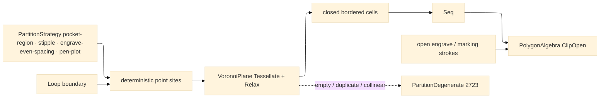

# [RASM_FABRICATION_PARTITION]

`Partition` owns Fabrication-local POINT-SITE Voronoi region decomposition for CAM: deterministic interior site fields, SharpVoronoiLib `VoronoiPlane` Fortune tessellation, Lloyd relaxation, closed bordered cells, and the boundary-trim seam for open engrave/marking strokes. The kernel owns polygon medial and clearance skeletons; this page owns point-site region seeds only, under `extern alias Voronoi`, with `PartitionDegenerate` as the sole degeneration route and `PolygonAlgebra.ClipOpen` as the open-path trimming boundary.

## [01]-[INDEX]

- [01]-[PARTITION]: owns `PartitionStrategy`, deterministic site seeding, `VoronoiPlane` tessellation + `Relax`, bordered cell lowering to `Loop`, open-path stroke trimming through `PolygonAlgebra.ClipOpen`, and fault routing to `FabricationFault.PartitionDegenerate`.

## [02]-[PARTITION]

- Owner: `PartitionStrategy` is the closed policy family for pocket-region, stipple, engrave-even-spacing, and pen-plot rows; `Partition` is the sole public entry surface and returns owner#atoms `Loop` cells.
- Cases: `pocket-region` · `stipple` · `engrave-even-spacing` · `pen-plot`; all rows carry deterministic site pitch, minimum site count, Lloyd relaxation count, relaxation strength, re-tessellation posture, and open-path trim posture.
- Entry: `public static Fin<Seq<Loop>> Seed(PartitionStrategy strategy, Loop boundary)` — the one partition entry; every CAM caller receives closed region loops and routes any open stroke set through the private `TrimOpen` boundary.
- Auto: site fields use deterministic Halton points clipped by `Loop.Covers`; `VoronoiPlane.SetSites` + `Tessellate(BorderEdgeGeneration.MakeBorderEdges)` generates closed cells; `Relax(iterations, strength, reTessellate)` regularizes region centroids; empty, collinear, coincident, unclosed, or post-relaxation empty diagrams route `PartitionDegenerate`.
- Receipt: `PartitionDiagram` is the internal receipt containing the strategy row, lowered cells, duplicate count, and boundary box; the public receipt is the returned `Seq<Loop>` under the `Fin` rail.
- Packages: SharpVoronoiLib (`VoronoiPlane`, `VoronoiSite`, `VoronoiPoint`, `BorderEdgeGeneration`, `Relax`, `Centroid`, `ClockwisePoints`, `Closed`, `Neighbours`, `DuplicateCount`) behind `extern alias Voronoi`; `PolygonAlgebra.ClipOpen`; owner#atoms (`Loop`, `Edge3`); `FabricationFault.PartitionDegenerate`; Thinktecture.Runtime.Extensions; LanguageExt.Core; Rhino.Geometry; BCL inbox.
- Growth: a new point-site CAM decomposition is one `PartitionStrategy` row carrying pitch and relaxation policy; a polygon-medial, segment-Voronoi, or straight-skeleton request routes to the kernel clearance/skeleton family and never lands here.
- Boundary: out → SharpVoronoiLib point-site diagram and `PolygonAlgebra.ClipOpen`; in ← `Cam.Solve` strategy dispatch. A sampled polygon-edge medial approximation, a second public `Partition.*` entry, raw SharpVoronoiLib use outside this owner, and any kernel reference to `SharpVoronoiLib` are the deleted forms.

```csharp signature
extern alias Voronoi;

// --- [RUNTIME_PRELUDE] ----------------------------------------------------------------------------------------------------------------------------
using LanguageExt;
using Rasm.Fabrication.Geometry2D;
using Rasm.Fabrication.Process;
using Rhino.Geometry;
using Thinktecture;
using VPlane = Voronoi::SharpVoronoiLib.VoronoiPlane;
using VPoint = Voronoi::SharpVoronoiLib.VoronoiPoint;
using VSite = Voronoi::SharpVoronoiLib.VoronoiSite;
using BorderEdgeGeneration = Voronoi::SharpVoronoiLib.BorderEdgeGeneration;
using static LanguageExt.Prelude;

namespace Rasm.Fabrication.Toolpath;

// --- [TYPES] --------------------------------------------------------------------------------------------------------------------------------------
[SmartEnum<string>]
public sealed partial class PartitionStrategy {
    public static readonly PartitionStrategy PocketRegion = new("pocket-region", sitePitch: 12.0, siteFloor: 9, relaxIterations: 4, relaxStrength: 1.0f, reTessellate: true, openTrim: false);
    public static readonly PartitionStrategy Stipple = new("stipple", sitePitch: 3.0, siteFloor: 32, relaxIterations: 6, relaxStrength: 1.0f, reTessellate: true, openTrim: false);
    public static readonly PartitionStrategy EngraveEvenSpacing = new("engrave-even-spacing", sitePitch: 5.0, siteFloor: 16, relaxIterations: 4, relaxStrength: 0.75f, reTessellate: true, openTrim: true);
    public static readonly PartitionStrategy PenPlot = new("pen-plot", sitePitch: 8.0, siteFloor: 12, relaxIterations: 2, relaxStrength: 0.5f, reTessellate: true, openTrim: true);

    public double SitePitch { get; }
    public int SiteFloor { get; }
    public int RelaxIterations { get; }
    public float RelaxStrength { get; }
    public bool ReTessellate { get; }
    public bool OpenTrim { get; }

    public int SitesFor(Loop boundary) {
        BoundingBox box = boundary.Bound();
        double width = Math.Abs(box.Max.X - box.Min.X);
        double height = Math.Abs(box.Max.Y - box.Min.Y);
        double areaSites = Math.Ceiling((width * height) / Math.Max(SitePitch * SitePitch, 1.0));
        return Math.Max(SiteFloor, (int)areaSites);
    }
}

public readonly record struct PartitionSeed(int Index, Point3d Point);

public sealed record PartitionCell(int Index, Loop Boundary, Point3d Seed, Seq<Point3d> AdjacentSeeds);

public sealed record PartitionDiagram(PartitionStrategy Strategy, Seq<PartitionCell> Cells, int DuplicateSites, BoundingBox Boundary);

file readonly record struct HaltonState(int Index, double Factor, double Value);

// --- [OPERATIONS] ---------------------------------------------------------------------------------------------------------------------------------
public static class Partition {
    public static Fin<Seq<Loop>> Seed(PartitionStrategy strategy, Loop boundary) =>
        Guard(strategy, boundary)
            .Bind(_ => Diagram(strategy, boundary))
            .Map(static diagram => diagram.Cells.Map(static cell => cell.Boundary));

    static Fin<Unit> Guard(PartitionStrategy strategy, Loop boundary) =>
        !boundary.Closed
            ? Fin.Fail<Unit>(FabricationFault.OpenLoop(FabConcern.Toolpath, 0).ToError())
            : boundary.Count < 3
                ? Fin.Fail<Unit>(FabricationFault.PartitionDegenerate(strategy, boundary.Count).ToError())
                : Fin.Succ(unit);

    static Fin<PartitionDiagram> Diagram(PartitionStrategy strategy, Loop boundary) {
        Seq<PartitionSeed> seeds = Seeds(strategy, boundary);
        if (seeds.Count < 3)
            return Fin.Fail<PartitionDiagram>(FabricationFault.PartitionDegenerate(strategy, seeds.Count).ToError());

        try {
            BoundingBox box = boundary.Bound();
            VPlane plane = new(box.Min.X, box.Min.Y, box.Max.X, box.Max.Y);
            plane.SetSites(seeds.Map(static seed => new VSite(seed.Point.X, seed.Point.Y)).ToList());
            plane.Tessellate(BorderEdgeGeneration.MakeBorderEdges);
            if (strategy.RelaxIterations > 0)
                plane.Relax(strategy.RelaxIterations, strategy.RelaxStrength, strategy.ReTessellate);

            Seq<PartitionCell> cells = LowerCells(plane, boundary);
            return cells.IsEmpty
                ? Fin.Fail<PartitionDiagram>(FabricationFault.PartitionDegenerate(strategy, seeds.Count).ToError())
                : Fin.Succ(new PartitionDiagram(strategy, cells, plane.DuplicateCount, box));
        }
        catch (Exception) {
            return Fin.Fail<PartitionDiagram>(FabricationFault.PartitionDegenerate(strategy, seeds.Count).ToError());
        }
    }

    static Seq<PartitionSeed> Seeds(PartitionStrategy strategy, Loop boundary) {
        BoundingBox box = boundary.Bound();
        int target = strategy.SitesFor(boundary);
        IEnumerable<PartitionSeed> seeds = Enumerable.Range(1, target * 8)
            .Select(index => Candidate(index, box))
            .Where(boundary.Covers)
            .Take(target)
            .Select((point, index) => new PartitionSeed(index, point));
        return toSeq(seeds);
    }

    static Point3d Candidate(int index, BoundingBox box) =>
        new(
            Lerp(box.Min.X, box.Max.X, Halton(index, 2)),
            Lerp(box.Min.Y, box.Max.Y, Halton(index, 3)),
            0.0);

    static Seq<PartitionCell> LowerCells(VPlane plane, Loop clip) {
        IEnumerable<PartitionCell> cells = plane.Sites
            .Where(static site => site.Closed)
            .Select((site, index) => LowerCell(index, site))
            .Where(cell => cell.Boundary.Count >= 3)
            .Where(cell => clip.Covers(cell.Seed));
        return toSeq(cells);
    }

    static PartitionCell LowerCell(int index, VSite site) {
        Arr<Point3d> points = toSeq(site.ClockwisePoints)
            .Map(static point => new Point3d(point.X, point.Y, 0.0))
            .ToArr();
        Seq<Point3d> adjacent = toSeq(site.Neighbours)
            .Map(static neighbour => ToPoint(neighbour.Centroid));
        return new PartitionCell(index, new Loop(points, Closed: true).AsCcw(), ToPoint(site.Centroid), adjacent);
    }

    static (Seq<Edge3> Inside, Seq<Edge3> Outside) TrimOpen(PartitionStrategy strategy, Seq<Edge3> strokes, Seq<Loop> regions) =>
        strategy.OpenTrim
            ? PolygonAlgebra.ClipOpen(strokes, regions)
            : (strokes, Seq<Edge3>());

    static Point3d ToPoint(VPoint point) => new(point.X, point.Y, 0.0);

    static double Lerp(double a, double b, double t) => a + ((b - a) * t);

    static double Halton(int index, int radix) => HaltonStep(new HaltonState(index, 1.0, 0.0), radix).Value;

    static HaltonState HaltonStep(HaltonState state, int radix) =>
        state.Index <= 0
            ? state
            : HaltonStep(
                new HaltonState(
                    state.Index / radix,
                    state.Factor / radix,
                    state.Value + ((state.Factor / radix) * (state.Index % radix))),
                radix);
}
```


