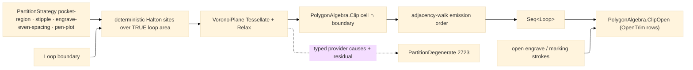

# [RASM_FABRICATION_PARTITION]

`Partition` owns Fabrication-local POINT-SITE Voronoi region decomposition for CAM: deterministic interior site fields, SharpVoronoiLib `VoronoiPlane` Fortune tessellation, Lloyd relaxation, boundary-clipped cells, adjacency-ordered emission, and the open-stroke trim modality for engrave/marking work. The kernel owns polygon medial and clearance skeletons; this page owns point-site region seeds only, under `extern alias Voronoi`, with `PartitionDegenerate` as the sole degeneration route and `PolygonAlgebra.ClipOpen` as the open-path trimming boundary. Every emitted cell is CLIPPED to the supplied boundary through `PolygonAlgebra.Clip` — a border cell extends to the tessellation rectangle, so an unclipped cell overhangs the profile and cuts air or clamp; the clip is the admission, not a cosmetic.

## [01]-[INDEX]

- [01]-[PARTITION]: owns `PartitionStrategy`, deterministic site seeding, `VoronoiPlane` tessellation + `Relax`, boundary-clipped cell lowering to `Loop`, adjacency-ordered emission, the open-stroke `Seed` modality over `PolygonAlgebra.ClipOpen`, and fault routing to `FabricationFault.PartitionDegenerate`.

## [02]-[PARTITION]

- Owner: `PartitionStrategy` is the closed policy family for pocket-region, stipple, engrave-even-spacing, and pen-plot rows; `Partition` is the sole public entry surface returning owner#atoms `Loop` cells and, on the stroke modality, `Edge3` trims.
- Cases: `pocket-region` · `stipple` · `engrave-even-spacing` · `pen-plot`; all rows carry deterministic site pitch, minimum site count, Lloyd relaxation count, relaxation strength, re-tessellation posture, and open-path trim posture.
- Entry: ONE polymorphic `Seed` name; the input shape discriminates the modality. `public static Fin<Seq<Loop>> Seed(PartitionStrategy strategy, Loop boundary)` is the closed-region call every pocket/stipple/layer caller folds; `public static Fin<(Seq<Loop> Regions, Seq<Edge3> Inside, Seq<Edge3> Outside)> Seed(PartitionStrategy strategy, Loop boundary, Seq<Edge3> strokes)` is the stroke modality — the same regions plus the stroke set split by the strategy's `OpenTrim` posture, so engrave/pen-plot callers receive containment evidence in the same call and no dead private trimmer exists.
- Auto: site fields use deterministic Halton points clipped by `Loop.Covers`; the site target derives from the TRUE loop area (`PolygonAlgebra.Area`), never the bounding-box area that overseeds a non-rectangular profile; `VoronoiPlane.SetSites` + `Tessellate(BorderEdgeGeneration.MakeBorderEdges)` generates cells; `Relax(iterations, strength, reTessellate)` regularizes centroids; each closed cell clips to the boundary through `PolygonAlgebra.Clip(..., ClipOp.Intersect)`; emission order is the adjacency walk — from the cell nearest the boundary anchor, each next cell is the nearest unvisited neighbour (falling back to nearest unvisited), so downstream travel is short and input-order-free; `OpenTrim` rows route strokes through `PolygonAlgebra.ClipOpen` against the clipped regions, non-trim rows pass strokes through as inside.
- Receipt: `PartitionDiagram` is the internal receipt carrying the strategy row, clipped cells, seed and neighbour geometry, duplicate count, and boundary box; the public receipts are the returned `Seq<Loop>` and the stroke split under the `Fin` rail.
- Packages: SharpVoronoiLib (`VoronoiPlane`, `VoronoiSite`, `VoronoiPoint`, `BorderEdgeGeneration`, `Relax`, `Centroid`, `ClockwisePoints`, `Closed`, `Neighbours`, `DuplicateCount`, `VoronoiNotTessellatedException`, `VoronoiSiteNotClosedException`, `VoronoiSiteSkippedAsDuplicateException`) behind `extern alias Voronoi`; `PolygonAlgebra.Clip`/`ClipOpen`/`Area`; owner#atoms (`Loop`, `Edge3`); `FabricationFault.PartitionDegenerate`; Thinktecture.Runtime.Extensions; LanguageExt.Core; Rhino.Geometry; BCL inbox.
- Growth: a new point-site CAM decomposition is one `PartitionStrategy` row carrying pitch and relaxation policy; a polygon-medial, segment-Voronoi, or straight-skeleton request routes to the kernel clearance/skeleton family and never lands here.
- Boundary: out → SharpVoronoiLib point-site diagram and `PolygonAlgebra.Clip`/`ClipOpen`; in ← `Cam.Solve` strategy dispatch. A sampled polygon-edge medial approximation, a second public `Partition.*` name, raw SharpVoronoiLib use outside this owner, an unclipped border cell reaching a caller, a dead private trim path, and any kernel reference to `SharpVoronoiLib` are the deleted forms. `MergeSites` cell consolidation stays un-composed until its `VoronoiSiteMergeDecision` member spellings verify against the installed assembly.

```csharp signature
extern alias Voronoi;

// --- [RUNTIME_PRELUDE] ----------------------------------------------------------------------------------------------------------------------------
using LanguageExt;
using Rasm.Fabrication.Geometry2D;
using Rasm.Fabrication.Process;
using Rhino.Geometry;
using Thinktecture;
using VPlane = Voronoi::SharpVoronoiLib.VoronoiPlane;
using VPoint = Voronoi::SharpVoronoiLib.VoronoiPoint;
using VSite = Voronoi::SharpVoronoiLib.VoronoiSite;
using BorderEdgeGeneration = Voronoi::SharpVoronoiLib.BorderEdgeGeneration;
using VoronoiNotTessellatedException = Voronoi::SharpVoronoiLib.Exceptions.VoronoiNotTessellatedException;
using VoronoiSiteNotClosedException = Voronoi::SharpVoronoiLib.Exceptions.VoronoiSiteNotClosedException;
using static LanguageExt.Prelude;

namespace Rasm.Fabrication.Toolpath;

// --- [TYPES] --------------------------------------------------------------------------------------------------------------------------------------
[SmartEnum<string>]
public sealed partial class PartitionStrategy {
    public static readonly PartitionStrategy PocketRegion = new("pocket-region", sitePitch: 12.0, siteFloor: 9, relaxIterations: 4, relaxStrength: 1.0f, reTessellate: true, openTrim: false);
    public static readonly PartitionStrategy Stipple = new("stipple", sitePitch: 3.0, siteFloor: 32, relaxIterations: 6, relaxStrength: 1.0f, reTessellate: true, openTrim: false);
    public static readonly PartitionStrategy EngraveEvenSpacing = new("engrave-even-spacing", sitePitch: 5.0, siteFloor: 16, relaxIterations: 4, relaxStrength: 0.75f, reTessellate: true, openTrim: true);
    public static readonly PartitionStrategy PenPlot = new("pen-plot", sitePitch: 8.0, siteFloor: 12, relaxIterations: 2, relaxStrength: 0.5f, reTessellate: true, openTrim: true);

    public double SitePitch { get; }
    public int SiteFloor { get; }
    public int RelaxIterations { get; }
    public float RelaxStrength { get; }
    public bool ReTessellate { get; }
    public bool OpenTrim { get; }

    // Site target from TRUE loop area: bounding-box area overseeds every non-rectangular profile.
    public int SitesFor(Loop boundary) =>
        Math.Max(SiteFloor, (int)Math.Ceiling(Math.Abs(PolygonAlgebra.Area(boundary)) / Math.Max(SitePitch * SitePitch, 1.0)));
}

public readonly record struct PartitionSeed(int Index, Point3d Point);

public sealed record PartitionCell(int Index, Loop Boundary, Point3d Seed, Seq<Point3d> AdjacentSeeds);

public sealed record PartitionDiagram(PartitionStrategy Strategy, Seq<PartitionCell> Cells, int DuplicateSites, BoundingBox Boundary);

file readonly record struct HaltonState(int Index, double Factor, double Value);

// --- [OPERATIONS] ---------------------------------------------------------------------------------------------------------------------------------
public static class Partition {
    public static Fin<Seq<Loop>> Seed(PartitionStrategy strategy, Loop boundary) =>
        Guard(strategy, boundary)
            .Bind(_ => Diagram(strategy, boundary))
            .Map(static diagram => Ordered(diagram.Cells).Map(static cell => cell.Boundary));

    // The stroke modality: same regions, plus the stroke set split by the row's OpenTrim posture —
    // engrave/pen-plot receive containment evidence in the SAME call; non-trim rows pass strokes as inside.
    public static Fin<(Seq<Loop> Regions, Seq<Edge3> Inside, Seq<Edge3> Outside)> Seed(PartitionStrategy strategy, Loop boundary, Seq<Edge3> strokes) =>
        Seed(strategy, boundary).Map(regions => Trimmed(strategy, strokes, regions));

    static (Seq<Loop> Regions, Seq<Edge3> Inside, Seq<Edge3> Outside) Trimmed(PartitionStrategy strategy, Seq<Edge3> strokes, Seq<Loop> regions) {
        (Seq<Edge3> inside, Seq<Edge3> outside) = strategy.OpenTrim ? PolygonAlgebra.ClipOpen(strokes, regions) : (strokes, Seq<Edge3>());
        return (regions, inside, outside);
    }

    static Fin<Unit> Guard(PartitionStrategy strategy, Loop boundary) =>
        !boundary.Closed
            ? Fin.Fail<Unit>(FabricationFault.OpenLoop(FabConcern.Toolpath, 0).ToError())
            : boundary.Count < 3
                ? Fin.Fail<Unit>(FabricationFault.PartitionDegenerate(strategy, boundary.Count).ToError())
                : Fin.Succ(unit);

    static Fin<PartitionDiagram> Diagram(PartitionStrategy strategy, Loop boundary) {
        Seq<PartitionSeed> seeds = Seeds(strategy, boundary);
        if (seeds.Count < 3)
            return Fin.Fail<PartitionDiagram>(FabricationFault.PartitionDegenerate(strategy, seeds.Count).ToError());

        try {
            BoundingBox box = boundary.Bound();
            VPlane plane = new(box.Min.X, box.Min.Y, box.Max.X, box.Max.Y);
            plane.SetSites(seeds.Map(static seed => new VSite(seed.Point.X, seed.Point.Y)).ToList());
            plane.Tessellate(BorderEdgeGeneration.MakeBorderEdges);
            if (strategy.RelaxIterations > 0)
                plane.Relax(strategy.RelaxIterations, strategy.RelaxStrength, strategy.ReTessellate);

            return LowerCells(plane, boundary).Bind(cells => cells.IsEmpty
                ? Fin.Fail<PartitionDiagram>(FabricationFault.PartitionDegenerate(strategy, seeds.Count).ToError())
                : Fin.Succ(new PartitionDiagram(strategy, cells, plane.DuplicateCount, box)));
        }
        // Typed provider causes narrow first; the residual catch is the provider seam's last resort — both
        // lower onto the ONE degeneration arm with the site census as evidence.
        catch (VoronoiNotTessellatedException) {
            return Fin.Fail<PartitionDiagram>(FabricationFault.PartitionDegenerate(strategy, seeds.Count).ToError());
        }
        catch (VoronoiSiteNotClosedException) {
            return Fin.Fail<PartitionDiagram>(FabricationFault.PartitionDegenerate(strategy, seeds.Count).ToError());
        }
        catch (Exception) {
            return Fin.Fail<PartitionDiagram>(FabricationFault.PartitionDegenerate(strategy, seeds.Count).ToError());
        }
    }

    static Seq<PartitionSeed> Seeds(PartitionStrategy strategy, Loop boundary) {
        BoundingBox box = boundary.Bound();
        int target = strategy.SitesFor(boundary);
        IEnumerable<PartitionSeed> seeds = Enumerable.Range(1, target * 8)
            .Select(index => Candidate(index, box))
            .Where(boundary.Covers)
            .Take(target)
            .Select((point, index) => new PartitionSeed(index, point));
        return toSeq(seeds);
    }

    static Point3d Candidate(int index, BoundingBox box) =>
        new(
            Lerp(box.Min.X, box.Max.X, Halton(index, 2)),
            Lerp(box.Min.Y, box.Max.Y, Halton(index, 3)),
            0.0);

    // Every emitted cell clips to the boundary: a border cell extends to the tessellation rectangle and
    // would otherwise overhang the profile — the clip is the admission gate, not a cosmetic.
    static Fin<Seq<PartitionCell>> LowerCells(VPlane plane, Loop clip) =>
        toSeq(plane.Sites)
            .Filter(static site => site.Closed)
            .Map((index, site) => (Index: index, Site: site))
            .Filter(row => clip.Covers(ToPoint(row.Site.Centroid)))
            .Fold(
                Fin.Succ(Seq<PartitionCell>()),
                (state, row) => state.Bind(cells =>
                    PolygonAlgebra.Clip(Seq(RawCell(row.Site)), Seq(clip), ClipOp.Intersect)
                        .Map(clipped => clipped
                            .Filter(static piece => piece.Count >= 3)
                            .Map(piece => new PartitionCell(
                                cells.Count, piece, ToPoint(row.Site.Centroid),
                                toSeq(row.Site.Neighbours).Map(static n => ToPoint(n.Centroid))))
                            .Fold(cells, static (acc, cell) => acc.Add(cell)))));

    static Loop RawCell(VSite site) =>
        new Loop(toSeq(site.ClockwisePoints).Map(static point => new Point3d(point.X, point.Y, 0.0)).ToArr(), Closed: true).AsCcw();

    // Adjacency walk: from the first cell, each next is the nearest unvisited NEIGHBOUR, falling back to
    // the nearest unvisited cell — deterministic short-travel emission consuming the neighbour geometry.
    static Seq<PartitionCell> Ordered(Seq<PartitionCell> cells) =>
        cells.IsEmpty
            ? cells
            : Range(0, cells.Count).Fold(
                (Tour: Seq<PartitionCell>(), Rest: cells, Cursor: cells.Head.Seed),
                static (state, _) => state.Rest
                    .OrderBy(cell => state.Tour.LastOrNone()
                        .Map(last => last.AdjacentSeeds.Exists(seed => seed.DistanceTo(cell.Seed) < 1e-9) ? 0 : 1)
                        .IfNone(0))
                    .ThenBy(cell => state.Cursor.DistanceTo(cell.Seed))
                    .HeadOrNone()
                    .Match(
                        Some: next => (state.Tour.Add(next), state.Rest.Filter(c => c.Index != next.Index), next.Seed),
                        None: () => state))
                .Tour;

    static Point3d ToPoint(VPoint point) => new(point.X, point.Y, 0.0);

    static double Lerp(double a, double b, double t) => a + ((b - a) * t);

    static double Halton(int index, int radix) => HaltonStep(new HaltonState(index, 1.0, 0.0), radix).Value;

    static HaltonState HaltonStep(HaltonState state, int radix) =>
        state.Index <= 0
            ? state
            : HaltonStep(
                new HaltonState(
                    state.Index / radix,
                    state.Factor / radix,
                    state.Value + ((state.Factor / radix) * (state.Index % radix))),
                radix);
}
```


