# [RASM_FABRICATION_PARTITION]

`Partition` owns Fabrication-local point-site Voronoi decomposition for CAM. One structural `PartitionStrategy` value generates a uniform, fixed-anchor, or density-weighted site field, bounded acceptance, Lloyd relaxation, undersized-cell merge, boundary clipping, nearest-anchor lookup, adjacency ordering, and open-stroke classification; named values are seed data over the public generator, not its admission boundary. Every provider site must carry a finite clockwise point ring with a cardinality-matched `ClockwiseEdgesWound` cycle and no self-neighbour before and after merging, every duplicate is reconciled as a typed degeneration, and every emitted cell is clipped to the true boundary.

The public `Seed` name is polymorphic over input shape. Closed-region input returns ordered cells. Closed-region plus stroke input returns the same cells and the exact `ClipOpen` inside/outside partition for every row; a non-trimming row that labels all input strokes as inside without containment proof is forbidden.

## [01]-[INDEX]

- [01]-[PARTITION]: owns the parameterized `PartitionStrategy` generator, deterministic separated site admission, SharpVoronoiLib tessellation/relaxation/merge/KD-tree lookup, boundary-clipped lowering, adjacency ordering, and both `Seed` modalities.

## [02]-[PARTITION]

- Owner: `PartitionStrategy` is the structural generator policy; `SiteField` carries the variant-specific field payload. `PocketRegion`, `Stipple`, `EngraveEvenSpacing`, and `PenPlot` are seed values, and callers may construct the same policy with different parameters or field cases. `Partition` is the sole operation owner. Cell, diagram, and Halton state share one admission and consumer and remain file-local; generated sites remain `Point3d` values instead of acquiring a transport identity.
- Cases: `SiteField.Uniform` has no payload, `Anchored` carries fixed sites, and `Weighted` carries a bounded acceptance field. Strategy seed values vary pitch, count floor/ceiling, relaxation, separation, attempt budget, and merge threshold through data. No case owns a separate tessellation body.
- Entry: `Seed(PartitionStrategy, Loop)` returns clipped cells; `Seed(PartitionStrategy, Loop, Seq<Edge3>)` returns those cells plus `ClipOpen` classification. Both route `OpenLoop`, `PartitionDegenerate`, or an unre-cased polygon fault on `Fin`.
- Auto: true polygon area determines a count clamped to the policy ceiling. Fixed anchors admit first and must lie inside the boundary with the same separation as generated points. A bounded Halton generator evaluates every remaining candidate against the optional density field and admits only finite weights in `[0, 1]`; a thrown field callback enters the failure rail. SharpVoronoiLib runs `SetSites`, `Tessellate`, `Relax`, and `MergeSites`; the merge predicate measures each cell CLIPPED to the true boundary and accumulates merged area into the retained site, so a concave-border sliver merges on its real measure and later decisions see grown cells; `DuplicateCount`, an open or non-finite provider cell, a point/edge-cycle cardinality mismatch, or a self-neighbour rejects the whole diagram before provider topology can lower. `GetNearestSiteTo(..., KDTree)` chooses the boundary-anchor site. Every provider cell re-emits on the admitted boundary plane and clips through `PolygonAlgebra.Clip`, including cells whose centroid lies outside a concave boundary; every clipped piece receives a unique index and keeps provider-neighbour provenance for ordering. The final census admits only nonempty provider output, zero duplicates, a merge-bounded provider count, and clipped cell area equal to the true boundary within its area-scaled tolerance.
- Receipt: the file-local `PartitionDiagram` carries strategy, requested/provider/duplicate census, clipped cells, the true `Loop` boundary, and the KD-tree anchor. Public receipts are `Seq<Loop>` or the `(Regions, Inside, Outside)` stroke partition.
- Packages: SharpVoronoiLib (`VoronoiPlane`, `VoronoiSite`, `VoronoiPoint`, `Tessellate`, `Relax`, `MergeSites`, `VoronoiSiteMergeDecision`, `GetNearestSiteTo`, `NearestSiteLookupMethod.KDTree`, typed provider exceptions), `PolygonAlgebra.Clip`/`ClipOpen`/`Area` with `PolygonBoolean` and `PolygonFill`, `Process/owner.md` atoms (`Loop`, `Edge3`), `FabricationFault.PartitionDegenerate`, LanguageExt.Core, Thinktecture.Runtime.Extensions, RhinoCommon, BCL inbox.
- Growth: a new point-site CAM posture is a `PartitionStrategy` value over an existing `SiteField` case; segment-site, polygon-medial, and straight-skeleton concerns route to their existing kernel owners.
- Boundary: a closed preset roster, a broad `catch (Exception)`, centroid-before-clip filtering, raw-tessellation area as merge evidence, silent duplicate/open-cell loss, bounding-box site counts, unbounded rejection sampling, first-cell anchoring, all-strokes-inside assertion, or public helper carrier is a deleted form.

```csharp signature
extern alias Voronoi;

// --- [RUNTIME_PRELUDE] ----------------------------------------------------------------------------------------------------------------------------
using LanguageExt;
using Rasm.Domain;
using Rasm.Fabrication.Geometry2D;
using Rasm.Fabrication.Process;
using Rhino.Geometry;
using Thinktecture;
using VPlane = Voronoi::SharpVoronoiLib.VoronoiPlane;
using VPoint = Voronoi::SharpVoronoiLib.VoronoiPoint;
using VSite = Voronoi::SharpVoronoiLib.VoronoiSite;
using BorderEdgeGeneration = Voronoi::SharpVoronoiLib.BorderEdgeGeneration;
using NearestSiteLookupMethod = Voronoi::SharpVoronoiLib.NearestSiteLookupMethod;
using VoronoiSiteMergeDecision = Voronoi::SharpVoronoiLib.VoronoiSiteMergeDecision;
using VoronoiDoesntHaveSitesException = Voronoi::SharpVoronoiLib.Exceptions.VoronoiDoesntHaveSitesException;
using VoronoiNotTessellatedException = Voronoi::SharpVoronoiLib.Exceptions.VoronoiNotTessellatedException;
using VoronoiSiteNotClosedException = Voronoi::SharpVoronoiLib.Exceptions.VoronoiSiteNotClosedException;
using VoronoiSiteSkippedAsDuplicateException = Voronoi::SharpVoronoiLib.Exceptions.VoronoiSiteSkippedAsDuplicateException;
using static LanguageExt.Prelude;

namespace Rasm.Fabrication.Toolpath;

// --- [TYPES] --------------------------------------------------------------------------------------------------------------------------------------
[Union(ConversionFromValue = ConversionOperatorsGeneration.None)]
public abstract partial record SiteField {
    private SiteField() { }

    public sealed record Uniform : SiteField;
    public sealed record Anchored(Arr<Point3d> Points) : SiteField;
    public sealed record Weighted(Func<Point3d, double> Acceptance) : SiteField;
}

public sealed record PartitionStrategy(
    string Key,
    SiteField Field,
    double SitePitch,
    int SiteFloor,
    int SiteCeiling,
    int RelaxIterations,
    float RelaxStrength,
    double MinimumSeparationFactor,
    int AttemptFactor,
    double MergeAreaRatio) {
    public static readonly PartitionStrategy PocketRegion =
        new("pocket-region", new SiteField.Uniform(), 12.0, 9, 4096, 4, 1.0f, 0.2, 24, 0.2);
    public static readonly PartitionStrategy Stipple =
        new("stipple", new SiteField.Uniform(), 3.0, 32, 16384, 6, 1.0f, 0.35, 32, 0.05);
    public static readonly PartitionStrategy EngraveEvenSpacing =
        new("engrave-even-spacing", new SiteField.Uniform(), 5.0, 16, 8192, 4, 0.75f, 0.3, 24, 0.1);
    public static readonly PartitionStrategy PenPlot =
        new("pen-plot", new SiteField.Uniform(), 8.0, 12, 4096, 2, 0.5f, 0.25, 16, 0.15);

    public Fin<int> SitesFor(double boundaryArea) =>
        boundaryArea > 0.0 && double.IsFinite(boundaryArea)
            ? Fin.Succ((int)Math.Clamp(
                Math.Ceiling(boundaryArea / Math.Max(SitePitch * SitePitch, 1.0)),
                (double)SiteFloor,
                (double)SiteCeiling))
            : Fin.Fail<int>(GeometryFault.DegenerateInput("partition:boundary-area").ToError());
}

// --- [MODELS] -------------------------------------------------------------------------------------------------------------------------------------
file sealed record PartitionCell(int Index, Loop Boundary, Point3d Seed, Seq<Point3d> AdjacentSeeds);

file sealed record PartitionDiagram(
    PartitionStrategy Strategy,
    Seq<PartitionCell> Cells,
    int RequestedSites,
    int ProviderSites,
    int DuplicateSites,
    Loop Boundary,
    Point3d Anchor);

file readonly record struct HaltonState(int Index, double Factor, double Value);

// --- [OPERATIONS] ---------------------------------------------------------------------------------------------------------------------------------
public static class Partition {
    public static Fin<Seq<Loop>> Seed(PartitionStrategy strategy, Loop boundary) =>
        Guard(strategy, boundary)
            .Bind(_ => Diagram(strategy, boundary))
            .Bind(diagram => Census(diagram)
                .Map(_ => Ordered(diagram.Cells, diagram.Anchor).Map(static cell => cell.Boundary)));

    public static Fin<(Seq<Loop> Regions, Seq<Edge3> Inside, Seq<Edge3> Outside)> Seed(
        PartitionStrategy strategy,
        Loop boundary,
        Seq<Edge3> strokes) =>
        Seed(strategy, boundary).Bind(regions =>
            PolygonAlgebra.ClipOpen(strokes, regions, PolygonFill.NonZero).Map(split => (regions, split.Inside, split.Outside)));

    private static Fin<Unit> Guard(PartitionStrategy strategy, Loop boundary) =>
        !boundary.Closed
            ? Fin.Fail<Unit>(FabricationFault.OpenLoop(FabConcern.Toolpath, 0).ToError())
            : boundary.Count < 3 || strategy.SiteFloor < 3 || strategy.SiteCeiling < strategy.SiteFloor
                || string.IsNullOrWhiteSpace(strategy.Key)
                || strategy.SitePitch <= 0.0 || !double.IsFinite(strategy.SitePitch)
                || strategy.RelaxIterations < 0
                || strategy.RelaxStrength is < 0.0f or > 1.0f || !float.IsFinite(strategy.RelaxStrength)
                || strategy.MinimumSeparationFactor < 0.0 || !double.IsFinite(strategy.MinimumSeparationFactor)
                || strategy.AttemptFactor < 1 || strategy.SiteCeiling > int.MaxValue / strategy.AttemptFactor
                || strategy.MergeAreaRatio is < 0.0 or > 1.0 || !double.IsFinite(strategy.MergeAreaRatio)
                || !Valid(strategy.Field)
                ? Fin.Fail<Unit>(FabricationFault.PartitionDegenerate(strategy, boundary.Count).ToError())
                : Fin.Succ(unit);

    private static bool Valid(SiteField field) =>
        field is not null
        && field.Switch(
            uniform: static _ => true,
            anchored: static row => !row.Points.Exists(static point => !point.IsValid),
            weighted: static row => row.Acceptance is not null);

    private static Fin<PartitionDiagram> Diagram(PartitionStrategy strategy, Loop boundary) =>
        from area in PolygonAlgebra.Area(Seq1(boundary)).Map(Math.Abs)
        from target in strategy.SitesFor(area)
        from seeds in Seeds(strategy, boundary, target)
        from diagram in Diagram(strategy, boundary, seeds, target, area / target * strategy.MergeAreaRatio)
        select diagram;

    private static Fin<PartitionDiagram> Diagram(
        PartitionStrategy strategy,
        Loop boundary,
        Seq<Point3d> seeds,
        int target,
        double mergeFloor) {
        if (seeds.Count != target)
            return Fin.Fail<PartitionDiagram>(FabricationFault.PartitionDegenerate(strategy, seeds.Count).ToError());

        try {
            BoundingBox box = boundary.Bound();
            VPlane plane = new(box.Min.X, box.Min.Y, box.Max.X, box.Max.Y);
            plane.SetSites(seeds.Map(static point => new VSite(point.X, point.Y)).ToList());
            plane.Tessellate(BorderEdgeGeneration.MakeBorderEdges);
            if (strategy.RelaxIterations > 0)
                plane.Relax(strategy.RelaxIterations, strategy.RelaxStrength, reTessellate: true);

            Seq<VSite> initial = toSeq(plane.Sites);
            if (plane.DuplicateCount > 0 || !ValidSites(initial))
                return Fin.Fail<PartitionDiagram>(FabricationFault.PartitionDegenerate(strategy, initial.Count).ToError());

            return Merge(plane, boundary, mergeFloor).Bind(_ => {
                Seq<VSite> sites = toSeq(plane.Sites);
                if (plane.DuplicateCount > 0 || !ValidSites(sites))
                    return Fin.Fail<PartitionDiagram>(FabricationFault.PartitionDegenerate(strategy, sites.Count).ToError());

                Point3d boundaryAnchor = boundary.At(0);
                VSite anchor = plane.GetNearestSiteTo(boundaryAnchor.X, boundaryAnchor.Y, NearestSiteLookupMethod.KDTree);
                return LowerCells(sites, boundary).Bind(cells => cells.IsEmpty
                    ? Fin.Fail<PartitionDiagram>(FabricationFault.PartitionDegenerate(strategy, sites.Count).ToError())
                    : Fin.Succ(new PartitionDiagram(
                        strategy,
                        cells,
                        target,
                        sites.Count,
                        plane.DuplicateCount,
                        boundary,
                        ToPoint(anchor.Centroid, boundary.Plane))));
            });
        }
        catch (VoronoiDoesntHaveSitesException) {
            return Fin.Fail<PartitionDiagram>(FabricationFault.PartitionDegenerate(strategy, seeds.Count).ToError());
        }
        catch (VoronoiNotTessellatedException) {
            return Fin.Fail<PartitionDiagram>(FabricationFault.PartitionDegenerate(strategy, seeds.Count).ToError());
        }
        catch (VoronoiSiteNotClosedException) {
            return Fin.Fail<PartitionDiagram>(FabricationFault.PartitionDegenerate(strategy, seeds.Count).ToError());
        }
        catch (VoronoiSiteSkippedAsDuplicateException) {
            return Fin.Fail<PartitionDiagram>(FabricationFault.PartitionDegenerate(strategy, seeds.Count).ToError());
        }
    }

    private static bool ValidSites(Seq<VSite> sites) =>
        !sites.IsEmpty
        && sites.All(site => site.Closed
            && site.ClockwisePoints.Count >= 3
            && site.ClockwiseEdgesWound.Count == site.ClockwisePoints.Count
            && site.ClockwisePoints.All(static point => double.IsFinite(point.X) && double.IsFinite(point.Y))
            && !site.Neighbours.Any(neighbour => ReferenceEquals(site, neighbour)));

    private static Fin<Unit> Census(PartitionDiagram diagram) =>
        from boundaryArea in PolygonAlgebra.Area(Seq1(diagram.Boundary)).Map(Math.Abs)
        from cellArea in PolygonAlgebra.Area(diagram.Cells.Map(static cell => cell.Boundary)).Map(Math.Abs)
        let areaTolerance = diagram.Boundary.Tolerance.Absolute.Value * Math.Max(1.0, diagram.Boundary.Bound().Diagonal.Length)
        from _ in diagram.RequestedSites >= diagram.ProviderSites
            && diagram.ProviderSites > 0
            && diagram.DuplicateSites == 0
            && !diagram.Cells.IsEmpty
            && Math.Abs(boundaryArea - cellArea) <= areaTolerance
                ? Fin.Succ(unit)
                : Fin.Fail<Unit>(FabricationFault.PartitionDegenerate(diagram.Strategy, diagram.Cells.Count).ToError())
        select unit;

    // Merge evidence is TRUE-boundary measure: each provider cell clips against the admitted boundary before its
    // area enters the fold, and every merge accumulates into the retained site's live entry, so a later decision
    // sees the grown cell — the provider callback is the one sanctioned mutation site for that accumulation.
    private static Fin<Unit> Merge(VPlane plane, Loop boundary, double floor) =>
        floor <= 0.0
            ? Fin.Succ(unit)
            : toSeq(plane.Sites).Traverse(site =>
                ClippedArea(site, boundary).Map(area => (Site: site, Area: area)))
              .Map(rows => {
                  Dictionary<VSite, double> live = new(ReferenceEqualityComparer.Instance);
                  foreach ((VSite site, double area) in rows)
                      live[site] = area;
                  plane.MergeSites((left, right) => {
                      double leftArea = live[left];
                      double rightArea = live[right];
                      VoronoiSiteMergeDecision decision =
                          leftArea < floor && leftArea <= rightArea ? VoronoiSiteMergeDecision.MergeIntoSite2
                          : rightArea < floor ? VoronoiSiteMergeDecision.MergeIntoSite1
                          : VoronoiSiteMergeDecision.DontMerge;
                      if (decision == VoronoiSiteMergeDecision.MergeIntoSite2)
                          live[right] = leftArea + rightArea;
                      if (decision == VoronoiSiteMergeDecision.MergeIntoSite1)
                          live[left] = leftArea + rightArea;
                      return decision;
                  });
                  return unit;
              });

    private static Fin<double> ClippedArea(VSite site, Loop boundary) =>
        RawCell(site, boundary).Bind(cell =>
            PolygonAlgebra.Clip(Seq1(cell), Seq(boundary), PolygonBoolean.Intersection, PolygonFill.NonZero)
                .Bind(pieces => pieces.Traverse(PolygonAlgebra.Area).As()
                    .Map(areas => areas.Fold(0.0, static (sum, area) => sum + Math.Abs(area)))));

    private static Fin<Seq<Point3d>> Seeds(PartitionStrategy strategy, Loop boundary, int target) {
        BoundingBox box = boundary.Bound();
        double separation = strategy.SitePitch * strategy.MinimumSeparationFactor;
        Seq<Point3d> anchors = strategy.Field.Switch(
            uniform: static _ => Seq<Point3d>(),
            anchored: static row => row.Points.ToSeq(),
            weighted: static _ => Seq<Point3d>());
        bool invalidAnchors = anchors.Count > target
            || anchors.Exists(point => !point.IsValid || !boundary.Covers(point))
            || anchors.Map((point, index) => (point, index))
                .Exists(row => anchors.Take(row.index).Exists(prior => prior.DistanceTo(row.point) < separation));
        if (invalidAnchors)
            return Fin.Fail<Seq<Point3d>>(FabricationFault.PartitionDegenerate(strategy, anchors.Count).ToError());

        return Try.lift(() => Range(1, target * strategy.AttemptFactor)
                .Map(index => {
                    Point3d point = Candidate(index, box);
                    double acceptance = strategy.Field.Switch(
                        uniform: static _ => 1.0,
                        anchored: static _ => 1.0,
                        weighted: row => row.Acceptance(point));
                    return (Index: index, Point: point, Acceptance: acceptance);
                }).ToSeq())
            .Run()
            .MapFail(_ => FabricationFault.PartitionDegenerate(strategy, anchors.Count).ToError())
            .Bind(candidates => candidates.Exists(static row => !double.IsFinite(row.Acceptance) || row.Acceptance is < 0.0 or > 1.0)
                ? Fin.Fail<Seq<Point3d>>(FabricationFault.PartitionDegenerate(strategy, candidates.Count).ToError())
                : Fin.Succ(candidates.Fold(
                    anchors,
                    (accepted, row) => accepted.Count >= target || !boundary.Covers(row.Point)
                        || Halton(row.Index, 5) > row.Acceptance
                        || accepted.Exists(point => point.DistanceTo(row.Point) < separation)
                            ? accepted
                            : accepted.Add(row.Point))));
    }

    private static Fin<Seq<PartitionCell>> LowerCells(Seq<VSite> sites, Loop clip) =>
        sites.Traverse(site =>
            RawCell(site, clip).Bind(cell => PolygonAlgebra.Clip(
                Seq1(cell),
                Seq(clip),
                PolygonBoolean.Intersection,
                PolygonFill.NonZero)
                .Bind(clipped => clipped.Traverse(piece =>
                    PolygonAlgebra.Area(Seq1(piece)).Map(area => (Piece: piece, Area: Math.Abs(area)))))
                .Map(clipped => clipped
                    .Filter(static row => row.Piece.Count >= 3 && row.Area > 0.0)
                    .Map(row => (row.Piece, Seed: ToPoint(site.Centroid, clip.Plane),
                        Adjacent: toSeq(site.Neighbours).Map(neighbour => ToPoint(neighbour.Centroid, clip.Plane)))))))
        .Map(static groups => groups.Bind(identity)
            .Map((row, index) => new PartitionCell(index, row.Piece, row.Seed, row.Adjacent))
            .ToSeq());

    private static Seq<PartitionCell> Ordered(Seq<PartitionCell> cells, Point3d anchor) =>
        cells.IsEmpty
            ? cells
            : Range(0, cells.Count).Fold(
                (Tour: Seq<PartitionCell>(), Rest: cells, Cursor: anchor),
                static (state, _) => state.Rest
                    .OrderBy(cell => state.Tour.LastOrNone()
                        .Map(last => last.AdjacentSeeds.Exists(seed => seed.DistanceTo(cell.Seed) <= 1e-9) ? 0 : 1)
                        .IfNone(0))
                    .ThenBy(cell => state.Cursor.DistanceTo(cell.Seed))
                    .ThenBy(static cell => cell.Index)
                    .HeadOrNone()
                    .Match(
                        Some: next => (state.Tour.Add(next), state.Rest.Filter(cell => cell.Index != next.Index), next.Seed),
                        None: () => state))
              .Tour;

    // Provider cells re-emit on the ADMITTED boundary plane: SharpVoronoiLib tessellates XY only, and the polygon
    // owner's one-plane law rejects mixed elevations, so the lowering restores the boundary's Z before any clip.
    private static Fin<Loop> RawCell(VSite site, Loop clip) =>
        Loop.Admit(
            toSeq(site.ClockwisePoints).Map(point => new Point3d(point.X, point.Y, clip.Plane)).ToArr(),
            closed: true,
            bulges: Arr<double>.Empty,
            tolerance: clip.Tolerance).Map(static loop => loop.AsCcw());

    private static Point3d Candidate(int index, BoundingBox box) =>
        new(
            box.Min.X + ((box.Max.X - box.Min.X) * Halton(index, 2)),
            box.Min.Y + ((box.Max.Y - box.Min.Y) * Halton(index, 3)),
            box.Min.Z);

    private static Point3d ToPoint(VPoint point, double plane) => new(point.X, point.Y, plane);

    private static double Halton(int index, int radix) =>
        Range(0, sizeof(int) * 8).Fold(
            new HaltonState(index, 1.0, 0.0),
            (state, _) => state.Index <= 0
                ? state
                : new HaltonState(
                    state.Index / radix,
                    state.Factor / radix,
                    state.Value + ((state.Factor / radix) * (state.Index % radix)))).Value;
}
```

```mermaid
---
config:
  theme: base
  look: classic
  layout: elk
  flowchart:
    curve: linear
    padding: 25
  themeVariables:
    darkMode: true
    fontFamily: "SF Mono, Menlo, Cascadia Mono, Segoe UI Mono, Consolas, monospace"
    useGradient: false
    dropShadow: "none"
    background: "#282A36"
    primaryColor: "#44475A"
    primaryTextColor: "#F8F8F2"
    primaryBorderColor: "#BD93F9"
    lineColor: "#FF79C6"
    textColor: "#F8F8F2"
    edgeLabelBackground: "#21222C"
    labelBackgroundColor: "#21222C"
  themeCSS: ".nodeLabel{font-size:13px;font-weight:500}.edgeLabel{font-size:12px;font-weight:500}.cluster-label .nodeLabel{font-size:13.5px;font-weight:700;letter-spacing:.08em}.edge-thickness-normal{stroke-width:2px}.edge-thickness-thick{stroke-width:3px}.edge-pattern-dashed,.edge-pattern-dotted{stroke-width:1.5px;stroke-dasharray:4 6}.node rect,.node circle,.node polygon,.node path,.node .outer-path{stroke-width:1.5px;filter:none!important}.cluster rect{stroke-width:1px!important;stroke-dasharray:5 4!important;filter:none!important}.marker path{transform:scale(.8);transform-origin:5px 5px}.marker circle{transform:scale(.48);transform-origin:5px 5px}.edgeLabel rect{transform-box:fill-box;transform-origin:center;transform:scale(1.1,1.2)}"
---
flowchart LR
  accTitle: Deterministic bounded partition
  accDescr: A parameterized site policy produces clipped and adjacency-ordered Voronoi regions while the same owner classifies every open stroke against those regions.
  Policy["PartitionStrategy structural policy"] --> Sites["bounded separated Halton field"]
  Field["SiteField uniform · anchors · density"] --> Sites
  Boundary["true closed Loop"] --> Sites
  Sites --> Voronoi["Tessellate · Relax · MergeSites"]
  Voronoi --> Anchor["GetNearestSiteTo KDTree"]
  Voronoi --> Clip["every cell ∩ boundary"]
  Clip --> Order["adjacency + anchor order"]
  Order --> Regions["Seq&lt;Loop&gt;"]
  Strokes["Seq&lt;Edge3&gt;"] --> Split["ClipOpen inside/outside"]
  Regions --> Split
  classDef primary fill:#44475A,stroke:#FF79C6,color:#F8F8F2
  classDef boundary fill:#282A36,stroke:#BD93F9,color:#F8F8F2
  classDef data fill:#FFB86CBF,stroke:#FFB86C,color:#282A36
  class Policy,Field,Boundary,Strokes boundary
  class Sites,Voronoi,Clip,Order,Split primary
  class Anchor,Regions data
```


