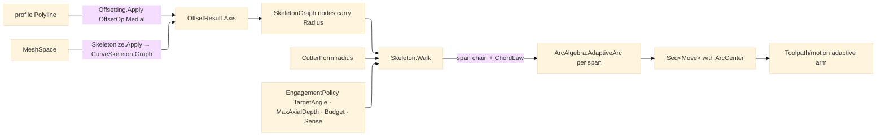

# [RASM_FABRICATION_SKELETON]

`Skeleton` is the Toolpath page that consumes the kernel clearance family and owns only the constant-engagement walk. The walk reads the unified `SkeletonGraph` carrier — `Seq<ClearanceNode>` nodes carrying per-node `Radius` plus `Seq<SkeletonArc>` connectivity — that BOTH kernel producers mint: the 2D medial `Offsetting.Apply(OffsetOp.Medial(ring, policy))` returns it as `OffsetResult.Axis`, and the 3D `CurveSkeleton` projects it through `CurveSkeleton.Graph`, so one walk serves 2.5D adaptive pocketing and mesh-borne channel work with zero re-probing: the graph already holds every clearance radius, and a per-station `Clearance(Point3d)` re-query against a field the graph came from is the deleted form. Trochoid emission is `ArcAlgebra.AdaptiveArc` — the `Geometry2D/arcs` constant-engagement generator — composed per span with the span's cutter-corrected engagement radius; a local arc synthesis beside that owner is the deleted form.

Wire posture: HOST-LOCAL. The `Seq<Move>` output crosses only the in-process seam to `Toolpath/motion#CAM_MOTION` and then to posting through the owner-side `Motion` result.

## [01]-[INDEX]

- [01]-[SKELETON_WALK]: owns `Skeleton.Walk(SkeletonGraph, CutterForm, EngagementPolicy)` — the bounded, cutter-aware, span-chained constant-engagement walk over the kernel clearance graph, lowered to trochoidal `Move` rows through `ArcAlgebra.AdaptiveArc`.

## [02]-[SKELETON_WALK]

- Owner: `Skeleton` the static walk owner; `SkeletonSpan` the per-arc projection (`From`/`To` `ClearanceNode` pair + length); `ChordLaw` the engagement-to-chord law derived once from `EngagementPolicy` and the cutter radius. No cursor, probe, or per-station record survives: the graph nodes ARE the stations, and `AdaptiveArc` owns interior loop generation, so the walk carries no recursion and no station accumulator.
- Cases: three internal folds — span projection (arcs to spans, degenerate spans dropped), span chaining (greedy nearest-neighbor tour per `Component` so rapids between disjoint channel branches stay short and deterministic), and span lowering (one `AdaptiveArc` composition per span). One public entry, no public row family.
- Entry: `public static Fin<Seq<Move>> Walk(SkeletonGraph graph, CutterForm cutter, EngagementPolicy policy)` — the only Toolpath skeleton entry. `Fin<T>` routes `GeometryFault.DegenerateInput` for an empty or all-degenerate graph, a non-subtractive `policy.Budget` case, or a channel everywhere narrower than the cutter; `ArcAlgebra`'s own spine fault propagates unwrapped.
- Auto: upstream field construction is kernel-owned — `Offsetting.Apply(new OffsetOp.Medial(ring, OffsetPolicy.Canonical))` for the planar medial (the `Cam.Adaptive` arm's route), `Skeletonize.Apply(...).Map(s => s.Graph)` for the mesh route. `ChordLaw.Of(policy, cutter)` fixes the engagement ratio `TargetAngle / 180°`, the axial cap `min(policy.MaxAxialDepth, budget.DepthOfCut)`, and the cutter radius once. Per span the trochoid radius is `min(From.Radius, To.Radius) − cutterRadius`: a non-positive radius marks a channel narrower than the tool — the span is refused, never silently full-slotted — and the chord is `Step(radius)` clamped to the axial cap. `ArcAlgebra.AdaptiveArc(spine, engagementRadius, stepover, chordLength, feed, policy.Sense)` emits the loops; feed is `budget.FeedRate` — the one physics-derived feed, never a unit literal.
- Receipt: `Seq<Move>` is the typed motion receipt for the adaptive arm; arc identity rides each `Move.Arc` `ArcCenter` column exactly as `AdaptiveArc` minted it, so posting-side arc recovery needs no skeleton-local type.
- Packages: `Rasm.Meshing` (`SkeletonGraph`, `ClearanceNode`, `SkeletonArc`, `Offsetting.Apply`, `OffsetOp.Medial`, `OffsetResult.Axis`, `OffsetPolicy.Canonical`, `Skeletonize.Apply`, `CurveSkeleton.Graph`), `Geometry2D/arcs#ARC_ALGEBRA` (`ArcAlgebra.AdaptiveArc`, `AdaptiveSense`), `Toolpath/motion#CAM_MOTION` (`EngagementPolicy`), `Process/owner#FABRICATION_OWNER` (`Move`, `ArcCenter`), `Process/physics#CUT_PARAMETER` (`RemovalBudget.Subtractive`), `Rhino.Geometry` (`Point3d`), LanguageExt.Core, BCL inbox.
- Growth: a 5-axis tilt walk is one orientation column on `SkeletonSpan`; trochoid smoothing, high-speed corner easing, and roughing-versus-finishing variants are `EngagementPolicy` values or `AdaptiveArc` policy rows; a new clearance producer is a new kernel op minting the same `SkeletonGraph`, zero walk edits. The public surface stays one walk entry.
- Boundary: the retired local event-propagation kernel, local offset construction, local clearance lookup, per-station `Clearance(Point3d)` re-probes against a graph-backed field, local distance transforms, hand-rolled arc synthesis beside `AdaptiveArc`, and unbounded per-station recursion are deleted forms. The kernel owns field construction and node radii; `ArcAlgebra` owns trochoid interiors; this page owns only span projection, chaining, and the engagement law.

```csharp signature
// --- [RUNTIME_PRELUDE] --------------------------------------------------------------------
using LanguageExt;
using Rasm.Fabrication.Geometry2D;
using Rasm.Fabrication.Process;
using Rasm.Meshing;
using Rasm.Numerics;
using Rhino.Geometry;
using static LanguageExt.Prelude;

namespace Rasm.Fabrication.Toolpath;

// --- [CONSTANTS] --------------------------------------------------------------------------
static class SkeletonWalkConstants {
    public const double SpanFloor = 1e-3;
    public const double ChordFloor = 1e-3;
    public const double FullEngagementDegrees = 180.0;
}

// --- [MODELS] -----------------------------------------------------------------------------
public readonly record struct SkeletonSpan(ClearanceNode From, ClearanceNode To) {
    public double Length => From.At.DistanceTo(To.At);

    // Cutter-corrected trochoid radius: the channel half-width minus the tool radius; non-positive
    // marks a channel narrower than the tool — refused upstream, never silently full-slotted.
    public double Engagement(double cutterRadius) => Math.Min(From.Radius, To.Radius) - cutterRadius;

    public Seq<Move> Spine(double feed) =>
        Seq(new Move(From.At, Rapid: false, Feed: feed), new Move(To.At, Rapid: false, Feed: feed));
}

public readonly record struct ChordLaw(double EngagementRatio, double AxialCap, double CutterRadius) {
    public static ChordLaw Of(EngagementPolicy policy, CutterForm cutter, RemovalBudget.Subtractive budget) =>
        new(
            EngagementRatio: Math.Clamp(policy.TargetAngle / SkeletonWalkConstants.FullEngagementDegrees, 1e-3, 1.0),
            AxialCap: Math.Max(SkeletonWalkConstants.ChordFloor, Math.Min(policy.MaxAxialDepth, budget.DepthOfCut)),
            CutterRadius: cutter.Diameter * 0.5);

    public double Step(double engagementRadius) =>
        Math.Max(SkeletonWalkConstants.ChordFloor, Math.Min(AxialCap, EngagementRatio * engagementRadius));
}

// --- [OPERATIONS] -------------------------------------------------------------------------
public static class Skeleton {
    public static Fin<Seq<Move>> Walk(SkeletonGraph graph, CutterForm cutter, EngagementPolicy policy) =>
        policy.Budget is not RemovalBudget.Subtractive budget
            ? Fin.Fail<Seq<Move>>(GeometryFault.DegenerateInput("skeleton-walk:non-subtractive-budget").ToError())
            : Spans(graph) is var spans && spans.IsEmpty
                ? Fin.Fail<Seq<Move>>(GeometryFault.DegenerateInput("skeleton-walk:empty-graph").ToError())
                : Lower(Chained(spans), ChordLaw.Of(policy, cutter, budget), budget.FeedRate, policy.Sense);

    static Seq<SkeletonSpan> Spans(SkeletonGraph graph) {
        Arr<ClearanceNode> nodes = graph.Nodes.ToArr();
        return graph.Arcs
            .Map(arc => new SkeletonSpan(nodes[arc.From], nodes[arc.To]))
            .Filter(static span => span.Length > SkeletonWalkConstants.SpanFloor);
    }

    // Greedy nearest-neighbor chain: each next span is the unvisited one whose From lies closest to the
    // last To — rapids between disjoint medial branches stay short and the tour is input-order-free.
    static Seq<SkeletonSpan> Chained(Seq<SkeletonSpan> spans) =>
        Range(0, spans.Count).Fold(
            (Tour: Seq<SkeletonSpan>(), Rest: spans, Cursor: spans.Head.From.At),
            static (state, _) => state.Rest
                .Map(span => (Span: span, Gap: state.Cursor.DistanceTo(span.From.At)))
                .OrderBy(static row => row.Gap).HeadOrNone()
                .Match(
                    Some: row => (state.Tour.Add(row.Span), state.Rest.Filter(s => !s.Equals(row.Span)), row.Span.To.At),
                    None: () => state))
            .Tour;

    static Fin<Seq<Move>> Lower(Seq<SkeletonSpan> tour, ChordLaw law, double feed, AdaptiveSense sense) =>
        tour.Filter(span => span.Engagement(law.CutterRadius) > SkeletonWalkConstants.ChordFloor) is var passable && passable.IsEmpty
            ? Fin.Fail<Seq<Move>>(GeometryFault.DegenerateInput("skeleton-walk:channel-below-cutter").ToError())
            : passable
                .Map(span => (Span: span, Radius: span.Engagement(law.CutterRadius)))
                .Map(row => ArcAlgebra.AdaptiveArc(
                    row.Span.Spine(feed), row.Radius, law.Step(row.Radius), law.Step(row.Radius), feed, sense))
                .Traverse(identity)
                .Map(static chords => chords.Bind(identity));
}
```


