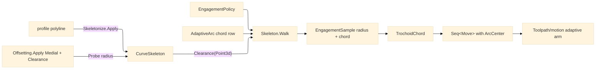

# [RASM_FABRICATION_SKELETON]

`Skeleton` is the Toolpath page that consumes the kernel clearance family and owns only the constant-engagement walk. The medial field originates in `Skeletonize.Apply`; point clearance originates in the shared `Offsetting.Apply` `Medial`/`Clearance` family and is read through `CurveSkeleton.Clearance(Point3d)`. Local logic emits trochoidal `Move` chords by composing the `AdaptiveArc` arc-native chord row with `EngagementPolicy`, so adaptive CAM receives a walkable motion stream without a local event-propagation kernel, second offsetter, or second distance field.

Wire posture: HOST-LOCAL. The `Seq<Move>` output crosses only the in-process seam to `Toolpath/motion#CAM_MOTION` and then to posting through the owner-side `Motion` result.

## [01]-[INDEX]

- [01]-[SKELETON_WALK]: owns `Skeleton.Walk(CurveSkeleton, EngagementPolicy)` - the trochoidal constant-engagement walk over the kernel clearance field.

## [02]-[SKELETON_WALK]

- Owner: `Skeleton` the static walk owner; `SkeletonSpan` the local span projection read from the kernel field; `WalkCursor` the station/first-move cursor; `ClearanceProbe` the kernel radius read; `ChordLaw` the engagement-to-step law; `EngagementSample` the per-probe radius/chord/arc receipt; `TrochoidChord` the movement row that lowers one sampled station into one owner atom `Move`.
- Cases: the walk resolves six internal rows - span projection, cursor advance, clearance probe, chord law, adaptive chord, move emission - with one public entry and no public row family.
- Entry: `public static Fin<Seq<Move>> Walk(CurveSkeleton skeleton, EngagementPolicy policy)` - the only Toolpath skeleton entry. The caller supplies the kernel `CurveSkeleton` produced by `Skeletonize.Apply`; the walk reads `CurveSkeleton.Clearance(Point3d)` directly at each probe and emits owner atom `Move` rows with `Option<ArcCenter>`.
- Auto: upstream field construction is kernel-owned: `Skeletonize.Apply` materializes `CurveSkeleton`, and `Offsetting.Apply` owns the shared `OffsetOp.Medial`/`OffsetOp.Clearance(Polyline, Point3d, OffsetPolicy)` clearance family whose `OffsetResult.Probe` radius is the probe result. `Walk` projects the route spans, samples each station, reads the clearance radius, sizes the next chord by `EngagementPolicy.TargetAngle` bounded by `EngagementPolicy.MaxAxialDepth`, and composes `AdaptiveArc` for the trochoidal chord identity. A narrowing channel shortens the chord; a widening channel lengthens it; the emitted `Move` remains an atom-safe chord whose arc identity rides the `ArcCenter` column for posting-side recovery.
- Receipt: `Seq<Move>` is the typed motion receipt for the adaptive arm; `EngagementSample` stays local evidence for step sizing, radius read, and arc identity. No result case carries a local skeleton type.
- Packages: `Rasm.Meshing` (`Skeletonize.Apply`, `CurveSkeleton`, `CurveSkeleton.Clearance`), `Rasm.Meshing` (`Offsetting.Apply`, `OffsetOp.Medial`, `OffsetOp.Clearance`, `OffsetResult.Probe`), `Geometry2D/arcs#AdaptiveArc`, `Process/owner#FABRICATION_OWNER` (`Move`, `ArcCenter`, `Edge3`), `Rhino.Geometry` (`Point3d`, `Vector3d`), LanguageExt.Core, BCL inbox.
- Growth: a 5-axis tilt walk is one orientation column on `EngagementSample`; trochoid smoothing is one `AdaptiveArc` policy row; roughing or finishing variants are `EngagementPolicy` values. The public surface stays one walk entry.
- Boundary: the retired local event-propagation author-kernel, local offset construction, local clearance lookup, local distance transform, per-vertex offset ring, and public medial/offset query family are deleted forms. The kernel owns field construction and probe radius; this page owns only trochoidal movement over that field.

```csharp signature
// --- [RUNTIME_PRELUDE] --------------------------------------------------------------------
using LanguageExt;
using Rasm.Fabrication.Process;
using Rasm.Meshing;
using Rhino.Geometry;
using static LanguageExt.Prelude;

namespace Rasm.Fabrication.Toolpath;

// --- [CONSTANTS] --------------------------------------------------------------------------
static class SkeletonWalkConstants {
    public const double ClearanceFloor = 1e-6;
    public const double ChordFloor = 1e-3;
    public const double FullEngagementDegrees = 180.0;
    public const double UnitFeed = 1.0;
}

// --- [MODELS] -----------------------------------------------------------------------------
public readonly record struct SkeletonSpan(Edge3 Spine, double Length) {
    public Point3d At(double station) {
        double u = Math.Clamp(station / Math.Max(Length, SkeletonWalkConstants.ClearanceFloor), 0.0, 1.0);
        return Spine.A + u * (Spine.B - Spine.A);
    }

    public Vector3d Tangent {
        get {
            Vector3d tangent = Spine.B - Spine.A;
            tangent.Unitize();
            return tangent;
        }
    }

    public Vector3d Normal {
        get {
            Vector3d tangent = Tangent;
            return new Vector3d(-tangent.Y, tangent.X, 0.0);
        }
    }
}

public readonly record struct WalkCursor(double Station, bool First) {
    public static readonly WalkCursor Origin = new(0.0, true);

    public WalkCursor Advance(double chord) => new(Station + chord, false);

    public Point3d At(SkeletonSpan span) => span.At(Station);

    public bool Done(SkeletonSpan span) => Station >= span.Length;
}

public readonly record struct ClearanceProbe(Point3d Point, double Radius) {
    public static ClearanceProbe Of(CurveSkeleton skeleton, Point3d point) =>
        new(point, Math.Max(SkeletonWalkConstants.ClearanceFloor, skeleton.Clearance(point)));
}

public readonly record struct ChordLaw(double EngagementRatio, double AxialCap) {
    public static ChordLaw Of(EngagementPolicy policy) {
        double engagement = Math.Clamp(policy.TargetAngle / SkeletonWalkConstants.FullEngagementDegrees, 1e-3, 1.0);
        double axialCap = double.IsPositiveInfinity(policy.MaxAxialDepth)
            ? double.MaxValue
            : Math.Max(SkeletonWalkConstants.ChordFloor, policy.MaxAxialDepth);
        return new ChordLaw(engagement, axialCap);
    }

    public double Step(double clearance) =>
        Math.Max(SkeletonWalkConstants.ChordFloor, Math.Min(AxialCap, EngagementRatio * clearance));
}

public readonly record struct EngagementSample(
    WalkCursor Cursor,
    ClearanceProbe Probe,
    Vector3d Tangent,
    double Chord,
    Option<ArcCenter> Arc) {
    public Move ToMove() =>
        new(Probe.Point, Rapid: Cursor.First, Feed: SkeletonWalkConstants.UnitFeed, Arc: Arc);
}

public readonly record struct TrochoidChord(EngagementSample Sample, Move Move);

// --- [OPERATIONS] -------------------------------------------------------------------------
public static class Skeleton {
    public static Fin<Seq<Move>> Walk(CurveSkeleton skeleton, EngagementPolicy policy) =>
        Spans(skeleton).Map(spans => spans.Bind(span => WalkSpan(skeleton, span, policy)).Map(static chord => chord.Move));

    static Fin<Seq<SkeletonSpan>> Spans(CurveSkeleton skeleton) =>
        Fin.Succ(skeleton.Edges
            .Map(static edge => new SkeletonSpan(edge, edge.A.DistanceTo(edge.B)))
            .Filter(static span => span.Length > SkeletonWalkConstants.ChordFloor));

    static Seq<TrochoidChord> WalkSpan(CurveSkeleton skeleton, SkeletonSpan span, EngagementPolicy policy) =>
        WalkAt(skeleton, span, ChordLaw.Of(policy), WalkCursor.Origin);

    static Seq<TrochoidChord> WalkAt(CurveSkeleton skeleton, SkeletonSpan span, ChordLaw law, WalkCursor cursor) {
        ClearanceProbe probe = ClearanceProbe.Of(skeleton, cursor.At(span));
        double chord = law.Step(probe.Radius);
        Option<ArcCenter> arc = Arc(span, probe, cursor.First);
        EngagementSample sample = new(cursor, probe, span.Tangent, chord, arc);
        TrochoidChord current = new(sample, sample.ToMove());
        return cursor.Done(span)
            ? Seq(current)
            : Seq(current).Concat(WalkAt(skeleton, span, law, cursor.Advance(chord)));
    }

    static Option<ArcCenter> Arc(SkeletonSpan span, ClearanceProbe probe, bool first) =>
        first
            ? None
            : Some(new ArcCenter(probe.Point + probe.Radius * span.Normal, Clockwise: false));
}
```


