# [RASM_FABRICATION_SKELETON]

`Skeleton` consumes the kernel `SkeletonGraph` clearance family and owns the constant-engagement walk. Every kernel arc remains one `CutElement`: the walk never concatenates disconnected components or branch jumps as feed, and `Link.Route` remains the sole owner of travel between elements. Admission validates every node, endpoint, incidence, unique undirected arc, and cutter-clearance constraint before lowering, so an isolated node, self-loop, duplicate edge, malformed endpoint, or sub-tool-width branch rejects the whole walk with accumulated evidence instead of disappearing from the result.

The engagement law separates planar stepover from axial pass depth. `TargetAngle` bounds radial immersion, `Tolerance.ScallopStep` bounds the chord from the finish target, and `MaxAxialDepth` remains a motion pass-ladder input; no in-plane chord is clamped by an axial scalar. `ArcAlgebra.AdaptiveArc` owns trochoid interiors and preserves the `Move.Circular` case for posting.

Wire posture: HOST-LOCAL. `Seq<CutElement>` crosses only to `Toolpath/motion.md` through `Cam`, which composes `Link.Route` before publishing `Process/owner.md` `Move` rows.

## [01]-[INDEX]

- [01]-[SKELETON_WALK]: owns `Skeleton.Walk(SkeletonGraph, CutterForm, EngagementPolicy)`, total graph admission, cutter-corrected engagement, and one trochoidal `CutElement` per admitted graph arc.

## [02]-[SKELETON_WALK]

- Owner: `Skeleton` owns graph admission and lowering. `SkeletonSpan` is file-local projection state because it shares the entry's admission, identity, and consumer; no public span, cursor, probe, chord-law, or station shape survives beside the owner.
- Cases: every `SkeletonArc` becomes one directed span. Node finiteness and incidence, endpoint indices, self-loop and duplicate-edge topology, span length, and cutter-clearance are independent validations accumulated before any native motion row emits.
- Entry: `public static Fin<Seq<CutElement>> Walk(SkeletonGraph graph, CutterForm cutter, EngagementPolicy policy)` is the only entry. It routes `GeometryFault.DegenerateInput` for an empty graph, invalid topology, a non-subtractive budget, a non-positive cutter, or any channel branch below cutter clearance; `ArcAlgebra.AdaptiveArc` faults propagate unchanged.
- Auto: the planar medial producer is `Offsetting.Apply(new OffsetOp.Medial(...))`; the mesh producer is `Skeletonize.Apply(...).Map(static skeleton => skeleton.Graph)`. The walk admits only the `ProcessBudget.Subtractive` case and lowers its `FeedRate` — `Turning` also answers the broad modality but carries per-revolution feed, so it fails the budget gate before any span lowers. Per span, usable clearance is `min(from.Radius, to.Radius) - cutterRadius` and the orbit radius handed to `AdaptivePolicy` is HALF that clearance, because `AdaptiveArc` displaces the orbit center by the engagement radius and traces the same radius; the radial step is bounded by `cutterRadius × (1 - cos(TargetAngle))`, the finish chord is `Tolerance.ScallopStep(policy.Finish, cutter)`, and the smaller value feeds `AdaptiveArc`. Every lowering result becomes `CutElement.Of(moves)`, so branch and component crossings can only become rapid links downstream.
- Receipt: `Seq<CutElement>` is the topology-preserving receipt. An empty or partial result cannot represent a non-empty admitted graph.
- Packages: `Rasm.Meshing` (`SkeletonGraph`, `ClearanceNode`, `SkeletonArc`, `Offsetting.Apply`, `OffsetOp.Medial`, `OffsetResult.Axis`, `Skeletonize.Apply`, `CurveSkeleton.Graph`), `Geometry2D/arcs.md` (`ArcAlgebra.AdaptiveArc`, `AdaptiveSense`), `Spec/tolerance.md` (`Tolerance.ScallopStep`), `Toolpath/link.md` (`CutElement`), `Toolpath/motion.md` (`EngagementPolicy`), `Process/owner.md` (`Move`), LanguageExt.Core, RhinoCommon, BCL inbox.
- Growth: junction smoothing or branch-priority changes the lowering policy inside this entry; a new clearance producer mints the existing `SkeletonGraph`; tool-axis growth requires the owner-atom motion seam before it can become a span column.
- Boundary: the kernel owns graph and clearance construction, `ArcAlgebra` owns trochoid interiors, and `Link` owns inter-element travel. Filtering narrow or malformed spans, greedily feed-joining independent arcs, re-probing graph clearance, using axial depth as planar chord, or publishing helper records are deleted forms.

```csharp signature
// --- [RUNTIME_PRELUDE] ----------------------------------------------------------------------------------------------------------------------------
using LanguageExt;
using LanguageExt.Common;
using Rasm.Fabrication.Geometry2D;
using Rasm.Fabrication.Process;
using Rasm.Fabrication.Spec;
using Rasm.Meshing;
using Rasm.Numerics;
using Rhino.Geometry;
using static LanguageExt.Prelude;

namespace Rasm.Fabrication.Toolpath;

// --- [MODELS] -------------------------------------------------------------------------------------------------------------------------------------
file readonly record struct SkeletonSpan(int Arc, ClearanceNode From, ClearanceNode To) {
    public double Length => From.At.DistanceTo(To.At);

    public double Clearance(double cutterRadius) => Math.Min(From.Radius, To.Radius) - cutterRadius;

    public Seq<Point3d> Spine() => Seq(From.At, To.At);
}

// --- [OPERATIONS] ---------------------------------------------------------------------------------------------------------------------------------
public static class Skeleton {
    // The budget gate precedes Resolve: Turning also answers the Subtractive modality but carries per-revolution
    // feed, so the walk admits only the Subtractive budget case and lowers its native mm/min feed rate.
    public static Fin<Seq<CutElement>> Walk(SkeletonGraph graph, CutterForm cutter, EngagementPolicy policy) =>
        from _ in policy.Admit(cutter)
        from budget in policy.Budget is ProcessBudget.Subtractive subtractive
            ? Fin.Succ(subtractive)
            : Fin.Fail<ProcessBudget.Subtractive>(GeometryFault.DegenerateInput("skeleton-walk:non-subtractive-budget").ToError())
        from physics in policy.Resolve(ProcessModality.Subtractive, cutter)
        from spans in Admit(graph, cutter.Diameter * 0.5)
        from elements in Lower(spans, cutter, policy, budget.FeedRate)
        select elements;

    private static Fin<Seq<SkeletonSpan>> Admit(SkeletonGraph graph, double cutterRadius) {
        Arr<ClearanceNode> nodes = graph.Nodes.ToArr();
        Seq<Error> nodeGeometry = nodes.Map((node, index) =>
                !Finite(node)
                    ? Some(GeometryFault.DegenerateInput($"skeleton-walk:node-{index}:geometry").ToError())
                    : !graph.Arcs.Exists(arc => arc.From == index || arc.To == index)
                        ? Some(GeometryFault.DegenerateInput($"skeleton-walk:node-{index}:isolated").ToError())
                        : Option<Error>.None)
            .Bind(static candidate => candidate.ToSeq());
        Seq<Error> topology = graph.Arcs.Map((arc, index) =>
                arc.From < 0 || arc.From >= nodes.Count || arc.To < 0 || arc.To >= nodes.Count
                    ? Some(GeometryFault.DegenerateInput($"skeleton-walk:arc-{index}:endpoint").ToError())
                    : arc.From == arc.To
                        ? Some(GeometryFault.DegenerateInput($"skeleton-walk:arc-{index}:self-loop").ToError())
                        : graph.Arcs.Take(index).Exists(previous =>
                            (previous.From == arc.From && previous.To == arc.To)
                            || (previous.From == arc.To && previous.To == arc.From))
                            ? Some(GeometryFault.DegenerateInput($"skeleton-walk:arc-{index}:duplicate").ToError())
                            : Option<Error>.None)
            .Bind(static candidate => candidate.ToSeq());
        Seq<Error> admission = nodeGeometry.Concat(topology);
        if (!admission.IsEmpty)
            return Fin.Fail<Seq<SkeletonSpan>>(Error.Many([.. admission]));

        Seq<SkeletonSpan> spans = graph.Arcs.Map((arc, index) => new SkeletonSpan(index, nodes[arc.From], nodes[arc.To]));
        Seq<Error> geometry = spans.Bind(span =>
            span.Length <= 0.0
                ? Seq1<Error>(GeometryFault.DegenerateInput($"skeleton-walk:arc-{span.Arc}:geometry").ToError())
                : span.Clearance(cutterRadius) <= 0.0
                    ? Seq1<Error>(GeometryFault.DegenerateInput($"skeleton-walk:arc-{span.Arc}:channel-below-cutter").ToError())
                    : Seq<Error>());
        return spans.IsEmpty
            ? Fin.Fail<Seq<SkeletonSpan>>(GeometryFault.DegenerateInput("skeleton-walk:empty-graph").ToError())
            : geometry.IsEmpty
                ? Fin.Succ(spans)
                : Fin.Fail<Seq<SkeletonSpan>>(Error.Many([.. geometry]));
    }

    private static Fin<Seq<CutElement>> Lower(Seq<SkeletonSpan> spans, CutterForm cutter, EngagementPolicy policy, double feed) {
        double cutterRadius = cutter.Diameter * 0.5;
        double immersion = cutterRadius * (1.0 - Math.Cos(Math.Clamp(policy.TargetAngle, 0.0, 180.0) * Math.PI / 180.0));
        return Tolerance.ScallopStep(policy.Finish, cutter).Bind(finishChord => spans.Traverse(span => {
                // AdaptiveArc displaces the orbit center by EngagementRadius and traces the same radius, so the
                // trochoid extremity reaches 2×EngagementRadius from the spine — the orbit is HALF the clearance.
                double orbit = span.Clearance(cutterRadius) * 0.5;
                double step = Math.Min(orbit, Math.Min(immersion, finishChord));
                return step > 0.0 && double.IsFinite(step)
                    ? (from arcPolicy in AdaptivePolicy.Admit(orbit, step, feed, policy.Sense)
                      from moves in ArcAlgebra.AdaptiveArc(span.Spine(), arcPolicy)
                      from element in CutElement.Of(moves)
                      select element)
                    : Fin.Fail<CutElement>(GeometryFault.DegenerateInput($"skeleton-walk:arc-{span.Arc}:step").ToError());
            }));
    }

    private static bool Finite(ClearanceNode node) =>
        node.At.IsValid && double.IsFinite(node.Radius) && node.Radius >= 0.0;
}
```

```mermaid
---
config:
  theme: base
  look: classic
  layout: elk
  flowchart:
    curve: linear
    padding: 25
  themeVariables:
    darkMode: true
    fontFamily: "SF Mono, Menlo, Cascadia Mono, Segoe UI Mono, Consolas, monospace"
    useGradient: false
    dropShadow: "none"
    background: "#282A36"
    primaryColor: "#44475A"
    primaryTextColor: "#F8F8F2"
    primaryBorderColor: "#BD93F9"
    lineColor: "#FF79C6"
    textColor: "#F8F8F2"
    edgeLabelBackground: "#21222C"
    labelBackgroundColor: "#21222C"
  themeCSS: ".nodeLabel{font-size:13px;font-weight:500}.edgeLabel{font-size:12px;font-weight:500}.cluster-label .nodeLabel{font-size:13.5px;font-weight:700;letter-spacing:.08em}.edge-thickness-normal{stroke-width:2px}.edge-thickness-thick{stroke-width:3px}.edge-pattern-dashed,.edge-pattern-dotted{stroke-width:1.5px;stroke-dasharray:4 6}.node rect,.node circle,.node polygon,.node path,.node .outer-path{stroke-width:1.5px;filter:none!important}.cluster rect{stroke-width:1px!important;stroke-dasharray:5 4!important;filter:none!important}.marker path{transform:scale(.8);transform-origin:5px 5px}.marker circle{transform:scale(.48);transform-origin:5px 5px}.edgeLabel rect{transform-box:fill-box;transform-origin:center;transform:scale(1.1,1.2)}"
---
flowchart LR
  accTitle: Skeleton graph lowering
  accDescr: Fully validated graph arcs combine cutter geometry and engagement law before each arc becomes an independent cutting element for the travel owner.
  Producers["OffsetResult.Axis · CurveSkeleton.Graph"] --> Admit["Skeleton.Walk graph admission"]
  Admit -->|"all endpoints + clearances valid"| Span["one graph arc → one span"]
  Policy["EngagementPolicy angle · finish · sense"] --> Law["radial immersion ∩ finish chord"]
  Cutter["CutterForm radius"] --> Law
  Span --> Arc["ArcAlgebra.AdaptiveArc"]
  Law --> Arc
  Arc --> Elements["Seq&lt;CutElement&gt;"]
  Elements --> Link["Link.Route owns every inter-element move"]
  classDef primary fill:#44475A,stroke:#FF79C6,color:#F8F8F2
  classDef boundary fill:#282A36,stroke:#BD93F9,color:#F8F8F2
  classDef external fill:#8BE9FDBF,stroke:#8BE9FD,color:#282A36
  class Producers,Policy,Cutter boundary
  class Admit,Span,Law,Elements,Link primary
  class Arc external
```


