# [RASM_FABRICATION_SURFACE]

Surface planning closes analytic cutter positioning over one `SurfacePath.Sample` entry. `SurfaceLayoutKind.PlanarRaster` derives the bounded reference drive field, while `SurfaceLayoutKind.Kernel(Key)` routes any kernel-owned layout through the injected generator carried by `SurfacePolicy`; named layout rosters cannot cap the key space. Every drive, waterline loop, and push-cutter fiber survives as one `CutElement`, so native output grouping reaches `Link.Route` and no implicit feed chord joins independent paths.

`OpenCAMLib` crosses through an authored `extern "C"` shim because upstream is C++ only. One surface and cutter handle bind every capsule, so triangles marshal once per run. Each path capsule survives `setPath`, `run`, and `getCLPoints`; operations execute per drive, and one resettable capsule serves all waterline levels. Loop-count, per-loop point-count, and fiber-group reads preserve provider topology.

Wire posture: HOST-LOCAL. `Seq<CutElement>` crosses to `Cam.Generate`; native handles stay file-local to the boundary, and the run, drive-set, and receipt carriers that cross between the sampling and boundary files stay package-`internal`, never public.

## [01]-[INDEX]

- [02]-[SURFACE_PATH]: owns `SurfaceStrategy`, layout production, policy admission, and `SurfacePath.Sample → Fin<SurfacePathReceipt>`.
- [03]-[OPENCAM_BOUNDARY]: owns operation/cutter row maps, mesh/path lowering, capsule lifetimes, grouped size-then-fill reads, typed native-status routing, the authored `ocl_shim.cpp` extern C body covering every declared entry point, and the shim build/RID asset matrix.

## [02]-[SURFACE_PATH]

- Owner: `SurfaceStrategy` is the payload-bearing request family over one base `SurfacePolicy`; `SurfaceLayoutKind` is the closed planar-or-kernel generator shape; `WaterlineMode` owns operation selection; `SurfaceLayout` produces drives; `SurfacePath` exposes the sole entry. Generated `SurfaceSampling.Validate` admits native bounds once, and `SurfaceRun.Of` accumulates aggregate request faults before layout or native execution.
- Cases: `SurfaceStrategy` carries waterline, scallop, pencil, rest, fiber, indexed-axis, swarf, and drill demand. `SurfaceLayoutKind.Kernel(Key)` parameterizes geodesic, flow, morph, cross-field, iso-parametric, radial, spiral, projected-curve, boundary, contour, cusp, slope, curvature, texture, and drive-surface generation without one named row per algorithm. `FiberSlice` admits endpoint-pair drives into `BatchPushCutter`. `ThreePlusTwo` is a real 3-axis lane per indexed view because the view fixes the tool axis for its whole pass; `Swarf` alone retains axis evidence and returns typed failure, since continuous flank orientation has no `Move` encoding.
- Entry: `internal static Fin<SurfacePathReceipt> Sample(SurfaceStrategy strategy, MeshSpace mesh, CutterForm cutter)` is the only surface entry, folding one admitted pass per indexed view and one pass for every other strategy. Empty and populated requests cross `SurfaceRun.Of`; work cardinality changes execution only after aggregate admission.
- Auto: `Tolerance.Apply(ToleranceRequest.Scallop)` derives stepover. `SurfaceFrame.Of` builds one axis-angle rotation and its inverse from the indexed view, so mesh triangles marshal in frame coordinates and every returned location restores to world before admission. `PlanarRaster` reads the frame-relative mesh bounds once and generates serpentine rows on the reference route. `Kernel(Key)` invokes the injected layout through `Try.lift`, and callback exceptions retain key and message on the typed rail. Pencil contact angle tightens the adaptive cosine limit, and `SurfaceSampling.FilterToleranceMm` drives the upstream `LineCLFilter` so drop-cutter output reaches posting already simplified. Rest layout intersects each drive span with residual regions through `ClipOpen` and re-emits connected in-region intervals independently. Drill-family centers feed `BatchDropCutter`; an empty center set becomes a no-op only after aggregate admission.
- Receipt: `SurfacePathReceipt` carries admitted `CutElement` rows beside `SurfaceSampleReceipt`; grouped `OpenCamLocation` rows, `OpenCamContactKind`, and operation-owned topology survive lowering. `OpenCamDiagnostic.Drop(Calls, BucketSize)` exists only for drop-cutter operations exposing those members, while `OpenCamDiagnostic.Executed` records every other completed capsule. A nonzero native status or diagnostic-budget breach becomes `SampleStalled`; a thrown boundary preserves its message as `GeometryFault`.
- Packages: `OpenCAMLib` (`STLSurf`, `BatchDropCutter`, `PathDropCutter`, `AdaptivePathDropCutter`, `BatchPushCutter`, `Waterline`, `AdaptiveWaterline`, `LineCLFilter`, `reset`, verified setters, contact rows, and grouped outputs), `System.Numerics.Tensors` (`TensorPrimitives.IsFiniteAll`), `System.IO.Hashing` through `ContentHash.Of`, `CommunityToolkit.HighPerformance` (`ArrayPoolBufferWriter`), `Rasm.Meshing`, `Spec/tolerance.md` (`Tolerance`), `Toolpath/link.md` (`CutElement`), `Toolpath/motion.md` (`EngagementPolicy`), `LanguageExt.Core`, `Thinktecture.Runtime.Extensions`, `RhinoCommon`, source-generated interop, BCL inbox.
- Growth: a new 3-axis operation is one strategy case, one operation row mapping, and one operation-specific capsule arm. Simultaneous orientation lands only after `Move` and the machine solve carry an axis frame; indexed orientation needs neither and rides `SurfaceFrame` today.
- Boundary: a caller-built drive set, a per-capsule triangle re-upload, path disposed before `run`, repeated `setPath` followed by one run, integer-code redispatch, flat loop/fiber decoding, unchecked output multiplication, non-finite native point, ignored contact-angle or residual payload, ambient thread count, or Z-only claim for continuous multi-axis motion is a deleted form.

```csharp signature
// --- [RUNTIME_PRELUDE] ----------------------------------------------------------------------------------------------------------------------------
using System.Buffers;
using System.Buffers.Binary;
using System.Numerics.Tensors;
using System.Runtime.CompilerServices;
using System.Runtime.InteropServices;
using CommunityToolkit.HighPerformance.Buffers;
using LanguageExt;
using LanguageExt.Common;
using Rasm.Domain;
using LanguageExt.Traits;
using Rasm.Fabrication.Geometry2D;
using Rasm.Fabrication.Process;
using Rasm.Fabrication.Spec;
using Rasm.Meshing;
using Rasm.Numerics;
using Rhino.Geometry;
using Thinktecture;
using static LanguageExt.Prelude;

namespace Rasm.Fabrication.Toolpath;

// --- [TYPES] --------------------------------------------------------------------------------------------------------------------------------------
[ValueObject<string>]
public sealed partial class SurfaceLayoutKey {
    static partial void ValidateFactoryArguments(ref ValidationError? validationError, ref string value) {
        value = value.Trim();
        validationError = value.Length == 0 ? new ValidationError("surface-layout-key:blank") : null;
    }
}

[Union(ConversionFromValue = ConversionOperatorsGeneration.None)]
public abstract partial record SurfaceLayoutKind {
    private SurfaceLayoutKind() { }

    public sealed record PlanarRaster : SurfaceLayoutKind;
    public sealed record Kernel(SurfaceLayoutKey Key) : SurfaceLayoutKind;

    public string Identity => Switch(
        planarRaster: static _ => "planar-raster",
        kernel: static row => row.Key.Value);
}

[SmartEnum<string>]
public sealed partial class WaterlineMode {
    public static readonly WaterlineMode Standard = new("standard", usesAdaptiveOperation: false);
    public static readonly WaterlineMode Adaptive = new("adaptive", usesAdaptiveOperation: true);

    public bool UsesAdaptiveOperation { get; }
}

[SmartEnum<string>]
public sealed partial class PathSamplingMode {
    public static readonly PathSamplingMode Standard = new("standard", usesAdaptiveOperation: false);
    public static readonly PathSamplingMode Adaptive = new("adaptive", usesAdaptiveOperation: true);

    public bool UsesAdaptiveOperation { get; }
}

// --- [MODELS] -------------------------------------------------------------------------------------------------------------------------------------
[ComplexValueObject]
[StructLayout(LayoutKind.Auto)]
public readonly partial struct SurfaceSampling {
    public double MinimumStepMm { get; }
    public double MaximumStepMm { get; }
    public double CosLimit { get; }
    public double FilterToleranceMm { get; }
    public PathSamplingMode Mode { get; }
    public int Threads { get; }
    public int BucketSize { get; }
    public int MaximumCalls { get; }
    public int MaximumTriangles { get; }
    public int MaximumGroups { get; }
    public int MaximumPointsPerGroup { get; }

    static partial void ValidateFactoryArguments(
        ref ValidationError? validationError,
        ref double minimumStepMm,
        ref double maximumStepMm,
        ref double cosLimit,
        ref double filterToleranceMm,
        ref PathSamplingMode mode,
        ref int threads,
        ref int bucketSize,
        ref int maximumCalls,
        ref int maximumTriangles,
        ref int maximumGroups,
        ref int maximumPointsPerGroup) =>
        validationError = minimumStepMm > 0.0
            && maximumStepMm >= minimumStepMm
            && double.IsFinite(minimumStepMm)
            && double.IsFinite(maximumStepMm)
            && cosLimit is >= -1.0 and <= 1.0
            && double.IsFinite(cosLimit)
            && filterToleranceMm >= 0.0
            && double.IsFinite(filterToleranceMm)
            && mode is not null
            && threads >= 1
            && bucketSize >= 1
            && maximumCalls >= 1
            && maximumTriangles is >= 1 and <= Array.MaxLength / 9
            && maximumGroups >= 1
            && maximumPointsPerGroup is >= 1 and <= Array.MaxLength / 4
                ? null
                : new ValidationError("surface-sampling:invalid");
}

[ComplexValueObject]
public sealed partial class SurfacePolicy {
    public EngagementPolicy Engagement { get; }
    public Option<Func<MeshSpace, SurfaceLayoutKind, double, Fin<Seq<SurfaceDrive>>>> Layout { get; }

    public SurfaceSampling Sampling => Engagement.Sampling;

    static partial void ValidateFactoryArguments(
        ref ValidationError? validationError,
        ref EngagementPolicy engagement,
        ref Option<Func<MeshSpace, SurfaceLayoutKind, double, Fin<Seq<SurfaceDrive>>>> layout) =>
        validationError = engagement is null
            ? new ValidationError("surface-policy:engagement")
            : null;
}

public readonly record struct SurfaceDrive(Arr<Point3d> Points, double Parameter);

// A rotation carries its own inverse, so the indexed frame lands both directions from one axis-angle declaration.
public readonly record struct SurfaceFrame(Transform Forward, Transform Inverse) {
    public static SurfaceFrame Of(ProjectionDir view) {
        Vector3d axis = Vector3d.CrossProduct(view.Forward, Vector3d.ZAxis);
        if (axis.IsTiny()) {
            if (view.Forward * Vector3d.ZAxis >= 0.0)
                return new SurfaceFrame(Transform.Identity, Transform.Identity);
            Transform halfTurn = Transform.Rotation(Math.PI, Vector3d.XAxis, Point3d.Origin);
            return new SurfaceFrame(halfTurn, halfTurn);
        }
        double angle = Vector3d.VectorAngle(view.Forward, Vector3d.ZAxis);
        return new SurfaceFrame(
            Transform.Rotation(angle, axis, Point3d.Origin),
            Transform.Rotation(-angle, axis, Point3d.Origin));
    }
}

internal sealed record SurfaceDriveSet(SurfaceLayoutKind Kind, Seq<SurfaceDrive> Drives, double StepOverMm);
internal sealed record SurfacePathReceipt(Seq<CutElement> Elements, SurfaceSampleReceipt Native);

[Union(ConversionFromValue = ConversionOperatorsGeneration.None)]
public abstract partial record SurfaceStrategy(SurfacePolicy Policy) {
    public sealed record Waterline(SurfacePolicy RequestPolicy, Arr<double> Levels, WaterlineMode Mode) : SurfaceStrategy(RequestPolicy);
    public sealed record Scallop(SurfacePolicy RequestPolicy, SurfaceLayoutKind Layout) : SurfaceStrategy(RequestPolicy);
    public sealed record Pencil(SurfacePolicy RequestPolicy, SurfaceLayoutKind Layout, double ContactAngleDeg) : SurfaceStrategy(RequestPolicy);
    public sealed record Rest(SurfacePolicy RequestPolicy, SurfaceLayoutKind Layout, ResidualStock Stock) : SurfaceStrategy(RequestPolicy);
    public sealed record FiberSlice(SurfacePolicy RequestPolicy, SurfaceLayoutKind Layout) : SurfaceStrategy(RequestPolicy);
    public sealed record ThreePlusTwo(SurfacePolicy RequestPolicy, SurfaceLayoutKind Layout, Arr<ProjectionDir> IndexedViews) : SurfaceStrategy(RequestPolicy);
    public sealed record Swarf(SurfacePolicy RequestPolicy, SurfaceLayoutKind Layout, ProjectionDir ToolAxis, double FlankOffsetMm) : SurfaceStrategy(RequestPolicy);
    public sealed record DrillFamily(SurfacePolicy RequestPolicy, Arr<Point3d> Centers) : SurfaceStrategy(RequestPolicy);

    public string Key => Switch(
        waterline: static _ => "waterline",
        scallop: static _ => "scallop",
        pencil: static _ => "pencil",
        rest: static _ => "rest",
        fiberSlice: static _ => "fiber-slice",
        threePlusTwo: static _ => "three-plus-two",
        swarf: static _ => "swarf",
        drillFamily: static _ => "drill-family");

    public FabricationFault.SampleStalled Stalled(int iteration) =>
        new(new FaultSubject.Strategy(Key), iteration);
}

internal sealed record SurfaceRun(
    SurfaceStrategy Strategy,
    MeshSpace Mesh,
    CutterForm Cutter,
    double StepOverMm,
    OpenCamOperationKind Operation,
    OpenCamCutterKind CutterKind,
    SurfaceSampling Sampling,
    SurfaceFrame Frame,
    int View,
    Option<SurfaceDriveSet> Drives) {
    // An indexed view fixes the tool axis for its whole pass, so the run rotates into that frame and samples 3-axis.
    public static Fin<SurfaceRun> Of(SurfaceStrategy strategy, MeshSpace mesh, CutterForm cutter, int view) =>
        from sampling in EffectiveSampling(strategy)
        let frame = strategy is SurfaceStrategy.ThreePlusTwo indexed
            ? SurfaceFrame.Of(indexed.IndexedViews[view])
            : new SurfaceFrame(Transform.Identity, Transform.Identity)
        let admission = Seq(
            Gate(strategy is not SurfaceStrategy.Swarf, "tool-axis-unrepresentable"),
            Gate(ValidPayload(strategy), "strategy-payload"),
            Gate(strategy.Policy.Engagement.Budget is ProcessBudget.Subtractive, "non-subtractive-budget"),
            Gate(cutter.Diameter > 0.0 && double.IsFinite(cutter.Diameter), "cutter"))
            .Fold(
                (K<Validation<Error>, Unit>)Success<Error, Unit>(unit),
                static (rail, gate) => (rail, gate).Apply(static (_, _) => unit).As())
            .As()
            .ToFin()
        from _ in admission
        from tolerance in Tolerance.Apply(new ToleranceRequest.Scallop(strategy.Policy.Engagement.Finish, cutter))
        from step in tolerance is ToleranceReceipt.Scallop receipt
               ? Fin.Succ(receipt.StepMm)
               : Fin.Fail<double>(new GeometryFault.DegenerateInput(Kind.Curve, -1, "surface:scallop-receipt").ToError())
        from __ in step > 0.0 && double.IsFinite(step)
                   ? Fin.Succ(unit)
                   : Fin.Fail<Unit>(new GeometryFault.DegenerateInput(Kind.Curve, -1, "surface:stepover").ToError())
        from drives in SurfaceLayout.Produce(strategy, mesh, step, frame)
        from ___ in ValidDrives(strategy, drives)
                   ? Fin.Succ(unit)
                   : Fin.Fail<Unit>(new GeometryFault.DegenerateInput(Kind.Curve, -1, "surface:drive-payload").ToError())
        from cutterKind in OpenCamCutterKind.Of(cutter)
        select new SurfaceRun(
                   strategy,
                   mesh,
                   cutter,
                   step,
                   OpenCamOperationKind.Of(strategy, sampling),
                   cutterKind,
                   sampling,
                   frame,
                   view,
                   drives);

    private static Fin<SurfaceSampling> EffectiveSampling(SurfaceStrategy strategy) =>
        strategy is SurfaceStrategy.Pencil pencil
            ? SurfaceSampling.Validate(
                pencil.Policy.Sampling.MinimumStepMm,
                pencil.Policy.Sampling.MaximumStepMm,
                Math.Min(
                    pencil.Policy.Sampling.CosLimit,
                    Math.Cos(Math.Clamp(pencil.ContactAngleDeg, 0.0, 90.0) * Math.PI / 180.0)),
                pencil.Policy.Sampling.FilterToleranceMm,
                pencil.Policy.Sampling.Mode,
                pencil.Policy.Sampling.Threads,
                pencil.Policy.Sampling.BucketSize,
                pencil.Policy.Sampling.MaximumCalls,
                pencil.Policy.Sampling.MaximumTriangles,
                pencil.Policy.Sampling.MaximumGroups,
                pencil.Policy.Sampling.MaximumPointsPerGroup,
                out SurfaceSampling sampling) is { } error
                    ? Fin.Fail<SurfaceSampling>(new GeometryFault.DegenerateInput(Kind.Curve, -1, error.Message).ToError())
                    : Fin.Succ(sampling)
            : Fin.Succ(strategy.Policy.Sampling);

    private static bool ValidPayload(SurfaceStrategy strategy) =>
        strategy.Switch(
            waterline:    static row => row.Mode is not null && !row.Levels.IsEmpty && row.Levels.All(double.IsFinite),
            scallop:      static row => Valid(row.Layout),
            pencil:       static row => Valid(row.Layout)
                && row.ContactAngleDeg is >= 0.0 and <= 90.0 && double.IsFinite(row.ContactAngleDeg),
            rest:         static row => Valid(row.Layout) && row.Stock.Uncut.All(static loop => loop.Closed && loop.Count >= 3),
            fiberSlice:   static row => Valid(row.Layout),
            threePlusTwo: static row => Valid(row.Layout) && !row.IndexedViews.IsEmpty
                && row.IndexedViews.All(static view => view is not null && view.Forward.IsValid),
            swarf:        static row => Valid(row.Layout) && row.ToolAxis is not null && row.ToolAxis.Forward.IsValid
                && row.FlankOffsetMm >= 0.0 && double.IsFinite(row.FlankOffsetMm),
            drillFamily:  static row => row.Centers.All(static center => center.IsValid));

    private static bool Valid(SurfaceLayoutKind layout) =>
        layout is not null && layout.Switch(
            planarRaster: static _ => true,
            kernel: static row => row.Key is not null);

    private static bool ValidDrives(SurfaceStrategy strategy, Option<SurfaceDriveSet> drives) =>
        strategy is not SurfaceStrategy.FiberSlice
        || drives.Match(
            Some: static set => !set.Drives.IsEmpty && set.Drives.All(static drive => drive.Points.Count == 2),
            None: static () => false);

    private static K<Validation<Error>, Unit> Gate(bool holds, string axis) =>
        holds ? unit : new GeometryFault.DegenerateInput(Kind.Curve, -1, $"surface:{axis}").ToError();
}

// --- [OPERATIONS] ---------------------------------------------------------------------------------------------------------------------------------
file static class SurfaceLayout {
    public static Fin<Option<SurfaceDriveSet>> Produce(SurfaceStrategy strategy, MeshSpace mesh, double stepOver, SurfaceFrame frame) =>
        strategy.Switch(
            waterline:    static _ => Fin.Succ(Option<SurfaceDriveSet>.None),
            scallop:      row => Laid(row.Policy, row.Layout, mesh, stepOver, frame),
            pencil:       row => Laid(row.Policy, row.Layout, mesh, stepOver, frame),
            rest:         row => Laid(row.Policy, row.Layout, mesh, stepOver, frame).Bind(set => Rested(set, row.Stock)),
            fiberSlice:   row => Laid(row.Policy, row.Layout, mesh, stepOver, frame),
            threePlusTwo: row => Laid(row.Policy, row.Layout, mesh, stepOver, frame),
            swarf:        static _ => Fin.Fail<Option<SurfaceDriveSet>>(new GeometryFault.DegenerateInput(Kind.Curve, -1, "surface-layout:tool-axis").ToError()),
            drillFamily:  static _ => Fin.Succ(Option<SurfaceDriveSet>.None));

    private static Fin<Option<SurfaceDriveSet>> Laid(
        SurfacePolicy policy,
        SurfaceLayoutKind kind,
        MeshSpace mesh,
        double stepOver,
        SurfaceFrame frame) =>
        kind.Switch(
            state: (Mesh: mesh, StepOver: stepOver, Frame: frame),
            planarRaster: static (state, _) => Raster(state.Mesh, state.StepOver, state.Frame),
            kernel: (state, row) => policy.Layout.Match(
                Some: layout => Try.lift(() => layout(state.Mesh, row, state.StepOver)).Run()
                    .MapFail(error => new GeometryFault.DegenerateInput(Kind.Curve, -1, $"surface-layout:thrown:{row.Identity}:{error.Message}").ToError())
                    .Bind(identity),
                None: () => Fin.Fail<Seq<SurfaceDrive>>(new GeometryFault.DegenerateInput(Kind.Curve, -1, $"surface-layout:unbound:{row.Identity}").ToError())))
        .Bind(drives => drives.IsEmpty || drives.Exists(static drive => drive.Points.Count < 2 || drive.Points.Exists(static point => !point.IsValid))
            ? Fin.Fail<Option<SurfaceDriveSet>>(new GeometryFault.DegenerateInput(Kind.Curve, -1, $"surface-layout:invalid:{kind.Identity}").ToError())
            : Fin.Succ(Optional(new SurfaceDriveSet(kind, drives, stepOver))));

    // Span clipping preserves disconnected in-region runs; endpoint containment cannot represent crossings.
    private static Fin<Option<SurfaceDriveSet>> Rested(Option<SurfaceDriveSet> set, ResidualStock stock) =>
        set.Match(
            None: static () => Fin.Succ(Option<SurfaceDriveSet>.None),
            Some: layout => stock.Uncut.IsEmpty
                ? Fin.Succ(Some(layout with { Drives = Seq<SurfaceDrive>() }))
                : layout.Drives.TraverseM(drive =>
                        PolygonAlgebra.Apply(new PolygonOp.ClipOpen(
                            Seq(toSeq(Enumerable.Range(0, drive.Points.Count - 1))
                                .Map(index => new Edge3(drive.Points[index], drive.Points[index + 1]))),
                            stock.Uncut.ToSeq(),
                            PolygonFill.NonZero))
                        .Bind(trace => trace is PolygonTrace.SplitRuns split
                            ? Fin.Succ(Chains(
                                split.Inside.Bind(identity),
                                stock.Uncut[0].Tolerance.Absolute.Value)
                                .Map(chain => new SurfaceDrive(chain, drive.Parameter)))
                            : Fin.Fail<Seq<SurfaceDrive>>(new GeometryFault.DegenerateInput(Kind.Curve, -1, "surface-layout:clip-trace").ToError())))
                    .As()
                    .Map(drives => Some(layout with {
                        Drives = drives.Bind(identity).Filter(static drive => drive.Points.Count >= 2),
                    })));

    private static Seq<Arr<Point3d>> Chains(Seq<Edge3> inside, double weld) =>
        inside.Fold(Seq<Seq<Point3d>>(), (chains, edge) => chains.LastOrNone()
                .Filter(chain => chain.Last.DistanceTo(edge.A) <= weld)
                .Match(
                    Some: chain => chains.Init.Add(chain.Add(edge.B)),
                    None: () => chains.Add(Seq(edge.A, edge.B))))
            .Map(static chain => chain.ToArr());

    private static Fin<Seq<SurfaceDrive>> Raster(MeshSpace mesh, double stepOver, SurfaceFrame frame) {
        BoundingBox box = mesh.Native.GetBoundingBox(frame.Forward);
        double width = box.Max.X - box.Min.X;
        if (!box.IsValid || width <= 0.0 || !double.IsFinite(width) || !double.IsFinite(box.Max.Y - box.Min.Y))
            return Fin.Fail<Seq<SurfaceDrive>>(new GeometryFault.DegenerateInput(Kind.Curve, -1, "surface-layout:degenerate-raster").ToError());

        double requiredRows = Math.Ceiling((box.Max.Y - box.Min.Y) / stepOver);
        if (!double.IsFinite(requiredRows) || requiredRows > int.MaxValue - 1)
            return Fin.Fail<Seq<SurfaceDrive>>(new GeometryFault.DegenerateInput(Kind.Curve, -1, "surface-layout:row-cap").ToError());

        int rows = Math.Max(1, (int)requiredRows) + 1;
        return Fin.Succ(Range(0, rows).Map(row => {
            double fraction = rows == 1 ? 0.0 : (double)row / (rows - 1);
            double ordinate = box.Min.Y + ((box.Max.Y - box.Min.Y) * fraction);
            Point3d minimum = new(box.Min.X, ordinate, box.Max.Z);
            Point3d maximum = new(box.Max.X, ordinate, box.Max.Z);
            return new SurfaceDrive(
                row % 2 == 0 ? Arr(minimum, maximum) : Arr(maximum, minimum),
                Parameter: ordinate);
        }).ToSeq());
    }
}

internal static class SurfacePath {
    // Indexed views are one admitted pass each; every other strategy is the single-view degenerate case of the same fold.
    internal static Fin<SurfacePathReceipt> Sample(SurfaceStrategy strategy, MeshSpace mesh, CutterForm cutter) =>
        from admittedStrategy in Optional(strategy).ToFin(new GeometryFault.DegenerateInput(Kind.Curve, -1, "surface:strategy").ToError())
        from _ in Optional(admittedStrategy.Policy).ToFin(new GeometryFault.DegenerateInput(Kind.Curve, -1, "surface:policy").ToError())
        from admittedMesh in Optional(mesh).ToFin(new GeometryFault.DegenerateInput(Kind.Curve, -1, "surface:mesh").ToError())
        from admittedCutter in Optional(cutter).ToFin(new GeometryFault.DegenerateInput(Kind.Curve, -1, "surface:cutter").ToError())
        from views in admittedStrategy is SurfaceStrategy.ThreePlusTwo indexed
            ? indexed.IndexedViews.IsEmpty
                ? Fin.Fail<Seq<int>>(new GeometryFault.DegenerateInput(Kind.Curve, -1, "surface:indexed-views").ToError())
                : Fin.Succ(Range(0, indexed.IndexedViews.Count).ToSeq())
            : Fin.Succ(Seq(0))
        from passes in views.Traverse(view => Pass(admittedStrategy, admittedMesh, admittedCutter, view))
        select new SurfacePathReceipt(
            passes.Bind(static pass => pass.Elements),
            new SurfaceSampleReceipt(
                passes.Bind(static pass => pass.Native.Paths),
                passes.Head.Native.Operation,
                passes.Bind(static pass => pass.Native.Diagnostics)));

    private static Fin<SurfacePathReceipt> Pass(SurfaceStrategy strategy, MeshSpace mesh, CutterForm cutter, int view) =>
        from run in SurfaceRun.Of(strategy, mesh, cutter, view)
        from native in run.Strategy is SurfaceStrategy.DrillFamily { Centers.IsEmpty: true }
            ? Fin.Succ(new SurfaceSampleReceipt(Seq<Arr<OpenCamLocation>>(), run.Operation, Seq<OpenCamDiagnostic>()))
            : OpenCamLib.Position(run)
        from _ in native.Paths.IsEmpty && strategy is not (SurfaceStrategy.Rest or SurfaceStrategy.DrillFamily)
            ? Fin.Fail<Unit>(strategy.Stalled(0).ToError())
            : Fin.Succ(unit)
        from budget in strategy.Policy.Engagement.Budget is ProcessBudget.Subtractive subtractive
            ? Fin.Succ(subtractive)
            : Fin.Fail<ProcessBudget.Subtractive>(new GeometryFault.DegenerateInput(Kind.Curve, -1, "surface:non-subtractive-budget").ToError())
        from elements in native.Paths.IsEmpty
            ? Fin.Succ(Seq<CutElement>())
            : native.ToElements(run, budget.FeedRate)
        select new SurfacePathReceipt(elements, native);
}
```

## [03]-[OPENCAM_BOUNDARY]

- Owner: `OpenCamOperationKind` binds strategy to operation identity and result topology; `OpenCamCutterKind` binds cutter form to one verified constructor delegate; `OpenCamNative` declares only the local C-shim ABI; `SafeHandle` capsules own native lifetime; `OpenCamLib` executes grouped units.
- Cases: operations `BatchDropCutter`, `PathDropCutter`, `AdaptivePathDropCutter`, `BatchPushCutter`, `Waterline`, `AdaptiveWaterline`; cutters `Cyl`, `Ball`, `Bull`, `Cone`, `BullCone`.
- Entry: file-local `OpenCamLib.Position(SurfaceRun)` mints one `OpenCamBinding` — surface and cutter — then creates one capsule per path, one capsule per fiber-direction batch, one batch capsule for unordered drill centers, and exactly one waterline capsule reset across every level. Each capsule performs common setup, operation-specific setup, `run`, and the matching grouped read before disposal.
- Auto: path drives create and retain `OclPathHandle` through execution; waterline levels read loops; push drives read fibers and select X/Y scanning from the drive vector; batch points preserve input/output independence as one singleton element per location, and the returned location census must equal the admitted center census. Count queries bound allocations, and fill results reject negative, excessive, empty, non-finite, or partial rows.
- Receipt: the first nonzero native status routes `SampleStalled` with the exact status and a thrown native boundary outcome enters the same typed rail, so a receipt exists only for all-clean executions and never re-records status. `OpenCamLocation.Contact` retains `CCType` classification as plane-local evidence.
- Assets: `vendor/ocl_shim/ocl_shim.cpp` is the package-owned `extern "C"` body — one shim export per declared `[LibraryImport]` entry point, `STLSurf` and `MillingCutter` each owning a handle family independent of operation lifetime, its status vocabulary the exact integers `Gate` lifts into `SampleStalled`; `vendor/ocl_shim/CMakeLists.txt` is the build owner, linking the shim SHARED against the shipped SHARED `libocl` per the LGPL dynamic-link law; the RID matrix rides `vendor/runtimes/<rid>/native/` — per RID the SHIM artifact the `Library` constant resolves (`win-x64/ocl_shim.dll`, `linux-x64/libocl_shim.so`, `osx-arm64/libocl_shim.dylib`) beside the upstream SHARED `libocl` it links — through the folder `.csproj`'s `Exists`-gated `Content` group.
- Boundary: upstream OpenCAMLib has no C ABI. `ocl_shim.cpp` alone flattens C++ vectors and exposes opaque handles; raw handles, C++ mangled entry points, and unmanaged ownership never reach domain code; `libocl` stays dynamically linked and is never folded statically into the shim.

```csharp signature
// --- [RUNTIME_PRELUDE] ----------------------------------------------------------------------------------------------------------------------------
using System.Buffers;
using System.Globalization;
using System.IO.Hashing;
using System.Numerics.Tensors;
using System.Runtime.CompilerServices;
using System.Runtime.InteropServices;
using System.Text;
using LanguageExt;
using Microsoft.Win32.SafeHandles;
using Rasm.Fabrication.Process;
using Rhino.Geometry;
using Thinktecture;
using static LanguageExt.Prelude;

namespace Rasm.Fabrication.Toolpath;

// --- [TYPES] --------------------------------------------------------------------------------------------------------------------------------------
[SmartEnum<string>]
internal sealed partial class OpenCamOperationKind {
    public static readonly OpenCamOperationKind BatchDropCutter = new("batch-drop-cutter", 1, supportsDropDiagnostics: true, static count => count == 1);
    public static readonly OpenCamOperationKind PathDropCutter = new("path-drop-cutter", 2, supportsDropDiagnostics: true, static count => count >= 2);
    public static readonly OpenCamOperationKind AdaptivePathDropCutter = new("adaptive-path-drop-cutter", 3, supportsDropDiagnostics: true, static count => count >= 2);
    public static readonly OpenCamOperationKind BatchPushCutter = new("batch-push-cutter", 4, supportsDropDiagnostics: false, static count => count >= 2 && count % 2 == 0);
    public static readonly OpenCamOperationKind Waterline = new("waterline", 5, supportsDropDiagnostics: false, static count => count >= 3);
    public static readonly OpenCamOperationKind AdaptiveWaterline = new("adaptive-waterline", 6, supportsDropDiagnostics: false, static count => count >= 3);

    public int Code { get; }
    public bool SupportsDropDiagnostics { get; }

    [UseDelegateFromConstructor]
    public partial bool Admits(int pointCount);

    public static OpenCamOperationKind Of(SurfaceStrategy strategy, SurfaceSampling sampling) =>
        strategy.Switch(
            waterline:    static row => row.Mode.UsesAdaptiveOperation ? AdaptiveWaterline : Waterline,
            scallop:      _ => sampling.Mode.UsesAdaptiveOperation ? AdaptivePathDropCutter : PathDropCutter,
            pencil:       _ => sampling.Mode.UsesAdaptiveOperation ? AdaptivePathDropCutter : PathDropCutter,
            rest:         static _ => PathDropCutter,
            fiberSlice:   static _ => BatchPushCutter,
            threePlusTwo: static _ => PathDropCutter,
            swarf:        static _ => BatchPushCutter,
            drillFamily:  static _ => BatchDropCutter);
}

[SmartEnum<string>]
internal sealed partial class OpenCamCutterKind {
    public static readonly OpenCamCutterKind Cyl = new("cyl", MintCyl);
    public static readonly OpenCamCutterKind Ball = new("ball", MintBall);
    public static readonly OpenCamCutterKind Bull = new("bull", MintBull);
    public static readonly OpenCamCutterKind Cone = new("cone", MintCone);
    public static readonly OpenCamCutterKind BullCone = new("bull-cone", MintBullCone);

    [UseDelegateFromConstructor]
    public partial OclCutterHandle Mint(CutterForm cutter);

    public static Fin<OpenCamCutterKind> Of(CutterForm cutter) => cutter.Family.Switch<Fin<OpenCamCutterKind>>(
        state: cutter,
        flat:        static _ => Fin.Succ(Cyl),
        ball:        static _ => Fin.Succ(Ball),
        bull:        static _ => Fin.Succ(Bull),
        barrel:      static _ => Unsupported(CutterFamily.Barrel),
        lollipop:    static _ => Unsupported(CutterFamily.Lollipop),
        taper:       static form => Fin.Succ(form is { CornerRadius: > 0.0, TaperAngle: > 0.0 } ? BullCone : Cone),
        dovetail:    static _ => Unsupported(CutterFamily.Dovetail),
        drill:       static _ => Fin.Succ(Cone),
        chamfer:     static _ => Fin.Succ(Cone),
        engraver:    static _ => Unsupported(CutterFamily.Engraver),
        threadMill:  static _ => Fin.Succ(Cyl),
        tap:         static _ => Unsupported(CutterFamily.Tap),
        reamer:      static _ => Unsupported(CutterFamily.Reamer),
        boringBar:   static _ => Unsupported(CutterFamily.BoringBar),
        faceMill:    static _ => Unsupported(CutterFamily.FaceMill),
        slittingSaw: static _ => Unsupported(CutterFamily.SlittingSaw));

    private static Fin<OpenCamCutterKind> Unsupported(CutterFamily family) =>
        Fin.Fail<OpenCamCutterKind>(new FabricationFault.WitnessMalformed(family.Key, nameof(OpenCamCutterKind)).ToError());

    private static OclCutterHandle MintCyl(CutterForm cutter) => OpenCamNative.CutterCyl(cutter.Diameter, cutter.FluteLength);
    private static OclCutterHandle MintBall(CutterForm cutter) => OpenCamNative.CutterBall(cutter.Diameter, cutter.FluteLength);
    private static OclCutterHandle MintBull(CutterForm cutter) => OpenCamNative.CutterBull(cutter.Diameter, cutter.CornerRadius, cutter.FluteLength);
    private static OclCutterHandle MintCone(CutterForm cutter) => OpenCamNative.CutterCone(cutter.Diameter, cutter.TaperAngle, cutter.FluteLength);
    private static OclCutterHandle MintBullCone(CutterForm cutter) =>
        OpenCamNative.CutterBullCone(cutter.Diameter, cutter.CornerRadius, cutter.FluteLength, cutter.TaperAngle);
}

// --- [MODELS] -------------------------------------------------------------------------------------------------------------------------------------
file sealed class NativeBuffer<T>(int length) : IDisposable {
    public T[] Data { get; } = ArrayPool<T>.Shared.Rent(length);
    public int Length { get; } = length;

    public void Dispose() => ArrayPool<T>.Shared.Return(Data, clearArray: RuntimeHelpers.IsReferenceOrContainsReferences<T>());
}

file sealed class OpenCamMeshBuffer(NativeBuffer<double> storage, int triangleCount) : IDisposable {
    public double[] Triangles => storage.Data;
    public int TriangleCount { get; } = triangleCount;

    public static Fin<OpenCamMeshBuffer> Project(MeshSpace mesh, int maximumTriangles, Transform frame) {
        Mesh native = mesh.Native;
        long triangleCount = native.Faces.Sum(static face => face.IsQuad ? 2L : 1L);
        if (triangleCount <= 0L || triangleCount > maximumTriangles)
            return Fin.Fail<OpenCamMeshBuffer>(new GeometryFault.DegenerateInput(Kind.Curve, -1, "opencam:mesh-capacity").ToError());
        using NativeBuffer<int> corners = new(checked((int)triangleCount * 3));
        int cornerCount = 0;
        foreach (MeshFace face in native.Faces) {
            corners.Data[cornerCount++] = face.A;
            corners.Data[cornerCount++] = face.B;
            corners.Data[cornerCount++] = face.C;
            if (face.IsQuad) {
                corners.Data[cornerCount++] = face.A;
                corners.Data[cornerCount++] = face.C;
                corners.Data[cornerCount++] = face.D;
            }
        }
        if (cornerCount != corners.Length
            || Range(0, corners.Length).Exists(index => corners.Data[index] < 0 || corners.Data[index] >= native.Vertices.Count))
            return Fin.Fail<OpenCamMeshBuffer>(new GeometryFault.DegenerateInput(Kind.Curve, -1, "opencam:mesh-indices").ToError());

        NativeBuffer<double> buffer = new(corners.Length * 3);
        for (int index = 0; index < corners.Length; index++) {
            Point3d vertex = frame * new Point3d(native.Vertices[corners.Data[index]]);
            buffer.Data[index * 3] = vertex.X;
            buffer.Data[(index * 3) + 1] = vertex.Y;
            buffer.Data[(index * 3) + 2] = vertex.Z;
        }
        if (!TensorPrimitives.IsFiniteAll(buffer.Data.AsSpan(0, buffer.Length))) {
            buffer.Dispose();
            return Fin.Fail<OpenCamMeshBuffer>(new GeometryFault.DegenerateInput(Kind.Curve, -1, "opencam:mesh-finite").ToError());
        }
        return Fin.Succ(new OpenCamMeshBuffer(buffer, checked((int)triangleCount)));
    }

    public void Dispose() => storage.Dispose();
}

[ValueObject<int>]
internal readonly partial struct OpenCamContactKind {
    static partial void ValidateFactoryArguments(ref ValidationError? validationError, ref int value) =>
        validationError = value >= 0 ? null : new ValidationError("opencam-contact:negative");
}

internal readonly record struct OpenCamLocation(Point3d Location, OpenCamContactKind Contact);

[Union]
internal abstract partial record OpenCamDiagnostic {
    public sealed record Drop(OpenCamOperationKind Operation, int Calls, int BucketSize) : OpenCamDiagnostic;
    public sealed record Executed(OpenCamOperationKind Operation) : OpenCamDiagnostic;
}

internal readonly record struct OpenCamUnit<T>(T Value, OpenCamDiagnostic Diagnostic);

internal readonly record struct OpenCamBinding(OclSurfaceHandle Surface, OclCutterHandle Cutter);

file delegate int OpenCamGroupFill(
    OclOperationHandle operation,
    int group,
    double[] output,
    int capacity,
    out int written);

internal sealed record SurfaceSampleReceipt(
    Seq<Arr<OpenCamLocation>> Paths,
    OpenCamOperationKind Operation,
    Seq<OpenCamDiagnostic> Diagnostics) {
    public Seq<OpenCamContactKind> Contacts => Paths.Bind(static path => path.Map(static row => row.Contact)).Distinct();

    // Native locations are frame-local; the inverse rotation restores world coordinates before any element is admitted.
    public Fin<Seq<CutElement>> ToElements(SurfaceRun run, double feed) =>
        !ValidTopology()
            ? Fin.Fail<Seq<CutElement>>(new GeometryFault.DegenerateInput(Kind.Curve, -1, "opencam:receipt-topology").ToError())
            : feed > 0.0 && double.IsFinite(feed)
                ? Paths.Map((path, index) => (Path: path, Index: index)).Traverse(row => row.Path.IsEmpty
                ? Fin.Fail<CutElement>(new GeometryFault.DegenerateInput(Kind.Curve, -1, "opencam:empty-path").ToError())
                : row.Path.Map(point => run.Frame.Inverse * point.Location).ToSeq() is var stations
                && stations.Map(station => (Move)new Move.Linear(station, feed)) is var moves
                && run.Cutter.Evidence.Map(static evidence => evidence.ToolId).IfNone(run.Cutter.Family.Key) is var toolKey
                && run.Strategy.Policy.Engagement.WorkOffset is var workOffset
                && PathKey(run, row.Index, toolKey, workOffset, moves) is var key
                    ? CutElement.Admit(
                        key,
                        toolKey,
                        workOffset,
                        new EntryFamily.Fixed(new ElementVariant(
                            key,
                            stations.Head,
                            stations.Last.IfNone(stations.Head),
                            moves,
                            RotationPenalty: 0.0,
                            ThermalExposure: 0.0,
                            Pierces: 0)))
                    : Fin.Fail<CutElement>(new GeometryFault.DegenerateInput(Kind.Curve, -1, "opencam:element").ToError()))
                : Fin.Fail<Seq<CutElement>>(new GeometryFault.DegenerateInput(Kind.Curve, -1, "opencam:feed").ToError());

    private static string PathKey(SurfaceRun run, int path, string toolKey, string workOffset, Seq<Move> moves) {
        using ArrayPoolBufferWriter<byte> preimage = new();
        Write(preimage, run.View);
        Write(preimage, path);
        Write(preimage, moves.Count);
        Write(preimage, run.Strategy.Key);
        Write(preimage, run.Operation.Key);
        Write(preimage, toolKey);
        Write(preimage, workOffset);
        Write(preimage, run.Cutter.Family.Key);
        Write(preimage, run.Cutter.Diameter);
        Write(preimage, run.Cutter.CornerRadius);
        Write(preimage, run.Cutter.TaperAngle);
        Write(preimage, run.Cutter.FluteLength);
        moves.Iter(move => Write(preimage, move));
        return ContentHash.Of(preimage.WrittenSpan).ToString("x32", CultureInfo.InvariantCulture);
    }

    private static void Write(IBufferWriter<byte> writer, Move move) {
        switch (move) {
            case Move.Rapid row:
                Write(writer, (byte)1);
                Write(writer, row.Target);
                break;
            case Move.Linear row:
                Write(writer, (byte)2);
                Write(writer, row.Target);
                Write(writer, row.Feed);
                break;
            case Move.Circular row:
                Write(writer, (byte)3);
                Write(writer, row.Target);
                Write(writer, row.Feed);
                Write(writer, row.Arc.Center);
                Write(writer, row.Arc.Sense.Key);
                break;
        }
    }

    private static void Write(IBufferWriter<byte> writer, Point3d point) {
        Write(writer, point.X);
        Write(writer, point.Y);
        Write(writer, point.Z);
    }

    private static void Write(IBufferWriter<byte> writer, string token) {
        int length = Encoding.UTF8.GetByteCount(token);
        Write(writer, length);
        _ = Encoding.UTF8.GetBytes(token, writer.GetSpan(length));
        writer.Advance(length);
    }

    private static void Write(IBufferWriter<byte> writer, double value) {
        Span<byte> target = writer.GetSpan(sizeof(long));
        BinaryPrimitives.WriteInt64LittleEndian(target, BitConverter.DoubleToInt64Bits(value == 0.0 ? 0.0 : value));
        writer.Advance(sizeof(long));
    }

    private static void Write(IBufferWriter<byte> writer, int value) {
        Span<byte> target = writer.GetSpan(sizeof(int));
        BinaryPrimitives.WriteInt32LittleEndian(target, value);
        writer.Advance(sizeof(int));
    }

    private static void Write(IBufferWriter<byte> writer, byte value) {
        writer.GetSpan(1)[0] = value;
        writer.Advance(1);
    }

    private bool ValidTopology() =>
        Paths.All(path => Operation.Admits(path.Count));
}

// --- [SERVICES] -----------------------------------------------------------------------------------------------------------------------------------
internal sealed class OclOperationHandle : SafeHandleZeroOrMinusOneIsInvalid {
    public OclOperationHandle() : base(ownsHandle: true) { }
    protected override bool ReleaseHandle() { OpenCamNative.OperationDestroy(handle); return true; }
}

internal sealed class OclCutterHandle : SafeHandleZeroOrMinusOneIsInvalid {
    public OclCutterHandle() : base(ownsHandle: true) { }
    protected override bool ReleaseHandle() { OpenCamNative.CutterDestroy(handle); return true; }
}

internal sealed class OclPathHandle : SafeHandleZeroOrMinusOneIsInvalid {
    public OclPathHandle() : base(ownsHandle: true) { }
    protected override bool ReleaseHandle() { OpenCamNative.PathDestroy(handle); return true; }
}

internal sealed class OclSurfaceHandle : SafeHandleZeroOrMinusOneIsInvalid {
    public OclSurfaceHandle() : base(ownsHandle: true) { }
    protected override bool ReleaseHandle() { OpenCamNative.SurfaceDestroy(handle); return true; }
}

// `Library` resolves the shim; upstream `libocl` remains a separately linked shared archive.
internal static partial class OpenCamNative {
    internal const string Library = "ocl_shim";

    [LibraryImport(Library, EntryPoint = "ocl_op_create")]
    internal static partial OclOperationHandle OperationCreate(int operation);
    [LibraryImport(Library, EntryPoint = "ocl_op_set_surface")]
    internal static partial int OperationSetSurface(OclOperationHandle operation, OclSurfaceHandle surface);
    [LibraryImport(Library, EntryPoint = "ocl_op_reset")]
    internal static partial int OperationReset(OclOperationHandle operation);
    [LibraryImport(Library, EntryPoint = "ocl_op_set_filter_tolerance")]
    internal static partial int OperationSetFilterTolerance(OclOperationHandle operation, double tolerance);
    [LibraryImport(Library, EntryPoint = "ocl_op_set_cutter")]
    internal static partial int OperationSetCutter(OclOperationHandle operation, OclCutterHandle cutter);
    [LibraryImport(Library, EntryPoint = "ocl_op_set_sampling")]
    internal static partial int OperationSetSampling(OclOperationHandle operation, double sampling);
    [LibraryImport(Library, EntryPoint = "ocl_op_set_min_sampling")]
    internal static partial int OperationSetMinSampling(OclOperationHandle operation, double sampling);
    [LibraryImport(Library, EntryPoint = "ocl_op_set_cos_limit")]
    internal static partial int OperationSetCosLimit(OclOperationHandle operation, double cosLimit);
    [LibraryImport(Library, EntryPoint = "ocl_op_set_threads")]
    internal static partial int OperationSetThreads(OclOperationHandle operation, int threads);
    [LibraryImport(Library, EntryPoint = "ocl_op_set_bucket_size")]
    internal static partial int OperationSetBucketSize(OclOperationHandle operation, int bucketSize);
    [LibraryImport(Library, EntryPoint = "ocl_op_get_bucket_size")]
    internal static partial int OperationGetBucketSize(OclOperationHandle operation);
    [LibraryImport(Library, EntryPoint = "ocl_op_get_calls")]
    internal static partial int OperationGetCalls(OclOperationHandle operation);
    [LibraryImport(Library, EntryPoint = "ocl_op_set_z")]
    internal static partial int OperationSetZ(OclOperationHandle operation, double z);
    [LibraryImport(Library, EntryPoint = "ocl_op_append_point")]
    internal static partial int OperationAppendPoint(OclOperationHandle operation, double x, double y, double z);
    [LibraryImport(Library, EntryPoint = "ocl_op_set_path")]
    internal static partial int OperationSetPath(OclOperationHandle operation, OclPathHandle path);
    [LibraryImport(Library, EntryPoint = "ocl_op_append_fiber")]
    internal static partial int OperationAppendFiber(OclOperationHandle operation, double x1, double y1, double z1, double x2, double y2, double z2);
    [LibraryImport(Library, EntryPoint = "ocl_op_set_x_direction")]
    internal static partial int OperationSetXDirection(OclOperationHandle operation);
    [LibraryImport(Library, EntryPoint = "ocl_op_set_y_direction")]
    internal static partial int OperationSetYDirection(OclOperationHandle operation);
    [LibraryImport(Library, EntryPoint = "ocl_op_run")]
    internal static partial int OperationRun(OclOperationHandle operation);
    [LibraryImport(Library, EntryPoint = "ocl_op_cl_count")]
    internal static partial int OperationClCount(OclOperationHandle operation);
    [LibraryImport(Library, EntryPoint = "ocl_op_get_clpoints")]
    internal static partial int OperationGetClPoints(OclOperationHandle operation, double[] output, int capacity, out int written);
    [LibraryImport(Library, EntryPoint = "ocl_op_loop_count")]
    internal static partial int OperationLoopCount(OclOperationHandle operation);
    [LibraryImport(Library, EntryPoint = "ocl_op_loop_point_count")]
    internal static partial int OperationLoopPointCount(OclOperationHandle operation, int loop);
    [LibraryImport(Library, EntryPoint = "ocl_op_get_loop")]
    internal static partial int OperationGetLoop(OclOperationHandle operation, int loop, double[] output, int capacity, out int written);
    [LibraryImport(Library, EntryPoint = "ocl_op_fiber_count")]
    internal static partial int OperationFiberCount(OclOperationHandle operation);
    [LibraryImport(Library, EntryPoint = "ocl_op_fiber_point_count")]
    internal static partial int OperationFiberPointCount(OclOperationHandle operation, int fiber);
    [LibraryImport(Library, EntryPoint = "ocl_op_get_fiber")]
    internal static partial int OperationGetFiber(OclOperationHandle operation, int fiber, double[] output, int capacity, out int written);
    [LibraryImport(Library, EntryPoint = "ocl_op_destroy")]
    internal static partial void OperationDestroy(nint operation);
    [LibraryImport(Library, EntryPoint = "ocl_stl_create")]
    internal static partial OclSurfaceHandle SurfaceCreate(double[] triangles, int triangleCount);
    [LibraryImport(Library, EntryPoint = "ocl_stl_destroy")]
    internal static partial void SurfaceDestroy(nint surface);
    [LibraryImport(Library, EntryPoint = "ocl_path_create")]
    internal static partial OclPathHandle PathCreate();
    [LibraryImport(Library, EntryPoint = "ocl_path_append_line")]
    internal static partial int PathAppendLine(OclPathHandle path, double x1, double y1, double z1, double x2, double y2, double z2);
    [LibraryImport(Library, EntryPoint = "ocl_path_destroy")]
    internal static partial void PathDestroy(nint path);
    [LibraryImport(Library, EntryPoint = "ocl_cutter_cyl")]
    internal static partial OclCutterHandle CutterCyl(double diameter, double length);
    [LibraryImport(Library, EntryPoint = "ocl_cutter_ball")]
    internal static partial OclCutterHandle CutterBall(double diameter, double length);
    [LibraryImport(Library, EntryPoint = "ocl_cutter_bull")]
    internal static partial OclCutterHandle CutterBull(double diameter, double radius, double length);
    [LibraryImport(Library, EntryPoint = "ocl_cutter_cone")]
    internal static partial OclCutterHandle CutterCone(double diameter, double angle, double length);
    [LibraryImport(Library, EntryPoint = "ocl_cutter_bullcone")]
    internal static partial OclCutterHandle CutterBullCone(double diameter, double radius, double length, double angle);
    [LibraryImport(Library, EntryPoint = "ocl_cutter_destroy")]
    internal static partial void CutterDestroy(nint cutter);
}

// --- [OPERATIONS] ---------------------------------------------------------------------------------------------------------------------------------
internal static class OpenCamLib {
    internal static Fin<SurfaceSampleReceipt> Position(SurfaceRun run) =>
        Try.lift<Fin<SurfaceSampleReceipt>>(() => PositionNative(run)).Run()
            .MapFail(error => new GeometryFault.DegenerateInput(Kind.Curve, -1, $"opencam:thrown:{error.Message}").ToError())
            .Bind(identity);

    // One triangle upload and one cutter mint serve every capsule in the run; per-level re-marshalling is the deleted form.
    private static Fin<SurfaceSampleReceipt> PositionNative(SurfaceRun run) =>
        OpenCamMeshBuffer.Project(run.Mesh, run.Sampling.MaximumTriangles, run.Frame.Forward).Bind(mesh => {
            using (mesh)
            using (OclSurfaceHandle surface = OpenCamNative.SurfaceCreate(mesh.Triangles, mesh.TriangleCount))
            using (OclCutterHandle cutter = run.CutterKind.Mint(run.Cutter)) {
                OpenCamBinding binding = new(surface, cutter);
                return surface.IsInvalid || cutter.IsInvalid
                    ? Fin.Fail<SurfaceSampleReceipt>(run.Strategy.Stalled(-1).ToError())
                    : run.Strategy.Switch(
                        waterline:    row => Levels(run, binding, row.Levels),
                        scallop:      _ => Paths(run, binding),
                        pencil:       _ => Paths(run, binding),
                        rest:         _ => Paths(run, binding),
                        threePlusTwo: _ => Paths(run, binding),
                        fiberSlice:   _ => Fibers(run, binding),
                        swarf:        static _ => Fin.Fail<SurfaceSampleReceipt>(new GeometryFault.DegenerateInput(Kind.Curve, -1, "opencam:tool-axis").ToError()),
                        drillFamily:  row => Points(run, binding, row.Centers));
            }
        });

    // `reset` clears fibers and loops in place, so one waterline capsule sweeps every admitted Z level.
    private static Fin<SurfaceSampleReceipt> Levels(SurfaceRun run, OpenCamBinding binding, Arr<double> levels) {
        using OclOperationHandle operation = OpenCamNative.OperationCreate(run.Operation.Code);
        return operation.IsInvalid
            ? Fin.Fail<SurfaceSampleReceipt>(run.Strategy.Stalled(-1).ToError())
            : Configure(run, binding, operation).Bind(_ => levels.ToSeq().Traverse(level =>
                Gate(run, () => OpenCamNative.OperationReset(operation), () => OpenCamNative.OperationSetZ(operation, level))
                    .Bind(__ => Execute(
                        run,
                        operation,
                        op => ReadGroups(op, run, OpenCamNative.OperationLoopCount, OpenCamNative.OperationLoopPointCount, OpenCamNative.OperationGetLoop)))))
              .Map(units => Receipt(
                  run,
                  units.Bind(static unit => unit.Value),
                  units.Map(static unit => unit.Diagnostic)));
    }

    private static Fin<SurfaceSampleReceipt> Paths(SurfaceRun run, OpenCamBinding binding) =>
        run.Drives.Match(
            None: () => Fin.Fail<SurfaceSampleReceipt>(new GeometryFault.DegenerateInput(Kind.Curve, -1, "opencam:path-without-drives").ToError()),
            Some: set => set.Drives.Traverse(drive => Path(run, binding, drive)).Map(units => Receipt(
                run,
                run.Strategy is SurfaceStrategy.Rest
                    ? units.Map(static unit => unit.Value).Filter(static group => !group.IsEmpty)
                    : units.Map(static unit => unit.Value),
                units.Map(static unit => unit.Diagnostic))));

    private static Fin<OpenCamUnit<Arr<OpenCamLocation>>> Path(SurfaceRun run, OpenCamBinding binding, SurfaceDrive drive) {
        using OclPathHandle path = OpenCamNative.PathCreate();
        return path.IsInvalid || drive.Points.Count < 2
            ? Fin.Fail<OpenCamUnit<Arr<OpenCamLocation>>>(new GeometryFault.DegenerateInput(Kind.Curve, -1, "opencam:path").ToError())
            : Range(0, drive.Points.Count - 1).Fold(
                Fin.Succ(0),
                (state, index) => state.Bind(_ => Gate(run, () => OpenCamNative.PathAppendLine(
                    path,
                    drive.Points[index].X, drive.Points[index].Y, drive.Points[index].Z,
                    drive.Points[index + 1].X, drive.Points[index + 1].Y, drive.Points[index + 1].Z))))
              .Bind(_ => Unit(
                  run,
                  binding,
                  operation => Gate(run, () => OpenCamNative.OperationSetPath(operation, path)),
                  operation => ReadLocations(operation, run)));
    }

    private static Fin<SurfaceSampleReceipt> Fibers(SurfaceRun run, OpenCamBinding binding) =>
        run.Drives.Match(
            None: () => Fin.Fail<SurfaceSampleReceipt>(new GeometryFault.DegenerateInput(Kind.Curve, -1, "opencam:fiber-without-drives").ToError()),
            Some: set => Seq(
                (YDirection: false, Drives: set.Drives.Filter(static drive => AlongX(drive))),
                (YDirection: true, Drives: set.Drives.Filter(static drive => !AlongX(drive))))
                .Filter(static batch => !batch.Drives.IsEmpty)
                .Traverse(batch => Unit(
                    run,
                    binding,
                    operation => batch.Drives.Fold(
                        Gate(run, batch.YDirection
                            ? () => OpenCamNative.OperationSetYDirection(operation)
                            : () => OpenCamNative.OperationSetXDirection(operation)),
                        (rail, drive) => rail.Bind(_ => Gate(run, () => OpenCamNative.OperationAppendFiber(
                            operation,
                            drive.Points[0].X,
                            drive.Points[0].Y,
                            drive.Points[0].Z,
                            drive.Points[drive.Points.Count - 1].X,
                            drive.Points[drive.Points.Count - 1].Y,
                            drive.Points[drive.Points.Count - 1].Z)))),
                    operation => ReadGroups(operation, run, OpenCamNative.OperationFiberCount, OpenCamNative.OperationFiberPointCount, OpenCamNative.OperationGetFiber)))
                .Map(units => Receipt(
                    run,
                    units.Bind(static unit => unit.Value),
                    units.Map(static unit => unit.Diagnostic))));

    private static bool AlongX(SurfaceDrive drive) {
        Point3d from = drive.Points[0];
        Point3d to = drive.Points[drive.Points.Count - 1];
        return Math.Abs(to.X - from.X) >= Math.Abs(to.Y - from.Y);
    }

    private static Fin<SurfaceSampleReceipt> Points(SurfaceRun run, OpenCamBinding binding, Arr<Point3d> centers) =>
        centers.IsEmpty
            ? Fin.Fail<SurfaceSampleReceipt>(new GeometryFault.DegenerateInput(Kind.Curve, -1, "opencam:points-empty").ToError())
            : Unit(
                run,
                binding,
                operation => centers.Fold(
                    Fin.Succ(0),
                    (state, point) => state.Bind(_ => Gate(run, () => OpenCamNative.OperationAppendPoint(operation, point.X, point.Y, point.Z)))),
                operation => ReadLocations(operation, run))
              .Bind(rows => rows.Value.Count == centers.Count
                  ? Fin.Succ(Receipt(
                      run,
                      rows.Value.Map(static row => Arr(row)).ToSeq(),
                      Seq(rows.Diagnostic)))
                  : Fin.Fail<SurfaceSampleReceipt>(run.Strategy.Stalled(rows.Value.Count).ToError()));

    private static Fin<OpenCamUnit<T>> Unit<T>(
        SurfaceRun run,
        OpenCamBinding binding,
        Func<OclOperationHandle, Fin<int>> configure,
        Func<OclOperationHandle, Fin<T>> read) {
        using OclOperationHandle operation = OpenCamNative.OperationCreate(run.Operation.Code);
        return operation.IsInvalid
            ? Fin.Fail<OpenCamUnit<T>>(run.Strategy.Stalled(-1).ToError())
            : Configure(run, binding, operation)
                .Bind(_ => configure(operation))
                .Bind(_ => Execute(run, operation, read));
    }

    private static Fin<int> Configure(SurfaceRun run, OpenCamBinding binding, OclOperationHandle operation) =>
        Gate(
            run,
            () => OpenCamNative.OperationSetSurface(operation, binding.Surface),
            () => OpenCamNative.OperationSetCutter(operation, binding.Cutter),
            () => OpenCamNative.OperationSetSampling(operation, run.Sampling.MaximumStepMm),
            () => OpenCamNative.OperationSetMinSampling(operation, run.Sampling.MinimumStepMm),
            () => OpenCamNative.OperationSetCosLimit(operation, run.Sampling.CosLimit),
            () => OpenCamNative.OperationSetFilterTolerance(operation, run.Sampling.FilterToleranceMm),
            () => OpenCamNative.OperationSetThreads(operation, run.Sampling.Threads))
        .Bind(_ => run.Operation.SupportsDropDiagnostics
            ? Gate(run, () => OpenCamNative.OperationSetBucketSize(operation, run.Sampling.BucketSize))
            : Fin.Succ(0));

    private static Fin<OpenCamUnit<T>> Execute<T>(
        SurfaceRun run,
        OclOperationHandle operation,
        Func<OclOperationHandle, Fin<T>> read) =>
        Gate(run, () => OpenCamNative.OperationRun(operation))
            .Bind(_ => Diagnostic(run, operation))
            .Bind(diagnostic => read(operation).Map(value => new OpenCamUnit<T>(value, diagnostic)));

    private static Fin<Arr<OpenCamLocation>> ReadLocations(OclOperationHandle operation, SurfaceRun run) {
        int count = OpenCamNative.OperationClCount(operation);
        return Count(run, count, minimum: 0, maximum: run.Sampling.MaximumPointsPerGroup).Bind(valid => {
            if (valid == 0)
                return Fin.Succ(Arr<OpenCamLocation>.Empty);
            using NativeBuffer<double> output = new(valid * 4);
            int written = 0;
            return Gate(run, () => OpenCamNative.OperationGetClPoints(operation, output.Data, output.Length, out written))
                .Bind(_ => Written(run, written, valid))
                .Bind(_ => Decode(run, output.Data, valid));
        });
    }

    private static Fin<Seq<Arr<OpenCamLocation>>> ReadGroups(
        OclOperationHandle operation,
        SurfaceRun run,
        Func<OclOperationHandle, int> groupCount,
        Func<OclOperationHandle, int, int> pointCount,
        OpenCamGroupFill fill) =>
        Count(run, groupCount(operation), minimum: 0, maximum: run.Sampling.MaximumGroups).Bind(groups =>
            Range(0, groups).Traverse(group => Count(
                run,
                pointCount(operation, group),
                minimum: 1,
                maximum: run.Sampling.MaximumPointsPerGroup).Bind(points => {
                using NativeBuffer<double> output = new(points * 4);
                int written = 0;
                return Gate(run, () => fill(operation, group, output.Data, output.Length, out written))
                    .Bind(_ => Written(run, written, points))
                    .Bind(_ => Decode(run, output.Data, points));
            })));

    private static Fin<int> Count(SurfaceRun run, int count, int minimum, int maximum) =>
        count >= minimum && count <= maximum
            ? Fin.Succ(count)
            : Fin.Fail<int>(run.Strategy.Stalled(count).ToError());

    private static Fin<int> Written(SurfaceRun run, int written, int expected) =>
        written == expected
            ? Fin.Succ(written)
            : Fin.Fail<int>(run.Strategy.Stalled(written).ToError());

    private static Fin<Arr<OpenCamLocation>> Decode(SurfaceRun run, double[] output, int count) =>
        output.Length >= count * 4
        && TensorPrimitives.IsFiniteAll(output.AsSpan(0, count * 4))
        && Range(0, count).All(index => {
            double contact = output[(index * 4) + 3];
            return contact >= 0.0 && contact <= int.MaxValue && contact == Math.Truncate(contact);
        })
            ? Range(0, count).Traverse(index =>
                OpenCamContactKind.Validate((int)output[(index * 4) + 3], provider: null, out OpenCamContactKind contact) is { } error
                    ? Fin.Fail<OpenCamLocation>(new GeometryFault.DegenerateInput(Kind.Curve, -1, $"opencam:contact:{error.Message}").ToError())
                    : Fin.Succ(new OpenCamLocation(
                        new Point3d(output[index * 4], output[(index * 4) + 1], output[(index * 4) + 2]),
                        contact))).Map(static rows => rows.ToArr())
            : Fin.Fail<Arr<OpenCamLocation>>(run.Strategy.Stalled(-2).ToError());

    private static Fin<OpenCamDiagnostic> Diagnostic(SurfaceRun run, OclOperationHandle operation) =>
        run.Operation.SupportsDropDiagnostics
            ? OpenCamNative.OperationGetCalls(operation) is var calls
              && OpenCamNative.OperationGetBucketSize(operation) is var bucketSize
              && calls is >= 0
              && calls <= run.Sampling.MaximumCalls
              && bucketSize == run.Sampling.BucketSize
                ? Fin.Succ<OpenCamDiagnostic>(new OpenCamDiagnostic.Drop(run.Operation, calls, bucketSize))
                : Fin.Fail<OpenCamDiagnostic>(run.Strategy.Stalled(calls).ToError())
            : Fin.Succ<OpenCamDiagnostic>(new OpenCamDiagnostic.Executed(run.Operation));

    private static SurfaceSampleReceipt Receipt(
        SurfaceRun run,
        Seq<Arr<OpenCamLocation>> paths,
        Seq<OpenCamDiagnostic> diagnostics) =>
        new(paths, run.Operation, diagnostics);

    private static Fin<int> Gate(SurfaceRun run, params ReadOnlySpan<Func<int>> steps) =>
        toSeq(steps.ToArray()).Fold(
            Fin.Succ(0),
            (rail, step) => rail.Bind(_ => step() is var status && status == 0
                ? Fin.Succ(status)
                : Fin.Fail<int>(run.Strategy.Stalled(status).ToError())));
}
```

```cpp signature
// `OclShimOperation` owns execution state; borrowed cutter/path handles retain their dedicated destroy owners.
// Every export returns `0` or a negative status, and `Trap` prevents exceptions from crossing the ABI.
#include <array>
#include <memory>
#include <vector>
#include <opencamlib/stlsurf.hpp>
#include <opencamlib/triangle.hpp>
#include <opencamlib/point.hpp>
#include <opencamlib/clpoint.hpp>
#include <opencamlib/fiber.hpp>
#include <opencamlib/path.hpp>
#include <opencamlib/millingcutter.hpp>
#include <opencamlib/cylcutter.hpp>
#include <opencamlib/ballcutter.hpp>
#include <opencamlib/bullcutter.hpp>
#include <opencamlib/conecutter.hpp>
#include <opencamlib/bullconecutter.hpp>
#include <opencamlib/batchdropcutter.hpp>
#include <opencamlib/pathdropcutter.hpp>
#include <opencamlib/adaptivepathdropcutter.hpp>
#include <opencamlib/batchpushcutter.hpp>
#include <opencamlib/waterline.hpp>
#include <opencamlib/adaptivewaterline.hpp>
#include <opencamlib/lineclfilter.hpp>

#if defined(_WIN32)
  #define OCL_SHIM_EXPORT extern "C" __declspec(dllexport)
#else
  #define OCL_SHIM_EXPORT extern "C" __attribute__((visibility("default")))
#endif

namespace {

constexpr int kOk = 0, kBadHandle = -1, kBadBuffer = -2, kBadState = -4, kTrapped = -9;

using Row = std::array<double, 4>;

struct OclShimOperation {
    int kind = 0;
    ocl::STLSurf* surface = nullptr;
    ocl::MillingCutter* cutter = nullptr;
    ocl::Path* path = nullptr;
    double sampling = 0.0, minSampling = 0.0, cosLimit = 1.0, filterTolerance = 0.0, z = 0.0;
    int threads = 1, bucketSize = 1, calls = 0;
    bool yDirection = false;
    std::vector<ocl::CLPoint> seeds;
    std::vector<ocl::Fiber> fibers;
    std::vector<std::vector<Row>> groups;
};

OclShimOperation* Op(void* handle) { return static_cast<OclShimOperation*>(handle); }

template <typename Body>
int Trap(void* handle, Body body) {
    if (handle == nullptr) return kBadHandle;
    try { return body(*Op(handle)); } catch (...) { return kTrapped; }
}

Row Of(ocl::CLPoint& cl) { return {cl.x, cl.y, cl.z, static_cast<double>(cl.getCC().type)}; }

int Fill(const std::vector<Row>& rows, double* output, int capacity, int* written) {
    if (output == nullptr || capacity < static_cast<int>(rows.size()) * 4) return kBadBuffer;
    for (size_t row = 0; row < rows.size(); ++row)
        for (size_t slot = 0; slot < 4; ++slot)
            output[(row * 4) + slot] = rows[row][slot];
    *written = static_cast<int>(rows.size());
    return kOk;
}

// `LineCLFilter` is the upstream CL-point simplifier; a zero tolerance keeps the raw sampled stream.
void Filter(OclShimOperation& op, std::vector<ocl::CLPoint>& points) {
    if (op.filterTolerance <= 0.0 || points.size() < 3) return;
    ocl::LineCLFilter unit;
    unit.setTolerance(op.filterTolerance);
    for (ocl::CLPoint& cl : points) unit.addCLPoint(cl);
    unit.run();
    points = *unit.getCLPoints();
}

int Run(OclShimOperation& op) {
    if (op.cutter == nullptr || op.surface == nullptr) return kBadState;
    op.groups.clear();
    switch (op.kind) {
        case 1: {
            ocl::BatchDropCutter unit;
            unit.setSTL(*op.surface); unit.setCutter(*op.cutter); unit.setThreads(op.threads); unit.setBucketSize(op.bucketSize);
            for (ocl::CLPoint& seed : op.seeds) unit.appendPoint(seed);
            unit.run();
            op.bucketSize = unit.getBucketSize(); op.calls = unit.getCalls();
            std::vector<ocl::CLPoint> points = *unit.getCLPoints();
            Filter(op, points);
            op.groups.emplace_back();
            for (ocl::CLPoint& cl : points) op.groups[0].push_back(Of(cl));
            return kOk;
        }
        case 2: case 3: {
            if (op.path == nullptr) return kBadState;
            std::vector<ocl::CLPoint> points;
            if (op.kind == 2) {
                ocl::PathDropCutter unit;
                unit.setSTL(*op.surface); unit.setCutter(*op.cutter); unit.setSampling(op.sampling); unit.setZ(op.z);
                unit.setBucketSize(op.bucketSize);
                unit.setPath(*op.path);
                unit.run();
                op.bucketSize = unit.getBucketSize(); op.calls = unit.getCalls();
                points = unit.getPoints();
            } else {
                ocl::AdaptivePathDropCutter unit;
                unit.setSTL(*op.surface); unit.setCutter(*op.cutter); unit.setSampling(op.sampling);
                unit.setMinSampling(op.minSampling); unit.setCosLimit(op.cosLimit); unit.setZ(op.z);
                unit.setBucketSize(op.bucketSize);
                unit.setPath(*op.path);
                unit.run();
                op.bucketSize = unit.getBucketSize(); op.calls = unit.getCalls();
                points = unit.getPoints();
            }
            Filter(op, points);
            op.groups.emplace_back();
            for (ocl::CLPoint& cl : points) op.groups[0].push_back(Of(cl));
            return kOk;
        }
        case 4: {
            ocl::BatchPushCutter unit;
            unit.setSTL(*op.surface); unit.setCutter(*op.cutter); unit.setThreads(op.threads);
            if (op.yDirection) unit.setYDirection(); else unit.setXDirection();
            for (ocl::Fiber& fiber : op.fibers) unit.appendFiber(fiber);
            unit.run();
            for (ocl::Fiber& fiber : *unit.getFibers()) {
                std::vector<Row> group;
                for (ocl::Interval& interval : fiber.ints) {
                    ocl::Point lower = fiber.point(interval.lower);
                    ocl::Point upper = fiber.point(interval.upper);
                    group.push_back({lower.x, lower.y, lower.z, 0.0});
                    group.push_back({upper.x, upper.y, upper.z, 0.0});
                }
                if (!group.empty()) op.groups.push_back(group);
            }
            return kOk;
        }
        case 5: case 6: {
            if (op.kind == 5) {
                ocl::Waterline unit;
                unit.setSTL(*op.surface); unit.setCutter(*op.cutter); unit.setSampling(op.sampling); unit.setZ(op.z);
                unit.run();
                for (auto& loop : unit.getLoops()) {
                    std::vector<Row> group;
                    for (ocl::Point& point : loop) group.push_back({point.x, point.y, point.z, 0.0});
                    op.groups.push_back(group);
                }
                return kOk;
            }
            ocl::AdaptiveWaterline unit;
            unit.setSTL(*op.surface); unit.setCutter(*op.cutter); unit.setSampling(op.sampling);
            unit.setMinSampling(op.minSampling); unit.setZ(op.z);
            unit.run();
            for (auto& loop : unit.getLoops()) {
                std::vector<Row> group;
                for (ocl::Point& point : loop) group.push_back({point.x, point.y, point.z, 0.0});
                op.groups.push_back(group);
            }
            return kOk;
        }
        default: return kBadState;
    }
}

}

OCL_SHIM_EXPORT void* ocl_op_create(int operation) {
    return operation >= 1 && operation <= 6 ? new OclShimOperation{operation} : nullptr;
}
OCL_SHIM_EXPORT void* ocl_stl_create(const double* triangles, int triangleCount) {
    if (triangles == nullptr || triangleCount <= 0) return nullptr;
    try {
        auto surface = std::make_unique<ocl::STLSurf>();
        for (int index = 0; index < triangleCount; ++index) {
            const double* t = triangles + (index * 9);
            surface->addTriangle(ocl::Triangle(
                ocl::Point(t[0], t[1], t[2]), ocl::Point(t[3], t[4], t[5]), ocl::Point(t[6], t[7], t[8])));
        }
        return surface.release();
    } catch (...) { return nullptr; }
}
OCL_SHIM_EXPORT void ocl_stl_destroy(void* surface) { delete static_cast<ocl::STLSurf*>(surface); }
OCL_SHIM_EXPORT int ocl_op_set_surface(void* op, void* surface) {
    return Trap(op, [&](OclShimOperation& unit) {
        if (surface == nullptr) return kBadHandle;
        unit.surface = static_cast<ocl::STLSurf*>(surface);
        return kOk;
    });
}
OCL_SHIM_EXPORT int ocl_op_reset(void* op) {
    return Trap(op, [&](OclShimOperation& unit) {
        unit.groups.clear();
        unit.fibers.clear();
        unit.calls = 0;
        return kOk;
    });
}
OCL_SHIM_EXPORT int ocl_op_set_filter_tolerance(void* op, double tolerance) {
    return Trap(op, [&](OclShimOperation& unit) {
        if (tolerance < 0.0) return kBadBuffer;
        unit.filterTolerance = tolerance;
        return kOk;
    });
}
OCL_SHIM_EXPORT int ocl_op_set_cutter(void* op, void* cutter) {
    return Trap(op, [&](OclShimOperation& unit) {
        if (cutter == nullptr) return kBadHandle;
        unit.cutter = static_cast<ocl::MillingCutter*>(cutter);
        return kOk;
    });
}
OCL_SHIM_EXPORT int ocl_op_set_sampling(void* op, double sampling) {
    return Trap(op, [&](OclShimOperation& unit) { unit.sampling = sampling; return kOk; });
}
OCL_SHIM_EXPORT int ocl_op_set_min_sampling(void* op, double sampling) {
    return Trap(op, [&](OclShimOperation& unit) { unit.minSampling = sampling; return kOk; });
}
OCL_SHIM_EXPORT int ocl_op_set_cos_limit(void* op, double cosLimit) {
    return Trap(op, [&](OclShimOperation& unit) { unit.cosLimit = cosLimit; return kOk; });
}
OCL_SHIM_EXPORT int ocl_op_set_threads(void* op, int threads) {
    return Trap(op, [&](OclShimOperation& unit) { unit.threads = threads > 0 ? threads : 1; return kOk; });
}
OCL_SHIM_EXPORT int ocl_op_set_bucket_size(void* op, int bucketSize) {
    return Trap(op, [&](OclShimOperation& unit) {
        if (bucketSize <= 0) return kBadBuffer;
        unit.bucketSize = bucketSize;
        return kOk;
    });
}
OCL_SHIM_EXPORT int ocl_op_get_bucket_size(void* op) {
    return op == nullptr ? kBadHandle : Op(op)->bucketSize;
}
OCL_SHIM_EXPORT int ocl_op_get_calls(void* op) {
    return op == nullptr ? kBadHandle : Op(op)->calls;
}
OCL_SHIM_EXPORT int ocl_op_set_z(void* op, double z) {
    return Trap(op, [&](OclShimOperation& unit) { unit.z = z; return kOk; });
}
OCL_SHIM_EXPORT int ocl_op_append_point(void* op, double x, double y, double z) {
    return Trap(op, [&](OclShimOperation& unit) { unit.seeds.emplace_back(x, y, z); return kOk; });
}
OCL_SHIM_EXPORT int ocl_op_set_path(void* op, void* path) {
    return Trap(op, [&](OclShimOperation& unit) {
        if (path == nullptr) return kBadHandle;
        unit.path = static_cast<ocl::Path*>(path);
        return kOk;
    });
}
OCL_SHIM_EXPORT int ocl_op_append_fiber(void* op, double x1, double y1, double z1, double x2, double y2, double z2) {
    return Trap(op, [&](OclShimOperation& unit) {
        unit.fibers.emplace_back(ocl::Point(x1, y1, z1), ocl::Point(x2, y2, z2));
        return kOk;
    });
}
OCL_SHIM_EXPORT int ocl_op_set_x_direction(void* op) {
    return Trap(op, [&](OclShimOperation& unit) { unit.yDirection = false; return kOk; });
}
OCL_SHIM_EXPORT int ocl_op_set_y_direction(void* op) {
    return Trap(op, [&](OclShimOperation& unit) { unit.yDirection = true; return kOk; });
}
OCL_SHIM_EXPORT int ocl_op_run(void* op) {
    return Trap(op, [&](OclShimOperation& unit) { return Run(unit); });
}
OCL_SHIM_EXPORT int ocl_op_cl_count(void* op) {
    return op == nullptr || Op(op)->groups.empty() ? 0 : static_cast<int>(Op(op)->groups[0].size());
}
OCL_SHIM_EXPORT int ocl_op_get_clpoints(void* op, double* output, int capacity, int* written) {
    return Trap(op, [&](OclShimOperation& unit) {
        return unit.groups.empty() ? kBadState : Fill(unit.groups[0], output, capacity, written);
    });
}
OCL_SHIM_EXPORT int ocl_op_loop_count(void* op) {
    return op == nullptr ? 0 : static_cast<int>(Op(op)->groups.size());
}
OCL_SHIM_EXPORT int ocl_op_loop_point_count(void* op, int loop) {
    return op == nullptr || loop < 0 || loop >= static_cast<int>(Op(op)->groups.size())
        ? 0 : static_cast<int>(Op(op)->groups[loop].size());
}
OCL_SHIM_EXPORT int ocl_op_get_loop(void* op, int loop, double* output, int capacity, int* written) {
    return Trap(op, [&](OclShimOperation& unit) {
        return loop < 0 || loop >= static_cast<int>(unit.groups.size())
            ? kBadState : Fill(unit.groups[loop], output, capacity, written);
    });
}
OCL_SHIM_EXPORT int ocl_op_fiber_count(void* op) { return ocl_op_loop_count(op); }
OCL_SHIM_EXPORT int ocl_op_fiber_point_count(void* op, int fiber) { return ocl_op_loop_point_count(op, fiber); }
OCL_SHIM_EXPORT int ocl_op_get_fiber(void* op, int fiber, double* output, int capacity, int* written) {
    return ocl_op_get_loop(op, fiber, output, capacity, written);
}
OCL_SHIM_EXPORT void ocl_op_destroy(void* op) { delete Op(op); }
OCL_SHIM_EXPORT void* ocl_path_create() { return new ocl::Path(); }
OCL_SHIM_EXPORT int ocl_path_append_line(void* path, double x1, double y1, double z1, double x2, double y2, double z2) {
    if (path == nullptr) return kBadHandle;
    try {
        static_cast<ocl::Path*>(path)->append(ocl::Line(ocl::Point(x1, y1, z1), ocl::Point(x2, y2, z2)));
        return kOk;
    } catch (...) { return kTrapped; }
}
OCL_SHIM_EXPORT void ocl_path_destroy(void* path) { delete static_cast<ocl::Path*>(path); }
OCL_SHIM_EXPORT void* ocl_cutter_cyl(double diameter, double length) { return new ocl::CylCutter(diameter, length); }
OCL_SHIM_EXPORT void* ocl_cutter_ball(double diameter, double length) { return new ocl::BallCutter(diameter, length); }
OCL_SHIM_EXPORT void* ocl_cutter_bull(double diameter, double radius, double length) { return new ocl::BullCutter(diameter, radius, length); }
OCL_SHIM_EXPORT void* ocl_cutter_cone(double diameter, double angle, double length) { return new ocl::ConeCutter(diameter, angle, length); }
OCL_SHIM_EXPORT void* ocl_cutter_bullcone(double diameter, double radius, double length, double angle) {
    return new ocl::BullConeCutter(diameter, radius, length, angle);
}
OCL_SHIM_EXPORT void ocl_cutter_destroy(void* cutter) { delete static_cast<ocl::MillingCutter*>(cutter); }
```



```mermaid
---
config:
  theme: base
  look: classic
  layout: elk
  flowchart:
    curve: linear
    padding: 25
  themeVariables:
    darkMode: true
    fontFamily: "SF Mono, Menlo, Cascadia Mono, Segoe UI Mono, Consolas, monospace"
    useGradient: false
    dropShadow: "none"
    background: "#282A36"
    primaryColor: "#44475A"
    primaryTextColor: "#F8F8F2"
    primaryBorderColor: "#BD93F9"
    lineColor: "#FF79C6"
    textColor: "#F8F8F2"
    edgeLabelBackground: "#21222C"
    labelBackgroundColor: "#21222C"
  themeCSS: ".nodeLabel{font-size:13px;font-weight:500}.edgeLabel{font-size:12px;font-weight:500}.cluster-label .nodeLabel{font-size:13.5px;font-weight:700;letter-spacing:.08em}.edge-thickness-normal{stroke-width:2px}.edge-thickness-thick{stroke-width:3px}.edge-pattern-dashed,.edge-pattern-dotted{stroke-width:1.5px;stroke-dasharray:4 6}.node rect,.node circle,.node polygon,.node path,.node .outer-path{stroke-width:1.5px;filter:none!important}.cluster rect{stroke-width:1px!important;stroke-dasharray:5 4!important;filter:none!important}.marker path{transform:scale(.8);transform-origin:5px 5px}.marker circle{transform:scale(.48);transform-origin:5px 5px}.edgeLabel rect{transform-box:fill-box;transform-origin:center;transform:scale(1.1,1.2)}"
---
flowchart LR
  accTitle: Surface sampling ownership
  accDescr: Strategy-specific layouts preserve independent drives, levels, and centers through native operation capsules until each output group becomes one routable cutting element.
  Strategy["SurfaceStrategy + policy"] --> Layout["SurfaceLayout.Produce"]
  LayoutKind["PlanarRaster | Kernel(Key)"] --> Layout
  Layout --> Drives["independent SurfaceDrive rows"]
  Drives --> Capsule["one path capsule or axis-batched fiber capsule"]
  Levels["waterline levels"] --> Capsule
  Centers["drill centers"] --> Batch["one BatchDropCutter capsule"]
  Capsule --> Grouped["grouped CL paths · loops · fibers"]
  Batch --> Grouped
  Grouped --> Elements["one group → one CutElement"]
  Elements --> Link["Link.Route owns travel"]
  classDef primary fill:#44475A,stroke:#FF79C6,color:#F8F8F2
  classDef boundary fill:#282A36,stroke:#BD93F9,color:#F8F8F2
  classDef external fill:#8BE9FDBF,stroke:#8BE9FD,color:#282A36
  classDef data fill:#FFB86CBF,stroke:#FFB86C,color:#282A36
  class Strategy,LayoutKind,Levels,Centers boundary
  class Layout,Drives,Elements,Link primary
  class Capsule,Batch external
  class Grouped data
```

## [04]-[RESEARCH]

<!-- source-only: research row template:
[TOKEN]-[OPEN|BLOCKED]: <exact question>; <verification route>.
[SPLIT_MEMBER]-[OPEN]: does `shape-core` expose `split_all`; verify against the member rail.
-->

(none)
