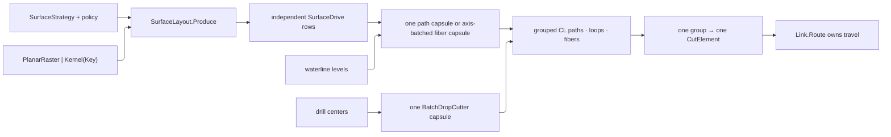

# [RASM_FABRICATION_SURFACE]

Surface planning closes analytic cutter positioning over one `SurfacePath.Sample` entry. `SurfaceLayoutKind.PlanarRaster` derives the bounded reference drive field, while `SurfaceLayoutKind.Kernel(Key)` routes any kernel-owned layout through the injected generator carried by `SurfacePolicy`; named layout rosters cannot cap the key space. Every drive, waterline loop, and push-cutter fiber survives as one `CutElement`, so native output grouping reaches `Link.Route` and no implicit feed chord joins independent paths.

`OpenCAMLib` crosses through an authored `extern "C"` shim because upstream is C++ only. One surface and cutter handle bind every capsule, so triangles marshal once per run. Each path capsule survives `setPath`, `run`, and `getCLPoints`; operations execute per drive, and one resettable capsule serves all waterline levels. Loop-count, per-loop point-count, and fiber-group reads preserve provider topology.

Wire posture: HOST-LOCAL. `Seq<CutElement>` crosses to `Cam.Generate`; native handles stay file-local to the boundary, and the run, drive-set, and receipt carriers that cross between the sampling and boundary files stay package-`internal`, never public.

## [01]-[INDEX]

- [02]-[SURFACE_PATH]: owns `SurfaceStrategy`, layout production, policy admission, and `SurfacePath.Sample → Fin<SurfacePathReceipt>`.
- [03]-[OPENCAM_BOUNDARY]: owns operation/cutter row maps, mesh/path lowering, capsule lifetimes, grouped size-then-fill reads, typed native-status routing, the authored `ocl_shim.cpp` extern C body covering every declared entry point, and the shim build/RID asset matrix.

## [02]-[SURFACE_PATH]

- Owner: `SurfaceStrategy` is the payload-bearing request family over one base `SurfacePolicy`; `SurfaceLayoutKind` is the closed planar-or-kernel generator shape; `WaterlineMode` owns operation selection; `SurfaceLayout` produces drives; `SurfacePath` exposes the sole entry. Generated `SurfaceSampling.Validate` admits native bounds once, and `SurfaceRun.Of` accumulates aggregate request faults before layout or native execution.
- Cases: `SurfaceStrategy` carries waterline, scallop, pencil, rest, raster, fiber, indexed-axis, swarf, and drill demand. `SurfaceLayoutKind.Kernel(Key)` parameterizes geodesic, flow, morph, cross-field, iso-parametric, radial, spiral, projected-curve, boundary, contour, cusp, slope, curvature, texture, and drive-surface generation without one named row per algorithm. `FiberSlice` admits endpoint-pair drives into `BatchPushCutter`. `Raster` and `Rest` carry no drives at all: the region boundary seeds the engine's own direction-and-stepover fill, and the residual bounds the reachable-surface refinement. `ThreePlusTwo` is a real 3-axis lane per indexed view because the view fixes the tool axis for its whole pass; `Swarf` alone retains axis evidence and returns typed failure, since continuous flank orientation has no `Move` encoding.
- Entry: `internal static Fin<SurfacePathReceipt> Sample(SurfaceStrategy strategy, MeshSpace mesh, CutterForm cutter)` is the only surface entry, folding one admitted pass per indexed view and one pass for every other strategy. Empty and populated requests cross `SurfaceRun.Of`; work cardinality changes execution only after aggregate admission.
- Auto: `Tolerance.Apply(ToleranceRequest.Scallop)` derives stepover. `SurfaceFrame.Of` builds one axis-angle rotation and its inverse from the indexed view, so mesh triangles marshal in frame coordinates and every returned location, fiber, interval contact, and witness facet restores to world before admission. `PlanarRaster` reads the frame-relative mesh bounds once and generates serpentine rows on the reference route. `Kernel(Key)` invokes the injected layout through `Try.lift`, and callback exceptions retain key and message on the typed rail. Pencil contact angle tightens the adaptive cosine limit, and `SurfaceSampling.FilterToleranceMm` drives the upstream `LineCLFilter` so drop-cutter output reaches posting already simplified. Rest drives `setMinSampling` from the residual's own admitted tolerance, clamped into the sampling band, so the reachable-surface field refines exactly where stock remains. Drill-family centers feed `BatchDropCutter`; an empty center set becomes a no-op only after aggregate admission.
- Receipt: `SurfacePathReceipt` carries admitted `CutElement` rows keyed by the package's one `CutElement.Identify` mint over the indexed view, path ordinal, operation, tool, work offset, and cutter geometry, beside `SurfaceSampleReceipt`; grouped `OpenCamLocation` rows, `OpenCamContactKind`, per-fiber `OpenCamInterval` engagement spans, and operation-owned topology survive lowering. `OpenCamDiagnostic` carries its operation and its `OpenCamWitness` set on every case, `Drop` adding the KD-tree instrumentation only where the operation exposes it. Locations that resolved no contact leave the triangles held under the cutter, so a gouge names geometry rather than an operation. Any nonzero native status or diagnostic-budget breach becomes `SampleStalled`; a thrown boundary preserves its message as `GeometryFault`.
- Packages: `OpenCAMLib` (`STLSurf`, `BatchDropCutter`, `PathDropCutter`, `AdaptivePathDropCutter`, `BatchPushCutter`, `Waterline` with `run2` and its X/Y fiber sets, `AdaptiveWaterline`, `CutterLocationSurface`, `ZigZag`, the composite cutter family, `getTrianglesUnderCutter`/`getOverlapTriangles`, `LineCLFilter`, `reset`, verified setters, contact rows, and grouped outputs), `System.Numerics.Tensors` (`TensorPrimitives.IsFiniteAll`), `Rasm.Meshing`, `Spec/tolerance.md` (`Tolerance`), `Toolpath/link.md` (`CutElement.Identify`, `ElementVariant.Of`), `Toolpath/motion.md` (`EngagementPolicy`), `LanguageExt.Core`, `Thinktecture.Runtime.Extensions`, `RhinoCommon`, source-generated interop, BCL inbox.
- Growth: a new 3-axis operation is one strategy case, one operation row mapping, and one operation-specific capsule arm; a new cutter assembly shape is one relief row on the correspondence column its primary already declares. Simultaneous orientation lands only after `Move` and the machine solve carry an axis frame; indexed orientation needs neither and rides `SurfaceFrame` today.
- Boundary: a caller-built drive set, a per-capsule triangle re-upload, path disposed before `run`, repeated `setPath` followed by one run, integer-code redispatch, flat loop/fiber decoding, unchecked output multiplication, non-finite native point, ignored contact-angle or residual payload, ambient thread count, or Z-only claim for continuous multi-axis motion is a deleted form.

```csharp signature
// --- [RUNTIME_PRELUDE] ----------------------------------------------------------------------------------------------------------------------------
using System.Buffers;
using System.Buffers.Binary;
using System.Numerics.Tensors;
using System.Runtime.CompilerServices;
using System.Runtime.InteropServices;
using CommunityToolkit.HighPerformance.Buffers;
using LanguageExt;
using LanguageExt.Common;
using Rasm.Domain;
using LanguageExt.Traits;
using Rasm.Fabrication.Process;
using Rasm.Fabrication.Spec;
using Rasm.Meshing;
using Rasm.Numerics;
using Rhino.Geometry;
using Thinktecture;
using static LanguageExt.Prelude;

namespace Rasm.Fabrication.Toolpath;

// --- [TYPES] --------------------------------------------------------------------------------------------------------------------------------------
[ValueObject<string>]
public sealed partial class SurfaceLayoutKey {
    static partial void ValidateFactoryArguments(ref ValidationError? validationError, ref string value) {
        value = value.Trim();
        validationError = value.Length == 0 ? new ValidationError("surface-layout-key:blank") : null;
    }
}

[Union(ConversionFromValue = ConversionOperatorsGeneration.None)]
public abstract partial record SurfaceLayoutKind {
    private SurfaceLayoutKind() { }

    public sealed record PlanarRaster : SurfaceLayoutKind;
    public sealed record Kernel(SurfaceLayoutKey Key) : SurfaceLayoutKind;

    public string Identity => Switch(
        planarRaster: static _ => "planar-raster",
        kernel: static row => row.Key.Value);
}

// `Weave` traverses the weave-graph faces instead of stitching sampled loops, so a self-touching or multi-component
// Z-level survives as separate loops where the sampling variants merge or drop it.
[SmartEnum<string>]
public sealed partial class WaterlineMode {
    public static readonly WaterlineMode Standard = new("standard");
    public static readonly WaterlineMode Adaptive = new("adaptive");
    public static readonly WaterlineMode Weave = new("weave");
}

[SmartEnum<string>]
public sealed partial class PathSamplingMode {
    public static readonly PathSamplingMode Standard = new("standard", usesAdaptiveOperation: false);
    public static readonly PathSamplingMode Adaptive = new("adaptive", usesAdaptiveOperation: true);

    public bool UsesAdaptiveOperation { get; }
}

// --- [MODELS] -------------------------------------------------------------------------------------------------------------------------------------
[ComplexValueObject]
[StructLayout(LayoutKind.Auto)]
public readonly partial struct SurfaceSampling {
    public double MinimumStepMm { get; }
    public double MaximumStepMm { get; }
    public double CosLimit { get; }
    public double FilterToleranceMm { get; }
    public PathSamplingMode Mode { get; }
    public int Threads { get; }
    public int BucketSize { get; }
    public int MaximumCalls { get; }
    public int MaximumTriangles { get; }
    public int MaximumGroups { get; }
    public int MaximumPointsPerGroup { get; }

    static partial void ValidateFactoryArguments(
        ref ValidationError? validationError,
        ref double minimumStepMm,
        ref double maximumStepMm,
        ref double cosLimit,
        ref double filterToleranceMm,
        ref PathSamplingMode mode,
        ref int threads,
        ref int bucketSize,
        ref int maximumCalls,
        ref int maximumTriangles,
        ref int maximumGroups,
        ref int maximumPointsPerGroup) =>
        validationError = minimumStepMm > 0.0
            && maximumStepMm >= minimumStepMm
            && double.IsFinite(minimumStepMm)
            && double.IsFinite(maximumStepMm)
            && cosLimit is >= -1.0 and <= 1.0
            && double.IsFinite(cosLimit)
            && filterToleranceMm >= 0.0
            && double.IsFinite(filterToleranceMm)
            && mode is not null
            && threads >= 1
            && bucketSize >= 1
            && maximumCalls >= 1
            && maximumTriangles is >= 1 and <= Array.MaxLength / 9
            && maximumGroups >= 1
            && maximumPointsPerGroup is >= 1 and <= Array.MaxLength / 4
                ? null
                : new ValidationError("surface-sampling:invalid");
}

[ComplexValueObject]
public sealed partial class SurfacePolicy {
    public EngagementPolicy Engagement { get; }
    public Option<Func<MeshSpace, SurfaceLayoutKind, double, Fin<Seq<SurfaceDrive>>>> Layout { get; }

    public SurfaceSampling Sampling => Engagement.Sampling;

    static partial void ValidateFactoryArguments(
        ref ValidationError? validationError,
        ref EngagementPolicy engagement,
        ref Option<Func<MeshSpace, SurfaceLayoutKind, double, Fin<Seq<SurfaceDrive>>>> layout) =>
        validationError = engagement is null
            ? new ValidationError("surface-policy:engagement")
            : null;
}

public readonly record struct SurfaceDrive(Arr<Point3d> Points, double Parameter);

// A rotation carries its own inverse, so the indexed frame lands both directions from one axis-angle declaration.
public readonly record struct SurfaceFrame(Transform Forward, Transform Inverse) {
    public static SurfaceFrame Of(ProjectionDir view) {
        Vector3d axis = Vector3d.CrossProduct(view.Forward, Vector3d.ZAxis);
        if (axis.IsTiny()) {
            if (view.Forward * Vector3d.ZAxis >= 0.0)
                return new SurfaceFrame(Transform.Identity, Transform.Identity);
            Transform halfTurn = Transform.Rotation(Math.PI, Vector3d.XAxis, Point3d.Origin);
            return new SurfaceFrame(halfTurn, halfTurn);
        }
        double angle = Vector3d.VectorAngle(view.Forward, Vector3d.ZAxis);
        return new SurfaceFrame(
            Transform.Rotation(angle, axis, Point3d.Origin),
            Transform.Rotation(-angle, axis, Point3d.Origin));
    }
}

internal sealed record SurfaceDriveSet(SurfaceLayoutKind Kind, Seq<SurfaceDrive> Drives, double StepOverMm);
internal sealed record SurfacePathReceipt(Seq<CutElement> Elements, SurfaceSampleReceipt Native);

[Union(ConversionFromValue = ConversionOperatorsGeneration.None)]
public abstract partial record SurfaceStrategy(SurfacePolicy Policy) {
    public sealed record Waterline(SurfacePolicy RequestPolicy, Arr<double> Levels, WaterlineMode Mode) : SurfaceStrategy(RequestPolicy);
    public sealed record Scallop(SurfacePolicy RequestPolicy, SurfaceLayoutKind Layout) : SurfaceStrategy(RequestPolicy);
    public sealed record Pencil(SurfacePolicy RequestPolicy, SurfaceLayoutKind Layout, double ContactAngleDeg) : SurfaceStrategy(RequestPolicy);
    public sealed record Rest(SurfacePolicy RequestPolicy, SurfaceLayoutKind Layout, ResidualStock Stock) : SurfaceStrategy(RequestPolicy);
    public sealed record Raster(SurfacePolicy RequestPolicy, Arr<Point3d> Region, double DirectionDeg, Point3d Origin) : SurfaceStrategy(RequestPolicy);
    public sealed record FiberSlice(SurfacePolicy RequestPolicy, SurfaceLayoutKind Layout) : SurfaceStrategy(RequestPolicy);
    public sealed record ThreePlusTwo(SurfacePolicy RequestPolicy, SurfaceLayoutKind Layout, Arr<ProjectionDir> IndexedViews) : SurfaceStrategy(RequestPolicy);
    public sealed record Swarf(SurfacePolicy RequestPolicy, SurfaceLayoutKind Layout, ProjectionDir ToolAxis, double FlankOffsetMm) : SurfaceStrategy(RequestPolicy);
    public sealed record DrillFamily(SurfacePolicy RequestPolicy, Arr<Point3d> Centers) : SurfaceStrategy(RequestPolicy);

    public string Key => Switch(
        waterline: static _ => "waterline",
        scallop: static _ => "scallop",
        pencil: static _ => "pencil",
        rest: static _ => "rest",
        raster: static _ => "raster",
        fiberSlice: static _ => "fiber-slice",
        threePlusTwo: static _ => "three-plus-two",
        swarf: static _ => "swarf",
        drillFamily: static _ => "drill-family");

    // Each case names the `CutStrategy` row it realizes, so the element key this page mints carries the same
    // strategy discriminant a motion-generated element does and one identity scheme spans both producers.
    public CutStrategy Cut => Switch(
        waterline: static _ => CutStrategy.Waterline,
        scallop: static _ => CutStrategy.Scallop,
        pencil: static _ => CutStrategy.Pencil,
        rest: static _ => CutStrategy.Rest,
        raster: static _ => CutStrategy.Raster,
        fiberSlice: static _ => CutStrategy.Face,
        threePlusTwo: static _ => CutStrategy.ThreePlusTwo,
        swarf: static _ => CutStrategy.Swarf,
        drillFamily: static _ => CutStrategy.DrillCycle);

    public FabricationFault.SampleStalled Stalled(int iteration) =>
        new(new FaultSubject.Strategy(Key), iteration);
}

internal sealed record SurfaceRun(
    SurfaceStrategy Strategy,
    MeshSpace Mesh,
    CutterForm Cutter,
    double StepOverMm,
    OpenCamOperationKind Operation,
    OpenCamCutterKind CutterKind,
    SurfaceSampling Sampling,
    SurfaceFrame Frame,
    int View,
    Option<SurfaceDriveSet> Drives) {
    // An indexed view fixes the tool axis for its whole pass, so the run rotates into that frame and samples 3-axis.
    public static Fin<SurfaceRun> Of(SurfaceStrategy strategy, MeshSpace mesh, CutterForm cutter, int view) =>
        from sampling in EffectiveSampling(strategy)
        let frame = strategy is SurfaceStrategy.ThreePlusTwo indexed
            ? SurfaceFrame.Of(indexed.IndexedViews[view])
            : new SurfaceFrame(Transform.Identity, Transform.Identity)
        let admission = AdmissionSlots.Accumulate(Seq(
            Gate(strategy is not SurfaceStrategy.Swarf, "tool-axis-unrepresentable"),
            Gate(ValidPayload(strategy), "strategy-payload"),
            Gate(strategy.Policy.Engagement.Budget is ProcessBudget.Subtractive, "non-subtractive-budget"),
            Gate(cutter.Diameter > 0.0 && double.IsFinite(cutter.Diameter), "cutter")))
            .As()
            .ToFin()
        from _ in admission
        from tolerance in Tolerance.Apply(new ToleranceRequest.Scallop(strategy.Policy.Engagement.Finish, cutter))
        from step in tolerance is ToleranceReceipt.Scallop receipt
               ? Fin.Succ(receipt.StepMm)
               : Fin.Fail<double>(new FabricationFault.PolicyInadmissible(FabConcern.Toolpath, "surface:scallop-receipt"))
        from __ in step > 0.0 && double.IsFinite(step)
                   ? Fin.Succ(unit)
                   : Fin.Fail<Unit>(new FabricationFault.PolicyInadmissible(FabConcern.Toolpath, "surface:stepover"))
        from drives in SurfaceLayout.Produce(strategy, mesh, step, frame)
        from ___ in ValidDrives(strategy, drives)
                   ? Fin.Succ(unit)
                   : Fin.Fail<Unit>(new FabricationFault.PolicyInadmissible(FabConcern.Toolpath, "surface:drive-payload"))
        from cutterKind in OpenCamCutterKind.Of(cutter)
        select new SurfaceRun(
                   strategy,
                   mesh,
                   cutter,
                   step,
                   OpenCamOperationKind.Of(strategy, sampling),
                   cutterKind,
                   sampling,
                   frame,
                   view,
                   drives);

    private static Fin<SurfaceSampling> EffectiveSampling(SurfaceStrategy strategy) =>
        strategy is SurfaceStrategy.Pencil pencil
            ? SurfaceSampling.Validate(
                pencil.Policy.Sampling.MinimumStepMm,
                pencil.Policy.Sampling.MaximumStepMm,
                Math.Min(
                    pencil.Policy.Sampling.CosLimit,
                    Math.Cos(Math.Clamp(pencil.ContactAngleDeg, 0.0, 90.0) * Math.PI / 180.0)),
                pencil.Policy.Sampling.FilterToleranceMm,
                pencil.Policy.Sampling.Mode,
                pencil.Policy.Sampling.Threads,
                pencil.Policy.Sampling.BucketSize,
                pencil.Policy.Sampling.MaximumCalls,
                pencil.Policy.Sampling.MaximumTriangles,
                pencil.Policy.Sampling.MaximumGroups,
                pencil.Policy.Sampling.MaximumPointsPerGroup,
                out SurfaceSampling sampling) is { } error
                    ? Fin.Fail<SurfaceSampling>(new FabricationFault.PolicyInadmissible(FabConcern.Toolpath, error.Message))
                    : Fin.Succ(sampling)
            : Fin.Succ(strategy.Policy.Sampling);

    private static bool ValidPayload(SurfaceStrategy strategy) =>
        strategy.Switch(
            waterline:    static row => row.Mode is not null && !row.Levels.IsEmpty && row.Levels.All(double.IsFinite),
            scallop:      static row => Valid(row.Layout),
            pencil:       static row => Valid(row.Layout)
                && row.ContactAngleDeg is >= 0.0 and <= 90.0 && double.IsFinite(row.ContactAngleDeg),
            rest:         static row => Valid(row.Layout) && row.Stock.Uncut.All(static loop => loop.Closed && loop.Count >= 3),
            raster:       static row => row.Region.Count >= 3 && row.Region.All(static corner => corner.IsValid)
                && row.Origin.IsValid && double.IsFinite(row.DirectionDeg),
            fiberSlice:   static row => Valid(row.Layout),
            threePlusTwo: static row => Valid(row.Layout) && !row.IndexedViews.IsEmpty
                && row.IndexedViews.All(static view => view is not null && view.Forward.IsValid),
            swarf:        static row => Valid(row.Layout) && row.ToolAxis is not null && row.ToolAxis.Forward.IsValid
                && row.FlankOffsetMm >= 0.0 && double.IsFinite(row.FlankOffsetMm),
            drillFamily:  static row => row.Centers.All(static center => center.IsValid));

    private static bool Valid(SurfaceLayoutKind layout) =>
        layout is not null && layout.Switch(
            planarRaster: static _ => true,
            kernel: static row => row.Key is not null);

    private static bool ValidDrives(SurfaceStrategy strategy, Option<SurfaceDriveSet> drives) =>
        strategy is not SurfaceStrategy.FiberSlice
        || drives.Match(
            Some: static set => !set.Drives.IsEmpty && set.Drives.All(static drive => drive.Points.Count == 2),
            None: static () => false);

    private static K<Validation<Error>, Unit> Gate(bool holds, string axis) =>
        AdmissionSlots.Gate(holds, new FabricationFault.PolicyInadmissible(FabConcern.Toolpath, $"surface:{axis}"));
}

// --- [OPERATIONS] ---------------------------------------------------------------------------------------------------------------------------------
file static class SurfaceLayout {
    public static Fin<Option<SurfaceDriveSet>> Produce(SurfaceStrategy strategy, MeshSpace mesh, double stepOver, SurfaceFrame frame) =>
        strategy.Switch(
            waterline:    static _ => Fin.Succ(Option<SurfaceDriveSet>.None),
            scallop:      row => Laid(row.Policy, row.Layout, mesh, stepOver, frame),
            pencil:       row => Laid(row.Policy, row.Layout, mesh, stepOver, frame),
            rest:         static _ => Fin.Succ(Option<SurfaceDriveSet>.None),
            raster:       static _ => Fin.Succ(Option<SurfaceDriveSet>.None),
            fiberSlice:   row => Laid(row.Policy, row.Layout, mesh, stepOver, frame),
            threePlusTwo: row => Laid(row.Policy, row.Layout, mesh, stepOver, frame),
            swarf:        static _ => Fin.Fail<Option<SurfaceDriveSet>>(new FabricationFault.PolicyInadmissible(FabConcern.Toolpath, "surface-layout:tool-axis")),
            drillFamily:  static _ => Fin.Succ(Option<SurfaceDriveSet>.None));

    private static Fin<Option<SurfaceDriveSet>> Laid(
        SurfacePolicy policy,
        SurfaceLayoutKind kind,
        MeshSpace mesh,
        double stepOver,
        SurfaceFrame frame) =>
        kind.Switch(
            state: (Mesh: mesh, StepOver: stepOver, Frame: frame),
            planarRaster: static (state, _) => Raster(state.Mesh, state.StepOver, state.Frame),
            kernel: (state, row) => policy.Layout.Match(
                Some: layout => Try.lift(() => layout(state.Mesh, row, state.StepOver)).Run()
                    .MapFail(error => new GeometryFault.DegenerateInput(Kind.Curve, None, $"surface-layout:thrown:{row.Identity}:{error.Message}").ToError())
                    .Bind(identity),
                None: () => Fin.Fail<Seq<SurfaceDrive>>(new FabricationFault.PolicyInadmissible(FabConcern.Toolpath, $"surface-layout:unbound:{row.Identity}"))))
        .Bind(drives => drives.IsEmpty || drives.Exists(static drive => drive.Points.Count < 2 || drive.Points.Exists(static point => !point.IsValid))
            ? Fin.Fail<Option<SurfaceDriveSet>>(new GeometryFault.DegenerateInput(Kind.Curve, None, $"surface-layout:invalid:{kind.Identity}").ToError())
            : Fin.Succ(Optional(new SurfaceDriveSet(kind, drives, stepOver))));

    private static Fin<Seq<SurfaceDrive>> Raster(MeshSpace mesh, double stepOver, SurfaceFrame frame) {
        BoundingBox box = mesh.Native.GetBoundingBox(frame.Forward);
        double width = box.Max.X - box.Min.X;
        if (!box.IsValid || width <= 0.0 || !double.IsFinite(width) || !double.IsFinite(box.Max.Y - box.Min.Y))
            return Fin.Fail<Seq<SurfaceDrive>>(new GeometryFault.DegenerateInput(Kind.Mesh, None, "surface-layout:degenerate-raster").ToError());

        double requiredRows = Math.Ceiling((box.Max.Y - box.Min.Y) / stepOver);
        if (!double.IsFinite(requiredRows) || requiredRows > int.MaxValue - 1)
            return Fin.Fail<Seq<SurfaceDrive>>(new FabricationFault.PolicyInadmissible(FabConcern.Toolpath, "surface-layout:row-cap"));

        int rows = Math.Max(1, (int)requiredRows) + 1;
        return Fin.Succ(Range(0, rows).ToSeq().Map(row => {
            double fraction = rows == 1 ? 0.0 : (double)row / (rows - 1);
            double ordinate = box.Min.Y + ((box.Max.Y - box.Min.Y) * fraction);
            Point3d minimum = new(box.Min.X, ordinate, box.Max.Z);
            Point3d maximum = new(box.Max.X, ordinate, box.Max.Z);
            return new SurfaceDrive(
                row % 2 == 0 ? Arr(minimum, maximum) : Arr(maximum, minimum),
                Parameter: ordinate);
        }).ToSeq());
    }
}

internal static class SurfacePath {
    // Indexed views are one admitted pass each; every other strategy is the single-view degenerate case of the same fold.
    internal static Fin<SurfacePathReceipt> Sample(SurfaceStrategy strategy, MeshSpace mesh, CutterForm cutter) =>
        from admittedStrategy in Optional(strategy).ToFin(new FabricationFault.PolicyInadmissible(FabConcern.Toolpath, "surface:strategy"))
        from _ in Optional(admittedStrategy.Policy).ToFin(new FabricationFault.PolicyInadmissible(FabConcern.Toolpath, "surface:policy"))
        from admittedMesh in Optional(mesh).ToFin(new FabricationFault.PolicyInadmissible(FabConcern.Toolpath, "surface:mesh"))
        from admittedCutter in Optional(cutter).ToFin(new FabricationFault.PolicyInadmissible(FabConcern.Toolpath, "surface:cutter"))
        from views in admittedStrategy is SurfaceStrategy.ThreePlusTwo indexed
            ? indexed.IndexedViews.IsEmpty
                ? Fin.Fail<Seq<int>>(new FabricationFault.PolicyInadmissible(FabConcern.Toolpath, "surface:indexed-views"))
                : Fin.Succ(Range(0, indexed.IndexedViews.Count).ToSeq())
            : Fin.Succ(Seq(0))
        from passes in views.Traverse(view => Pass(admittedStrategy, admittedMesh, admittedCutter, view))
        // The operation is a per-run constant every pass shares, so the first pass names it; an empty pass set is
        // unreachable because `views` is admitted non-empty above, and the rail states that rather than assuming it.
        from lead in passes.Head
            .ToFin(new FabricationFault.PolicyInadmissible(FabConcern.Toolpath, "surface:no-pass"))
        select new SurfacePathReceipt(
            passes.Bind(static pass => pass.Elements),
            new SurfaceSampleReceipt(
                passes.Bind(static pass => pass.Native.Paths),
                lead.Native.Operation,
                passes.Bind(static pass => pass.Native.Diagnostics),
                passes.Bind(static pass => pass.Native.Fibers)));

    private static Fin<SurfacePathReceipt> Pass(SurfaceStrategy strategy, MeshSpace mesh, CutterForm cutter, int view) =>
        from run in SurfaceRun.Of(strategy, mesh, cutter, view)
        from native in run.Strategy is SurfaceStrategy.DrillFamily { Centers.IsEmpty: true }
            ? Fin.Succ(new SurfaceSampleReceipt(
                Seq<Arr<OpenCamLocation>>(),
                run.Operation,
                Seq<OpenCamDiagnostic>(),
                Seq<OpenCamFiber>()))
            : OpenCamLib.Position(run)
        from _ in native.Paths.IsEmpty && strategy is not (SurfaceStrategy.Rest or SurfaceStrategy.DrillFamily)
            ? Fin.Fail<Unit>(strategy.Stalled(0).ToError())
            : Fin.Succ(unit)
        from budget in strategy.Policy.Engagement.Budget is ProcessBudget.Subtractive subtractive
            ? Fin.Succ(subtractive)
            : Fin.Fail<ProcessBudget.Subtractive>(new FabricationFault.PolicyInadmissible(FabConcern.Toolpath, "surface:non-subtractive-budget"))
        from elements in native.Paths.IsEmpty
            ? Fin.Succ(Seq<CutElement>())
            : native.ToElements(run, budget.FeedRate)
        select new SurfacePathReceipt(elements, native);
}
```

## [03]-[OPENCAM_BOUNDARY]

- Owner: `OpenCamOperationKind` binds strategy to operation identity and result topology; `OpenCamCutterKind` binds cutter form to one verified constructor delegate and owns the relief correspondence that lifts a primary row to its composite; `CutterRelief` classifies the geometry above the cutting edge; `OpenCamNative` declares only the local C-shim ABI; `SafeHandle` capsules own native lifetime; `OpenCamLib` executes grouped units.
- Cases: operations `BatchDropCutter`, `PathDropCutter`, `AdaptivePathDropCutter`, `BatchPushCutter`, `Waterline`, `AdaptiveWaterline`, `CutterLocationSurface`, `ZigZag`, `WeaveWaterline`; primary cutters `Cyl`, `Ball`, `Bull`, `Cone` and their relieved forms `CompCyl`, `CompBall`, `CylCone`, `BallCone`, `BullCone`, `ConeCone`.
- Entry: file-local `OpenCamLib.Position(SurfaceRun)` mints one `OpenCamBinding` — surface and cutter — then creates one capsule per path, one capsule per fiber-direction batch, one batch capsule for unordered drill centers, one capsule for a bounded raster region or a reachable-surface refinement, and exactly one waterline capsule reset across every level. Each capsule performs common setup, operation-specific setup, `run`, and the matching grouped read before disposal.
- Auto: path drives create and retain `OclPathHandle` through execution; waterline levels read loops and the weave row's fiber sets beside them; push drives read fibers and select X/Y scanning from the drive vector; the raster region and the drill centers both enter through the shared point append; the reachable surface reads one group per edge. Batch points preserve input/output independence as one singleton element per location, and the returned location census must equal the admitted center census. Count queries bound allocations, and fill results reject negative, excessive, empty, non-finite, or partial rows.
- Receipt: the first nonzero native status routes `SampleStalled` with the exact status and a thrown native boundary outcome enters the same typed rail, so a receipt exists only for all-clean executions and never re-records status. `OpenCamLocation.Contact` retains `CCType` classification as plane-local evidence, and an interval carries that classification at both cutter-contact ends.
- Packages: `vendor/ocl_shim/ocl_shim.cpp` is the package-owned `extern "C"` body — one shim export per declared `[LibraryImport]` entry point, `STLSurf` and `MillingCutter` each owning a handle family independent of operation lifetime, its status vocabulary the exact integers `Gate` lifts into `SampleStalled`; `vendor/ocl_shim/CMakeLists.txt` is the build owner, linking the shim SHARED against the shipped SHARED `libocl` per the LGPL dynamic-link law; the RID matrix rides `vendor/runtimes/<rid>/native/` — per RID the SHIM artifact the `Library` constant resolves (`win-x64/ocl_shim.dll`, `linux-x64/libocl_shim.so`, `osx-arm64/libocl_shim.dylib`) beside the upstream SHARED `libocl` it links — through the folder `.csproj`'s `Exists`-gated `Content` group.
- Boundary: upstream OpenCAMLib has no C ABI. `ocl_shim.cpp` alone flattens C++ vectors and exposes opaque handles; raw handles, C++ mangled entry points, and unmanaged ownership never reach domain code; `libocl` stays dynamically linked and is never folded statically into the shim.

```csharp signature
// --- [RUNTIME_PRELUDE] ----------------------------------------------------------------------------------------------------------------------------
using System.Buffers;
using System.Numerics.Tensors;
using System.Runtime.CompilerServices;
using System.Runtime.InteropServices;
using LanguageExt;
using Microsoft.Win32.SafeHandles;
using Rasm.Fabrication.Process;
using Rhino.Geometry;
using Thinktecture;
using static LanguageExt.Prelude;

namespace Rasm.Fabrication.Toolpath;

// --- [TYPES] --------------------------------------------------------------------------------------------------------------------------------------
[SmartEnum<string>]
internal sealed partial class OpenCamOperationKind {
    public static readonly OpenCamOperationKind BatchDropCutter = new("batch-drop-cutter", 1, supportsDropDiagnostics: true, static count => count == 1);
    public static readonly OpenCamOperationKind PathDropCutter = new("path-drop-cutter", 2, supportsDropDiagnostics: true, static count => count >= 2);
    public static readonly OpenCamOperationKind AdaptivePathDropCutter = new("adaptive-path-drop-cutter", 3, supportsDropDiagnostics: true, static count => count >= 2);
    public static readonly OpenCamOperationKind BatchPushCutter = new("batch-push-cutter", 4, supportsDropDiagnostics: false, static count => count >= 2 && count % 2 == 0);
    public static readonly OpenCamOperationKind Waterline = new("waterline", 5, supportsDropDiagnostics: false, static count => count >= 3);
    public static readonly OpenCamOperationKind AdaptiveWaterline = new("adaptive-waterline", 6, supportsDropDiagnostics: false, static count => count >= 3);
    public static readonly OpenCamOperationKind CutterLocationSurface = new("cl-surface", 7, supportsDropDiagnostics: false, static count => count == 2);
    public static readonly OpenCamOperationKind ZigZag = new("zigzag", 8, supportsDropDiagnostics: false, static count => count >= 2);
    public static readonly OpenCamOperationKind WeaveWaterline = new("weave-waterline", 9, supportsDropDiagnostics: false, static count => count >= 3);

    public int Code { get; }
    public bool SupportsDropDiagnostics { get; }

    [UseDelegateFromConstructor]
    public partial bool Admits(int pointCount);

    public static OpenCamOperationKind Of(SurfaceStrategy strategy, SurfaceSampling sampling) =>
        strategy.Switch(
            waterline:    static row => row.Mode.Switch(
                standard: static () => Waterline,
                adaptive: static () => AdaptiveWaterline,
                weave:    static () => WeaveWaterline),
            scallop:      _ => sampling.Mode.UsesAdaptiveOperation ? AdaptivePathDropCutter : PathDropCutter,
            pencil:       _ => sampling.Mode.UsesAdaptiveOperation ? AdaptivePathDropCutter : PathDropCutter,
            rest:         static _ => CutterLocationSurface,
            raster:       static _ => ZigZag,
            fiberSlice:   static _ => BatchPushCutter,
            threePlusTwo: static _ => PathDropCutter,
            swarf:        static _ => BatchPushCutter,
            drillFamily:  static _ => BatchDropCutter);
}

// Relief is the geometry ABOVE the cutting edge — a shank wider than the flute, or a cone opening from it — and it
// limits contact on a deep wall where the flute cannot. Cones outrank a plain shank by limiting contact everywhere
// that shank does.
[SmartEnum<string>]
internal sealed partial class CutterRelief {
    public static readonly CutterRelief None = new("none");
    public static readonly CutterRelief Shank = new("shank");
    public static readonly CutterRelief Cone = new("cone");

    private const double Relative = 1e-6;

    public static CutterRelief Of(CutterForm cutter) =>
        cutter.LeadAngleDeg.Exists(static angle => angle > Relative && double.IsFinite(angle))
            ? Cone
            : (cutter.ShankDiameterMm | cutter.BodyDiameterMm)
                .Exists(width => width > cutter.Diameter * (1.0 + Relative) && double.IsFinite(width))
                    ? Shank
                    : None;
}

// Each composite row carries the same cutting edge above its shank or relief cone, so the primary row owns the
// relief correspondence as a deferred column and the family switch keeps returning one primary per family.
[SmartEnum<string>]
internal sealed partial class OpenCamCutterKind {
    public static readonly OpenCamCutterKind Cyl = new("cyl", MintCyl, static relief => relief.Switch(
        none: static () => Cyl, shank: static () => CompCyl, cone: static () => CylCone));
    public static readonly OpenCamCutterKind Ball = new("ball", MintBall, static relief => relief.Switch(
        none: static () => Ball, shank: static () => CompBall, cone: static () => BallCone));
    // Upstream ships no toroid-plus-shank row, so a bull with a plain wider shank stays the toroid it cuts with.
    public static readonly OpenCamCutterKind Bull = new("bull", MintBull, static relief => relief.Switch(
        none: static () => Bull, shank: static () => Bull, cone: static () => BullCone));
    public static readonly OpenCamCutterKind Cone = new("cone", MintCone, static relief => relief.Switch(
        none: static () => Cone, shank: static () => Cone, cone: static () => ConeCone));
    // Relief already rides a composite row, so its correspondence is the identity the deferred column spells.
    public static readonly OpenCamCutterKind BullCone = new("bull-cone", MintBullCone, static _ => BullCone);
    public static readonly OpenCamCutterKind CompCyl = new("comp-cyl", MintCompCyl, static _ => CompCyl);
    public static readonly OpenCamCutterKind CompBall = new("comp-ball", MintCompBall, static _ => CompBall);
    public static readonly OpenCamCutterKind CylCone = new("cyl-cone", MintCylCone, static _ => CylCone);
    public static readonly OpenCamCutterKind BallCone = new("ball-cone", MintBallCone, static _ => BallCone);
    public static readonly OpenCamCutterKind ConeCone = new("cone-cone", MintConeCone, static _ => ConeCone);

    [UseDelegateFromConstructor]
    public partial OclCutterHandle Mint(CutterForm cutter);

    [UseDelegateFromConstructor]
    public partial OpenCamCutterKind Relieved(CutterRelief relief);

    public static Fin<OpenCamCutterKind> Of(CutterForm cutter) => Primary(cutter)
        .Map(primary => primary.Relieved(CutterRelief.Of(cutter)));

    private static Fin<OpenCamCutterKind> Primary(CutterForm cutter) => cutter.Family.Switch<Fin<OpenCamCutterKind>>(
        state: cutter,
        flat:        static _ => Fin.Succ(Cyl),
        ball:        static _ => Fin.Succ(Ball),
        bull:        static _ => Fin.Succ(Bull),
        barrel:      static _ => Unsupported(CutterFamily.Barrel),
        lollipop:    static _ => Unsupported(CutterFamily.Lollipop),
        taper:       static form => Fin.Succ(form is { CornerRadius: > 0.0, TaperAngle: > 0.0 } ? BullCone : Cone),
        dovetail:    static _ => Unsupported(CutterFamily.Dovetail),
        drill:       static _ => Fin.Succ(Cone),
        chamfer:     static _ => Fin.Succ(Cone),
        engraver:    static _ => Unsupported(CutterFamily.Engraver),
        threadMill:  static _ => Fin.Succ(Cyl),
        tap:         static _ => Unsupported(CutterFamily.Tap),
        reamer:      static _ => Unsupported(CutterFamily.Reamer),
        boringBar:   static _ => Unsupported(CutterFamily.BoringBar),
        faceMill:    static _ => Unsupported(CutterFamily.FaceMill),
        slittingSaw: static _ => Unsupported(CutterFamily.SlittingSaw));

    private static Fin<OpenCamCutterKind> Unsupported(CutterFamily family) =>
        Fin.Fail<OpenCamCutterKind>(new FabricationFault.WitnessMalformed(family.Key, nameof(OpenCamCutterKind)).ToError());

    private static OclCutterHandle MintCyl(CutterForm cutter) => OpenCamNative.CutterCyl(cutter.Diameter, cutter.FluteLength);
    private static OclCutterHandle MintBall(CutterForm cutter) => OpenCamNative.CutterBall(cutter.Diameter, cutter.FluteLength);
    private static OclCutterHandle MintBull(CutterForm cutter) => OpenCamNative.CutterBull(cutter.Diameter, cutter.CornerRadius, cutter.FluteLength);
    private static OclCutterHandle MintCone(CutterForm cutter) => OpenCamNative.CutterCone(cutter.Diameter, cutter.TaperAngle, cutter.FluteLength);
    private static OclCutterHandle MintBullCone(CutterForm cutter) =>
        OpenCamNative.CutterBullCone(cutter.Diameter, cutter.CornerRadius, Major(cutter), Relief(cutter));
    private static OclCutterHandle MintCompCyl(CutterForm cutter) => OpenCamNative.CutterCompCyl(cutter.Diameter, Major(cutter));
    private static OclCutterHandle MintCompBall(CutterForm cutter) => OpenCamNative.CutterCompBall(cutter.Diameter, Major(cutter));
    private static OclCutterHandle MintCylCone(CutterForm cutter) => OpenCamNative.CutterCylCone(cutter.Diameter, Major(cutter), Relief(cutter));
    private static OclCutterHandle MintBallCone(CutterForm cutter) => OpenCamNative.CutterBallCone(cutter.Diameter, Major(cutter), Relief(cutter));
    private static OclCutterHandle MintConeCone(CutterForm cutter) =>
        OpenCamNative.CutterConeCone(cutter.Diameter, cutter.TaperAngle, Major(cutter), Relief(cutter));

    // Composites reach past the flute, so major length is the admitted usable reach and falls back to the flute
    // when the assembly carried none; the relief angle is the lead the shank opens at, or the edge taper when it is flat.
    private static double Major(CutterForm cutter) =>
        (cutter.UsableLengthMm | cutter.FunctionalLengthMm).IfNone(cutter.FluteLength);

    private static double Relief(CutterForm cutter) => cutter.LeadAngleDeg.IfNone(cutter.TaperAngle);
}

// --- [MODELS] -------------------------------------------------------------------------------------------------------------------------------------
file sealed class NativeBuffer<T>(int length) : IDisposable {
    public T[] Data { get; } = ArrayPool<T>.Shared.Rent(length);
    public int Length { get; } = length;

    public void Dispose() => ArrayPool<T>.Shared.Return(Data, clearArray: RuntimeHelpers.IsReferenceOrContainsReferences<T>());
}

file sealed class OpenCamMeshBuffer(NativeBuffer<double> storage, int triangleCount) : IDisposable {
    public double[] Triangles => storage.Data;
    public int TriangleCount { get; } = triangleCount;

    public static Fin<OpenCamMeshBuffer> Project(MeshSpace mesh, int maximumTriangles, Transform frame) {
        Mesh native = mesh.Native;
        long triangleCount = native.Faces.Sum(static face => face.IsQuad ? 2L : 1L);
        if (triangleCount <= 0L || triangleCount > maximumTriangles)
            return Fin.Fail<OpenCamMeshBuffer>(new FabricationFault.PolicyInadmissible(FabConcern.Toolpath, "opencam:mesh-capacity"));
        using NativeBuffer<int> corners = new(checked((int)triangleCount * 3));
        int cornerCount = 0;
        foreach (MeshFace face in native.Faces) {
            corners.Data[cornerCount++] = face.A;
            corners.Data[cornerCount++] = face.B;
            corners.Data[cornerCount++] = face.C;
            if (face.IsQuad) {
                corners.Data[cornerCount++] = face.A;
                corners.Data[cornerCount++] = face.C;
                corners.Data[cornerCount++] = face.D;
            }
        }
        if (cornerCount != corners.Length
            || Range(0, corners.Length).Exists(index => corners.Data[index] < 0 || corners.Data[index] >= native.Vertices.Count))
            return Fin.Fail<OpenCamMeshBuffer>(new GeometryFault.DegenerateInput(Kind.Mesh, None, "opencam:mesh-indices").ToError());

        NativeBuffer<double> buffer = new(corners.Length * 3);
        for (int index = 0; index < corners.Length; index++) {
            Point3d vertex = frame * new Point3d(native.Vertices[corners.Data[index]]);
            buffer.Data[index * 3] = vertex.X;
            buffer.Data[(index * 3) + 1] = vertex.Y;
            buffer.Data[(index * 3) + 2] = vertex.Z;
        }
        if (!TensorPrimitives.IsFiniteAll(buffer.Data.AsSpan(0, buffer.Length))) {
            buffer.Dispose();
            return Fin.Fail<OpenCamMeshBuffer>(new GeometryFault.DegenerateInput(Kind.Mesh, None, "opencam:mesh-finite").ToError());
        }
        return Fin.Succ(new OpenCamMeshBuffer(buffer, checked((int)triangleCount)));
    }

    public void Dispose() => storage.Dispose();
}

[ValueObject<int>]
internal readonly partial struct OpenCamContactKind {
    static partial void ValidateFactoryArguments(ref ValidationError? validationError, ref int value) =>
        validationError = value >= 0 ? null : new ValidationError("opencam-contact:negative");
}

internal readonly record struct OpenCamLocation(Point3d Location, OpenCamContactKind Contact);

internal readonly record struct OpenCamFacet(Point3d A, Point3d B, Point3d C);

// Upstream names the triangles it held under the cutter at a location that resolved no contact, so an unresolved
// sample carries the offending geometry rather than an operation name.
internal readonly record struct OpenCamWitness(int Location, Arr<OpenCamFacet> Facets);

// Interval endpoints ARE the radial engagement arc per fiber, and the contact pair is the flank-orientation
// evidence a continuous-flank strategy needs; parametric bounds locate both along the fiber.
internal readonly record struct OpenCamInterval(
    double Lower,
    double Upper,
    Point3d LowerContact,
    Point3d UpperContact,
    OpenCamContactKind LowerKind,
    OpenCamContactKind UpperKind);

internal readonly record struct OpenCamFiber(Point3d Start, Point3d End, Vector3d Direction, Arr<OpenCamInterval> Intervals);

[Union]
internal abstract partial record OpenCamDiagnostic(OpenCamOperationKind Operation, Seq<OpenCamWitness> Witness) {
    public sealed record Drop(OpenCamOperationKind RunOperation, Seq<OpenCamWitness> RunWitness, int Calls, int BucketSize)
        : OpenCamDiagnostic(RunOperation, RunWitness);

    public sealed record Executed(OpenCamOperationKind RunOperation, Seq<OpenCamWitness> RunWitness)
        : OpenCamDiagnostic(RunOperation, RunWitness);
}

internal readonly record struct OpenCamUnit<T>(T Value, OpenCamDiagnostic Diagnostic);

internal readonly record struct OpenCamBinding(OclSurfaceHandle Surface, OclCutterHandle Cutter);

file delegate int OpenCamGroupFill(
    OclOperationHandle operation,
    int group,
    double[] output,
    int capacity,
    out int written);

internal sealed record SurfaceSampleReceipt(
    Seq<Arr<OpenCamLocation>> Paths,
    OpenCamOperationKind Operation,
    Seq<OpenCamDiagnostic> Diagnostics,
    Seq<OpenCamFiber> Fibers) {
    public Seq<OpenCamContactKind> Contacts => Paths.Bind(static path => path.Map(static row => row.Contact)).Distinct();

    // Native locations are frame-local; the inverse rotation restores world coordinates before any element is
    // admitted. Identity is `CutElement.Identify`'s — the surface discriminants are the indexed view, the path
    // ordinal, and the operation, and the mint digests them beside tool, work offset, and cutter geometry through
    // the one canonical codec. A page-local `ArrayPoolBufferWriter` preimage was a second byte codec whose double
    // framing and unnormalized NaN forked the key space and whose move projection dropped `SweepRadians`, so two
    // geometrically distinct arcs keyed alike. `ElementVariant.Of` measures rotation, exposure, and pierces off the
    // emitted motion, so a hardcoded `0.0/0.0/0` triple no longer contradicts the objective that sums it.
    public Fin<Seq<CutElement>> ToElements(SurfaceRun run, double feed) =>
        !ValidTopology()
            ? Fin.Fail<Seq<CutElement>>(new FabricationFault.PolicyInadmissible(FabConcern.Toolpath, "opencam:receipt-topology"))
            : feed > 0.0 && double.IsFinite(feed)
                ? Paths.Map((path, index) => (Path: path, Index: index)).Traverse(row => Element(run, feed, row.Path, row.Index))
                : Fin.Fail<Seq<CutElement>>(new FabricationFault.PolicyInadmissible(FabConcern.Toolpath, "opencam:feed"));

    private static Fin<CutElement> Element(SurfaceRun run, double feed, Arr<OpenCamLocation> path, int index) =>
        from _ in path.IsEmpty
            ? Fin.Fail<Unit>(new GeometryFault.DegenerateInput(Kind.Curve, index, "opencam:empty-path").ToError())
            : Fin.Succ(unit)
        let toolKey = run.Cutter.Evidence.Map(static evidence => evidence.ToolId).IfNone(run.Cutter.Family.Key)
        let workOffset = run.Strategy.Policy.Engagement.WorkOffset
        let moves = path.ToSeq().Map(point => (Move)new Move.Linear(run.Frame.Inverse * point.Location, feed))
        from key in CutElement.Identify(new CutElementIdentity.Surface(
            run.View,
            index,
            run.Strategy.Cut,
            run.Operation.Key,
            toolKey,
            workOffset,
            run.Cutter.Family.Key,
            run.Cutter.Diameter,
            run.Cutter.CornerRadius,
            run.Cutter.TaperAngle,
            run.Cutter.FluteLength,
            moves))
        from element in CutElement.Admit(
            key,
            toolKey,
            workOffset,
            // `SurfaceRun.Of` admits only a `ProcessBudget.Subtractive` policy, so the modality is this page's own
            // proven gate rather than an assumed constant.
            new EntryFamily.Fixed(ElementVariant.Of(key, moves, ProcessModality.Subtractive)))
        select element;

    private bool ValidTopology() =>
        Paths.All(path => Operation.Admits(path.Count));
}

// --- [SERVICES] -----------------------------------------------------------------------------------------------------------------------------------
internal sealed class OclOperationHandle : SafeHandleZeroOrMinusOneIsInvalid {
    public OclOperationHandle() : base(ownsHandle: true) { }
    protected override bool ReleaseHandle() { OpenCamNative.OperationDestroy(handle); return true; }
}

internal sealed class OclCutterHandle : SafeHandleZeroOrMinusOneIsInvalid {
    public OclCutterHandle() : base(ownsHandle: true) { }
    protected override bool ReleaseHandle() { OpenCamNative.CutterDestroy(handle); return true; }
}

internal sealed class OclPathHandle : SafeHandleZeroOrMinusOneIsInvalid {
    public OclPathHandle() : base(ownsHandle: true) { }
    protected override bool ReleaseHandle() { OpenCamNative.PathDestroy(handle); return true; }
}

internal sealed class OclSurfaceHandle : SafeHandleZeroOrMinusOneIsInvalid {
    public OclSurfaceHandle() : base(ownsHandle: true) { }
    protected override bool ReleaseHandle() { OpenCamNative.SurfaceDestroy(handle); return true; }
}

// `Library` resolves the shim; upstream `libocl` remains a separately linked shared archive.
internal static partial class OpenCamNative {
    internal const string Library = "ocl_shim";

    [LibraryImport(Library, EntryPoint = "ocl_op_create")]
    internal static partial OclOperationHandle OperationCreate(int operation);
    [LibraryImport(Library, EntryPoint = "ocl_op_set_surface")]
    internal static partial int OperationSetSurface(OclOperationHandle operation, OclSurfaceHandle surface);
    [LibraryImport(Library, EntryPoint = "ocl_op_reset")]
    internal static partial int OperationReset(OclOperationHandle operation);
    [LibraryImport(Library, EntryPoint = "ocl_op_set_filter_tolerance")]
    internal static partial int OperationSetFilterTolerance(OclOperationHandle operation, double tolerance);
    [LibraryImport(Library, EntryPoint = "ocl_op_set_cutter")]
    internal static partial int OperationSetCutter(OclOperationHandle operation, OclCutterHandle cutter);
    [LibraryImport(Library, EntryPoint = "ocl_op_set_sampling")]
    internal static partial int OperationSetSampling(OclOperationHandle operation, double sampling);
    [LibraryImport(Library, EntryPoint = "ocl_op_set_min_sampling")]
    internal static partial int OperationSetMinSampling(OclOperationHandle operation, double sampling);
    [LibraryImport(Library, EntryPoint = "ocl_op_set_cos_limit")]
    internal static partial int OperationSetCosLimit(OclOperationHandle operation, double cosLimit);
    [LibraryImport(Library, EntryPoint = "ocl_op_set_threads")]
    internal static partial int OperationSetThreads(OclOperationHandle operation, int threads);
    [LibraryImport(Library, EntryPoint = "ocl_op_set_bucket_size")]
    internal static partial int OperationSetBucketSize(OclOperationHandle operation, int bucketSize);
    [LibraryImport(Library, EntryPoint = "ocl_op_get_bucket_size")]
    internal static partial int OperationGetBucketSize(OclOperationHandle operation);
    [LibraryImport(Library, EntryPoint = "ocl_op_get_calls")]
    internal static partial int OperationGetCalls(OclOperationHandle operation);
    [LibraryImport(Library, EntryPoint = "ocl_op_set_z")]
    internal static partial int OperationSetZ(OclOperationHandle operation, double z);
    [LibraryImport(Library, EntryPoint = "ocl_op_append_point")]
    internal static partial int OperationAppendPoint(OclOperationHandle operation, double x, double y, double z);
    [LibraryImport(Library, EntryPoint = "ocl_op_set_path")]
    internal static partial int OperationSetPath(OclOperationHandle operation, OclPathHandle path);
    [LibraryImport(Library, EntryPoint = "ocl_op_append_fiber")]
    internal static partial int OperationAppendFiber(OclOperationHandle operation, double x1, double y1, double z1, double x2, double y2, double z2);
    [LibraryImport(Library, EntryPoint = "ocl_op_set_x_direction")]
    internal static partial int OperationSetXDirection(OclOperationHandle operation);
    [LibraryImport(Library, EntryPoint = "ocl_op_set_y_direction")]
    internal static partial int OperationSetYDirection(OclOperationHandle operation);
    [LibraryImport(Library, EntryPoint = "ocl_op_set_direction")]
    internal static partial int OperationSetDirection(OclOperationHandle operation, double degrees);
    [LibraryImport(Library, EntryPoint = "ocl_op_set_origin")]
    internal static partial int OperationSetOrigin(OclOperationHandle operation, double x, double y, double z);
    [LibraryImport(Library, EntryPoint = "ocl_op_set_stepover")]
    internal static partial int OperationSetStepOver(OclOperationHandle operation, double stepOver);
    [LibraryImport(Library, EntryPoint = "ocl_op_run")]
    internal static partial int OperationRun(OclOperationHandle operation);
    [LibraryImport(Library, EntryPoint = "ocl_op_cl_count")]
    internal static partial int OperationClCount(OclOperationHandle operation);
    [LibraryImport(Library, EntryPoint = "ocl_op_get_clpoints")]
    internal static partial int OperationGetClPoints(OclOperationHandle operation, double[] output, int capacity, out int written);
    [LibraryImport(Library, EntryPoint = "ocl_op_loop_count")]
    internal static partial int OperationLoopCount(OclOperationHandle operation);
    [LibraryImport(Library, EntryPoint = "ocl_op_loop_point_count")]
    internal static partial int OperationLoopPointCount(OclOperationHandle operation, int loop);
    [LibraryImport(Library, EntryPoint = "ocl_op_get_loop")]
    internal static partial int OperationGetLoop(OclOperationHandle operation, int loop, double[] output, int capacity, out int written);
    [LibraryImport(Library, EntryPoint = "ocl_op_fiber_count")]
    internal static partial int OperationFiberCount(OclOperationHandle operation);
    [LibraryImport(Library, EntryPoint = "ocl_op_fiber_point_count")]
    internal static partial int OperationFiberPointCount(OclOperationHandle operation, int fiber);
    [LibraryImport(Library, EntryPoint = "ocl_op_get_fiber")]
    internal static partial int OperationGetFiber(OclOperationHandle operation, int fiber, double[] output, int capacity, out int written);
    [LibraryImport(Library, EntryPoint = "ocl_op_fiber_interval_count")]
    internal static partial int OperationFiberIntervalCount(OclOperationHandle operation, int fiber);
    [LibraryImport(Library, EntryPoint = "ocl_op_get_fiber_intervals")]
    internal static partial int OperationGetFiberIntervals(OclOperationHandle operation, int fiber, double[] output, int capacity, out int written);
    [LibraryImport(Library, EntryPoint = "ocl_op_witness_count")]
    internal static partial int OperationWitnessCount(OclOperationHandle operation);
    [LibraryImport(Library, EntryPoint = "ocl_op_witness_facet_count")]
    internal static partial int OperationWitnessFacetCount(OclOperationHandle operation, int witness);
    [LibraryImport(Library, EntryPoint = "ocl_op_get_witness")]
    internal static partial int OperationGetWitness(OclOperationHandle operation, int witness, double[] output, int capacity, out int written);
    [LibraryImport(Library, EntryPoint = "ocl_op_destroy")]
    internal static partial void OperationDestroy(nint operation);
    [LibraryImport(Library, EntryPoint = "ocl_stl_create")]
    internal static partial OclSurfaceHandle SurfaceCreate(double[] triangles, int triangleCount);
    [LibraryImport(Library, EntryPoint = "ocl_stl_destroy")]
    internal static partial void SurfaceDestroy(nint surface);
    [LibraryImport(Library, EntryPoint = "ocl_path_create")]
    internal static partial OclPathHandle PathCreate();
    [LibraryImport(Library, EntryPoint = "ocl_path_append_line")]
    internal static partial int PathAppendLine(OclPathHandle path, double x1, double y1, double z1, double x2, double y2, double z2);
    [LibraryImport(Library, EntryPoint = "ocl_path_destroy")]
    internal static partial void PathDestroy(nint path);
    [LibraryImport(Library, EntryPoint = "ocl_cutter_cyl")]
    internal static partial OclCutterHandle CutterCyl(double diameter, double length);
    [LibraryImport(Library, EntryPoint = "ocl_cutter_ball")]
    internal static partial OclCutterHandle CutterBall(double diameter, double length);
    [LibraryImport(Library, EntryPoint = "ocl_cutter_bull")]
    internal static partial OclCutterHandle CutterBull(double diameter, double radius, double length);
    [LibraryImport(Library, EntryPoint = "ocl_cutter_cone")]
    internal static partial OclCutterHandle CutterCone(double diameter, double angle, double length);
    [LibraryImport(Library, EntryPoint = "ocl_cutter_bullcone")]
    internal static partial OclCutterHandle CutterBullCone(double diameter, double radius, double length, double angle);
    [LibraryImport(Library, EntryPoint = "ocl_cutter_compcyl")]
    internal static partial OclCutterHandle CutterCompCyl(double diameter, double length);
    [LibraryImport(Library, EntryPoint = "ocl_cutter_compball")]
    internal static partial OclCutterHandle CutterCompBall(double diameter, double length);
    [LibraryImport(Library, EntryPoint = "ocl_cutter_cylcone")]
    internal static partial OclCutterHandle CutterCylCone(double diameter, double majorLength, double angle);
    [LibraryImport(Library, EntryPoint = "ocl_cutter_ballcone")]
    internal static partial OclCutterHandle CutterBallCone(double diameter, double majorLength, double angle);
    [LibraryImport(Library, EntryPoint = "ocl_cutter_conecone")]
    internal static partial OclCutterHandle CutterConeCone(double diameter, double angle, double majorLength, double majorAngle);
    [LibraryImport(Library, EntryPoint = "ocl_cutter_destroy")]
    internal static partial void CutterDestroy(nint cutter);
}

// --- [OPERATIONS] ---------------------------------------------------------------------------------------------------------------------------------
internal static class OpenCamLib {
    // Flat-buffer strides the shim writes: a fiber header is start/end/direction, an interval is its parametric bounds
    // plus a contact point and classification at each end, a facet is three corners, and a witness leads with its
    // location ordinal.
    private const int FiberHeader = 9;
    private const int IntervalStride = 10;
    private const int FacetStride = 9;
    private const int WitnessHeader = 1;

    internal static Fin<SurfaceSampleReceipt> Position(SurfaceRun run) =>
        Try.lift<Fin<SurfaceSampleReceipt>>(() => PositionNative(run)).Run()
            .MapFail(error => new GeometryFault.DegenerateInput(Kind.Curve, None, $"opencam:thrown:{error.Message}").ToError())
            .Bind(identity);

    // One triangle upload and one cutter mint serve every capsule in the run; per-level re-marshalling is the deleted form.
    private static Fin<SurfaceSampleReceipt> PositionNative(SurfaceRun run) =>
        OpenCamMeshBuffer.Project(run.Mesh, run.Sampling.MaximumTriangles, run.Frame.Forward).Bind(mesh => {
            using (mesh)
            using (OclSurfaceHandle surface = OpenCamNative.SurfaceCreate(mesh.Triangles, mesh.TriangleCount))
            using (OclCutterHandle cutter = run.CutterKind.Mint(run.Cutter)) {
                OpenCamBinding binding = new(surface, cutter);
                return surface.IsInvalid || cutter.IsInvalid
                    ? Fin.Fail<SurfaceSampleReceipt>(run.Strategy.Stalled(-1).ToError())
                    : run.Strategy.Switch(
                        waterline:    row => Levels(run, binding, row.Levels),
                        scallop:      _ => Paths(run, binding),
                        pencil:       _ => Paths(run, binding),
                        rest:         row => Surface(run, binding, row.Stock),
                        raster:       row => Region(run, binding, row),
                        threePlusTwo: _ => Paths(run, binding),
                        fiberSlice:   _ => Fibers(run, binding),
                        swarf:        static _ => Fin.Fail<SurfaceSampleReceipt>(new FabricationFault.PolicyInadmissible(FabConcern.Toolpath, "opencam:tool-axis")),
                        drillFamily:  row => Points(run, binding, row.Centers));
            }
        });

    // `reset` clears fibers, loops, and evidence in place, so one waterline capsule sweeps every admitted Z level; the
    // weave row leaves its X and Y fiber sets beside the loops, and the sampling rows leave none.
    private static Fin<SurfaceSampleReceipt> Levels(SurfaceRun run, OpenCamBinding binding, Arr<double> levels) {
        using OclOperationHandle operation = OpenCamNative.OperationCreate(run.Operation.Code);
        return operation.IsInvalid
            ? Fin.Fail<SurfaceSampleReceipt>(run.Strategy.Stalled(-1).ToError())
            : Configure(run, binding, operation).Bind(_ => levels.ToSeq().Traverse(level =>
                Gate(run, () => OpenCamNative.OperationReset(operation), () => OpenCamNative.OperationSetZ(operation, level))
                    .Bind(__ => Execute(
                        run,
                        operation,
                        op => ReadGroups(op, run, OpenCamNative.OperationLoopCount, OpenCamNative.OperationLoopPointCount, OpenCamNative.OperationGetLoop)
                            .Bind(groups => ReadFibers(op, run).Map(fibers => (Groups: groups, Fibers: fibers)))))))
              .Map(units => Receipt(
                  run,
                  units.Bind(static unit => unit.Value.Groups),
                  units.Map(static unit => unit.Diagnostic),
                  units.Bind(static unit => unit.Value.Fibers)));
    }

    private static Fin<SurfaceSampleReceipt> Paths(SurfaceRun run, OpenCamBinding binding) =>
        run.Drives.Match(
            None: () => Fin.Fail<SurfaceSampleReceipt>(new FabricationFault.PolicyInadmissible(FabConcern.Toolpath, "opencam:path-without-drives")),
            Some: set => set.Drives.Traverse(drive => Path(run, binding, drive)).Map(units => Receipt(
                run,
                units.Map(static unit => unit.Value),
                units.Map(static unit => unit.Diagnostic),
                Seq<OpenCamFiber>())));

    // Reachable-surface refinement needs no drive set, and the residual's own admitted tolerance is the fineness
    // that rest model demands where stock remains; one group per edge preserves the vertex-and-edge topology
    // upstream returns.
    private static Fin<SurfaceSampleReceipt> Surface(SurfaceRun run, OpenCamBinding binding, ResidualStock stock) =>
        Unit(
            run,
            binding,
            operation => Gate(run, () => OpenCamNative.OperationSetMinSampling(operation, MinSampling(run, stock))),
            operation => ReadGroups(operation, run, OpenCamNative.OperationLoopCount, OpenCamNative.OperationLoopPointCount, OpenCamNative.OperationGetLoop))
        .Map(unit => Receipt(run, unit.Value, Seq(unit.Diagnostic), Seq<OpenCamFiber>()));

    private static double MinSampling(SurfaceRun run, ResidualStock stock) =>
        stock.Uncut.Head
            .Map(static loop => loop.Tolerance.Absolute.Value)
            .Map(tolerance => Math.Clamp(tolerance, run.Sampling.MinimumStepMm, run.Sampling.MaximumStepMm))
            .IfNone(run.Sampling.MinimumStepMm);

    // Region boundaries seed the fill through the same point append the drop batch uses, so direction, origin, and
    // stepover carry the whole raster policy.
    private static Fin<SurfaceSampleReceipt> Region(SurfaceRun run, OpenCamBinding binding, SurfaceStrategy.Raster raster) =>
        Unit(
            run,
            binding,
            operation => raster.Region.Fold(
                Gate(
                    run,
                    () => OpenCamNative.OperationSetDirection(operation, raster.DirectionDeg),
                    () => OpenCamNative.OperationSetOrigin(operation, raster.Origin.X, raster.Origin.Y, raster.Origin.Z),
                    () => OpenCamNative.OperationSetStepOver(operation, run.StepOverMm)),
                (rail, corner) => rail.Bind(_ => Gate(run, () => OpenCamNative.OperationAppendPoint(operation, corner.X, corner.Y, corner.Z)))),
            operation => ReadLocations(operation, run))
        .Map(unit => Receipt(run, Seq(unit.Value), Seq(unit.Diagnostic), Seq<OpenCamFiber>()));

    private static Fin<OpenCamUnit<Arr<OpenCamLocation>>> Path(SurfaceRun run, OpenCamBinding binding, SurfaceDrive drive) {
        using OclPathHandle path = OpenCamNative.PathCreate();
        return path.IsInvalid || drive.Points.Count < 2
            ? Fin.Fail<OpenCamUnit<Arr<OpenCamLocation>>>(new GeometryFault.DegenerateInput(Kind.Curve, None, "opencam:path").ToError())
            : Range(0, drive.Points.Count - 1).Fold(
                Fin.Succ(0),
                (state, index) => state.Bind(_ => Gate(run, () => OpenCamNative.PathAppendLine(
                    path,
                    drive.Points[index].X, drive.Points[index].Y, drive.Points[index].Z,
                    drive.Points[index + 1].X, drive.Points[index + 1].Y, drive.Points[index + 1].Z))))
              .Bind(_ => Unit(
                  run,
                  binding,
                  operation => Gate(run, () => OpenCamNative.OperationSetPath(operation, path)),
                  operation => ReadLocations(operation, run)));
    }

    private static Fin<SurfaceSampleReceipt> Fibers(SurfaceRun run, OpenCamBinding binding) =>
        run.Drives.Match(
            None: () => Fin.Fail<SurfaceSampleReceipt>(new FabricationFault.PolicyInadmissible(FabConcern.Toolpath, "opencam:fiber-without-drives")),
            Some: set => Seq(
                (YDirection: false, Drives: set.Drives.Filter(static drive => AlongX(drive))),
                (YDirection: true, Drives: set.Drives.Filter(static drive => !AlongX(drive))))
                .Filter(static batch => !batch.Drives.IsEmpty)
                .Traverse(batch => Unit(
                    run,
                    binding,
                    operation => batch.Drives.Fold(
                        Gate(run, batch.YDirection
                            ? () => OpenCamNative.OperationSetYDirection(operation)
                            : () => OpenCamNative.OperationSetXDirection(operation)),
                        (rail, drive) => rail.Bind(_ => Gate(run, () => OpenCamNative.OperationAppendFiber(
                            operation,
                            drive.Points[0].X,
                            drive.Points[0].Y,
                            drive.Points[0].Z,
                            drive.Points[drive.Points.Count - 1].X,
                            drive.Points[drive.Points.Count - 1].Y,
                            drive.Points[drive.Points.Count - 1].Z)))),
                    operation => ReadGroups(operation, run, OpenCamNative.OperationFiberCount, OpenCamNative.OperationFiberPointCount, OpenCamNative.OperationGetFiber)
                        .Bind(groups => ReadFibers(operation, run).Map(fibers => (Groups: groups, Fibers: fibers)))))
                .Map(units => Receipt(
                    run,
                    units.Bind(static unit => unit.Value.Groups),
                    units.Map(static unit => unit.Diagnostic),
                    units.Bind(static unit => unit.Value.Fibers))));

    private static bool AlongX(SurfaceDrive drive) {
        Point3d from = drive.Points[0];
        Point3d to = drive.Points[drive.Points.Count - 1];
        return Math.Abs(to.X - from.X) >= Math.Abs(to.Y - from.Y);
    }

    private static Fin<SurfaceSampleReceipt> Points(SurfaceRun run, OpenCamBinding binding, Arr<Point3d> centers) =>
        centers.IsEmpty
            ? Fin.Fail<SurfaceSampleReceipt>(new GeometryFault.DegenerateInput(Kind.Curve, None, "opencam:points-empty").ToError())
            : Unit(
                run,
                binding,
                operation => centers.Fold(
                    Fin.Succ(0),
                    (state, point) => state.Bind(_ => Gate(run, () => OpenCamNative.OperationAppendPoint(operation, point.X, point.Y, point.Z)))),
                operation => ReadLocations(operation, run))
              .Bind(rows => rows.Value.Count == centers.Count
                  ? Fin.Succ(Receipt(
                      run,
                      rows.Value.Map(static row => Arr(row)).ToSeq(),
                      Seq(rows.Diagnostic),
                      Seq<OpenCamFiber>()))
                  : Fin.Fail<SurfaceSampleReceipt>(run.Strategy.Stalled(rows.Value.Count).ToError()));

    private static Fin<OpenCamUnit<T>> Unit<T>(
        SurfaceRun run,
        OpenCamBinding binding,
        Func<OclOperationHandle, Fin<int>> configure,
        Func<OclOperationHandle, Fin<T>> read) {
        using OclOperationHandle operation = OpenCamNative.OperationCreate(run.Operation.Code);
        return operation.IsInvalid
            ? Fin.Fail<OpenCamUnit<T>>(run.Strategy.Stalled(-1).ToError())
            : Configure(run, binding, operation)
                .Bind(_ => configure(operation))
                .Bind(_ => Execute(run, operation, read));
    }

    private static Fin<int> Configure(SurfaceRun run, OpenCamBinding binding, OclOperationHandle operation) =>
        Gate(
            run,
            () => OpenCamNative.OperationSetSurface(operation, binding.Surface),
            () => OpenCamNative.OperationSetCutter(operation, binding.Cutter),
            () => OpenCamNative.OperationSetSampling(operation, run.Sampling.MaximumStepMm),
            () => OpenCamNative.OperationSetMinSampling(operation, run.Sampling.MinimumStepMm),
            () => OpenCamNative.OperationSetCosLimit(operation, run.Sampling.CosLimit),
            () => OpenCamNative.OperationSetFilterTolerance(operation, run.Sampling.FilterToleranceMm),
            () => OpenCamNative.OperationSetThreads(operation, run.Sampling.Threads))
        .Bind(_ => run.Operation.SupportsDropDiagnostics
            ? Gate(run, () => OpenCamNative.OperationSetBucketSize(operation, run.Sampling.BucketSize))
            : Fin.Succ(0));

    private static Fin<OpenCamUnit<T>> Execute<T>(
        SurfaceRun run,
        OclOperationHandle operation,
        Func<OclOperationHandle, Fin<T>> read) =>
        Gate(run, () => OpenCamNative.OperationRun(operation))
            .Bind(_ => Diagnostic(run, operation))
            .Bind(diagnostic => read(operation).Map(value => new OpenCamUnit<T>(value, diagnostic)));

    private static Fin<Arr<OpenCamLocation>> ReadLocations(OclOperationHandle operation, SurfaceRun run) {
        int count = OpenCamNative.OperationClCount(operation);
        return Count(run, count, minimum: 0, maximum: run.Sampling.MaximumPointsPerGroup).Bind(valid => {
            if (valid == 0)
                return Fin.Succ(Arr<OpenCamLocation>.Empty);
            using NativeBuffer<double> output = new(valid * 4);
            int written = 0;
            return Gate(run, () => OpenCamNative.OperationGetClPoints(operation, output.Data, output.Length, out written))
                .Bind(_ => Written(run, written, valid))
                .Bind(_ => Decode(run, output.Data, valid));
        });
    }

    private static Fin<Seq<Arr<OpenCamLocation>>> ReadGroups(
        OclOperationHandle operation,
        SurfaceRun run,
        Func<OclOperationHandle, int> groupCount,
        Func<OclOperationHandle, int, int> pointCount,
        OpenCamGroupFill fill) =>
        Count(run, groupCount(operation), minimum: 0, maximum: run.Sampling.MaximumGroups).Bind(groups =>
            Range(0, groups).Traverse(group => Count(
                run,
                pointCount(operation, group),
                minimum: 1,
                maximum: run.Sampling.MaximumPointsPerGroup).Bind(points => {
                using NativeBuffer<double> output = new(points * 4);
                int written = 0;
                return Gate(run, () => fill(operation, group, output.Data, output.Length, out written))
                    .Bind(_ => Written(run, written, points))
                    .Bind(_ => Decode(run, output.Data, points));
            })));

    private static Fin<int> Count(SurfaceRun run, int count, int minimum, int maximum) =>
        count >= minimum && count <= maximum
            ? Fin.Succ(count)
            : Fin.Fail<int>(run.Strategy.Stalled(count).ToError());

    private static Fin<int> Written(SurfaceRun run, int written, int expected) =>
        written == expected
            ? Fin.Succ(written)
            : Fin.Fail<int>(run.Strategy.Stalled(written).ToError());

    private static Fin<Arr<OpenCamLocation>> Decode(SurfaceRun run, double[] output, int count) =>
        output.Length >= count * 4 && TensorPrimitives.IsFiniteAll(output.AsSpan(0, count * 4))
            ? Range(0, count).Traverse(index => Contact(run, output[(index * 4) + 3]).Map(contact => new OpenCamLocation(
                new Point3d(output[index * 4], output[(index * 4) + 1], output[(index * 4) + 2]),
                contact))).Map(static rows => rows.ToArr())
            : Fin.Fail<Arr<OpenCamLocation>>(run.Strategy.Stalled(-2).ToError());

    private static Fin<OpenCamContactKind> Contact(SurfaceRun run, double raw) =>
        raw < 0.0 || raw > int.MaxValue || raw != Math.Truncate(raw)
            ? Fin.Fail<OpenCamContactKind>(run.Strategy.Stalled(-2).ToError())
            : OpenCamContactKind.Validate((int)raw, provider: null, out OpenCamContactKind contact) is { } error
                ? Fin.Fail<OpenCamContactKind>(new FabricationFault.PolicyInadmissible(FabConcern.Toolpath, $"opencam:contact:{error.Message}"))
                : Fin.Succ(contact);

    // Fiber evidence is its own axis: the push lane retains one row per fiber that met material, the weave waterline
    // retains its X and Y fiber sets beside the loops, and every other operation retains none.
    private static Fin<Seq<OpenCamFiber>> ReadFibers(OclOperationHandle operation, SurfaceRun run) =>
        Count(run, OpenCamNative.OperationFiberCount(operation), minimum: 0, maximum: run.Sampling.MaximumGroups).Bind(fibers =>
            Range(0, fibers).Traverse(fiber => Count(
                run,
                OpenCamNative.OperationFiberIntervalCount(operation, fiber),
                minimum: 0,
                maximum: run.Sampling.MaximumPointsPerGroup).Bind(intervals => {
                using NativeBuffer<double> output = new(FiberHeader + (intervals * IntervalStride));
                int written = 0;
                return Gate(run, () => OpenCamNative.OperationGetFiberIntervals(operation, fiber, output.Data, output.Length, out written))
                    .Bind(_ => Written(run, written, output.Length))
                    .Bind(_ => DecodeFiber(run, output.Data, intervals));
            })));

    private static Fin<OpenCamFiber> DecodeFiber(SurfaceRun run, double[] output, int intervals) =>
        TensorPrimitives.IsFiniteAll(output.AsSpan(0, FiberHeader + (intervals * IntervalStride)))
            ? Range(0, intervals).Traverse(index => DecodeInterval(run, output, FiberHeader + (index * IntervalStride)))
                .Map(rows => new OpenCamFiber(
                    run.Frame.Inverse * new Point3d(output[0], output[1], output[2]),
                    run.Frame.Inverse * new Point3d(output[3], output[4], output[5]),
                    run.Frame.Inverse * new Vector3d(output[6], output[7], output[8]),
                    rows.ToArr()))
            : Fin.Fail<OpenCamFiber>(run.Strategy.Stalled(-3).ToError());

    private static Fin<OpenCamInterval> DecodeInterval(SurfaceRun run, double[] output, int at) =>
        from lower in Contact(run, output[at + 5])
        from upper in Contact(run, output[at + 9])
        select new OpenCamInterval(
            output[at],
            output[at + 1],
            run.Frame.Inverse * new Point3d(output[at + 2], output[at + 3], output[at + 4]),
            run.Frame.Inverse * new Point3d(output[at + 6], output[at + 7], output[at + 8]),
            lower,
            upper);

    // Upstream holds its triangles only while the operation object lives, so the shim harvests them inside the run
    // and the managed side reads a retained buffer.
    private static Fin<Seq<OpenCamWitness>> ReadWitness(OclOperationHandle operation, SurfaceRun run) =>
        Count(run, OpenCamNative.OperationWitnessCount(operation), minimum: 0, maximum: run.Sampling.MaximumGroups).Bind(rows =>
            Range(0, rows).Traverse(row => Count(
                run,
                OpenCamNative.OperationWitnessFacetCount(operation, row),
                minimum: 1,
                maximum: run.Sampling.MaximumTriangles).Bind(facets => {
                using NativeBuffer<double> output = new(WitnessHeader + (facets * FacetStride));
                int written = 0;
                return Gate(run, () => OpenCamNative.OperationGetWitness(operation, row, output.Data, output.Length, out written))
                    .Bind(_ => Written(run, written, output.Length))
                    .Bind(_ => DecodeWitness(run, output.Data, facets));
            })));

    private static Fin<OpenCamWitness> DecodeWitness(SurfaceRun run, double[] output, int facets) =>
        TensorPrimitives.IsFiniteAll(output.AsSpan(0, WitnessHeader + (facets * FacetStride)))
        && output[0] >= 0.0 && output[0] == Math.Truncate(output[0])
            ? Fin.Succ(new OpenCamWitness(
                (int)output[0],
                Range(0, facets).ToSeq().Map(index => DecodeFacet(run, output, WitnessHeader + (index * FacetStride))).ToArr()))
            : Fin.Fail<OpenCamWitness>(run.Strategy.Stalled(-4).ToError());

    private static OpenCamFacet DecodeFacet(SurfaceRun run, double[] output, int at) =>
        new(run.Frame.Inverse * new Point3d(output[at], output[at + 1], output[at + 2]),
            run.Frame.Inverse * new Point3d(output[at + 3], output[at + 4], output[at + 5]),
            run.Frame.Inverse * new Point3d(output[at + 6], output[at + 7], output[at + 8]));

    private static Fin<OpenCamDiagnostic> Diagnostic(SurfaceRun run, OclOperationHandle operation) =>
        ReadWitness(operation, run).Bind(witness => run.Operation.SupportsDropDiagnostics
            ? OpenCamNative.OperationGetCalls(operation) is var calls
              && OpenCamNative.OperationGetBucketSize(operation) is var bucketSize
              && calls is >= 0
              && calls <= run.Sampling.MaximumCalls
              && bucketSize == run.Sampling.BucketSize
                ? Fin.Succ<OpenCamDiagnostic>(new OpenCamDiagnostic.Drop(run.Operation, witness, calls, bucketSize))
                : Fin.Fail<OpenCamDiagnostic>(run.Strategy.Stalled(calls).ToError())
            : Fin.Succ<OpenCamDiagnostic>(new OpenCamDiagnostic.Executed(run.Operation, witness)));

    private static SurfaceSampleReceipt Receipt(
        SurfaceRun run,
        Seq<Arr<OpenCamLocation>> paths,
        Seq<OpenCamDiagnostic> diagnostics,
        Seq<OpenCamFiber> fibers) =>
        new(paths, run.Operation, diagnostics, fibers);

    private static Fin<int> Gate(SurfaceRun run, params ReadOnlySpan<Func<int>> steps) =>
        toSeq(steps.ToArray()).Fold(
            Fin.Succ(0),
            (rail, step) => rail.Bind(_ => step() is var status && status == 0
                ? Fin.Succ(status)
                : Fin.Fail<int>(run.Strategy.Stalled(status).ToError())));
}
```

```cpp signature
// `OclShimOperation` owns execution state; borrowed cutter/path handles retain their dedicated destroy owners.
// Every export returns `0` or a negative status, and `Trap` prevents exceptions from crossing the ABI.
#include <array>
#include <cmath>
#include <memory>
#include <numbers>
#include <vector>
#include <opencamlib/stlsurf.hpp>
#include <opencamlib/triangle.hpp>
#include <opencamlib/point.hpp>
#include <opencamlib/clpoint.hpp>
#include <opencamlib/fiber.hpp>
#include <opencamlib/path.hpp>
#include <opencamlib/millingcutter.hpp>
#include <opencamlib/cylcutter.hpp>
#include <opencamlib/ballcutter.hpp>
#include <opencamlib/bullcutter.hpp>
#include <opencamlib/conecutter.hpp>
#include <opencamlib/bullconecutter.hpp>
#include <opencamlib/batchdropcutter.hpp>
#include <opencamlib/pathdropcutter.hpp>
#include <opencamlib/adaptivepathdropcutter.hpp>
#include <opencamlib/batchpushcutter.hpp>
#include <opencamlib/waterline.hpp>
#include <opencamlib/adaptivewaterline.hpp>
#include <opencamlib/clsurface.hpp>
#include <opencamlib/zigzag.hpp>
#include <opencamlib/compoundcutter.hpp>
#include <opencamlib/lineclfilter.hpp>

#if defined(_WIN32)
  #define OCL_SHIM_EXPORT extern "C" __declspec(dllexport)
#else
  #define OCL_SHIM_EXPORT extern "C" __attribute__((visibility("default")))
#endif

namespace {

constexpr int kOk = 0, kBadHandle = -1, kBadBuffer = -2, kBadState = -4, kTrapped = -9;

using Row = std::array<double, 4>;
using Facet = std::array<double, 9>;

// Each fiber row carries the fiber's own geometry with its intervals; each witness row carries one unresolved CL
// location with the triangles held under the cutter there. Both harvest inside `Run`, because the operation
// object that owns them is destroyed when `Run` returns.
struct FiberRow {
    std::array<double, 9> geometry{};
    std::vector<std::array<double, 10>> intervals;
};

struct WitnessRow {
    int location = 0;
    std::vector<Facet> facets;
};

struct OclShimOperation {
    int kind = 0;
    ocl::STLSurf* surface = nullptr;
    ocl::MillingCutter* cutter = nullptr;
    ocl::Path* path = nullptr;
    double sampling = 0.0, minSampling = 0.0, cosLimit = 1.0, filterTolerance = 0.0, z = 0.0;
    double direction = 0.0, stepOver = 0.0;
    ocl::Point origin{0.0, 0.0, 0.0};
    int threads = 1, bucketSize = 1, calls = 0;
    bool yDirection = false;
    std::vector<ocl::CLPoint> seeds;
    std::vector<ocl::Fiber> fibers;
    std::vector<std::vector<Row>> groups;
    std::vector<FiberRow> fiberRows;
    std::vector<WitnessRow> witnesses;
};

OclShimOperation* Op(void* handle) { return static_cast<OclShimOperation*>(handle); }

template <typename Body>
int Trap(void* handle, Body body) {
    if (handle == nullptr) return kBadHandle;
    try { return body(*Op(handle)); } catch (...) { return kTrapped; }
}

Row Of(ocl::CLPoint& cl) { return {cl.x, cl.y, cl.z, static_cast<double>(cl.getCC().type)}; }

int Fill(const std::vector<Row>& rows, double* output, int capacity, int* written) {
    if (output == nullptr || capacity < static_cast<int>(rows.size()) * 4) return kBadBuffer;
    for (size_t row = 0; row < rows.size(); ++row)
        for (size_t slot = 0; slot < 4; ++slot)
            output[(row * 4) + slot] = rows[row][slot];
    *written = static_cast<int>(rows.size());
    return kOk;
}

int FillFlat(const std::vector<double>& values, double* output, int capacity, int* written) {
    if (output == nullptr || capacity < static_cast<int>(values.size())) return kBadBuffer;
    for (size_t slot = 0; slot < values.size(); ++slot) output[slot] = values[slot];
    *written = static_cast<int>(values.size());
    return kOk;
}

Facet Corners(const ocl::Triangle& triangle) {
    return {triangle.p[0].x, triangle.p[0].y, triangle.p[0].z,
            triangle.p[1].x, triangle.p[1].y, triangle.p[1].z,
            triangle.p[2].x, triangle.p[2].y, triangle.p[2].z};
}

FiberRow Evidence(ocl::Fiber& fiber) {
    FiberRow row;
    row.geometry = {fiber.p1.x, fiber.p1.y, fiber.p1.z,
                    fiber.p2.x, fiber.p2.y, fiber.p2.z,
                    fiber.dir.x, fiber.dir.y, fiber.dir.z};
    for (ocl::Interval& interval : fiber.ints)
        row.intervals.push_back({interval.lower, interval.upper,
                                 interval.lower_cc.x, interval.lower_cc.y, interval.lower_cc.z,
                                 static_cast<double>(interval.lower_cc.type),
                                 interval.upper_cc.x, interval.upper_cc.y, interval.upper_cc.z,
                                 static_cast<double>(interval.upper_cc.type)});
    return row;
}

// Contact ordinal zero is the unresolved sample: the drop found no surface under the cutter, so the triangles the
// engine held there are the gouge witness the managed rail carries in place of an operation name.
template <typename Unit>
void Witness(OclShimOperation& op, Unit& unit, std::vector<ocl::CLPoint>& points) {
    for (size_t index = 0; index < points.size(); ++index) {
        if (static_cast<int>(points[index].getCC().type) != 0) continue;
        WitnessRow row;
        row.location = static_cast<int>(index);
        for (ocl::Triangle& triangle : unit.getTrianglesUnderCutter(points[index], *op.cutter))
            row.facets.push_back(Corners(triangle));
        if (!row.facets.empty()) op.witnesses.push_back(row);
    }
}

// Fibers that met no material ARE the push-side unresolved case, and overlapped triangles name what they missed.
void Witness(OclShimOperation& op, ocl::BatchPushCutter& unit, std::vector<ocl::Fiber>& fibers) {
    for (size_t index = 0; index < fibers.size(); ++index) {
        if (!fibers[index].ints.empty()) continue;
        WitnessRow row;
        row.location = static_cast<int>(index);
        for (ocl::Triangle& triangle : unit.getOverlapTriangles(fibers[index])) row.facets.push_back(Corners(triangle));
        if (!row.facets.empty()) op.witnesses.push_back(row);
    }
}

void Loops(OclShimOperation& op, const std::vector<std::vector<ocl::Point>>& loops) {
    for (const std::vector<ocl::Point>& loop : loops) {
        std::vector<Row> group;
        for (const ocl::Point& point : loop) group.push_back({point.x, point.y, point.z, 0.0});
        op.groups.push_back(group);
    }
}

// `LineCLFilter` is the upstream CL-point simplifier; a zero tolerance keeps the raw sampled stream.
void Filter(OclShimOperation& op, std::vector<ocl::CLPoint>& points) {
    if (op.filterTolerance <= 0.0 || points.size() < 3) return;
    ocl::LineCLFilter unit;
    unit.setTolerance(op.filterTolerance);
    for (ocl::CLPoint& cl : points) unit.addCLPoint(cl);
    unit.run();
    points = *unit.getCLPoints();
}

int Run(OclShimOperation& op) {
    if (op.cutter == nullptr || op.surface == nullptr) return kBadState;
    op.groups.clear();
    op.fiberRows.clear();
    op.witnesses.clear();
    switch (op.kind) {
        case 1: {
            ocl::BatchDropCutter unit;
            unit.setSTL(*op.surface); unit.setCutter(*op.cutter); unit.setThreads(op.threads); unit.setBucketSize(op.bucketSize);
            for (ocl::CLPoint& seed : op.seeds) unit.appendPoint(seed);
            unit.run();
            op.bucketSize = unit.getBucketSize(); op.calls = unit.getCalls();
            std::vector<ocl::CLPoint> points = *unit.getCLPoints();
            Witness(op, unit, points);
            Filter(op, points);
            op.groups.emplace_back();
            for (ocl::CLPoint& cl : points) op.groups[0].push_back(Of(cl));
            return kOk;
        }
        case 2: case 3: {
            if (op.path == nullptr) return kBadState;
            std::vector<ocl::CLPoint> points;
            if (op.kind == 2) {
                ocl::PathDropCutter unit;
                unit.setSTL(*op.surface); unit.setCutter(*op.cutter); unit.setSampling(op.sampling); unit.setZ(op.z);
                unit.setBucketSize(op.bucketSize);
                unit.setPath(*op.path);
                unit.run();
                op.bucketSize = unit.getBucketSize(); op.calls = unit.getCalls();
                points = unit.getPoints();
                Witness(op, unit, points);
            } else {
                ocl::AdaptivePathDropCutter unit;
                unit.setSTL(*op.surface); unit.setCutter(*op.cutter); unit.setSampling(op.sampling);
                unit.setMinSampling(op.minSampling); unit.setCosLimit(op.cosLimit); unit.setZ(op.z);
                unit.setBucketSize(op.bucketSize);
                unit.setPath(*op.path);
                unit.run();
                op.bucketSize = unit.getBucketSize(); op.calls = unit.getCalls();
                points = unit.getPoints();
                Witness(op, unit, points);
            }
            Filter(op, points);
            op.groups.emplace_back();
            for (ocl::CLPoint& cl : points) op.groups[0].push_back(Of(cl));
            return kOk;
        }
        case 4: {
            ocl::BatchPushCutter unit;
            unit.setSTL(*op.surface); unit.setCutter(*op.cutter); unit.setThreads(op.threads);
            if (op.yDirection) unit.setYDirection(); else unit.setXDirection();
            for (ocl::Fiber& fiber : op.fibers) unit.appendFiber(fiber);
            unit.run();
            std::vector<ocl::Fiber> pushed = *unit.getFibers();
            Witness(op, unit, pushed);
            for (ocl::Fiber& fiber : pushed) {
                std::vector<Row> group;
                for (ocl::Interval& interval : fiber.ints) {
                    ocl::Point lower = fiber.point(interval.lower);
                    ocl::Point upper = fiber.point(interval.upper);
                    group.push_back({lower.x, lower.y, lower.z, 0.0});
                    group.push_back({upper.x, upper.y, upper.z, 0.0});
                }
                if (group.empty()) continue;
                op.groups.push_back(group);
                op.fiberRows.push_back(Evidence(fiber));
            }
            return kOk;
        }
        case 5: case 9: {
            ocl::Waterline unit;
            unit.setSTL(*op.surface); unit.setCutter(*op.cutter); unit.setSampling(op.sampling); unit.setZ(op.z);
            if (op.kind == 5) {
                unit.run();
                Loops(op, unit.getLoops());
                return kOk;
            }
            // `run2` traverses the weave graph instead of stitching sampled loops, and its X/Y fiber sets are the
            // per-level engagement spans the same run already computed.
            unit.run2();
            Loops(op, unit.getLoops());
            for (ocl::Fiber& fiber : unit.getXFibers()) op.fiberRows.push_back(Evidence(fiber));
            for (ocl::Fiber& fiber : unit.getYFibers()) op.fiberRows.push_back(Evidence(fiber));
            return kOk;
        }
        case 6: {
            ocl::AdaptiveWaterline unit;
            unit.setSTL(*op.surface); unit.setCutter(*op.cutter); unit.setSampling(op.sampling);
            unit.setMinSampling(op.minSampling); unit.setZ(op.z);
            unit.run();
            Loops(op, unit.getLoops());
            return kOk;
        }
        case 7: {
            // Reachable height IS the CL surface for the bound cutter, so one group per edge preserves the
            // vertex-and-edge topology upstream refines.
            ocl::clsurf::CutterLocationSurface unit(op.sampling);
            unit.setSTL(*op.surface); unit.setCutter(*op.cutter);
            unit.setSampling(op.sampling); unit.setMinSampling(op.minSampling);
            unit.run();
            std::vector<ocl::Point> vertices = unit.getVertices();
            for (const std::vector<int>& edge : unit.getEdges()) {
                std::vector<Row> group;
                for (int index : edge)
                    if (index >= 0 && index < static_cast<int>(vertices.size()))
                        group.push_back({vertices[index].x, vertices[index].y, vertices[index].z, 0.0});
                if (group.size() == 2) op.groups.push_back(group);
            }
            return kOk;
        }
        case 8: {
            ocl::ZigZag unit;
            unit.setSTL(*op.surface); unit.setCutter(*op.cutter); unit.setSampling(op.sampling);
            unit.setDirection(ocl::Point(std::cos(op.direction), std::sin(op.direction), 0.0));
            unit.setOrigin(op.origin);
            unit.setStepOver(op.stepOver);
            for (ocl::CLPoint& seed : op.seeds) unit.addPoint(seed);
            unit.run();
            std::vector<ocl::CLPoint> points = unit.getOutput();
            Filter(op, points);
            op.groups.emplace_back();
            for (ocl::CLPoint& cl : points) op.groups[0].push_back(Of(cl));
            return kOk;
        }
        default: return kBadState;
    }
}

}

OCL_SHIM_EXPORT void* ocl_op_create(int operation) {
    return operation >= 1 && operation <= 9 ? new OclShimOperation{operation} : nullptr;
}
OCL_SHIM_EXPORT void* ocl_stl_create(const double* triangles, int triangleCount) {
    if (triangles == nullptr || triangleCount <= 0) return nullptr;
    try {
        auto surface = std::make_unique<ocl::STLSurf>();
        for (int index = 0; index < triangleCount; ++index) {
            const double* t = triangles + (index * 9);
            surface->addTriangle(ocl::Triangle(
                ocl::Point(t[0], t[1], t[2]), ocl::Point(t[3], t[4], t[5]), ocl::Point(t[6], t[7], t[8])));
        }
        return surface.release();
    } catch (...) { return nullptr; }
}
OCL_SHIM_EXPORT void ocl_stl_destroy(void* surface) { delete static_cast<ocl::STLSurf*>(surface); }
OCL_SHIM_EXPORT int ocl_op_set_surface(void* op, void* surface) {
    return Trap(op, [&](OclShimOperation& unit) {
        if (surface == nullptr) return kBadHandle;
        unit.surface = static_cast<ocl::STLSurf*>(surface);
        return kOk;
    });
}
OCL_SHIM_EXPORT int ocl_op_reset(void* op) {
    return Trap(op, [&](OclShimOperation& unit) {
        unit.groups.clear();
        unit.fibers.clear();
        unit.fiberRows.clear();
        unit.witnesses.clear();
        unit.calls = 0;
        return kOk;
    });
}
OCL_SHIM_EXPORT int ocl_op_set_filter_tolerance(void* op, double tolerance) {
    return Trap(op, [&](OclShimOperation& unit) {
        if (tolerance < 0.0) return kBadBuffer;
        unit.filterTolerance = tolerance;
        return kOk;
    });
}
OCL_SHIM_EXPORT int ocl_op_set_cutter(void* op, void* cutter) {
    return Trap(op, [&](OclShimOperation& unit) {
        if (cutter == nullptr) return kBadHandle;
        unit.cutter = static_cast<ocl::MillingCutter*>(cutter);
        return kOk;
    });
}
OCL_SHIM_EXPORT int ocl_op_set_sampling(void* op, double sampling) {
    return Trap(op, [&](OclShimOperation& unit) { unit.sampling = sampling; return kOk; });
}
OCL_SHIM_EXPORT int ocl_op_set_min_sampling(void* op, double sampling) {
    return Trap(op, [&](OclShimOperation& unit) { unit.minSampling = sampling; return kOk; });
}
OCL_SHIM_EXPORT int ocl_op_set_cos_limit(void* op, double cosLimit) {
    return Trap(op, [&](OclShimOperation& unit) { unit.cosLimit = cosLimit; return kOk; });
}
OCL_SHIM_EXPORT int ocl_op_set_threads(void* op, int threads) {
    return Trap(op, [&](OclShimOperation& unit) { unit.threads = threads > 0 ? threads : 1; return kOk; });
}
OCL_SHIM_EXPORT int ocl_op_set_bucket_size(void* op, int bucketSize) {
    return Trap(op, [&](OclShimOperation& unit) {
        if (bucketSize <= 0) return kBadBuffer;
        unit.bucketSize = bucketSize;
        return kOk;
    });
}
OCL_SHIM_EXPORT int ocl_op_get_bucket_size(void* op) {
    return op == nullptr ? kBadHandle : Op(op)->bucketSize;
}
OCL_SHIM_EXPORT int ocl_op_get_calls(void* op) {
    return op == nullptr ? kBadHandle : Op(op)->calls;
}
OCL_SHIM_EXPORT int ocl_op_set_z(void* op, double z) {
    return Trap(op, [&](OclShimOperation& unit) { unit.z = z; return kOk; });
}
OCL_SHIM_EXPORT int ocl_op_append_point(void* op, double x, double y, double z) {
    return Trap(op, [&](OclShimOperation& unit) { unit.seeds.emplace_back(x, y, z); return kOk; });
}
OCL_SHIM_EXPORT int ocl_op_set_path(void* op, void* path) {
    return Trap(op, [&](OclShimOperation& unit) {
        if (path == nullptr) return kBadHandle;
        unit.path = static_cast<ocl::Path*>(path);
        return kOk;
    });
}
OCL_SHIM_EXPORT int ocl_op_append_fiber(void* op, double x1, double y1, double z1, double x2, double y2, double z2) {
    return Trap(op, [&](OclShimOperation& unit) {
        unit.fibers.emplace_back(ocl::Point(x1, y1, z1), ocl::Point(x2, y2, z2));
        return kOk;
    });
}
OCL_SHIM_EXPORT int ocl_op_set_x_direction(void* op) {
    return Trap(op, [&](OclShimOperation& unit) { unit.yDirection = false; return kOk; });
}
OCL_SHIM_EXPORT int ocl_op_set_y_direction(void* op) {
    return Trap(op, [&](OclShimOperation& unit) { unit.yDirection = true; return kOk; });
}
// Raster direction crosses as degrees and lands as radians, so the fill axis is one managed scalar.
OCL_SHIM_EXPORT int ocl_op_set_direction(void* op, double degrees) {
    return Trap(op, [&](OclShimOperation& unit) {
        unit.direction = degrees * std::numbers::pi / 180.0;
        return kOk;
    });
}
OCL_SHIM_EXPORT int ocl_op_set_origin(void* op, double x, double y, double z) {
    return Trap(op, [&](OclShimOperation& unit) { unit.origin = ocl::Point(x, y, z); return kOk; });
}
OCL_SHIM_EXPORT int ocl_op_set_stepover(void* op, double stepOver) {
    return Trap(op, [&](OclShimOperation& unit) {
        if (stepOver <= 0.0) return kBadBuffer;
        unit.stepOver = stepOver;
        return kOk;
    });
}
OCL_SHIM_EXPORT int ocl_op_run(void* op) {
    return Trap(op, [&](OclShimOperation& unit) { return Run(unit); });
}
OCL_SHIM_EXPORT int ocl_op_cl_count(void* op) {
    return op == nullptr || Op(op)->groups.empty() ? 0 : static_cast<int>(Op(op)->groups[0].size());
}
OCL_SHIM_EXPORT int ocl_op_get_clpoints(void* op, double* output, int capacity, int* written) {
    return Trap(op, [&](OclShimOperation& unit) {
        return unit.groups.empty() ? kBadState : Fill(unit.groups[0], output, capacity, written);
    });
}
OCL_SHIM_EXPORT int ocl_op_loop_count(void* op) {
    return op == nullptr ? 0 : static_cast<int>(Op(op)->groups.size());
}
OCL_SHIM_EXPORT int ocl_op_loop_point_count(void* op, int loop) {
    return op == nullptr || loop < 0 || loop >= static_cast<int>(Op(op)->groups.size())
        ? 0 : static_cast<int>(Op(op)->groups[loop].size());
}
OCL_SHIM_EXPORT int ocl_op_get_loop(void* op, int loop, double* output, int capacity, int* written) {
    return Trap(op, [&](OclShimOperation& unit) {
        return loop < 0 || loop >= static_cast<int>(unit.groups.size())
            ? kBadState : Fill(unit.groups[loop], output, capacity, written);
    });
}
OCL_SHIM_EXPORT int ocl_op_fiber_count(void* op) {
    return op == nullptr ? 0 : static_cast<int>(Op(op)->fiberRows.size());
}
OCL_SHIM_EXPORT int ocl_op_fiber_point_count(void* op, int fiber) { return ocl_op_loop_point_count(op, fiber); }
OCL_SHIM_EXPORT int ocl_op_get_fiber(void* op, int fiber, double* output, int capacity, int* written) {
    return ocl_op_get_loop(op, fiber, output, capacity, written);
}
OCL_SHIM_EXPORT int ocl_op_fiber_interval_count(void* op, int fiber) {
    return op == nullptr || fiber < 0 || fiber >= static_cast<int>(Op(op)->fiberRows.size())
        ? 0 : static_cast<int>(Op(op)->fiberRows[fiber].intervals.size());
}
OCL_SHIM_EXPORT int ocl_op_get_fiber_intervals(void* op, int fiber, double* output, int capacity, int* written) {
    return Trap(op, [&](OclShimOperation& unit) {
        if (fiber < 0 || fiber >= static_cast<int>(unit.fiberRows.size())) return kBadState;
        const FiberRow& row = unit.fiberRows[fiber];
        std::vector<double> flat(row.geometry.begin(), row.geometry.end());
        for (const std::array<double, 10>& interval : row.intervals)
            flat.insert(flat.end(), interval.begin(), interval.end());
        return FillFlat(flat, output, capacity, written);
    });
}
OCL_SHIM_EXPORT int ocl_op_witness_count(void* op) {
    return op == nullptr ? 0 : static_cast<int>(Op(op)->witnesses.size());
}
OCL_SHIM_EXPORT int ocl_op_witness_facet_count(void* op, int witness) {
    return op == nullptr || witness < 0 || witness >= static_cast<int>(Op(op)->witnesses.size())
        ? 0 : static_cast<int>(Op(op)->witnesses[witness].facets.size());
}
OCL_SHIM_EXPORT int ocl_op_get_witness(void* op, int witness, double* output, int capacity, int* written) {
    return Trap(op, [&](OclShimOperation& unit) {
        if (witness < 0 || witness >= static_cast<int>(unit.witnesses.size())) return kBadState;
        const WitnessRow& row = unit.witnesses[witness];
        std::vector<double> flat{static_cast<double>(row.location)};
        for (const Facet& facet : row.facets) flat.insert(flat.end(), facet.begin(), facet.end());
        return FillFlat(flat, output, capacity, written);
    });
}
OCL_SHIM_EXPORT void ocl_op_destroy(void* op) { delete Op(op); }
OCL_SHIM_EXPORT void* ocl_path_create() { return new ocl::Path(); }
OCL_SHIM_EXPORT int ocl_path_append_line(void* path, double x1, double y1, double z1, double x2, double y2, double z2) {
    if (path == nullptr) return kBadHandle;
    try {
        static_cast<ocl::Path*>(path)->append(ocl::Line(ocl::Point(x1, y1, z1), ocl::Point(x2, y2, z2)));
        return kOk;
    } catch (...) { return kTrapped; }
}
OCL_SHIM_EXPORT void ocl_path_destroy(void* path) { delete static_cast<ocl::Path*>(path); }
OCL_SHIM_EXPORT void* ocl_cutter_cyl(double diameter, double length) { return new ocl::CylCutter(diameter, length); }
OCL_SHIM_EXPORT void* ocl_cutter_ball(double diameter, double length) { return new ocl::BallCutter(diameter, length); }
OCL_SHIM_EXPORT void* ocl_cutter_bull(double diameter, double radius, double length) { return new ocl::BullCutter(diameter, radius, length); }
OCL_SHIM_EXPORT void* ocl_cutter_cone(double diameter, double angle, double length) { return new ocl::ConeCutter(diameter, angle, length); }
OCL_SHIM_EXPORT void* ocl_cutter_bullcone(double diameter, double radius, double length, double angle) {
    return new ocl::BullConeCutter(diameter, radius, length, angle);
}
OCL_SHIM_EXPORT void* ocl_cutter_compcyl(double diameter, double length) { return new ocl::CompCylCutter(diameter, length); }
OCL_SHIM_EXPORT void* ocl_cutter_compball(double diameter, double length) { return new ocl::CompBallCutter(diameter, length); }
OCL_SHIM_EXPORT void* ocl_cutter_cylcone(double diameter, double majorLength, double angle) {
    return new ocl::CylConeCutter(diameter, majorLength, angle);
}
OCL_SHIM_EXPORT void* ocl_cutter_ballcone(double diameter, double majorLength, double angle) {
    return new ocl::BallConeCutter(diameter, majorLength, angle);
}
OCL_SHIM_EXPORT void* ocl_cutter_conecone(double diameter, double angle, double majorLength, double majorAngle) {
    return new ocl::ConeConeCutter(diameter, angle, majorLength, majorAngle);
}
OCL_SHIM_EXPORT void ocl_cutter_destroy(void* cutter) { delete static_cast<ocl::MillingCutter*>(cutter); }
```


```mermaid
---
config:
  layout: elk
  flowchart:
    curve: linear
    padding: 25
---
flowchart LR
  accTitle: Surface sampling ownership
  accDescr: Strategy-specific layouts preserve independent drives, levels, and centers through native operation capsules until each output group becomes one routable cutting element.
  Strategy["SurfaceStrategy + policy"] --> Layout["SurfaceLayout.Produce"]
  LayoutKind["PlanarRaster | Kernel(Key)"] --> Layout
  Layout --> Drives["independent SurfaceDrive rows"]
  Drives --> Capsule["one path capsule or axis-batched fiber capsule"]
  Levels["waterline levels"] --> Capsule
  Centers["drill centers"] --> Batch["one BatchDropCutter capsule"]
  Capsule --> Grouped["grouped CL paths · loops · fibers"]
  Batch --> Grouped
  Grouped --> Elements["one group → one CutElement"]
  Elements --> Link["Link.Route owns travel"]
```

## [04]-[RESEARCH]

<!-- source-only: research row template:
[TOKEN]-[OPEN|BLOCKED]: <exact question>; <verification route>.
[SPLIT_MEMBER]-[OPEN]: does `shape-core` expose `split_all`; verify against the member rail.
-->

- [CLSURF_EDGES]-[OPEN]: does `ocl::clsurf::CutterLocationSurface::getEdges()` return `std::vector<std::vector<int>>` of vertex indices into `getVertices()`, or an edge-point list; decompile the Boost.Python binding block for `clsurf::CutterLocationSurface` in `ocl_algo.cpp` against the vendored `libocl` headers.

- [ZIGZAG_SETTERS]-[OPEN]: are `ocl::ZigZag::setDirection` and `setOrigin` `Point`-typed or scalar; read the `bp::class_<ZigZag_py, bp::bases<ZigZag>>` block in `ocl_algo.cpp` and the `zigzag.hpp` declarations.

- [CONTACT_ZERO]-[OPEN]: is `ocl::CCType` ordinal zero the no-contact row the witness harvest keys on; read the `CCType` enum in `ccpoint.hpp` against the shim's `static_cast<int>(getCC().type) != 0` gate.
