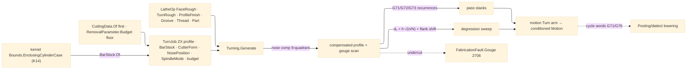

# [RASM_FABRICATION_TURNING]

The lathe-operation owner: ONE `LatheOp` `[Union]` closing the revolved ZX concern — `FaceRough` · `TurnRough` (the G71/G72/G73 roughing-cycle pass folds) · `ProfileFinish` · `Groove` · `Thread` (ISO depth degression + flank infeed) · `Part` — generated by ONE `Turning.Generate` fold the `Toolpath/motion#CAM_MOTION` `Turn` arm composes; the `helical:=>Turn(...)` alias placeholder on the motion dispatch is SUPERSEDED by this page (threading is `Thread`'s spindle-synchronized sweep, helical entry stays motion's milling concern — the seam is the `Turning.Generate` composition, one direction, never a second dispatch). The turning profile is the OPEN ZX polyline (`Loop.Closed = false` is the lathe-native shape — the closed-boundary demand is Cam's milling contract, not this fold's), encoded on the motion convention: `Move.To.X` axial (machine Z), `Move.To.Y` radial (machine X). Tool-nose-radius compensation is the 9-quadrant `NosePosition` table — the Fanuc imaginary-tip P-number rows carrying `(Sx, Sz)` center-to-tip sign columns, the compensated pass offsetting the profile by the nose radius along the local normal and re-anchoring at the virtual tip, a profile segment steeper than the insert's effective clearance routing `FabricationFault.Gouge` 2706 with the offending point and `CutterForm` — never a silent undercut. Spindle resolution is the `SpindleMode` `[Union]`: `Css` constant-surface-speed with the small-diameter max-RPM clamp `n(x) = min(MaxRpm, 1000·V/(2π·x))` (G96) and `ConstantRpm` (G97); threading ALWAYS resolves `ConstantRpm` (a CSS thread drifts lead — the mode override is the fold's own law, not a caller obligation).

The pass algebra is real recurrence, never a stub: `TurnRough` under `G71Longitudinal` marches `N = ⌈(stockR − minProfileR − allowX)/doc⌉` radial levels `xₖ = stockR − k·doc` clamped at `profile + allowX`, each pass feeding axially to its profile intersection then breaking at the 45° retract chamfer; `G72Facing` is the same fold transposed onto axial levels; `G73PatternRepeat` shifts the WHOLE profile per pass by `δₖ = total·(N−k)/N` on both axes (the cast/pre-formed blank cycle). `Thread` carries the ISO form: external depth `h = 0.6134·P`, cumulative per-pass depth `dₙ = h·√(n/N)` (constant chip area — the degression law), increment `δₙ = h·(√n − √(n−1))/√N` floored by `FirstPassMin` and finished by the `FinalPass` spring cut; flank infeed shifts each pass axially by `zₙ = dₙ·tan(α)` with `α = IncludedAngle/2 − Relief` (the 60°→29.x° compound rule as a DERIVED column, `AlternatingFlank` alternating the sign for even wear); lead `L = P·Starts`, multi-start indexing one start per lead offset. The revolved stock envelope is the K14 kernel seam: `BarStock.Of` composes `Analysis/measure.md` `Bounds.EnclosingCylinderCase(Vector3d Axis)` about the spindle axis — the enclosing-cylinder fit IS the blank, never a hand-rolled max-radius scan. Budgets consult `Tooling/cuttingdata#CUTTING_DATA` `CuttingData.Of` FIRST and fall to the `Process/physics#CUT_PARAMETER` subtractive floor via `RemovalParameter.Budget`; cycle WORDS (G71/G76 blocks, P/Q pairs) are `Posting/dialect`'s lowering — this page owns pass GEOMETRY as data, the data-vs-lowering split verbatim.

Wire posture: HOST-LOCAL. The generated `Move` stream crosses only the in-process seam to the Cam fold and onward to posting — never a browser or peer wire; `LatheOp` never sits between wire and rail.

## [01]-[INDEX]

- [01]-[TURNING]: owns the `RoughCycle`/`InfeedMethod`/`NosePosition`/`SpindleMode` vocabularies, the `ThreadSpec`/`BarStock`/`TurnJob` models, the six-case `LatheOp` `[Union]`, and the ONE `Turning.Generate` fold — the ZX pass generator the motion `Turn` arm composes, nose-compensated, spindle-resolved, budget-consulted.

## [02]-[TURNING]

- Owner: `RoughCycle` `[SmartEnum<string>]` (`g71-longitudinal`/`g72-facing`/`g73-pattern`) the roughing-cycle pass-stack axis; `InfeedMethod` `[SmartEnum<string>]` (`radial`/`flank`/`alternating-flank`) the thread infeed axis; `NosePosition` `[SmartEnum<int>]` the nine Fanuc imaginary-tip rows carrying `(Sx, Sz)` center→tip sign columns (`3` OD turning, `2` boring — the anchors; a turret/orientation deviation is one row override at the dialect, never a re-derivation); `SpindleMode` `[Union]` `Css(SurfaceMpm, MaxRpm)` | `ConstantRpm(Rpm)`; `ThreadSpec` the ISO thread model (major/pitch/starts/angle/passes/infeed/floors); `BarStock` the revolved blank envelope with the K14 `Of` projection; `TurnJob` the per-job carrier (open ZX profile, stock, `CutterForm`, tip, spindle, subtractive budget); `LatheOp` the six-case operation `[Union]`; `Turning` the static surface owning `Generate`.
- Cases: `LatheOp` — `FaceRough(DepthOfCut, AllowanceZ)` · `TurnRough(RoughCycle, DepthOfCut, AllowanceX, AllowanceZ)` · `ProfileFinish(AllowanceX)` · `Groove(Width, Depth, PeckFraction, DwellRevs)` · `Thread(ThreadSpec)` · `Part(RetractRadius, FeedScale)` (6); `NosePosition` rows 9 (`P1`-`P9`, `P9` the zero-offset center row); `RoughCycle` rows 3; `InfeedMethod` rows 3; the modality envelope is `subtractive` and the strategy mapping is DATA — `FaceRough`/`TurnRough`/`ProfileFinish` ride `radial-sweep`, `Groove`/`Part` ride `plunge-dwell`, `Thread` rides `helical`; `ProcessModality.Admits` gates the pair upstream, `InadmissiblePair` 2705 routed by the Cam fold, never re-checked here.
- Entry: `public static Fin<Seq<Move>> Generate(LatheOp op, TurnJob job)` — the ONE lathe fold discriminating on the `LatheOp` case through the generated total `Switch`; `Fin<T>` routes `GeometryFault.DegenerateInput` on an empty ZX profile or a non-positive pitch/depth, `FabricationFault.Gouge` 2706 on a nose-comp undercut (point + `CutterForm`), each lowered with `.ToError()`; the OPEN profile is admitted by design — no `OpenLoop` arm fires for the lathe-native polyline.
- Auto: `Generate` resolves the spindle first (`Css` clamps per-move at the pass radius, `Thread` overrides to `ConstantRpm`), nose-compensates the profile ONCE (`r·N̂(p)` normal offset re-anchored by the `(Sx, Sz)` tip row, the gouge scan riding the same walk), then folds the case — `TurnRough` emits the `RoughCycle` pass stack (level march, profile-intersection feed, 45° chamfer retract), `FaceRough` the axial stack, `ProfileFinish` the single compensated pass at `AllowanceX` (arc spans carried on `Loop.Bulges` so the posting arc rail emits `G2`/`G3` arc-native — never a CAM-side arc word), `Groove` the peck-plunge set (`PeckFraction`·depth bites, `DwellRevs` dwell rows), `Thread` the degression sweep (per-pass depth/flank shift/lead as derived above, one start per lead offset), `Part` the feed-scaled plunge to center; feeds read `CuttingData.Of(material, tool, operation)` first, the `RemovalBudget.Subtractive` floor second — the consult order is the fold's, never the caller's.
- Receipt: the ordered `Move` stream IS the receipt — rapid/feed/dwell rows with `Option<ArcCenter>` spans on finishing arcs; pass counts and depths are recomputable from the op row (data-derived, no parallel pass ledger).
- Packages: `Process/owner#FABRICATION_OWNER` (`Loop`/`Move`/`ArcCenter`/`CutterForm` — composed), `Process/physics#CUT_PARAMETER` (`RemovalParameter.Budget` subtractive floor), `Tooling/cuttingdata#CUTTING_DATA` (`CuttingData.Of` measured-first), `Process/family#PROCESS_FAMILY` (`ProcessModality`/`CutStrategy` — the admission axis, composed upstream), kernel `Analysis/measure.md` (`Bounds.EnclosingCylinderCase` — K14, verified), `Geometry2D/curves#CURVE_SUBSTRATE` (NURBS profile refit + station frames for the spline-programmed finish pass — the parametric substrate seam, composed as TYPE contract), Rhino.Geometry, `Rasm.Numerics` (`Predicate.Orient2D` side verdicts on the comp walk), Thinktecture.Runtime.Extensions, LanguageExt.Core, BCL inbox.
- Growth: a new lathe operation (a follow rest pass, a knurl) is one `LatheOp` case + one `Switch` arm; a new roughing grammar is one `RoughCycle` row; a new thread form (trapezoidal, ACME 29°) is `ThreadSpec` row data (angle + depth factor), never a sibling spec type; a controller tip-number deviation is one `NosePosition` row override at the dialect; live tool (C-axis mill-turn) is the motion page's milling arms over the `lathe-millturn` machine row, never a seventh case here; zero new entrypoint surface.
- Boundary: `Turning` is the ONE lathe generator and a `TurnRoughPass`/`FacePass`/`ThreadCycle` sibling family is the deleted form; the motion `Turn` arm COMPOSES `Turning.Generate` and the dead `helical:=>Turn(...)` alias is the superseded form this page retires; pass geometry is HERE and cycle-word emission (`G71 P.. Q..`, `G76`) is `Posting/dialect`'s — a G-word string on this page is the named lowering violation; the depth degression and flank-shift columns are DERIVED formulas and a hand-entered per-pass depth table is the deleted form; the stock envelope reads the kernel enclosing-cylinder (K14) and a max-radius vertex scan is the deleted form; nose compensation lives on this fold and a posting-side second comp pass is the double-compensation defect (the `Motion` is already conditioned — ruling 5's asymmetry); the ZX profile is an OPEN `Loop` by contract and forcing closure is the deleted form.

```csharp signature
// --- [RUNTIME_PRELUDE] ----------------------------------------------------------------------------------------------------------------------------
using LanguageExt;
using LanguageExt.Common;
using Rasm.Analysis;                      // Bounds.EnclosingCylinderCase — the K14 revolved stock envelope
using Rasm.Fabrication.Process;
using Rasm.Fabrication.Tooling;
using Rasm.Numerics;
using Rhino.Geometry;
using Thinktecture;
using static LanguageExt.Prelude;

namespace Rasm.Fabrication.Toolpath;

// --- [TYPES] --------------------------------------------------------------------------------------------------------------------------------------
[SmartEnum<string>]
public sealed partial class RoughCycle {
    public static readonly RoughCycle G71Longitudinal = new("g71-longitudinal");   // radial level stack, axial feed passes
    public static readonly RoughCycle G72Facing = new("g72-facing");               // axial level stack, radial feed passes
    public static readonly RoughCycle G73PatternRepeat = new("g73-pattern");       // whole-profile shift stack (cast/pre-formed blanks)
}

[SmartEnum<string>]
public sealed partial class InfeedMethod {
    public static readonly InfeedMethod Radial = new("radial");
    public static readonly InfeedMethod Flank = new("flank");
    public static readonly InfeedMethod AlternatingFlank = new("alternating-flank");
}

// Fanuc imaginary-tip rows: center = tip - r·(Sx, Sz). P3 is the OD-turning anchor, P2 the boring anchor;
// a turret/orientation deviation is one row override at the dialect, never a re-derived table.
[SmartEnum<int>]
public sealed partial class NosePosition {
    public static readonly NosePosition P1 = new(1, sx: +1, sz: +1);
    public static readonly NosePosition P2 = new(2, sx: +1, sz: -1);
    public static readonly NosePosition P3 = new(3, sx: -1, sz: -1);
    public static readonly NosePosition P4 = new(4, sx: -1, sz: +1);
    public static readonly NosePosition P5 = new(5, sx: +1, sz: 0);
    public static readonly NosePosition P6 = new(6, sx: 0, sz: -1);
    public static readonly NosePosition P7 = new(7, sx: -1, sz: 0);
    public static readonly NosePosition P8 = new(8, sx: 0, sz: +1);
    public static readonly NosePosition P9 = new(9, sx: 0, sz: 0);

    public int Sx { get; }
    public int Sz { get; }
}

[Union(ConversionFromValue = ConversionOperatorsGeneration.None)]
public abstract partial record SpindleMode {
    private SpindleMode() { }

    public sealed record Css(double SurfaceMpm, double MaxRpm) : SpindleMode;      // G96 + small-diameter clamp
    public sealed record ConstantRpm(double Rpm) : SpindleMode;                    // G97; threading always resolves here

    // n(x) = min(MaxRpm, 1000·V/(2π·x)) at pass radius x (mm); ConstantRpm is the identity row.
    public double RpmAt(double radiusMm) =>
        this switch {
            Css(var v, var cap) => Math.Min(cap, 1000.0 * v / (2.0 * Math.PI * Math.Max(radiusMm, 1e-6))),
            ConstantRpm(var n) => n,
            _ => 0.0,
        };
}

// --- [MODELS] -------------------------------------------------------------------------------------------------------------------------------------
// ISO form as DERIVED columns: h = 0.6134·P external depth; dₙ = h·√(n/N); α = IncludedAngle/2 − Relief.
public sealed record ThreadSpec(
    double MajorDiameterMm, double PitchMm, int Starts, double IncludedAngleDeg, int Passes,
    InfeedMethod Infeed, double ReliefDeg = 1.0, double FirstPassMinMm = 0.05, double FinalPassMm = 0.02) {
    public double Depth => 0.6134 * PitchMm;
    public double Lead => PitchMm * Starts;
    public double InfeedAngleDeg => IncludedAngleDeg / 2.0 - ReliefDeg;

    public double DepthAt(int pass) => Math.Max(FirstPassMinMm, Depth * Math.Sqrt((double)pass / Passes));

    public double FlankShiftAt(int pass) =>
        Infeed == InfeedMethod.Radial
            ? 0.0
            : DepthAt(pass) * Math.Tan(InfeedAngleDeg * Math.PI / 180.0) * (Infeed == InfeedMethod.AlternatingFlank && (pass & 1) == 0 ? -1.0 : 1.0);
}

// The revolved blank: Of composes the kernel enclosing-cylinder fit (K14) about the spindle axis —
// never a hand-rolled max-radius vertex scan.
public readonly record struct BarStock(double RadiusMm, double Z0, double Z1) {
    public static Fin<BarStock> Of(MeshSpace model, Vector3d spindleAxis) =>
        Measure.Bound(model, new Bounds.EnclosingCylinderCase(spindleAxis))
            .Map(cyl => new BarStock(cyl.Radius, cyl.Height0, cyl.Height1));
}

public sealed record TurnJob(Loop ZxProfile, BarStock Stock, CutterForm Tool, NosePosition Tip, SpindleMode Spindle, RemovalBudget.Subtractive Budget);

[Union(ConversionFromValue = ConversionOperatorsGeneration.None)]
public abstract partial record LatheOp {
    private LatheOp() { }

    public sealed record FaceRough(double DepthOfCut, double AllowanceZ) : LatheOp;
    public sealed record TurnRough(RoughCycle Cycle, double DepthOfCut, double AllowanceX, double AllowanceZ) : LatheOp;
    public sealed record ProfileFinish(double AllowanceX) : LatheOp;
    public sealed record Groove(double Width, double Depth, double PeckFraction, double DwellRevs) : LatheOp;
    public sealed record Thread(ThreadSpec Spec) : LatheOp;
    public sealed record Part(double RetractRadius, double FeedScale) : LatheOp;
}

// --- [OPERATIONS] ---------------------------------------------------------------------------------------------------------------------------------
public static class Turning {
    // ZX convention: Move.To.X axial (machine Z), Move.To.Y radial (machine X). The open profile is lathe-native.
    public static Fin<Seq<Move>> Generate(LatheOp op, TurnJob job) =>
        job.ZxProfile.Count == 0
            ? Fin.Fail<Seq<Move>>(GeometryFault.DegenerateInput("turning:empty-zx-profile").ToError())
            : Compensate(job).Bind(profile => op.Switch(
                state:         (profile, job),
                faceRough:     static (s, o) => Fin.Succ(FaceStack(s.profile, s.job, o.DepthOfCut, o.AllowanceZ)),
                turnRough:     static (s, o) => Fin.Succ(RoughStack(s.profile, s.job, o)),
                profileFinish: static (s, o) => Fin.Succ(FinishPass(s.profile, s.job, o.AllowanceX)),
                groove:        static (s, o) => Fin.Succ(GroovePecks(s.profile, s.job, o)),
                thread:        static (s, o) => o.Spec.PitchMm <= 0.0
                                                   ? Fin.Fail<Seq<Move>>(GeometryFault.DegenerateInput("turning:non-positive-pitch").ToError())
                                                   : Fin.Succ(ThreadSweep(s.profile, s.job, o.Spec)),
                part:          static (s, o) => Fin.Succ(PartPlunge(s.profile, s.job, o))));

    // Nose comp: offset r along the local ZX normal, re-anchor by the (Sx, Sz) virtual-tip row; a segment
    // steeper than the insert's effective clearance is the Gouge verdict, never a silent undercut.
    static Fin<Loop> Compensate(TurnJob job) {
        double r = job.Tool.CornerRadius;
        for (int i = 0; i + 1 < job.ZxProfile.Count; i++) {
            Vector3d d = job.ZxProfile.At(i + 1) - job.ZxProfile.At(i);
            double steep = Math.Abs(Math.Atan2(d.Y, Math.Abs(d.X))) * 180.0 / Math.PI;
            if (steep > 90.0 - job.Tool.TaperAngle)
                return Fin.Fail<Loop>(FabricationFault.Gouge(job.ZxProfile.At(i), job.Tool).ToError());
        }
        return Fin.Succ(new Loop(
            job.ZxProfile.Vertices.Map((i, p) => p + r * NormalAt(job.ZxProfile, i) - new Vector3d(job.Tip.Sz * r, job.Tip.Sx * r, 0.0)).ToArr(),
            Closed: false, job.ZxProfile.Bulges));
    }

    static Seq<Move> RoughStack(Loop profile, TurnJob job, LatheOp.TurnRough op) {
        double minR = profile.Vertices.Fold(double.MaxValue, static (m, v) => Math.Min(m, v.Y));
        int n = Math.Max(1, (int)Math.Ceiling((job.Stock.RadiusMm - minR - op.AllowanceX) / Math.Max(op.DepthOfCut, 1e-3)));
        return op.Cycle.Switch(
            state:             (profile, job, op, minR, n),
            g71Longitudinal:   static s => toSeq(Enumerable.Range(1, s.n)).Bind(k =>
                                   LevelPass(s.profile, s.job,
                                       Math.Max(s.minR + s.op.AllowanceX, s.job.Stock.RadiusMm - k * s.op.DepthOfCut), s.op.AllowanceZ)),
            g72Facing:         static s => toSeq(Enumerable.Range(1, s.n)).Bind(k =>
                                   FacePassAt(s.profile, s.job, s.job.Stock.Z1 - k * s.op.DepthOfCut, s.op.AllowanceX)),
            g73PatternRepeat:  static s => toSeq(Enumerable.Range(1, s.n)).Bind(k =>
                                   ShiftedPass(s.profile, s.job, (s.job.Stock.RadiusMm - s.minR - s.op.AllowanceX) * (s.n - k) / (double)s.n)));
    }

    // Pass primitives: rapid to level, feed to the profile intersection, break at the 45° retract chamfer.
    static Seq<Move> LevelPass(Loop profile, TurnJob job, double x, double allowZ) =>
        Seq(new Move(new Point3d(job.Stock.Z1 + 1.0, x, 0.0), Rapid: true, Feed: 0.0))
            .Concat(toSeq(profile.Vertices).Filter(v => v.Y <= x).Map(v => new Move(new Point3d(v.X + allowZ, x, 0.0), Rapid: false, Feed: FeedOf(job, x))))
            .Add(new Move(new Point3d(job.Stock.Z1 + 1.0, x + 0.5, 0.0), Rapid: true, Feed: 0.0));

    static Seq<Move> FaceStack(Loop profile, TurnJob job, double doc, double allowZ) =>
        toSeq(Enumerable.Range(1, Math.Max(1, (int)Math.Ceiling((job.Stock.Z1 - MinZ(profile) - allowZ) / Math.Max(doc, 1e-3)))))
            .Bind(k => FacePassAt(profile, job, job.Stock.Z1 - k * doc, allowZ));

    static Seq<Move> FacePassAt(Loop profile, TurnJob job, double z, double allow) =>
        Seq(new Move(new Point3d(z + allow, job.Stock.RadiusMm + 1.0, 0.0), Rapid: true, Feed: 0.0),
            new Move(new Point3d(z + allow, 0.0, 0.0), Rapid: false, Feed: FeedOf(job, job.Stock.RadiusMm)));

    static Seq<Move> ShiftedPass(Loop profile, TurnJob job, double shift) =>
        toSeq(profile.Vertices).Map(v => new Move(new Point3d(v.X + shift, v.Y + shift, 0.0), Rapid: false, Feed: FeedOf(job, v.Y + shift)));

    static Seq<Move> FinishPass(Loop profile, TurnJob job, double allowX) =>
        toSeq(profile.Vertices).Map((i, v) => new Move(new Point3d(v.X, v.Y + allowX, 0.0), Rapid: false, Feed: FeedOf(job, v.Y),
            Arc: profile.BulgeAt(i) == 0.0 ? Option<ArcCenter>.None : Some(new ArcCenter(v, profile.BulgeAt(i) < 0.0)))).ToSeq();

    static Seq<Move> GroovePecks(Loop profile, TurnJob job, LatheOp.Groove op) {
        Point3d root = profile.At(0);
        int bites = Math.Max(1, (int)Math.Ceiling(1.0 / Math.Clamp(op.PeckFraction, 0.05, 1.0)));
        return toSeq(Enumerable.Range(1, bites)).Bind(k => Seq(
            new Move(new Point3d(root.X, root.Y - op.Depth * k / bites, 0.0), Rapid: false, Feed: FeedOf(job, root.Y)),
            new Move(new Point3d(root.X, root.Y + 0.5, 0.0), Rapid: true, Feed: 0.0)));
    }

    // Degression sweep: pass n at cumulative depth dₙ with flank shift zₙ; one start per lead offset;
    // lead rides Feed as mm/rev — the spindle-synchronized G32/G76 word is dialect's lowering.
    static Seq<Move> ThreadSweep(Loop profile, TurnJob job, ThreadSpec spec) =>
        toSeq(Enumerable.Range(0, spec.Starts)).Bind(start =>
            toSeq(Enumerable.Range(1, spec.Passes)).Bind(n => {
                double x = spec.MajorDiameterMm / 2.0 - spec.DepthAt(n);
                double z0 = job.Stock.Z1 + spec.FlankShiftAt(n) + start * spec.PitchMm;
                return Seq(
                    new Move(new Point3d(z0, x, 0.0), Rapid: true, Feed: 0.0),
                    new Move(new Point3d(MinZ(profile), x, 0.0), Rapid: false, Feed: spec.Lead));
            })).Add(new Move(new Point3d(job.Stock.Z1, spec.MajorDiameterMm / 2.0 - spec.Depth, 0.0), Rapid: false, Feed: spec.Lead));

    static Seq<Move> PartPlunge(Loop profile, TurnJob job, LatheOp.Part op) {
        Point3d at = profile.At(0);
        return Seq(
            new Move(new Point3d(at.X, job.Stock.RadiusMm + 1.0, 0.0), Rapid: true, Feed: 0.0),
            new Move(new Point3d(at.X, op.RetractRadius, 0.0), Rapid: false, Feed: FeedOf(job, job.Stock.RadiusMm)),
            new Move(new Point3d(at.X, 0.0, 0.0), Rapid: false, Feed: FeedOf(job, op.RetractRadius) * Math.Clamp(op.FeedScale, 0.05, 1.0)));
    }

    // mm/rev × n(x) → mm/min at the pass radius; CuttingData.Of defeats this floor at the consumer.
    static double FeedOf(TurnJob job, double radiusMm) =>
        job.Budget.FeedRate / Math.Max(job.Budget.SpindleRpm, 1.0) * job.Spindle.RpmAt(radiusMm);

    static double MinZ(Loop profile) => profile.Vertices.Fold(double.MaxValue, static (m, v) => Math.Min(m, v.X));

    static Vector3d NormalAt(Loop profile, int i) {
        Vector3d d = profile.At(Math.Min(i + 1, profile.Count - 1)) - profile.At(Math.Max(i - 1, 0));
        d.Unitize();
        return new Vector3d(-d.Y, d.X, 0.0);
    }
}
```


