# [RASM_FABRICATION_TURNING]

The lathe-operation owner: one `LatheOp` `[Union]` closes the revolved ZX concern — `FaceRough` · `TurnRough` · `ProfileFinish` · `Groove` · `Thread` · `Part` — through one `Turning.Generate` fold composed by `Toolpath/motion.md`. The turning profile is an open ZX polyline: each `Move` arrival target's `X` coordinate is axial machine Z and its `Y` coordinate is radial machine X. The nine-row `NosePosition` table owns imaginary-tip compensation. `SpindleMode.Css` derives surface speed from admitted `CuttingData` and clamps RPM at small radius; `Thread` always rebinds to `ConstantRpm` at major radius so spindle-synchronized lead remains invariant.

The pass algebra is recurrence over profile intersections. `G71Longitudinal` marches radial levels and cuts every interpolated level/profile crossing; `G72Facing` transposes the fold onto axial levels; `G73PatternRepeat` shifts the whole profile. `ThreadForm` supplies included angle and depth factor for ISO metric, Unified, Whitworth, Acme, and Buttress rows. Rough depth degresses to `Depth − FinalPassMm`, then one finish and one spring pass land full depth; flank shift derives from included angle, relief, and infeed method; hand, internal/external posture, multi-start indexing, pass role, RPM, and lead remain explicit in `ThreadSync`. `BarStock.Of` composes the kernel enclosing-cylinder analysis. `CuttingData.Of` supplies measured feed, surface speed, and force; `ProcessBudget.Turning` is the floor — the case `ProcessPhysics.Budget` mints for `ProcessKind.Turn` precisely because CSS spindle speed resolves at motion time, and its `NoseRadius` column cross-gates the mounted `CutterForm.CornerRadius` at admission. `Posting/dialect.md` alone lowers controller words.

Wire posture: HOST-LOCAL. `TurnProgram` crosses only in process. Its `Moves` remain owner atoms, while indexed `LatheDirective` rows preserve dwell and spindle-synchronized thread semantics until dialect lowering.

## [01]-[INDEX]

- [01]-[TURNING]: owns the `RoughCycle`/`InfeedMethod`/`NosePosition`/`FinishForm`/`SpindleMode` vocabularies, the `ThreadSpec`/`BarStock`/`TurnJob` models, the six-case `LatheOp` `[Union]`, and the ONE `Turning.Generate` fold — the ZX pass generator the motion `Turn` arm composes, nose-compensated, spindle-resolved, budget-consulted.

## [02]-[TURNING]

- Owner: `RoughCycle`, `InfeedMethod`, `NosePosition`, and `FinishForm` own pass policy; `ThreadForm`, `ThreadHand`, and `ThreadCutRole` own thread geometry and lowering intent; `SpindleMode.Css` carries only the maximum RPM because measured `CuttingData.SurfaceSpeed` reconstructs surface speed; `ThreadSpec`, `BarStock`, and `TurnJob` carry admitted demand; `LatheDirective` preserves dwell and thread synchronization by move span; `TurnProgram` carries moves, directives, and resolved cutting-force evidence; `LatheOp` and `Turning.Generate` close the operation fold.
- Cases: `LatheOp` — `FaceRough(DepthOfCut, AllowanceZ)` · `TurnRough(RoughCycle, DepthOfCut, AllowanceX, AllowanceZ)` · `ProfileFinish(AllowanceX, FinishForm)` · `Groove(Width, Depth, PeckFraction, DwellRevs)` · `Thread(ThreadSpec)` · `Part(RetractRadius, FeedScale)` (6); `NosePosition` rows 9 (`P1`-`P9`, `P9` the zero-offset center row); `RoughCycle` rows 3; `InfeedMethod` rows 3; `FinishForm` rows 2; the modality envelope is `subtractive` and the strategy mapping is DATA — `FaceRough`/`TurnRough`/`ProfileFinish` ride `radial-sweep`, `Groove`/`Part` ride `plunge-dwell`, `Thread` rides `helical`; `ProcessModality.Admits` gates the pair upstream, `InadmissiblePair` 2705 routed by the Cam fold, never re-checked here.
- Entry: `public static Fin<TurnProgram> Generate(LatheOp op, TurnJob job)` is the ONE lathe fold. `TurnJob.Of` admits `CuttingData` only when its explicit `FeedBasis` is `PerRevolution`; turning never reinterprets a per-tooth or pitch scalar. Dependent geometry and `Force(width, chip)` failures abort typed.
- Auto: `Generate` resolves the spindle first (`Css` clamps per-move at the pass radius; the `Thread` arm rebinds the job to `ConstantRpm` at the major radius — the fold's own law), nose-compensates the profile ONCE (`r·N̂(p)` normal offset re-anchored by the `(Sx, Sz)` tip row, the gouge scan riding the same expression fold over segment pairs), then folds the case — `TurnRough` emits the `RoughCycle` pass stack (level march, one feed span per interpolated level/profile crossing pair so non-monotonic pockets cut whole, 45° chamfer retract), `FaceRough` the axial stack (planes clamped at the target face, each pass ending at the outermost interpolated crossing of its plane), `ProfileFinish` the single compensated pass at `AllowanceX` (arc spans carried as `ArcCenter` rows DERIVED from the bulge sagitta — center from chord + bulge, never the vertex itself; the `spline` form refits the profile through `CurveAlgebra.Apply(CurveOp.Admit(CurveSource.Outline(...)))` — the `Densified` fitted curve — and lowers through `CurveOp.Lower(curve, DivideRule.ByChord, tolerance)` to the `Lowered` loop, the fitted-NURBS finish the curves substrate owns), `Groove` the width-stepped peck family (plunge positions spanning `Width` at a 0.8·tool-width step, `PeckFraction`·depth bites; the bottom dwell is the `DwellRevs` row datum posting lowers as its dwell word), `Thread` the degression sweep (per-pass depth/flank shift/lead as derived above, `FinalPassMm`-floored finishing + spring passes, one start per pitch offset), `Part` the feed-scaled plunge to center; feeds read `CuttingData.Of(material, tool, operation)` first and the `ProcessBudget.Turning.FeedPerRevolution` floor second.
- Receipt: `TurnProgram` carries the ordered `Move` stream, indexed `Dwell` and `ThreadSync` directives, and Kienzle force evidence. Dwell and synchronization are not recomputable after the `LatheOp` demand leaves scope, so they travel explicitly to posting.
- Packages: `Process/owner.md` (`Loop`/`Move`/`ArcCenter`/`CutterForm`), `Process/physics.md` (`ProcessBudget.Turning`), `Tooling/cuttingdata.md` (`CuttingData.Of`), `Process/family.md` (`ProcessModality`/`CutStrategy`), kernel `Analysis/measure` and `Analysis/query`, `Geometry2D/curves.md` (`CurveAlgebra.Apply` `Admit`/`Lower`), Rhino.Geometry, Thinktecture.Runtime.Extensions, LanguageExt.Core, BCL inbox.
- Growth: a new lathe operation (a follow rest pass, a knurl) is one `LatheOp` case + one `Switch` arm; a new roughing grammar is one `RoughCycle` row; a new thread form (round or knuckle) is `ThreadForm` row data (angle + depth factor), never a sibling spec type; a controller tip-number deviation is one `NosePosition` row override at the dialect; live tool (C-axis mill-turn) is the motion page's milling arms over the `lathe-millturn` machine row, never a seventh case here; zero new entrypoint surface.
- Boundary: `Turning` is the ONE lathe generator and a `TurnRoughPass`/`FacePass`/`ThreadCycle` sibling family is the deleted form; the motion `Turn` arm COMPOSES `Turning.Generate` and the dead `helical:=>Turn(...)` alias is the superseded form this page retires; pass geometry is HERE and cycle-word emission (`G71 P.. Q..`, `G76`, the dwell `G04`) is `Posting/dialect`'s — a G-word string on this page is the named lowering violation; the depth degression and flank-shift columns are DERIVED formulas and a hand-entered per-pass depth table is the deleted form; the stock envelope reads the kernel enclosing-cylinder (K14) and a max-radius vertex scan is the deleted form; nose compensation lives on this fold and a posting-side second comp pass is the double-compensation defect; the level pass feeds to the interpolated profile intersection and a vertex filter standing in for the crossing is the deleted form; the arc center derives from the bulge sagitta and a vertex-as-center row is the deleted fiction; the ZX profile is an OPEN `Loop` by contract and forcing closure is the deleted form.

```csharp signature
// --- [RUNTIME_PRELUDE] ----------------------------------------------------------------------------------------------------------------------------
using LanguageExt;
using LanguageExt.Common;
using Rasm.Analysis;                      // Analyze.Run + AnalysisQuery.Bounds(Bounds.EnclosingCylinder) — the K14 revolved stock envelope
using Rasm.Fabrication.Geometry2D;
using Rasm.Fabrication.Process;
using Rasm.Fabrication.Tooling;
using Rasm.Meshing;
using Rasm.Numerics;
using Rasm.Parametric;                    // FitPolicy + DivideRule — the curves-substrate fit and lowering vocabulary
using Rhino.Geometry;
using Thinktecture;
using static LanguageExt.Prelude;

namespace Rasm.Fabrication.Toolpath;

// --- [TYPES] --------------------------------------------------------------------------------------------------------------------------------------
[SmartEnum<string>]
public sealed partial class RoughCycle {
    public static readonly RoughCycle G71Longitudinal = new("g71-longitudinal");   // radial level stack, axial feed passes
    public static readonly RoughCycle G72Facing = new("g72-facing");               // axial level stack, radial feed passes
    public static readonly RoughCycle G73PatternRepeat = new("g73-pattern");       // whole-profile shift stack (cast/pre-formed blanks)
}

[SmartEnum<string>]
public sealed partial class InfeedMethod {
    public static readonly InfeedMethod Radial = new("radial");
    public static readonly InfeedMethod Flank = new("flank");
    public static readonly InfeedMethod AlternatingFlank = new("alternating-flank");
}

[SmartEnum<string>]
public sealed partial class ThreadForm {
    public static readonly ThreadForm IsoMetric = new("iso-metric", includedAngleDeg: 60.0, depthFactor: 0.6134);
    public static readonly ThreadForm Unified = new("unified", includedAngleDeg: 60.0, depthFactor: 0.61343);
    public static readonly ThreadForm Whitworth = new("whitworth", includedAngleDeg: 55.0, depthFactor: 0.6403);
    public static readonly ThreadForm Acme = new("acme", includedAngleDeg: 29.0, depthFactor: 0.5);
    public static readonly ThreadForm Buttress = new("buttress", includedAngleDeg: 45.0, depthFactor: 0.6);

    public double IncludedAngleDeg { get; }
    public double DepthFactor { get; }
}

[SmartEnum<string>]
public sealed partial class ThreadHand {
    public static readonly ThreadHand Right = new("right", spindleSign: 1);
    public static readonly ThreadHand Left = new("left", spindleSign: -1);

    public int SpindleSign { get; }
}

[SmartEnum<string>]
public sealed partial class ThreadCutRole {
    public static readonly ThreadCutRole Rough = new("rough");
    public static readonly ThreadCutRole Finish = new("finish");
    public static readonly ThreadCutRole Spring = new("spring");
}

// The spline row routes the finish pass through the curves-substrate refit; vertex is the polyline-native form.
[SmartEnum<string>]
public sealed partial class FinishForm {
    public static readonly FinishForm Vertex = new("vertex");
    public static readonly FinishForm Spline = new("spline");
}

// Fanuc imaginary-tip rows: center = tip - r·(Sx, Sz). P3 is the OD-turning anchor, P2 the boring anchor;
// a turret/orientation deviation is one row override at the dialect, never a re-derived table.
[SmartEnum<int>]
public sealed partial class NosePosition {
    public static readonly NosePosition P1 = new(1, sx: +1, sz: +1);
    public static readonly NosePosition P2 = new(2, sx: +1, sz: -1);
    public static readonly NosePosition P3 = new(3, sx: -1, sz: -1);
    public static readonly NosePosition P4 = new(4, sx: -1, sz: +1);
    public static readonly NosePosition P5 = new(5, sx: +1, sz: 0);
    public static readonly NosePosition P6 = new(6, sx: 0, sz: -1);
    public static readonly NosePosition P7 = new(7, sx: -1, sz: 0);
    public static readonly NosePosition P8 = new(8, sx: 0, sz: +1);
    public static readonly NosePosition P9 = new(9, sx: 0, sz: 0);

    public int Sx { get; }
    public int Sz { get; }
}

[Union(ConversionFromValue = ConversionOperatorsGeneration.None)]
public abstract partial record SpindleMode {
    private SpindleMode() { }

    public sealed record Css(double MaxRpm) : SpindleMode;                         // surface speed comes from admitted CuttingData
    public sealed record ConstantRpm(double Rpm) : SpindleMode;                    // G97; the Thread arm rebinds here

    // n(x) = min(MaxRpm, 1000·V/(2π·x)) at pass radius x (mm); ConstantRpm is the identity row.
    public double RpmAt(double radiusMm, double surfaceMpm) => Switch(
        state: (Radius: radiusMm, Surface: surfaceMpm),
        css: static (s, c) => Math.Min(c.MaxRpm, 1000.0 * s.Surface / (2.0 * Math.PI * Math.Max(s.Radius, 1e-6))),
        constantRpm: static (_, c) => c.Rpm);
}

// --- [MODELS] -------------------------------------------------------------------------------------------------------------------------------------
// ISO form as DERIVED columns: h = 0.6134·P external depth; dₙ degresses to h − FinalPassMm, the finishing
// and spring passes land the full depth; α = IncludedAngle/2 − Relief.
public sealed record ThreadSpec(
    ThreadForm Form, ThreadHand Hand, bool Internal, double MajorDiameterMm, double PitchMm, int Starts, int Passes,
    InfeedMethod Infeed, double ReliefDeg = 1.0, double FirstPassMinMm = 0.05, double FinalPassMm = 0.02) {
    public double Depth => Form.DepthFactor * PitchMm;
    public double Lead => PitchMm * Starts;
    public double InfeedAngleDeg => Form.IncludedAngleDeg / 2.0 - ReliefDeg;

    public double DepthAt(int pass) =>
        Math.Max(FirstPassMinMm, Math.Min(Depth - FinalPassMm, (Depth - FinalPassMm) * Math.Sqrt((double)pass / Passes)));

    public double FlankShiftAt(int pass) =>
        Infeed == InfeedMethod.Radial
            ? 0.0
            : DepthAt(pass) * Math.Tan(InfeedAngleDeg * Math.PI / 180.0) * (Infeed == InfeedMethod.AlternatingFlank && (pass & 1) == 0 ? -1.0 : 1.0);
}

// The revolved blank: Of composes the kernel enclosing-cylinder fit (K14) about the spindle axis through the
// ONE Analyze.Run seam — never a hand-rolled max-radius vertex scan.
public readonly record struct BarStock(double RadiusMm, double Z0, double Z1) {
    public static Fin<BarStock> Of(MeshSpace model, Vector3d spindleAxis) =>
        Analyze.Run<MeshSpace, Cylinder>(AnalysisQuery.Bounds(Bounds.EnclosingCylinder(spindleAxis)), model)
            .ToFin()
            .Bind(static fits => fits.HeadOrNone().ToFin(GeometryFault.DegenerateInput("turning:stock-fit").ToError()))
            .Map(static cyl => new BarStock(cyl.Radius, cyl.Height1, cyl.Height2));
}

public sealed record TurnJob(
    Loop ZxProfile, BarStock Stock, CutterForm Tool, NosePosition Tip, SpindleMode Spindle,
    CuttingData Cutting, ProcessBudget.Turning Budget) {
    public static Fin<TurnJob> Of(
        Loop zxProfile, BarStock stock, CutterForm tool, NosePosition tip, SpindleMode spindle,
        Material material, Operation operation, CuttingTable table, ProcessBudget.Turning budget) =>
        CuttingData.Of(material, tool, operation, table).Bind(data =>
            data.FeedBasis == FeedBasis.PerRevolution
                ? Fin.Succ(new TurnJob(zxProfile, stock, tool, tip, spindle, data, budget))
                : Fin.Fail<TurnJob>(GeometryFault.DegenerateInput($"turning:feed-basis:{data.FeedBasis.Key}").ToError()));
}

[Union(ConversionFromValue = ConversionOperatorsGeneration.None)]
public abstract partial record LatheOp {
    private LatheOp() { }

    public sealed record FaceRough(double DepthOfCut, double AllowanceZ) : LatheOp;
    public sealed record TurnRough(RoughCycle Cycle, double DepthOfCut, double AllowanceX, double AllowanceZ) : LatheOp;
    public sealed record ProfileFinish(double AllowanceX, FinishForm Form) : LatheOp;
    public sealed record Groove(double Width, double Depth, double PeckFraction, double DwellRevs) : LatheOp;
    public sealed record Thread(ThreadSpec Spec) : LatheOp;
    public sealed record Part(double RetractRadius, double FeedScale) : LatheOp;
}

[Union(ConversionFromValue = ConversionOperatorsGeneration.None)]
public abstract partial record LatheDirective {
    private LatheDirective() { }

    public sealed record Dwell(int AfterMove, double Revolutions) : LatheDirective;
    public sealed record ThreadSync(
        int FromMove, int ToMove, double Rpm, double LeadMmPerRev,
        int Start, int Pass, ThreadCutRole Role, ThreadHand Hand) : LatheDirective;
}

public sealed record TurnProgram(Seq<Move> Moves, Seq<LatheDirective> Directives, double CuttingForceN);

// --- [OPERATIONS] ---------------------------------------------------------------------------------------------------------------------------------
public static class Turning {
    const double ApproachMm = 1.0;    // rapid stand-off from the stock face and OD before a feed engages
    const double ChamferMm = 0.5;     // 45° retract-chamfer leg and peck-retract clearance
    const double ChordTolMm = 0.01;   // spline-finish lowering resolution — the curves-substrate chord datum

    // ZX convention: arrival-target X is axial machine Z and arrival-target Y is radial machine X. The open profile is lathe-native.
    // The Thread arm REBINDS the spindle to ConstantRpm at the major radius — the fold's own G96→G97 law.
    public static Fin<TurnProgram> Generate(LatheOp op, TurnJob job) =>
        from admitted in Validate(op, job)
        from force in job.Cutting.Force(job.Budget.DepthOfCut, job.Cutting.Feed)
        from pair in Compensate(Resolve(op, job))
        from program in Emit(op, pair)
        select program with { CuttingForceN = force };

    static Fin<TurnProgram> Emit(LatheOp op, (Loop Profile, TurnJob Job) pair) => op.Switch(
        state:         pair,
        faceRough:     static (s, o) => Fin.Succ(Plain(FaceStack(s.Profile, s.Job, o.DepthOfCut, o.AllowanceZ))),
        turnRough:     static (s, o) => Fin.Succ(Plain(RoughStack(s.Profile, s.Job, o))),
        profileFinish: static (s, o) => FinishPass(s.Profile, s.Job, o),
        groove:        static (s, o) => Fin.Succ(GroovePecks(s.Profile, s.Job, o)),
        thread:        static (s, o) => Fin.Succ(ThreadSweep(s.Profile, s.Job, o.Spec)),
        part:          static (s, o) => Fin.Succ(Plain(PartPlunge(s.Profile, s.Job, o))));

    static Fin<Unit> Validate(LatheOp op, TurnJob job) {
        Seq<bool> gates = Seq(
            job.ZxProfile.Count > 1 && !job.ZxProfile.Closed,
            Positive(job.Stock.RadiusMm) && double.IsFinite(job.Stock.Z0) && double.IsFinite(job.Stock.Z1) && job.Stock.Z1 > job.Stock.Z0,
            job.Tool is not null && job.Tip is not null && job.Spindle is not null && job.Cutting is not null,
            ValidBudget(job.Budget) && job.Cutting.Regime is not null && job.Cutting.FeedBasis == FeedBasis.PerRevolution
                && Positive(job.Cutting.Kc11) && Nonnegative(job.Cutting.Mc) && Positive(job.Cutting.Feed) && Positive(job.Cutting.SurfaceSpeed),
            Math.Abs(job.Budget.NoseRadius - job.Tool.CornerRadius) <= job.ZxProfile.Tolerance.Absolute.Value,
            ValidSpindle(job.Spindle),
            ValidOp(op));
        bool threadDepth = op is not LatheOp.Thread thread
            || thread.Spec.FinalPassMm < thread.Spec.Depth
                && thread.Spec.FirstPassMinMm <= thread.Spec.Depth - thread.Spec.FinalPassMm;
        return gates.ForAll(static gate => gate) && threadDepth
            ? Fin.Succ(unit)
            : Fin.Fail<Unit>(GeometryFault.DegenerateInput("turning:invalid-demand").ToError());
    }

    // The physics-minted turn floor: every Turning column is consumed — SurfaceSpeed/FeedPerRevolution as the
    // feed floor, DepthOfCut as the force chip width, NoseRadius as the compensation cross-gate above.
    static bool ValidBudget(ProcessBudget.Turning budget) => budget is not null
        && Positive(budget.SurfaceSpeed) && Positive(budget.FeedPerRevolution)
        && Positive(budget.DepthOfCut) && Nonnegative(budget.NoseRadius);

    static bool ValidSpindle(SpindleMode spindle) => spindle.Switch(
        css: static row => Positive(row.MaxRpm),
        constantRpm: static row => Positive(row.Rpm));

    static bool ValidOp(LatheOp op) => op.Switch(
        faceRough: static row => Positive(row.DepthOfCut) && Nonnegative(row.AllowanceZ),
        turnRough: static row => row.Cycle is not null && Positive(row.DepthOfCut)
            && Nonnegative(row.AllowanceX) && Nonnegative(row.AllowanceZ),
        profileFinish: static row => row.Form is not null && Nonnegative(row.AllowanceX),
        groove: static row => Positive(row.Width) && Positive(row.Depth) && Positive(row.PeckFraction)
            && row.PeckFraction <= 1.0 && Nonnegative(row.DwellRevs),
        thread: static row => ValidThread(row.Spec),
        part: static row => Nonnegative(row.RetractRadius) && Positive(row.FeedScale) && row.FeedScale <= 1.0);

    static bool ValidThread(ThreadSpec spec) => spec is not null && spec.Form is not null && spec.Hand is not null && spec.Infeed is not null
        && Positive(spec.MajorDiameterMm) && Positive(spec.PitchMm) && spec.Starts > 0 && spec.Passes > 0
        && Nonnegative(spec.ReliefDeg) && spec.ReliefDeg < spec.Form.IncludedAngleDeg / 2.0
        && Positive(spec.FirstPassMinMm) && Positive(spec.FinalPassMm) && spec.Depth < spec.MajorDiameterMm / 2.0;

    static bool Positive(double value) => double.IsFinite(value) && value > 0.0;

    static bool Nonnegative(double value) => double.IsFinite(value) && value >= 0.0;

    static TurnProgram Plain(Seq<Move> moves) => new(moves, Seq<LatheDirective>(), CuttingForceN: 0.0);

    static TurnJob Resolve(LatheOp op, TurnJob job) =>
        op is LatheOp.Thread thread
            ? job with { Spindle = new SpindleMode.ConstantRpm(job.Spindle.RpmAt(thread.Spec.MajorDiameterMm / 2.0, job.Cutting.SurfaceSpeed)) }
            : job;

    // Nose comp: offset r along the local ZX normal, re-anchor by the (Sx, Sz) virtual-tip row; the gouge scan
    // is one expression fold over segment pairs — a segment steeper than the insert's effective clearance is
    // the typed Gouge verdict, never a silent undercut.
    static Fin<(Loop Profile, TurnJob Job)> Compensate(TurnJob job) =>
        toSeq(Enumerable.Range(0, Math.Max(job.ZxProfile.Count - 1, 0)))
            .Find(i => Steepness(job.ZxProfile.At(i + 1) - job.ZxProfile.At(i)) > 90.0 - job.Tool.TaperAngle)
            .Match(
                Some: i => Fin.Fail<(Loop, TurnJob)>(FabricationFault.Gouge(job.ZxProfile.At(i), job.Tool).ToError()),
                None: () => Loop.Admit(
                    job.ZxProfile.Vertices.Map((p, i) =>
                        p + job.Tool.CornerRadius * NormalAt(job.ZxProfile, i) - new Vector3d(job.Tip.Sz * job.Tool.CornerRadius, job.Tip.Sx * job.Tool.CornerRadius, 0.0)).ToArr(),
                    closed: false, job.ZxProfile.Bulges, job.ZxProfile.Tolerance).Map(profile => (profile, job)));

    static double Steepness(Vector3d d) => Math.Abs(Math.Atan2(d.Y, Math.Abs(d.X))) * 180.0 / Math.PI;

    static Seq<Move> RoughStack(Loop profile, TurnJob job, LatheOp.TurnRough op) {
        double minR = profile.Vertices.Fold(double.MaxValue, static (m, v) => Math.Min(m, v.Y));
        int n = Math.Max(1, (int)Math.Ceiling((job.Stock.RadiusMm - minR - op.AllowanceX) / Math.Max(op.DepthOfCut, 1e-3)));
        return op.Cycle.Switch(
            state:             (Profile: profile, Job: job, Op: op, MinR: minR, N: n),
            g71Longitudinal:   static s => toSeq(Enumerable.Range(1, s.N)).Bind(k =>
                                   LevelPass(s.Profile, s.Job,
                                       Math.Max(s.MinR + s.Op.AllowanceX, s.Job.Stock.RadiusMm - k * s.Op.DepthOfCut),
                                       s.Op.DepthOfCut, s.Op.AllowanceZ)),
            g72Facing:         static s => FaceStack(s.Profile, s.Job, s.Op.DepthOfCut, s.Op.AllowanceZ),
            g73PatternRepeat:  static s => toSeq(Enumerable.Range(1, s.N)).Bind(k =>
                                   ShiftedPass(s.Profile, s.Job,
                                       (s.Job.Stock.RadiusMm - s.MinR - s.Op.AllowanceX) * (s.N - k) / (double)s.N,
                                       Math.Max(s.Job.Stock.Z1 - MinZ(s.Profile) - s.Op.AllowanceZ, 0.0) * (s.N - k) / (double)s.N)));
    }

    // Level pass: one axial feed per cuttable span at radial level x, consuming EVERY interpolated crossing —
    // the stock-face span first, then each interior crossing pair (non-monotonic pockets); the entry rapid rides
    // the annulus the prior level cleared, every span breaks out over the 45° retract chamfer, and the crossing
    // is always a segment interpolation, never a vertex filter.
    static Seq<Move> LevelPass(Loop profile, TurnJob job, double x, double doc, double allowZ) =>
        SpansAt(profile, job, x).Bind(span => Seq(
            (Move)new Move.Rapid(new Point3d(span.Entry, x + doc, 0.0)),
            new Move.Linear(new Point3d(span.Entry, x, 0.0), FeedOf(job, x)),
            new Move.Linear(new Point3d(span.Exit + allowZ, x, 0.0), FeedOf(job, x)),
            new Move.Linear(new Point3d(span.Exit + allowZ + ChamferMm, x + ChamferMm, 0.0), FeedOf(job, x)),
            new Move.Rapid(new Point3d(span.Entry, x + doc, 0.0))));

    // Cuttable spans at level x: walls = the stock face followed by every crossing (descending from the free
    // end), span k runs wall[2k] → wall[2k+1] — the free-end span always cuts and each interior pocket pairs its
    // own walls; an unpaired terminal wall means the profile stays below the level to the chuck end and owns no
    // further material at this level.
    static Seq<(double Entry, double Exit)> SpansAt(Loop profile, TurnJob job, double x) {
        Seq<double> walls = (job.Stock.Z1 + ApproachMm).Cons(CutZsAt(profile, x));
        return toSeq(Enumerable.Range(0, walls.Count / 2)).Map(k => (walls[2 * k], walls[(2 * k) + 1]));
    }

    // Every crossing of radial level x with the profile chain, ordered from the free end: linear interpolation
    // inside the crossing segment; a profile entirely below the level cuts to its minimum Z.
    static Seq<double> CutZsAt(Loop profile, double x) {
        Seq<double> crossings = toSeq(Enumerable.Range(0, profile.Count - 1))
            .Filter(i => (profile.At(i).Y - x) * (profile.At(i + 1).Y - x) <= 0.0 && Math.Abs(profile.At(i + 1).Y - profile.At(i).Y) > 1e-9)
            .Map(i => profile.At(i).X + (x - profile.At(i).Y) / (profile.At(i + 1).Y - profile.At(i).Y) * (profile.At(i + 1).X - profile.At(i).X))
            .Distinct().OrderByDescending(static z => z).ToSeq();
        return crossings.IsEmpty ? Seq(MinZ(profile)) : crossings;
    }

    // Transposed recurrence: axial planes march from the stock face and CLAMP at the target face, so a
    // non-divisible distance lands its final remainder pass exactly on MinZ + allowance, never past it.
    static Seq<Move> FaceStack(Loop profile, TurnJob job, double doc, double allowZ) {
        double target = MinZ(profile) + allowZ;
        int passes = Math.Max(1, (int)Math.Ceiling((job.Stock.Z1 - target) / Math.Max(doc, 1e-3)));
        return toSeq(Enumerable.Range(1, passes)).Bind(k =>
            FacePassAt(profile, job, Math.Max(job.Stock.Z1 - k * doc, target)));
    }

    // Each facing pass feeds radially inward to the OUTERMOST interpolated profile crossing at its executed
    // plane; a plane the profile never crosses faces to the spindle center.
    static Seq<Move> FacePassAt(Loop profile, TurnJob job, double z) =>
        Seq((Move)new Move.Rapid(new Point3d(z, job.Stock.RadiusMm + ApproachMm, 0.0)),
            new Move.Linear(new Point3d(z, CutXAt(profile, z), 0.0), FeedOf(job, job.Stock.RadiusMm)));

    // The axial-plane crossing, the G72 transpose of CutZsAt: interpolated radial ordinate where the profile
    // chain crosses plane z, outermost crossing winning.
    static double CutXAt(Loop profile, double z) =>
        toSeq(Enumerable.Range(0, profile.Count - 1))
            .Filter(i => (profile.At(i).X - z) * (profile.At(i + 1).X - z) <= 0.0
                && Math.Abs(profile.At(i + 1).X - profile.At(i).X) > 1e-9)
            .Map(i => profile.At(i).Y + (z - profile.At(i).X) / (profile.At(i + 1).X - profile.At(i).X) * (profile.At(i + 1).Y - profile.At(i).Y))
            .Fold(0.0, Math.Max);

    // G73 pattern relief is per-axis: Δk rides the axial (X-as-Z) coordinate and Δi the radial (Y-as-X) one; each
    // shifted pass brackets with a rapid stand-off at the shifted first vertex and a rapid retract clear of the
    // stock corner — back-to-back passes never feed through stock between profile ends.
    static Seq<Move> ShiftedPass(Loop profile, TurnJob job, double radialShift, double axialShift) {
        Point3d first = profile.At(0);
        return Seq(
                (Move)new Move.Rapid(new Point3d(job.Stock.Z1 + ApproachMm, job.Stock.RadiusMm + radialShift + ApproachMm, 0.0)),
                new Move.Rapid(new Point3d(first.X + axialShift, first.Y + radialShift + ApproachMm, 0.0)))
            + toSeq(profile.Vertices).Map(v =>
                (Move)new Move.Linear(new Point3d(v.X + axialShift, v.Y + radialShift, 0.0), FeedOf(job, v.Y + radialShift)))
            + Seq((Move)new Move.Rapid(new Point3d(job.Stock.Z1 + ApproachMm, job.Stock.RadiusMm + radialShift + ApproachMm, 0.0)));
    }

    // Vertex form emits the compensated polyline with arc rows DERIVED from the bulge; spline form refits the
    // profile through the curves substrate (Admit → Lower at chord tolerance) — the fitted-NURBS finish pass.
    static Fin<TurnProgram> FinishPass(Loop profile, TurnJob job, LatheOp.ProfileFinish op) =>
        op.Form.Switch(
            state: (Profile: profile, Job: job, Allow: op.AllowanceX),
            vertex: static s => Fin.Succ(Plain(VertexFinish(s.Profile, s.Job, s.Allow))),
            spline: static s =>
                CurveAlgebra.Apply(new CurveOp.Admit(new CurveSource.Outline(s.Profile, FitPolicy.Canonical, ChordTolMm)))
                    .Bind(trace => trace is CurveTrace.Densified fitted
                        ? CurveAlgebra.Apply(new CurveOp.Lower(fitted.Curve, new DivideRule.ByChord(ChordTolMm), s.Profile.Tolerance))
                        : Fin.Fail<CurveTrace>(GeometryFault.DegenerateInput("turning:spline-refit").ToError()))
                    .Bind(lowered => lowered is CurveTrace.Lowered { Loop: var refit }
                        ? Fin.Succ(Plain(toSeq(refit.Vertices)
                            .Map(v => (Move)new Move.Linear(new Point3d(v.X, v.Y + s.Allow, 0.0), FeedOf(s.Job, v.Y)))))
                        : Fin.Fail<TurnProgram>(GeometryFault.DegenerateInput("turning:spline-lower").ToError())));

    static Seq<Move> VertexFinish(Loop profile, TurnJob job, double allow) =>
        Seq((Move)new Move.Linear(
            new Point3d(profile.At(0).X, profile.At(0).Y + allow, 0.0), FeedOf(job, profile.At(0).Y)))
        + toSeq(Enumerable.Range(0, profile.Spans)).Map(index => {
            Point3d target = profile.At(index + 1);
            return profile.BulgeAt(index) == 0.0
                ? (Move)new Move.Linear(new Point3d(target.X, target.Y + allow, 0.0), FeedOf(job, target.Y))
                : new Move.Circular(new Point3d(target.X, target.Y + allow, 0.0), FeedOf(job, target.Y), ArcOf(profile, index, allow));
        });

    // Arc center from the bulge sagitta: center = midpoint + N̂·(chord/2)·((1−b²)/(2b)); clockwise from the sign.
    static ArcCenter ArcOf(Loop profile, int i, double radialShift) {
        double b = profile.BulgeAt(i);
        Point3d p0 = profile.At(i), p1 = profile.At(i + 1);
        Vector3d chord = p1 - p0;
        Vector3d normal = new(-chord.Y, chord.X, 0.0);
        normal.Unitize();
        Point3d center = new Point3d((p0.X + p1.X) / 2.0, (p0.Y + p1.Y) / 2.0, 0.0)
            + normal * (chord.Length / 2.0) * ((1.0 - b * b) / (2.0 * b));
        return new ArcCenter(center + new Vector3d(0.0, radialShift, 0.0),
            b < 0.0 ? RotationSense.Clockwise : RotationSense.Counterclockwise);
    }

    // Width-stepped peck family: plunge positions spanning Width at a 0.8·tool-width step; PeckFraction·Depth
    // bites per position; the bottom dwell is the DwellRevs ROW datum posting lowers — never a stream row.
    static TurnProgram GroovePecks(Loop profile, TurnJob job, LatheOp.Groove op) {
        Point3d root = profile.At(0);
        double toolW = Math.Max(job.Tool.Diameter, 1e-3);
        int steps = Math.Max(1, (int)Math.Ceiling(Math.Max(op.Width - toolW, 0.0) / (0.8 * toolW)) + 1);
        int bites = Math.Max(1, (int)Math.Ceiling(1.0 / Math.Clamp(op.PeckFraction, 0.05, 1.0)));
        Seq<Move> moves = toSeq(Enumerable.Range(0, steps)).Bind(s => {
            double z = root.X + Math.Min(s * 0.8 * toolW, Math.Max(op.Width - toolW, 0.0));
            return toSeq(Enumerable.Range(1, bites)).Bind(k => Seq(
                (Move)new Move.Linear(new Point3d(z, root.Y - op.Depth * k / bites, 0.0), FeedOf(job, root.Y)),
                new Move.Rapid(new Point3d(z, root.Y + ChamferMm, 0.0))));
        });
        Seq<LatheDirective> dwell = toSeq(Enumerable.Range(0, steps)).Map(s =>
            (LatheDirective)new LatheDirective.Dwell(AfterMove: s * bites * 2 + (bites - 1) * 2, op.DwellRevs));
        return new TurnProgram(moves, dwell, CuttingForceN: 0.0);
    }

    // Degression sweep to h − FinalPass, then the finishing pass at full depth and the spring pass repeating it;
    // one start per pitch offset; lead rides Feed as mm/rev — the spindle-synchronized G32/G76 word is dialect's.
    static TurnProgram ThreadSweep(Loop profile, TurnJob job, ThreadSpec spec) {
        Seq<(int Start, int Pass, ThreadCutRole Role, double Depth, double Shift)> cuts =
            toSeq(Enumerable.Range(0, spec.Starts)).Bind(start =>
                toSeq(Enumerable.Range(1, spec.Passes)).Map(pass =>
                    (start, pass, ThreadCutRole.Rough, spec.DepthAt(pass), spec.FlankShiftAt(pass)))
                + Seq((start, spec.Passes + 1, ThreadCutRole.Finish, spec.Depth, 0.0),
                      (start, spec.Passes + 2, ThreadCutRole.Spring, spec.Depth, 0.0)));
        Seq<Move> moves = cuts.Bind(cut => {
                double x = spec.Internal
                    ? spec.MajorDiameterMm / 2.0 - spec.Depth + cut.Depth
                    : spec.MajorDiameterMm / 2.0 - cut.Depth;
                double z0 = job.Stock.Z1 + cut.Shift + cut.Start * spec.PitchMm;
                return Seq(
                    (Move)new Move.Rapid(new Point3d(z0, x, 0.0)),
                    new Move.Linear(new Point3d(MinZ(profile), x, 0.0), spec.Lead));
            });
        double rpm = job.Spindle.RpmAt(spec.MajorDiameterMm / 2.0, job.Cutting.SurfaceSpeed);
        Seq<LatheDirective> directives = cuts.Map((cut, index) => (LatheDirective)new LatheDirective.ThreadSync(
            FromMove: index * 2, ToMove: index * 2 + 1, Rpm: rpm * spec.Hand.SpindleSign,
            LeadMmPerRev: spec.Lead, Start: cut.Start, Pass: cut.Pass, Role: cut.Role, Hand: spec.Hand));
        return new TurnProgram(moves, directives, CuttingForceN: 0.0);
    }

    static Seq<Move> PartPlunge(Loop profile, TurnJob job, LatheOp.Part op) {
        Point3d at = profile.At(0);
        return Seq(
            (Move)new Move.Rapid(new Point3d(at.X, job.Stock.RadiusMm + ApproachMm, 0.0)),
            new Move.Linear(new Point3d(at.X, op.RetractRadius, 0.0), FeedOf(job, job.Stock.RadiusMm)),
            new Move.Linear(new Point3d(at.X, 0.0, 0.0), FeedOf(job, op.RetractRadius) * op.FeedScale));
    }

    // mm/rev × n(x) → mm/min at the pass radius; the measured CuttingData feed rides under the physics-minted
    // per-revolution floor — the smaller per-rev value wins before the spindle converts it.
    static double FeedOf(TurnJob job, double radiusMm) =>
        Math.Min(job.Cutting.Feed, job.Budget.FeedPerRevolution)
            * job.Spindle.RpmAt(radiusMm, job.Cutting.SurfaceSpeed);

    static double MinZ(Loop profile) => profile.Vertices.Fold(double.MaxValue, static (m, v) => Math.Min(m, v.X));

    static Vector3d NormalAt(Loop profile, int i) {
        Vector3d d = profile.At(Math.Min(i + 1, profile.Count - 1)) - profile.At(Math.Max(i - 1, 0));
        d.Unitize();
        return new Vector3d(-d.Y, d.X, 0.0);
    }
}
```

```mermaid
---
config:
  theme: base
  look: classic
  layout: elk
  flowchart:
    curve: linear
    padding: 25
  themeVariables:
    darkMode: true
    fontFamily: "SF Mono, Menlo, Cascadia Mono, Segoe UI Mono, Consolas, monospace"
    useGradient: false
    dropShadow: "none"
    background: "#282A36"
    primaryColor: "#44475A"
    primaryTextColor: "#F8F8F2"
    primaryBorderColor: "#BD93F9"
    lineColor: "#FF79C6"
    textColor: "#F8F8F2"
    edgeLabelBackground: "#21222C"
    labelBackgroundColor: "#21222C"
  themeCSS: ".nodeLabel{font-size:13px;font-weight:500}.edgeLabel{font-size:12px;font-weight:500}.cluster-label .nodeLabel{font-size:13.5px;font-weight:700;letter-spacing:.08em}.edge-thickness-normal{stroke-width:2px}.edge-thickness-thick{stroke-width:3px}.edge-pattern-dashed,.edge-pattern-dotted{stroke-width:1.5px;stroke-dasharray:4 6}.node rect,.node circle,.node polygon,.node path,.node .outer-path{stroke-width:1.5px;filter:none!important}.cluster rect{stroke-width:1px!important;stroke-dasharray:5 4!important;filter:none!important}.marker path{transform:scale(.8);transform-origin:5px 5px}.marker circle{transform:scale(.48);transform-origin:5px 5px}.edgeLabel rect{transform-box:fill-box;transform-origin:center;transform:scale(1.1,1.2)}"
---
flowchart LR
    accTitle: Turning program generation
    accDescr: Turning.Generate emits admitted moves with indexed dwell and spindle-synchronization directives.
    Op["LatheOp FaceRough · TurnRough · ProfileFinish · Groove · Thread · Part"] --> Gen["Turning.Generate"]
    Job["TurnJob ZX profile · BarStock · CutterForm · NosePosition · SpindleMode · budget"] --> Gen
    Stock["kernel Analyze.Run Bounds.EnclosingCylinder (K14)"] -->|BarStock.Of| Job
    Data["CuttingData.Of first · ProcessBudget.Turning floor"] --> Job
    Gen -->|"Thread rebinds ConstantRpm at major radius"| Spindle["G96→G97 fold law"]
    Gen -->|nose comp 9-quadrant + gouge fold| Comp["compensated profile"]
    Comp -->|"G71/G72/G73 + interpolated level crossings"| Stack["pass stacks"]
    Comp -->|"dₙ → h−FinalPass + finish + spring"| Thread["degression sweep"]
    Comp -->|"vertex bulge-sagitta arcs | spline CurveAlgebra refit"| Finish["finish pass"]
    Stack --> Program["TurnProgram · Moves + LatheDirective + force"]
    Thread --> Program
    Finish --> Program
    Comp -.->|undercut| Gouge["FabricationFault.Gouge 2706"]
    Program -->|"motion + posting consume typed receipt"| Dialect["motion / Posting/dialect lowering"]
    class Op,Job,Stock,Data data
    class Gen,Spindle,Comp,Stack,Thread,Finish primary
    class Program success
    class Dialect boundary
    class Gouge error
    classDef primary fill:#44475A,stroke:#FF79C6,color:#F8F8F2
    classDef success fill:#50FA7BBF,stroke:#50FA7B,color:#282A36
    classDef data fill:#FFB86CBF,stroke:#FFB86C,color:#282A36
    classDef boundary fill:#282A36,stroke:#BD93F9,color:#F8F8F2
    classDef error fill:#FF555580,stroke:#FF5555,color:#F8F8F2
    linkStyle 3 stroke:#FFB86C,stroke-width:2px
    linkStyle 13 stroke:#50FA7B,stroke-width:2px
```


