# [RASM_FABRICATION_WIRE_EDM]

The wire-EDM cycle owner: one `WireCycle` `[Union]` closes the traveling-wire concern — `Contour` · `TaperContour` · `FourAxis` · `NoCorePocket` · `Collar` — through one `WireEdm.Generate` fold. The `erosion` modality admits `boundary-pass` and `plunge-dwell` in `Process/family.md`; contour families ride the former and no-core clearing rides the latter. `ProcessBudget.Erosion` resolves linear cut speed from discharge current, pulse duty, wire feed, and thickness. Pass `n` offsets by `wireR + sparkGapₙ + overburnₙ + stockₙ`; a closed profile rides `ArcAlgebra.KerfArc`, whose survivor analysis carries a vanished or self-colliding pass as `KerfCollision` 2703 with its `KerfWitness`, an open path rides the closure-matched form route (`PolygonAlgebra.Offset` zero-bulge, `ArcAlgebra.ArcOffset` bulged), and every failure remains on the `Fin` rail.

Taper is GUIDE-PLANE geometry: guide displacement is `u = tan(θ)·(max(Z − Z_base, 0) − max(ProgramZ − Z_base, 0))` over the `GuidePlanes` row (lower/upper/program planes) — `Contour`/`TaperContour` measure from the lower plane, while `Collar` measures the physical rise from its `LandZ` and rebases the programmed contour at `ProgramZ`, so the straight-land datum survives without a second pass family; a demanded `θ` beyond the machine's guide capability routes `FabricationFault.WireTaperExceeded` 2732 `(angleDeg, guideLimitDeg)` — the typed capability verdict, never a clamped silent taper. `TaperCornerMode` discriminates the corner solid IN THE EMISSION: `conical` shares the corner row between planes (one arc center, radii shrinking — the corner vertex emits bare), `cylindrical` inserts the corner-local arc on the displaced trace (`ArcCenter` at the corner, constant radius on both planes). `FourAxis` synchronizes the lower profile and the independent upper profile by TRUE ARC-LENGTH STATIONS — `ArcAlgebra.ArcLength` measures each offset ring and `ArcAlgebra.SampleAtLength` samples both at matched fractional stations, so UV and XY interpolate between MATCHED stations, never index-paired vertices. Corner strategy is the slowdown law: at an interior corner of angle `θ` the slow zone spans `Ls = 4R·cot(θ/2)` with `R = wireR + sparkGap` (the wire-lag geometry — the lag drags the wire behind the guides and undercuts the corner unless the feed drops), the zone ENTRY row positioned `Ls` BEFORE the corner along the incoming segment at the pass's scaled feed; slug management is the `SlugRetention` `[Union]` (`FullCut` · `Tab` retained micro-bridges · `SkimTab` released at a named skim pass) SPLICED INTO THE EMISSION — inside a tab gap the row emits non-cutting, the bridges surviving on the rough pass (`Tab`) or every pass below `ReleasePass` (`SkimTab`) so a falling slug never pinches the wire on an unattended cut.

Wire posture: HOST-LOCAL. `WireProgram` crosses only the in-process seam to Cam and posting. Its `WireBlock` carries simultaneous lower and upper guide endpoints; flattening a block into two sequential `Move` rows is a geometry-changing defect.

## [01]-[INDEX]

- [01]-[WIRE_EDM]: owns the `TaperCornerMode` vocabulary, the `SkimPass`/`SkimSchedule`/`GuidePlanes`/`WireJob` models, the `SlugRetention` and five-case `WireCycle` `[Union]`s, and the ONE `WireEdm.Generate` fold — the compound-offset, taper-resolved, corner-slowed, tab-spliced traveling-wire generator on the erosion budget.

## [02]-[WIRE_EDM]

- Owner: `TaperCornerMode` is the taper-corner axis; `SkimPass` and `SkimSchedule` own compound-offset data; `GuidePlanes` projects lower and upper displacement relative to `ProgramZ`; `SlugRetention` owns exact station intervals; `WireBlock` carries simultaneous guides, pass, station, cut posture, feed, and per-guide arcs; `WireProgram` is the ordered block receipt; `WireJob` carries demand shared by every cycle; each `WireCycle` case carries only its case-timed schedule, slug, upper profile, taper, corner, land, or stepover payload; `WireEdm` owns `Generate`.
- Cases: `WireCycle` — `Contour(Schedule, Slug)` · `TaperContour(TaperDeg, Corners, Schedule, Slug)` · `FourAxis(UpperProfile, Schedule, Slug)` · `NoCorePocket(StepOverMm)` · `Collar(LandZ, TaperDeg, Pass, Slug)` (5). `Contour`/`TaperContour`/`FourAxis`/`Collar` ride `boundary-pass`; `NoCorePocket` rides `plunge-dwell`. The contiguous schedule itself determines rough-plus-skim count, so no reconstructable `Skims` knob survives. Upper geometry exists only on `FourAxis`, and no-core demand carries neither schedule nor slug.
- Entry: `public static Fin<WireProgram> Generate(WireCycle cycle, WireJob job)` is the ONE traveling-wire fold. Independent profile, guide, budget, schedule, slug, taper, collar, and four-axis failures accumulate through `Validation<Error, Unit>` before `.ToFin()` rejoins the aborting geometry rail.
- Auto: `Generate` derives pass feed from duty-scaled current over thickness and multiplies by the schedule row's `SpeedScale`. `Contour` traverses the complete admitted schedule, routes each closed pass through the arc owner's kerf survivor analysis and each open path through the closure-matched form route, then inserts corner and slug stations. `TaperContour` adds guide displacement and its corner mode. `FourAxis` offsets both profiles and emits matched `ArcLength`/`SampleAtLength` station pairs, including exact retained-tab boundaries. `NoCorePocket` marches inward until annihilation on the raw recession route, because an annihilated inward offset is that recursion's success terminal; a failed or nonconvergent offset remains typed. `Collar` runs its carried pass with displacement measured from `LandZ`.
- Receipt: `WireProgram.Blocks` is the receipt. Every row preserves pass, normalized station, both guide endpoints, cutting posture, feed, and guide-specific arc centers. Tab boundaries are inserted into the station set, so a bridge begins and ends at its exact width rather than at the nearest source vertex.
- Packages: `Process/owner.md` (`Loop`/`Move`/`ArcCenter`), `Process/physics.md` (`ProcessBudget.Erosion`), `Process/family.md` (`erosion` admission rows), `Geometry2D/algebra.md` (line-space offsets), `Geometry2D/arcs.md` (`KerfArc` with `KerfSide`, `ArcOffset`, `ArcLength`, `SampleAtLength`, and `KerfCollision` 2703), Rhino.Geometry, Thinktecture.Runtime.Extensions, LanguageExt.Core, BCL inbox.
- Growth: a new cycle (a turn-and-burn rotary axis, a wire-tilt ruled surface) is one `WireCycle` case + one `Switch` arm; a new skim regime is schedule ROW data; a new corner strategy (arc-in constant-radius rounding) is one `TaperCornerMode` row + one emission arm, never a sibling generator; generator/dielectric technology tables (E-pack rows) enter through the cuttingdata ingress lane keyed by `Material`, never page-local dictionaries; zero new entrypoint surface.
- Boundary: `WireEdm` is the ONE traveling-wire owner and a `TaperPath`/`SkimPath`/`DieCutter` sibling family is the deleted form; the compound offset is a DERIVED recurrence over schedule rows and a hand-entered per-pass offset literal in an arm body is the named defect; the offset execution rides the Geometry2D owners routed by closure and form — closed passes through the kerf survivor analysis, open paths through the form route — and a page-local polygon offset, a swallowed offset failure (`IfFail` to the un-offset profile), or a survivor failure demoted to generic degeneracy is the deleted form: a compound-offset self-collision is `KerfCollision` 2703 with its `KerfWitness`, owned by arcs, carried through here; the taper capability verdict is typed 2732 and a silent clamp to `MaxTaperDeg` is the deleted form; four-axis pairing is `ArcLength`/`SampleAtLength` matched stations and index-paired vertices are the rejected form; the erosion feed derives from the budget duty cycle and a magic cut-speed constant is the deleted form; G-word emission (AWF threading codes, taper words) is `Posting/dialect`'s lowering — this page owns geometry and pass data only.

```csharp signature
// --- [RUNTIME_PRELUDE] ----------------------------------------------------------------------------------------------------------------------------
using LanguageExt;
using LanguageExt.Common;
using Rasm.Fabrication.Geometry2D;
using Rasm.Fabrication.Process;
using Rasm.Numerics;
using Rhino.Geometry;
using Thinktecture;
using static LanguageExt.Prelude;

namespace Rasm.Fabrication.Toolpath;

// --- [TYPES] --------------------------------------------------------------------------------------------------------------------------------------
[SmartEnum<string>]
public sealed partial class TaperCornerMode {
    public static readonly TaperCornerMode Conical = new("conical");           // one arc center, radii shrink between guide planes
    public static readonly TaperCornerMode Cylindrical = new("cylindrical");   // constant corner radius — the displaced trace inserts the arc
}

// --- [MODELS] -------------------------------------------------------------------------------------------------------------------------------------
// Compound-offset columns: offsetₙ = wireR + SparkGapMm + OverburnMm + StockMm; SpeedScale scales the duty feed.
public readonly record struct SkimPass(int Pass, double SparkGapMm, double OverburnMm, double StockMm, double SpeedScale);

// Seed schedule (rough + three skims, brass 0.25 wire class): machine-book rows refine via the cuttingdata
// ingress lane — a generator body never edits these literals.
public static class SkimSchedule {
    public static readonly Arr<SkimPass> Standard = Arr(
        new SkimPass(1, SparkGapMm: 0.18, OverburnMm: 0.030, StockMm: 0.120, SpeedScale: 1.00),
        new SkimPass(2, SparkGapMm: 0.05, OverburnMm: 0.020, StockMm: 0.040, SpeedScale: 0.60),
        new SkimPass(3, SparkGapMm: 0.02, OverburnMm: 0.010, StockMm: 0.010, SpeedScale: 0.35),
        new SkimPass(4, SparkGapMm: 0.01, OverburnMm: 0.005, StockMm: 0.000, SpeedScale: 0.20));
}

public readonly record struct GuidePlanes(double LowerZ, double UpperZ, double ProgramZ, double MaxTaperDeg) {
    public double Span => UpperZ - LowerZ;

    // ProgramZ is the zero of programmed geometry; baseZ is the taper origin. Collar passes LandZ, while
    // ordinary taper passes LowerZ. The difference keeps the programmed contour invariant at ProgramZ.
    public double ShiftAt(double targetZ, double baseZ, double taperDeg) {
        double slope = Math.Tan(taperDeg * Math.PI / 180.0);
        return slope * (Math.Max(targetZ - baseZ, 0.0) - Math.Max(ProgramZ - baseZ, 0.0));
    }
}

[Union(ConversionFromValue = ConversionOperatorsGeneration.None)]
public abstract partial record SlugRetention {
    private SlugRetention() { }

    public sealed record FullCut : SlugRetention;
    public sealed record Tab(double WidthMm, int Count) : SlugRetention;                        // retained micro-bridges on the rough pass
    public sealed record SkimTab(double WidthMm, int Count, int ReleasePass) : SlugRetention;   // bridges released at the named skim

    // The splice projection: the tab gaps a given pass retains — Tab bridges live on the rough pass alone,
    // SkimTab bridges on every pass below the release; the released pass and FullCut retain nothing.
    public (double WidthMm, int Count) GapAt(int pass) => Switch(
        state: pass,
        fullCut: static (_, _) => (0.0, 0),
        tab: static (p, t) => p == 1 ? (t.WidthMm, t.Count) : (0.0, 0),
        skimTab: static (p, t) => p < t.ReleasePass ? (t.WidthMm, t.Count) : (0.0, 0));
}

public sealed record WireJob(
    Loop Profile, GuidePlanes Guides, double WireRadiusMm, ProcessBudget.Erosion Budget, double ThicknessMm);

public readonly record struct WireBlock(
    int Pass, double Station, Point3d Lower, Point3d Upper, bool Cutting, double Feed,
    Option<ArcCenter> LowerArc, Option<ArcCenter> UpperArc);

public sealed record WireProgram(Seq<WireBlock> Blocks);

[Union(ConversionFromValue = ConversionOperatorsGeneration.None)]
public abstract partial record WireCycle {
    private WireCycle() { }

    public sealed record Contour(Arr<SkimPass> Schedule, SlugRetention Slug) : WireCycle;
    public sealed record TaperContour(
        double TaperDeg, TaperCornerMode Corners, Arr<SkimPass> Schedule, SlugRetention Slug) : WireCycle;
    public sealed record FourAxis(Loop UpperProfile, Arr<SkimPass> Schedule, SlugRetention Slug) : WireCycle;
    public sealed record NoCorePocket(double StepOverMm) : WireCycle;
    public sealed record Collar(double LandZ, double TaperDeg, SkimPass Pass, SlugRetention Slug) : WireCycle;
}

// --- [OPERATIONS] ---------------------------------------------------------------------------------------------------------------------------------
public static class WireEdm {
    const double CornerFeedScale = 0.5;   // wire-lag slow-zone feed fraction — the corner slowdown law datum

    public static Fin<WireProgram> Generate(WireCycle cycle, WireJob job) =>
        from admitted in Validate(cycle, job)
        from program in Dispatch(cycle, job)
        select program;

    static Fin<WireProgram> Dispatch(WireCycle cycle, WireJob job) => cycle.Switch(
        state:        job,
        contour:      static (j, c) => Passes(j, c.Schedule, c.Slug, taperDeg: 0.0, baseZ: j.Guides.LowerZ, TaperCornerMode.Conical),
        taperContour: static (j, c) => Passes(j, c.Schedule, c.Slug, c.TaperDeg, baseZ: j.Guides.LowerZ, c.Corners),
        fourAxis:     static (j, c) => PairedPasses(j, c.UpperProfile, c.Schedule, c.Slug),
        noCorePocket: static (j, c) => NoCore(j, c.StepOverMm),
        collar:       static (j, c) => Passes(j, Arr(c.Pass), c.Slug, c.TaperDeg, baseZ: c.LandZ, TaperCornerMode.Conical));

    static Fin<Unit> Validate(WireCycle cycle, WireJob job) {
        Arr<SkimPass> schedule = ScheduleOf(cycle);
        Option<SlugRetention> slug = SlugOf(cycle);
        Seq<Validation<Error, Unit>> demand = Seq(
            Gate(job.Profile.Count >= 2 && job.WireRadiusMm > 0.0 && double.IsFinite(job.WireRadiusMm), "wire-edm:profile-wire"),
            Gate(job.ThicknessMm > 0.0 && double.IsFinite(job.ThicknessMm), "wire-edm:thickness"),
            Gate(double.IsFinite(job.Budget.DischargeCurrent) && job.Budget.DischargeCurrent > 0.0
                && double.IsFinite(job.Budget.PulseOnUs) && job.Budget.PulseOnUs > 0.0
                && double.IsFinite(job.Budget.PulseOffUs) && job.Budget.PulseOffUs >= 0.0
                && double.IsFinite(job.Budget.WireFeed) && job.Budget.WireFeed > 0.0, "wire-edm:erosion-budget"),
            Gate(double.IsFinite(job.Guides.LowerZ) && double.IsFinite(job.Guides.UpperZ)
                && double.IsFinite(job.Guides.ProgramZ) && double.IsFinite(job.Guides.MaxTaperDeg)
                && job.Guides.UpperZ > job.Guides.LowerZ && job.Guides.MaxTaperDeg >= 0.0, "wire-edm:guides"),
            Gate(cycle is WireCycle.NoCorePocket || !schedule.IsEmpty, "wire-edm:schedule-empty"),
            Gate(toSeq(schedule).Map((pass, index) => pass.Pass == index + 1).ForAll(static valid => valid), "wire-edm:schedule-order"),
            Gate(!schedule.Exists(static pass => !double.IsFinite(pass.SparkGapMm) || !double.IsFinite(pass.OverburnMm)
                || !double.IsFinite(pass.StockMm) || !double.IsFinite(pass.SpeedScale)
                || pass.SparkGapMm < 0.0 || pass.OverburnMm < 0.0 || pass.StockMm < 0.0 || pass.SpeedScale <= 0.0), "wire-edm:schedule-values"),
            Gate(slug.Map(static row => ValidSlug(row)).IfNone(true), "wire-edm:slug"),
            Gate(slug.Map(row => row is not SlugRetention.SkimTab tab || tab.ReleasePass <= schedule.Count).IfNone(true), "wire-edm:slug-release"),
            Gate(job.Profile.Closed || slug.Map(static row => row is SlugRetention.FullCut).IfNone(true), "wire-edm:open-slug"),
            Gate(cycle is not WireCycle.NoCorePocket pocket || double.IsFinite(pocket.StepOverMm) && pocket.StepOverMm > 0.0, "wire-edm:no-core"),
            GateAs(Math.Abs(TaperDemand(cycle)) <= job.Guides.MaxTaperDeg,
                () => FabricationFault.WireTaperExceeded(Math.Abs(TaperDemand(cycle)), job.Guides.MaxTaperDeg).ToError()),
            Gate(cycle is not WireCycle.Collar collar
                || collar.LandZ >= job.Guides.LowerZ && collar.LandZ <= job.Guides.UpperZ, "wire-edm:collar-land"),
            Gate(cycle is not WireCycle.FourAxis four || four.UpperProfile.Count >= 2
                && four.UpperProfile.Closed == job.Profile.Closed && four.UpperProfile.Tolerance == job.Profile.Tolerance, "wire-edm:four-axis"));
        return demand.Traverse(static row => row).As().ToFin().Map(static _ => unit);
    }

    static Validation<Error, Unit> Gate(bool valid, string locus) =>
        GateAs(valid, () => GeometryFault.DegenerateInput(locus).ToError());

    // The capability rows accumulate TYPED verdicts: a taper past the guide envelope carries the demanded angle
    // and the machine limit as WireTaperExceeded 2732, recoverable by the caller — never a locus-string burial.
    static Validation<Error, Unit> GateAs(bool valid, Func<Error> error) =>
        (valid ? Fin.Succ(unit) : Fin.Fail<Unit>(error())).ToValidation();

    static double TaperDemand(WireCycle cycle) => cycle.Switch(
        contour: static _ => 0.0,
        taperContour: static row => row.TaperDeg,
        fourAxis: static _ => 0.0,
        noCorePocket: static _ => 0.0,
        collar: static row => row.TaperDeg);

    static bool ValidSlug(SlugRetention slug) => slug.Switch(
        fullCut: static _ => true,
        tab: static tab => double.IsFinite(tab.WidthMm) && tab.WidthMm > 0.0 && tab.Count > 0,
        skimTab: static tab => double.IsFinite(tab.WidthMm) && tab.WidthMm > 0.0 && tab.Count > 0 && tab.ReleasePass > 1);

    static Arr<SkimPass> ScheduleOf(WireCycle cycle) => cycle.Switch(
        contour: static row => row.Schedule,
        taperContour: static row => row.Schedule,
        fourAxis: static row => row.Schedule,
        noCorePocket: static _ => Arr<SkimPass>.Empty,
        collar: static row => Arr(row.Pass));

    static Option<SlugRetention> SlugOf(WireCycle cycle) => cycle.Switch(
        contour: static row => Some(row.Slug),
        taperContour: static row => Some(row.Slug),
        fourAxis: static row => Some(row.Slug),
        noCorePocket: static _ => Option<SlugRetention>.None,
        collar: static row => Some(row.Slug));

    // The compound-offset pass fold: TraverseM aborts typed on the first offset failure — KerfCollision 2703
    // propagates from the arc owner, never a fallback to the un-offset profile.
    static Fin<WireProgram> Passes(
        WireJob job, Arr<SkimPass> schedule, SlugRetention slug,
        double taperDeg, double baseZ, TaperCornerMode corners) =>
        toSeq(schedule)
            .TraverseM(pass =>
                OneRing(Compound(job.Profile, job.WireRadiusMm + pass.SparkGapMm + pass.OverburnMm + pass.StockMm), pass.Pass).Bind(ring =>
                    Emit(
                        ring,
                        pass.Pass,
                        feed: FeedOf(job.Budget, job.ThicknessMm) * pass.SpeedScale,
                        slowBase: 4.0 * (job.WireRadiusMm + pass.SparkGapMm),
                        lowerShift: job.Guides.ShiftAt(job.Guides.LowerZ, baseZ, taperDeg),
                        upperShift: job.Guides.ShiftAt(job.Guides.UpperZ, baseZ, taperDeg),
                        guides: job.Guides,
                        corners: corners,
                        gap: slug.GapAt(pass.Pass))))
            .As()
            .Map(static passes => new WireProgram(passes.Bind(static rows => rows)));

    // The compound-offset router: a CLOSED profile rides the arc owner's kerf survivor analysis, so a vanished
    // or self-colliding pass carries KerfWitness + kerf as KerfCollision 2703 — never a generic degeneracy; an
    // open path stays on the closure-matched form route (Butt ends per the algebra law).
    static Fin<Seq<Loop>> Compound(Loop profile, double value) =>
        profile.Closed
            ? ArcAlgebra.KerfArc(Seq1(profile), Math.Abs(value), value >= 0.0 ? KerfSide.Outside : KerfSide.Inside)
            : profile.Bulges.ForAll(static bulge => bulge == 0.0)
                ? OffsetPolicy.Admit(OffsetJoin.Round, OffsetEnd.Butt, miterLimit: 2.0, profile.Tolerance.Absolute.Value)
                    .Bind(policy => PolygonAlgebra.Offset(Seq(profile), value, policy))
                : ArcAlgebra.ArcOffset(profile, value);

    // The no-core recession deliberately BYPASSES kerf survivor analysis: an annihilated inward offset is that
    // recursion's SUCCESS terminal, so the raw form route applies and only genuine failures stay typed.
    static Fin<Seq<Loop>> Recede(Loop profile, double value) =>
        profile.Bulges.ForAll(static bulge => bulge == 0.0)
            ? OffsetPolicy.Admit(OffsetJoin.Round, profile.Closed ? OffsetEnd.Polygon : OffsetEnd.Butt,
                    miterLimit: 2.0, profile.Tolerance.Absolute.Value)
                .Bind(policy => PolygonAlgebra.Offset(Seq(profile), value, policy))
            : ArcAlgebra.ArcOffset(profile, value);

    // Lower/upper synchronized pairs at MATCHED arc-length stations: both offset rings sampled at the same
    // fractional station through the arc owner's true length walk — never index-paired vertices.
    static Fin<WireProgram> PairedPasses(WireJob job, Loop upper, Arr<SkimPass> schedule, SlugRetention slug) =>
        toSeq(schedule)
            .TraverseM(pass =>
                OneRing(Compound(job.Profile, job.WireRadiusMm + pass.SparkGapMm + pass.OverburnMm + pass.StockMm), pass.Pass).Bind(lower =>
                OneRing(Compound(upper, job.WireRadiusMm + pass.SparkGapMm + pass.OverburnMm + pass.StockMm), pass.Pass).Bind(upperRing => {
                double feed = FeedOf(job.Budget, job.ThicknessMm) * pass.SpeedScale;
                return Stations(lower, upperRing, pass.Pass, feed,
                    4.0 * (job.WireRadiusMm + pass.SparkGapMm), job.Guides, slug.GapAt(pass.Pass));
            })))
            .As()
            .Map(static passes => new WireProgram(passes.Bind(static rows => rows)));

    static Fin<Seq<WireBlock>> Stations(
        Loop lower, Loop upper, int pass, double feed, double slowBase,
        GuidePlanes guides, (double WidthMm, int Count) gap) =>
        from lowerLength in ArcAlgebra.ArcLength(lower)
        from upperLength in ArcAlgebra.ArcLength(upper)
        from admitted in AdmitPath(lowerLength, gap, $"wire-edm:lower-path:{pass}")
        from upperAdmitted in AdmitPath(upperLength, (0.0, 0), $"wire-edm:upper-path:{pass}")
        from lowerLaw in StationLaw(lower, lowerLength, slowBase, gap)
        from upperLaw in StationLaw(upper, upperLength, slowBase, (0.0, 0))
        let stations = lowerLaw.Rows.Map(static row => row.Station)
            .Concat(upperLaw.Rows.Map(static row => row.Station))
            .Distinct().OrderBy(static station => station).ToSeq()
        from blocks in stations.Traverse(t =>
            from low in ArcAlgebra.SampleAtLength(lower, t * lowerLength)
            from up in ArcAlgebra.SampleAtLength(upper, t * upperLength)
            select new WireBlock(pass, t,
                new Point3d(low.X, low.Y, guides.LowerZ), new Point3d(up.X, up.Y, guides.UpperZ),
                Cutting: !InGap(t * lowerLength, lowerLength, gap),
                Feed: (lowerLaw.Zones.Exists(zone => t >= zone.From && t <= zone.To)
                    || upperLaw.Zones.Exists(zone => t >= zone.From && t <= zone.To)) ? feed * CornerFeedScale : feed,
                LowerArc: ArcOf(lower, SegmentAt(lowerLaw.Rows, t)),
                UpperArc: ArcOf(upper, SegmentAt(upperLaw.Rows, t))))
        select blocks;

    // Inward step-over recursion: annihilation (an EMPTY offset result) is the success terminal — the core is
    // consumed; a FAILED offset propagates typed. Fin recursion, no swallow.
    static Fin<WireProgram> NoCore(WireJob job, double stepOver) {
        int limit = Math.Max(1, (int)Math.Ceiling(job.Profile.Bound().Diagonal.Length / Math.Max(stepOver, 1e-3)) + 2);
        Fin<Seq<WireBlock>> Rings(double inset, int remaining) =>
            Recede(job.Profile, -(job.WireRadiusMm + inset)).Bind(rings =>
                rings.IsEmpty
                    ? Fin.Succ(Seq<WireBlock>())
                    : remaining <= 0
                        ? Fin.Fail<Seq<WireBlock>>(GeometryFault.DegenerateInput("wire-edm:no-core-nonconvergent").ToError())
                        : rings.TraverseM(ring => Emit(ring, limit - remaining + 1, FeedOf(job.Budget, job.ThicknessMm),
                                slowBase: 4.0 * job.WireRadiusMm, lowerShift: 0.0, upperShift: 0.0,
                                guides: job.Guides, TaperCornerMode.Conical, gap: (0.0, 0)))
                            .As().Bind(rows => Rings(inset + Math.Max(stepOver, 1e-3), remaining - 1)
                                .Map(deeper => rows.Bind(static row => row) + deeper)));
        return Rings(0.0, limit).Map(static blocks => new WireProgram(blocks));
    }

    // Emission inserts exact tab boundaries, samples the bulged path by arc length, and marks bridge intervals
    // non-cutting without converting them to rapid motion. Arc identity is SPAN-COHERENT: every inserted station
    // on one bulged source span shares that span's center law — conical displaces points along the local radial
    // normal, so both guides stay CONCENTRIC on the SOURCE center (radii shrink with displacement); cylindrical
    // displaces the whole span by its constant chord normal, so each guide's arc keeps the source radius on one
    // translated center. A center recomputed per station row is geometric incoherence, the deleted form.
    static Fin<Seq<WireBlock>> Emit(
        Loop ring, int pass, double feed, double slowBase, double lowerShift, double upperShift,
        GuidePlanes guides, TaperCornerMode corners, (double WidthMm, int Count) gap) =>
        from perimeter in ArcAlgebra.ArcLength(ring)
        from admitted in AdmitPath(perimeter, gap, $"wire-edm:path:{pass}")
        from law in StationLaw(ring, perimeter, slowBase, gap)
        from blocks in law.Rows.Map(static (row, index) => (row.Station, row.Segment, Index: index)).Traverse(row =>
            from sample in ArcAlgebra.SampleAtLength(ring, row.Station * perimeter)
            from before in ArcAlgebra.SampleAtLength(ring, law.Rows[Math.Max(row.Index - 1, 0)].Station * perimeter)
            from after in ArcAlgebra.SampleAtLength(ring, law.Rows[Math.Min(row.Index + 1, law.Rows.Count - 1)].Station * perimeter)
            let normal = corners == TaperCornerMode.Conical
                ? Normal(after - before)
                : Normal(ring.At(row.Segment + 1) - ring.At(row.Segment))
            let sourceArc = ArcOf(ring, row.Segment)
            select new WireBlock(
                pass, row.Station,
                new Point3d(sample.X + normal.X * lowerShift, sample.Y + normal.Y * lowerShift, guides.LowerZ),
                new Point3d(sample.X + normal.X * upperShift, sample.Y + normal.Y * upperShift, guides.UpperZ),
                Cutting: !InGap(row.Station * perimeter, perimeter, gap),
                Feed: law.Zones.Exists(zone => row.Station >= zone.From && row.Station <= zone.To) ? feed * CornerFeedScale : feed,
                LowerArc: corners == TaperCornerMode.Conical
                    ? sourceArc
                    : sourceArc.Map(arc => arc with { Center = arc.Center + normal * lowerShift }),
                UpperArc: corners == TaperCornerMode.Conical
                    ? sourceArc
                    : sourceArc.Map(arc => arc with { Center = arc.Center + normal * upperShift })))
        select blocks;

    static Vector3d Normal(Vector3d tangent) {
        tangent.Unitize();
        return new Vector3d(-tangent.Y, tangent.X, 0.0);
    }

    static Fin<Unit> AdmitPath(double perimeter, (double WidthMm, int Count) gap, string locus) =>
        double.IsFinite(perimeter) && perimeter > 0.0
        && (gap.Count <= 0 || double.IsFinite(gap.WidthMm) && gap.WidthMm > 0.0 && gap.WidthMm < perimeter / gap.Count)
            ? Fin.Succ(unit)
            : Fin.Fail<Unit>(GeometryFault.DegenerateInput(locus).ToError());

    static Fin<Loop> OneRing(Fin<Seq<Loop>> offset, int pass) =>
        offset.Bind(rings => rings.Count == 1
            ? Fin.Succ(rings.Head)
            : Fin.Fail<Loop>(GeometryFault.DegenerateInput($"wire-edm:offset-topology:{pass}:{rings.Count}").ToError()));

    static Fin<(Seq<(double Station, int Segment)> Rows, Seq<(double From, double To)> Zones)> StationLaw(
        Loop ring, double perimeter, double slowBase, (double WidthMm, int Count) gap) =>
        from starts in SegmentStarts(ring, perimeter)
        from zones in (ring.Closed ? starts : starts.Tail).Traverse(row => CornerZone(ring, perimeter, slowBase, row.Station))
        let active = zones.Bind(static zone => zone.ToSeq())
        let stations = starts.Map(static row => row.Station)
            .Concat(active.Bind(static zone => Seq(zone.From, zone.To)))
            .Concat(GapBoundaries(perimeter, gap))
            .Concat(Seq(0.0, 1.0))
            .Distinct().OrderBy(static station => station).ToSeq()
        select (stations.Map(station => (station, SegmentAt(starts, station))), active);

    // The open prefix ends AT vertex `index`, so its trailing bulge slot is zeroed — Loop.Admit rejects an open
    // loop whose last bulge is nonzero, and the span starting at the cut vertex belongs to the suffix.
    static Fin<Seq<(double Station, int Segment)>> SegmentStarts(Loop ring, double perimeter) =>
        toSeq(Enumerable.Range(0, ring.Spans)).Traverse(index =>
            index == 0
                ? Fin.Succ((0.0, 0))
                : Loop.Admit(
                        ring.Vertices.Take(index + 1).ToArr(),
                        closed: false,
                        ring.Bulges.Take(index).Append(0.0).ToArr(),
                        ring.Tolerance)
                    .Bind(prefix => ArcAlgebra.ArcLength(prefix).Map(length => (length / perimeter, index))));

    static int SegmentAt(Seq<(double Station, int Segment)> starts, double station) =>
        starts.Filter(row => row.Station <= station + 1e-12).Last.Segment;

    static Fin<Option<(double From, double To)>> CornerZone(Loop ring, double perimeter, double slowBase, double station) {
        double at = station * perimeter;
        double probe = Math.Min(Math.Max(perimeter * 1e-6, ring.Tolerance.Absolute.Value), perimeter / 4.0);
        double beforeAt = ring.Closed && station <= 1e-12 ? perimeter - probe : Math.Max(at - probe, 0.0);
        double afterAt = ring.Closed && station >= 1.0 - 1e-12 ? probe : Math.Min(at + probe, perimeter);
        return from before in ArcAlgebra.SampleAtLength(ring, beforeAt)
               from corner in ArcAlgebra.SampleAtLength(ring, at)
               from after in ArcAlgebra.SampleAtLength(ring, afterAt)
               select ZoneOf(before, corner, after, ring, perimeter, slowBase, station);
    }

    // Wire-lag slow zone: Ls = 4R·cot(θ/2) at interior angle θ; with the exterior turn t = π − θ measured
    // between the sampled directions, Ls = slowBase·tan(t/2) — the SHARPER the corner, the LONGER the zone —
    // capped at a quarter perimeter; the zone ENTRY precedes the corner along the incoming segment.
    static Option<(double From, double To)> ZoneOf(
        Point3d before, Point3d corner, Point3d after, Loop ring, double perimeter, double slowBase, double station) {
        Vector3d incoming = corner - before;
        Vector3d outgoing = after - corner;
        if (!incoming.Unitize() || !outgoing.Unitize()) return Option<(double, double)>.None;
        double turn = Math.Acos(Math.Clamp(incoming * outgoing, -1.0, 1.0));
        if (turn <= ring.Tolerance.Angle.Value) return Option<(double, double)>.None;
        double length = Math.Min(slowBase * Math.Tan(turn / 2.0), perimeter / 4.0);
        return Some(station <= 1e-12
            ? (Math.Max(0.0, 1.0 - length / perimeter), 1.0)
            : (Math.Max(0.0, station - length / perimeter), station));
    }

    // The SOURCE span center from the bulge sagitta — one center per bulged span, the identity every inserted
    // station on that span shares; guide-law translation happens at the emission arm, never here.
    static Option<ArcCenter> ArcOf(Loop ring, int segment) {
        double bulge = ring.BulgeAt(segment);
        if (bulge == 0.0) return Option<ArcCenter>.None;
        Point3d a = ring.At(segment), b = ring.At(segment + 1);
        Vector3d chord = b - a;
        Vector3d normal = new(-chord.Y, chord.X, 0.0);
        normal.Unitize();
        Point3d center = new Point3d((a.X + b.X) / 2.0, (a.Y + b.Y) / 2.0, a.Z)
            + normal * (chord.Length / 2.0) * ((1.0 - bulge * bulge) / (2.0 * bulge));
        return Some(new ArcCenter(center,
            bulge < 0.0 ? RotationSense.Clockwise : RotationSense.Counterclockwise));
    }

    static Seq<double> GapBoundaries(double perimeter, (double WidthMm, int Count) gap) =>
        gap.Count <= 0 ? Seq<double>() : toSeq(Enumerable.Range(0, gap.Count)).Bind(i => {
            double center = i / (double)gap.Count;
            double half = gap.WidthMm / Math.Max(2.0 * perimeter, 1e-9);
            return Seq(Normalized(center - half), Normalized(center + half));
        });

    static double Normalized(double station) => station - Math.Floor(station);

    static bool InGap(double station, double perimeter, (double WidthMm, int Count) gap) =>
        gap.Count > 0 && toSeq(Enumerable.Range(0, gap.Count)).Exists(i => {
            double center = i * perimeter / gap.Count;
            double delta = Math.Abs(station - center);
            return Math.Min(delta, perimeter - delta) <= gap.WidthMm / 2.0;
        });

    // Duty-cycle feed: v = k·I·(tₒₙ/(tₒₙ+tₒff))/h over thickness h — the Erosion budget is the ONE source;
    // the divisor clamps at a sliver epsilon, never a 1 mm floor that flattens thin-plate cut speed.
    static double FeedOf(ProcessBudget.Erosion budget, double thicknessMm) {
        double duty = budget.PulseOnUs / Math.Max(budget.PulseOnUs + budget.PulseOffUs, 1e-6);
        return budget.WireFeed * budget.DischargeCurrent * duty / Math.Max(thicknessMm, 0.1);
    }
}
```

```mermaid
---
config:
  theme: base
  look: classic
  layout: elk
  flowchart:
    curve: linear
    padding: 25
  themeVariables:
    darkMode: true
    fontFamily: "SF Mono, Menlo, Cascadia Mono, Segoe UI Mono, Consolas, monospace"
    useGradient: false
    dropShadow: "none"
    background: "#282A36"
    primaryColor: "#44475A"
    primaryTextColor: "#F8F8F2"
    primaryBorderColor: "#BD93F9"
    lineColor: "#FF79C6"
    textColor: "#F8F8F2"
    edgeLabelBackground: "#21222C"
    labelBackgroundColor: "#21222C"
  themeCSS: ".nodeLabel{font-size:13px;font-weight:500}.edgeLabel{font-size:12px;font-weight:500}.cluster-label .nodeLabel{font-size:13.5px;font-weight:700;letter-spacing:.08em}.edge-thickness-normal{stroke-width:2px}.edge-thickness-thick{stroke-width:3px}.edge-pattern-dashed,.edge-pattern-dotted{stroke-width:1.5px;stroke-dasharray:4 6}.node rect,.node circle,.node polygon,.node path,.node .outer-path{stroke-width:1.5px;filter:none!important}.cluster rect{stroke-width:1px!important;stroke-dasharray:5 4!important;filter:none!important}.marker path{transform:scale(.8);transform-origin:5px 5px}.marker circle{transform:scale(.48);transform-origin:5px 5px}.edgeLabel rect{transform-box:fill-box;transform-origin:center;transform:scale(1.1,1.2)}"
---
flowchart LR
    accTitle: Wire EDM program generation
    accDescr: WireEdm.Generate preserves simultaneous lower and upper guide motion with exact tab intervals.
    Cycle["WireCycle Contour · TaperContour · FourAxis · NoCorePocket · Collar"] --> Gen["WireEdm.Generate"]
    Job["WireJob profile · GuidePlanes · wireR · Erosion budget · thickness"] --> Gen
    Cycle -->|"case-timed Schedule · Slug · UpperProfile"| Gen
    Budget["ProcessBudget.Erosion I · tₒₙ/tₒff · wire feed"] -->|"duty feed v ∝ I·duty/h"| Gen
    Gen -->|"offsetₙ = wireR+gapₙ+overburnₙ+stockₙ · closure-routed"| Offsets["ArcAlgebra.KerfArc (closed) | form route (open)"]
    Gen -->|"u = tan(θ)·(Zᵤ−baseZ) · Collar base = LandZ"| Taper["guide-plane displacement + corner mode"]
    Gen -->|"Ls·cot(θ/2) zone-entry rows + tab-gap splice"| Corners["corner slow zones · slug bridges"]
    Gen -->|"ArcLength + SampleAtLength matched stations"| Paired["four-axis station pairs"]
    Taper -.->|"θ > MaxTaperDeg"| Fault["WireTaperExceeded 2732"]
    Offsets -.->|"self-collision — carried, never swallowed"| Kerf["KerfCollision 2703 (Geometry2D/arcs)"]
    Offsets --> Program["WireProgram · simultaneous WireBlock rows"]
    Corners --> Program
    Paired --> Program
    Program --> Consumer["Cam / posting consume without sequential flattening"]
    class Cycle,Job,Budget data
    class Gen,Offsets,Taper,Corners,Paired primary
    class Program success
    class Consumer boundary
    class Fault,Kerf error
    classDef primary fill:#44475A,stroke:#FF79C6,color:#F8F8F2
    classDef success fill:#50FA7BBF,stroke:#50FA7B,color:#282A36
    classDef data fill:#FFB86CBF,stroke:#FFB86C,color:#282A36
    classDef boundary fill:#282A36,stroke:#BD93F9,color:#F8F8F2
    classDef error fill:#FF555580,stroke:#FF5555,color:#F8F8F2
    linkStyle 3,4 stroke:#FFB86C,stroke-width:2px,color:#F8F8F2
    linkStyle 8,9 stroke:#FF5555,stroke-width:3px,color:#F8F8F2
```


