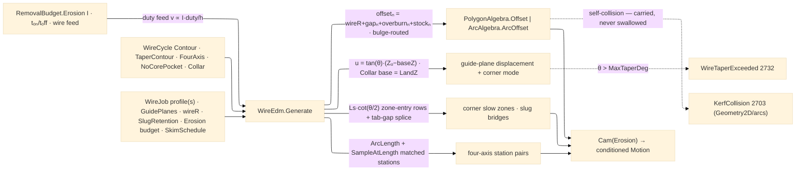

# [RASM_FABRICATION_WIRE_EDM]

The wire-EDM cycle owner: ONE `WireCycle` `[Union]` closing the traveling-wire concern — `Contour` · `TaperContour` (guide-plane taper + corner mode) · `FourAxis` (independent upper/lower profiles) · `NoCorePocket` · `Collar` — generated by ONE `WireEdm.Generate` fold riding the `Cam(Erosion, strategy)` egress: the `erosion` modality admits `{boundary-pass, plunge-dwell}` (`Process/family#PROCESS_FAMILY`), the contour family rides `boundary-pass` and the no-core clearing rides `plunge-dwell`, and this page is the `RemovalBudget.Erosion` budget's CONSUMER — discharge current, pulse on/off, and wire feed resolve the linear cut speed as a derived duty-cycle row `v ∝ I·(tₒₙ/(tₒₙ+tₒff))/h` over workpiece thickness `h`, never a hand-entered feed. The per-pass geometry is the COMPOUND OFFSET law: pass `n` offsets the programmed profile by `offsetₙ = wireR + sparkGapₙ + overburnₙ + stockₙ` off the `SkimPass` schedule rows (one rough + skim tail, each row carrying gap/overburn/stock/speed-scale), the offsets executed through the Geometry2D substrate ROUTED BY PROFILE FORM — a zero-bulge profile rides the line-space `PolygonAlgebra.Offset`, a bulged profile the arc-space `ArcAlgebra.ArcOffset` — and every offset failure PROPAGATES on the `Fin` rail (`KerfCollision` 2703 is `Geometry2D/arcs`'s verdict, carried through, never swallowed into the un-offset profile).

Taper is GUIDE-PLANE geometry: the upper-guide UV displacement is `u = tan(θ)·(Zᵤ − Z_base)` over the `GuidePlanes` row (lower/upper/program planes) — `Contour`/`TaperContour` measure from the lower plane, `Collar` measures from its `LandZ`, so the collar's straight land IS the consumed `LandZ` datum (displacement zero at and below the land, tapered above — one formula, never a second pass family); a demanded `θ` beyond the machine's guide capability routes `FabricationFault.WireTaperExceeded` 2732 `(angleDeg, guideLimitDeg)` — the typed capability verdict, never a clamped silent taper. `TaperCornerMode` discriminates the corner solid IN THE EMISSION: `conical` shares the corner row between planes (one arc center, radii shrinking — the corner vertex emits bare), `cylindrical` inserts the corner-local arc on the displaced trace (`ArcCenter` at the corner, constant radius on both planes). `FourAxis` synchronizes the lower profile and the independent upper profile by TRUE ARC-LENGTH STATIONS — `ArcAlgebra.ArcLength` measures each offset ring and `ArcAlgebra.SampleAtLength` samples both at matched fractional stations, so UV and XY interpolate between MATCHED stations, never index-paired vertices. Corner strategy is the slowdown law: at an interior corner of angle `θ` the slow zone spans `Ls = 4R·cot(θ/2)` with `R = wireR + sparkGap` (the wire-lag geometry — the lag drags the wire behind the guides and undercuts the corner unless the feed drops), the zone ENTRY row positioned `Ls` BEFORE the corner along the incoming segment at the pass's scaled feed; slug management is the `SlugRetention` `[Union]` (`FullCut` · `Tab` retained micro-bridges · `SkimTab` released at a named skim pass) SPLICED INTO THE EMISSION — inside a tab gap the row emits non-cutting, the bridges surviving on the rough pass (`Tab`) or every pass below `ReleasePass` (`SkimTab`) so a falling slug never pinches the wire on an unattended cut.

Wire posture: HOST-LOCAL. The generated `Move` stream crosses only the in-process seam to the Cam fold and onward to posting — never a browser or peer wire; the cycle union never sits between wire and rail.

## [01]-[INDEX]

- [01]-[WIRE_EDM]: owns the `TaperCornerMode` vocabulary, the `SkimPass`/`SkimSchedule`/`GuidePlanes`/`WireJob` models, the `SlugRetention` and five-case `WireCycle` `[Union]`s, and the ONE `WireEdm.Generate` fold — the compound-offset, taper-resolved, corner-slowed, tab-spliced traveling-wire generator on the erosion budget.

## [02]-[WIRE_EDM]

- Owner: `TaperCornerMode` `[SmartEnum<string>]` (`conical`/`cylindrical`) the taper-corner solid axis — READ at emission, the cylindrical row inserting the corner arc; `SkimPass` the per-pass offset row (`Pass`/`SparkGapMm`/`OverburnMm`/`StockMm`/`SpeedScale` — the compound-offset columns); `SkimSchedule` the seeded rough+skim table (row data, machine-book refinable through the cuttingdata ingress lane, never hand-edited literals in a generator body); `GuidePlanes` the lower/upper/program plane row carrying `MaxTaperDeg` (the capability the 2732 gate reads) and the `UvShiftFrom(baseZ, taperDeg)` displacement projection the collar land consumes; `SlugRetention` `[Union]` (`FullCut` · `Tab(WidthMm, Count)` · `SkimTab(WidthMm, Count, ReleasePass)`) with the `GapAt(pass)` splice projection; `WireJob` the per-job carrier (lower profile, optional four-axis upper profile, guides, wire radius, slug policy, `RemovalBudget.Erosion`, schedule, thickness); `WireCycle` the five-case cycle `[Union]`; `WireEdm` the static surface owning `Generate`.
- Cases: `WireCycle` — `Contour(Skims)` · `TaperContour(TaperDeg, Corners, Skims)` · `FourAxis(Skims)` · `NoCorePocket(StepOverMm)` · `Collar(LandZ, TaperDeg)` (5); strategy mapping is DATA — `Contour`/`TaperContour`/`FourAxis`/`Collar` ride `boundary-pass`, `NoCorePocket` rides `plunge-dwell` (the pocket starts on a drilled start hole, the EDM plunge analogue); a schedule with `Skims` skims runs `Skims + 1` passes (rough pass 1 + the skim tail); the compound-offset recurrence, the taper displacement, and the corner-zone length are DERIVED formulas on the rows — a per-machine offset table enters through row data, never a formula fork.
- Entry: `public static Fin<Seq<Move>> Generate(WireCycle cycle, WireJob job)` — the ONE traveling-wire fold discriminating on the cycle case through the generated total `Switch`; `Fin<T>` routes `FabricationFault.WireTaperExceeded` 2732 when the demanded taper exceeds `Guides.MaxTaperDeg`, `FabricationFault.OpenLoop` (`FabConcern.Toolpath`) on an open contour profile (the wire path is a closed cut or a documented open rip — the open form demands the explicit `FullCut` slug row), `GeometryFault.DegenerateInput` on an empty profile or non-positive wire radius, and CARRIES the Geometry2D offset failures (`KerfCollision` 2703) through — each lowered with `.ToError()`, none swallowed.
- Auto: `Generate` derives the pass feed once — `FeedOf(budget, thickness)` = duty-scaled current over thickness with the pass `SpeedScale` — then folds the case: `Contour` traverses pass 1..N off the schedule (`TraverseM` — first offset failure aborts typed), each pass the compound offset routed line-space or arc-space by the profile's bulge column, corner slow zones injected per interior corner (`Ls = 4R·cot(θ/2)` — the zone-entry row `Ls` before the corner at scaled feed) and tab gaps spliced per the slug row; `TaperContour` gates the 2732 capability and emits with the guide displacement and its corner mode; `FourAxis` offsets lower and upper by the same compound value and emits MATCHED arc-length station pairs (`ArcLength`/`SampleAtLength` — the arc-space owner's true stations); `NoCorePocket` marches inward step-over offsets from the start hole so the core erodes to nothing (no slug row consulted; annihilation — the empty offset result — is the recursion's success terminal, a FAILED offset propagates); `Collar` runs one gated pass whose displacement measures from `LandZ` — land below, taper above.
- Receipt: the ordered `Move` stream IS the receipt — pass-tagged feed rows with corner-zone feed scaling and tab-gap non-cutting rows visible in the stream; the schedule rows are recomputable data (no parallel pass ledger, no baked offset table in the emission).
- Packages: `Process/owner#FABRICATION_OWNER` (`Loop`/`Move`/`ArcCenter` — composed), `Process/physics#CUT_PARAMETER` (`RemovalBudget.Erosion` — the budget consumer), `Process/family#PROCESS_FAMILY` (`erosion` admission rows — gated upstream by the Cam fold), `Geometry2D/algebra#POLYGON_ALGEBRA` (line-space compound offsets), `Geometry2D/arcs#ARC_ALGEBRA` (`ArcOffset` bulged-profile offsets, `ArcLength`/`SampleAtLength` station pairing, `KerfCollision` 2703 owner), Rhino.Geometry, Thinktecture.Runtime.Extensions, LanguageExt.Core, BCL inbox.
- Growth: a new cycle (a turn-and-burn rotary axis, a wire-tilt ruled surface) is one `WireCycle` case + one `Switch` arm; a new skim regime is schedule ROW data; a new corner strategy (arc-in constant-radius rounding) is one `TaperCornerMode` row + one emission arm, never a sibling generator; generator/dielectric technology tables (E-pack rows) enter through the cuttingdata ingress lane keyed by `Material`, never page-local dictionaries; zero new entrypoint surface.
- Boundary: `WireEdm` is the ONE traveling-wire owner and a `TaperPath`/`SkimPath`/`DieCutter` sibling family is the deleted form; the compound offset is a DERIVED recurrence over schedule rows and a hand-entered per-pass offset literal in an arm body is the named defect; the offset execution rides the Geometry2D owners routed by profile form and a page-local polygon offset OR a swallowed offset failure (`IfFail` to the un-offset profile) is the deleted form — a compound-offset self-collision is `KerfCollision` 2703, owned by arcs, carried through here; the taper capability verdict is typed 2732 and a silent clamp to `MaxTaperDeg` is the deleted form; four-axis pairing is `ArcLength`/`SampleAtLength` matched stations and index-paired vertices are the rejected form; the erosion feed derives from the budget duty cycle and a magic cut-speed constant is the deleted form; G-word emission (AWF threading codes, taper words) is `Posting/dialect`'s lowering — this page owns geometry and pass data only.

```csharp signature
// --- [RUNTIME_PRELUDE] ----------------------------------------------------------------------------------------------------------------------------
using LanguageExt;
using LanguageExt.Common;
using Rasm.Fabrication.Geometry2D;
using Rasm.Fabrication.Process;
using Rasm.Numerics;
using Rhino.Geometry;
using Thinktecture;
using static LanguageExt.Prelude;

namespace Rasm.Fabrication.Toolpath;

// --- [TYPES] --------------------------------------------------------------------------------------------------------------------------------------
[SmartEnum<string>]
public sealed partial class TaperCornerMode {
    public static readonly TaperCornerMode Conical = new("conical");           // one arc center, radii shrink between guide planes
    public static readonly TaperCornerMode Cylindrical = new("cylindrical");   // constant corner radius — the displaced trace inserts the arc
}

// --- [MODELS] -------------------------------------------------------------------------------------------------------------------------------------
// Compound-offset columns: offsetₙ = wireR + SparkGapMm + OverburnMm + StockMm; SpeedScale scales the duty feed.
public readonly record struct SkimPass(int Pass, double SparkGapMm, double OverburnMm, double StockMm, double SpeedScale);

// Seed schedule (rough + three skims, brass 0.25 wire class): machine-book rows refine via the cuttingdata
// ingress lane — a generator body never edits these literals.
public static class SkimSchedule {
    public static readonly Arr<SkimPass> Standard = Arr(
        new SkimPass(1, SparkGapMm: 0.18, OverburnMm: 0.030, StockMm: 0.120, SpeedScale: 1.00),
        new SkimPass(2, SparkGapMm: 0.05, OverburnMm: 0.020, StockMm: 0.040, SpeedScale: 0.60),
        new SkimPass(3, SparkGapMm: 0.02, OverburnMm: 0.010, StockMm: 0.010, SpeedScale: 0.35),
        new SkimPass(4, SparkGapMm: 0.01, OverburnMm: 0.005, StockMm: 0.000, SpeedScale: 0.20));
}

public readonly record struct GuidePlanes(double LowerZ, double UpperZ, double ProgramZ, double MaxTaperDeg) {
    public double Span => UpperZ - LowerZ;

    // The one displacement law: u = tan(θ)·(Zᵤ − baseZ); Contour/TaperContour pass LowerZ, Collar its LandZ —
    // the land IS the base datum, zero displacement at and below it.
    public double UvShiftFrom(double baseZ, double taperDeg) =>
        Math.Tan(taperDeg * Math.PI / 180.0) * Math.Max(UpperZ - baseZ, 0.0);
}

[Union(ConversionFromValue = ConversionOperatorsGeneration.None)]
public abstract partial record SlugRetention {
    private SlugRetention() { }

    public sealed record FullCut : SlugRetention;
    public sealed record Tab(double WidthMm, int Count) : SlugRetention;                        // retained micro-bridges on the rough pass
    public sealed record SkimTab(double WidthMm, int Count, int ReleasePass) : SlugRetention;   // bridges released at the named skim

    // The splice projection: the tab gaps a given pass retains — Tab bridges live on the rough pass alone,
    // SkimTab bridges on every pass below the release; the released pass and FullCut retain nothing.
    public (double WidthMm, int Count) GapAt(int pass) => Switch(
        state: pass,
        fullCut: static (_, _) => (0.0, 0),
        tab: static (p, t) => p == 1 ? (t.WidthMm, t.Count) : (0.0, 0),
        skimTab: static (p, t) => p < t.ReleasePass ? (t.WidthMm, t.Count) : (0.0, 0));
}

public sealed record WireJob(
    Loop Profile, Option<Loop> UpperProfile, GuidePlanes Guides, double WireRadiusMm,
    SlugRetention Slug, RemovalBudget.Erosion Budget, Arr<SkimPass> Schedule, double ThicknessMm);

[Union(ConversionFromValue = ConversionOperatorsGeneration.None)]
public abstract partial record WireCycle {
    private WireCycle() { }

    public sealed record Contour(int Skims) : WireCycle;
    public sealed record TaperContour(double TaperDeg, TaperCornerMode Corners, int Skims) : WireCycle;
    public sealed record FourAxis(int Skims) : WireCycle;                            // independent UV/XY profiles, station-paired
    public sealed record NoCorePocket(double StepOverMm) : WireCycle;                // core eroded to nothing — no slug
    public sealed record Collar(double LandZ, double TaperDeg) : WireCycle;          // land below LandZ, taper above — one displacement datum
}

// --- [OPERATIONS] ---------------------------------------------------------------------------------------------------------------------------------
public static class WireEdm {
    public static Fin<Seq<Move>> Generate(WireCycle cycle, WireJob job) =>
        job.Profile.Count == 0 || job.WireRadiusMm <= 0.0
            ? Fin.Fail<Seq<Move>>(GeometryFault.DegenerateInput("wire-edm:degenerate-profile-or-wire").ToError())
            : !job.Profile.Closed && job.Slug is not SlugRetention.FullCut
                ? Fin.Fail<Seq<Move>>(FabricationFault.OpenLoop(FabConcern.Toolpath, 0).ToError())
                : cycle.Switch(
                    state:        job,
                    contour:      static (j, c) => Passes(j, c.Skims, taperDeg: 0.0, baseZ: j.Guides.LowerZ, TaperCornerMode.Conical),
                    taperContour: static (j, c) => c.TaperDeg > j.Guides.MaxTaperDeg
                                                       ? Fin.Fail<Seq<Move>>(FabricationFault.WireTaperExceeded(c.TaperDeg, j.Guides.MaxTaperDeg).ToError())
                                                       : Passes(j, c.Skims, c.TaperDeg, baseZ: j.Guides.LowerZ, c.Corners),
                    fourAxis:     static (j, c) => j.UpperProfile.Match(
                                                       None: () => Fin.Fail<Seq<Move>>(
                                                           GeometryFault.DegenerateInput("wire-edm:four-axis-missing-upper").ToError()),
                                                       Some: up => PairedPasses(j, up, c.Skims)),
                    noCorePocket: static (j, c) => NoCore(j, c.StepOverMm),
                    collar:       static (j, c) => c.TaperDeg > j.Guides.MaxTaperDeg
                                                       ? Fin.Fail<Seq<Move>>(FabricationFault.WireTaperExceeded(c.TaperDeg, j.Guides.MaxTaperDeg).ToError())
                                                       : Passes(j, skims: 0, c.TaperDeg, baseZ: c.LandZ, TaperCornerMode.Conical));

    // The compound-offset pass fold: TraverseM aborts typed on the first offset failure — KerfCollision 2703
    // propagates from the arc owner, never a fallback to the un-offset profile.
    static Fin<Seq<Move>> Passes(WireJob job, int skims, double taperDeg, double baseZ, TaperCornerMode corners) =>
        toSeq(job.Schedule.Filter(p => p.Pass <= Math.Max(1, skims + 1)))
            .TraverseM(pass =>
                Offset(job.Profile, job.WireRadiusMm + pass.SparkGapMm + pass.OverburnMm + pass.StockMm).Map(rings =>
                    rings.Bind(ring => Emit(
                        ring,
                        feed: FeedOf(job.Budget, job.ThicknessMm) * pass.SpeedScale,
                        slowBase: 4.0 * (job.WireRadiusMm + pass.SparkGapMm),
                        speedScale: pass.SpeedScale,
                        uvShift: job.Guides.UvShiftFrom(baseZ, taperDeg),
                        corners: corners,
                        gap: job.Slug.GapAt(pass.Pass)))))
            .As()
            .Map(static passes => passes.Bind(static rows => rows));

    // The profile-form router: zero-bulge rides the line-space owner, a bulged profile the arc-space owner.
    static Fin<Seq<Loop>> Offset(Loop profile, double value) =>
        profile.Bulges.IsEmpty
            ? PolygonAlgebra.Offset(Seq(profile), value, OffsetEnds.Polygon)
            : ArcAlgebra.ArcOffset(profile, value);

    // Lower/upper synchronized pairs at MATCHED arc-length stations: both offset rings sampled at the same
    // fractional station through the arc owner's true length walk — never index-paired vertices.
    static Fin<Seq<Move>> PairedPasses(WireJob job, Loop upper, int skims) =>
        toSeq(job.Schedule.Filter(p => p.Pass <= Math.Max(1, skims + 1)))
            .TraverseM(pass => {
                double value = job.WireRadiusMm + pass.SparkGapMm + pass.OverburnMm + pass.StockMm;
                double feed = FeedOf(job.Budget, job.ThicknessMm) * pass.SpeedScale;
                return Offset(job.Profile, value).Bind(lower => Offset(upper, value).Map(upperRings =>
                    lower.Zip(upperRings).Bind(rings => Stations(rings.Left, rings.Right, feed, job.Guides.Span))));
            })
            .As()
            .Map(static passes => passes.Bind(static rows => rows));

    static Seq<Move> Stations(Loop lower, Loop upper, double feed, double span) {
        double lowerLength = ArcAlgebra.ArcLength(lower);
        double upperLength = ArcAlgebra.ArcLength(upper);
        int count = Math.Max(lower.Count, upper.Count) * 2;
        return toSeq(Enumerable.Range(0, count + 1)).Bind(i => {
            double t = i / (double)count;
            (bool lowHit, Point3d low) = ArcAlgebra.SampleAtLength(lower, t * lowerLength);
            (bool upHit, Point3d up) = ArcAlgebra.SampleAtLength(upper, t * upperLength);
            return lowHit && upHit
                ? Seq(new Move(new Point3d(low.X, low.Y, 0.0), Rapid: false, Feed: feed),
                      new Move(new Point3d(up.X, up.Y, span), Rapid: false, Feed: feed))
                : Seq<Move>();
        });
    }

    // Inward step-over recursion: annihilation (an EMPTY offset result) is the success terminal — the core is
    // consumed; a FAILED offset propagates typed. Fin recursion, no swallow.
    static Fin<Seq<Move>> NoCore(WireJob job, double stepOver) {
        Fin<Seq<Move>> Rings(double inset) =>
            Offset(job.Profile, -(job.WireRadiusMm + inset)).Bind(rings =>
                rings.IsEmpty
                    ? Fin.Succ(Seq<Move>())
                    : Rings(inset + Math.Max(stepOver, 1e-3)).Map(deeper =>
                        rings.Bind(r => toSeq(r.Vertices).Map(p => new Move(p, Rapid: false, Feed: FeedOf(job.Budget, job.ThicknessMm))))
                        + deeper));
        return Rings(0.0);
    }

    // Emission: interior corner θ gets a zone-entry row Ls·cot(θ/2)-positioned BEFORE the corner along the
    // incoming segment at scaled feed; the cylindrical taper-corner row inserts the corner arc; a station
    // inside a tab gap emits non-cutting (Rapid) so the bridge survives; the taper shift rides Move.To.Z.
    static Seq<Move> Emit(Loop ring, double feed, double slowBase, double speedScale, double uvShift, TaperCornerMode corners, (double WidthMm, int Count) gap) {
        double perimeter = ArcAlgebra.ArcLength(ring);
        double gapStride = gap.Count > 0 ? perimeter / gap.Count : double.MaxValue;
        return toSeq(Enumerable.Range(0, ring.Count)).Bind(i => {
            Vector3d din = ring.At(i) - ring.At(i - 1);
            Vector3d dout = ring.At(i + 1) - ring.At(i);
            double run = din.Length;
            din.Unitize(); dout.Unitize();
            double theta = Math.Max(1e-3, Math.PI - Math.Acos(Math.Clamp(din * dout, -1.0, 1.0)));
            double ls = Math.Min(slowBase / Math.Max(Math.Tan(theta / 2.0), 1e-3), run);
            double station = toSeq(Enumerable.Range(0, i)).Map(k => (ring.At(k + 1) - ring.At(k)).Length).Sum();
            bool bridged = gap.Count > 0 && station % gapStride < gap.WidthMm;
            Point3d at = new(ring.At(i).X, ring.At(i).Y, uvShift);
            Point3d zoneEntry = new(ring.At(i).X - din.X * ls, ring.At(i).Y - din.Y * ls, uvShift);
            Vector3d bisector = dout - din;
            bisector.Unitize();
            double cornerR = slowBase / 4.0;   // wireR + sparkGap — the constant corner radius of the inserted arc
            Option<ArcCenter> corner = corners == TaperCornerMode.Cylindrical && uvShift > 0.0 && theta < Math.PI - 1e-3
                ? Some(new ArcCenter(at + bisector * (cornerR / Math.Max(Math.Sin(theta / 2.0), 1e-3)), Clockwise: false))
                : Option<ArcCenter>.None;
            return ls > 1e-3
                ? Seq(new Move(zoneEntry, Rapid: bridged, Feed: feed * Math.Min(speedScale, 0.5)),
                      new Move(at, Rapid: bridged, Feed: feed * Math.Min(speedScale, 0.5), Arc: corner))
                : Seq(new Move(at, Rapid: bridged, Feed: feed, Arc: corner));
        });
    }

    // Duty-cycle feed: v = k·I·(tₒₙ/(tₒₙ+tₒff))/h over thickness h — the Erosion budget is the ONE source.
    static double FeedOf(RemovalBudget.Erosion budget, double thicknessMm) {
        double duty = budget.PulseOnUs / Math.Max(budget.PulseOnUs + budget.PulseOffUs, 1e-6);
        return budget.WireFeed * budget.DischargeCurrent * duty / Math.Max(thicknessMm, 1.0);
    }
}
```


