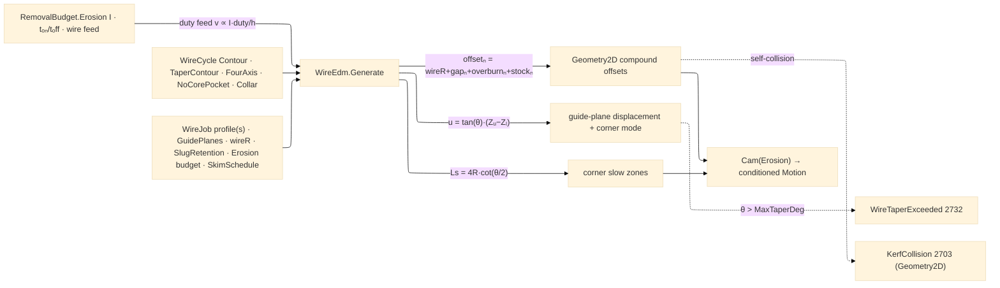

# [RASM_FABRICATION_WIRE_EDM]

The wire-EDM cycle owner: ONE `WireCycle` `[Union]` closing the traveling-wire concern — `Contour` · `TaperContour` (guide-plane taper + corner mode) · `FourAxis` (independent upper/lower profiles) · `NoCorePocket` · `Collar` — generated by ONE `WireEdm.Generate` fold riding the `Cam(Erosion, strategy)` egress: the `erosion` modality admits `{boundary-pass, plunge-dwell}` (`Process/family#PROCESS_FAMILY`), the contour family rides `boundary-pass` and the no-core clearing rides `plunge-dwell`, and this page is the `RemovalBudget.Erosion` budget's CONSUMER — discharge current, pulse on/off, and wire feed resolve the linear cut speed as a derived duty-cycle row `v ∝ I·(tₒₙ/(tₒₙ+tₒff))/h` over workpiece thickness `h`, never a hand-entered feed. The per-pass geometry is the COMPOUND OFFSET law: pass `n` offsets the programmed profile by `offsetₙ = wireR + sparkGapₙ + overburnₙ + stockₙ` off the `SkimPass` schedule rows (one rough + skim tail, each row carrying gap/overburn/stock/speed-scale), the offsets executed through the `Geometry2D` substrate (`algebra` line-space, `arcs` arc-space for bulged profiles — a kerf collision inside the compound offset routes the `Geometry2D`-owned `KerfCollision` 2703, never a second arm here).

Taper is GUIDE-PLANE geometry: the upper-guide UV displacement is `u = tan(θ)·(Zᵤ − Zₗ)` over the `GuidePlanes` row (lower/upper/program planes), the program-plane profile scaling by similar triangles; a demanded `θ` beyond the machine's guide capability routes `FabricationFault.WireTaperExceeded` 2732 `(angleDeg, guideLimitDeg)` — the typed capability verdict, never a clamped silent taper. `TaperCornerMode` discriminates the corner solid: `conical` (the corner radius shrinks linearly between planes — one arc center, two radii) versus `cylindrical` (constant corner radius on both planes — the upper profile grows a corner-local arc insertion). `FourAxis` synchronizes the lower profile and the independent upper profile by arc-length stations — the station pairing composes the `Geometry2D/curves#CURVE_SUBSTRATE` parametric station frames (TYPE contract; the substrate lands beside this page) so UV and XY interpolate between MATCHED stations, never index-paired vertices. Corner strategy is the slowdown law: at an interior corner of angle `θ` the slow zone spans `Ls = 4R·cot(θ/2)` with `R = wireR + sparkGap` (the wire-lag geometry — the lag drags the wire behind the guides and undercuts the corner unless the feed drops), the zone feed scaled by the pass's `SpeedScale`; slug management is the `SlugRetention` `[Union]` (`FullCut` · `Tab` retained micro-bridges · `SkimTab` released at a named skim pass) so a falling slug never pinches the wire on an unattended cut.

Wire posture: HOST-LOCAL. The generated `Move` stream crosses only the in-process seam to the Cam fold and onward to posting — never a browser or peer wire; the cycle union never sits between wire and rail.

## [01]-[INDEX]

- [01]-[WIRE_EDM]: owns the `TaperCornerMode` vocabulary, the `SkimPass`/`GuidePlanes`/`WireJob` models, the `SlugRetention` and five-case `WireCycle` `[Union]`s, and the ONE `WireEdm.Generate` fold — the compound-offset, taper-resolved, corner-slowed traveling-wire generator on the erosion budget.

## [02]-[WIRE_EDM]

- Owner: `TaperCornerMode` `[SmartEnum<string>]` (`conical`/`cylindrical`) the taper-corner solid axis; `SkimPass` the per-pass offset row (`Pass`/`SparkGapMm`/`OverburnMm`/`StockMm`/`SpeedScale` — the compound-offset columns); `SkimSchedule` the seeded rough+skim table (row data, machine-book refinable through the cuttingdata ingress lane, never hand-edited literals in a generator body); `GuidePlanes` the lower/upper/program plane row carrying `MaxTaperDeg` (the capability the 2732 gate reads); `SlugRetention` `[Union]` (`FullCut` · `Tab(WidthMm, Count)` · `SkimTab(WidthMm, ReleasePass)`); `WireJob` the per-job carrier (lower profile, optional four-axis upper profile, guides, wire radius, slug policy, `RemovalBudget.Erosion`, schedule); `WireCycle` the five-case cycle `[Union]`; `WireEdm` the static surface owning `Generate`.
- Cases: `WireCycle` — `Contour(Skims)` · `TaperContour(TaperDeg, Corners, Skims)` · `FourAxis(Skims)` · `NoCorePocket(StepOverMm)` · `Collar(LandZ, TaperDeg)` (5); strategy mapping is DATA — `Contour`/`TaperContour`/`FourAxis`/`Collar` ride `boundary-pass`, `NoCorePocket` rides `plunge-dwell` (the pocket starts on a drilled start hole, the EDM plunge analogue); the compound-offset recurrence, the taper displacement, and the corner-zone length are DERIVED formulas on the rows — a per-machine offset table enters through row data, never a formula fork.
- Entry: `public static Fin<Seq<Move>> Generate(WireCycle cycle, WireJob job)` — the ONE traveling-wire fold discriminating on the cycle case through the generated total `Switch`; `Fin<T>` routes `FabricationFault.WireTaperExceeded` 2732 when the demanded taper exceeds `Guides.MaxTaperDeg`, `FabricationFault.OpenLoop` (`FabConcern.Toolpath`) on an open contour profile (the wire path is a closed cut or a documented open rip — the open form demands the explicit `FullCut` slug row), `GeometryFault.DegenerateInput` on an empty profile or non-positive wire radius, each lowered with `.ToError()`.
- Auto: `Generate` derives the pass feed once — `FeedOf(budget, thickness)` = duty-scaled current over thickness with the pass `SpeedScale` — then folds the case: `Contour` emits pass 1..N off the schedule, each pass the compound offset `wireR + gapₙ + overburnₙ + stockₙ` of the profile (Geometry2D offsets — arc-native where `Loop.Bulges` is non-zero), corner slow zones injected per interior corner (`Ls = 4R·cot(θ/2)` split into zone-entry/zone-exit `Move` rows at scaled feed); `TaperContour` gates the 2732 capability, computes the upper-guide displacement per station, and emits synchronized lower/upper pairs (`conical` sharing arc centers, `cylindrical` inserting the upper corner arc); `FourAxis` pairs lower/upper stations by arc length (the curves-substrate station frames) and emits UV/XY move pairs; `NoCorePocket` marches inward step-over offsets from the start hole so the core erodes to nothing (no slug row consulted); `Collar` runs the straight land to `LandZ` then the tapered remainder; slug handling splices the `Tab` bridges into the final rough pass and releases them at the `SkimTab.ReleasePass`.
- Receipt: the ordered `Move` stream IS the receipt — pass-tagged feed rows with corner-zone feed scaling visible in the stream; the schedule rows are recomputable data (no parallel pass ledger, no baked offset table in the emission).
- Packages: `Process/owner#FABRICATION_OWNER` (`Loop`/`Move`/`ArcCenter` — composed), `Process/physics#CUT_PARAMETER` (`RemovalBudget.Erosion` — the budget consumer), `Process/family#PROCESS_FAMILY` (`erosion` admission rows — gated upstream by the Cam fold), `Geometry2D/algebra#POLYGON_ALGEBRA` + `Geometry2D/arcs#ARC_ALGEBRA` (compound offsets, `KerfCollision` 2703 owner), `Geometry2D/curves#CURVE_SUBSTRATE` (arc-length station pairing for `FourAxis`/taper sync — TYPE contract), Rhino.Geometry, `Rasm.Numerics` (`Predicate.Orient2D` corner-side verdicts), Thinktecture.Runtime.Extensions, LanguageExt.Core, BCL inbox.
- Growth: a new cycle (a turn-and-burn rotary axis, a wire-tilt ruled surface) is one `WireCycle` case + one `Switch` arm; a new skim regime is schedule ROW data; a new corner strategy (arc-in constant-radius rounding) is one corner-fold policy row, never a sibling generator; generator/dielectric technology tables (E-pack rows) enter through the cuttingdata ingress lane keyed by `Material`, never page-local dictionaries; zero new entrypoint surface.
- Boundary: `WireEdm` is the ONE traveling-wire owner and a `TaperPath`/`SkimPath`/`DieCutter` sibling family is the deleted form; the compound offset is a DERIVED recurrence over schedule rows and a hand-entered per-pass offset literal in an arm body is the named defect; the kerf/offset execution rides the Geometry2D owners and a page-local polygon offset is the deleted form — a compound-offset self-collision is `KerfCollision` 2703, owned there; the taper capability verdict is typed 2732 and a silent clamp to `MaxTaperDeg` is the deleted form; four-axis pairing is arc-length stations and index-paired vertices are the rejected form; the erosion feed derives from the budget duty cycle and a magic cut-speed constant is the deleted form; G-word emission (AWF threading codes, taper words) is `Posting/dialect`'s lowering — this page owns geometry and pass data only.

```csharp signature
// --- [RUNTIME_PRELUDE] ----------------------------------------------------------------------------------------------------------------------------
using LanguageExt;
using LanguageExt.Common;
using Rasm.Fabrication.Geometry2D;
using Rasm.Fabrication.Process;
using Rasm.Numerics;
using Rhino.Geometry;
using Thinktecture;
using static LanguageExt.Prelude;

namespace Rasm.Fabrication.Toolpath;

// --- [TYPES] --------------------------------------------------------------------------------------------------------------------------------------
[SmartEnum<string>]
public sealed partial class TaperCornerMode {
    public static readonly TaperCornerMode Conical = new("conical");           // one arc center, radii shrink between guide planes
    public static readonly TaperCornerMode Cylindrical = new("cylindrical");   // constant corner radius on both planes
}

// --- [MODELS] -------------------------------------------------------------------------------------------------------------------------------------
// Compound-offset columns: offsetₙ = wireR + SparkGapMm + OverburnMm + StockMm; SpeedScale scales the duty feed.
public readonly record struct SkimPass(int Pass, double SparkGapMm, double OverburnMm, double StockMm, double SpeedScale);

// Seed schedule (rough + three skims, brass 0.25 wire class): machine-book rows refine via the cuttingdata
// ingress lane — a generator body never edits these literals.
public static class SkimSchedule {
    public static readonly Arr<SkimPass> Standard = Arr(
        new SkimPass(1, SparkGapMm: 0.18, OverburnMm: 0.030, StockMm: 0.120, SpeedScale: 1.00),
        new SkimPass(2, SparkGapMm: 0.05, OverburnMm: 0.020, StockMm: 0.040, SpeedScale: 0.60),
        new SkimPass(3, SparkGapMm: 0.02, OverburnMm: 0.010, StockMm: 0.010, SpeedScale: 0.35),
        new SkimPass(4, SparkGapMm: 0.01, OverburnMm: 0.005, StockMm: 0.000, SpeedScale: 0.20));
}

public readonly record struct GuidePlanes(double LowerZ, double UpperZ, double ProgramZ, double MaxTaperDeg) {
    public double Span => UpperZ - LowerZ;
    public double UvShift(double taperDeg) => Math.Tan(taperDeg * Math.PI / 180.0) * Span;
}

[Union(ConversionFromValue = ConversionOperatorsGeneration.None)]
public abstract partial record SlugRetention {
    private SlugRetention() { }

    public sealed record FullCut : SlugRetention;
    public sealed record Tab(double WidthMm, int Count) : SlugRetention;             // retained micro-bridges on the rough pass
    public sealed record SkimTab(double WidthMm, int ReleasePass) : SlugRetention;   // bridges released at the named skim
}

public sealed record WireJob(
    Loop Profile, Option<Loop> UpperProfile, GuidePlanes Guides, double WireRadiusMm,
    SlugRetention Slug, RemovalBudget.Erosion Budget, Arr<SkimPass> Schedule, double ThicknessMm);

[Union(ConversionFromValue = ConversionOperatorsGeneration.None)]
public abstract partial record WireCycle {
    private WireCycle() { }

    public sealed record Contour(int Skims) : WireCycle;
    public sealed record TaperContour(double TaperDeg, TaperCornerMode Corners, int Skims) : WireCycle;
    public sealed record FourAxis(int Skims) : WireCycle;                            // independent UV/XY profiles, station-paired
    public sealed record NoCorePocket(double StepOverMm) : WireCycle;                // core eroded to nothing — no slug
    public sealed record Collar(double LandZ, double TaperDeg) : WireCycle;          // straight land + tapered remainder
}

// --- [OPERATIONS] ---------------------------------------------------------------------------------------------------------------------------------
public static class WireEdm {
    public static Fin<Seq<Move>> Generate(WireCycle cycle, WireJob job) =>
        job.Profile.Count == 0 || job.WireRadiusMm <= 0.0
            ? Fin.Fail<Seq<Move>>(GeometryFault.DegenerateInput("wire-edm:degenerate-profile-or-wire").ToError())
            : !job.Profile.Closed && job.Slug is not SlugRetention.FullCut
                ? Fin.Fail<Seq<Move>>(FabricationFault.OpenLoop(FabConcern.Toolpath, 0).ToError())
                : cycle.Switch(
                    state:        job,
                    contour:      static (j, c) => Fin.Succ(Passes(j, c.Skims, taperDeg: 0.0)),
                    taperContour: static (j, c) => c.TaperDeg > j.Guides.MaxTaperDeg
                                                       ? Fin.Fail<Seq<Move>>(FabricationFault.WireTaperExceeded(c.TaperDeg, j.Guides.MaxTaperDeg).ToError())
                                                       : Fin.Succ(Passes(j, c.Skims, c.TaperDeg)),
                    fourAxis:     static (j, c) => j.UpperProfile.Match(
                                                       None: () => Fin.Fail<Seq<Move>>(
                                                           GeometryFault.DegenerateInput("wire-edm:four-axis-missing-upper").ToError()),
                                                       Some: up => Fin.Succ(PairedPasses(j, up, c.Skims))),
                    noCorePocket: static (j, c) => Fin.Succ(NoCore(j, c.StepOverMm)),
                    collar:       static (j, c) => c.TaperDeg > j.Guides.MaxTaperDeg
                                                       ? Fin.Fail<Seq<Move>>(FabricationFault.WireTaperExceeded(c.TaperDeg, j.Guides.MaxTaperDeg).ToError())
                                                       : Fin.Succ(Passes(j, skims: 1, c.TaperDeg)));

    // Pass n at compound offset wireR + gapₙ + overburnₙ + stockₙ; corner slow zones Ls = 4R·cot(θ/2) at the
    // pass SpeedScale; the offset execution is the Geometry2D substrate (KerfCollision 2703 owned there).
    static Seq<Move> Passes(WireJob job, int skims, double taperDeg) =>
        toSeq(job.Schedule.Filter(p => p.Pass <= Math.Max(1, skims)))
            .Bind(pass => {
                double offset = job.WireRadiusMm + pass.SparkGapMm + pass.OverburnMm + pass.StockMm;
                double feed = FeedOf(job.Budget, job.ThicknessMm) * pass.SpeedScale;
                double slowLen = 4.0 * (job.WireRadiusMm + pass.SparkGapMm);   // × cot(θ/2) per corner at emission
                return PolygonAlgebra.Offset(Seq(job.Profile), offset, OffsetEnds.Polygon).IfFail(Seq(job.Profile))
                    .Bind(ring => CornerAware(ring, feed, slowLen, pass.SpeedScale, job.Guides.UvShift(taperDeg)));
            });

    // Lower/upper synchronized pairs: the four-axis interleave pairs MATCHED arc-length stations
    // (Geometry2D/curves station frames — TYPE seam), never index-paired vertices.
    static Seq<Move> PairedPasses(WireJob job, Loop upper, int skims) =>
        Passes(job, skims, taperDeg: 0.0)
            .Zip(Passes(job with { Profile = upper }, skims, taperDeg: 0.0))
            .Bind(static pair => Seq(pair.Left, pair.Right));

    static Seq<Move> NoCore(WireJob job, double stepOver) {
        Seq<Move> Rings(double inset) =>
            PolygonAlgebra.Offset(Seq(job.Profile), -(job.WireRadiusMm + inset), OffsetEnds.Polygon).Match(
                Succ: rings => rings.IsEmpty
                    ? Seq<Move>()
                    : toSeq(rings).Bind(r => toSeq(r.Vertices)).Map(p => new Move(p, Rapid: false, Feed: FeedOf(job.Budget, job.ThicknessMm)))
                        .Concat(Rings(inset + Math.Max(stepOver, 1e-3))),
                Fail: _ => Seq<Move>());
        return Rings(0.0);
    }

    // Interior corner θ: slow-zone span Ls = base·cot(θ/2); zone rows carry the scaled feed so the lag
    // never undercuts the corner; the taper shift rides Move.To.Z as the upper-guide UV displacement.
    static Seq<Move> CornerAware(Loop ring, double feed, double slowBase, double speedScale, double uvShift) =>
        toSeq(Enumerable.Range(0, ring.Count)).Bind(i => {
            Vector3d din = ring.At(i) - ring.At(i - 1);
            Vector3d dout = ring.At(i + 1) - ring.At(i);
            din.Unitize(); dout.Unitize();
            double theta = Math.Max(1e-3, Math.PI - Math.Acos(Math.Clamp(din * dout, -1.0, 1.0)));
            double ls = slowBase / Math.Max(Math.Tan(theta / 2.0), 1e-3);
            Point3d at = new(ring.At(i).X, ring.At(i).Y, uvShift);
            return ls > 1e-3
                ? Seq(new Move(at, Rapid: false, Feed: feed * Math.Min(speedScale, 0.5)), new Move(at, Rapid: false, Feed: feed))
                : Seq(new Move(at, Rapid: false, Feed: feed));
        });

    // Duty-cycle feed: v = k·I·(tₒₙ/(tₒₙ+tₒff))/h over thickness h — the Erosion budget is the ONE source.
    static double FeedOf(RemovalBudget.Erosion budget, double thicknessMm) {
        double duty = budget.PulseOnUs / Math.Max(budget.PulseOnUs + budget.PulseOffUs, 1e-6);
        return budget.WireFeed * budget.DischargeCurrent * duty / Math.Max(thicknessMm, 1.0);
    }
}
```


