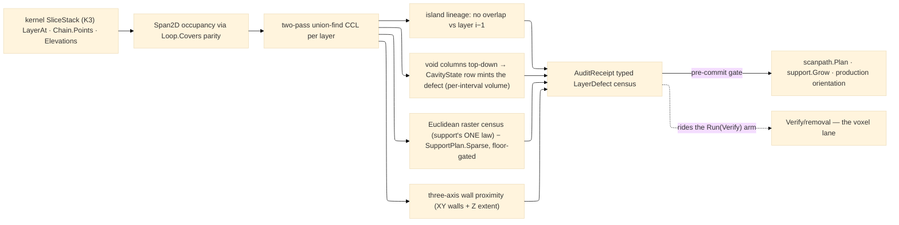

# [RASM_FABRICATION_AUDIT]

The additive layer-stack pre-flight: `Audit.Preflight(SliceStack, AuditPolicy) → Fin<AuditReceipt>` — the one scan over the kernel K3 slice stack that finds the build-killing stack defects BEFORE a scan path or support forest is committed: floating islands, enclosed resin traps, downward-mouthed suction cups, unsupported overhang area, and build-volume wall proximity on ALL THREE axes. The walk is raster-first: each layer's solid occupancy rasterizes over a `Span2D<byte>` grid (cell parity through the shared `Loop.Covers` exact containment over the stack's contour forest — even-odd over covering closed contours, never a hand-rolled point-in-polygon), a two-pass union-find connected-component labeling runs per layer, and CROSS-LAYER ADJACENCY is the label-overlap lineage between layer *i* and *i−1* — the island test is the unanchored-below component, the cavity classification the vertical void-column walk whose terminal verdict DISPATCHES through the `CavityState` row's own defect column (the vocabulary selects the executable behavior, never a decorative label beside branch conditions). The defect census is TYPED: `LayerDefect` one `[Union]` — `Island` · `ResinTrap` · `SuctionCup` · `OverhangArea` · `TouchingBound` — each case carrying its layer locus and measured payload, never a severity string.

Ownership splits are law. The overhang LAW is ONE — `overhangᵢ = layerᵢ \ offset(layerᵢ₋₁, tanα·h)`, the `Additive/support#SUPPORT` census formula — audit evaluates it at raster altitude as an AREA receipt over a EUCLIDEAN disk dilation (the Chebyshev square over-supports diagonals), subtracts the landed `SupportPlan.Planar` sparse regions when the plan rides the policy, and gates the residual against the policy noise floor, so a supported overhang is never a defect and the region-exact structure builder stays support's; a second exact census here is the deleted form. Trap volume integrates PER-INTERVAL layer heights off `Elevations` — a first-interval constant over a variable stack is the named uniform-height fiction. The voxel lane stays `Verify/removal` (PicoGK material-removal truth — audit is the pre-print STACK scanner, removal the post-program REMOVAL verifier, two moments never one owner). This page is RECEIPTS-ONLY: no fault arm mints or routes (a defect is a receipt row the consumer gates on; a degenerate stack routes kernel `DegenerateInput`); the receipts ride the `Run(Verify)` pipeline as its additive pre-flight lane beside the landed `Verify/removal` arm — the TYPE-contract seam, stated not simulated.

Wire posture: HOST-LOCAL. The `AuditReceipt` crosses only the in-process seam — the additive plane's gate before `Scan.Plan`/`Support.Grow` commit, the production orientation loop, the traveler's quality rows; no defect row sits between wire and rail.

## [01]-[INDEX]

- [01]-[AUDIT]: owns the `CavityState` void-column vocabulary with its defect-minting column, the `AuditPolicy` scan knobs, the `LayerDefect` five-case defect union, the `AuditReceipt` census evidence, and the ONE `Audit.Preflight` walk — per-layer `Span2D` occupancy + union-find labeling, cross-layer label lineage, the top-down void-column classification with per-interval volume integration, the raster overhang evaluation under support's one census law, and the three-axis build-wall proximity gate.

## [02]-[AUDIT]

- Owner: `CavityState` `[SmartEnum<string>]` the void-column classification (`open-top` vented up, clean · `mouth-down` capped above, open at the plate — the suction cup · `sealed` capped both ways — the resin trap), each row carrying its `[UseDelegateFromConstructor]` `Defect(layer, measure)` column — the walk classifies, the ROW mints; `AuditPolicy` the scan knobs (`CellMm` raster pitch, `MinIslandAreaMm2` and `MinOverhangAreaMm2` noise floors, `OverhangAngleDeg` the census angle, `BoundMarginMm` wall proximity, `Option<BoundingBox>` build volume, `Option<SupportPlan>` the landed support plan whose sparse regions discharge overhang defects); `LayerDefect` the five-case `[Union]` — `Island(Layer, AreaMm2, At)` · `ResinTrap(CapLayer, VolumeMm3)` · `SuctionCup(MouthLayer, MouthAreaMm2)` · `OverhangArea(Layer, AreaMm2)` · `TouchingBound(Layer, ClearanceMm)`; `AuditReceipt` the census (layer count, defect rows, per-kind counts, the `Clean` conjunction); `Audit` the static surface owning `Preflight`.
- Cases: `LayerDefect` cases 5; `CavityState` rows 3 — the walk carries open void columns top-down: a never-capped column is `open-top` (its row mints nothing — the None delegate IS the law); a column capped by solid above and still open when layer 0 arrives is `mouth-down`; a column capped above whose footprint closes before layer 0 is `sealed` at the closing layer, its volume the per-interval `Σ n·cellArea·hᵢ` integral; the island lineage — a layer-*i* solid component whose label overlap against layer *i−1* occupancy is EMPTY and whose area clears the noise floor (layer 0 sits on the plate and mints none); the overhang evaluation — solid cells beyond the Euclidean-dilated prior layer, support-plan cells subtracted, the residual gated by `MinOverhangAreaMm2`.
- Entry: `public static Fin<AuditReceipt> Preflight(SliceStack stack, AuditPolicy policy)` — the ONE scan; `Fin<T>` routes kernel `GeometryFault.DegenerateInput` on an empty stack or a degenerate raster pitch; NO fabrication fault arm — the receipts-only law (the defect census IS the verdict, the consumer gates).
- Auto: `Preflight` binds the stack bound once, rasterizes each layer (cell parity over `Loop.Covers` against the layer's closed contours — `SliceStack.LayerAt` chains walked as the contour truth via `Chain.Points`/`Chain.Closed`, open chains never occupy), labels components with the two-pass union-find over the `Span2D<byte>` occupancy (row-wise scans ride `GetRowSpan`), then folds four passes: the island pass (label lineage against layer *i−1*), the void pass (hole cells = root-covered non-solid; columns tracked top-down through overlap lineage, classified by `CavityState` at closure and minted through the row column), the overhang pass (Euclidean-dilated-prior difference minus support cells, floor-gated), and the bound pass (XY wall distance AND the layer elevation against the build box Z extent). `Additive/scanpath`/`Additive/production` gate on the receipt before committing vectors/orientation; the `Run(Verify)` integration rides the landed `Verify/removal` arm.
- Receipt: `AuditReceipt` IS the typed evidence — the defect rows with layer loci and measured areas/volumes, the per-kind census, the `Clean` conjunction; no severity strings, no boolean-only verdict, no defect silently dropped by a floor without the floor being policy.
- Packages: `Rasm.Meshing` (`SliceStack` K3 — `LayerAt`/`IsOpen`/`LayerCount`/`Elevations`/`X`/`Y` walked as the layer truth; `Chain.Points`/`Chain.Closed` the contour projection), `Process/owner#FABRICATION_OWNER` (`Loop.Covers` — the ONE exact containment), `Additive/support#SUPPORT` (`SupportPlan.Planar` sparse regions — the census law's owner, composed), CommunityToolkit.HighPerformance (`Span2D<byte>`/`AsSpan2D`/`GetRowSpan` dense-plane views — the shared `api-highperformance.md` rows), `Rasm.Numerics` (`GeometryFault`), `Rhino.Geometry` (`Point3d`/`BoundingBox`), Thinktecture.Runtime.Extensions, LanguageExt.Core, BCL inbox; landed seams: `Verify/removal` (the voxel lane + the `Run(Verify)` arm the receipts ride), `Additive/implicit` (a lattice-shell trap re-check rides the voxel lane, never this raster).
- Growth: a new stack defect is one `LayerDefect` case + one pass term; a new cavity verdict is one `CavityState` row carrying its defect column; a finer trap volume is the voxel lane's re-check when `implicit`/`removal` land; anisotropic raster pitch is one policy column; a per-material trap-severity policy is the consumer's gate, never a receipt column; zero new surface.
- Boundary: audit SCANS and never builds — support structures are `Additive/support`'s, scan vectors `Additive/scanpath`'s, and the overhang LAW is support's one census (audit evaluates, subtracts the plan, reports area); the voxel truth is the `Verify/removal`/`implicit` lane and a PicoGK call here is the split-owner defect; containment is `Loop.Covers` and a hand-rolled point-in-polygon is the deleted form; the cavity verdict dispatches through the `CavityState` row column and a branch minting defect cases beside the vocabulary is the decorative-vocabulary defect; receipts-only — a fault arm minted here violates the registry law; the raster is evaluation altitude and a raster-derived STRUCTURE (a support region, a scan cell) is the named overreach. Named kernel exemption: the raster occupancy, union-find labeling, and per-layer pass bodies are measured `Span2D` grid kernels — statement-shaped by declaration; the defect census they feed folds immutably.

```csharp signature
// --- [RUNTIME_PRELUDE] ----------------------------------------------------------------------------------------------------------------------------
using CommunityToolkit.HighPerformance;
using LanguageExt;
using LanguageExt.Common;
using Rasm.Fabrication.Additive;          // SupportPlan — the census law's owner; sparse regions discharge overhang defects
using Rasm.Fabrication.Process;           // Loop.Covers — the ONE exact containment
using Rasm.Meshing;                       // SliceStack (K3) — LayerAt/IsOpen/LayerCount/Elevations/X/Y · Chain.Points/Closed
using Rasm.Numerics;
using Rhino.Geometry;
using Thinktecture;
using static LanguageExt.Prelude;

namespace Rasm.Fabrication.Verify;

// --- [TYPES] --------------------------------------------------------------------------------------------------------------------------------------
// Void-column classification WITH its defect column: the walk classifies a closing column, the ROW mints —
// open-top vents (the None delegate IS the clean verdict), mouth-down is the suction cup, sealed the resin trap.
[SmartEnum<string>]
public sealed partial class CavityState {
    public static readonly CavityState OpenTop = new("open-top", static (_, _) => None);
    public static readonly CavityState MouthDown = new("mouth-down", static (layer, measure) => Some<LayerDefect>(new LayerDefect.SuctionCup(layer, measure)));
    public static readonly CavityState Sealed = new("sealed", static (layer, measure) => Some<LayerDefect>(new LayerDefect.ResinTrap(layer, measure)));

    [UseDelegateFromConstructor]
    public partial Option<LayerDefect> Defect(int layer, double measure);
}

// --- [MODELS] -------------------------------------------------------------------------------------------------------------------------------------
public sealed record AuditPolicy(
    double CellMm, double MinIslandAreaMm2, double MinOverhangAreaMm2, double OverhangAngleDeg, double BoundMarginMm,
    Option<BoundingBox> Build, Option<SupportPlan> Supports) {
    public static readonly AuditPolicy Lpbf = new(CellMm: 0.25, MinIslandAreaMm2: 0.5, MinOverhangAreaMm2: 0.5, OverhangAngleDeg: 45.0, BoundMarginMm: 2.0, Build: None, Supports: None);
}

[Union(ConversionFromValue = ConversionOperatorsGeneration.None)]
public abstract partial record LayerDefect {
    private LayerDefect() { }

    public sealed record Island(int Layer, double AreaMm2, Point3d At) : LayerDefect;
    public sealed record ResinTrap(int CapLayer, double VolumeMm3) : LayerDefect;
    public sealed record SuctionCup(int MouthLayer, double MouthAreaMm2) : LayerDefect;
    public sealed record OverhangArea(int Layer, double AreaMm2) : LayerDefect;
    public sealed record TouchingBound(int Layer, double ClearanceMm) : LayerDefect;
}

public sealed record AuditReceipt(int Layers, Seq<LayerDefect> Defects, int Islands, int Traps, int Cups, int Overhangs, int BoundHits) {
    public bool Clean => Defects.IsEmpty;
}

// The raster frame: one XY grid over the stack bound; Center is the cell-midpoint probe Loop.Covers reads.
public sealed record Grid(double MinX, double MinY, double Cell, int Rows, int Cols) {
    public static Grid Of(SliceStack stack, double cellMm) {
        (double minX, double minY, double maxX, double maxY) = (double.MaxValue, double.MaxValue, double.MinValue, double.MinValue);
        for (int v = 0; v < stack.X.Length; v++) {
            minX = Math.Min(minX, stack.X[v]); maxX = Math.Max(maxX, stack.X[v]);
            minY = Math.Min(minY, stack.Y[v]); maxY = Math.Max(maxY, stack.Y[v]);
        }
        return new Grid(minX, minY, cellMm,
            Rows: Math.Max(1, (int)Math.Ceiling((maxY - minY) / cellMm)), Cols: Math.Max(1, (int)Math.Ceiling((maxX - minX) / cellMm)));
    }

    public Point3d Center(int r, int c) => new(MinX + (c + 0.5) * Cell, MinY + (r + 0.5) * Cell, 0.0);

    public double CellArea => Cell * Cell;
}

// --- [OPERATIONS] ---------------------------------------------------------------------------------------------------------------------------------
public static class Audit {
    // The ONE pre-flight scan: rasterize → label → four passes (island lineage, void columns, overhang/floor,
    // three-axis bounds). Named kernel exemption: the grid bodies below are measured Span2D kernels.
    public static Fin<AuditReceipt> Preflight(SliceStack stack, AuditPolicy policy) {
        if (stack.LayerCount == 0 || policy.CellMm <= 1e-6)
            return Fin.Fail<AuditReceipt>(GeometryFault.DegenerateInput($"audit:stack-{stack.LayerCount}-cell-{policy.CellMm}").ToError());
        Grid grid = Grid.Of(stack, policy.CellMm);
        LayerRaster[] rasters = new LayerRaster[stack.LayerCount];
        for (int i = 0; i < stack.LayerCount; i++) rasters[i] = LayerRaster.Of(stack, i, grid);
        Seq<LayerDefect> defects =
            Islands(rasters, grid, policy)
                .Concat(Cavities(rasters, grid, stack))
                .Concat(Overhangs(rasters, grid, stack, policy))
                .Concat(Bounds(rasters, grid, stack, policy));
        return Fin.Succ(new AuditReceipt(stack.LayerCount, defects,
            Islands: defects.Count(static d => d is LayerDefect.Island),
            Traps: defects.Count(static d => d is LayerDefect.ResinTrap),
            Cups: defects.Count(static d => d is LayerDefect.SuctionCup),
            Overhangs: defects.Count(static d => d is LayerDefect.OverhangArea),
            BoundHits: defects.Count(static d => d is LayerDefect.TouchingBound)));
    }

    // Occupancy by even-odd parity over Loop.Covers against the layer's CLOSED contours (Chain.Points is the
    // kernel spelling); open chains never occupy. Solid vs hole resolves by parity; hole cells (root-covered,
    // not solid) are the void plane.
    sealed record LayerRaster(byte[,] Solid, byte[,] Void, int[,] Labels, int LabelCount) {
        public static LayerRaster Of(SliceStack stack, int layer, Grid grid) {
            var loops = stack.LayerAt(layer).Filter(static c => c.Closed)
                .Map(static c => new Loop(toSeq(c.Points).SkipLast(1).ToArr(), Closed: true)).ToArr();
            byte[,] solid = new byte[grid.Rows, grid.Cols];
            byte[,] voids = new byte[grid.Rows, grid.Cols];
            Span2D<byte> s = solid.AsSpan2D(), v = voids.AsSpan2D();
            for (int r = 0; r < grid.Rows; r++) {
                Span<byte> sRow = s.GetRowSpan(r), vRow = v.GetRowSpan(r);
                for (int c = 0; c < grid.Cols; c++) {
                    int covering = loops.Count(l => l.Covers(grid.Center(r, c)));
                    if (covering % 2 == 1) sRow[c] = 1;
                    else if (covering > 0) vRow[c] = 1;
                }
            }
            (int[,] labels, int count) = Label(s, grid);
            return new LayerRaster(solid, voids, labels, count);
        }

        // Euclidean disk dilation — the census offset is a Minkowski DISK; the Chebyshev square over-supports
        // diagonal overhangs.
        public bool AnyWithin(int r, int c, int radius, Grid grid) {
            for (int dr = -radius; dr <= radius; dr++)
                for (int dc = -radius; dc <= radius; dc++) {
                    if (dr * dr + dc * dc > radius * radius) continue;
                    int rr = r + dr, cc = c + dc;
                    if (rr >= 0 && rr < grid.Rows && cc >= 0 && cc < grid.Cols && Solid[rr, cc] == 1) return true;
                }
            return false;
        }

        public bool SolidOver(byte[,] cells, Grid grid) {
            Span2D<byte> mine = Solid.AsSpan2D(), theirs = cells.AsSpan2D();
            for (int r = 0; r < grid.Rows; r++) {
                Span<byte> a = mine.GetRowSpan(r), b = theirs.GetRowSpan(r);
                for (int c = 0; c < grid.Cols; c++)
                    if (b[c] == 1 && a[c] == 1) return true;
            }
            return false;
        }
    }

    static (byte[,], int) Intersect(byte[,] a, byte[,] b, Grid grid) {
        byte[,] outCells = new byte[grid.Rows, grid.Cols]; int n = 0;
        Span2D<byte> sa = a.AsSpan2D(), sb = b.AsSpan2D(), so = outCells.AsSpan2D();
        for (int r = 0; r < grid.Rows; r++) {
            Span<byte> ra = sa.GetRowSpan(r), rb = sb.GetRowSpan(r), ro = so.GetRowSpan(r);
            for (int c = 0; c < grid.Cols; c++) if (ra[c] == 1 && rb[c] == 1) { ro[c] = 1; n++; }
        }
        return (outCells, n);
    }

    static (byte[,], int) Subtract(byte[,] a, byte[,] b, Grid grid) {
        byte[,] outCells = new byte[grid.Rows, grid.Cols]; int n = 0;
        Span2D<byte> sa = a.AsSpan2D(), sb = b.AsSpan2D(), so = outCells.AsSpan2D();
        for (int r = 0; r < grid.Rows; r++) {
            Span<byte> ra = sa.GetRowSpan(r), rb = sb.GetRowSpan(r), ro = so.GetRowSpan(r);
            for (int c = 0; c < grid.Cols; c++) if (ra[c] == 1 && rb[c] == 0) { ro[c] = 1; n++; }
        }
        return (outCells, n);
    }

    // Two-pass union-find CCL (4-connectivity) over the Span2D occupancy — the label field the island
    // lineage and component area reads run on.
    static (int[,], int) Label(Span2D<byte> solid, Grid grid) {
        int[,] labels = new int[grid.Rows, grid.Cols];
        int[] parent = new int[1 + grid.Rows * grid.Cols / 2];
        int next = 0;
        int Find(int x) { while (parent[x] != x) x = parent[x] = parent[parent[x]]; return x; }
        for (int r = 0; r < grid.Rows; r++)
            for (int c = 0; c < grid.Cols; c++) {
                if (solid[r, c] == 0) continue;
                int up = r > 0 ? labels[r - 1, c] : 0, left = c > 0 ? labels[r, c - 1] : 0;
                if (up == 0 && left == 0) { parent[++next] = next; labels[r, c] = next; }
                else if (up == 0 || left == 0) labels[r, c] = Math.Max(up, left);
                else { labels[r, c] = Find(up); parent[Find(left)] = Find(up); }
            }
        for (int r = 0; r < grid.Rows; r++)
            for (int c = 0; c < grid.Cols; c++)
                if (labels[r, c] != 0) labels[r, c] = Find(labels[r, c]);
        return (labels, next);
    }

    // Island lineage: a layer-i component with EMPTY overlap against layer i−1 solid occupancy; layer 0
    // sits on the plate and mints none; the noise floor is policy, never silent.
    static Seq<LayerDefect> Islands(LayerRaster[] rasters, Grid grid, AuditPolicy policy) {
        Seq<LayerDefect> found = Seq<LayerDefect>();
        for (int i = 1; i < rasters.Length; i++) {
            var anchored = new System.Collections.Generic.HashSet<int>();
            var area = new System.Collections.Generic.Dictionary<int, (int Cells, int R, int C)>();
            for (int r = 0; r < grid.Rows; r++)
                for (int c = 0; c < grid.Cols; c++) {
                    int label = rasters[i].Labels[r, c];
                    if (label == 0) continue;
                    area[label] = area.TryGetValue(label, out var a) ? (a.Cells + 1, a.R, a.C) : (1, r, c);
                    if (rasters[i - 1].Solid[r, c] == 1) anchored.Add(label);
                }
            foreach ((int label, (int cells, int r, int c)) in area)
                if (!anchored.Contains(label) && cells * grid.CellArea >= policy.MinIslandAreaMm2)
                    found = found.Add(new LayerDefect.Island(i, cells * grid.CellArea, grid.Center(r, c)));
        }
        return found;
    }

    // Void-column walk, top-down: volume integrates PER-INTERVAL heights off Elevations; a column capped by
    // solid above classifies at closure and MINTS THROUGH ITS CavityState ROW — still open at layer 0 is
    // mouth-down (suction cup), footprint closing earlier is sealed (resin trap at the cap); a never-capped
    // column is open-top by construction and its row mints nothing.
    static Seq<LayerDefect> Cavities(LayerRaster[] rasters, Grid grid, SliceStack stack) {
        Seq<LayerDefect> found = Seq<LayerDefect>();
        var open = new System.Collections.Generic.List<(int CapLayer, byte[,] Cells, double VolumeMm3)>();
        for (int i = rasters.Length - 2; i >= 0; i--) {
            double h = Math.Abs(stack.Elevations[i + 1] - stack.Elevations[i]);
            for (int k = open.Count - 1; k >= 0; k--) {
                (int cap, byte[,] cells, double volume) = open[k];
                (byte[,] survived, int n) = Intersect(cells, rasters[i].Void, grid);
                if (n == 0) { found = found.Concat(CavityState.Sealed.Defect(cap, volume).ToSeq()); open.RemoveAt(k); }
                else if (i == 0) { found = found.Concat(CavityState.MouthDown.Defect(0, n * grid.CellArea).ToSeq()); open.RemoveAt(k); }
                else open[k] = (cap, survived, volume + n * grid.CellArea * h);
            }
            (byte[,] fresh, int born) = Subtract(rasters[i].Void, rasters[i + 1].Void, grid);
            if (born > 0 && rasters[i + 1].SolidOver(fresh, grid)) open.Add((i + 1, fresh, born * grid.CellArea * h));
        }
        return found;
    }

    // Raster evaluation of support's ONE census law: solid beyond the Euclidean-dilated prior layer,
    // support-plan sparse cells discharged before the area sums, the residual gated by the policy floor —
    // the exact-region builder stays Additive/support's.
    static Seq<LayerDefect> Overhangs(LayerRaster[] rasters, Grid grid, SliceStack stack, AuditPolicy policy) {
        Seq<LayerDefect> found = Seq<LayerDefect>();
        for (int i = 1; i < rasters.Length; i++) {
            double h = Math.Abs(stack.Elevations[i] - stack.Elevations[i - 1]);
            int dilate = (int)Math.Ceiling(Math.Tan(policy.OverhangAngleDeg * Math.PI / 180.0) * h / grid.Cell);
            var supported = policy.Supports.Map(p => p.Planar.Filter(l => l.Layer == i).Bind(static l => l.Sparse)).IfNone(Seq<Loop>());
            int cells = 0;
            for (int r = 0; r < grid.Rows; r++)
                for (int c = 0; c < grid.Cols; c++)
                    if (rasters[i].Solid[r, c] == 1 && !rasters[i - 1].AnyWithin(r, c, dilate, grid) && !supported.Exists(l => l.Covers(grid.Center(r, c))))
                        cells++;
            if (cells * grid.CellArea >= policy.MinOverhangAreaMm2) found = found.Add(new LayerDefect.OverhangArea(i, cells * grid.CellArea));
        }
        return found;
    }

    // Three-axis wall proximity: the tightest solid-cell-to-wall distance per layer over X/Y AND the layer
    // elevation against the build box Z extent — a stack taller than the chamber can never pass clean.
    static Seq<LayerDefect> Bounds(LayerRaster[] rasters, Grid grid, SliceStack stack, AuditPolicy policy) =>
        policy.Build.Match(
            None: () => Seq<LayerDefect>(),
            Some: box => toSeq(Enumerable.Range(0, rasters.Length)).Bind(i => {
                double clearance = Math.Min(stack.Elevations[i] - box.Min.Z, box.Max.Z - stack.Elevations[i]);
                for (int r = 0; r < grid.Rows; r++)
                    for (int c = 0; c < grid.Cols; c++)
                        if (rasters[i].Solid[r, c] == 1) {
                            Point3d p = grid.Center(r, c);
                            clearance = Math.Min(clearance, Math.Min(Math.Min(p.X - box.Min.X, box.Max.X - p.X), Math.Min(p.Y - box.Min.Y, box.Max.Y - p.Y)));
                        }
                return clearance < policy.BoundMarginMm ? Seq<LayerDefect>(new LayerDefect.TouchingBound(i, clearance)) : Seq<LayerDefect>();
            }));
}
```


