# [RASM_FABRICATION_AUDIT]

The additive layer-stack pre-flight: `Audit.Preflight(SliceStack, AuditPolicy) → Fin<AuditReceipt>` scans the kernel slice stack before support or scan-path commitment. `AuditModality` supplies cavity semantics for powder bed, vat, binder jet, and extrusion, while `CavityState` classifies geometry and delegates the verdict to that modality. The typed defect family distinguishes resin and powder traps, suction cups and vent restrictions, islands, unsupported overhang area, and three-axis bound proximity. Per-layer occupancy remains a `Span2D<byte>` kernel over `Loop.Covers`, while connected void components split and continue independently across layers.

The overhang law is one: `overhangᵢ = layerᵢ \ offset(layerᵢ₋₁, h/tanα)`, owned by `Additive/support` with α measured from horizontal. Audit evaluates it at raster altitude as an area receipt over a Euclidean disk dilation, discharges the landed `SupportPlan.PlanarRows` sparse AND interface regions before the area sums, and gates the residual against the policy noise floor. Trap volume integrates per-interval layer heights from `Elevations`; the stack's physical extent along the growth axis rides the policy as the kernel `SliceFrame` `Lo`/`Hi` facts, so no Z bound depends on a slab guessed from adjacent elevations. The section frame rides the policy too: contours project into that frame before rasterization, so an oblique-datum stack audits in its own coordinates instead of being rejected by a world-Z assumption. An open chain is explicit non-watertight evidence and fails the scan typed — an all-open stack can never return a clean receipt. The voxel lane stays `Verify/removal`: audit is the pre-print stack scanner, and removal is the post-program material verifier. This page mints receipts only; defects remain receipt rows, degenerate stacks route kernel `DegenerateInput`, and the receipts ride the `Run(Verify)` additive pre-flight lane beside removal.

Wire posture: HOST-LOCAL. The `AuditReceipt` crosses only the in-process seam — the additive plane's gate before `Scan.Plan`/`Support.Grow` commit, the production orientation loop, the traveler's quality rows; no defect row sits between wire and rail.

## [01]-[INDEX]

- [01]-[AUDIT]: owns `CavityState`, `AuditModality`, `AuditPolicy`, the seven-case `LayerDefect` union, derived `AuditReceipt` census, and the one `Audit.Preflight` walk.

## [02]-[AUDIT]

- Owner: `CavityState` owns open-top, mouth-down, and sealed geometry with a modality-aware defect delegate; `AuditModality` owns powder-bed, vat, binder-jet, and extrusion verdict delegates; `AuditPolicy` carries modality, the section frame, raster pitch, pre-allocation cell cap, noise floors, physical angle, wall margin, optional build volume with its required growth-axis extent evidence, and support plan. `LayerDefect` has seven measured cases, and `AuditReceipt` stores only layers plus defects while every count derives from the union.
- Cases: `LayerDefect` cases 7 and `CavityState` rows 3. Each intersected void footprint is relabeled into components; split branches receive proportional prior volume plus their current interval volume, and fresh cavities enter component-by-component. Surviving open-top rows dispatch the clean delegate explicitly. Islands remain component-local, and overhang evaluates the support-owned Euclidean dilation law.
- Entry: `Preflight` validates layer/elevation arity, finite equal-length XY coordinates, non-degenerate extents, raster pitch, physical overhang angle, noise floors, and wall margin before raster allocation. `RasterFrame.Of` stays fallible; malformed demand routes `GeometryFault.DegenerateInput`.
- Auto: `Preflight` binds the stack bound once in the policy's section frame, rasterizes each layer (cell parity over `Loop.Covers` against the layer's frame-projected closed contours — `SliceStack.LayerAt` chains walked as the contour truth via `Chain.Points`/`Chain.Closed`, an open chain failing the layer typed), labels components with the two-pass union-find over the `Span2D<byte>` occupancy (row-wise scans ride `GetRowSpan`), then folds four passes: the island pass (label lineage against layer *i−1*, the witness the component cell nearest its centroid — always ON the component, even concave or annular), the void pass (hole cells = root-covered non-solid; columns tracked top-down through overlap lineage, classified by `CavityState` at closure and minted through the row column), the overhang pass (Euclidean-dilated-prior difference minus sparse and interface support cells, floor-gated), and the bound pass (XY wall distance per layer AND the carried `Lo`/`Hi` extent against the build box Z span). `Additive/scanpath`/`Additive/production` gate on the receipt before committing vectors/orientation; the `Run(Verify)` integration rides the landed `Verify/removal` arm.
- Receipt: `AuditReceipt` is the typed evidence — defect rows with layer loci and measured areas/volumes; `Islands`, `Traps`, `Cups`, `Overhangs`, `BoundHits`, and `Clean` derive from `Defects`, so an inconsistent census cannot be constructed.
- Packages: `Rasm.Meshing` (`SliceStack`, `LayerAt`, `IsOpen`, `LayerCount`, `Elevations`, `X`, `Y`, `Z`, `Chain.Points`, `Chain.Closed`; the caller threads its `SliceFrame` `Lo`/`Hi` extent facts); `Process/owner` (`Loop.Covers`); `Process/faults` (`MachineAxis` — the one bound-axis vocabulary); `Additive/support` (`SupportPlan.PlanarRows`, `SupportLayer.Sparse`/`Interface` region coverage); CommunityToolkit.HighPerformance (`Span2D<byte>`, `AsSpan2D`, `GetRowSpan`); `Rasm.Numerics` (`GeometryFault`); `Rhino.Geometry` (`Point3d`, `Plane`, `BoundingBox`); Thinktecture.Runtime.Extensions; LanguageExt.Core; BCL inbox; landed seams: `Verify/removal` and `Additive/implicit`.
- Growth: a new stack defect is one `LayerDefect` case + one pass term; a new cavity verdict is one `CavityState` row carrying its defect column; a finer trap volume is the voxel lane's re-check when `implicit`/`removal` land; anisotropic raster pitch is one policy column; a per-material trap-severity policy is the consumer's gate, never a receipt column; zero new surface.
- Boundary: audit SCANS and never builds — support structures are `Additive/support`'s, scan vectors `Additive/scanpath`'s, and the overhang LAW is support's one census (audit evaluates, subtracts the plan, reports area); the voxel truth is the `Verify/removal`/`implicit` lane and a PicoGK call here is the split-owner defect; containment is `Loop.Covers` and a hand-rolled point-in-polygon is the deleted form; the cavity verdict dispatches through the `CavityState` row column and a branch minting defect cases beside the vocabulary is the decorative-vocabulary defect; receipts-only — a fault arm minted here violates the registry law; the raster is evaluation altitude and a raster-derived STRUCTURE (a support region, a scan cell) is the named overreach; the stack and the optional build box share ONE coordinate frame — placement into machine coordinates is `Additive/production`'s orientation move, upstream of this scan, so no placement transform rides the policy. Named kernel exemption: the raster occupancy, union-find labeling, and per-layer pass bodies are measured `Span2D` grid kernels — statement-shaped by declaration; the defect census they feed folds immutably.

```csharp signature
// --- [RUNTIME_PRELUDE] ----------------------------------------------------------------------------------------------------------------------------
using CommunityToolkit.HighPerformance;
using LanguageExt;
using LanguageExt.Common;
using Rasm.Domain;
using Rasm.Fabrication.Additive;
using Rasm.Fabrication.Process;
using Rasm.Meshing;
using Rasm.Numerics;
using Rhino.Geometry;
using Thinktecture;
using static LanguageExt.Prelude;

namespace Rasm.Fabrication.Verify;

// --- [TYPES] --------------------------------------------------------------------------------------------------------------------------------------
// Void-column classification WITH its defect column: the walk classifies a closing column, the ROW mints —
// open-top vents (the None delegate IS the clean verdict), mouth-down is the suction cup, sealed the resin trap.
[SmartEnum<string>]
public sealed partial class CavityState {
    public static readonly CavityState OpenTop = new("open-top", static (_, _, _) => None);
    public static readonly CavityState MouthDown = new("mouth-down", static (modality, layer, measure) => modality.Mouth(layer, measure));
    public static readonly CavityState Sealed = new("sealed", static (modality, layer, measure) => modality.Trap(layer, measure));

    [UseDelegateFromConstructor]
    public partial Option<LayerDefect> Defect(AuditModality modality, int layer, double measure);
}

[SmartEnum<string>]
public sealed partial class AuditModality {
    public static readonly AuditModality PowderBed = new(
        "powder-bed",
        static (layer, volume) => Some<LayerDefect>(new LayerDefect.PowderTrap(layer, volume)),
        static (_, _) => None);
    public static readonly AuditModality Vat = new(
        "vat",
        static (layer, volume) => Some<LayerDefect>(new LayerDefect.ResinTrap(layer, volume)),
        static (layer, area) => Some<LayerDefect>(new LayerDefect.SuctionCup(layer, area)));
    public static readonly AuditModality BinderJet = new(
        "binder-jet",
        static (layer, volume) => Some<LayerDefect>(new LayerDefect.PowderTrap(layer, volume)),
        static (layer, area) => Some<LayerDefect>(new LayerDefect.VentRestriction(layer, area)));
    public static readonly AuditModality Extrusion = new("extrusion", static (_, _) => None, static (_, _) => None);

    [UseDelegateFromConstructor]
    public partial Option<LayerDefect> Trap(int layer, double volumeMm3);
    [UseDelegateFromConstructor]
    public partial Option<LayerDefect> Mouth(int layer, double areaMm2);
}

// --- [MODELS] -------------------------------------------------------------------------------------------------------------------------------------
// Frame is the SECTION frame the stack was sliced in: contours project into it before rasterization, so an
// oblique-datum stack audits in its own coordinates. Extent carries the kernel SliceFrame Lo/Hi growth-axis
// facts — REQUIRED whenever Build gates Z, so no bound ever derives from a guessed slab.
public sealed record AuditPolicy(
    AuditModality Modality, Plane Frame, double CellMm, double MinIslandAreaMm2, double MinOverhangAreaMm2, double OverhangAngleDeg, double BoundMarginMm,
    long CellCap, Option<BoundingBox> Build, Option<(double LoMm, double HiMm)> Extent, Option<SupportPlan> Supports) {
    public static readonly AuditPolicy Lpbf = new(
        Modality: AuditModality.PowderBed, Frame: Plane.WorldXY, CellMm: 0.25, MinIslandAreaMm2: 0.5, MinOverhangAreaMm2: 0.5,
        OverhangAngleDeg: 45.0, BoundMarginMm: 2.0, CellCap: 20_000_000L, Build: None, Extent: None, Supports: None);
}

[Union(ConversionFromValue = ConversionOperatorsGeneration.None)]
public abstract partial record LayerDefect {
    private LayerDefect() { }

    public sealed record Island(int Layer, double AreaMm2, Point3d At) : LayerDefect;
    public sealed record ResinTrap(int CapLayer, double VolumeMm3) : LayerDefect;
    public sealed record PowderTrap(int CapLayer, double VolumeMm3) : LayerDefect;
    public sealed record SuctionCup(int MouthLayer, double MouthAreaMm2) : LayerDefect;
    public sealed record VentRestriction(int MouthLayer, double MouthAreaMm2) : LayerDefect;
    public sealed record OverhangArea(int Layer, double AreaMm2) : LayerDefect;
    public sealed record TouchingBound(int Layer, MachineAxis Axis, double ClearanceMm, Point3d At) : LayerDefect;
}

public sealed record AuditReceipt(int Layers, Seq<LayerDefect> Defects) {
    public bool Clean => Defects.IsEmpty;
    public int Islands => Defects.Count(static defect => defect is LayerDefect.Island);
    public int Traps => Defects.Count(static defect => defect is LayerDefect.ResinTrap or LayerDefect.PowderTrap);
    public int Cups => Defects.Count(static defect => defect is LayerDefect.SuctionCup or LayerDefect.VentRestriction);
    public int Overhangs => Defects.Count(static defect => defect is LayerDefect.OverhangArea);
    public int BoundHits => Defects.Count(static defect => defect is LayerDefect.TouchingBound);
}

// The raster frame: one UV grid over the stack bound IN the policy's section frame; Center is the
// cell-midpoint probe Loop.Covers reads, and World lifts a frame-local witness back to world coordinates.
public sealed record RasterFrame(double MinX, double MinY, double Cell, int Rows, int Cols) {
    public static Fin<RasterFrame> Of(SliceStack stack, Plane frame, double cellMm, long cellCap) {
        if (stack.X.Length == 0 || stack.X.Length != stack.Y.Length || stack.X.Length != stack.Z.Length
            || stack.X.Any(static value => !double.IsFinite(value)) || stack.Y.Any(static value => !double.IsFinite(value))
            || stack.Z.Any(static value => !double.IsFinite(value)))
            return Fin.Fail<RasterFrame>(GeometryFault.DegenerateInput("audit:grid-coordinates").ToError());
        (double minX, double minY, double maxX, double maxY) = (double.MaxValue, double.MaxValue, double.MinValue, double.MinValue);
        for (int v = 0; v < stack.X.Length; v++) {
            frame.RemapToPlaneSpace(new Point3d(stack.X[v], stack.Y[v], stack.Z[v]), out Point3d local);
            minX = Math.Min(minX, local.X); maxX = Math.Max(maxX, local.X);
            minY = Math.Min(minY, local.Y); maxY = Math.Max(maxY, local.Y);
        }
        double rows = Math.Max(1.0, Math.Ceiling((maxY - minY) / cellMm));
        double cols = Math.Max(1.0, Math.Ceiling((maxX - minX) / cellMm));
        double cells = rows * cols;
        return maxX <= minX || maxY <= minY || !double.IsFinite(cells) || rows > int.MaxValue || cols > int.MaxValue
            || cells > int.MaxValue - 2 || cells > cellCap
            ? Fin.Fail<RasterFrame>(GeometryFault.DegenerateInput($"audit:grid-demand:{cells:0}").ToError())
            : Fin.Succ(new RasterFrame(minX, minY, cellMm, Rows: (int)rows, Cols: (int)cols));
    }

    public Point3d Center(int r, int c) => new(MinX + (c + 0.5) * Cell, MinY + (r + 0.5) * Cell, 0.0);

    public static Point3d World(Plane frame, Point3d local, double elevation) => frame.PointAt(local.X, local.Y, elevation);

    public double CellArea => Cell * Cell;
}

// --- [OPERATIONS] ---------------------------------------------------------------------------------------------------------------------------------
public static class Audit {
    // The ONE pre-flight scan: rasterize → label → four passes (island lineage, void columns, overhang/floor,
    // three-axis bounds). Named kernel exemption: the grid bodies below are measured Span2D kernels.
    public static Fin<AuditReceipt> Preflight(SliceStack stack, AuditPolicy policy) {
        Seq<double> values = Seq(policy.CellMm, policy.MinIslandAreaMm2, policy.MinOverhangAreaMm2, policy.OverhangAngleDeg, policy.BoundMarginMm);
        if (stack.LayerCount == 0 || stack.Elevations.Length != stack.LayerCount || !values.ForAll(double.IsFinite)
            || stack.Elevations.Any(static elevation => !double.IsFinite(elevation))
            || toSeq(Enumerable.Range(1, Math.Max(0, stack.Elevations.Length - 1))).Exists(index => stack.Elevations[index] <= stack.Elevations[index - 1])
            || policy.CellMm <= 1e-6 || policy.CellCap <= 0L || policy.MinIslandAreaMm2 < 0.0
            || policy.MinOverhangAreaMm2 < 0.0 || policy.OverhangAngleDeg is <= 0.0 or >= 90.0 || policy.BoundMarginMm < 0.0
            || !policy.Frame.IsValid
            || policy.Build.Exists(static box => !box.IsValid)
            || (policy.Build.IsSome && policy.Extent.IsNone)
            || policy.Extent.Exists(extent => !double.IsFinite(extent.LoMm) || !double.IsFinite(extent.HiMm)
                || extent.LoMm >= extent.HiMm || extent.LoMm > stack.Elevations[0] || extent.HiMm < stack.Elevations[^1]))
            return Fin.Fail<AuditReceipt>(GeometryFault.DegenerateInput($"audit:stack-{stack.LayerCount}-cell-{policy.CellMm}").ToError());
        return from grid in RasterFrame.Of(stack, policy.Frame, policy.CellMm, policy.CellCap)
               from context in Context.Millimeters().ToFin()
               from rows in toSeq(Enumerable.Range(0, stack.LayerCount))
                   .Map(layer => LayerRaster.Of(stack, layer, grid, policy.Frame, context)).TraverseM(identity).As()
               let rasters = rows.ToArray()
               let defects = Islands(rasters, grid, stack, policy)
                   .Concat(Cavities(rasters, grid, stack, policy))
                   .Concat(Overhangs(rasters, grid, stack, policy))
                   .Concat(Bounds(rasters, grid, stack, policy))
               select new AuditReceipt(stack.LayerCount, defects);
    }

    // Occupancy by even-odd parity over Loop.Covers against the layer's frame-projected contours (Chain.Points
    // is the kernel Polyline — Count is its cardinality). An OPEN chain is explicit non-watertight evidence and
    // fails the layer typed — silently dropping it would let an all-open stack scan clean. Solid vs hole
    // resolves by parity; hole cells (root-covered, not solid) are the void plane.
    private sealed record LayerRaster(byte[,] Solid, byte[,] Void, int[,] Labels) {
        public static Fin<LayerRaster> Of(SliceStack stack, int layer, RasterFrame grid, Plane frame, Context context) =>
            stack.LayerAt(layer).Exists(static chain => !chain.Closed)
                ? Fin.Fail<LayerRaster>(GeometryFault.DegenerateInput($"audit:open-chain:{layer}").ToError())
                : stack.LayerAt(layer)
                .Map(chain => Loop.Admit(
                    (chain.Points.Count > 1 && chain.Points[0].EpsilonEquals(chain.Points[^1], Rhino.RhinoMath.ZeroTolerance)
                        ? toSeq(chain.Points).Init
                        : toSeq(chain.Points))
                        .Map(point => { frame.RemapToPlaneSpace(point, out Point3d local); return local; })
                        .ToArr(),
                    closed: true,
                    bulges: Arr<double>(),
                    tolerance: context))
                .TraverseM(identity).As()
                .Map(loops => {
            byte[,] solid = new byte[grid.Rows, grid.Cols];
            byte[,] voids = new byte[grid.Rows, grid.Cols];
            Span2D<byte> s = solid.AsSpan2D(), v = voids.AsSpan2D();
            for (int r = 0; r < grid.Rows; r++) {
                Span<byte> sRow = s.GetRowSpan(r), vRow = v.GetRowSpan(r);
                for (int c = 0; c < grid.Cols; c++) {
                    int covering = loops.Count(l => l.Covers(grid.Center(r, c)));
                    if (covering % 2 == 1) sRow[c] = 1;
                    else if (covering > 0) vRow[c] = 1;
                }
            }
            int[,] labels = Label(s, grid);
            return new LayerRaster(solid, voids, labels);
        });

        // Euclidean disk dilation — the census offset is a Minkowski DISK; the Chebyshev square over-supports
        // diagonal overhangs.
        public bool AnyWithin(int r, int c, int radius, RasterFrame grid) {
            for (int dr = -radius; dr <= radius; dr++)
                for (int dc = -radius; dc <= radius; dc++) {
                    if (dr * dr + dc * dc > radius * radius) continue;
                    int rr = r + dr, cc = c + dc;
                    if (rr >= 0 && rr < grid.Rows && cc >= 0 && cc < grid.Cols && Solid[rr, cc] == 1) return true;
                }
            return false;
        }

        public bool SolidOver(byte[,] cells, RasterFrame grid) {
            Span2D<byte> mine = Solid.AsSpan2D(), theirs = cells.AsSpan2D();
            for (int r = 0; r < grid.Rows; r++) {
                Span<byte> a = mine.GetRowSpan(r), b = theirs.GetRowSpan(r);
                for (int c = 0; c < grid.Cols; c++)
                    if (b[c] == 1 && a[c] == 1) return true;
            }
            return false;
        }
    }

    [SmartEnum<string>]
    private sealed partial class MaskOp {
        public static readonly MaskOp Intersect = new("intersect", static (left, right) => left && right);
        public static readonly MaskOp Subtract = new("subtract", static (left, right) => left && !right);

        [UseDelegateFromConstructor]
        public partial bool Keep(bool left, bool right);
    }

    private static (byte[,], int) Combine(byte[,] a, byte[,] b, RasterFrame grid, MaskOp op) {
        byte[,] outCells = new byte[grid.Rows, grid.Cols]; int n = 0;
        Span2D<byte> sa = a.AsSpan2D(), sb = b.AsSpan2D(), so = outCells.AsSpan2D();
        for (int r = 0; r < grid.Rows; r++) {
            Span<byte> ra = sa.GetRowSpan(r), rb = sb.GetRowSpan(r), ro = so.GetRowSpan(r);
            for (int c = 0; c < grid.Cols; c++) if (op.Keep(ra[c] == 1, rb[c] == 1)) { ro[c] = 1; n++; }
        }
        return (outCells, n);
    }

    private static Seq<(byte[,] Cells, int Count)> Components(byte[,] cells, RasterFrame grid) {
        int[,] labels = Label(cells.AsSpan2D(), grid);
        Seq<int> roots = toSeq(Enumerable.Range(0, grid.Rows))
            .Bind(r => toSeq(Enumerable.Range(0, grid.Cols)).Map(c => labels[r, c]))
            .Filter(static label => label > 0)
            .Distinct();
        return roots.Map(root => {
            byte[,] component = new byte[grid.Rows, grid.Cols];
            int count = 0;
            for (int r = 0; r < grid.Rows; r++)
                for (int c = 0; c < grid.Cols; c++)
                    if (labels[r, c] == root) { component[r, c] = 1; count++; }
            return (component, count);
        });
    }

    // Two-pass union-find CCL (4-connectivity) over the Span2D occupancy — the label field the island
    // lineage and component area reads run on.
    private static int[,] Label(Span2D<byte> solid, RasterFrame grid) {
        int[,] labels = new int[grid.Rows, grid.Cols];
        int[] parent = new int[2 + (grid.Rows * grid.Cols + 1) / 2];
        int next = 0;
        int Find(int x) { while (parent[x] != x) x = parent[x] = parent[parent[x]]; return x; }
        for (int r = 0; r < grid.Rows; r++)
            for (int c = 0; c < grid.Cols; c++) {
                if (solid[r, c] == 0) continue;
                int up = r > 0 ? labels[r - 1, c] : 0, left = c > 0 ? labels[r, c - 1] : 0;
                if (up == 0 && left == 0) { parent[++next] = next; labels[r, c] = next; }
                else if (up == 0 || left == 0) labels[r, c] = Math.Max(up, left);
                else { labels[r, c] = Find(up); parent[Find(left)] = Find(up); }
            }
        for (int r = 0; r < grid.Rows; r++)
            for (int c = 0; c < grid.Cols; c++)
                if (labels[r, c] != 0) labels[r, c] = Find(labels[r, c]);
        return labels;
    }

    // Island lineage: a layer-i component with EMPTY overlap against layer i−1 solid occupancy; layer 0 sits
    // on the plate and mints none; the noise floor is policy, never silent. The witness is the component cell
    // NEAREST its centroid — always a cell the component occupies, so a concave or annular island whose
    // arithmetic centroid falls outside itself still reports a true coordinate (row-major tie-break).
    private static Seq<LayerDefect> Islands(LayerRaster[] rasters, RasterFrame grid, SliceStack stack, AuditPolicy policy) {
        Seq<LayerDefect> found = Seq<LayerDefect>();
        for (int i = 1; i < rasters.Length; i++) {
            System.Collections.Generic.HashSet<int> anchored = new();
            System.Collections.Generic.Dictionary<int, (int Cells, long SumR, long SumC)> area = new();
            for (int r = 0; r < grid.Rows; r++)
                for (int c = 0; c < grid.Cols; c++) {
                    int label = rasters[i].Labels[r, c];
                    if (label == 0) continue;
                    area[label] = area.TryGetValue(label, out (int Cells, long SumR, long SumC) counted)
                        ? (counted.Cells + 1, counted.SumR + r, counted.SumC + c)
                        : (1, r, c);
                    if (rasters[i - 1].Solid[r, c] == 1) anchored.Add(label);
                }
            System.Collections.Generic.Dictionary<int, (int R, int C, double D2)> witness = new();
            for (int r = 0; r < grid.Rows; r++)
                for (int c = 0; c < grid.Cols; c++) {
                    int label = rasters[i].Labels[r, c];
                    if (label == 0 || anchored.Contains(label)) continue;
                    (int cells, long sumR, long sumC) = area[label];
                    double dr = r - ((double)sumR / cells), dc = c - ((double)sumC / cells);
                    double d2 = (dr * dr) + (dc * dc);
                    if (!witness.TryGetValue(label, out (int R, int C, double D2) best) || d2 < best.D2)
                        witness[label] = (r, c, d2);
                }
            foreach ((int label, (int cells, long _, long _)) in area)
                if (!anchored.Contains(label) && cells * grid.CellArea >= policy.MinIslandAreaMm2)
                    found = found.Add(new LayerDefect.Island(i, cells * grid.CellArea,
                        RasterFrame.World(policy.Frame, grid.Center(witness[label].R, witness[label].C), stack.Elevations[i])));
        }
        return found;
    }

    // Void-column walk, top-down: volume integrates PER-INTERVAL heights off Elevations; a column capped by
    // solid above classifies at closure and MINTS THROUGH ITS CavityState ROW — still open at layer 0 is
    // mouth-down (suction cup), footprint closing earlier is sealed (resin trap at the cap), and a capped
    // void born IN the bottom interval is plate-open mouth-down too; a never-capped column is open-top by
    // construction and its row mints nothing.
    private static Seq<LayerDefect> Cavities(LayerRaster[] rasters, RasterFrame grid, SliceStack stack, AuditPolicy policy) {
        Seq<LayerDefect> found = Seq<LayerDefect>();
        System.Collections.Generic.List<(int CapLayer, byte[,] Cells, double VolumeMm3)> open = new();
        for (int i = rasters.Length - 2; i >= 0; i--) {
            double h = Math.Abs(stack.Elevations[i + 1] - stack.Elevations[i]);
            for (int k = open.Count - 1; k >= 0; k--) {
                (int cap, byte[,] cells, double volume) = open[k];
                (byte[,] survived, int n) = Combine(cells, rasters[i].Void, grid, MaskOp.Intersect);
                if (n == 0) { found = found.Concat(CavityState.Sealed.Defect(policy.Modality, cap, volume).ToSeq()); open.RemoveAt(k); }
                else {
                    Seq<(byte[,] Cells, int Count)> components = Components(survived, grid);
                    open.RemoveAt(k);
                    if (i == 0)
                        found = found.Concat(components.Bind(component => CavityState.MouthDown.Defect(policy.Modality, 0, component.Count * grid.CellArea).ToSeq()));
                    else
                        foreach ((byte[,] component, int count) in components)
                            open.Add((cap, component, volume * count / n + count * grid.CellArea * h));
                }
            }
            (byte[,] fresh, int born) = Combine(rasters[i].Void, rasters[i + 1].Void, grid, MaskOp.Subtract);
            if (born > 0 && rasters[i + 1].SolidOver(fresh, grid))
                foreach ((byte[,] component, int count) in Components(fresh, grid))
                    if (i == 0)
                        found = found.Concat(CavityState.MouthDown.Defect(policy.Modality, 0, count * grid.CellArea).ToSeq());
                    else
                        open.Add((i + 1, component, count * grid.CellArea * h));
        }
        return found.Concat(toSeq(open).Bind(row => CavityState.OpenTop.Defect(policy.Modality, row.CapLayer, row.VolumeMm3).ToSeq()));
    }

    // Raster evaluation of support's ONE census law — h/tan(α), α from horizontal, matching the owner's
    // cone advance: solid beyond the Euclidean-dilated prior layer, EVERY support class (sparse AND dense
    // interface) discharged before the area sums, the residual gated by the policy floor — the exact-region
    // builder stays Additive/support's.
    private static Seq<LayerDefect> Overhangs(LayerRaster[] rasters, RasterFrame grid, SliceStack stack, AuditPolicy policy) {
        Seq<LayerDefect> found = Seq<LayerDefect>();
        for (int i = 1; i < rasters.Length; i++) {
            double h = Math.Abs(stack.Elevations[i] - stack.Elevations[i - 1]);
            int dilate = (int)Math.Ceiling(h / Math.Max(Math.Tan(policy.OverhangAngleDeg * Math.PI / 180.0), 1e-9) / grid.Cell);
            Seq<SupportLayer> supported = policy.Supports.Map(p => p.PlanarRows.Filter(l => l.Layer == i)).IfNone(Seq<SupportLayer>());
            int cells = 0;
            for (int r = 0; r < grid.Rows; r++)
                for (int c = 0; c < grid.Cols; c++) {
                    Point3d probe = RasterFrame.World(policy.Frame, grid.Center(r, c), stack.Elevations[i]);
                    if (rasters[i].Solid[r, c] == 1 && !rasters[i - 1].AnyWithin(r, c, dilate, grid)
                        && !supported.Exists(l => l.Sparse.Covers(probe) || l.Interface.Covers(probe)))
                        cells++;
                }
            if (cells * grid.CellArea >= policy.MinOverhangAreaMm2) found = found.Add(new LayerDefect.OverhangArea(i, cells * grid.CellArea));
        }
        return found;
    }

    // Wall proximity: XY per layer over solid cells, Z ONCE from the carried Lo/Hi extent evidence against
    // the build box span — a stack taller than the chamber can never pass clean, and no bound derives from a
    // slab guessed off adjacent elevations; the finding carries its violating AXIS and world witness point.
    private static Seq<LayerDefect> Bounds(LayerRaster[] rasters, RasterFrame grid, SliceStack stack, AuditPolicy policy) =>
        policy.Build.Bind(box => policy.Extent.Map(extent => (Box: box, Extent: extent))).Match(
            None: () => Seq<LayerDefect>(),
            Some: gate => {
                Seq<LayerDefect> found = Seq<LayerDefect>();
                double below = gate.Extent.LoMm - gate.Box.Min.Z;
                double above = gate.Box.Max.Z - gate.Extent.HiMm;
                if (Math.Min(below, above) < policy.BoundMarginMm)
                    found = found.Add(new LayerDefect.TouchingBound(
                        below <= above ? 0 : rasters.Length - 1,
                        MachineAxis.Z,
                        Math.Min(below, above),
                        RasterFrame.World(policy.Frame, new Point3d(grid.MinX, grid.MinY, 0.0), below <= above ? gate.Extent.LoMm : gate.Extent.HiMm)));
                double footprint = Math.Sqrt(2.0) * grid.Cell * 0.5;
                for (int i = 0; i < rasters.Length; i++) {
                    (MachineAxis Axis, double Clearance, Point3d At) worst = (MachineAxis.X, double.MaxValue, Point3d.Origin);
                    for (int r = 0; r < grid.Rows; r++)
                        for (int c = 0; c < grid.Cols; c++)
                            if (rasters[i].Solid[r, c] == 1) {
                                Point3d p = grid.Center(r, c);
                                double x = Math.Min(p.X - gate.Box.Min.X, gate.Box.Max.X - p.X) - footprint;
                                double y = Math.Min(p.Y - gate.Box.Min.Y, gate.Box.Max.Y - p.Y) - footprint;
                                if (x < worst.Clearance) worst = (MachineAxis.X, x, RasterFrame.World(policy.Frame, p, stack.Elevations[i]));
                                if (y < worst.Clearance) worst = (MachineAxis.Y, y, RasterFrame.World(policy.Frame, p, stack.Elevations[i]));
                            }
                    if (worst.Clearance < policy.BoundMarginMm)
                        found = found.Add(new LayerDefect.TouchingBound(i, worst.Axis, worst.Clearance, worst.At));
                }
                return found;
            });
}
```

```mermaid
---
config:
  theme: base
  look: classic
  layout: elk
  flowchart:
    curve: linear
    padding: 25
  themeVariables:
    darkMode: true
    fontFamily: "SF Mono, Menlo, Cascadia Mono, Segoe UI Mono, Consolas, monospace"
    useGradient: false
    dropShadow: "none"
    background: "#282A36"
    primaryColor: "#44475A"
    primaryTextColor: "#F8F8F2"
    primaryBorderColor: "#BD93F9"
    lineColor: "#FF79C6"
    textColor: "#F8F8F2"
    edgeLabelBackground: "#21222C"
    labelBackgroundColor: "#21222C"
  themeCSS: ".nodeLabel{font-size:13px;font-weight:500}.edgeLabel{font-size:12px;font-weight:500}.cluster-label .nodeLabel{font-size:13.5px;font-weight:700;letter-spacing:.08em}.edge-thickness-normal{stroke-width:2px}.edge-thickness-thick{stroke-width:3px}.edge-pattern-dashed,.edge-pattern-dotted{stroke-width:1.5px;stroke-dasharray:4 6}.node rect,.node circle,.node polygon,.node path,.node .outer-path{stroke-width:1.5px;filter:none!important}.cluster rect{stroke-width:1px!important;stroke-dasharray:5 4!important;filter:none!important}.marker path{transform:scale(.8);transform-origin:5px 5px}.marker circle{transform:scale(.48);transform-origin:5px 5px}.edgeLabel rect{transform-box:fill-box;transform-origin:center;transform:scale(1.1,1.2)}"
---
flowchart LR
    accTitle: Additive layer-stack audit rail
    accDescr: Slice contours rasterize once, share connected-component truth across island, cavity, overhang, and boundary analyses, and converge on a typed preflight receipt consumed by additive planning and the verification lane.
    Stack["kernel SliceStack (K3) LayerAt · Chain.Points · Elevations"] --> Raster["Span2D occupancy via Loop.Covers parity"]
    Raster --> Ccl["two-pass union-find CCL per layer"]
    Ccl --> IslandPass["island lineage: no overlap vs layer i−1"]
    Ccl --> VoidPass["void columns top-down → CavityState row mints the defect (per-interval volume)"]
    Ccl --> OverhangPass["Euclidean raster census (support's ONE law) − SupportPlan.Sparse, floor-gated"]
    Ccl --> BoundPass["three-axis wall proximity (XY walls + Z extent)"]
    IslandPass --> Receipt["AuditReceipt typed LayerDefect census"]
    VoidPass --> Receipt
    OverhangPass --> Receipt
    BoundPass --> Receipt
    Receipt -->|pre-commit gate| Additive["scanpath.Plan · support.Grow · production orientation"]
    Receipt -.->|"rides the Run(Verify) arm"| Removal["Verify/removal — the voxel lane"]
    linkStyle 6,7,8,9 stroke:#FFB86C,color:#F8F8F2
    linkStyle 10 stroke:#50FA7B,color:#F8F8F2
    linkStyle 11 stroke:#6272A4,stroke-width:1.5px,stroke-dasharray:4 6,color:#F8F8F2
    classDef primary fill:#44475A,stroke:#FF79C6,color:#F8F8F2
    classDef boundary fill:#282A36,stroke:#BD93F9,color:#F8F8F2
    classDef data fill:#FFB86CBF,stroke:#FFB86C,color:#282A36
    class Raster,Ccl,IslandPass,VoidPass,OverhangPass,BoundPass primary
    class Stack,Additive,Removal boundary
    class Receipt data
```


