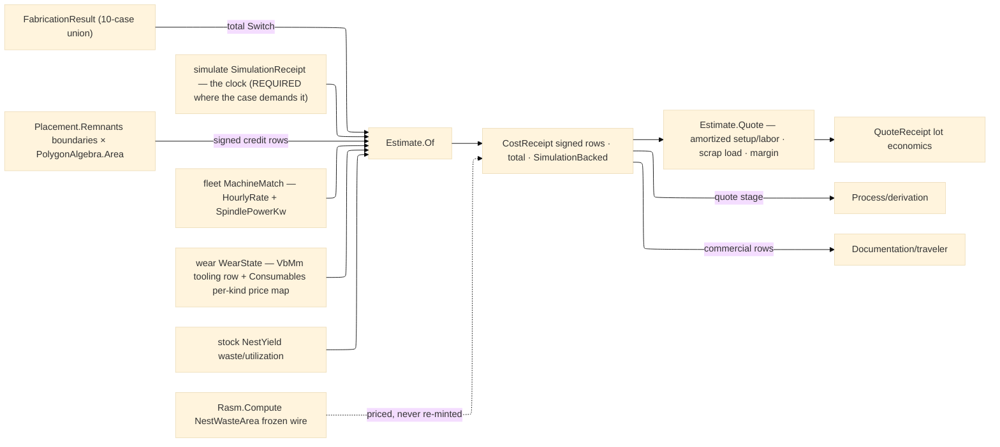

# [RASM_FABRICATION_ESTIMATION]

The cost-derivation owner: `Estimate.Of(FabricationResult, EstimateBasis) → Fin<CostReceipt>` — ONE polymorphic entry discriminating on the landed 10-case result union through the generated total `Switch`, projecting each result into typed `CostRow`s under one `CostKind` axis — and `Estimate.Quote(result, basis, quantity) → Fin<QuoteReceipt>`, the lot projection BESIDE the seam that amortizes setup and labor across quantity, loads the scrap rate, and applies the margin policy. Every priced quantity reads a LANDED receipt, never a page-local re-derivation: machine seconds are the `Verify/simulate#SIMULATE` `SimulationReceipt` — an arm whose case REQUIRES the clock (additive, verification, posted program) FAILS typed when the receipt is absent, never prices a silent zero; machine rates read `Kinematics/fleet#MACHINE_FLEET` `MachineMatch.Instance.HourlyRate` (the fleet instance IS the rate truth) and energy reads its `SpindlePowerKw` column against the basis energy tariff; material consumption reads the `Nesting/stock#NESTING_STOCK` `NestYield` aggregate columns; tooling depletion reads the `Tooling/wear#TOOL_WEAR` `WearState` — the flank-wear fraction `VbMm/VbLimitMm` prices the `tooling` row and the `Consumables` rows price per-kind through the basis price map with the scalar fallback; the remnant credit reads the `Placement.Remnants` usable boundaries through the one `PolygonAlgebra.Area` fold.

This page is RECEIPTS-ONLY: it mints no fault arm, routes kernel `GeometryFault.DegenerateInput` only where a result case is un-priceable by charter (a `HiddenLineResult`/`TravelerDocument` is documentation; a clock-requiring case without its simulation receipt has no time authority), and its `CostReceipt` is the evidence. The Compute seam stays recorded-only: cost rows are Fabrication-local receipts and the frozen `NestWasteArea` SI-m² wire the Compute rollup decodes is untouched — estimation PRICES what that wire already carries, never a second waste mint. The `FabricationPlan` arm prices per-step setup and labor honestly; the rated per-step machine forecast lands when `PlannedStep` carries a duration column — a `SetupSeconds` copy masquerading as rated machine time is the deleted fiction.

Wire posture: HOST-LOCAL. The `CostReceipt`/`QuoteReceipt` cross only the in-process seam — the derivation quote, the traveler's commercial rows; no cost row sits between wire and rail.

## [01]-[INDEX]

- [01]-[ESTIMATION]: owns the `CostKind` axis with its signed-row law, the `EstimateBasis` carried-receipt bundle (simulation/match/wear/yield + rate scalars + the consumable price map + labor/energy/rework tariffs), the `CostRow`/`CostReceipt`/`QuoteReceipt` evidence family, the ONE `Estimate.Of` projection — the total result-case fold pricing machine time, material, tooling, consumables, setup labor, energy, rework, and the remnant credit from landed receipts — and the `Estimate.Quote` lot fold above it.

## [02]-[ESTIMATION]

- Owner: `CostKind` `[SmartEnum<string>]` (`machine-time`/`material`/`tooling`/`consumable`/`setup`/`labor`/`energy`/`rework`/`remnant-credit`) carrying the `Credit` sign column — a credit row lands NEGATIVE through the axis law, never a call-site minus; `EstimateBasis` the carried-receipt bundle — `Option<SimulationReceipt>` (the authoritative clock), `Option<MachineMatch>` (the rate + spindle-power truth), `Option<WearState>` (tool + consumable depletion), `Option<NestYield>` (the stock-side material truth), plus `MaterialRatePerM2`/`FallbackRatePerHour`/`LaborRatePerHour`/`EnergyRatePerKwh`/`ConsumableCostPerLife`/`ConsumablePrices`/`ToolCostPerLife`/`VbLimitMm`/`ReworkRatePerCm3`/`RemnantCreditFactor`/`SetupSeconds`/`PerBendSeconds`/`PerProbeSeconds`/`ScrapRate`/`MarginFactor`; `CostRow` the typed line (`Kind`, locus, amount); `CostReceipt` the evidence (rows, total, machine seconds, `SimulationBacked` flag); `QuoteReceipt` the lot evidence (quantity, unit marginal, amortized setup, scrap-loaded unit price, margin-applied lot total); `Estimate` the static surface owning `Of` and `Quote`.
- Cases: the total result fold — `Motion` machine-time (simulation seconds else the flagged `Duration` fallback — the ONE case with a declared non-simulated basis) + tooling/consumable/energy rows; `Placement` material (`waste/(1−utilization)` sheet recovery when the yield rides, else the waste column alone) + remnant credit (usable boundary areas × rate × factor, negative); `AdditiveResult` machine-time DEMANDING the simulation receipt (layer counts never fake a clock) + material-by-yield; `VerificationResult` DEMANDING the receipt — the air-cut efficiency row plus `rework` rows pricing uncut/overcut volumes at the rework tariff (a scrapped-part cost signal, not a silent zero); `InspectionResult` setup-labor row + per-feature probe machine-time (`Features.Count × PerProbeSeconds` at the machine rate); `PostedProgram` machine-time DEMANDING the simulation receipt; `FabricationPlan` per-step setup-labor rows (the rated forecast deferred to the `PlannedStep` duration column); `FormedResult` per-bend handling seconds × rate + flat-pattern material area; `HiddenLineResult`/`TravelerDocument` un-priceable by charter → `DegenerateInput`. Nine `CostKind` rows; one signed-row law.
- Entry: `public static Fin<CostReceipt> Of(FabricationResult result, EstimateBasis basis)` — the ONE projection; `public static Fin<QuoteReceipt> Quote(FabricationResult result, EstimateBasis basis, int quantity)` — the lot fold composing `Of`, amortizing setup/labor rows over the quantity, loading `ScrapRate`, applying `MarginFactor`; `Fin<T>` routes only kernel `GeometryFault.DegenerateInput` (un-priceable case, absent required clock, non-positive quantity); NO fabrication fault arm mints or routes here — the receipts-only law.
- Auto: `Of` folds the result through the generated total `Switch`, each arm assembling its rows then `Total`ing under the signed-row law; the machine rate resolves `basis.Match.Map(m => m.Instance.HourlyRate)` else `FallbackRatePerHour`; the energy row prices `CutSeconds × SpindlePowerKw × EnergyRatePerKwh` when both receipts ride; the tooling row prices the wear receipt's `VbMm/VbLimitMm` life fraction × `ToolCostPerLife`; the consumable fold walks `WearState.Consumables` pricing each row's `Used/Limit` life fraction against `ConsumablePrices.Find(kind)` with the `ConsumableCostPerLife` scalar fallback — ONE signed application per row, never a two-pass amount mutation; the remnant credit walks `Placement.Remnants` boundaries through `PolygonAlgebra.Area`. `Process/derivation` prices its `FabricationPlan` through this fold at the quote stage; `Documentation/traveler` carries the commercial rows.
- Receipt: `CostReceipt` IS the typed evidence — the signed row ledger, the total, the seconds basis, and the `SimulationBacked` provenance flag; `QuoteReceipt` carries the lot economics over it; no generic cost ledger, no unpriced silent zero.
- Packages: `Verify/simulate#SIMULATE` (`SimulationReceipt` — the clock, composed), `Kinematics/fleet#MACHINE_FLEET` (`MachineMatch.Instance.HourlyRate`/`SpindlePowerKw` — the rate and power truth), `Tooling/wear#TOOL_WEAR` (`WearState.VbMm`/`ConsumableRow`), `Nesting/stock#NESTING_STOCK` (`NestYield` aggregates), `Process/owner#FABRICATION_OWNER` (the 10-case result union + `Loop`), `Geometry2D/algebra#POLYGON_ALGEBRA` (`Area` — the one area fold), `Rasm.Numerics` (`GeometryFault`), Thinktecture.Runtime.Extensions, LanguageExt.Core, BCL inbox; recorded seam: `Rasm.Compute` `NestWasteArea` frozen wire (priced, never re-minted).
- Growth: a new cost dimension is one `CostKind` row + one arm term; a per-machine energy profile is one `MachineInstance` column read here; scrap loading from enrolled `CapabilityHistory` displaces the `ScrapRate` scalar when the Spec seam threads it; the per-step rated forecast is one `PlannedStep` duration column read by the plan arm; a currency/locale concern is the consumer's presentation, never a receipt column; zero new surface.
- Boundary: `Estimate` is the ONE pricing fold and a per-case `MotionCost`/`NestCost` sibling family is the deleted form; the clock is simulate's receipt and a page-local time integral is the second-clock defect — an absence-tolerant `IfNone(0.0)` on a clock-requiring arm is the silent-zero defect; the rate is the fleet instance column and a page-local rate table is the deleted form; material truth is the stock yield receipt and a re-measured sheet area is the deleted form; the credit is a SIGNED `CostKind` row and a call-site negation is the named defect; setup prices at the LABOR rate — machine occupancy and human time are distinct tariffs; receipts-only — a fault arm minted here violates the registry law.

```csharp signature
// --- [RUNTIME_PRELUDE] ----------------------------------------------------------------------------------------------------------------------------
using LanguageExt;
using LanguageExt.Common;
using Rasm.Fabrication.Geometry2D;        // PolygonAlgebra.Area — the one area fold
using Rasm.Fabrication.Kinematics;        // MachineMatch — the rate + spindle-power truth
using Rasm.Fabrication.Nesting;           // NestYield · Remnant
using Rasm.Fabrication.Process;           // FabricationResult · Loop · GeometryFault routing
using Rasm.Fabrication.Tooling;           // WearState · ConsumableRow
using Rasm.Numerics;
using Thinktecture;
using static LanguageExt.Prelude;

namespace Rasm.Fabrication.Verify;

// --- [TYPES] --------------------------------------------------------------------------------------------------------------------------------------
// The signed-row law: Credit rows land negative through the axis, never a call-site minus.
[SmartEnum<string>]
public sealed partial class CostKind {
    public static readonly CostKind MachineTime = new("machine-time", credit: false);
    public static readonly CostKind Material = new("material", credit: false);
    public static readonly CostKind Tooling = new("tooling", credit: false);
    public static readonly CostKind Consumable = new("consumable", credit: false);
    public static readonly CostKind Setup = new("setup", credit: false);
    public static readonly CostKind Labor = new("labor", credit: false);
    public static readonly CostKind Energy = new("energy", credit: false);
    public static readonly CostKind Rework = new("rework", credit: false);
    public static readonly CostKind RemnantCredit = new("remnant-credit", credit: true);

    public bool Credit { get; }

    public double Signed(double amount) => Credit ? -Math.Abs(amount) : Math.Abs(amount);
}

// --- [MODELS] -------------------------------------------------------------------------------------------------------------------------------------
// Carried receipts + tariffs: every option is a LANDED sibling receipt, never a re-derivation; the consumable
// price map keys on the wear row kind with the scalar fallback.
public sealed record EstimateBasis(
    Option<SimulationReceipt> Simulation, Option<MachineMatch> Match, Option<WearState> Wear, Option<NestYield> Yield,
    double MaterialRatePerM2, double FallbackRatePerHour, double LaborRatePerHour, double EnergyRatePerKwh,
    double ConsumableCostPerLife, Map<string, double> ConsumablePrices, double ToolCostPerLife, double VbLimitMm,
    double ReworkRatePerCm3, double RemnantCreditFactor,
    double SetupSeconds, double PerBendSeconds, double PerProbeSeconds,
    double ScrapRate, double MarginFactor) {
    public static readonly EstimateBasis Quote = new(
        Simulation: None, Match: None, Wear: None, Yield: None,
        MaterialRatePerM2: 45.0, FallbackRatePerHour: 90.0, LaborRatePerHour: 55.0, EnergyRatePerKwh: 0.30,
        ConsumableCostPerLife: 25.0, ConsumablePrices: Map<string, double>(), ToolCostPerLife: 180.0, VbLimitMm: 0.3,
        ReworkRatePerCm3: 4.0, RemnantCreditFactor: 0.6,
        SetupSeconds: 900.0, PerBendSeconds: 12.0, PerProbeSeconds: 6.0,
        ScrapRate: 0.02, MarginFactor: 1.35);

    public double RatePerHour => Match.Map(static m => m.Instance.HourlyRate).IfNone(FallbackRatePerHour);
}

public readonly record struct CostRow(CostKind Kind, string Locus, double Amount);

public sealed record CostReceipt(Seq<CostRow> Rows, double Total, double MachineSeconds, bool SimulationBacked);

public sealed record QuoteReceipt(int Quantity, double UnitMarginal, double AmortizedSetup, double ScrapLoadedUnit, double LotTotal, CostReceipt Unit);

// --- [OPERATIONS] ---------------------------------------------------------------------------------------------------------------------------------
public static class Estimate {
    // The ONE pricing fold — total over the 10-case union; documentation cases are un-priceable by charter;
    // a clock-REQUIRING case (additive, verification, posted program) demands the authoritative simulate
    // receipt and FAILS typed on absence — a silent zero is the named defect. Motion alone declares its
    // Duration fallback, flagged on the receipt.
    public static Fin<CostReceipt> Of(FabricationResult result, EstimateBasis basis) =>
        result.Switch(
            state:            basis,
            hiddenLineResult: static (_, _) => Fin.Fail<CostReceipt>(GeometryFault.DegenerateInput("estimate:hidden-line").ToError()),
            motion:           static (b, m) => Fin.Succ(
                Assemble(b, Seconds(b, m.Duration), MachineRows(b, Seconds(b, m.Duration), "motion").Concat(ToolRows(b)).Concat(ConsumableRows(b)).Concat(EnergyRows(b)))),
            placement:        static (b, p) => Fin.Succ(Assemble(b, 0.0, MaterialRows(b).Concat(CreditRows(b, p.Remnants)))),
            additiveResult:   static (b, _) => Demand(b, "estimate:additive-without-simulation", s => Assemble(b, s.CycleSeconds,
                MachineRows(b, s.CycleSeconds, "additive").Concat(MaterialRows(b)).Concat(EnergyRows(b)))),
            verificationResult: static (b, v) => Demand(b, "estimate:verification-without-simulation", s => Assemble(b, s.CycleSeconds,
                Seq(new CostRow(CostKind.MachineTime, "air-cut", CostKind.MachineTime.Signed(s.CycleSeconds * v.AirCutRatio / 3600.0 * b.RatePerHour)))
                    .Concat(ReworkRows(b, v.UncutVolume, v.OvercutVolume)))),
            inspectionResult: static (b, i) => Fin.Succ(Assemble(b, i.Features.Count * b.PerProbeSeconds,
                Seq(SetupRow(b, "inspection"),
                    new CostRow(CostKind.MachineTime, "probing", CostKind.MachineTime.Signed(i.Features.Count * b.PerProbeSeconds / 3600.0 * b.RatePerHour))))),
            postedProgram:    static (b, _) => Demand(b, "estimate:program-without-simulation", s => Assemble(b, s.CycleSeconds,
                MachineRows(b, s.CycleSeconds, "program").Concat(ToolRows(b)).Concat(ConsumableRows(b)))),
            travelerDocument: static (_, _) => Fin.Fail<CostReceipt>(GeometryFault.DegenerateInput("estimate:traveler").ToError()),
            fabricationPlan:  static (b, plan) => Fin.Succ(Assemble(b, 0.0,
                plan.Steps.Map(step => SetupRow(b, $"step-{step.Order}:{step.Process.Key}")))),
            formedResult:     static (b, f) => Fin.Succ(Assemble(b, f.Bends.Count * b.PerBendSeconds,
                Seq(new CostRow(CostKind.MachineTime, "bends", CostKind.MachineTime.Signed(f.Bends.Count * b.PerBendSeconds / 3600.0 * b.RatePerHour)))
                    .Concat(FlatRows(b, f.FlatPattern)))));

    // The LOT projection beside the seam: setup/labor rows amortize across the quantity, the scrap rate loads
    // the unit price, and the margin factor prices the lot — quantity is genuine input, never a mode knob.
    public static Fin<QuoteReceipt> Quote(FabricationResult result, EstimateBasis basis, int quantity) =>
        quantity <= 0
            ? Fin.Fail<QuoteReceipt>(GeometryFault.DegenerateInput($"estimate:quantity-{quantity}").ToError())
            : Of(result, basis).Map(unit => {
                double fixedRows = unit.Rows.Filter(static r => r.Kind == CostKind.Setup || r.Kind == CostKind.Labor).Fold(0.0, static (t, r) => t + r.Amount);
                double marginal = unit.Total - fixedRows;
                double amortized = fixedRows / quantity;
                double scrapLoaded = (marginal + amortized) / Math.Max(1e-9, 1.0 - basis.ScrapRate);
                return new QuoteReceipt(quantity, marginal, amortized, scrapLoaded, scrapLoaded * quantity * basis.MarginFactor, unit);
            });

    static Fin<CostReceipt> Demand(EstimateBasis b, string locus, Func<SimulationReceipt, CostReceipt> price) =>
        b.Simulation.Match(
            Some: s => Fin.Succ(price(s)),
            None: () => Fin.Fail<CostReceipt>(GeometryFault.DegenerateInput(locus).ToError()));

    static double Seconds(EstimateBasis b, double declared) => b.Simulation.Map(static s => s.CycleSeconds).IfNone(declared);

    static Seq<CostRow> MachineRows(EstimateBasis b, double seconds, string locus) =>
        seconds <= 0.0 ? Seq<CostRow>() : Seq(new CostRow(CostKind.MachineTime, locus, CostKind.MachineTime.Signed(seconds / 3600.0 * b.RatePerHour)));

    // Tool depletion prices the wear receipt's flank-wear life fraction; the tooling axis has a real producer.
    static Seq<CostRow> ToolRows(EstimateBasis b) =>
        b.Wear.Filter(static w => w.VbMm > 0.0)
            .Map(w => new CostRow(CostKind.Tooling, "flank-wear", CostKind.Tooling.Signed(w.VbMm / Math.Max(1e-9, b.VbLimitMm) * b.ToolCostPerLife)))
            .ToSeq();

    // Consumable pricing walks the wear receipt's Used/Limit life fractions against the per-kind price map
    // with the scalar fallback — ONE signed application per row.
    static Seq<CostRow> ConsumableRows(EstimateBasis b) =>
        b.Wear.Map(static w => w.Consumables).IfNone(Seq<ConsumableRow>())
            .Filter(static c => c.Limit > 0.0)
            .Map(c => new CostRow(CostKind.Consumable, c.Kind.Key,
                CostKind.Consumable.Signed(c.Used / c.Limit * b.ConsumablePrices.Find(c.Kind.Key).IfNone(b.ConsumableCostPerLife))));

    // Energy prices cut seconds × the matched instance's spindle power × the tariff — both receipts must ride.
    static Seq<CostRow> EnergyRows(EstimateBasis b) =>
        b.Simulation.Bind(s => b.Match.Map(m => (s.CutSeconds, m.Instance.SpindlePowerKw)))
            .Filter(static x => x.CutSeconds > 0.0 && x.SpindlePowerKw > 0.0)
            .Map(x => new CostRow(CostKind.Energy, "spindle", CostKind.Energy.Signed(x.CutSeconds / 3600.0 * x.SpindlePowerKw * b.EnergyRatePerKwh)))
            .ToSeq();

    static Seq<CostRow> ReworkRows(EstimateBasis b, double uncutMm3, double overcutMm3) =>
        Seq((Locus: "uncut", Volume: uncutMm3), (Locus: "overcut", Volume: overcutMm3))
            .Filter(static r => r.Volume > 0.0)
            .Map(r => new CostRow(CostKind.Rework, r.Locus, CostKind.Rework.Signed(r.Volume / 1e3 * b.ReworkRatePerCm3)));

    // Consumed sheet area recovered from the yield receipt: waste/(1−utilization) — receipt-true, never re-measured.
    static Seq<CostRow> MaterialRows(EstimateBasis b) =>
        b.Yield.Match(
            Some: y => y.UtilizationRatio < 1.0
                ? Seq(new CostRow(CostKind.Material, "sheets",
                    CostKind.Material.Signed(y.WasteAreaMm2 / 1e6 / (1.0 - y.UtilizationRatio) * b.MaterialRatePerM2)))
                : Seq(new CostRow(CostKind.Material, "sheets", CostKind.Material.Signed(y.WasteAreaMm2 / 1e6 * b.MaterialRatePerM2))),
            None: () => Seq<CostRow>());

    static Seq<CostRow> CreditRows(EstimateBasis b, Seq<Remnant> remnants) =>
        remnants.Map(r => new CostRow(CostKind.RemnantCredit, "remnant",
            CostKind.RemnantCredit.Signed(Math.Abs(PolygonAlgebra.Area(r.Boundary)) / 1e6 * b.MaterialRatePerM2 * b.RemnantCreditFactor)));

    static Seq<CostRow> FlatRows(EstimateBasis b, Arr<Loop> flat) =>
        toSeq(flat).Map(l => new CostRow(CostKind.Material, "flat-pattern",
            CostKind.Material.Signed(Math.Abs(PolygonAlgebra.Area(l)) / 1e6 * b.MaterialRatePerM2)));

    // Setup is HUMAN time — the labor tariff, never the machine rate.
    static CostRow SetupRow(EstimateBasis b, string locus) => new(CostKind.Setup, locus, CostKind.Setup.Signed(b.SetupSeconds / 3600.0 * b.LaborRatePerHour));

    static CostReceipt Assemble(EstimateBasis b, double seconds, Seq<CostRow> rows) =>
        new(rows, rows.Fold(0.0, static (t, r) => t + r.Amount), seconds, SimulationBacked: b.Simulation.IsSome);
}
```


