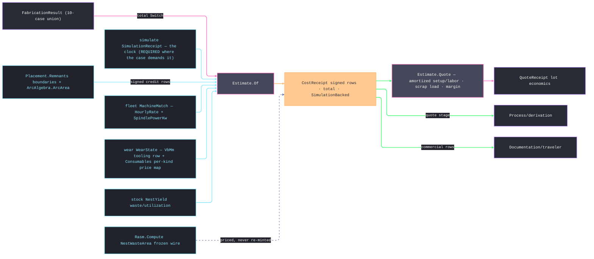

# [RASM_FABRICATION_ESTIMATION]

The cost-derivation owner: `Estimate.Of(FabricationResult, EstimateBasis) → Fin<CostReceipt>` and the lot projection `Estimate.Quote` price the ten-case result union from correlated evidence. `CostEvidence<T>` binds every simulation, machine, wear, stock, and additive receipt to the priced `ContentKey`; result-carried keys and all evidence keys must equal `EstimateBasis.Subject`. `StockConsumption` carries consumed area directly, so perfect utilization remains priceable; `AdditiveYield` carries part, support, purge, density, and recovery quantities under a per-kilogram tariff. Inspection and forming require explicit `OperationTime` evidence rather than reconstructing seconds from feature or bend counts.

This page is RECEIPTS-ONLY: it mints no fault arm, routes kernel `GeometryFault.DegenerateInput` only where a result case is un-priceable by charter (a `HiddenLineResult`/`TravelerDocument` is documentation; a clock-requiring case without its simulation receipt has no time authority), and its `CostReceipt` is the evidence. The Compute seam stays recorded-only: cost rows are Fabrication-local receipts and the frozen `NestWasteArea` SI-m² wire the Compute rollup decodes is untouched — estimation PRICES what that wire already carries, never a second waste mint. The `FabricationPlan` arm prices per-step setup at the labor tariff and a distinct labor row from each step's `OperationTime` evidence; the rated per-step machine forecast lands when `PlannedStep` carries a duration column — a `SetupSeconds` copy masquerading as rated machine time is the deleted fiction. The plan subject is the plan's own canonical key: `Artifacts` stay provenance, and evidence correlated to one output artifact can never authorize pricing the whole plan.

Wire posture: HOST-LOCAL. The `CostReceipt`/`QuoteReceipt` cross only the in-process seam — the derivation quote, the traveler's commercial rows; no cost row sits between wire and rail.

## [01]-[INDEX]

- [01]-[ESTIMATION]: owns the signed `CostKind` axis, the evidence-keyed `EstimateBasis`, the currency-stamped receipt family, the one total `Estimate.Of` projection over the result union, and the `Estimate.Quote` lot fold above it. The unit fold prices machine, material, tooling, consumable, labor, energy, rework, commercial, and remnant-credit evidence.

## [02]-[ESTIMATION]

- Owner: `CostKind` carries 18 signed dimensions: machine, material, tooling, consumable, setup, labor, energy, rework, scrap, quality, outside service, logistics, overhead, depreciation, tax, contingency, margin, and remnant credit. `EstimateBasis` carries subject and canonical `Rasm.Element.Currency`, content-keyed evidence, operation clocks, unit-correct material tariffs, consumable/tool/rework rates, commercial loads, and batch capacity. `CostRow` stamps currency on every line; `CostReceipt` carries the unit ledger; `QuoteReceipt` carries batch count plus typed amortized-setup, scrap-load, logistics, contingency, tax, and margin rows — every lot transformation is a signed adjustment row, never a bare scalar.
- Cases: motion may use its declared duration only when simulation is absent; additive, verification, and posted programs demand simulation; verification prices the full verified clock and separate rework volume; inspection and forming demand named `OperationTime` rows; placement consumes explicit sheet area and credits remnants; additive consumes recovered feedstock mass; flat-pattern material uses the signed contour-area sum so holes subtract. Tool and consumable depletion clamp to one life, while energy reads the same correlated simulation and machine evidence.
- Entry: `public static Fin<CostReceipt> Of(FabricationResult result, EstimateBasis basis)` — the ONE projection; `public static Fin<QuoteReceipt> Quote(FabricationResult result, EstimateBasis basis, int quantity)` — the lot fold composing `Of`, amortizing setup/labor rows over the quantity, loading `ScrapRate`, applying `MarginFactor`; `Fin<T>` routes only kernel `GeometryFault.DegenerateInput` (un-priceable case, absent required clock, non-positive quantity); NO fabrication fault arm mints or routes here — the receipts-only law.
- Auto: admission accumulates invalid tariffs, ratios, evidence subjects, operation clocks, stock area, and additive yield before dispatch. Each result-case arm passes explicit simulation provenance into `Assemble`; equal seconds never manufacture provenance. `Assemble` derives quality, outside-service, depreciation, and overhead rows from the unit ledger. `Quote` repeats fixed rows per `BatchCapacity`, amortizes them across quantity, loads scrap, logistics, contingency, tax, and margin, and carries each lot adjustment as a currency-stamped row.
- Receipt: `CostReceipt` IS the typed evidence — the signed row ledger, the total, the seconds basis, and the `SimulationBacked` provenance flag; `QuoteReceipt` carries the lot economics over it; no generic cost ledger, no unpriced silent zero.
- Packages: `Verify/simulate` (`SimulationReceipt`); `Kinematics/fleet` (`MachineMatch.Checks.Feasible`, `Instance.HourlyRate`, `SpindlePowerKw`); `Tooling/wear` (`WearState.VbMm`, `WearState.WearLimitMm`, `ConsumableRow`, `CriticalWear`); `Joining/sequence` (`WeldSchedule.TotalS` — the joining clock evidence); `Nesting/stock` (`NestYield` aggregates); `Process/owner` (the 10-case result union and `Loop`); `Geometry2D/arcs` (`ArcArea` — the bulge-true signed measure); `Rasm.Element` (`Currency`); `Rasm.Numerics` (`GeometryFault`); Thinktecture.Runtime.Extensions; LanguageExt.Core; BCL inbox; recorded seam: `Rasm.Compute` `NestWasteArea` frozen wire.
- Growth: a new cost dimension is one `CostKind` row + one arm term; a per-machine energy profile is one `MachineInstance` column read here; scrap loading from enrolled `CapabilityHistory` displaces the `ScrapRate` scalar when the Spec seam threads it; the per-step rated forecast is one `PlannedStep` duration column read by the plan arm; a currency/locale concern is the consumer's presentation, never a receipt column; zero new surface.
- Boundary: `Estimate` is the ONE pricing fold and a per-case `MotionCost`/`NestCost` sibling family is the deleted form; the clock is simulate's receipt and a page-local time integral is the second-clock defect — an absence-tolerant `IfNone(0.0)` on a clock-requiring arm is the silent-zero defect; the rate is the fleet instance column, only `Checks.Feasible` match evidence may carry it — infeasible match evidence fails admission typed while fleet retains the rejected rows — and a page-local rate table is the deleted form; the tool-life criterion is `WearState.WearLimitMm` — the receipt's own limit — and a pricing-local VB scalar beside it is the split-criterion defect; material truth is the stock yield receipt and a re-measured sheet area is the deleted form; the credit is a SIGNED `CostKind` row and a call-site negation is the named defect; setup prices at the LABOR rate — machine occupancy and human time are distinct tariffs; receipts-only — a fault arm minted here violates the registry law.

```csharp signature
// --- [RUNTIME_PRELUDE] ----------------------------------------------------------------------------------------------------------------------------
using LanguageExt;
using LanguageExt.Common;
using Rasm.Element.Composition;
using Rasm.Fabrication.Geometry2D;
using Rasm.Fabrication.Joining;
using Rasm.Fabrication.Kinematics;
using Rasm.Fabrication.Nesting;
using Rasm.Fabrication.Process;
using Rasm.Fabrication.Tooling;
using Rasm.Numerics;
using Thinktecture;
using static LanguageExt.Prelude;

namespace Rasm.Fabrication.Verify;

// --- [TYPES] --------------------------------------------------------------------------------------------------------------------------------------
// The signed-row law: Credit rows land negative through the axis, never a call-site minus.
[SmartEnum<string>]
public sealed partial class CostKind {
    public static readonly CostKind MachineTime = new("machine-time", credit: false);
    public static readonly CostKind Material = new("material", credit: false);
    public static readonly CostKind Tooling = new("tooling", credit: false);
    public static readonly CostKind Consumable = new("consumable", credit: false);
    public static readonly CostKind Setup = new("setup", credit: false);
    public static readonly CostKind Labor = new("labor", credit: false);
    public static readonly CostKind Energy = new("energy", credit: false);
    public static readonly CostKind Rework = new("rework", credit: false);
    public static readonly CostKind Scrap = new("scrap", credit: false);
    public static readonly CostKind Quality = new("quality", credit: false);
    public static readonly CostKind OutsideService = new("outside-service", credit: false);
    public static readonly CostKind Logistics = new("logistics", credit: false);
    public static readonly CostKind Overhead = new("overhead", credit: false);
    public static readonly CostKind Depreciation = new("depreciation", credit: false);
    public static readonly CostKind Tax = new("tax", credit: false);
    public static readonly CostKind Contingency = new("contingency", credit: false);
    public static readonly CostKind Margin = new("margin", credit: false);
    public static readonly CostKind RemnantCredit = new("remnant-credit", credit: true);

    public bool Credit { get; }

    public double Signed(double amount) => Credit ? -Math.Abs(amount) : Math.Abs(amount);
}

// --- [MODELS] -------------------------------------------------------------------------------------------------------------------------------------
// Carried receipts + tariffs: every option is a LANDED sibling receipt, never a re-derivation; the consumable
// price map keys on the wear row kind with the scalar fallback.
public readonly record struct CostEvidence<T>(ContentKey Subject, T Receipt);

public readonly record struct StockConsumption(NestYield Yield, double ConsumedAreaMm2);

public readonly record struct AdditiveYield(double PartVolumeMm3, double SupportVolumeMm3, double PurgeVolumeMm3, double DensityKgPerM3, double RecoveryFraction);

public readonly record struct OperationTime(string Locus, double MachineSeconds, double LaborSeconds);

public sealed record EstimateBasis(
    ContentKey Subject,
    Currency Currency,
    Option<CostEvidence<SimulationReceipt>> Simulation,
    Option<CostEvidence<MachineMatch>> Match,
    Option<CostEvidence<WearState>> Wear,
    Option<CostEvidence<StockConsumption>> Stock,
    Option<CostEvidence<AdditiveYield>> Additive,
    Option<CostEvidence<WeldSchedule>> Welding,
    Seq<OperationTime> OperationTimes,
    double MaterialRatePerM2, double AdditiveRatePerKg, double FallbackRatePerHour, double LaborRatePerHour, double EnergyRatePerKwh,
    double ConsumableCostPerLife, Map<string, double> ConsumablePrices, double ToolCostPerLife,
    double ReworkRatePerCm3, double RemnantCreditFactor,
    double SetupSeconds,
    double QualityPerUnit, double OutsideServicePerUnit, double LogisticsPerLot, double OverheadRate, double DepreciationPerHour,
    double TaxRate, double ContingencyRate, double ScrapRate, double MarginFactor, int BatchCapacity) {
    public static EstimateBasis For(ContentKey subject, Currency currency) => new(
        Subject: subject, Currency: currency, Simulation: None, Match: None, Wear: None, Stock: None, Additive: None, Welding: None, OperationTimes: Seq<OperationTime>(),
        MaterialRatePerM2: 45.0, AdditiveRatePerKg: 30.0, FallbackRatePerHour: 90.0, LaborRatePerHour: 55.0, EnergyRatePerKwh: 0.30,
        ConsumableCostPerLife: 25.0, ConsumablePrices: Map<string, double>(), ToolCostPerLife: 180.0,
        ReworkRatePerCm3: 4.0, RemnantCreditFactor: 0.6,
        SetupSeconds: 900.0, QualityPerUnit: 0.0, OutsideServicePerUnit: 0.0, LogisticsPerLot: 0.0,
        OverheadRate: 0.15, DepreciationPerHour: 0.0, TaxRate: 0.0, ContingencyRate: 0.05,
        ScrapRate: 0.02, MarginFactor: 1.35, BatchCapacity: 1);

    public double RatePerHour => Match.Map(static evidence => evidence.Receipt.Instance.HourlyRate).IfNone(FallbackRatePerHour);
}

public readonly record struct CostRow(CostKind Kind, string Locus, Currency Currency, double Amount);

public sealed record CostReceipt(ContentKey Subject, Currency Currency, Seq<CostRow> Rows, double Total, double MachineSeconds, bool SimulationBacked);

public sealed record QuoteReceipt(
    int Quantity,
    int Batches,
    double UnitMarginal,
    double AmortizedSetup,
    double ScrapLoadedUnit,
    double Logistics,
    double Tax,
    double Contingency,
    double LotTotal,
    Seq<CostRow> Adjustments,
    CostReceipt Unit);

// --- [OPERATIONS] ---------------------------------------------------------------------------------------------------------------------------------
public static class Estimate {
    // The ONE pricing fold — total over the 10-case union; documentation cases are un-priceable by charter;
    // a clock-REQUIRING case (additive, verification, posted program) demands the authoritative simulate
    // receipt and FAILS typed on absence — a silent zero is the named defect. Motion alone declares its
    // Duration fallback, flagged on the receipt.
    public static Fin<CostReceipt> Of(FabricationResult result, EstimateBasis basis) =>
        Admit(result, basis).Bind(_ => result.Switch(
            state:            basis,
            hiddenLineResult: static (_, _) => Fin.Fail<CostReceipt>(GeometryFault.DegenerateInput("estimate:hidden-line").ToError()),
            motion:           static (b, m) => Fin.Succ(
                Assemble(b, Seconds(b, m.Duration), MachineRows(b, Seconds(b, m.Duration), "motion").Concat(ToolRows(b)).Concat(ConsumableRows(b)).Concat(EnergyRows(b)), b.Simulation.IsSome)),
            placement:        static (b, p) => CreditRows(b, p.Remnants).Map(credits =>
                Assemble(b, 0.0, MaterialRows(b).Concat(credits), simulationBacked: false)),
            additiveResult:   static (b, _) => Demand(b, "estimate:additive-without-simulation", s => Assemble(b, s.CycleSeconds,
                MachineRows(b, s.CycleSeconds, "additive").Concat(AdditiveRows(b)).Concat(EnergyRows(b)), simulationBacked: true)),
            verificationResult: static (b, v) => Demand(b, "estimate:verification-without-simulation", s => Assemble(b, s.CycleSeconds,
                Seq(Row(b, CostKind.MachineTime, "verification", s.CycleSeconds / 3600.0 * b.RatePerHour))
                    .Concat(ReworkRows(b, v.UncutVolume, v.OvercutVolume)), simulationBacked: true)),
            inspectionResult: static (b, _) => OperationReceipt(b, "inspection"),
            postedProgram:    static (b, _) => Demand(b, "estimate:program-without-simulation", s => Assemble(b, s.CycleSeconds,
                MachineRows(b, s.CycleSeconds, "program").Concat(ToolRows(b)).Concat(ConsumableRows(b)), simulationBacked: true)),
            travelerDocument: static (_, _) => Fin.Fail<CostReceipt>(GeometryFault.DegenerateInput("estimate:traveler").ToError()),
            fabricationPlan:  static (b, plan) => Fin.Succ(Assemble(b, 0.0,
                plan.Steps.Bind(step => PlanStepRows(b, step)).Concat(WeldingRows(b)), simulationBacked: false)),
            formedResult:     static (b, f) => FlatRows(b, f.FlatPattern).Bind(rows => OperationReceipt(b, "forming", rows))));

    // Setup charges every step at the labor tariff; a step whose OperationTime evidence rides the basis ALSO
    // earns its distinct labor row — declared setup+labor coverage, never one setup row wearing both hats.
    private static Seq<CostRow> PlanStepRows(EstimateBasis b, PlannedStep step) {
        string locus = $"step-{step.Order}:{step.Process.Key}";
        return Seq1(SetupRow(b, locus)).Concat(
            b.OperationTimes.Find(time => string.Equals(time.Locus, locus, StringComparison.Ordinal))
                .Map(time => Seq1(Row(b, CostKind.Labor, locus, time.LaborSeconds / 3600.0 * b.LaborRatePerHour)))
                .IfNone(Seq<CostRow>()));
    }

    private static Fin<Unit> Admit(FabricationResult result, EstimateBasis basis) {
        Seq<Error> errors = Seq<Error>();
        Seq<double> nonnegative = Seq(
            basis.MaterialRatePerM2, basis.AdditiveRatePerKg, basis.FallbackRatePerHour, basis.LaborRatePerHour, basis.EnergyRatePerKwh,
            basis.ConsumableCostPerLife, basis.ToolCostPerLife, basis.ReworkRatePerCm3, basis.SetupSeconds,
            basis.QualityPerUnit, basis.OutsideServicePerUnit, basis.LogisticsPerLot, basis.OverheadRate,
            basis.DepreciationPerHour, basis.TaxRate, basis.ContingencyRate);
        if (basis.Subject.Kind is null || basis.Currency is null || nonnegative.Exists(static value => !double.IsFinite(value) || value < 0.0)
            || basis.ConsumablePrices.Exists(static row => !double.IsFinite(row.Value) || row.Value < 0.0))
            errors = errors.Add(GeometryFault.DegenerateInput("estimate:tariffs").ToError());
        if (!double.IsFinite(basis.RemnantCreditFactor) || basis.RemnantCreditFactor is < 0.0 or > 1.0
            || !double.IsFinite(basis.ScrapRate) || basis.ScrapRate is < 0.0 or >= 1.0
            || !double.IsFinite(basis.MarginFactor) || basis.MarginFactor < 1.0 || basis.BatchCapacity <= 0)
            errors = errors.Add(GeometryFault.DegenerateInput("estimate:policy").ToError());
        // Only Checks.Feasible evidence prices: fleet retains rejected pairs as evidence, and an infeasible
        // match riding the basis is an admission defect, never a silent fallback-rate downgrade.
        errors = errors.Concat(basis.Match
            .Filter(static match => !match.Receipt.Checks.Feasible)
            .Map(static _ => GeometryFault.DegenerateInput("estimate:match-infeasible").ToError()).ToSeq());
        Seq<ContentKey> resultSubjects = SubjectsOf(result);
        if (!resultSubjects.IsEmpty && !resultSubjects.Contains(basis.Subject))
            errors = errors.Add(GeometryFault.DegenerateInput("estimate:subject-result").ToError());
        Seq<ContentKey> evidence = basis.Simulation.Map(static row => row.Subject).ToSeq()
            + basis.Match.Map(static row => row.Subject).ToSeq()
            + basis.Wear.Map(static row => row.Subject).ToSeq()
            + basis.Stock.Map(static row => row.Subject).ToSeq()
            + basis.Additive.Map(static row => row.Subject).ToSeq();
        errors = errors.Concat(evidence.Filter(key => key != basis.Subject).Map(_ => GeometryFault.DegenerateInput("estimate:subject-evidence").ToError()));
        errors = errors.Concat(basis.OperationTimes
            .Filter(static time => !double.IsFinite(time.MachineSeconds) || !double.IsFinite(time.LaborSeconds)
                || time.MachineSeconds < 0.0 || time.LaborSeconds < 0.0 || string.IsNullOrWhiteSpace(time.Locus))
            .Map(time => GeometryFault.DegenerateInput($"estimate:operation-time:{time.Locus}").ToError()));
        if (basis.OperationTimes.Map(static time => time.Locus).Distinct().Count != basis.OperationTimes.Count)
            errors = errors.Add(GeometryFault.DegenerateInput("estimate:operation-time-duplicate").ToError());
        errors = errors.Concat(basis.Stock
            .Filter(static stock => !double.IsFinite(stock.Receipt.ConsumedAreaMm2) || stock.Receipt.ConsumedAreaMm2 < 0.0)
            .Map(static _ => GeometryFault.DegenerateInput("estimate:stock-consumption").ToError()).ToSeq());
        errors = errors.Concat(basis.Additive
            .Filter(static additive =>
                !Seq(additive.Receipt.PartVolumeMm3, additive.Receipt.SupportVolumeMm3, additive.Receipt.PurgeVolumeMm3,
                    additive.Receipt.DensityKgPerM3, additive.Receipt.RecoveryFraction).ForAll(double.IsFinite)
                || additive.Receipt.PartVolumeMm3 < 0.0 || additive.Receipt.SupportVolumeMm3 < 0.0
                || additive.Receipt.PurgeVolumeMm3 < 0.0 || additive.Receipt.DensityKgPerM3 <= 0.0
                || additive.Receipt.RecoveryFraction is <= 0.0 or > 1.0)
            .Map(static _ => GeometryFault.DegenerateInput("estimate:additive-yield").ToError()).ToSeq());
        return errors.Head.Match(
            Some: head => Fin.Fail<Unit>(errors.Tail.Fold(head, static (folded, error) => folded + error)),
            None: () => Fin.Succ(unit));
    }

    // CANONICAL PRIMARY KEYS only: composed and artifact keys are provenance — evidence correlated to one
    // output artifact can never authorize pricing a plan or traveler whose own identity does not match.
    private static Seq<ContentKey> SubjectsOf(FabricationResult result) =>
        result.Switch(
            hiddenLineResult: static _ => Seq<ContentKey>(),
            motion: static _ => Seq<ContentKey>(),
            placement: static value => Seq(value.Key),
            additiveResult: static value => value.Artifacts,
            verificationResult: static value => Seq(value.Residual.Key),
            inspectionResult: static _ => Seq<ContentKey>(),
            postedProgram: static value => Seq(value.Key),
            travelerDocument: static value => Seq(value.Key),
            fabricationPlan: static value => Seq(value.Key),
            formedResult: static value => Seq(value.Key));

    // The LOT projection beside the seam: setup/labor rows amortize across the quantity, the scrap rate loads
    // the unit price, and the margin factor prices the lot — quantity is genuine input, never a mode knob.
    public static Fin<QuoteReceipt> Quote(FabricationResult result, EstimateBasis basis, int quantity) =>
        quantity <= 0
            ? Fin.Fail<QuoteReceipt>(GeometryFault.DegenerateInput($"estimate:quantity-{quantity}").ToError())
            : Of(result, basis).Map(unit => {
                // Fixed rows carry their overhead share out of the marginal subtotal, so batch amortization
                // never re-prices fixed overhead per unit; every lot transformation lands as a typed row.
                double fixedRows = unit.Rows.Filter(static r => r.Kind == CostKind.Setup || r.Kind == CostKind.Labor).Fold(0.0, static (t, r) => t + r.Amount);
                double fixedOverhead = fixedRows * basis.OverheadRate;
                double marginal = unit.Total - fixedRows - fixedOverhead;
                int batches = (int)Math.Ceiling((double)quantity / basis.BatchCapacity);
                double amortized = (fixedRows + fixedOverhead) * batches / quantity;
                double scrapLoaded = (marginal + amortized) / Math.Max(1e-9, 1.0 - basis.ScrapRate);
                double subtotal = scrapLoaded * quantity + basis.LogisticsPerLot;
                double contingency = subtotal * basis.ContingencyRate;
                double tax = (subtotal + contingency) * basis.TaxRate;
                double preMargin = subtotal + contingency + tax;
                double margin = preMargin * (basis.MarginFactor - 1.0);
                Seq<CostRow> adjustments = Seq(
                    Row(basis, CostKind.Setup, "lot-amortized-setup", amortized * quantity),
                    Row(basis, CostKind.Scrap, "lot-scrap-load", (scrapLoaded - marginal - amortized) * quantity),
                    Row(basis, CostKind.Logistics, "lot-logistics", basis.LogisticsPerLot),
                    Row(basis, CostKind.Contingency, "lot-contingency", contingency),
                    Row(basis, CostKind.Tax, "lot-tax", tax),
                    Row(basis, CostKind.Margin, "lot-margin", margin));
                return new QuoteReceipt(
                    quantity, batches, marginal, amortized, scrapLoaded, basis.LogisticsPerLot, tax, contingency,
                    preMargin + margin, adjustments, unit);
            });

    private static Fin<CostReceipt> OperationReceipt(EstimateBasis basis, string locus) =>
        OperationReceipt(basis, locus, Seq<CostRow>());

    private static Fin<CostReceipt> OperationReceipt(EstimateBasis basis, string locus, Seq<CostRow> rows) =>
        basis.OperationTimes.Find(time => string.Equals(time.Locus, locus, StringComparison.Ordinal)).Match(
            Some: time => Fin.Succ(Assemble(
                basis,
                time.MachineSeconds,
                rows
                    .Add(SetupRow(basis, locus))
                    .Add(Row(basis, CostKind.MachineTime, locus, time.MachineSeconds / 3600.0 * basis.RatePerHour))
                    .Add(Row(basis, CostKind.Labor, locus, time.LaborSeconds / 3600.0 * basis.LaborRatePerHour)),
                simulationBacked: false)),
            None: () => Fin.Fail<CostReceipt>(GeometryFault.DegenerateInput($"estimate:operation-time:{locus}").ToError()));

    private static Fin<CostReceipt> Demand(EstimateBasis b, string locus, Func<SimulationReceipt, CostReceipt> price) =>
        b.Simulation.Match(
            Some: s => Fin.Succ(price(s.Receipt)),
            None: () => Fin.Fail<CostReceipt>(GeometryFault.DegenerateInput(locus).ToError()));

    private static double Seconds(EstimateBasis b, double declared) => b.Simulation.Map(static evidence => evidence.Receipt.CycleSeconds).IfNone(declared);

    private static Seq<CostRow> MachineRows(EstimateBasis b, double seconds, string locus) =>
        seconds <= 0.0 ? Seq<CostRow>() : Seq(Row(b, CostKind.MachineTime, locus, seconds / 3600.0 * b.RatePerHour));

    // Tool depletion prices the wear receipt's TIGHTEST criterion — the CriticalWear body-or-edge row when the
    // receipt carries one, else the body VB fraction — so magazine capacity and priced depletion apply one life
    // criterion to the same evidence and an exhausted insert edge is never hidden behind a healthy body.
    private static Seq<CostRow> ToolRows(EstimateBasis b) =>
        b.Wear.Bind(evidence => evidence.Receipt.Critical.Match(
                Some: critical => Some(critical.Switch(
                    body: static c => (Locus: $"critical:{c.Row.Kind.Key}", Fraction: Math.Clamp(c.Row.Used / Math.Max(1e-9, c.Row.Limit), 0.0, 1.0)),
                    edge: static c => (Locus: $"critical:edge:{c.Row.Indices}", Fraction: Math.Clamp(c.Row.Used / Math.Max(1e-9, c.Row.Limit), 0.0, 1.0)))),
                None: () => evidence.Receipt.VbMm > 0.0 && evidence.Receipt.WearLimitMm > 0.0
                    ? Some((Locus: "flank-wear", Fraction: Math.Min(1.0, evidence.Receipt.VbMm / evidence.Receipt.WearLimitMm)))
                    : None))
            .Map(row => Row(b, CostKind.Tooling, row.Locus, row.Fraction * b.ToolCostPerLife))
            .ToSeq();

    // Joining cycle time is the sequence owner's receipt — TotalS already carries arc seconds, interpass waits,
    // tack windows, and charged re-preheat, so pricing reads the receipt clock at machine and labor tariffs and
    // never re-sums the per-row AtS ledger it validates against.
    private static Seq<CostRow> WeldingRows(EstimateBasis b) =>
        b.Welding.Filter(static evidence => evidence.Receipt.TotalS > 0.0)
            .Map(evidence => Seq(
                Row(b, CostKind.MachineTime, "welding", evidence.Receipt.TotalS / 3600.0 * b.RatePerHour),
                Row(b, CostKind.Labor, "welding", evidence.Receipt.TotalS / 3600.0 * b.LaborRatePerHour)))
            .IfNone(Seq<CostRow>());

    // Consumable pricing walks the wear receipt's Used/Limit life fractions against the per-kind price map
    // with the scalar fallback — ONE signed application per row.
    private static Seq<CostRow> ConsumableRows(EstimateBasis b) =>
        b.Wear.Map(static evidence => evidence.Receipt.Consumables).IfNone(Seq<ConsumableRow>())
            .Filter(static c => c.Limit > 0.0)
            .Map(c => Row(b, CostKind.Consumable, c.Kind.Key,
                Math.Clamp(c.Used / c.Limit, 0.0, 1.0) * b.ConsumablePrices.Find(c.Kind.Key).IfNone(b.ConsumableCostPerLife)));

    // Energy prices cut seconds × the matched instance's spindle power × the tariff — both receipts must ride.
    private static Seq<CostRow> EnergyRows(EstimateBasis b) =>
        b.Simulation.Bind(s => b.Match.Map(m => (s.Receipt.CutSeconds, m.Receipt.Instance.SpindlePowerKw)))
            .Filter(static x => x.CutSeconds > 0.0 && x.SpindlePowerKw > 0.0)
            .Map(x => Row(b, CostKind.Energy, "spindle", x.CutSeconds / 3600.0 * x.SpindlePowerKw * b.EnergyRatePerKwh))
            .ToSeq();

    private static Seq<CostRow> ReworkRows(EstimateBasis b, double uncutMm3, double overcutMm3) =>
        Seq((Locus: "uncut", Volume: uncutMm3), (Locus: "overcut", Volume: overcutMm3))
            .Filter(static r => r.Volume > 0.0)
            .Map(r => Row(b, CostKind.Rework, r.Locus, r.Volume / 1e3 * b.ReworkRatePerCm3));

    // The stock receipt carries consumed area explicitly, so perfect utilization remains priceable.
    private static Seq<CostRow> MaterialRows(EstimateBasis b) =>
        b.Stock.Match(
            Some: evidence => Seq(Row(b, CostKind.Material, "sheets", evidence.Receipt.ConsumedAreaMm2 / 1e6 * b.MaterialRatePerM2)),
            None: () => Seq<CostRow>());

    private static Seq<CostRow> AdditiveRows(EstimateBasis basis) =>
        basis.Additive.Map(evidence => {
            AdditiveYield additiveYield = evidence.Receipt;
            double netMm3 = additiveYield.PartVolumeMm3 + additiveYield.SupportVolumeMm3 + additiveYield.PurgeVolumeMm3;
            double chargedMm3 = netMm3 / additiveYield.RecoveryFraction;
            return Row(basis, CostKind.Material, "additive-feedstock", chargedMm3 / 1e9 * additiveYield.DensityKgPerM3 * basis.AdditiveRatePerKg);
        }).ToSeq();

    // Remnant and flat-pattern loops are bulge-capable: the arc-aware signed measure ArcArea prices curved
    // material on the Fin rail — a line-only area owner rejects valid bulged boundaries, and the geometry
    // failure propagates typed instead of erasing into a scalar. Hole winding stays subtractive in the sum.
    private static Fin<Seq<CostRow>> CreditRows(EstimateBasis b, Seq<Remnant> remnants) =>
        remnants
            .TraverseM(r => ArcAlgebra.ArcArea(r.Boundary)
                .Map(area => Row(b, CostKind.RemnantCredit, "remnant", Math.Abs(area) / 1e6 * b.MaterialRatePerM2 * b.RemnantCreditFactor)))
            .As();

    private static Fin<Seq<CostRow>> FlatRows(EstimateBasis b, Arr<Loop> flat) =>
        toSeq(flat).TraverseM(ArcAlgebra.ArcArea).As()
            .Map(areas => Seq(Row(b, CostKind.Material, "flat-pattern", Math.Abs(areas.Sum()) / 1e6 * b.MaterialRatePerM2)));

    // Setup is HUMAN time — the labor tariff, never the machine rate.
    private static CostRow SetupRow(EstimateBasis b, string locus) => Row(b, CostKind.Setup, locus, b.SetupSeconds / 3600.0 * b.LaborRatePerHour);

    private static CostReceipt Assemble(EstimateBasis b, double seconds, Seq<CostRow> rows, bool simulationBacked) {
        double direct = rows.Filter(static row => !row.Kind.Credit).Sum(static row => row.Amount);
        Seq<CostRow> commercial = Seq(
            Row(b, CostKind.Quality, "quality", b.QualityPerUnit),
            Row(b, CostKind.OutsideService, "outside-service", b.OutsideServicePerUnit),
            Row(b, CostKind.Depreciation, "machine-depreciation", seconds / 3600.0 * b.DepreciationPerHour),
            Row(b, CostKind.Overhead, "overhead", direct * b.OverheadRate));
        Seq<CostRow> ledger = rows.Concat(commercial.Filter(static row => Math.Abs(row.Amount) > 1e-12));
        return new CostReceipt(b.Subject, b.Currency, ledger, ledger.Sum(static row => row.Amount), seconds, simulationBacked);
    }

    private static CostRow Row(EstimateBasis basis, CostKind kind, string locus, double amount) =>
        new(kind, locus, basis.Currency, kind.Signed(amount));
}
```


