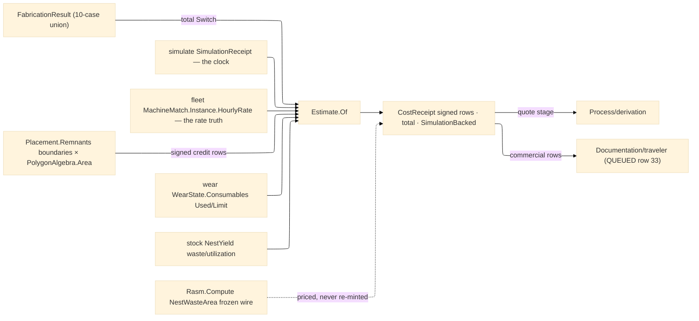

# [RASM_FABRICATION_ESTIMATION]

The cost-derivation owner: `Estimate.Of(FabricationResult, EstimateBasis) → Fin<CostReceipt>` — ONE polymorphic entry discriminating on the landed 10-case result union through the generated total `Switch`, projecting each result into typed `CostRow`s under one `CostKind` axis. Every priced quantity reads a LANDED receipt, never a page-local re-derivation: machine seconds are the `Verify/simulate#SIMULATE` `SimulationReceipt` (the authoritative clock — a `Motion.Duration` prices only as the declared non-simulated fallback, flagged on the receipt); machine rates read `Kinematics/fleet#MACHINE_FLEET` `MachineMatch.Instance.HourlyRate` (a page-local rate table is the deleted form — the fleet instance IS the rate truth); material consumption reads the `Nesting/stock#NESTING_STOCK` `NestYield` aggregate columns (`WasteAreaMm2`/`UtilizationRatio` — the consumed-sheet area recovered as `waste/(1−utilization)`, a receipt-true projection); tooling depletion reads the `Tooling/wear#TOOL_WEAR` `WearState.Consumables` rows (per-consumable `Used/Limit` fractions); the remnant credit reads the `Placement.Remnants` usable boundaries through the one `PolygonAlgebra.Area` fold, discounted by the basis factor — the reuse economics `Nesting/remnant#REMNANT_LIFECYCLE` stocking realizes.

This page is RECEIPTS-ONLY: it mints no fault arm (the Verify tier-3 arms are simulate's), routes kernel `GeometryFault.DegenerateInput` only where a result case is un-priceable by charter (a `HiddenLineResult`/`TravelerDocument` is documentation, not execution; a `PostedProgram` without a simulation receipt has no authoritative clock), and its `CostReceipt` is the evidence. The Compute seam stays recorded-only: cost rows are Fabrication-local receipts and the frozen `NestWasteArea` SI-m² wire the Compute rollup decodes is untouched — estimation PRICES what that wire already carries, never a second waste mint. The `FabricationPlan` arm prices the derivation forecast (per-step setup + rated machine time), closing the quote loop `Process/derivation` opens.

Wire posture: HOST-LOCAL. The `CostReceipt` crosses only the in-process seam — the derivation quote, the traveler's commercial rows (QUEUED row 33); no cost row sits between wire and rail.

## [01]-[INDEX]

- [01]-[ESTIMATION]: owns the `CostKind` axis with its signed-row law, the `EstimateBasis` carried-receipt bundle (simulation/match/wear/yield + the four rate scalars), the `CostRow`/`CostReceipt` evidence family, and the ONE `Estimate.Of` projection — the total result-case fold pricing machine time, material, tooling, consumables, setup, and the remnant credit from landed receipts.

## [02]-[ESTIMATION]

- Owner: `CostKind` `[SmartEnum<string>]` (`machine-time`/`material`/`tooling`/`consumable`/`setup`/`remnant-credit`) carrying the `Credit` sign column — a credit row lands NEGATIVE through the axis law, never a call-site minus; `EstimateBasis` the carried-receipt bundle — `Option<SimulationReceipt>` (the authoritative clock), `Option<MachineMatch>` (the rate truth), `Option<WearState>` (consumable depletion), `Option<NestYield>` (the stock-side material truth), plus `MaterialRatePerM2`/`FallbackRatePerHour`/`ConsumableCostPerLife`/`RemnantCreditFactor`/`SetupSeconds`/`PerBendSeconds`; `CostRow` the typed line (`Kind`, locus, amount); `CostReceipt` the evidence (rows, total, machine seconds, `SimulationBacked` flag); `Estimate` the static surface owning `Of`.
- Cases: the total result fold — `Motion` machine-time (simulation seconds else the flagged `Duration` fallback) + tooling/consumable rows; `Placement` material (`waste/(1−utilization)` sheet recovery when the yield rides, else the waste column alone) + remnant credit (usable boundary areas × rate × factor, negative) ; `AdditiveResult` machine-time (simulation-only — layer counts never fake a clock) + material-by-yield when present; `VerificationResult` the air-cut efficiency row (the `AirCutRatio` share of simulated seconds — waste made visible, not double-billed); `InspectionResult` setup row only; `PostedProgram` machine-time DEMANDING the simulation receipt; `FabricationPlan` per-step setup + rated forecast rows; `FormedResult` per-bend handling seconds × rate + flat-pattern material area; `HiddenLineResult`/`TravelerDocument` un-priceable by charter → `DegenerateInput`. Six `CostKind` rows; one signed-row law.
- Entry: `public static Fin<CostReceipt> Of(FabricationResult result, EstimateBasis basis)` — the ONE projection; `Fin<T>` routes only kernel `GeometryFault.DegenerateInput` (un-priceable case, or a `PostedProgram` with no simulation basis); NO fabrication fault arm mints or routes here — the receipts-only law.
- Auto: `Of` folds the result through the generated total `Switch`, each arm assembling its rows then `Total`ing under the signed-row law; the machine rate resolves `basis.Match.Map(m => m.Instance.HourlyRate)` else `FallbackRatePerHour`; seconds resolve `basis.Simulation.Map(s => s.CycleSeconds)` else the case's own declared duration (flagged `SimulationBacked: false`); the consumable fold walks `WearState.Consumables` pricing each row's `Used/Limit` life fraction; the remnant credit walks `Placement.Remnants` boundaries through `PolygonAlgebra.Area`. `Process/derivation` prices its `FabricationPlan` through this fold at the quote stage; `Documentation/traveler` (QUEUED row 33) carries the commercial rows.
- Receipt: `CostReceipt` IS the typed evidence — the signed row ledger, the total, the seconds basis, and the `SimulationBacked` provenance flag; no generic cost ledger, no unpriced silent zero.
- Packages: `Verify/simulate#SIMULATE` (`SimulationReceipt` — the clock, composed), `Kinematics/fleet#MACHINE_FLEET` (`MachineMatch.Instance.HourlyRate` — the rate truth), `Tooling/wear#TOOL_WEAR` (`WearState`/`ConsumableRow`), `Nesting/stock#NESTING_STOCK` (`NestYield` aggregates), `Process/owner#FABRICATION_OWNER` (the 10-case result union + `Loop`), `Geometry2D/algebra#POLYGON_ALGEBRA` (`Area` — the one area fold), `Rasm.Numerics` (`GeometryFault`), Thinktecture.Runtime.Extensions, LanguageExt.Core, BCL inbox; recorded seam: `Rasm.Compute` `NestWasteArea` frozen wire (priced, never re-minted).
- Growth: a new cost dimension is one `CostKind` row + one arm term; per-consumable price tables are one `Map<Consumable, double>` basis column displacing the single-scalar seed; a currency/locale concern is the consumer's presentation, never a receipt column; energy pricing is one row off the simulate spindle-load overlay when it lands; zero new surface.
- Boundary: `Estimate` is the ONE pricing fold and a per-case `MotionCost`/`NestCost` sibling family is the deleted form; the clock is simulate's receipt and a page-local time integral is the second-clock defect; the rate is the fleet instance column and a page-local rate table is the deleted form (the explicit fleet ruling); material truth is the stock yield receipt and a re-measured sheet area is the deleted form; the credit is a SIGNED `CostKind` row and a call-site negation is the named defect; receipts-only — a fault arm minted here violates the registry law.

```csharp signature
// --- [RUNTIME_PRELUDE] ----------------------------------------------------------------------------------------------------------------------------
using LanguageExt;
using LanguageExt.Common;
using Rasm.Fabrication.Geometry2D;        // PolygonAlgebra.Area — the one area fold
using Rasm.Fabrication.Kinematics;        // MachineMatch — the rate truth
using Rasm.Fabrication.Nesting;           // NestYield · Remnant
using Rasm.Fabrication.Process;           // FabricationResult · Loop · GeometryFault routing
using Rasm.Fabrication.Tooling;           // WearState · ConsumableRow
using Rasm.Numerics;
using Thinktecture;
using static LanguageExt.Prelude;

namespace Rasm.Fabrication.Verify;

// --- [TYPES] --------------------------------------------------------------------------------------------------------------------------------------
// The signed-row law: Credit rows land negative through the axis, never a call-site minus.
[SmartEnum<string>]
public sealed partial class CostKind {
    public static readonly CostKind MachineTime = new("machine-time", credit: false);
    public static readonly CostKind Material = new("material", credit: false);
    public static readonly CostKind Tooling = new("tooling", credit: false);
    public static readonly CostKind Consumable = new("consumable", credit: false);
    public static readonly CostKind Setup = new("setup", credit: false);
    public static readonly CostKind RemnantCredit = new("remnant-credit", credit: true);

    public bool Credit { get; }

    public double Signed(double amount) => Credit ? -Math.Abs(amount) : Math.Abs(amount);
}

// --- [MODELS] -------------------------------------------------------------------------------------------------------------------------------------
// Carried receipts + rate scalars: every option is a LANDED sibling receipt, never a re-derivation.
public sealed record EstimateBasis(
    Option<SimulationReceipt> Simulation, Option<MachineMatch> Match, Option<WearState> Wear, Option<NestYield> Yield,
    double MaterialRatePerM2, double FallbackRatePerHour, double ConsumableCostPerLife, double RemnantCreditFactor,
    double SetupSeconds, double PerBendSeconds) {
    public static readonly EstimateBasis Quote = new(
        Simulation: None, Match: None, Wear: None, Yield: None,
        MaterialRatePerM2: 45.0, FallbackRatePerHour: 90.0, ConsumableCostPerLife: 25.0, RemnantCreditFactor: 0.6,
        SetupSeconds: 900.0, PerBendSeconds: 12.0);

    public double RatePerHour => Match.Map(static m => m.Instance.HourlyRate).IfNone(FallbackRatePerHour);
}

public readonly record struct CostRow(CostKind Kind, string Locus, double Amount);

public sealed record CostReceipt(Seq<CostRow> Rows, double Total, double MachineSeconds, bool SimulationBacked);

// --- [OPERATIONS] ---------------------------------------------------------------------------------------------------------------------------------
public static class Estimate {
    // The ONE pricing fold — total over the 10-case union; documentation cases are un-priceable by
    // charter; a PostedProgram demands the authoritative simulate clock, never a re-parsed integral.
    public static Fin<CostReceipt> Of(FabricationResult result, EstimateBasis basis) =>
        result.Switch(
            state:            basis,
            hiddenLineResult: static (_, _) => Fin.Fail<CostReceipt>(GeometryFault.DegenerateInput("estimate:hidden-line").ToError()),
            motion:           static (b, m) => Fin.Succ(
                Assemble(b, Seconds(b, m.Duration), MachineRows(b, Seconds(b, m.Duration), "motion").Concat(ToolingRows(b)))),
            placement:        static (b, p) => Fin.Succ(Assemble(b, 0.0, MaterialRows(b).Concat(CreditRows(b, p.Remnants)))),
            additiveResult:   static (b, _) => Fin.Succ(Assemble(b, SimSeconds(b), MachineRows(b, SimSeconds(b), "additive").Concat(MaterialRows(b)))),
            verificationResult: static (b, v) => Fin.Succ(Assemble(b, SimSeconds(b),
                Seq(new CostRow(CostKind.MachineTime, "air-cut", CostKind.MachineTime.Signed(SimSeconds(b) * v.AirCutRatio / 3600.0 * b.RatePerHour))))),
            inspectionResult: static (b, _) => Fin.Succ(Assemble(b, 0.0, Seq(SetupRow(b, "inspection")))),
            postedProgram:    static (b, _) => b.Simulation.Match(
                Some: s => Fin.Succ(Assemble(b, s.CycleSeconds, MachineRows(b, s.CycleSeconds, "program").Concat(ToolingRows(b)))),
                None: () => Fin.Fail<CostReceipt>(GeometryFault.DegenerateInput("estimate:program-without-simulation").ToError())),
            travelerDocument: static (_, _) => Fin.Fail<CostReceipt>(GeometryFault.DegenerateInput("estimate:traveler").ToError()),
            fabricationPlan:  static (b, plan) => Fin.Succ(Assemble(b, 0.0,
                plan.Steps.Bind(step => Seq(SetupRow(b, $"step-{step.Order}"),
                    new CostRow(CostKind.MachineTime, $"step-{step.Order}:{step.Process.Key}",
                        CostKind.MachineTime.Signed(b.SetupSeconds / 3600.0 * b.RatePerHour)))))),
            formedResult:     static (b, f) => Fin.Succ(Assemble(b, f.Bends.Count * b.PerBendSeconds,
                Seq(new CostRow(CostKind.MachineTime, "bends", CostKind.MachineTime.Signed(f.Bends.Count * b.PerBendSeconds / 3600.0 * b.RatePerHour)))
                    .Concat(FlatRows(b, f.FlatPattern)))));

    static double SimSeconds(EstimateBasis b) => b.Simulation.Map(static s => s.CycleSeconds).IfNone(0.0);

    static double Seconds(EstimateBasis b, double declared) => b.Simulation.Map(static s => s.CycleSeconds).IfNone(declared);

    static Seq<CostRow> MachineRows(EstimateBasis b, double seconds, string locus) =>
        seconds <= 0.0 ? Seq<CostRow>() : Seq(new CostRow(CostKind.MachineTime, locus, CostKind.MachineTime.Signed(seconds / 3600.0 * b.RatePerHour)));

    // Consumable pricing walks the wear receipt's Used/Limit life fractions — one scalar seed per life,
    // the per-kind price table the recorded growth column.
    static Seq<CostRow> ToolingRows(EstimateBasis b) =>
        b.Wear.Map(static w => w.Consumables).IfNone(Seq<ConsumableRow>())
            .Filter(static c => c.Limit > 0.0)
            .Map(c => new CostRow(CostKind.Consumable, c.Kind.Key, CostKind.Consumable.Signed(c.Used / c.Limit * 1.0)))
            .Map(r => r with { Amount = r.Amount * b.ConsumableCostPerLife });

    // Consumed sheet area recovered from the yield receipt: waste/(1−utilization) — receipt-true, never re-measured.
    static Seq<CostRow> MaterialRows(EstimateBasis b) =>
        b.Yield.Match(
            Some: y => y.UtilizationRatio < 1.0
                ? Seq(new CostRow(CostKind.Material, "sheets",
                    CostKind.Material.Signed(y.WasteAreaMm2 / 1e6 / (1.0 - y.UtilizationRatio) * b.MaterialRatePerM2)))
                : Seq(new CostRow(CostKind.Material, "sheets", CostKind.Material.Signed(y.WasteAreaMm2 / 1e6 * b.MaterialRatePerM2))),
            None: () => Seq<CostRow>());

    static Seq<CostRow> CreditRows(EstimateBasis b, Seq<Remnant> remnants) =>
        remnants.Map(r => new CostRow(CostKind.RemnantCredit, "remnant",
            CostKind.RemnantCredit.Signed(Math.Abs(PolygonAlgebra.Area(r.Boundary)) / 1e6 * b.MaterialRatePerM2 * b.RemnantCreditFactor)));

    static Seq<CostRow> FlatRows(EstimateBasis b, Arr<Loop> flat) =>
        toSeq(flat).Map(l => new CostRow(CostKind.Material, "flat-pattern",
            CostKind.Material.Signed(Math.Abs(PolygonAlgebra.Area(l)) / 1e6 * b.MaterialRatePerM2)));

    static CostRow SetupRow(EstimateBasis b, string locus) => new(CostKind.Setup, locus, CostKind.Setup.Signed(b.SetupSeconds / 3600.0 * b.RatePerHour));

    static CostReceipt Assemble(EstimateBasis b, double seconds, Seq<CostRow> rows) =>
        new(rows, rows.Fold(0.0, static (t, r) => t + r.Amount), seconds, SimulationBacked: b.Simulation.IsSome);
}
```


