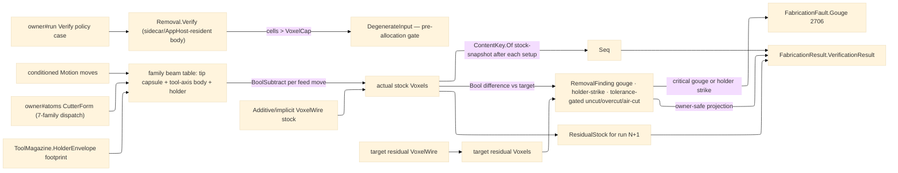

# [RASM_FABRICATION_REMOVAL]

The removal verifier is the program-level verify-time material truth plane for `Run(Verify)`: it starts from the content-keyed stock `VoxelWire`, subtracts the accumulated swept-tool volume from the actual stock state, compares that state against the target residual stock, and returns only owner#atoms-safe evidence through `FabricationResult.VerificationResult`. Guard remains the per-move design-time floor before Cam commits a feed; removal runs after the program exists and owns the verified stock truth, per-setup `StockSnapshot` chain, gouge fault routing, tolerance-gated uncut/overcut/air-cut receipts, and holder-strike detection. HOST POSTURE: PicoGK is the sidecar/AppHost-resident native kernel — this verifier's body EXECUTES in that host process behind the `Additive/implicit` `VoxelWire` seam (the one admitted crossing), and only the `VerificationResult` atoms cross back; a `Voxels`, `Lattice`, or PicoGK `Mesh` handle in a Rhino-plugin-loadable signature is the ALC firebreak violation. The swept cutter is FAMILY-TRUE: each `CutterFamily` row declares its own beam profile — a flat endmill sweeps flat-capped, a ball round-capped, a taper two-radius, a bull corner-stepped — and the holder footprint sweeps above the flute so deep-cavity holder strikes surface as typed findings, never phantom scallops from a one-capsule fiction.

## [01]-[INDEX]

- [01]-[REMOVAL]: owns `VerifyPolicy`, `SweepSampling`, `GougeTolerance`, `SetupWindow`, `RemovalFinding`, `RemovalMetrics`, `RemovalRun`, `RemovalCanonical`, and the one `Removal.Verify(VerifyPolicy, FabricationInput)` entry that subtracts family-true PicoGK swept-tool voxels from the actual stock state and returns `FabricationResult.VerificationResult`.

## [02]-[REMOVAL]

- Owner: `VerifyPolicy` carries the already-conditioned `FabricationResult.Motion`, initial cursor, `CutterForm`, optional holder footprint `Loop` + holder length, stock `VoxelWire`, target-residual `VoxelWire`, PicoGK bounds, voxel resolution, voxel cap, station pitch, sweep sampling row, tolerance row, and per-setup windows; `SweepSampling` owns station generation for chord, arc, and adaptive sampling; `GougeTolerance` owns finish/roughing/proof thresholds that GATE every finding row; `RemovalFinding` owns typed gouge/holder-strike/uncut/overcut/air-cut receipts; `RemovalRun` carries per-setup `StockSnapshot`s, holder strikes, and air-cut counts; `RemovalCanonical` owns content bytes for `ContentKey.Of(EgressKind.StockSnapshot, ...)`; `Removal` owns the verify fold.
- Cases: `SweepSampling` rows `Chord` · `Arc` · `Adaptive`; `GougeTolerance` rows `Finish` · `Roughing` · `Proof`; `RemovalFinding` cases `Gouge(Point3d, CutterForm, double)` · `HolderStrike(Point3d, double)` · `Uncut(double)` · `Overcut(double)` · `AirCut(double)`; the swept-beam table dispatches the seven `CutterFamily` rows — ball (round-capped tip sphere), flat/drill/chamfer/thread-mill (flat-capped cylinder), bull (corner-stepped pair), taper (two-radius cone) — each a row of `(offsetA, radiusA, offsetB, radiusB, roundCap)` beam data, never a per-family sweep method.
- Entry: `public static Fin<FabricationResult> Removal.Verify(VerifyPolicy policy, FabricationInput input)` is the ruled verify arm body for `FabricationPolicy.Verify(VerifyPolicy)`; a voxel census over `Bounds`/`VoxelSizeMm` exceeding `VoxelCap` routes `GeometryFault.DegenerateInput` BEFORE any native allocation — the cap is a live admission gate, not serialized metadata.
- Auto: `Verify` gates the voxel budget, resolves the stock and target through `VoxelWire.ToVoxels` (the implicit seam binds the sidecar `Library` at `VoxelSizeMm`), mutates only the plane-local actual `Voxels`, partitions the carried motion by `SetupWindow`, builds each feed move's swept cutter from the family beam table (tip-connective beam along the motion plus per-station tool-axis body beams plus the holder beam when the footprint rides the policy), subtracts it through `Voxels.BoolSubtract`, records a `HolderStrike` when the holder volume touches remaining stock, mints a content-keyed `StockSnapshot` after every setup window, compares actual residual against target residual through voxel Boolean difference volumes, measures gouge depth by a voxel-stepped penetration scan over `target.bIsInside` (the phantom `SupportSpace.SignedDistance` clearance probe is dead — no such public kernel member exists), projects every `ResidualStock`/`StockSnapshot` loop set from the ACTUAL residual voxel field (`mshAsMesh` → kernel `MeshSpace` → the K4 `PlaneMesh` section at the stock reference elevation), and routes a verify-time critical gouge or holder strike through shared `FabricationFault.Gouge(point, cutter).ToError()` 2706.
- Receipt: `RemovalFinding` is the local typed receipt set — a metric row mints ONLY when it exceeds its `GougeTolerance` threshold (the tolerance rows are the gate, never dead columns); the public result is `FabricationResult.VerificationResult(ResidualStock, Snapshots, Gouges, UncutVolume, OvercutVolume, AirCutRatio)` carrying the raw metrics and no `Voxels`, `Lattice`, PicoGK `Mesh`, or internal receipt type.
- Packages: `api-picogk.md` (`Voxels`, `Lattice.AddBeam` two-radius, `BoolSubtract`, `BoolIntersect`, `voxDuplicate`, `CalculateProperties`, `bIsInside`, `mshAsMesh`, `BBox3` — sidecar/AppHost-resident per the catalog firebreak), `Additive/implicit#IMPLICIT` (`VoxelWire` — the ALC-safe content-keyed seam and the `Library` voxel-size posture), `Tooling/magazine#TOOL_MAGAZINE` (`ToolMagazine.HolderEnvelope` — the holder footprint the policy carries), `Process/owner#FABRICATION_OWNER` (`CutterForm`/`CutterFamily`, `Move`, `ResidualStock`, `StockSnapshot`, `ContentKey.Of`, `EgressKind.StockSnapshot`, `FabricationResult.VerificationResult`), `Process/faults#FAULT_BAND` (`Gouge` 2706), kernel K4/K15 (`MeshSpace.Of` admission + `Intersection.Apply` `PlaneMesh` — the residual-section projection over the extracted `mshAsMesh` wire, `Context.Millimeters()` projected onto the `Fin` rail before admission), LanguageExt.Core, Thinktecture.Runtime.Extensions, RhinoCommon, BCL inbox.
- Growth: a new sampling law is one `SweepSampling` row; a new tolerance tranche is one `GougeTolerance` row; a new cutter geometry is one family beam-table row; a new receipt scalar is one `RemovalFinding` case plus one `FabricationResult.VerificationResult` projection only when owner#atoms admits the payload; a new stock source is one `VoxelWire` adapter on the implicit seam; zero public entrypoint growth.
- Boundary: removal owns verify-time program truth, not design-time move admission; guard owns feed-floor safety before Cam commits; implicit owns PicoGK native posture, the `Library` voxel size, and the mesh↔voxel wire; owner#atoms owns result payloads and content keys; Persistence owns the `stock-snapshot` artifact-index enrollment row. A raw `XxHash128`/`GenerateHash`, a second voxel posture, terminal-only stock state, guard-side program verifier, result-carried `Voxels`, a one-capsule sweep serving every cutter family, an unenforced voxel cap, a phantom kernel clearance member, or a removal-side Persistence type reference is the deleted form.

```csharp signature
// --- [RUNTIME_PRELUDE] ----------------------------------------------------------------------------------------------------------------------------
using System.Buffers;
using System.Buffers.Binary;
using System.Numerics;
using LanguageExt;
using LanguageExt.Common;
using PicoGK;
using Rasm.Domain;
using Rasm.Fabrication.Additive;
using Rasm.Fabrication.Process;
using Rasm.Meshing;                       // MeshSpace · Intersection.Apply PlaneMesh — the K4 residual-section seam
using Rhino;
using Rhino.Geometry;
using Thinktecture;
using static LanguageExt.Prelude;

namespace Rasm.Fabrication.Verify;

// --- [TYPES] --------------------------------------------------------------------------------------------------------------------------------------
[SmartEnum<string>]
public sealed partial class SweepSampling {
    public static readonly SweepSampling Chord = new("chord", static (from, move, step) => RemovalStations.Linear(from, move.To, step));
    public static readonly SweepSampling Arc = new("arc", static (from, move, step) => RemovalStations.Arc(from, move, step));
    public static readonly SweepSampling Adaptive = new("adaptive", static (from, move, step) => RemovalStations.Arc(from, move, Math.Max(step * 0.5, 1e-6)));

    [UseDelegateFromConstructor]
    public partial Seq<Point3d> Stations(Point3d from, Move move, double stepMm);
}

[SmartEnum<string>]
public sealed partial class GougeTolerance {
    public static readonly GougeTolerance Finish = new("finish", gougeMm: 0.01, uncutMm3: 0.10, overcutMm3: 0.05, airCutRatio: 0.20);
    public static readonly GougeTolerance Roughing = new("roughing", gougeMm: 0.05, uncutMm3: 1.00, overcutMm3: 0.25, airCutRatio: 0.35);
    public static readonly GougeTolerance Proof = new("proof", gougeMm: 0.001, uncutMm3: 0.01, overcutMm3: 0.01, airCutRatio: 0.05);

    public double GougeMm { get; }
    public double UncutMm3 { get; }
    public double OvercutMm3 { get; }
    public double AirCutRatio { get; }
}

// --- [MODELS] -------------------------------------------------------------------------------------------------------------------------------------
public readonly record struct SetupWindow(int Setup, int FirstMove, int Count);

public sealed record VerifyPolicy(
    FabricationResult.Motion Motion,
    Point3d Origin,
    CutterForm Cutter,
    Option<Loop> Holder,
    double HolderLengthMm,
    VoxelWire Stock,
    VoxelWire Target,
    BBox3 Bounds,
    double VoxelSizeMm,
    long VoxelCap,
    double StationMm,
    SweepSampling Sampling,
    GougeTolerance Tolerance,
    Seq<SetupWindow> Setups);

public readonly record struct RemovalMetrics(double UncutVolume, double OvercutVolume, double AirCutRatio);

public readonly record struct RemovalRun(Seq<StockSnapshot> Snapshots, Seq<RemovalFinding> Strikes, int AirMoves, int FeedMoves);

[Union(ConversionFromValue = ConversionOperatorsGeneration.None)]
public abstract partial record RemovalFinding {
    private RemovalFinding() { }

    public sealed record Gouge(Point3d Point, CutterForm Tool, double DepthMm) : RemovalFinding;
    public sealed record HolderStrike(Point3d Point, double RadiusMm) : RemovalFinding;
    public sealed record Uncut(double VolumeMm3) : RemovalFinding;
    public sealed record Overcut(double VolumeMm3) : RemovalFinding;
    public sealed record AirCut(double Ratio) : RemovalFinding;
}

// --- [OPERATIONS] ---------------------------------------------------------------------------------------------------------------------------------
public static class Removal {
    public static Fin<FabricationResult> Verify(VerifyPolicy policy, FabricationInput input) =>
        Budget(policy).Bind(_ =>
            policy.Stock.ToVoxels().Bind(stock =>
                policy.Target.ToVoxels().Bind(target => Execute(policy, stock, target))));

    // The voxel-cap ADMISSION gate: the estimated cell census over Bounds/VoxelSizeMm must clear VoxelCap
    // BEFORE any native allocation — the policy fields are live controls, never serialized metadata.
    static Fin<Unit> Budget(VerifyPolicy policy) {
        double size = Math.Max(policy.VoxelSizeMm, 1e-6);
        double cells = Math.Ceiling((policy.Bounds.vecMax.X - policy.Bounds.vecMin.X) / size)
                     * Math.Ceiling((policy.Bounds.vecMax.Y - policy.Bounds.vecMin.Y) / size)
                     * Math.Ceiling((policy.Bounds.vecMax.Z - policy.Bounds.vecMin.Z) / size);
        return cells > policy.VoxelCap
            ? Fin.Fail<Unit>(GeometryFault.DegenerateInput($"removal:voxel-cap:{cells:0}>{policy.VoxelCap}").ToError())
            : Fin.Succ(unit);
    }

    static Fin<FabricationResult> Execute(VerifyPolicy policy, Voxels stock, Voxels nominal) {
        using Voxels actual = stock;
        using Voxels target = nominal;
        RemovalRun run = Remove(policy, actual);
        RemovalMetrics metrics = Measure(actual, target, run);
        Seq<RemovalFinding> findings = Findings(policy, actual, target, metrics).Concat(run.Strikes);
        ContentKey residualKey = run.Snapshots.Rev().HeadOrNone()
            .Map(static snapshot => snapshot.Key)
            .IfNone(ContentKey.Of(EgressKind.StockSnapshot, RemovalCanonical.Stock(actual, policy, setup: 0, metrics, run)));
        ResidualStock residual = new(residualKey, ResidualLoops(actual, policy));
        Seq<Point3d> gouges = GougeRows(findings).Map(static gouge => gouge.Point);
        FabricationResult.VerificationResult result = new(
            residual, run.Snapshots, gouges, metrics.UncutVolume, metrics.OvercutVolume, metrics.AirCutRatio);
        return Critical(findings, policy).Match(
            Some: at => Fin.Fail<FabricationResult>(FabricationFault.Gouge(at, policy.Cutter).ToError()),
            None: () => Fin.Succ<FabricationResult>(result));
    }

    static RemovalRun Remove(VerifyPolicy policy, Voxels actual) {
        Point3d cursor = policy.Origin;
        int air = 0;
        int feeds = 0;
        Seq<StockSnapshot> snapshots = Seq<StockSnapshot>();
        Seq<RemovalFinding> strikes = Seq<RemovalFinding>();
        foreach (SetupWindow window in Windows(policy)) {
            Seq<Move> moves = toSeq(policy.Motion.Moves.Skip(window.FirstMove).Take(window.Count));
            foreach (Move move in moves) {
                if (move.Rapid) {
                    cursor = move.To;
                    continue;
                }
                feeds++;
                strikes = strikes.Concat(HolderStrikes(policy, actual, cursor, move));
                using Voxels swept = Sweep(cursor, move, policy);
                if (Touches(actual, swept)) actual.BoolSubtract(swept);
                else air++;
                cursor = move.To;
            }
            RemovalMetrics open = new(UncutVolume: Volume(actual), OvercutVolume: 0.0, AirCutRatio: feeds == 0 ? 0.0 : (double)air / feeds);
            RemovalRun partial = new(snapshots, strikes, air, feeds);
            ContentKey key = ContentKey.Of(EgressKind.StockSnapshot, RemovalCanonical.Stock(actual, policy, window.Setup, open, partial));
            snapshots = snapshots.Add(new StockSnapshot(window.Setup, key, ResidualLoops(actual, policy)));
        }
        return new RemovalRun(snapshots, strikes, air, feeds);
    }

    // FAMILY-TRUE sweep: a tip-connective beam along the motion (continuity between stations) plus per-station
    // tool-axis body beams from the family beam table plus the holder beam when the footprint rides the policy.
    static Voxels Sweep(Point3d from, Move move, VerifyPolicy policy) {
        using Lattice lattice = new();
        float r = ToolRadius(policy.Cutter);
        bool ballTip = policy.Cutter.Family == CutterFamily.Ball;
        Point3d cursor = from;
        foreach (Point3d station in policy.Sampling.Stations(from, move, policy.StationMm)) {
            lattice.AddBeam(ToVector(cursor), r, ToVector(station), r, bRoundCap: ballTip);
            foreach ((Vector3 a, float ra, Vector3 b, float rb, bool round) in BodyBeams(station, policy.Cutter))
                lattice.AddBeam(a, ra, b, rb, bRoundCap: round);
            cursor = station;
        }
        return new Voxels(lattice);
    }

    // The per-family beam TABLE — data rows, never per-family sweep methods. Offsets ride the tool axis (+Z).
    static Seq<(Vector3 A, float Ra, Vector3 B, float Rb, bool Round)> BodyBeams(Point3d tip, CutterForm cutter) {
        float r = ToolRadius(cutter);
        float rc = (float)Math.Max(cutter.CornerRadius, 0.0);
        float length = (float)Math.Max(cutter.FluteLength, r * 2.0);
        Vector3 t = ToVector(tip);
        Vector3 up = new(0f, 0f, 1f);
        return cutter.Family.Switch(
            flat:       () => Seq(((t, r, t + up * length, r, false))),
            ball:       () => Seq(((t + up * r, r, t + up * length, r, true))),
            bull:       () => Seq((t + up * rc, r, t + up * length, r, false), (t, r - rc, t + up * rc, r, true)),
            taper:      () => Seq(((t, r, t + up * length, r + length * (float)Math.Tan(cutter.TaperAngle), false))),
            drill:      () => Seq((t, 0.1f * r, t + up * r, r, false), (t + up * r, r, t + up * length, r, false)),
            chamfer:    () => Seq(((t, 0.1f * r, t + up * r, r, false))),
            threadMill: () => Seq(((t, r, t + up * length, r, false))));
    }

    // Holder strike: the holder disc sweeps above the flute stack; contact with REMAINING stock is a typed
    // finding — the dominant deep-cavity failure a cutter-only sweep cannot see.
    static Seq<RemovalFinding> HolderStrikes(VerifyPolicy policy, Voxels actual, Point3d from, Move move) =>
        policy.Holder.Match(
            None: () => Seq<RemovalFinding>(),
            Some: holder => {
                float hr = (float)toSeq(holder.Vertices).Map(v => Math.Sqrt(v.X * v.X + v.Y * v.Y)).Fold(1e-3, Math.Max);
                float z0 = (float)Math.Max(policy.Cutter.FluteLength, policy.Cutter.Diameter);
                using Lattice lattice = new();
                lattice.AddBeam(ToVector(move.To) + new Vector3(0f, 0f, z0), hr,
                    ToVector(move.To) + new Vector3(0f, 0f, z0 + (float)Math.Max(policy.HolderLengthMm, 1.0)), hr, bRoundCap: false);
                using Voxels holderSwept = new(lattice);
                return Touches(actual, holderSwept)
                    ? Seq<RemovalFinding>(new RemovalFinding.HolderStrike(move.To, hr))
                    : Seq<RemovalFinding>();
            });

    static bool Touches(Voxels actual, Voxels swept) {
        using Voxels overlap = swept.voxDuplicate();
        overlap.BoolIntersect(actual);
        return Volume(overlap) > 0.0;
    }

    static RemovalMetrics Measure(Voxels actual, Voxels target, RemovalRun run) =>
        new(
            UncutVolume: DifferenceVolume(actual, target),
            OvercutVolume: DifferenceVolume(target, actual),
            AirCutRatio: run.FeedMoves == 0 ? 0.0 : (double)run.AirMoves / run.FeedMoves);

    // Findings are TOLERANCE-GATED: a metric row mints only when it exceeds its GougeTolerance threshold —
    // the tolerance columns are the gate, never serialized dead data. Gouge depth is the voxel-stepped
    // penetration scan over target.bIsInside (the phantom kernel SignedDistance member is dead).
    static Seq<RemovalFinding> Findings(VerifyPolicy policy, Voxels actual, Voxels target, RemovalMetrics metrics) {
        Seq<RemovalFinding> gouges = policy.Motion.Moves
            .Filter(static move => !move.Rapid)
            .Bind(move =>
                target.bIsInside(ToVector(move.To)) && !actual.bIsInside(ToVector(move.To))
                    ? Seq<RemovalFinding>(new RemovalFinding.Gouge(move.To, policy.Cutter, GougeDepth(target, move.To, policy)))
                    : Seq<RemovalFinding>());
        Seq<RemovalFinding> metricRows = Seq<RemovalFinding>();
        if (metrics.UncutVolume > policy.Tolerance.UncutMm3) metricRows = metricRows.Add(new RemovalFinding.Uncut(metrics.UncutVolume));
        if (metrics.OvercutVolume > policy.Tolerance.OvercutMm3) metricRows = metricRows.Add(new RemovalFinding.Overcut(metrics.OvercutVolume));
        if (metrics.AirCutRatio > policy.Tolerance.AirCutRatio) metricRows = metricRows.Add(new RemovalFinding.AirCut(metrics.AirCutRatio));
        return gouges.Concat(metricRows);
    }

    static double GougeDepth(Voxels target, Point3d at, VerifyPolicy policy) {
        double step = Math.Max(policy.VoxelSizeMm, 1e-6);
        double cap = Math.Max(policy.Cutter.Diameter, step);
        double depth = 0.0;
        while (depth < cap && target.bIsInside(ToVector(new Point3d(at.X, at.Y, at.Z + depth)))) depth += step;
        return Math.Max(depth, step);
    }

    static Option<Point3d> Critical(Seq<RemovalFinding> findings, VerifyPolicy policy) =>
        GougeRows(findings).Find(gouge => gouge.DepthMm > policy.Tolerance.GougeMm).Map(static g => g.Point)
            | findings.Find(static f => f is RemovalFinding.HolderStrike).Map(static f => ((RemovalFinding.HolderStrike)f).Point);

    static Seq<RemovalFinding.Gouge> GougeRows(Seq<RemovalFinding> findings) =>
        toSeq(findings.OfType<RemovalFinding.Gouge>());

    static Seq<SetupWindow> Windows(VerifyPolicy policy) =>
        policy.Setups.IsEmpty
            ? Seq(new SetupWindow(Setup: 0, FirstMove: 0, Count: policy.Motion.Moves.Count))
            : policy.Setups;

    static double DifferenceVolume(Voxels left, Voxels right) {
        using Voxels delta = left.voxDuplicate();
        delta.BoolSubtract(right);
        return Volume(delta);
    }

    static double Volume(Voxels voxels) {
        voxels.CalculateProperties(out float volume, out BBox3 _);
        return volume;
    }

    // The residual TRUTH projection: the final voxel field extracts through the declared mesh wire
    // (Voxels.mshAsMesh — the catalog's one crossing) into the kernel MeshSpace vocabulary and sections through
    // the kernel K4 PlaneMesh fold at the stock reference elevation — islands, holes, and cut topology come from
    // the ACTUAL residual state; the source profiles never masquerade as residual geometry. Context admission
    // rides the Validation→Fin projection; a projection failure yields the EMPTY loop set (the snapshot key
    // still identifies the true voxel state), never a stale substitute.
    static Arr<Loop> ResidualLoops(Voxels actual, VerifyPolicy policy) {
        using PicoGK.Mesh extracted = actual.mshAsMesh();
        Rhino.Geometry.Mesh native = new();
        foreach (int t in Enumerable.Range(0, extracted.nTriangleCount())) {
            extracted.GetTriangle(t, out Vector3 a, out Vector3 b, out Vector3 c);
            int ia = native.Vertices.Add(a.X, a.Y, a.Z);
            int ib = native.Vertices.Add(b.X, b.Y, b.Z);
            int ic = native.Vertices.Add(c.X, c.Y, c.Z);
            native.Faces.AddFace(ia, ib, ic);
        }
        return Context.Millimeters().ToFin()
            .Bind(context => MeshSpace.Of(native, context))
            .Bind(space => Intersection.Apply(new IntersectOp.PlaneMesh(
                new Plane(new Point3d(0.0, 0.0, policy.Origin.Z), Vector3d.ZAxis), space, IntersectPolicy.Canonical)))
            .Map(static result => result is IntersectResult.Chains chains
                ? chains.Walked.Filter(static chain => chain.Closed)
                    .Map(static chain => new Loop(toSeq(chain.Points).ToArr(), Closed: true).AsCcw())
                    .ToArr()
                : Arr<Loop>())
            .IfFail(Arr<Loop>());
    }

    static Vector3 ToVector(Point3d p) => new((float)p.X, (float)p.Y, (float)p.Z);

    static float ToolRadius(CutterForm cutter) => (float)Math.Max(cutter.Diameter * 0.5, 1e-6);
}

public static class RemovalStations {
    public static Seq<Point3d> Linear(Point3d from, Point3d to, double stepMm) {
        double length = from.DistanceTo(to);
        int count = Math.Max(1, (int)Math.Ceiling(length / Math.Max(stepMm, 1e-6)));
        return toSeq(Enumerable.Range(1, count)).Map(i => Lerp(from, to, (double)i / count));
    }

    public static Seq<Point3d> Arc(Point3d from, Move move, double stepMm) =>
        move.Arc.Match(
            Some: arc => ArcStations(from, move.To, arc, stepMm),
            None: () => Linear(from, move.To, stepMm));

    static Seq<Point3d> ArcStations(Point3d from, Point3d to, ArcCenter arc, double stepMm) {
        double radius = from.DistanceTo(arc.Center);
        double a0 = Math.Atan2(from.Y - arc.Center.Y, from.X - arc.Center.X);
        double a1 = Math.Atan2(to.Y - arc.Center.Y, to.X - arc.Center.X);
        double sweep = Delta(a0, a1, arc.Clockwise);
        int count = Math.Max(1, (int)Math.Ceiling(Math.Abs(sweep) * Math.Max(radius, 1e-6) / Math.Max(stepMm, 1e-6)));
        return toSeq(Enumerable.Range(1, count)).Map(i => {
            double t = (double)i / count;
            double a = a0 + sweep * t;
            return new Point3d(
                arc.Center.X + radius * Math.Cos(a),
                arc.Center.Y + radius * Math.Sin(a),
                from.Z + (to.Z - from.Z) * t);
        });
    }

    static double Delta(double a0, double a1, bool clockwise) {
        double delta = a1 - a0;
        while (delta <= -Math.PI) delta += Math.Tau;
        while (delta > Math.PI) delta -= Math.Tau;
        return clockwise && delta > 0.0 ? delta - Math.Tau : !clockwise && delta < 0.0 ? delta + Math.Tau : delta;
    }

    static Point3d Lerp(Point3d a, Point3d b, double t) =>
        new(a.X + (b.X - a.X) * t, a.Y + (b.Y - a.Y) * t, a.Z + (b.Z - a.Z) * t);
}

public static class RemovalCanonical {
    // Snapshot identity serializes the run evidence beside the field proxies — setup, volume, both bounds,
    // cutter family + scalars, sampling/tolerance rows, station pitch, and the feed/air census — so two
    // distinct removal states cannot alias on volume + bbox alone.
    public static byte[] Stock(Voxels actual, VerifyPolicy policy, int setup, RemovalMetrics metrics, RemovalRun run) {
        actual.CalculateProperties(out float volume, out BBox3 bounds);
        ArrayBufferWriter<byte> writer = new();
        Write(writer, setup);
        Write(writer, (double)volume);
        Write(writer, policy.VoxelSizeMm);
        Write(writer, policy.VoxelCap);
        Write(writer, policy.StationMm);
        Write(writer, policy.Cutter.Diameter);
        Write(writer, policy.Cutter.CornerRadius);
        Write(writer, policy.Cutter.TaperAngle);
        Write(writer, policy.Cutter.FluteLength);
        Write(writer, run.FeedMoves);
        Write(writer, run.AirMoves);
        Write(writer, metrics.UncutVolume);
        Write(writer, metrics.OvercutVolume);
        Write(writer, metrics.AirCutRatio);
        foreach (double d in new[] {
            (double)policy.Bounds.vecMin.X, (double)policy.Bounds.vecMin.Y, (double)policy.Bounds.vecMin.Z,
            (double)policy.Bounds.vecMax.X, (double)policy.Bounds.vecMax.Y, (double)policy.Bounds.vecMax.Z,
            (double)bounds.vecMin.X, (double)bounds.vecMin.Y, (double)bounds.vecMin.Z,
            (double)bounds.vecMax.X, (double)bounds.vecMax.Y, (double)bounds.vecMax.Z })
            Write(writer, d);
        Write(writer, Encoding.UTF8.GetBytes($"{policy.Cutter.Family.Key}:{policy.Sampling.Key}:{policy.Tolerance.Key}"));
        return writer.WrittenSpan.ToArray();
    }

    static void Write(ArrayBufferWriter<byte> writer, int value) {
        BinaryPrimitives.WriteInt32LittleEndian(writer.GetSpan(4), value);
        writer.Advance(4);
    }

    static void Write(ArrayBufferWriter<byte> writer, long value) {
        BinaryPrimitives.WriteInt64LittleEndian(writer.GetSpan(8), value);
        writer.Advance(8);
    }

    static void Write(ArrayBufferWriter<byte> writer, double value) {
        BinaryPrimitives.WriteDoubleLittleEndian(writer.GetSpan(8), value);
        writer.Advance(8);
    }

    static void Write(ArrayBufferWriter<byte> writer, byte[] bytes) {
        bytes.CopyTo(writer.GetSpan(bytes.Length));
        writer.Advance(bytes.Length);
    }
}
```


