# [RASM_FABRICATION_REMOVAL]

The removal verifier is the program-level verify-time material truth plane for `Run(Verify)`: it starts from the content-keyed stock `VoxelWire`, subtracts the accumulated swept-tool volume from the actual stock state, compares that state against the target residual stock, and returns only `FabricationResult.VerificationResult` atoms. Guard remains the per-move design-time floor before Cam commits a feed; removal runs after the program exists and owns the verified stock truth, per-setup `StockSnapshot` chain, gouge fault routing, tolerance-gated uncut/overcut/air-cut receipts, and holder-strike detection. PicoGK is the sidecar/AppHost-resident native kernel: this verifier executes in that host process behind the `Additive/implicit` `VoxelWire` seam, and only result atoms cross back. Each `CutterFamily` row declares its beam profile, and the holder footprint sweeps above the flute so deep-cavity holder strikes surface as typed findings.

## [01]-[INDEX]

- [01]-[REMOVAL]: owns `VerifyPolicy`, `SweepSampling`, `GougeTolerance`, `SetupWindow`, `RemovalFinding`, `RemovalMetrics`, `RemovalState`, `RemovalCanonical`, and the one `Removal.Verify(VerifyPolicy, FabricationInput)` entry that subtracts family-true PicoGK swept-tool voxels from the actual stock state and returns `FabricationResult.VerificationResult`.

## [02]-[REMOVAL]

- Owner: `VerifyPolicy` carries the conditioned motion, initial cursor, cutter, optional holder `ToolAssembly` with magazine policy and sweep length (the envelope resolves HERE through `ToolMagazine.HolderEnvelope`, so an arbitrary caller loop can never masquerade as magazine evidence), stock/target `VoxelWire`s, native bounds/budget, sampling and tolerance rows, framed setup windows, and per-move tool frames. `SweepSampling` owns chord, arc, and curvature-derived adaptive stations on the `Fin` rail — an arc whose start and target radii disagree fails before any sweep; `RemovalState` threads cursor, snapshot, strike, and air-cut state on the `Fin` rail; `RemovalFinding` owns gouge/holder-strike/uncut/overcut/air-cut receipts; `RemovalCanonical` owns snapshot identity.
- Cases: `SweepSampling` rows `Chord` · `Arc` · `Adaptive`; `GougeTolerance` rows `Finish` · `Roughing` · `Proof`; `RemovalFinding` cases `Gouge(int Setup, int Move, Point3d Point, CutterForm Tool, double DepthMm)` · `HolderStrike(int Setup, int Move, Point3d Point, double RadiusMm)` · `Uncut(double)` · `Overcut(double)` · `AirCut(double)`; the swept-beam table dispatches the seven `CutterFamily` rows — ball (round-capped tip sphere), flat/thread-mill (flat-capped cylinder), drill/chamfer (tip cones whose height derives from the admitted `TaperAngle`), bull (corner-stepped pair), taper (two-radius cone) — each a row of `(offsetA, radiusA, offsetB, radiusB, roundCap)` beam data, never a per-family sweep method.
- Entry: `public static Fin<FabricationResult> Removal.Verify(VerifyPolicy policy, FabricationInput input)` is the ruled verify arm body for `FabricationPolicy.Verify(VerifyPolicy)`; a voxel census over `Bounds`/`VoxelSizeMm` exceeding `VoxelCap` routes `GeometryFault.DegenerateInput` BEFORE any native allocation — the cap is a live admission gate, not serialized metadata.
- Auto: admission accumulates invalid voxel, bounds, setup-window, and tool-frame rows before native allocation, then stock and target materialize through `Implicit.Voxelize` — the ONE `VoxelRuntime` resolver — so every later `Lattice`/`Voxels` handle binds the same ambient resolution or fails typed before geometry work. Each move resolves its tool axis from the indexed frame map or setup frame; cutter bodies and the full canonical holder footprint sweep along that axis at every station, while full-circle arcs and curvature-derived adaptive chord spacing remain explicit. Subtraction, gouge localization, and snapshot projection share ONE per-window traversal law: every fold starts at its own window's frame origin, falls back to that window's frame, and sections residual stock in the setup frame — a world-axis fallback beside a setup-frame subtraction is the split-frame defect. Gouge witnesses derive from full cutter-volume interference at each station, never tip points alone, so flank, corner, and cone overcuts reach the critical rail. Snapshot section extraction stays on `Fin<Arr<Loop>>`, so a mesh/section failure aborts instead of becoming an empty residual.
- Receipt: `RemovalFinding` is the local typed receipt set — a metric row mints ONLY when it exceeds its `GougeTolerance` threshold (the tolerance rows are the gate, never dead columns); the public result is `FabricationResult.VerificationResult(ResidualStock, Snapshots, Gouges, UncutVolume, OvercutVolume, AirCutRatio)` carrying the raw metrics and no `Voxels`, `Lattice`, PicoGK `Mesh`, or internal receipt type.
- Packages: `api-picogk.md` (`Voxels`, `Lattice.AddBeam` two-radius, `IImplicit.fSignedDistance` with the `Voxels(IImplicit, BBox3)` raster, `BoolSubtractAll`, `BoolIntersect`, `voxDuplicate`, `CalculateProperties`, `bIsInside`, `mshAsMesh`, `BBox3` — sidecar/AppHost-resident per the catalog firebreak); `Additive/implicit` (`VoxelWire`, `FromVoxels`, `Implicit.Voxelize`, `ImplicitOp.Source`, `ImplicitPolicy`, `VoxelBudget` — the one `VoxelRuntime`/`Library` resolution route); `Tooling/magazine` (`ToolMagazine.HolderEnvelope`, `ToolAssembly`, `MagazinePolicy`); `Process/owner` (`CutterForm`, `CutterFamily`, `Move`, `ResidualStock`, `StockSnapshot`, `ContentKey.Of`, `EgressKind.StockSnapshot`, `FabricationResult.VerificationResult`); `Process/faults` (`Gouge` 2706); kernel K4/K15 (`MeshSpace.Of`, `Intersection.Apply`, `PlaneMesh`, `Context.Millimeters()`); LanguageExt.Core; Thinktecture.Runtime.Extensions; RhinoCommon; BCL inbox.
- Growth: a new sampling law is one `SweepSampling` row; a new tolerance tranche is one `GougeTolerance` row; a new cutter geometry is one family beam-table row; a new receipt scalar is one `RemovalFinding` case plus one `FabricationResult.VerificationResult` projection only when the result atom contract admits the payload; a new stock source is one `VoxelWire` adapter on the implicit seam; zero public entrypoint growth.
- Boundary: removal owns verify-time program truth, not design-time move admission; guard owns feed-floor safety before Cam commits; implicit owns PicoGK native posture, the `Library` voxel size, and the mesh↔voxel wire; the fabrication result contract owns result payloads and content keys; Persistence owns the `stock-snapshot` artifact-index enrollment row. A raw `XxHash128`/`GenerateHash`, a second voxel posture, terminal-only stock state, guard-side program verifier, result-carried `Voxels`, a one-capsule sweep serving every cutter family, an unenforced voxel cap, a phantom kernel clearance member, or a removal-side Persistence type reference is the deleted form.

```csharp signature
// --- [RUNTIME_PRELUDE] ----------------------------------------------------------------------------------------------------------------------------
using System.Buffers;
using System.Buffers.Binary;
using System.Collections.Generic;
using System.Linq;
using System.Numerics;
using System.Text;
using LanguageExt;
using LanguageExt.Common;
using PicoGK;
using Rasm.Domain;
using Rasm.Fabrication.Additive;
using Rasm.Fabrication.Process;
using Rasm.Fabrication.Tooling;
using Rasm.Meshing;
using Rhino;
using Rhino.Geometry;
using Thinktecture;
using static LanguageExt.Prelude;

namespace Rasm.Fabrication.Verify;

// --- [TYPES] --------------------------------------------------------------------------------------------------------------------------------------
// Stations ride the Fin rail: an arc whose start and target radii disagree is inconsistent geometry and
// fails BEFORE any sweep — a coerced radius or a cursor jump past an unverified target is the deleted form.
[SmartEnum<string>]
public sealed partial class SweepSampling {
    public static readonly SweepSampling Chord = new("chord", static (from, move, step) => Fin.Succ(RemovalStations.Linear(from, RemovalStations.Target(move), step)));
    public static readonly SweepSampling Arc = new("arc", static (from, move, step) => RemovalStations.Arc(from, move, step));
    public static readonly SweepSampling Adaptive = new("adaptive", static (from, move, step) => RemovalStations.Adaptive(from, move, step));

    [UseDelegateFromConstructor]
    public partial Fin<Seq<Point3d>> Stations(Point3d from, Move move, double stepMm);
}

[SmartEnum<string>]
public sealed partial class GougeTolerance {
    public static readonly GougeTolerance Finish = new("finish", gougeMm: 0.01, uncutMm3: 0.10, overcutMm3: 0.05, airCutRatio: 0.20);
    public static readonly GougeTolerance Roughing = new("roughing", gougeMm: 0.05, uncutMm3: 1.00, overcutMm3: 0.25, airCutRatio: 0.35);
    public static readonly GougeTolerance Proof = new("proof", gougeMm: 0.001, uncutMm3: 0.01, overcutMm3: 0.01, airCutRatio: 0.05);

    public double GougeMm { get; }
    public double UncutMm3 { get; }
    public double OvercutMm3 { get; }
    public double AirCutRatio { get; }
}

// --- [MODELS] -------------------------------------------------------------------------------------------------------------------------------------
public readonly record struct SetupWindow(int Setup, int FirstMove, int Count, Plane Frame);

// Holder input is the admitted ToolAssembly itself: Verify resolves the swept footprint through the ONE
// ToolMagazine.HolderEnvelope projection under the carried magazine policy, so an unrelated or uninflated
// caller loop can never masquerade as magazine clearance evidence.
public sealed record VerifyPolicy(
    FabricationResult.Motion Motion,
    Point3d Origin,
    CutterForm Cutter,
    Option<ToolAssembly> Holder,
    Option<MagazinePolicy> Magazine,
    double HolderLengthMm,
    VoxelWire Stock,
    VoxelWire Target,
    BBox3 Bounds,
    double VoxelSizeMm,
    long VoxelCap,
    double StationMm,
    SweepSampling Sampling,
    GougeTolerance Tolerance,
    Seq<SetupWindow> Setups,
    Map<int, Plane> ToolFrames);

public readonly record struct RemovalMetrics(double UncutVolume, double OvercutVolume, double AirCutRatio);

public sealed record RemovalState(Point3d Cursor, Seq<StockSnapshot> Snapshots, Seq<RemovalFinding> Strikes, int AirMoves, int FeedMoves);

[Union(ConversionFromValue = ConversionOperatorsGeneration.None)]
public abstract partial record RemovalFinding {
    private RemovalFinding() { }

    public sealed record Gouge(int Setup, int Move, Point3d Point, CutterForm Tool, double DepthMm) : RemovalFinding;
    public sealed record HolderStrike(int Setup, int Move, Point3d Point, double RadiusMm) : RemovalFinding;
    public sealed record Uncut(double VolumeMm3) : RemovalFinding;
    public sealed record Overcut(double VolumeMm3) : RemovalFinding;
    public sealed record AirCut(double Ratio) : RemovalFinding;
}

// --- [OPERATIONS] ---------------------------------------------------------------------------------------------------------------------------------
public static class Removal {
    // Stock and target materialize through Implicit.Voxelize — the ONE VoxelRuntime resolver — so the ambient
    // Library binds VerifyPolicy.VoxelSizeMm before any native handle exists and a resolution mismatch fails
    // typed instead of running verification at a stale ambient size.
    public static Fin<FabricationResult> Verify(VerifyPolicy policy, FabricationInput input) =>
        from _ in Admit(policy, input)
        from budget in VoxelBudget.Admit(BudgetBounds(policy), policy.VoxelSizeMm, policy.VoxelCap)
        let runtime = new ImplicitPolicy(budget, policy.VoxelSizeMm, new CliMode.Grayscale())
        from stock in Implicit.Voxelize(new ImplicitOp.Source(policy.Stock, Seq<VoxelMorphologyStep>(), runtime))
        from target in Implicit.Voxelize(new ImplicitOp.Source(policy.Target, Seq<VoxelMorphologyStep>(), runtime))
        from holder in policy.Holder.Match(
            Some: assembly => ToolMagazine.HolderEnvelope(assembly, policy.Magazine).Map(Some),
            None: () => Fin.Succ(Option<Loop>.None))
        from result in Execute(policy, input, stock, target, holder)
        select result;

    private static BoundingBox BudgetBounds(VerifyPolicy policy) =>
        new(
            new Point3d(policy.Bounds.vecMin.X, policy.Bounds.vecMin.Y, policy.Bounds.vecMin.Z),
            new Point3d(policy.Bounds.vecMax.X, policy.Bounds.vecMax.Y, policy.Bounds.vecMax.Z));

    private static Fin<Unit> Admit(VerifyPolicy policy, FabricationInput input) {
        Seq<Error> errors = Seq<Error>();
        if (!double.IsFinite(policy.VoxelSizeMm) || policy.VoxelSizeMm <= 0.0) errors = errors.Add(GeometryFault.DegenerateInput("removal:voxel-size").ToError());
        if (policy.VoxelCap <= 0L) errors = errors.Add(GeometryFault.DegenerateInput("removal:voxel-cap").ToError());
        if (!double.IsFinite(policy.StationMm) || policy.StationMm <= 0.0) errors = errors.Add(GeometryFault.DegenerateInput("removal:station").ToError());
        Seq<double> bounds = Seq(
            (double)policy.Bounds.vecMin.X, (double)policy.Bounds.vecMin.Y, (double)policy.Bounds.vecMin.Z,
            (double)policy.Bounds.vecMax.X, (double)policy.Bounds.vecMax.Y, (double)policy.Bounds.vecMax.Z);
        if (!bounds.ForAll(double.IsFinite) || policy.Bounds.vecMax.X <= policy.Bounds.vecMin.X
            || policy.Bounds.vecMax.Y <= policy.Bounds.vecMin.Y || policy.Bounds.vecMax.Z <= policy.Bounds.vecMin.Z)
            errors = errors.Add(GeometryFault.DegenerateInput("removal:bounds").ToError());
        errors = errors.Concat(input.Residual.Filter(residual => residual.Key != policy.Stock.Key)
            .Map(static _ => GeometryFault.DegenerateInput("removal:stock-lineage").ToError()).ToSeq());
        if (policy.Holder.IsSome && (!double.IsFinite(policy.HolderLengthMm) || policy.HolderLengthMm <= 0.0))
            errors = errors.Add(GeometryFault.DegenerateInput("removal:holder-length").ToError());
        errors = errors.Concat(policy.Setups
            .Filter(window => window.FirstMove < 0 || window.Count < 0 || window.FirstMove + window.Count > policy.Motion.Moves.Count)
            .Map(window => GeometryFault.DegenerateInput($"removal:setup-window:{window.Setup}").ToError()));
        errors = errors.Concat(policy.ToolFrames
            .Filter(row => row.Key < 0 || row.Key >= policy.Motion.Moves.Count || !row.Value.IsValid)
            .Map(row => GeometryFault.DegenerateInput($"removal:tool-frame:{row.Key}").ToError()));
        Seq<SetupWindow> windows = policy.Setups.OrderBy(static window => window.FirstMove).ToSeq();
        bool partitioned = windows.IsEmpty
            || (windows.Head.Map(static head => head.FirstMove == 0).IfNone(false)
                && windows.Last.Map(last => last.FirstMove + last.Count == policy.Motion.Moves.Count).IfNone(false)
                && !toSeq(Enumerable.Range(1, windows.Count - 1)).Exists(index => windows[index - 1].FirstMove + windows[index - 1].Count != windows[index].FirstMove)
                && windows.Map(static window => window.Setup).Distinct().Count == windows.Count);
        if (!partitioned)
            errors = errors.Add(GeometryFault.DegenerateInput("removal:setup-partition").ToError());
        return errors.Head.Match(
            Some: head => Fin.Fail<Unit>(errors.Tail.Fold(head, static (folded, error) => folded + error)),
            None: () => Budget(policy));
    }

    // The voxel-cap ADMISSION gate: the estimated cell census over Bounds/VoxelSizeMm must clear VoxelCap
    // BEFORE any native allocation — the policy fields are live controls, never serialized metadata.
    private static Fin<Unit> Budget(VerifyPolicy policy) {
        double size = Math.Max(policy.VoxelSizeMm, 1e-6);
        double cells = Math.Ceiling((policy.Bounds.vecMax.X - policy.Bounds.vecMin.X) / size)
                     * Math.Ceiling((policy.Bounds.vecMax.Y - policy.Bounds.vecMin.Y) / size)
                     * Math.Ceiling((policy.Bounds.vecMax.Z - policy.Bounds.vecMin.Z) / size);
        return cells > policy.VoxelCap
            ? Fin.Fail<Unit>(GeometryFault.DegenerateInput($"removal:voxel-cap:{cells:0}>{policy.VoxelCap}").ToError())
            : Fin.Succ(unit);
    }

    private static Fin<FabricationResult> Execute(VerifyPolicy policy, FabricationInput input, Voxels stock, Voxels nominal, Option<Loop> holder) {
        using Voxels actual = stock;
        using Voxels target = nominal;
        return from run in Remove(policy, actual, input.Snapshots, holder)
               let metrics = Measure(actual, target, run)
               from gougeRows in Findings(policy, actual, target, metrics)
               let findings = gougeRows.Concat(run.Strikes)
               from final in run.Snapshots.Last.ToFin(GeometryFault.DegenerateInput("removal:no-snapshot").ToError())
               from residual in ResidualStock.Admit(final.Key, final.Machined)
               let gouges = GougeRows(findings).Map(static gouge => new GougeWitness(gouge.Setup, gouge.Move, gouge.Point, gouge.DepthMm))
               let result = new FabricationResult.VerificationResult(
                   residual, run.Snapshots, gouges, metrics.UncutVolume, metrics.OvercutVolume, metrics.AirCutRatio)
               from verified in Critical(findings, policy).Match(
                Some: at => Fin.Fail<FabricationResult>(FabricationFault.Gouge(at, policy.Cutter).ToError()),
                None: () => Fin.Succ<FabricationResult>(result))
               select verified;
    }

    private static Fin<RemovalState> Remove(VerifyPolicy policy, Voxels actual, Seq<StockSnapshot> prior, Option<Loop> holder) =>
        Windows(policy).Fold(
            Fin.Succ(new RemovalState(policy.Origin, prior, Seq<RemovalFinding>(), AirMoves: 0, FeedMoves: 0)),
            (rail, window) => rail.Bind(state => RemoveWindow(policy, actual, window, state, holder)));

    private static Fin<RemovalState> RemoveWindow(VerifyPolicy policy, Voxels actual, SetupWindow window, RemovalState state, Option<Loop> holder) {
        Seq<(Move Move, int Index)> moves = toSeq(policy.Motion.Moves.Skip(window.FirstMove).Take(window.Count))
            .Map((move, offset) => (move, window.FirstMove + offset));
        using Voxels shadow = actual.voxDuplicate();
        List<Voxels> cuts = [];
        try {
            Fin<RemovalState> rail = Fin.Succ(state with { Cursor = window.Frame.Origin });
            foreach ((Move move, int index) in moves) {
                rail = rail.Bind(current => Advance(policy, shadow, cuts, window, current, move, index, holder));
                if (rail.IsFail) return rail;
            }
            return rail.Bind(removed => {
                actual.BoolSubtractAll(cuts);
                RemovalMetrics open = new(
                    UncutVolume: Volume(actual),
                    OvercutVolume: 0.0,
                    AirCutRatio: removed.FeedMoves == 0 ? 0.0 : (double)removed.AirMoves / removed.FeedMoves);
                return from fieldKey in policy.Stock.FromVoxels(actual)
                       from loops in ResidualLoops(actual, policy, window)
                       let key = ContentKey.Of(EgressKind.StockSnapshot, RemovalCanonical.Stock(actual, policy, window.Setup, open, removed, fieldKey))
                       from snapshot in StockSnapshot.Admit(window.Setup, key, loops)
                       select removed with { Snapshots = removed.Snapshots.Add(snapshot) };
            });
        }
        finally { cuts.ForEach(static cut => cut.Dispose()); }
    }

    private static Fin<RemovalState> Advance(
        VerifyPolicy policy, Voxels shadow, List<Voxels> cuts, SetupWindow window, RemovalState state, Move move, int index, Option<Loop> holder) {
        if (RemovalStations.IsRapid(move))
            return Fin.Succ(state with { Cursor = RemovalStations.Target(move) });
        Plane frame = policy.ToolFrames.Find(index).IfNone(window.Frame);
        return from strikes in HolderStrikes(policy, shadow, holder, state.Cursor, move, frame, window.Setup, index)
               from swept in Sweep(state.Cursor, move, policy, frame)
               select Commit(shadow, cuts, state, move, swept, strikes);
    }

    private static RemovalState Commit(Voxels shadow, List<Voxels> cuts, RemovalState state, Move move, Voxels swept, Seq<RemovalFinding> strikes) {
        bool removes = Touches(shadow, swept);
        if (removes) {
            shadow.BoolSubtract(swept);
            cuts.Add(swept);
        }
        else swept.Dispose();
        return state with {
            Cursor = RemovalStations.Target(move),
            Strikes = state.Strikes.Concat(strikes),
            FeedMoves = state.FeedMoves + 1,
            AirMoves = state.AirMoves + (removes ? 0 : 1),
        };
    }

    // FAMILY-TRUE sweep: a ball rides its round tip-connective beam at the sphere CENTER (+r on the axis);
    // flat-family tools carry NO horizontal tip beam — that beam removes a half-cylinder BELOW the tip plane
    // and mints false gouges — so their station spacing clamps to the voxel size and the per-station body
    // beams union voxel-contiguous.
    private static Fin<Voxels> Sweep(Point3d from, Move move, VerifyPolicy policy, Plane frame) {
        float r = ToolRadius(policy.Cutter);
        bool ball = policy.Cutter.Family == CutterFamily.Ball;
        Vector3 up = new((float)frame.ZAxis.X, (float)frame.ZAxis.Y, (float)frame.ZAxis.Z);
        double step = ball ? policy.StationMm : Math.Min(policy.StationMm, policy.VoxelSizeMm);
        return policy.Sampling.Stations(from, move, step).Map(stations => {
            using Lattice lattice = new();
            Point3d cursor = from;
            foreach (Point3d station in stations) {
                if (ball)
                    lattice.AddBeam(ToVector(cursor) + up * r, r, ToVector(station) + up * r, r, bRoundCap: true);
                foreach ((Vector3 a, float ra, Vector3 b, float rb, bool round) in BodyBeams(station, policy.Cutter, frame.ZAxis))
                    lattice.AddBeam(a, ra, b, rb, bRoundCap: round);
                cursor = station;
            }
            return new Voxels(lattice);
        });
    }

    // The per-family beam TABLE — data rows, never per-family sweep methods. Offsets ride the tool axis (+Z).
    // Drill and chamfer tip cones derive their height from the ADMITTED TaperAngle (the half-angle from the
    // axis, the same reading the taper row applies), so distinct point geometries yield distinct fields — a
    // hardcoded one-radius cone slope is the dead-field defect the owner's required dimensions forbid.
    private static Seq<(Vector3 A, float Ra, Vector3 B, float Rb, bool Round)> BodyBeams(Point3d tip, CutterForm cutter, Vector3d axis) {
        float r = ToolRadius(cutter);
        float rc = (float)Math.Max(cutter.CornerRadius, 0.0);
        float length = (float)Math.Max(cutter.FluteLength, r * 2.0);
        float cone = (float)Math.Min(length, r / Math.Max(Math.Tan(Math.Clamp(cutter.TaperAngle, 1.0, 89.0) * Math.PI / 180.0), 1e-3));
        Vector3 t = ToVector(tip);
        Vector3 up = new((float)axis.X, (float)axis.Y, (float)axis.Z);
        return cutter.Family.Switch(
            flat:       () => Seq(((t, r, t + up * length, r, false))),
            ball:       () => Seq(((t + up * r, r, t + up * length, r, true))),
            bull:       () => Seq((t + up * rc, r, t + up * length, r, false), (t, r - rc, t + up * rc, r, true)),
            taper:      () => Seq(((t, r, t + up * length, r + length * (float)Math.Tan(cutter.TaperAngle * Math.PI / 180.0), false))),
            drill:      () => Seq((t, 0.1f * r, t + up * cone, r, false), (t + up * cone, r, t + up * length, r, false)),
            chamfer:    () => Seq(((t, 0.1f * r, t + up * cone, r, false))),
            threadMill: () => Seq(((t, r, t + up * length, r, false))));
    }

    // Holder strike: the FULL canonical envelope footprint sweeps above the flute stack as a signed-distance
    // prism — concavity, eccentricity, and directional clearance survive, so distinct envelopes stay distinct.
    // Contact tests per STATION and the witness IS the first intersecting station, never the move target.
    private static Fin<Seq<RemovalFinding>> HolderStrikes(
        VerifyPolicy policy, Voxels actual, Option<Loop> holder, Point3d from, Move move, Plane frame, int setup, int moveIndex) =>
        holder.Match(
            None: () => Fin.Succ(Seq<RemovalFinding>()),
            Some: envelope => policy.Sampling.Stations(from, move, policy.StationMm).Map(stations => {
                Seq<(double X, double Y)> footprint = toSeq(envelope.Vertices).Map(v => ((double)v.X, (double)v.Y));
                double reach = footprint.Map(static v => Math.Sqrt((v.X * v.X) + (v.Y * v.Y))).Fold(1e-3, Math.Max);
                double z0 = Math.Max(policy.Cutter.FluteLength, policy.Cutter.Diameter);
                double length = Math.Max(policy.HolderLengthMm, 1.0);
                return stations
                    .Fold(Option<Point3d>.None, (hit, station) => hit.IsSome || !HolderTouches(actual, footprint, frame, station, z0, length, reach)
                        ? hit
                        : Some(station))
                    .Match(
                        Some: at => Seq<RemovalFinding>(new RemovalFinding.HolderStrike(setup, moveIndex, at, reach)),
                        None: () => Seq<RemovalFinding>());
            }));

    private static bool HolderTouches(Voxels actual, Seq<(double X, double Y)> footprint, Plane frame, Point3d station, double z0, double length, double reach) {
        Vector3 axis = new((float)frame.ZAxis.X, (float)frame.ZAxis.Y, (float)frame.ZAxis.Z);
        Vector3 center = ToVector(station) + axis * (float)(z0 + (0.5 * length));
        float half = (float)(reach + (0.5 * length));
        BBox3 bounds = new(center - new Vector3(half, half, half), center + new Vector3(half, half, half));
        using Voxels prism = new(new HolderPrism(footprint, frame, station, z0, length), bounds);
        return Touches(actual, prism);
    }

    // The envelope cross-section as a PicoGK implicit: signed 2D polygon distance in the tool frame combined
    // with the axial slab — the exact swept footprint, never a bounding disc.
    private sealed class HolderPrism(Seq<(double X, double Y)> footprint, Plane frame, Point3d station, double z0, double length) : IImplicit {
        public float fSignedDistance(in Vector3 at) {
            Point3d world = new(at.X, at.Y, at.Z);
            Vector3d local = world - station;
            double x = local * frame.XAxis, y = local * frame.YAxis, z = local * frame.ZAxis;
            double planar = PolygonDistance(footprint, x, y);
            double slab = Math.Max(z0 - z, z - (z0 + length));
            return (float)Math.Max(planar, slab);
        }

        private static double PolygonDistance(Seq<(double X, double Y)> ring, double x, double y) {
            double best = double.PositiveInfinity;
            bool inside = false;
            for (int i = 0, j = ring.Count - 1; i < ring.Count; j = i++) {
                (double ax, double ay) = ring[j];
                (double bx, double by) = ring[i];
                (double ex, double ey) = (bx - ax, by - ay);
                double t = Math.Clamp((((x - ax) * ex) + ((y - ay) * ey)) / Math.Max((ex * ex) + (ey * ey), 1e-12), 0.0, 1.0);
                (double px, double py) = (ax + (t * ex) - x, ay + (t * ey) - y);
                best = Math.Min(best, Math.Sqrt((px * px) + (py * py)));
                if (ay > y != by > y && x < ax + ((bx - ax) * (y - ay) / (by - ay))) inside = !inside;
            }
            return inside ? -best : best;
        }
    }

    private static bool Touches(Voxels actual, Voxels swept) {
        using Voxels overlap = swept.voxDuplicate();
        overlap.BoolIntersect(actual);
        return Volume(overlap) > 0.0;
    }

    private static RemovalMetrics Measure(Voxels actual, Voxels target, RemovalState run) =>
        new(
            UncutVolume: DifferenceVolume(actual, target),
            OvercutVolume: DifferenceVolume(target, actual),
            AirCutRatio: run.FeedMoves == 0 ? 0.0 : (double)run.AirMoves / run.FeedMoves);

    // Findings are TOLERANCE-GATED: a metric row mints only when it exceeds its GougeTolerance threshold —
    // the tolerance columns are the gate, never serialized dead data. Gouge localization folds the SAME
    // per-window traversal subtraction executed — each window from its own frame origin with its own frame
    // fallback — and interference tests the FULL family cutter field per station, never tip points alone.
    private static Fin<Seq<RemovalFinding>> Findings(VerifyPolicy policy, Voxels actual, Voxels target, RemovalMetrics metrics) =>
        Windows(policy).Fold(
            Fin.Succ(Seq<RemovalFinding>()),
            (rail, window) => rail.Bind(rows => WindowGouges(policy, actual, target, window).Map(rows.Concat)))
        .Map(gouges => {
            Seq<RemovalFinding> metricRows = Seq<RemovalFinding>();
            if (metrics.UncutVolume > policy.Tolerance.UncutMm3) metricRows = metricRows.Add(new RemovalFinding.Uncut(metrics.UncutVolume));
            if (metrics.OvercutVolume > policy.Tolerance.OvercutMm3) metricRows = metricRows.Add(new RemovalFinding.Overcut(metrics.OvercutVolume));
            if (metrics.AirCutRatio > policy.Tolerance.AirCutRatio) metricRows = metricRows.Add(new RemovalFinding.AirCut(metrics.AirCutRatio));
            return gouges.Concat(metricRows);
        });

    private static Fin<Seq<RemovalFinding>> WindowGouges(VerifyPolicy policy, Voxels actual, Voxels target, SetupWindow window) =>
        toSeq(policy.Motion.Moves.Skip(window.FirstMove).Take(window.Count))
            .Map((move, offset) => (Move: move, Index: window.FirstMove + offset))
            .Fold(
                Fin.Succ((Cursor: window.Frame.Origin, Rows: Seq<RemovalFinding>())),
                (rail, row) => rail.Bind(state => RemovalStations.IsRapid(row.Move)
                    ? Fin.Succ((RemovalStations.Target(row.Move), state.Rows))
                    : policy.Sampling.Stations(state.Cursor, row.Move, policy.StationMm).Map(stations => {
                        Plane frame = policy.ToolFrames.Find(row.Index).IfNone(window.Frame);
                        Seq<RemovalFinding> hits = stations
                            .Filter(point => BodyGouges(target, actual, point, policy, frame))
                            .Map(point => (RemovalFinding)new RemovalFinding.Gouge(
                                window.Setup, row.Index, point, policy.Cutter, GougeDepth(target, point, policy, frame)));
                        return (RemovalStations.Target(row.Move), state.Rows.Concat(hits));
                    })))
            .Map(static state => state.Rows);

    // Full cutter-volume interference: the station's family field intersected with target, minus what still
    // stands in actual, is the physically gouged region — a tip-only membership test misses every flank,
    // corner, taper, and cone overcut whose tip stays outside the target.
    private static bool BodyGouges(Voxels target, Voxels actual, Point3d station, VerifyPolicy policy, Plane frame) {
        using Lattice lattice = new();
        foreach ((Vector3 a, float ra, Vector3 b, float rb, bool round) in BodyBeams(station, policy.Cutter, frame.ZAxis))
            lattice.AddBeam(a, ra, b, rb, bRoundCap: round);
        using Voxels body = new(lattice);
        body.BoolIntersect(target);
        if (Volume(body) <= 0.0) return false;
        body.BoolSubtract(actual);
        return Volume(body) > 0.0;
    }

    private static double GougeDepth(Voxels target, Point3d at, VerifyPolicy policy, Plane frame) {
        double step = Math.Max(policy.VoxelSizeMm, 1e-6);
        double cap = Math.Max(policy.Cutter.Diameter, step);
        double depth = 0.0;
        Vector3d axis = frame.ZAxis;
        while (depth < cap && target.bIsInside(ToVector(at + axis * depth))) depth += step;
        return Math.Max(depth, step);
    }

    private static Option<Point3d> Critical(Seq<RemovalFinding> findings, VerifyPolicy policy) =>
        GougeRows(findings).Find(gouge => gouge.DepthMm > policy.Tolerance.GougeMm).Map(static g => g.Point)
            | findings.Find(static f => f is RemovalFinding.HolderStrike).Map(static f => ((RemovalFinding.HolderStrike)f).Point);

    private static Seq<RemovalFinding.Gouge> GougeRows(Seq<RemovalFinding> findings) =>
        toSeq(findings.OfType<RemovalFinding.Gouge>());

    private static Seq<SetupWindow> Windows(VerifyPolicy policy) =>
        policy.Setups.IsEmpty
            ? Seq(new SetupWindow(Setup: 0, FirstMove: 0, Count: policy.Motion.Moves.Count, Frame: Plane.WorldXY))
            : policy.Setups;

    private static double DifferenceVolume(Voxels left, Voxels right) {
        using Voxels delta = left.voxDuplicate();
        delta.BoolSubtract(right);
        return Volume(delta);
    }

    private static double Volume(Voxels voxels) {
        voxels.CalculateProperties(out float volume, out BBox3 _);
        return volume;
    }

    // The residual TRUTH projection: the final voxel field extracts through the declared mesh wire
    // (Voxels.mshAsMesh — the catalog's one crossing) into the kernel MeshSpace vocabulary and sections through
    // the kernel K4 PlaneMesh fold IN THE SETUP FRAME — the same plane whose origin anchored subtraction — so a
    // rotated setup's machined loops share coordinates with the setup identity that labels them; islands, holes,
    // and cut topology come from the ACTUAL residual state, and the source profiles never masquerade as residual
    // geometry. A projection failure fails the snapshot rail, never substitutes stale profiles or empty success.
    private static Fin<Arr<Loop>> ResidualLoops(Voxels actual, VerifyPolicy policy, SetupWindow window) {
        using PicoGK.Mesh extracted = actual.mshAsMesh();
        Rhino.Geometry.Mesh native = new();
        foreach (int t in Enumerable.Range(0, extracted.nTriangleCount())) {
            extracted.GetTriangle(t, out Vector3 a, out Vector3 b, out Vector3 c);
            int ia = native.Vertices.Add(a.X, a.Y, a.Z);
            int ib = native.Vertices.Add(b.X, b.Y, b.Z);
            int ic = native.Vertices.Add(c.X, c.Y, c.Z);
            native.Faces.AddFace(ia, ib, ic);
        }
        return from context in Context.Millimeters().ToFin()
               from space in MeshSpace.Of(native, context)
               from result in Intersection.Apply(new IntersectOp.PlaneMesh(window.Frame, space, IntersectPolicy.Canonical))
               from loops in result is IntersectResult.Chains chains
                   ? chains.Walked.Filter(static chain => chain.Closed)
                       .Map(chain => Loop.Admit(toSeq(chain.Points).ToArr(), closed: true, bulges: Arr<double>(), tolerance: context).Map(static loop => loop.AsCcw()))
                       .TraverseM(identity).As()
                   : Fin.Fail<Seq<Loop>>(GeometryFault.DegenerateInput("removal:residual-section").ToError())
               select loops.ToArr();
    }

    private static Vector3 ToVector(Point3d p) => new((float)p.X, (float)p.Y, (float)p.Z);

    private static float ToolRadius(CutterForm cutter) => (float)Math.Max(cutter.Diameter * 0.5, 1e-6);
}

public static class RemovalStations {
    public static Point3d Target(Move move) => move.Switch(
        rapid: static row => row.Target,
        linear: static row => row.Target,
        circular: static row => row.Target);

    public static bool IsRapid(Move move) => move is Move.Rapid;

    public static Seq<Point3d> Linear(Point3d from, Point3d to, double stepMm) {
        double length = from.DistanceTo(to);
        int count = Math.Max(1, (int)Math.Ceiling(length / Math.Max(stepMm, 1e-6)));
        return toSeq(Enumerable.Range(1, count)).Map(i => Lerp(from, to, (double)i / count));
    }

    public static Fin<Seq<Point3d>> Arc(Point3d from, Move move, double stepMm) =>
        move.Switch(
            state: (From: from, Step: stepMm),
            rapid: static (state, row) => Fin.Succ(Linear(state.From, row.Target, state.Step)),
            linear: static (state, row) => Fin.Succ(Linear(state.From, row.Target, state.Step)),
            circular: static (state, row) => ArcStations(state.From, row.Target, row.Arc, state.Step));

    public static Fin<Seq<Point3d>> Adaptive(Point3d from, Move move, double chordToleranceMm) =>
        move.Switch(
            state: (From: from, Chord: chordToleranceMm),
            rapid: static (state, row) => Fin.Succ(Linear(state.From, row.Target, state.Chord)),
            linear: static (state, row) => Fin.Succ(Linear(state.From, row.Target, state.Chord)),
            circular: static (state, row) => {
                // Sagitta law: s = r(1 − cos(θ/2)) ⇒ chord = 2r·sin(acos(1 − s/r)) — no second halving.
                double radius = Radial(state.From, row.Arc.Center);
                double chord = 2.0 * radius * Math.Sin(Math.Acos(Math.Clamp(1.0 - state.Chord / Math.Max(radius, 1e-9), -1.0, 1.0)));
                return ArcStations(state.From, row.Target, row.Arc, Math.Max(chord, state.Chord));
            });

    // Arc consistency is ADMITTED, never coerced: start and target must sit on one radius about the center
    // (planar measure — the helical Z rides linearly) and the final station IS the target, so the next segment
    // never begins after an unverified cursor jump.
    private static Fin<Seq<Point3d>> ArcStations(Point3d from, Point3d to, ArcCenter arc, double stepMm) {
        double r0 = Radial(from, arc.Center);
        double r1 = Radial(to, arc.Center);
        if (r0 <= 1e-9 || Math.Abs(r0 - r1) > Math.Max(1e-3, 1e-6 * Math.Max(r0, r1)))
            return Fin.Fail<Seq<Point3d>>(GeometryFault.DegenerateInput("removal:arc-radius").ToError());
        double a0 = Math.Atan2(from.Y - arc.Center.Y, from.X - arc.Center.X);
        double a1 = Math.Atan2(to.Y - arc.Center.Y, to.X - arc.Center.X);
        double sweep = Delta(a0, a1, arc.Sense == RotationSense.Clockwise);
        int count = Math.Max(1, (int)Math.Ceiling(Math.Abs(sweep) * Math.Max(r0, 1e-6) / Math.Max(stepMm, 1e-6)));
        return Fin.Succ(toSeq(Enumerable.Range(1, count)).Map(i => {
            double t = (double)i / count;
            double a = a0 + sweep * t;
            return i == count
                ? to
                : new Point3d(
                    arc.Center.X + r0 * Math.Cos(a),
                    arc.Center.Y + r0 * Math.Sin(a),
                    from.Z + (to.Z - from.Z) * t);
        }));
    }

    private static double Radial(Point3d p, Point3d center) {
        double dx = p.X - center.X, dy = p.Y - center.Y;
        return Math.Sqrt((dx * dx) + (dy * dy));
    }

    private static double Delta(double a0, double a1, bool clockwise) {
        if (Math.Abs(a1 - a0) <= 1e-12) return clockwise ? -Math.Tau : Math.Tau;
        double delta = a1 - a0;
        while (delta <= -Math.PI) delta += Math.Tau;
        while (delta > Math.PI) delta -= Math.Tau;
        return clockwise && delta > 0.0 ? delta - Math.Tau : !clockwise && delta < 0.0 ? delta + Math.Tau : delta;
    }

    private static Point3d Lerp(Point3d a, Point3d b, double t) =>
        new(a.X + (b.X - a.X) * t, a.Y + (b.Y - a.Y) * t, a.Z + (b.Z - a.Z) * t);
}

public static class RemovalCanonical {
    // Snapshot identity includes the `VoxelWire.FromVoxels` payload digest before the run evidence, so equal
    // volume and bounds cannot alias distinct residual fields.
    public static byte[] Stock(Voxels actual, VerifyPolicy policy, int setup, RemovalMetrics metrics, RemovalState run, ContentKey fieldKey) {
        actual.CalculateProperties(out float volume, out BBox3 bounds);
        ArrayBufferWriter<byte> writer = new();
        Write(writer, fieldKey.Digest);
        Write(writer, setup);
        Write(writer, (double)volume);
        Write(writer, policy.VoxelSizeMm);
        Write(writer, policy.VoxelCap);
        Write(writer, policy.StationMm);
        Write(writer, policy.Cutter.Diameter);
        Write(writer, policy.Cutter.CornerRadius);
        Write(writer, policy.Cutter.TaperAngle);
        Write(writer, policy.Cutter.FluteLength);
        Write(writer, run.FeedMoves);
        Write(writer, run.AirMoves);
        Write(writer, metrics.UncutVolume);
        Write(writer, metrics.OvercutVolume);
        Write(writer, metrics.AirCutRatio);
        foreach (double d in new[] {
            (double)policy.Bounds.vecMin.X, (double)policy.Bounds.vecMin.Y, (double)policy.Bounds.vecMin.Z,
            (double)policy.Bounds.vecMax.X, (double)policy.Bounds.vecMax.Y, (double)policy.Bounds.vecMax.Z,
            (double)bounds.vecMin.X, (double)bounds.vecMin.Y, (double)bounds.vecMin.Z,
            (double)bounds.vecMax.X, (double)bounds.vecMax.Y, (double)bounds.vecMax.Z })
            Write(writer, d);
        Write(writer, Encoding.UTF8.GetBytes($"{policy.Cutter.Family.Key}:{policy.Sampling.Key}:{policy.Tolerance.Key}"));
        return writer.WrittenSpan.ToArray();
    }

    private static void Write(ArrayBufferWriter<byte> writer, int value) {
        BinaryPrimitives.WriteInt32LittleEndian(writer.GetSpan(4), value);
        writer.Advance(4);
    }

    private static void Write(ArrayBufferWriter<byte> writer, long value) {
        BinaryPrimitives.WriteInt64LittleEndian(writer.GetSpan(8), value);
        writer.Advance(8);
    }

    private static void Write(ArrayBufferWriter<byte> writer, UInt128 value) {
        BinaryPrimitives.WriteUInt64LittleEndian(writer.GetSpan(8), (ulong)value);
        writer.Advance(8);
        BinaryPrimitives.WriteUInt64LittleEndian(writer.GetSpan(8), (ulong)(value >> 64));
        writer.Advance(8);
    }

    private static void Write(ArrayBufferWriter<byte> writer, double value) {
        BinaryPrimitives.WriteDoubleLittleEndian(writer.GetSpan(8), value);
        writer.Advance(8);
    }

    private static void Write(ArrayBufferWriter<byte> writer, byte[] bytes) {
        bytes.CopyTo(writer.GetSpan(bytes.Length));
        writer.Advance(bytes.Length);
    }
}
```

```mermaid
---
config:
  theme: base
  look: classic
  layout: elk
  flowchart:
    curve: linear
    padding: 25
  themeVariables:
    darkMode: true
    fontFamily: "SF Mono, Menlo, Cascadia Mono, Segoe UI Mono, Consolas, monospace"
    useGradient: false
    dropShadow: "none"
    background: "#282A36"
    primaryColor: "#44475A"
    primaryTextColor: "#F8F8F2"
    primaryBorderColor: "#BD93F9"
    lineColor: "#FF79C6"
    textColor: "#F8F8F2"
    edgeLabelBackground: "#21222C"
    labelBackgroundColor: "#21222C"
  themeCSS: ".nodeLabel{font-size:13px;font-weight:500}.edgeLabel{font-size:12px;font-weight:500}.cluster-label .nodeLabel{font-size:13.5px;font-weight:700;letter-spacing:.08em}.edge-thickness-normal{stroke-width:2px}.edge-thickness-thick{stroke-width:3px}.edge-pattern-dashed,.edge-pattern-dotted{stroke-width:1.5px;stroke-dasharray:4 6}.node rect,.node circle,.node polygon,.node path,.node .outer-path{stroke-width:1.5px;filter:none!important}.cluster rect{stroke-width:1px!important;stroke-dasharray:5 4!important;filter:none!important}.marker path{transform:scale(.8);transform-origin:5px 5px}.marker circle{transform:scale(.48);transform-origin:5px 5px}.edgeLabel rect{transform-box:fill-box;transform-origin:center;transform:scale(1.1,1.2)}"
---
flowchart LR
    accTitle: Material-removal verification rail
    accDescr: Admitted stock, target, cutter, holder, and conditioned motion compose sequential setup truth before one batched material commit, keyed snapshots, tolerance findings, and residual-stock projection.
    Run["Run(Verify) policy case"] --> Removal["Removal.Verify (sidecar/AppHost-resident body)"]
    Removal -->|"cells > VoxelCap"| Cap["DegenerateInput — pre-allocation gate"]
    Stock["Additive/implicit VoxelWire stock"] --> Actual["actual stock Voxels"]
    Target["target residual VoxelWire"] --> Nominal["target residual Voxels"]
    Motion["conditioned Motion moves"] --> Sweep["family beam table: tip capsule + tool-axis body + holder"]
    Cutter["CutterForm atom (7-family dispatch)"] --> Sweep
    Holder["ToolMagazine.HolderEnvelope footprint"] --> Sweep
    Sweep -->|"shadow sequential truth · BoolSubtractAll per setup"| Actual
    Actual -->|"ContentKey.Of stock-snapshot after each setup"| Snapshot["Seq<StockSnapshot>"]
    Actual -->|"Bool difference vs target"| Receipt["RemovalFinding gouge · holder-strike · tolerance-gated uncut/overcut/air-cut"]
    Nominal --> Receipt
    Receipt -->|"critical gouge or holder strike"| Fault["FabricationFault.Gouge 2706"]
    Receipt -->|"owner-safe projection"| Result["FabricationResult.VerificationResult"]
    Snapshot --> Result
    Actual --> Residual["ResidualStock for run N+1"]
    Residual --> Result
    linkStyle 1,11 stroke:#FF5555,stroke-width:3px,color:#F8F8F2
    linkStyle 2,3,4,5,6,9,10 stroke:#FFB86C,color:#F8F8F2
    linkStyle 12 stroke:#50FA7B,color:#F8F8F2
    classDef primary fill:#44475A,stroke:#FF79C6,color:#F8F8F2
    classDef boundary fill:#282A36,stroke:#BD93F9,color:#F8F8F2
    classDef data fill:#FFB86CBF,stroke:#FFB86C,color:#282A36
    classDef error fill:#FF555580,stroke:#FF5555,color:#F8F8F2
    classDef external fill:#21222C,stroke:#8BE9FD,color:#8BE9FD
    class Removal,Sweep primary
    class Run,Result boundary
    class Actual,Nominal,Snapshot,Receipt,Residual data
    class Cap,Fault error
    class Stock,Target,Motion,Cutter,Holder external
```


