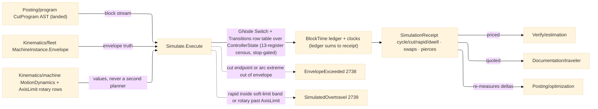

# [RASM_FABRICATION_SIMULATE]

The program-level controller simulation: `Simulate.Execute` the modal-state execution WALK over the landed `Posting/program#CUT_PROGRAM` `CutProgram` AST — a fold threading ONE typed `ControllerState` register vector block-by-block, integrating per-block time under an accel-limited trapezoidal evaluation, and gating every commanded position against the machine envelope. The register vector is the FULL RS274 modal census AS EXECUTION STATE: thirteen `ModalSlot` rows (motion · plane · distance · feed-mode · units · cutter-comp · tool-length · retract · wcs · path-control · spindle · coolant · stop), each carrying its RS274 group ordinal and power-on default. The landed `GNode` stream stamps every modal word into the thirteen-slot `Registers` carrier through the `GroupSlots` lowering — the widened 12-group `ModalGroup` census maps ELEVEN slots live (retract and path-control hold their power-on defaults as TYPED stored registers until posting lands those words) — the register CENSUS is this page's, the parse state machine and its `ModalGroup` violation payload stay `Posting/program`'s, and a simulate-side parse is the split-owner defect. `Posting/optimization#OPTIMIZATION` names this walk the AUTHORITATIVE cycle-time owner: its `OptimizationReceipt` seconds are pipeline-local estimates, re-measured here; `Verify/estimation` prices the `SimulationReceipt`, never a pass-local integral.

Time is EVALUATION, never planning: the per-block integral runs the trapezoidal `v² = v₀² + 2·a·s` envelope over the block's commanded F clamped to `MotionDynamics.CuttingFeed` (triangle profile when the span cannot reach it), rapids at the limits' rapid rate, G93 inverse-time blocks at `span·F/60` mm/s so one integral serves both feed modes — under the `MotionDynamics` policy shape that is the TYPE CONTRACT of the ONE motion-dynamics law `Kinematics/machine` HOMES. This page consumes the policy VALUES and never plans: junction clamping is `Posting/program`'s internal `Lookahead` certificate, jerk-aware look-ahead re-planning is `Kinematics/machine`'s law, and a second planner here is the named dual-paradigm defect. Envelope truth reads the landed `Kinematics/fleet#MACHINE_FLEET` `MachineInstance.Envelope` travels: a CUT move leaving the envelope routes `EnvelopeExceeded` 2738; a RAPID crossing the soft-limit margin — the INNER buffer inside the hard envelope, never permission to overshoot it — routes `SimulatedOvertravel` 2739; an arc gates its axis-extreme quadrant crossings, not the endpoint alone; rotary A/B/C registers gate against the `Kinematics/machine` `AxisLimit` rows the policy threads as data. A block after the stop transition advances NOTHING — `Stopped` is a live gate, never a decorative register. Dwell and pierce carry seconds in the P slot per the program AST law; a tool-change block charges the policy's swap seconds on the dwell clock IN ITS LEDGER ROW, so the ledger sum and the receipt cycle time agree.

Wire posture: HOST-LOCAL. The `SimulationReceipt` crosses only the in-process seam — estimation pricing, traveler quoting, optimization re-measure; the state vector and ledger never sit between wire and rail.

## [01]-[INDEX]

- [01]-[SIMULATE]: owns the `ModalSlot` register census, the `ControllerState` typed register vector with its `Apply` transition fold, the consumed `MotionDynamics` dynamics policy, the `SimulatePolicy`/`BlockTime`/`SimulationReceipt` evidence family, and the ONE `Simulate.Execute` walk — per-block time integration, linear + rotary + arc-extreme envelope gating, dwell/tool-change/pierce accounting, stop-gated advancement.

## [02]-[SIMULATE]

- Owner: `ModalSlot` `[SmartEnum<string>]` the thirteen-register RS274 census (`motion` g1 · `plane` g2 · `distance` g3 · `feed-mode` g5 · `units` g6 · `cutter-comp` g7 · `tool-length` g8 · `retract` g10 · `wcs` g12 · `path-control` g13 · `spindle` m7 · `coolant` m8 · `stop` m4), each row binding its group ordinal and power-on default code; `ControllerState` the typed register vector (motion command, feed mode, F/S words, tool slot, XYZ position + ABC rotary registers, spindle/coolant/length-comp flags, the `Registers` slot map every modal word stamps — the named flags are execution PROJECTIONS of the register rows, updated in the same transition); `MotionDynamics` the dynamics policy shape (the `Kinematics/machine` law's TYPE contract, its `Conservative` row the machine-less seed); `SimulatePolicy` the walk knobs (`Option<MachineInstance>` machine, `Seq<AxisLimit>` rotary rows, dynamics, tool-change seconds, soft-limit margin); `BlockTime` the per-block ledger row; `SimulationReceipt` the integrated evidence (cycle/cut/rapid/dwell seconds, tool-change and pierce counts, the block ledger, the final state); `Simulate` the static surface owning `Execute`.
- Cases: `ModalSlot` rows 13; `TransitionKind` rows 15 dispatched by the `Transitions` row table — every landed `GCommand` row maps to exactly one kind (`rapid` · `cut` for feed/extrude/arc/probe/thread-cycle · `dwell`/`pierce` P-slot seconds · `tool-swap` · `length-comp`/`length-cancel` · `spindle-on`/`spindle-stop` · `coolant-on`/`coolant-off` · `set-register` · `modal-only` for plane/distance/units/feed-mode/comp/wcs · `pause` for M0/M1 · `stop`); an UNMAPPED command fails the walk typed and a `_`-catch-all running a new word as motion is unconstructable; the `GNode` walk is the generated total Switch over the six AST cases (canned cycles spend P and walk their expanded moves through `GNode.Moves` cursor threading, macro/subprogram bodies walk recursively × repeats, additive-layer/NC1 nodes carry no controller motion); the time integral cases — trapezoid (span reaches the clamped F), triangle (span-limited peak), rapid (limits rate), inverse-time (`span·F/60`), zero-span register write.
- Entry: `public static Fin<SimulationReceipt> Execute(CutProgram program, SimulatePolicy policy)` — the ONE walk; `Fin<T>` routes `FabricationFault.EnvelopeExceeded` 2738 `(MachineAxis, at, limit)` on a cut move (endpoint or arc extreme) leaving the envelope, `FabricationFault.SimulatedOvertravel` 2739 `(block, MachineAxis, by)` on a rapid crossing the inner soft-limit band or a rotary register leaving its `AxisLimit` row, and kernel `GeometryFault.DegenerateInput` on an empty program, each lowered with `.ToError()`; the machine-less call (`Machine: None`) integrates time against `MotionDynamics.Conservative` and gates no linear envelope — a verdict basis for quoting before a fleet match exists.
- Auto: `Execute` seeds `ControllerState.PowerOn` (every slot at its `ModalSlot` default, position at origin, velocity zero) and folds the block stream — each `GNode.Word` lowers through the transition row table producing the next state (its modal slot stamped through the 11-row `GroupSlots`, A/B/C rotary params stamped into the rotary registers) plus a `BlockEffect`; the integrator converts the effect to seconds (feed blocks trapezoidal under `MotionDynamics.Acceleration` with the carried entry velocity and the `CuttingFeed` clamp, rapids at `RapidFeed`, G93 blocks at `span·F/60`, dwell/pierce read P as seconds, tool-change charges `ToolChangeSeconds` in its own ledger row); the envelope gate checks the commanded endpoint AND the arc's axis-extreme quadrant crossings per axis against `MachineInstance.Envelope` before the clock advances — cut moves hard-gate, rapids gate at the inner `SoftLimitMarginMm` band, rotary registers gate against the threaded `AxisLimit` rows; a `Stopped` state short-circuits every later node. `Verify/estimation#ESTIMATION` prices the receipt; `Documentation/traveler` quotes it; `Posting/optimization` re-measures its deltas against it.
- Receipt: `SimulationReceipt` IS the typed evidence — integrated cycle seconds split cut/rapid/dwell (the ledger rows SUM to the receipt — no out-of-ledger addend), tool-change and pierce counts, the per-block `BlockTime` ledger, and the terminal `ControllerState`; no fault arms ride the receipt (a violation FAILS the walk typed) and no generic simulation ledger exists beside it.
- Packages: `Posting/program#CUT_PROGRAM` (`CutProgram`/`GNode`/`GNode.Moves`/`GParam`/`GCommand`/`ModalGroup`/`FeedMode` — the landed AST, composed), `Kinematics/fleet#MACHINE_FLEET` (`MachineInstance.Envelope` — the envelope truth), `Kinematics/machine#MACHINE_TOOL` (`MotionDynamics` — the ONE law's type contract; `AxisLimit` — the rotary rows threaded as policy data), `Process/faults#FAULT_BAND` (`MachineAxis` + the 2738/2739 arms), `Rhino.Geometry` (`Point3d`/`BoundingBox` — composed), Thinktecture.Runtime.Extensions, LanguageExt.Core, BCL inbox.
- Growth: a new controller word is one `GCommand` row plus one `Transitions` table entry (a missing entry fails the walk typed, never runs); a queued register going live is its declared `ModalSlot` row gaining a `GroupSlots` mapping, never a new slot family; a finer dynamics model is columns on `MotionDynamics` when `Kinematics/machine` widens its law; a thermal/spindle-load overlay is one `BlockEffect` column; zero new surface.
- Boundary: simulate EVALUATES and never plans — junction speeds, S-curves, and look-ahead are `Posting/program.Lookahead`'s certificate and a re-planned feed here is the dual-paradigm defect; the register census is EXECUTION state and the parse state machine stays `Posting/program`'s — a simulate-side `Parse` is the split-owner defect; the motion-dynamics LAW homes on `Kinematics/machine` and `MotionDynamics` is its consumed TYPE contract, never a second jerk/accel owner; envelope truth is the fleet instance's measured travels and a page-local machine table is the deleted form; the soft-limit margin is an INNER buffer and an out-of-envelope success is the deleted form; a violation is a TYPED fault on the rail, never a warning row on the receipt; a block executed after `Stopped` is the decorative-register defect; a ledger row whose seconds disagree with the receipt sum is the split-clock defect; cycle time is THIS page's receipt and any sibling integrating seconds beside it (optimization baselines excepted as pipeline-local, re-measured here) is the second-clock defect.

```csharp signature
// --- [RUNTIME_PRELUDE] ----------------------------------------------------------------------------------------------------------------------------
using LanguageExt;
using LanguageExt.Common;
using Rasm.Fabrication.Kinematics;        // MachineInstance envelope truth · MotionDynamics · AxisLimit rotary rows
using Rasm.Fabrication.Posting;           // CutProgram · GNode · GCommand · ModalGroup · FeedMode — the landed AST
using Rasm.Fabrication.Process;           // FabricationFault · MachineAxis · GeometryFault routing
using Rasm.Numerics;
using Rhino.Geometry;
using Thinktecture;
using static LanguageExt.Prelude;
using WalkState = (Rasm.Fabrication.Verify.ControllerState State, (double Cut, double Rapid, double Dwell) Clock, int Swaps, int Pierces, LanguageExt.Seq<Rasm.Fabrication.Verify.BlockTime> Ledger, int Block);

namespace Rasm.Fabrication.Verify;

// --- [TYPES] --------------------------------------------------------------------------------------------------------------------------------------
// The thirteen-register RS274 census AS EXECUTION STATE: group ordinal + power-on default per row.
// Distinct by charter from Posting/program's parse-facing ModalGroup (the 12-group parse census).
[SmartEnum<string>]
public sealed partial class ModalSlot {
    public static readonly ModalSlot Motion = new("motion", group: 1, powerOn: "G0");
    public static readonly ModalSlot Plane = new("plane", group: 2, powerOn: "G17");
    public static readonly ModalSlot Distance = new("distance", group: 3, powerOn: "G90");
    public static readonly ModalSlot FeedRateMode = new("feed-mode", group: 5, powerOn: "G94");
    public static readonly ModalSlot Units = new("units", group: 6, powerOn: "G21");
    public static readonly ModalSlot CutterComp = new("cutter-comp", group: 7, powerOn: "G40");
    public static readonly ModalSlot ToolLength = new("tool-length", group: 8, powerOn: "G49");
    public static readonly ModalSlot Retract = new("retract", group: 10, powerOn: "G98");
    public static readonly ModalSlot Wcs = new("wcs", group: 12, powerOn: "G54");
    public static readonly ModalSlot PathControl = new("path-control", group: 13, powerOn: "G64");
    public static readonly ModalSlot Spindle = new("spindle", group: 107, powerOn: "M5");
    public static readonly ModalSlot Coolant = new("coolant", group: 108, powerOn: "M9");
    public static readonly ModalSlot Stop = new("stop", group: 104, powerOn: "");

    public int Group { get; }
    public string PowerOn { get; }
}

// The transition-law axis: every landed GCommand row maps to exactly ONE row here through the Transitions
// table — a command without a row FAILS the walk typed, so an unknown word can never execute as motion.
[SmartEnum<string>]
public sealed partial class TransitionKind {
    public static readonly TransitionKind Rapid = new("rapid");
    public static readonly TransitionKind Cut = new("cut");
    public static readonly TransitionKind Dwell = new("dwell");
    public static readonly TransitionKind Pierce = new("pierce");
    public static readonly TransitionKind ToolSwap = new("tool-swap");
    public static readonly TransitionKind LengthComp = new("length-comp");
    public static readonly TransitionKind LengthCancel = new("length-cancel");
    public static readonly TransitionKind SpindleOn = new("spindle-on");
    public static readonly TransitionKind SpindleStop = new("spindle-stop");
    public static readonly TransitionKind CoolantOn = new("coolant-on");
    public static readonly TransitionKind CoolantOff = new("coolant-off");
    public static readonly TransitionKind SetRegister = new("set-register");
    public static readonly TransitionKind ModalOnly = new("modal-only");
    public static readonly TransitionKind Pause = new("pause");
    public static readonly TransitionKind Stop = new("stop");
}

// --- [MODELS] -------------------------------------------------------------------------------------------------------------------------------------
// The ONE Kinematics/machine motion-dynamics law consumed directly; rotary AxisLimit rows thread as policy
// DATA (the machine page owns the rows, this walk gates against them). A second limits shape is the dead form.
public sealed record SimulatePolicy(Option<MachineInstance> Machine, Seq<AxisLimit> Rotary, MotionDynamics Dynamics, double ToolChangeSeconds, double SoftLimitMarginMm) {
    public static readonly SimulatePolicy Quote = new(Machine: None, Rotary: Seq<AxisLimit>(), Dynamics: MotionDynamics.Conservative, ToolChangeSeconds: 8.0, SoftLimitMarginMm: 0.0);
}

// The typed register vector: named execution PROJECTIONS plus the full thirteen-slot Registers carrier —
// every ModalSlot row has explicit storage seeded at its power-on default, and every modal word writes its
// slot; the named flags update in the SAME transition, so the two views cannot diverge.
public sealed record ControllerState(
    GCommand Motion, FeedMode Feed, double F, double S, Option<double> T,
    Point3d At, double A, double B, double C, double VelocityMmS,
    bool SpindleOn, bool CoolantOn, bool LengthComp, bool Stopped,
    Map<ModalSlot, string> Registers) {
    public static readonly ControllerState PowerOn = new(
        GCommand.Rapid, FeedMode.UnitsPerMinute, F: 0.0, S: 0.0, T: None,
        At: Point3d.Origin, A: 0.0, B: 0.0, C: 0.0, VelocityMmS: 0.0,
        SpindleOn: false, CoolantOn: false, LengthComp: false, Stopped: false,
        Registers: toMap(toSeq(ModalSlot.Items).Map(static slot => (slot, slot.PowerOn))));
}

public readonly record struct BlockEffect(double SpanMm, double TargetFeedMmS, double FixedSeconds, bool ToolSwap, bool Pierce);

public readonly record struct BlockTime(int Block, GCommand Command, double Seconds, double SpanMm, double FeedApplied);

public sealed record SimulationReceipt(
    double CycleSeconds, double CutSeconds, double RapidSeconds, double DwellSeconds,
    int ToolChanges, int Pierces, Seq<BlockTime> Ledger, ControllerState Final);

// --- [OPERATIONS] ---------------------------------------------------------------------------------------------------------------------------------
public static class Simulate {
    // GCommand → TransitionKind row table: EVERY landed command row has exactly one entry; a lookup miss fails
    // the walk typed, so a new landed command cannot simulate until its row lands — the totality fence. The
    // table is lockstep with the Posting/program roster: a roster row added there binds a row HERE in the
    // same pass.
    static readonly Map<GCommand, TransitionKind> Transitions = Map(
        (GCommand.Rapid, TransitionKind.Rapid),
        (GCommand.Feed, TransitionKind.Cut), (GCommand.Extrude, TransitionKind.Cut),
        (GCommand.ArcCw, TransitionKind.Cut), (GCommand.ArcCcw, TransitionKind.Cut),
        (GCommand.Probe, TransitionKind.Cut), (GCommand.ThreadCycle, TransitionKind.Cut),
        (GCommand.Dwell, TransitionKind.Dwell), (GCommand.Pierce, TransitionKind.Pierce),
        (GCommand.ToolChange, TransitionKind.ToolSwap),
        (GCommand.LengthOffset, TransitionKind.LengthComp), (GCommand.LengthCancel, TransitionKind.LengthCancel),
        (GCommand.Spindle, TransitionKind.SpindleOn), (GCommand.SpindleCcw, TransitionKind.SpindleOn), (GCommand.TorchOn, TransitionKind.SpindleOn),
        (GCommand.SpindleStop, TransitionKind.SpindleStop),
        (GCommand.Coolant, TransitionKind.CoolantOn), (GCommand.CoolantMist, TransitionKind.CoolantOn),
        (GCommand.AssistGas, TransitionKind.CoolantOn), (GCommand.DustCollect, TransitionKind.CoolantOn),
        (GCommand.CoolantOff, TransitionKind.CoolantOff),
        (GCommand.Css, TransitionKind.SetRegister), (GCommand.CssCancel, TransitionKind.SetRegister),
        (GCommand.TorchHeight, TransitionKind.SetRegister),
        (GCommand.HotendTemp, TransitionKind.SetRegister), (GCommand.HotendWait, TransitionKind.SetRegister), (GCommand.BedTemp, TransitionKind.SetRegister),
        (GCommand.PlaneXy, TransitionKind.ModalOnly), (GCommand.PlaneZx, TransitionKind.ModalOnly), (GCommand.PlaneYz, TransitionKind.ModalOnly),
        (GCommand.Absolute, TransitionKind.ModalOnly), (GCommand.Relative, TransitionKind.ModalOnly),
        (GCommand.Metric, TransitionKind.ModalOnly), (GCommand.Inch, TransitionKind.ModalOnly),
        (GCommand.FeedPerMinute, TransitionKind.ModalOnly), (GCommand.FeedInverseTime, TransitionKind.ModalOnly),
        (GCommand.CompOff, TransitionKind.ModalOnly), (GCommand.CompLeft, TransitionKind.ModalOnly), (GCommand.CompRight, TransitionKind.ModalOnly),
        (GCommand.Wcs, TransitionKind.ModalOnly),
        (GCommand.Stop, TransitionKind.Pause), (GCommand.OptionalStop, TransitionKind.Pause),
        (GCommand.ProgramEnd, TransitionKind.Stop));

    // Modal-group → register-slot lowering: ELEVEN groups stamp live slots (retract/path-control hold their
    // power-on defaults until posting lands those words); the census IS execution state.
    static readonly Map<ModalGroup, ModalSlot> GroupSlots = Map(
        (ModalGroup.Motion, ModalSlot.Motion), (ModalGroup.Plane, ModalSlot.Plane),
        (ModalGroup.Distance, ModalSlot.Distance), (ModalGroup.Units, ModalSlot.Units),
        (ModalGroup.Feed, ModalSlot.FeedRateMode), (ModalGroup.Spindle, ModalSlot.Spindle),
        (ModalGroup.Coolant, ModalSlot.Coolant), (ModalGroup.CutterComp, ModalSlot.CutterComp),
        (ModalGroup.ToolLength, ModalSlot.ToolLength), (ModalGroup.Wcs, ModalSlot.Wcs),
        (ModalGroup.Stop, ModalSlot.Stop));

    // The ONE walk over the CutProgram AST (Seq<GNode>): PowerOn state, generated total Switch over the six
    // node cases, row-table word transitions, trapezoidal time integral, envelope gate before the clock
    // advances, stop-gated advancement. A violation FAILS typed — never a warning row on the receipt.
    public static Fin<SimulationReceipt> Execute(CutProgram program, SimulatePolicy policy) =>
        program.Nodes.IsEmpty
            ? Fin.Fail<SimulationReceipt>(GeometryFault.DegenerateInput("simulate:empty-program").ToError())
            : Walk(program.Nodes,
                Fin.Succ((State: ControllerState.PowerOn, Clock: (Cut: 0.0, Rapid: 0.0, Dwell: 0.0), Swaps: 0, Pierces: 0, Ledger: Seq<BlockTime>(), Block: 0)),
                policy)
              .Map(st => new SimulationReceipt(
                  CycleSeconds: st.Clock.Cut + st.Clock.Rapid + st.Clock.Dwell,
                  CutSeconds: st.Clock.Cut, RapidSeconds: st.Clock.Rapid, DwellSeconds: st.Clock.Dwell,
                  ToolChanges: st.Swaps, Pierces: st.Pierces, Ledger: st.Ledger, Final: st.State));

    static Fin<WalkState> Walk(Seq<GNode> nodes, Fin<WalkState> seed, SimulatePolicy policy) =>
        nodes.Fold(seed, (acc, node) => acc.Bind(st => Node(st, node, policy)));

    // AST dispatch, STOP-GATED: after ProgramEnd nothing advances. WORD blocks lower through the transition
    // row table; a CANNED CYCLE spends its P seconds (Pierce counting) and executes its expanded moves via
    // GNode.Moves cursor threading; MACRO/SUBPROGRAM bodies walk recursively (× repeats); ADDITIVE-LAYER and
    // NC1 nodes carry no controller motion — their time is the owning plane's.
    static Fin<WalkState> Node(WalkState st, GNode node, SimulatePolicy policy) =>
        st.State.Stopped
            ? Fin.Succ(st)
            : node.Switch(
                word: w => Word(st, w, policy),
                cannedCycle: c => Walk(GNode.Moves(c.ExpandedMoves, st.State.At), Fin.Succ(Fixed(st, c.Command, c.P, pierce: c.Command == GCommand.Pierce)), policy),
                macro: m => Walk(toSeq(m.Body), Fin.Succ(st), policy),
                subprogram: s => toSeq(Enumerable.Range(0, Math.Max(1, s.Repeats)))
                    .Fold(Fin.Succ(st), (acc, _) => acc.Bind(x => Walk(toSeq(s.Body), Fin.Succ(x), policy))),
                additiveLayer: _ => Fin.Succ(st),
                nc1: _ => Fin.Succ(st));

    static Fin<WalkState> Word(WalkState st, GNode.Word w, SimulatePolicy policy) =>
        Transitions.Find(w.Command).Match(
            None: () => Fin.Fail<WalkState>(GeometryFault.DegenerateInput($"simulate:unmapped-command:{w.Command.Key}").ToError()),
            Some: kind => {
                (ControllerState next, BlockEffect effect) = Apply(kind, st.State, w);
                return Gate(st.State, next, w, kind, st.Block, policy).Map(_ => Advance(st, next, kind, w.Command, effect, policy));
            });

    // Swap seconds charge on the dwell clock IN the ledger row — the ledger sums to the receipt, no
    // out-of-ledger addend.
    static WalkState Advance(WalkState st, ControllerState next, TransitionKind kind, GCommand command, BlockEffect effect, SimulatePolicy policy) {
        double seconds = kind == TransitionKind.ToolSwap ? policy.ToolChangeSeconds : Seconds(st.State.VelocityMmS, effect, kind, policy);
        (double Cut, double Rapid, double Dwell) clock =
            kind == TransitionKind.Rapid                                        ? (st.Clock.Cut, st.Clock.Rapid + seconds, st.Clock.Dwell)
            : effect.FixedSeconds > 0.0 || kind == TransitionKind.ToolSwap      ? (st.Clock.Cut, st.Clock.Rapid, st.Clock.Dwell + seconds)
                                                                                : (st.Clock.Cut + seconds, st.Clock.Rapid, st.Clock.Dwell);
        return (next with { VelocityMmS = effect.TargetFeedMmS }, clock,
                st.Swaps + (effect.ToolSwap ? 1 : 0), st.Pierces + (effect.Pierce ? 1 : 0),
                st.Ledger.Add(new BlockTime(st.Block, command, seconds, effect.SpanMm, effect.TargetFeedMmS * 60.0)), st.Block + 1);
    }

    // Row-dispatched transition — the kind axis owns the behavior, the word supplies the payload; every modal
    // command stamps its Registers slot through GroupSlots, feed-mode words retune the Feed projection, and
    // A/B/C words stamp the rotary registers. G93 inverse-time: block velocity = span·F/60 so one integral
    // serves both feed modes.
    static (ControllerState, BlockEffect) Apply(TransitionKind kind, ControllerState s, GNode.Word w) {
        Point3d to = new(w.P('X').IfNone(s.At.X), w.P('Y').IfNone(s.At.Y), w.P('Z').IfNone(s.At.Z));
        double f = w.P('F').IfNone(s.F);
        double span = w.Command == GCommand.ArcCw || w.Command == GCommand.ArcCcw ? ArcSpan(s.At, to, w) : s.At.DistanceTo(to);
        ControllerState stamped = s with {
            Registers = GroupSlots.Find(w.Command.Group).Match(
                Some: slot => s.Registers.AddOrUpdate(slot, w.Command.Code),
                None: () => s.Registers),
            Feed = w.Command == GCommand.FeedInverseTime ? FeedMode.InverseTime
                 : w.Command == GCommand.FeedPerMinute ? FeedMode.UnitsPerMinute
                 : w.Mode.IfNone(s.Feed),
            A = w.P('A').IfNone(s.A), B = w.P('B').IfNone(s.B), C = w.P('C').IfNone(s.C),
        };
        ControllerState moved = stamped with { Motion = w.Command, At = to, F = f };
        double cutV = stamped.Feed == FeedMode.InverseTime ? span * f / 60.0 : f / 60.0;
        return kind.Switch(
            rapid:        () => (moved, new BlockEffect(span, 0.0, 0.0, false, false)),
            cut:          () => (moved, new BlockEffect(span, cutV, 0.0, false, false)),
            dwell:        () => (stamped, new BlockEffect(0.0, s.VelocityMmS, w.P('P').IfNone(0.0), false, false)),
            pierce:       () => (stamped, new BlockEffect(0.0, 0.0, w.P('P').IfNone(0.0), false, true)),
            toolSwap:     () => (stamped with { T = w.P('T'), LengthComp = false }, new BlockEffect(0.0, 0.0, 0.0, true, false)),
            lengthComp:   () => (stamped with { LengthComp = true }, new BlockEffect(0.0, s.VelocityMmS, 0.0, false, false)),
            lengthCancel: () => (stamped with { LengthComp = false }, new BlockEffect(0.0, s.VelocityMmS, 0.0, false, false)),
            spindleOn:    () => (stamped with { SpindleOn = true, S = w.P('S').IfNone(s.S) }, new BlockEffect(0.0, s.VelocityMmS, 0.0, false, false)),
            spindleStop:  () => (stamped with { SpindleOn = false }, new BlockEffect(0.0, s.VelocityMmS, 0.0, false, false)),
            coolantOn:    () => (stamped with { CoolantOn = true }, new BlockEffect(0.0, s.VelocityMmS, 0.0, false, false)),
            coolantOff:   () => (stamped with { CoolantOn = false }, new BlockEffect(0.0, s.VelocityMmS, 0.0, false, false)),
            setRegister:  () => (stamped with { S = w.P('S').IfNone(s.S) }, new BlockEffect(0.0, s.VelocityMmS, 0.0, false, false)),
            modalOnly:    () => (stamped, new BlockEffect(0.0, s.VelocityMmS, 0.0, false, false)),
            pause:        () => (stamped, new BlockEffect(0.0, 0.0, 0.0, false, false)),
            stop:         () => (stamped with { Stopped = true, SpindleOn = false, CoolantOn = false }, new BlockEffect(0.0, 0.0, 0.0, false, false)));
    }

    // Canned-cycle fixed cost: P seconds on the dwell clock, pierce census when the cycle IS the pierce.
    static WalkState Fixed(WalkState st, GCommand command, double seconds, bool pierce) =>
        (st.State, (st.Clock.Cut, st.Clock.Rapid, st.Clock.Dwell + seconds), st.Swaps, st.Pierces + (pierce ? 1 : 0),
         st.Ledger.Add(new BlockTime(st.Block, command, seconds, 0.0, 0.0)), st.Block + 1);

    // Trapezoid under v² = v₀² + 2·a·s (triangle when the span cannot reach the CLAMPED F — the CuttingFeed
    // cap is the machine's, so a program commanding F beyond capacity never fakes a shorter cycle); rapids at
    // the limits rate; dwell/pierce carry seconds in the P slot. Evaluation only — never planning.
    static double Seconds(double vIn, BlockEffect e, TransitionKind kind, SimulatePolicy policy) {
        if (e.FixedSeconds > 0.0) return e.FixedSeconds;
        if (e.SpanMm <= 1e-9) return 0.0;
        double a = Math.Max(1e-6, policy.Dynamics.Acceleration);
        double target = kind == TransitionKind.Rapid
            ? policy.Dynamics.RapidFeed / 60.0
            : Math.Max(1e-6, Math.Min(e.TargetFeedMmS, policy.Dynamics.CuttingFeed / 60.0));
        double accelDist = Math.Abs(target * target - vIn * vIn) / (2.0 * a);
        if (accelDist >= e.SpanMm) {
            double vPeak = Math.Sqrt(Math.Max(vIn * vIn, 2.0 * a * e.SpanMm));
            return (vPeak - Math.Min(vIn, vPeak)) / a + e.SpanMm / Math.Max(1e-6, 0.5 * (vIn + vPeak));
        }
        return Math.Abs(target - vIn) / a + (e.SpanMm - accelDist) / target;
    }

    static double ArcSpan(Point3d from, Point3d to, GNode.Word w) {
        Point3d center = new(from.X + w.P('I').IfNone(0.0), from.Y + w.P('J').IfNone(0.0), from.Z);
        double r = from.DistanceTo(center);
        if (r <= 1e-9) return from.DistanceTo(to);
        double a0 = Math.Atan2(from.Y - center.Y, from.X - center.X), a1 = Math.Atan2(to.Y - center.Y, to.X - center.X);
        double sweep = w.Command == GCommand.ArcCw ? (a0 - a1 + 2.0 * Math.PI) % (2.0 * Math.PI) : (a1 - a0 + 2.0 * Math.PI) % (2.0 * Math.PI);
        return r * (sweep <= 1e-9 ? 2.0 * Math.PI : sweep);
    }

    // Envelope gate over the endpoint AND (for arcs) the axis-extreme quadrant crossings: cut moves hard-gate
    // per axis (2738); rapids gate at the INNER soft-limit band (2739) — the margin tightens the envelope,
    // never licenses an overshoot; rotary A/B/C registers gate against the threaded AxisLimit rows.
    static Fin<Unit> Gate(ControllerState prev, ControllerState next, GNode.Word w, TransitionKind kind, int block, SimulatePolicy policy) =>
        RotaryGate(next, block, policy).Bind(_ => policy.Machine.Match(
            None: () => Fin.Succ(unit),
            Some: m => GatePoints(prev, next, w).Bind(p => Axes(p))
                .Fold(Fin.Succ(unit), (acc, axis) => acc.Bind(_ => {
                    double margin = kind == TransitionKind.Rapid ? policy.SoftLimitMarginMm : 0.0;
                    (MachineAxis key, double at) = (axis.Key, axis.At);
                    double lo = Lo(m.Envelope, key) + margin, hi = Hi(m.Envelope, key) - margin;
                    if (at >= lo && at <= hi) return Fin.Succ(unit);
                    double limit = at < lo ? lo : hi;
                    return kind == TransitionKind.Rapid
                        ? Fin.Fail<Unit>(new FabricationFault.SimulatedOvertravel(block, key, Math.Abs(at - limit)).ToError())
                        : Fin.Fail<Unit>(new FabricationFault.EnvelopeExceeded(key, at, limit).ToError());
                }))));

    static Fin<Unit> RotaryGate(ControllerState next, int block, SimulatePolicy policy) =>
        policy.Rotary.Fold(Fin.Succ(unit), (acc, limit) => acc.Bind(_ => {
            double at = limit.Axis == MachineAxis.A ? next.A : limit.Axis == MachineAxis.B ? next.B : next.C;
            return at >= limit.Min && at <= limit.Max
                ? Fin.Succ(unit)
                : Fin.Fail<Unit>(new FabricationFault.SimulatedOvertravel(block, limit.Axis, Math.Abs(at - (at < limit.Min ? limit.Min : limit.Max))).ToError());
        }));

    // Arc extreme points: the axis extremes (quadrant crossings at center ± r on X and Y) that lie on the
    // traversed sweep gate beside the endpoint — an arc bulging past a travel wall fails even when both
    // endpoints sit inside.
    static Seq<Point3d> GatePoints(ControllerState prev, ControllerState next, GNode.Word w) {
        if (w.Command != GCommand.ArcCw && w.Command != GCommand.ArcCcw) return Seq(next.At);
        Point3d center = new(prev.At.X + w.P('I').IfNone(0.0), prev.At.Y + w.P('J').IfNone(0.0), prev.At.Z);
        double r = prev.At.DistanceTo(center);
        if (r <= 1e-9) return Seq(next.At);
        double a0 = Math.Atan2(prev.At.Y - center.Y, prev.At.X - center.X);
        double a1 = Math.Atan2(next.At.Y - center.Y, next.At.X - center.X);
        bool cw = w.Command == GCommand.ArcCw;
        double sweep = cw ? (a0 - a1 + 2.0 * Math.PI) % (2.0 * Math.PI) : (a1 - a0 + 2.0 * Math.PI) % (2.0 * Math.PI);
        return Seq(next.At).Concat(
            toSeq(new[] { 0.0, 0.5 * Math.PI, Math.PI, 1.5 * Math.PI })
                .Filter(q => ((cw ? (a0 - q + 2.0 * Math.PI) : (q - a0 + 2.0 * Math.PI)) % (2.0 * Math.PI)) <= sweep)
                .Map(q => new Point3d(center.X + r * Math.Cos(q), center.Y + r * Math.Sin(q), next.At.Z)));
    }

    static Seq<(MachineAxis Key, double At)> Axes(Point3d p) => Seq((MachineAxis.X, p.X), (MachineAxis.Y, p.Y), (MachineAxis.Z, p.Z));

    static double Lo(BoundingBox e, MachineAxis a) => a == MachineAxis.X ? e.Min.X : a == MachineAxis.Y ? e.Min.Y : e.Min.Z;

    static double Hi(BoundingBox e, MachineAxis a) => a == MachineAxis.X ? e.Max.X : a == MachineAxis.Y ? e.Max.Y : e.Max.Z;
}
```


