# [RASM_FABRICATION_SIMULATE]

The program-level controller simulation: `Simulate.Execute` walks the `CutProgram` AST through one `ControllerState`, integrates the block ledger, and gates commanded positions against machine truth. The register vector reuses `Posting/program`'s fourteen-row `ModalGroup` identity directly; the retired `ModalSlot` roster and `GroupSlots` rename table are deleted. Motion, feed mode, spindle, coolant, tool-length state, and terminal stop are derived projections of `Map<ModalGroup, GCommand>`, so parallel stored flags cannot diverge. `Posting/optimization` keeps pipeline-local estimates, while `SimulationReceipt` remains the authoritative priced clock.

Time is evaluation, never replanning. Units, absolute/relative distance, work-offset transforms, tool-length values, XY/ZX/YZ helical arcs, inverse-time `60/F` block duration, rotary coordination, required/optional pauses, hotend/bed waits, canned-cycle repeats, subprogram repeats, and additive extrusion work all affect the ledger. Thermal state splits TARGET from ATTAINED: a nonblocking set stamps only the target register, so heating time charges exclusively on explicit waits against the attained temperature — a set followed by an equal-target wait still pays its full heat, and simulation agrees with the nonblocking commands posting actually emits. Torch-height words decode back to the Bevel-owned `ThcDirective` union, so all five height modalities remain distinct controller state. NC1 refuses a generic machining clock and demands the steel clock owner. The short-span integral computes one reachable terminal velocity and `2s/(v₀+v₁)` rather than double-counting acceleration. Linear envelope, plane-specific arc extrema, mandatory rotary limits, and the inner soft-limit band gate before time advances.

Wire posture: HOST-LOCAL. The `SimulationReceipt` crosses only the in-process seam — estimation pricing, traveler quoting, optimization re-measure; the state vector and ledger never sit between wire and rail.

## [01]-[INDEX]

- [01]-[SIMULATE]: owns the `ControllerState` register vector over canonical `ModalGroup`, the `Apply` transition fold, the consumed `MotionDynamics`, `SimulatePolicy`, `BlockTime`, `SimulationReceipt`, and the one `Simulate.Execute` walk.

## [02]-[SIMULATE]

- Owner: `ControllerState` carries program and machine positions, `F/S/T/H`, additive target and attained temperatures, the Bevel-owned `ThcDirective` register, ABC registers, active WCS ordinal, velocity, the LIVE work-offset table, and the canonical modal map; all named modal properties derive from that map. `SimulatePolicy` carries optional machine truth, rotary limits, dynamics, typed work-offset/tool-length maps, swap/pause/optional-stop policy, temperature slew rates, and soft-limit margin. `BlockTime` and `SimulationReceipt` are the ledger evidence.
- Cases: `TransitionKind` rows dispatch every landed `GCommand`, including `G38.2`–`G38.5`, WCS assignment, retract/path-control, the torch-height decode, and both temperature waits. Canned and subprogram repeats reject non-positive counts, canned-cycle seconds reject non-finite or negative values before any mutation, the cycle's canonical feed mode stamps the modal register across every repeat, additive layers charge extrusion work and stamp temperature targets, and NC1 routes typed unsupported-clock failure.
- Entry: `public static Fin<SimulationReceipt> Execute(CutProgram program, SimulatePolicy policy)` — the ONE walk; `Fin<T>` routes `FabricationFault.EnvelopeExceeded` 2738 `(MachineAxis, at, limit)` on a cut move (endpoint or arc extreme) leaving the envelope, `FabricationFault.SimulatedOvertravel` 2739 `(block, MachineAxis, by)` on a rapid crossing the inner soft-limit band or a rotary register leaving its `AxisLimit` row, and kernel `GeometryFault.DegenerateInput` on an empty program, each lowered with `.ToError()`; the machine-less call (`Machine: None`) integrates time against `MotionDynamics.Conservative` and gates no linear envelope — a verdict basis for quoting before a fleet match exists.
- Auto: `Execute` validates dynamics, time policy, and rotary limits, seeds canonical power-on modal rows, and folds each node through `Transitions`. `Apply` resolves units, distance mode, the LIVE work-offset table (`G10 L2` datum writes stamp `ControllerState.Offsets`; `SimulatePolicy.WorkOffsets` seeds power-on only), tool length, plane, rotary values, and modal projections before producing `BlockEffect`; the ledger charges inverse-time, coordinated rotary, dwell, pierce, swaps, pauses, and temperature waits in their owning block. Envelope and missing-rotary-limit gates run before advancement, and terminal stop prevents later execution.
- Receipt: `SimulationReceipt` IS the typed evidence — integrated cycle seconds split cut/rapid/dwell (the ledger rows SUM to the receipt — no out-of-ledger addend), tool-change and pierce counts, the per-block `BlockTime` ledger, and the terminal `ControllerState`; no fault arms ride the receipt (a violation FAILS the walk typed) and no generic simulation ledger exists beside it.
- Packages: `Posting/program` (`CutProgram`, `GNode`, `GNode.Moves`, `GParam`, `GCommand`, `ModalGroup`, `FeedMode`); `Kinematics/fleet` (`MachineInstance.Envelope`); `Kinematics/machine` (`MotionDynamics`, `AxisLimit`); `Process/faults` (`MachineAxis` and the 2738/2739 arms); `Rhino.Geometry` (`Point3d`, `BoundingBox`); Thinktecture.Runtime.Extensions; LanguageExt.Core; BCL inbox.
- Growth: a new controller word is one `GCommand` row plus one `Transitions` row; a new modal family extends canonical `ModalGroup` once; finer dynamics extend `MotionDynamics`; coordinated effects extend `BlockEffect`; zero parallel register vocabulary.
- Boundary: simulate EVALUATES and never plans — junction speeds, S-curves, and look-ahead are `Posting/program.Lookahead`'s certificate and a re-planned feed here is the dual-paradigm defect; the register census is EXECUTION state and the parse state machine stays `Posting/program`'s — a simulate-side `Parse` is the split-owner defect; the motion-dynamics LAW homes on `Kinematics/machine` and `MotionDynamics` is its consumed TYPE contract, never a second jerk/accel owner; envelope truth is the fleet instance's measured travels and a page-local machine table is the deleted form; the soft-limit margin is an INNER buffer and an out-of-envelope success is the deleted form; a violation is a TYPED fault on the rail, never a warning row on the receipt; a block executed after `Stopped` is the decorative-register defect; a ledger row whose seconds disagree with the receipt sum is the split-clock defect; cycle time is THIS page's receipt and any sibling integrating seconds beside it (optimization baselines excepted as pipeline-local, re-measured here) is the second-clock defect.

```csharp signature
// --- [RUNTIME_PRELUDE] ----------------------------------------------------------------------------------------------------------------------------
using LanguageExt;
using LanguageExt.Common;
using Rasm.Fabrication.Kinematics;        // MachineInstance envelope truth · MotionDynamics · AxisLimit rotary rows
using Rasm.Fabrication.Posting;           // CutProgram · GNode · GCommand · ModalGroup · FeedMode — the landed AST
using Rasm.Fabrication.Process;           // FabricationFault · MachineAxis · GeometryFault routing
using Rasm.Fabrication.Toolpath;          // ThcDirective — the Bevel-owned height-directive union consumed as state
using Rasm.Numerics;
using Rhino.Geometry;
using Thinktecture;
using static LanguageExt.Prelude;
using WalkState = (Rasm.Fabrication.Verify.ControllerState State, (double Cut, double Rapid, double Dwell) Clock, int Swaps, int Pierces, LanguageExt.Seq<Rasm.Fabrication.Verify.BlockTime> Ledger, int Block);

namespace Rasm.Fabrication.Verify;

// --- [TYPES] --------------------------------------------------------------------------------------------------------------------------------------
// The transition-law axis: every landed GCommand row maps to exactly ONE row here through the Transitions
// table — a command without a row FAILS the walk typed, so an unknown word can never execute as motion.
[SmartEnum<string>]
public sealed partial class TransitionKind {
    public static readonly TransitionKind Rapid = new("rapid");
    public static readonly TransitionKind Cut = new("cut");
    public static readonly TransitionKind Dwell = new("dwell");
    public static readonly TransitionKind Pierce = new("pierce");
    public static readonly TransitionKind ToolSwap = new("tool-swap");
    public static readonly TransitionKind LengthComp = new("length-comp");
    public static readonly TransitionKind LengthCancel = new("length-cancel");
    public static readonly TransitionKind SpindleOn = new("spindle-on");
    public static readonly TransitionKind SpindleStop = new("spindle-stop");
    public static readonly TransitionKind CoolantOn = new("coolant-on");
    public static readonly TransitionKind CoolantOff = new("coolant-off");
    public static readonly TransitionKind SetRegister = new("set-register");
    public static readonly TransitionKind TorchHeight = new("torch-height");
    public static readonly TransitionKind ModalOnly = new("modal-only");
    public static readonly TransitionKind Pause = new("pause");
    public static readonly TransitionKind Stop = new("stop");
}

// --- [MODELS] -------------------------------------------------------------------------------------------------------------------------------------
// The ONE Kinematics/machine motion-dynamics law consumed directly; rotary AxisLimit rows thread as policy
// DATA (the machine page owns the rows, this walk gates against them). A second limits shape is the dead form.
public sealed record SimulatePolicy(
    Option<MachineInstance> Machine,
    Seq<AxisLimit> Rotary,
    MotionDynamics Dynamics,
    Map<int, Transform> WorkOffsets,
    Map<int, double> ToolLengthsMm,
    double ToolChangeSeconds,
    double PauseSeconds,
    double OptionalStopSeconds,
    double HotendDegreesPerSecond,
    double BedDegreesPerSecond,
    double SoftLimitMarginMm) {
    public static readonly SimulatePolicy Quote = new(
        Machine: None, Rotary: Seq<AxisLimit>(), Dynamics: MotionDynamics.Conservative,
        WorkOffsets: Map<int, Transform>(), ToolLengthsMm: Map<int, double>(), ToolChangeSeconds: 8.0,
        PauseSeconds: 0.0, OptionalStopSeconds: 0.0, HotendDegreesPerSecond: 2.0, BedDegreesPerSecond: 0.5, SoftLimitMarginMm: 0.0);
}

// One register carrier over canonical ModalGroup; named state reads are derived projections, never parallel
// storage. Thermal state splits TARGET (setpoint the controller was told) from ATTAINED (temperature the wait
// evidence proves), so a nonblocking set can never appear to complete heating; Thc carries the Bevel-owned
// directive union, so all five height modalities stay distinct machine state.
public sealed record ControllerState(
    double F, double S, Option<double> T, Option<double> H,
    double HotendC, double BedC, double HotendTargetC, double BedTargetC,
    Option<ThcDirective> Thc,
    Point3d ProgramAt, Point3d At, double A, double B, double C, int Wcs, double VelocityMmS,
    Map<ModalGroup, GCommand> Registers, Map<int, Transform> Offsets) {
    public GCommand Motion => Registers.Find(ModalGroup.Motion).IfNone(GCommand.Rapid);
    public FeedMode Feed => Registers.Find(ModalGroup.Feed).Map(static command => command == GCommand.FeedInverseTime ? FeedMode.InverseTime : FeedMode.UnitsPerMinute).IfNone(FeedMode.UnitsPerMinute);
    public bool SpindleOn => Registers.Find(ModalGroup.Spindle).Exists(static command => command == GCommand.Spindle || command == GCommand.SpindleCcw || command == GCommand.TorchOn);
    public bool CoolantOn => Registers.Find(ModalGroup.Coolant).Exists(static command => command != GCommand.CoolantOff);
    public bool LengthComp => Registers.Find(ModalGroup.ToolLength).Exists(static command => command == GCommand.LengthOffset);
    public bool Stopped => Registers.Find(ModalGroup.Stop).Exists(static command => command == GCommand.ProgramEnd);

    public static readonly ControllerState PowerOn = new(
        F: 0.0, S: 0.0, T: None, H: None, HotendC: 0.0, BedC: 0.0, HotendTargetC: 0.0, BedTargetC: 0.0, Thc: None,
        ProgramAt: Point3d.Origin, At: Point3d.Origin, A: 0.0, B: 0.0, C: 0.0, Wcs: 1, VelocityMmS: 0.0,
        Offsets: Map<int, Transform>(),
        Registers: Map(
            (ModalGroup.Motion, GCommand.Rapid), (ModalGroup.Plane, GCommand.PlaneXy),
            (ModalGroup.Distance, GCommand.Absolute), (ModalGroup.Units, GCommand.Metric),
            (ModalGroup.Feed, GCommand.FeedPerMinute), (ModalGroup.Spindle, GCommand.SpindleStop),
            (ModalGroup.Coolant, GCommand.CoolantOff), (ModalGroup.CutterComp, GCommand.CompOff),
            (ModalGroup.ToolLength, GCommand.LengthCancel), (ModalGroup.Wcs, GCommand.Wcs),
            (ModalGroup.Retract, GCommand.RetractInitial), (ModalGroup.PathControl, GCommand.Continuous)));
}

public readonly record struct BlockEffect(
    double SpanMm,
    double TargetFeedMmS,
    double FixedSeconds,
    bool ToolSwap,
    bool Pierce,
    double CoordinatedSeconds);

public readonly record struct BlockTime(int Block, GCommand Command, double Seconds, double SpanMm, double FeedApplied);

public sealed record SimulationReceipt(
    double CycleSeconds, double CutSeconds, double RapidSeconds, double DwellSeconds,
    int ToolChanges, int Pierces, Seq<BlockTime> Ledger, ControllerState Final);

// --- [OPERATIONS] ---------------------------------------------------------------------------------------------------------------------------------
public static class Simulate {
    // GCommand → TransitionKind row table: EVERY landed command row has exactly one entry; a lookup miss fails
    // the walk typed, so a new landed command cannot simulate until its row lands — the totality fence. The
    // table is lockstep with the Posting/program roster: a roster row added there binds a row HERE in the
    // same pass.
    private static readonly Map<GCommand, TransitionKind> Transitions = Map(
        (GCommand.Rapid, TransitionKind.Rapid),
        (GCommand.Feed, TransitionKind.Cut), (GCommand.Extrude, TransitionKind.Cut),
        (GCommand.ArcCw, TransitionKind.Cut), (GCommand.ArcCcw, TransitionKind.Cut),
        (GCommand.Probe, TransitionKind.Cut), (GCommand.ProbeTowardStop, TransitionKind.Cut),
        (GCommand.ProbeTowardOptional, TransitionKind.Cut), (GCommand.ProbeAwayStop, TransitionKind.Cut),
        (GCommand.ProbeAwayOptional, TransitionKind.Cut), (GCommand.ThreadCycle, TransitionKind.Cut),
        (GCommand.Dwell, TransitionKind.Dwell), (GCommand.Pierce, TransitionKind.Pierce),
        (GCommand.ToolChange, TransitionKind.ToolSwap),
        (GCommand.LengthOffset, TransitionKind.LengthComp), (GCommand.LengthCancel, TransitionKind.LengthCancel),
        (GCommand.Spindle, TransitionKind.SpindleOn), (GCommand.SpindleCcw, TransitionKind.SpindleOn), (GCommand.TorchOn, TransitionKind.SpindleOn),
        (GCommand.SpindleStop, TransitionKind.SpindleStop),
        (GCommand.Coolant, TransitionKind.CoolantOn), (GCommand.CoolantMist, TransitionKind.CoolantOn),
        (GCommand.AssistGas, TransitionKind.CoolantOn), (GCommand.DustCollect, TransitionKind.CoolantOn),
        (GCommand.CoolantOff, TransitionKind.CoolantOff),
        (GCommand.Css, TransitionKind.SetRegister), (GCommand.CssCancel, TransitionKind.SetRegister),
        (GCommand.TorchHeight, TransitionKind.TorchHeight), (GCommand.SetWcs, TransitionKind.SetRegister),
        (GCommand.HotendTemp, TransitionKind.SetRegister), (GCommand.HotendWait, TransitionKind.SetRegister),
        (GCommand.BedTemp, TransitionKind.SetRegister), (GCommand.BedWait, TransitionKind.SetRegister),
        (GCommand.PlaneXy, TransitionKind.ModalOnly), (GCommand.PlaneZx, TransitionKind.ModalOnly), (GCommand.PlaneYz, TransitionKind.ModalOnly),
        (GCommand.Absolute, TransitionKind.ModalOnly), (GCommand.Relative, TransitionKind.ModalOnly),
        (GCommand.Metric, TransitionKind.ModalOnly), (GCommand.Inch, TransitionKind.ModalOnly),
        (GCommand.FeedPerMinute, TransitionKind.ModalOnly), (GCommand.FeedInverseTime, TransitionKind.ModalOnly),
        (GCommand.CompOff, TransitionKind.ModalOnly), (GCommand.CompLeft, TransitionKind.ModalOnly), (GCommand.CompRight, TransitionKind.ModalOnly),
        (GCommand.Wcs, TransitionKind.ModalOnly),
        (GCommand.RetractInitial, TransitionKind.ModalOnly), (GCommand.RetractPlane, TransitionKind.ModalOnly),
        (GCommand.ExactStop, TransitionKind.ModalOnly), (GCommand.ExactStopCheck, TransitionKind.ModalOnly), (GCommand.Continuous, TransitionKind.ModalOnly),
        (GCommand.Stop, TransitionKind.Pause), (GCommand.OptionalStop, TransitionKind.Pause),
        (GCommand.ProgramEnd, TransitionKind.Stop));

    // The ONE walk over the CutProgram AST (Seq<GNode>): PowerOn state, generated total Switch over the six
    // node cases, row-table word transitions, trapezoidal time integral, envelope gate before the clock
    // advances, stop-gated advancement. A violation FAILS typed — never a warning row on the receipt.
    public static Fin<SimulationReceipt> Execute(CutProgram program, SimulatePolicy policy) =>
        program.Nodes.IsEmpty
            ? Fin.Fail<SimulationReceipt>(GeometryFault.DegenerateInput("simulate:empty-program").ToError())
            : from _ in Admit(policy)
              from state in Walk(program.Nodes,
                  Fin.Succ((State: ControllerState.PowerOn with { Offsets = policy.WorkOffsets },
                      Clock: (Cut: 0.0, Rapid: 0.0, Dwell: 0.0), Swaps: 0, Pierces: 0, Ledger: Seq<BlockTime>(), Block: 0)),
                  policy)
              select new SimulationReceipt(
                  CycleSeconds: state.Clock.Cut + state.Clock.Rapid + state.Clock.Dwell,
                  CutSeconds: state.Clock.Cut, RapidSeconds: state.Clock.Rapid, DwellSeconds: state.Clock.Dwell,
                  ToolChanges: state.Swaps, Pierces: state.Pierces, Ledger: state.Ledger, Final: state.State);

    private static Fin<Unit> Admit(SimulatePolicy policy) {
        Seq<Error> errors = Seq<Error>();
        Seq<double> dynamics = Seq(policy.Dynamics.RapidFeed, policy.Dynamics.CuttingFeed, policy.Dynamics.Acceleration,
            policy.Dynamics.Jerk, policy.Dynamics.RotaryFeed, policy.Dynamics.RotaryAcceleration, policy.Dynamics.RotaryJerk);
        if (!dynamics.ForAll(double.IsFinite) || dynamics.Exists(static value => value <= 0.0))
            errors = errors.Add(GeometryFault.DegenerateInput("simulate:dynamics").ToError());
        Seq<double> timing = Seq(policy.ToolChangeSeconds, policy.PauseSeconds, policy.OptionalStopSeconds, policy.SoftLimitMarginMm,
            policy.HotendDegreesPerSecond, policy.BedDegreesPerSecond);
        if (!timing.ForAll(double.IsFinite) || policy.ToolChangeSeconds < 0.0 || policy.PauseSeconds < 0.0
            || policy.OptionalStopSeconds < 0.0 || policy.SoftLimitMarginMm < 0.0
            || policy.HotendDegreesPerSecond <= 0.0 || policy.BedDegreesPerSecond <= 0.0)
            errors = errors.Add(GeometryFault.DegenerateInput("simulate:timing-policy").ToError());
        errors = errors.Concat(policy.Rotary
            .Filter(static limit => !limit.Axis.Rotary || !double.IsFinite(limit.Min) || !double.IsFinite(limit.Max) || limit.Min >= limit.Max)
            .Map(limit => GeometryFault.DegenerateInput($"simulate:rotary:{limit.Axis.Key}").ToError()));
        errors = errors.Concat(policy.WorkOffsets
            .Filter(static row => row.Key <= 0 || !row.Value.IsValid)
            .Map(row => GeometryFault.DegenerateInput($"simulate:wcs:{row.Key}").ToError()));
        errors = errors.Concat(policy.ToolLengthsMm
            .Filter(static row => row.Key <= 0 || !double.IsFinite(row.Value) || row.Value < 0.0)
            .Map(row => GeometryFault.DegenerateInput($"simulate:tool-length:{row.Key}").ToError()));
        return errors.Head.Match(
            Some: head => Fin.Fail<Unit>(errors.Tail.Fold(head, static (folded, error) => folded + error)),
            None: () => Fin.Succ(unit));
    }

    private static Fin<WalkState> Walk(Seq<GNode> nodes, Fin<WalkState> seed, SimulatePolicy policy) =>
        nodes.Fold(seed, (acc, node) => acc.Bind(st => Node(st, node, policy)));

    // AST dispatch, STOP-GATED: after ProgramEnd nothing advances. WORD blocks lower through the transition
    // row table; a CANNED CYCLE spends its P seconds (Pierce counting) and executes its expanded moves via
    // GNode.Moves cursor threading; MACRO/SUBPROGRAM bodies walk recursively (× repeats); ADDITIVE-LAYER and
    // NC1 nodes carry no controller motion — their time is the owning plane's.
    private static Fin<WalkState> Node(WalkState st, GNode node, SimulatePolicy policy) =>
        st.State.Stopped
            ? Fin.Succ(st)
            : node.Switch(
                word: w => Word(st, w, policy),
                cannedCycle: c => !double.IsFinite(c.P) || c.P < 0.0
                    ? Fin.Fail<WalkState>(GeometryFault.DegenerateInput($"simulate:cycle-seconds:{c.P}").ToError())
                    : c.Repeats <= 0
                    ? Fin.Fail<WalkState>(GeometryFault.DegenerateInput($"simulate:cycle-repeats:{c.Repeats}").ToError())
                    : toSeq(Enumerable.Range(0, c.Repeats)).Fold(
                        Fin.Succ(Moded(st, c.Mode)),
                        (rail, _) => rail.Bind(current => Walk(
                            GNode.Moves(c.ExpandedMoves, current.State.At),
                            Fin.Succ(Fixed(current, c.Command, c.P, pierce: c.Command == GCommand.Pierce)),
                            policy))),
                macro: m => Walk(toSeq(m.Body), Fin.Succ(st), policy),
                subprogram: s => s.Repeats <= 0
                    ? Fin.Fail<WalkState>(GeometryFault.DegenerateInput($"simulate:subprogram-repeats:{s.Repeats}").ToError())
                    : toSeq(Enumerable.Range(0, s.Repeats))
                        .Fold(Fin.Succ(st), (acc, _) => acc.Bind(x => Walk(toSeq(s.Body), Fin.Succ(x), policy))),
                additiveLayer: layer => Fin.Succ(Additive(st, layer, policy)),
                nc1: _ => Fin.Fail<WalkState>(GeometryFault.DegenerateInput("simulate:nc1-requires-steel-clock").ToError()));

    // Additive layer temperatures post as NONBLOCKING sets (M104/M140), so the layer stamps targets and adds
    // no heat time — the emitted artifact does not wait, and only an explicit wait word charges thermal time.
    private static WalkState Additive(WalkState state, GNode.AdditiveLayer layer, SimulatePolicy policy) {
        double extrusion = 60.0 * Math.Abs(layer.Extrusion.Amount) / Math.Max(1e-9, layer.Extrusion.Feed);
        ControllerState next = state.State with { HotendTargetC = layer.Temperatures.Hotend, BedTargetC = layer.Temperatures.Bed, VelocityMmS = 0.0 };
        return (next, (state.Clock.Cut + extrusion, state.Clock.Rapid, state.Clock.Dwell), state.Swaps, state.Pierces,
            state.Ledger.Add(new BlockTime(state.Block, GCommand.Extrude, extrusion, Math.Abs(layer.Extrusion.Amount), layer.Extrusion.Feed)), state.Block + 1);
    }

    // The canonical CannedCycle.Mode governs EVERY repeat: the cycle's feed mode stamps the modal register
    // before its expanded moves walk, so single-block and expanded semantics agree and inverse-time rides the
    // same ledger rail regardless of expansion shape.
    private static WalkState Moded(WalkState st, Option<FeedMode> mode) =>
        mode.Match(
            Some: m => (st.State with {
                Registers = st.State.Registers.AddOrUpdate(ModalGroup.Feed, m == FeedMode.InverseTime ? GCommand.FeedInverseTime : GCommand.FeedPerMinute),
            }, st.Clock, st.Swaps, st.Pierces, st.Ledger, st.Block),
            None: () => st);

    private static Fin<WalkState> Word(WalkState st, GNode.Word w, SimulatePolicy policy) =>
        Transitions.Find(w.Command).Match(
            None: () => Fin.Fail<WalkState>(GeometryFault.DegenerateInput($"simulate:unmapped-command:{w.Command.Key}").ToError()),
            Some: kind => {
                (ControllerState next, BlockEffect effect) = Apply(kind, st.State, w, policy);
                return !double.IsFinite(effect.FixedSeconds) || effect.FixedSeconds < 0.0
                    ? Fin.Fail<WalkState>(GeometryFault.DegenerateInput($"simulate:block-seconds:{w.Command.Key}").ToError())
                    : Gate(st.State, next, w, kind, st.Block, policy).Map(_ => Advance(st, next, kind, w.Command, effect, policy));
            });

    // Swap seconds charge on the dwell clock IN the ledger row — the ledger sums to the receipt, no
    // out-of-ledger addend.
    private static WalkState Advance(WalkState st, ControllerState next, TransitionKind kind, GCommand command, BlockEffect effect, SimulatePolicy policy) {
        bool exactStop = next.Registers.Find(ModalGroup.PathControl).Exists(static command => command != GCommand.Continuous);
        double entryVelocity = exactStop ? 0.0 : st.State.VelocityMmS;
        double seconds = kind == TransitionKind.ToolSwap ? policy.ToolChangeSeconds : Seconds(entryVelocity, effect, kind, policy);
        (double Cut, double Rapid, double Dwell) clock =
            kind == TransitionKind.Rapid                                        ? (st.Clock.Cut, st.Clock.Rapid + seconds, st.Clock.Dwell)
            : kind == TransitionKind.Cut                                        ? (st.Clock.Cut + seconds, st.Clock.Rapid, st.Clock.Dwell)
            : effect.FixedSeconds > 0.0 || kind == TransitionKind.ToolSwap      ? (st.Clock.Cut, st.Clock.Rapid, st.Clock.Dwell + seconds)
                                                                                : (st.Clock.Cut + seconds, st.Clock.Rapid, st.Clock.Dwell);
        double exitVelocity = exactStop || kind == TransitionKind.Pause || kind == TransitionKind.Stop || kind == TransitionKind.ToolSwap
            ? 0.0
            : effect.TargetFeedMmS;
        return (next with { VelocityMmS = exitVelocity }, clock,
                st.Swaps + (effect.ToolSwap ? 1 : 0), st.Pierces + (effect.Pierce ? 1 : 0),
                st.Ledger.Add(new BlockTime(st.Block, command, seconds, effect.SpanMm, effect.TargetFeedMmS * 60.0)), st.Block + 1);
    }

    // Row-dispatched transition — the kind axis owns the behavior, the word supplies the payload; every modal
    // command stamps its canonical ModalGroup register, feed-mode words retune the derived Feed projection, and
    // A/B/C words stamp the rotary registers. G93 inverse-time: block velocity = span·F/60 so one integral
    // serves both feed modes.
    private static (ControllerState, BlockEffect) Apply(TransitionKind kind, ControllerState s, GNode.Word w, SimulatePolicy policy) {
        Map<ModalGroup, GCommand> registers = w.Command.Group == ModalGroup.NonModal
            ? s.Registers
            : s.Registers.AddOrUpdate(w.Command.Group, w.Command);
        registers = w.Mode.Match(
            Some: mode => registers.AddOrUpdate(ModalGroup.Feed,
                mode == FeedMode.InverseTime ? GCommand.FeedInverseTime : GCommand.FeedPerMinute),
            None: () => registers);
        double scale = registers.Find(ModalGroup.Units).Exists(static command => command == GCommand.Inch) ? 25.4 : 1.0;
        // G10 L2 stamps the LIVE offset table — the program's own datum writes govern later G54-class reads;
        // policy.WorkOffsets is only the power-on seed.
        Map<int, Transform> offsets = w.Command == GCommand.SetWcs && (int)w.P('L').IfNone(0.0) == 2
            ? w.P('P').Map(p => s.Offsets.AddOrUpdate((int)p, Transform.Translation(
                scale * w.P('X').IfNone(0.0), scale * w.P('Y').IfNone(0.0), scale * w.P('Z').IfNone(0.0)))).IfNone(s.Offsets)
            : s.Offsets;
        // Rotary words obey the SAME ModalGroup.Distance row as XYZ: an incremental A/B/C accumulates onto the
        // prior register instead of executing as an absolute command in disguise.
        bool relative = registers.Find(ModalGroup.Distance).Exists(static command => command == GCommand.Relative);
        ControllerState stamped = s with {
            Registers = registers,
            Offsets = offsets,
            A = relative ? s.A + w.P('A').IfNone(0.0) : w.P('A').IfNone(s.A),
            B = relative ? s.B + w.P('B').IfNone(0.0) : w.P('B').IfNone(s.B),
            C = relative ? s.C + w.P('C').IfNone(0.0) : w.P('C').IfNone(s.C),
            Wcs = w.Command == GCommand.Wcs ? (int)w.P('P').IfNone(s.Wcs) : s.Wcs,
            H = w.Command == GCommand.LengthOffset ? w.P('H') : s.H,
        };
        double f = stamped.Feed == FeedMode.InverseTime
            ? w.P('F').IfNone(s.F)
            : w.P('F').Map(value => value * scale).IfNone(s.F);
        Point3d programTo = new(
            relative ? s.ProgramAt.X + scale * w.P('X').IfNone(0.0) : scale * w.P('X').IfNone(s.ProgramAt.X / scale),
            relative ? s.ProgramAt.Y + scale * w.P('Y').IfNone(0.0) : scale * w.P('Y').IfNone(s.ProgramAt.Y / scale),
            relative ? s.ProgramAt.Z + scale * w.P('Z').IfNone(0.0) : scale * w.P('Z').IfNone(s.ProgramAt.Z / scale));
        Transform offset = stamped.Offsets.Find(stamped.Wcs).IfNone(Transform.Identity);
        double length = stamped.LengthComp
            ? stamped.H.Bind(policy.ToolLengthsMm.Find).IfNone(0.0)
            : 0.0;
        Point3d to = offset * programTo + Vector3d.ZAxis * length;
        double span = w.Command == GCommand.ArcCw || w.Command == GCommand.ArcCcw
            ? ArcSpan(s.ProgramAt, programTo, w, stamped, scale)
            : s.At.DistanceTo(to);
        ControllerState moved = stamped with { ProgramAt = programTo, At = to, F = f };
        double fixedCutSeconds = stamped.Feed == FeedMode.InverseTime ? 60.0 / Math.Max(1e-9, f) : 0.0;
        double cutV = stamped.Feed == FeedMode.InverseTime ? span / Math.Max(1e-9, fixedCutSeconds) : f / 60.0;
        return kind.Switch(
            rapid:        () => (moved, new BlockEffect(span, 0.0, 0.0, false, false, RotarySeconds(s, stamped, policy))),
            cut:          () => (moved, new BlockEffect(span, cutV, fixedCutSeconds, false, false, RotarySeconds(s, stamped, policy))),
            dwell:        () => (stamped, new BlockEffect(0.0, s.VelocityMmS, w.P('P').IfNone(0.0), false, false, 0.0)),
            pierce:       () => (stamped, new BlockEffect(0.0, 0.0, w.P('P').IfNone(0.0), false, true, 0.0)),
            toolSwap:     () => (stamped with { T = w.P('T'), Registers = stamped.Registers.AddOrUpdate(ModalGroup.ToolLength, GCommand.LengthCancel) }, new BlockEffect(0.0, 0.0, 0.0, true, false, 0.0)),
            lengthComp:   () => (stamped, new BlockEffect(0.0, s.VelocityMmS, 0.0, false, false, 0.0)),
            lengthCancel: () => (stamped with { H = None }, new BlockEffect(0.0, s.VelocityMmS, 0.0, false, false, 0.0)),
            spindleOn:    () => (stamped with { S = w.P('S').IfNone(s.S) }, new BlockEffect(0.0, s.VelocityMmS, 0.0, false, false, 0.0)),
            spindleStop:  () => (stamped, new BlockEffect(0.0, 0.0, 0.0, false, false, 0.0)),
            coolantOn:    () => (stamped, new BlockEffect(0.0, s.VelocityMmS, 0.0, false, false, 0.0)),
            coolantOff:   () => (stamped, new BlockEffect(0.0, s.VelocityMmS, 0.0, false, false, 0.0)),
            // Sets stamp TARGET registers only; a wait charges against the ATTAINED temperature and proves
            // attainment — the only transition that moves HotendC/BedC. Spindle S updates only from its own
            // CSS words, never from a temperature payload riding the same address.
            setRegister:  () => (stamped with {
                S = w.Command == GCommand.Css || w.Command == GCommand.CssCancel ? w.P('S').IfNone(s.S) : stamped.S,
                HotendTargetC = w.Command == GCommand.HotendTemp || w.Command == GCommand.HotendWait ? w.P('S').IfNone(s.HotendTargetC) : s.HotendTargetC,
                BedTargetC = w.Command == GCommand.BedTemp || w.Command == GCommand.BedWait ? w.P('S').IfNone(s.BedTargetC) : s.BedTargetC,
                HotendC = w.Command == GCommand.HotendWait ? w.P('S').IfNone(s.HotendTargetC) : s.HotendC,
                BedC = w.Command == GCommand.BedWait ? w.P('S').IfNone(s.BedTargetC) : s.BedC,
            }, new BlockEffect(0.0, 0.0,
                w.Command == GCommand.HotendWait ? Math.Abs(w.P('S').IfNone(s.HotendTargetC) - s.HotendC) / Math.Max(1e-9, policy.HotendDegreesPerSecond)
                : w.Command == GCommand.BedWait ? Math.Abs(w.P('S').IfNone(s.BedTargetC) - s.BedC) / Math.Max(1e-9, policy.BedDegreesPerSecond)
                : 0.0,
                false, false, 0.0)),
            torchHeight:  () => (stamped with { Thc = Some(DecodeThc(w)) }, new BlockEffect(0.0, s.VelocityMmS, 0.0, false, false, 0.0)),
            modalOnly:    () => (stamped, new BlockEffect(0.0, s.VelocityMmS, 0.0, false, false, 0.0)),
            pause:        () => (stamped, new BlockEffect(0.0, 0.0,
                w.Command == GCommand.OptionalStop ? policy.OptionalStopSeconds : policy.PauseSeconds, false, false, 0.0)),
            stop:         () => (stamped with {
                Registers = stamped.Registers
                    .AddOrUpdate(ModalGroup.Spindle, GCommand.SpindleStop)
                    .AddOrUpdate(ModalGroup.Coolant, GCommand.CoolantOff),
            }, new BlockEffect(0.0, 0.0, 0.0, false, false, 0.0)));
    }

    // Bevel DECIDES, posting renders, simulate CONSUMES: the torch-height payload decodes back to the
    // Bevel-owned ThcDirective union — V tracks arc voltage, H senses capacitive height, R rides the plate,
    // positive P holds the sampled loop, and a bare word is Off — so no modality collapses to a generic register.
    private static ThcDirective DecodeThc(GNode.Word w) =>
        (w.P('V').Map(static v => (ThcDirective)new ThcDirective.Track(v))
            | w.P('H').Map(static h => (ThcDirective)new ThcDirective.Capacitive(h))
            | w.P('R').Map(static r => (ThcDirective)new ThcDirective.PlateRide(r))
            | (w.P('P').Exists(static p => p > 0.0) ? Some((ThcDirective)new ThcDirective.Hold()) : Option<ThcDirective>.None))
        .IfNone(static () => new ThcDirective.Off());

    // Rotary trapezoid: cruise time d/v plus one accelerate-decelerate charge v/a, floored by the same
    // conservative jerk term the linear clock carries — RotaryAcceleration AND RotaryJerk are live columns,
    // matching the machine owner's jerk-limited rotary law rather than pricing an acceleration-only clock.
    private static double RotarySeconds(ControllerState from, ControllerState to, SimulatePolicy policy) {
        double delta = new[] { Math.Abs(to.A - from.A), Math.Abs(to.B - from.B), Math.Abs(to.C - from.C) }.Max();
        if (delta <= 1e-12) return 0.0;
        double v = Math.Max(1e-9, policy.Dynamics.RotaryFeed / 60.0);
        double jerkSeconds = 2.0 * Math.Sqrt(v / Math.Max(1e-9, policy.Dynamics.RotaryJerk));
        return Math.Max(delta / v + v / Math.Max(1e-9, policy.Dynamics.RotaryAcceleration), jerkSeconds);
    }

    // Canned-cycle fixed cost: P seconds on the dwell clock, pierce census when the cycle IS the pierce.
    private static WalkState Fixed(WalkState st, GCommand command, double seconds, bool pierce) =>
        (st.State, (st.Clock.Cut, st.Clock.Rapid, st.Clock.Dwell + seconds), st.Swaps, st.Pierces + (pierce ? 1 : 0),
         st.Ledger.Add(new BlockTime(st.Block, command, seconds, 0.0, 0.0)), st.Block + 1);

    // Trapezoid under v² = v₀² + 2·a·s (triangle when the span cannot reach the CLAMPED F — the CuttingFeed
    // cap is the machine's, so a program commanding F beyond capacity never fakes a shorter cycle); rapids at
    // the limits rate; dwell/pierce carry seconds in the P slot. The jerk term is a conservative time FLOOR,
    // never an S-curve integral. Evaluation only — never planning.
    private static double Seconds(double vIn, BlockEffect e, TransitionKind kind, SimulatePolicy policy) {
        if (e.FixedSeconds > 0.0) return Math.Max(e.FixedSeconds, e.CoordinatedSeconds);
        if (e.SpanMm <= 1e-9) return e.CoordinatedSeconds;
        double a = Math.Max(1e-6, policy.Dynamics.Acceleration);
        double target = kind == TransitionKind.Rapid
            ? policy.Dynamics.RapidFeed / 60.0
            : Math.Max(1e-6, Math.Min(e.TargetFeedMmS, policy.Dynamics.CuttingFeed / 60.0));
        double accelDist = Math.Abs(target * target - vIn * vIn) / (2.0 * a);
        double jerkSeconds = 2.0 * Math.Sqrt(Math.Abs(target - vIn) / Math.Max(1e-9, policy.Dynamics.Jerk));
        if (accelDist >= e.SpanMm) {
            double signed = target >= vIn ? 1.0 : -1.0;
            double vOut = Math.Sqrt(Math.Max(0.0, vIn * vIn + signed * 2.0 * a * e.SpanMm));
            return Math.Max(Math.Max(e.CoordinatedSeconds, jerkSeconds), 2.0 * e.SpanMm / Math.Max(1e-6, vIn + vOut));
        }
        return Math.Max(Math.Max(e.CoordinatedSeconds, jerkSeconds), Math.Abs(target - vIn) / a + (e.SpanMm - accelDist) / target);
    }

    private static double ArcSpan(Point3d from, Point3d to, GNode.Word w, ControllerState state, double scale) {
        GCommand plane = state.Registers.Find(ModalGroup.Plane).IfNone(GCommand.PlaneXy);
        (double U, double V, double W) start = plane == GCommand.PlaneZx ? (from.X, from.Z, from.Y)
            : plane == GCommand.PlaneYz ? (from.Y, from.Z, from.X)
            : (from.X, from.Y, from.Z);
        (double U, double V, double W) end = plane == GCommand.PlaneZx ? (to.X, to.Z, to.Y)
            : plane == GCommand.PlaneYz ? (to.Y, to.Z, to.X)
            : (to.X, to.Y, to.Z);
        double du = scale * (plane == GCommand.PlaneYz ? w.P('J').IfNone(0.0) : w.P('I').IfNone(0.0));
        double dv = scale * (plane == GCommand.PlaneXy ? w.P('J').IfNone(0.0) : w.P('K').IfNone(0.0));
        double cu = start.U + du, cv = start.V + dv;
        double r = Math.Sqrt(Math.Pow(start.U - cu, 2.0) + Math.Pow(start.V - cv, 2.0));
        if (r <= 1e-9) return from.DistanceTo(to);
        double a0 = Math.Atan2(start.V - cv, start.U - cu), a1 = Math.Atan2(end.V - cv, end.U - cu);
        double sweep = w.Command == GCommand.ArcCw ? (a0 - a1 + 2.0 * Math.PI) % (2.0 * Math.PI) : (a1 - a0 + 2.0 * Math.PI) % (2.0 * Math.PI);
        double planar = r * (sweep <= 1e-9 ? 2.0 * Math.PI : sweep);
        return Math.Sqrt(planar * planar + Math.Pow(end.W - start.W, 2.0));
    }

    // Envelope gate over the endpoint AND (for arcs) the axis-extreme quadrant crossings: cut moves hard-gate
    // per axis (2738); rapids gate at the INNER soft-limit band (2739) — the margin tightens the envelope,
    // never licenses an overshoot; rotary A/B/C registers gate against the threaded AxisLimit rows.
    private static Fin<Unit> Gate(ControllerState prev, ControllerState next, GNode.Word w, TransitionKind kind, int block, SimulatePolicy policy) =>
        RotaryGate(next, w, block, policy).Bind(_ => policy.Machine.Match(
            None: () => Fin.Succ(unit),
            Some: m => GatePoints(prev, next, w, policy).Bind(p => Axes(p))
                .Fold(Fin.Succ(unit), (acc, axis) => acc.Bind(_ => {
                    double margin = kind == TransitionKind.Rapid ? policy.SoftLimitMarginMm : 0.0;
                    (MachineAxis key, double at) = (axis.Key, axis.At);
                    double lo = Lo(m.Envelope, key) + margin, hi = Hi(m.Envelope, key) - margin;
                    if (at >= lo && at <= hi) return Fin.Succ(unit);
                    double limit = at < lo ? lo : hi;
                    return kind == TransitionKind.Rapid
                        ? Fin.Fail<Unit>(new FabricationFault.SimulatedOvertravel(block, key, Math.Abs(at - limit)).ToError())
                        : Fin.Fail<Unit>(new FabricationFault.EnvelopeExceeded(key, at, limit).ToError());
                }))));

    private static Fin<Unit> RotaryGate(ControllerState next, GNode.Word word, int block, SimulatePolicy policy) {
        Seq<MachineAxis> commanded = Seq<(char Address, MachineAxis Axis)>(('A', MachineAxis.A), ('B', MachineAxis.B), ('C', MachineAxis.C))
            .Filter(row => word.P(row.Address).IsSome)
            .Map(static row => row.Axis);
        Seq<MachineAxis> missing = commanded.Filter(axis => !policy.Rotary.Exists(limit => limit.Axis == axis));
        if (!missing.IsEmpty)
            return Fin.Fail<Unit>(GeometryFault.DegenerateInput($"simulate:rotary-limit-missing:{missing.Head.Key}").ToError());
        return policy.Rotary.Fold(Fin.Succ(unit), (acc, limit) => acc.Bind(_ => {
            double at = limit.Axis == MachineAxis.A ? next.A : limit.Axis == MachineAxis.B ? next.B : next.C;
            return at >= limit.Min && at <= limit.Max
                ? Fin.Succ(unit)
                : Fin.Fail<Unit>(new FabricationFault.SimulatedOvertravel(block, limit.Axis, Math.Abs(at - (at < limit.Min ? limit.Min : limit.Max))).ToError());
        }));
    }

    // Arc extreme points: the axis extremes (quadrant crossings at center ± r on X and Y) that lie on the
    // traversed sweep gate beside the endpoint — an arc bulging past a travel wall fails even when both
    // endpoints sit inside.
    private static Seq<Point3d> GatePoints(ControllerState prev, ControllerState next, GNode.Word w, SimulatePolicy policy) {
        if (w.Command != GCommand.ArcCw && w.Command != GCommand.ArcCcw) return Seq(next.At);
        GCommand plane = next.Registers.Find(ModalGroup.Plane).IfNone(GCommand.PlaneXy);
        double scale = next.Registers.Find(ModalGroup.Units).Exists(static command => command == GCommand.Inch) ? 25.4 : 1.0;
        (double U, double V, double W) start = plane == GCommand.PlaneZx ? (prev.ProgramAt.X, prev.ProgramAt.Z, prev.ProgramAt.Y)
            : plane == GCommand.PlaneYz ? (prev.ProgramAt.Y, prev.ProgramAt.Z, prev.ProgramAt.X)
            : (prev.ProgramAt.X, prev.ProgramAt.Y, prev.ProgramAt.Z);
        (double U, double V, double W) end = plane == GCommand.PlaneZx ? (next.ProgramAt.X, next.ProgramAt.Z, next.ProgramAt.Y)
            : plane == GCommand.PlaneYz ? (next.ProgramAt.Y, next.ProgramAt.Z, next.ProgramAt.X)
            : (next.ProgramAt.X, next.ProgramAt.Y, next.ProgramAt.Z);
        double cu = start.U + scale * (plane == GCommand.PlaneYz ? w.P('J').IfNone(0.0) : w.P('I').IfNone(0.0));
        double cv = start.V + scale * (plane == GCommand.PlaneXy ? w.P('J').IfNone(0.0) : w.P('K').IfNone(0.0));
        double r = Math.Sqrt(Math.Pow(start.U - cu, 2.0) + Math.Pow(start.V - cv, 2.0));
        if (r <= 1e-9) return Seq(next.At);
        double a0 = Math.Atan2(start.V - cv, start.U - cu);
        double a1 = Math.Atan2(end.V - cv, end.U - cu);
        bool cw = w.Command == GCommand.ArcCw;
        double sweep = cw ? (a0 - a1 + 2.0 * Math.PI) % (2.0 * Math.PI) : (a1 - a0 + 2.0 * Math.PI) % (2.0 * Math.PI);
        if (sweep <= 1e-9) sweep = 2.0 * Math.PI;
        Transform offset = next.Offsets.Find(next.Wcs).IfNone(Transform.Identity);
        double length = next.LengthComp ? next.H.Bind(policy.ToolLengthsMm.Find).IfNone(0.0) : 0.0;
        (Vector3d U, Vector3d V) basis = plane == GCommand.PlaneZx
            ? (Vector3d.XAxis, Vector3d.ZAxis)
            : plane == GCommand.PlaneYz ? (Vector3d.YAxis, Vector3d.ZAxis) : (Vector3d.XAxis, Vector3d.YAxis);
        Vector3d worldU = TransformDirection(basis.U, offset), worldV = TransformDirection(basis.V, offset);
        Seq<double> extrema = Seq(
            Math.Atan2(worldV.X, worldU.X), Math.Atan2(worldV.X, worldU.X) + Math.PI,
            Math.Atan2(worldV.Y, worldU.Y), Math.Atan2(worldV.Y, worldU.Y) + Math.PI,
            Math.Atan2(worldV.Z, worldU.Z), Math.Atan2(worldV.Z, worldU.Z) + Math.PI);
        return Seq(next.At).Concat(
            extrema
                .Filter(q => ((cw ? (a0 - q + 2.0 * Math.PI) : (q - a0 + 2.0 * Math.PI)) % (2.0 * Math.PI)) <= sweep)
                .Map(q => offset * PlanePoint(plane, cu + r * Math.Cos(q), cv + r * Math.Sin(q), end.W) + Vector3d.ZAxis * length)));
    }

    private static Vector3d TransformDirection(Vector3d direction, Transform transform) {
        direction.Transform(transform);
        return direction;
    }

    private static Point3d PlanePoint(GCommand plane, double u, double v, double w) =>
        plane == GCommand.PlaneZx ? new Point3d(u, w, v)
        : plane == GCommand.PlaneYz ? new Point3d(w, u, v)
        : new Point3d(u, v, w);

    private static Seq<(MachineAxis Key, double At)> Axes(Point3d p) => Seq((MachineAxis.X, p.X), (MachineAxis.Y, p.Y), (MachineAxis.Z, p.Z));

    private static double Lo(BoundingBox e, MachineAxis a) => a == MachineAxis.X ? e.Min.X : a == MachineAxis.Y ? e.Min.Y : e.Min.Z;

    private static double Hi(BoundingBox e, MachineAxis a) => a == MachineAxis.X ? e.Max.X : a == MachineAxis.Y ? e.Max.Y : e.Max.Z;
}
```

```mermaid
---
config:
  theme: base
  look: classic
  layout: elk
  flowchart:
    curve: linear
    padding: 25
  themeVariables:
    darkMode: true
    fontFamily: "SF Mono, Menlo, Cascadia Mono, Segoe UI Mono, Consolas, monospace"
    useGradient: false
    dropShadow: "none"
    background: "#282A36"
    primaryColor: "#44475A"
    primaryTextColor: "#F8F8F2"
    primaryBorderColor: "#BD93F9"
    lineColor: "#FF79C6"
    textColor: "#F8F8F2"
    edgeLabelBackground: "#21222C"
    labelBackgroundColor: "#21222C"
  themeCSS: ".nodeLabel{font-size:13px;font-weight:500}.edgeLabel{font-size:12px;font-weight:500}.cluster-label .nodeLabel{font-size:13.5px;font-weight:700;letter-spacing:.08em}.edge-thickness-normal{stroke-width:2px}.edge-thickness-thick{stroke-width:3px}.edge-pattern-dashed,.edge-pattern-dotted{stroke-width:1.5px;stroke-dasharray:4 6}.node rect,.node circle,.node polygon,.node path,.node .outer-path{stroke-width:1.5px;filter:none!important}.cluster rect{stroke-width:1px!important;stroke-dasharray:5 4!important;filter:none!important}.marker path{transform:scale(.8);transform-origin:5px 5px}.marker circle{transform:scale(.48);transform-origin:5px 5px}.edgeLabel rect{transform-box:fill-box;transform-origin:center;transform:scale(1.1,1.2)}"
---
flowchart LR
    accTitle: Controller-state simulation rail
    accDescr: The posted program executes against machine envelopes, dynamics, rotary limits, work offsets, and modal state to produce one block-time ledger, typed boundary failures, and the authoritative simulation receipt.
    Program["Posting/program CutProgram AST (landed)"] -->|block stream| Execute["Simulate.Execute"]
    Fleet["Kinematics/fleet MachineInstance.Envelope"] -->|envelope truth| Execute
    Limits["Kinematics/machine MotionDynamics + AxisLimit rotary rows"] -->|values, never a second planner| Execute
    Execute -->|"GNode Switch + Transitions row table over ControllerState (canonical modal map, stop-gated)"| Ledger["BlockTime ledger + clocks (ledger sums to receipt)"]
    Ledger --> Receipt["SimulationReceipt cycle/cut/rapid/dwell · swaps · pierces"]
    Execute -.->|cut endpoint or arc extreme out of envelope| E1["EnvelopeExceeded 2738"]
    Execute -.->|rapid inside soft-limit band or rotary past AxisLimit| E2["SimulatedOvertravel 2739"]
    Receipt -->|priced| Estimation["Verify/estimation"]
    Receipt -->|quoted| Traveler["Documentation/traveler"]
    Receipt -->|re-measures deltas| Optimization["Posting/optimization"]
    linkStyle 1,2 stroke:#8BE9FD,color:#F8F8F2
    linkStyle 4 stroke:#FFB86C,color:#F8F8F2
    linkStyle 5,6 stroke:#FF5555,stroke-width:3px,color:#F8F8F2
    linkStyle 7,8,9 stroke:#50FA7B,color:#F8F8F2
    classDef primary fill:#44475A,stroke:#FF79C6,color:#F8F8F2
    classDef boundary fill:#282A36,stroke:#BD93F9,color:#F8F8F2
    classDef data fill:#FFB86CBF,stroke:#FFB86C,color:#282A36
    classDef error fill:#FF555580,stroke:#FF5555,color:#F8F8F2
    classDef external fill:#21222C,stroke:#8BE9FD,color:#8BE9FD
    class Execute primary
    class Program,Estimation,Traveler,Optimization boundary
    class Ledger,Receipt data
    class E1,E2 error
    class Fleet,Limits external
```


