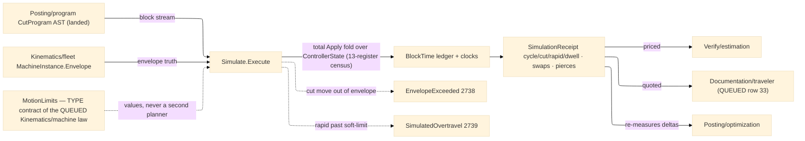

# [RASM_FABRICATION_SIMULATE]

The program-level controller simulation: `Simulate.Execute` the modal-state execution WALK over the landed `Posting/program#CUT_PROGRAM` `CutProgram` AST — a fold threading ONE typed `ControllerState` register vector block-by-block, integrating per-block time under an accel-limited trapezoidal evaluation, and gating every commanded position against the machine envelope. The register vector is the FULL RS274 modal census AS EXECUTION STATE: thirteen `ModalSlot` rows (motion · plane · distance · feed-mode · units · cutter-comp · tool-length · retract · wcs · path-control · spindle · coolant · stop), each carrying its RS274 group ordinal and power-on default. The landed `GWord` stream populates the motion/feed-mode/spindle/coolant/tool/length-offset slots today; the plane/distance/units/cutter-comp/retract/wcs/path-control slots hold their power-on defaults as DECLARED registers and become live as the `Posting/program` row-30 rebuild lands its canned-cycle/WCS/comp nodes — the register CENSUS is this page's, the five-group PARSE state machine and its `ModalGroup` violation payload stay `Posting/program`'s, and a simulate-side parse is the split-owner defect. `Posting/optimization#OPTIMIZATION` names this walk the AUTHORITATIVE cycle-time owner: its `OptimizationReceipt` seconds are pipeline-local estimates, re-measured here; `Verify/estimation` prices the `SimulationReceipt`, never a pass-local integral.

Time is EVALUATION, never planning: the per-block integral runs the trapezoidal `v² = v₀² + 2·a·s` envelope over the block's commanded F (triangle profile when the span cannot reach it), rapids at the limits' rapid rate — under the `MotionLimits` policy shape that is the TYPE CONTRACT of the ONE jerk/accel motion-dynamics law the QUEUED `Kinematics/machine` page HOMES. This page consumes the policy VALUES and never plans: junction clamping and S-curve continuity are `Posting/program`'s internal `Lookahead` certificate, jerk-aware look-ahead re-planning is `Kinematics/machine`'s law, and a second planner here is the named dual-paradigm defect. Envelope truth reads the landed `Kinematics/fleet#MACHINE_FLEET` `MachineInstance.Envelope` travels: a CUT move leaving the envelope routes `EnvelopeExceeded` 2738, a RAPID crossing the soft-limit margin routes `SimulatedOvertravel` 2739 — both on the shared `MachineAxis` carrier, both typed, never a warning string; rotary A/B/C travel limits are `Kinematics/machine`'s QUEUED per-axis rows, so rotary words integrate time but gate nothing yet (the declared-register discipline, stated not silent). Dwell and pierce blocks carry seconds in the F slot per the program AST law; tool-change blocks cost the policy's swap seconds and re-arm the length-offset register.

Wire posture: HOST-LOCAL. The `SimulationReceipt` crosses only the in-process seam — estimation pricing, traveler quoting, optimization re-measure; the state vector and ledger never sit between wire and rail.

## [01]-[INDEX]

- [01]-[SIMULATE]: owns the `ModalSlot` register census, the `ControllerState` typed register vector with its `Apply` transition fold, the `MotionLimits` dynamics policy shape (the QUEUED `Kinematics/machine` law's TYPE contract), the `SimulatePolicy`/`BlockTime`/`SimulationReceipt` evidence family, and the ONE `Simulate.Execute` walk — per-block time integration, envelope/overtravel gating, dwell/tool-change/pierce accounting.

## [02]-[SIMULATE]

- Owner: `ModalSlot` `[SmartEnum<string>]` the thirteen-register RS274 census (`motion` g1 · `plane` g2 · `distance` g3 · `feed-mode` g5 · `units` g6 · `cutter-comp` g7 · `tool-length` g8 · `retract` g10 · `wcs` g12 · `path-control` g13 · `spindle` m7 · `coolant` m8 · `stop` m4), each row binding its group ordinal and power-on default code — the census axis, distinct from the `Posting/program` parse-facing `ModalGroup` payload by charter; `ControllerState` the typed register vector (motion command, feed mode, F/S words, tool slot, XYZ position + ABC rotary registers, spindle/coolant/length-comp flags, the declared default-holding slots) with the ONE `Apply(GWord)` transition fold; `MotionLimits` the dynamics policy shape (per-axis rapid rate, max acceleration — the `Kinematics/machine` motion-dynamics law's TYPE contract, its `Conservative` row the machine-less seed); `SimulatePolicy` the walk knobs (`Option<MachineInstance>` machine, limits, tool-change seconds, soft-limit margin); `BlockTime` the per-block ledger row (ordinal, command, seconds, span, applied feed); `SimulationReceipt` the integrated evidence (cycle/cut/rapid/dwell seconds, tool-change and pierce counts, the block ledger, the final state); `Simulate` the static surface owning `Execute`.
- Cases: `ModalSlot` rows 13; `ControllerState` transitions — one arm per landed `GCommand` row (`rapid`/`feed`/`extrude` position+feed, `arc-cw`/`arc-ccw` position+arc span, `dwell`/`pierce` seconds-in-F, `spindle`/`torch-on` spindle flag, `coolant`/`assist-gas`/`dust-collect` coolant flag, `tool-change` T register + swap cost, `length-offset` comp flag, `css`/`thread-cycle`/`torch-height`/`hotend-temp`/`hotend-wait`/`bed-temp` S/register writes, `program-end` stop), the queued canned-cycle/WCS/comp words landing as new arms with the program rebuild — the fold is TOTAL over the landed axis and a `_`-catch-all is the deleted form; the time integral cases — trapezoid (span reaches F), triangle (span-limited peak `√(v₀² + 2·a·s)`ⁿ), rapid (limits rate), zero-span register write.
- Entry: `public static Fin<SimulationReceipt> Execute(CutProgram program, SimulatePolicy policy)` — the ONE walk; `Fin<T>` routes `FabricationFault.EnvelopeExceeded` 2738 `(MachineAxis, at, limit)` on a cut move leaving the envelope, `FabricationFault.SimulatedOvertravel` 2739 `(block, MachineAxis, by)` on a rapid crossing the soft-limit margin, and kernel `GeometryFault.DegenerateInput` on an empty program, each lowered with `.ToError()`; the machine-less call (`Machine: None`) integrates time against `MotionLimits.Conservative` and gates no envelope — a verdict basis for quoting before a fleet match exists.
- Auto: `Execute` seeds `ControllerState.PowerOn` (every slot at its `ModalSlot` default, position at origin, velocity zero) and folds the block stream — each `GWord` applies through the total transition fold producing the next state plus a `BlockEffect` (span, target feed, seconds-in-F, swap flag); the integrator converts the effect to seconds (feed blocks trapezoidal under `MotionLimits.MaxAccelMmS2` with the carried entry velocity, rapids at `RapidMmS`, arc spans measured on the I/J circle, dwell/pierce read F as seconds, tool-change adds `ToolChangeSeconds` and increments the swap census); the envelope gate checks the commanded endpoint (and the arc's axis-extreme quadrant crossings) per axis against `MachineInstance.Envelope` before the clock advances — cut moves hard-gate, rapids gate at `SoftLimitMarginMm`. `Verify/estimation#ESTIMATION` prices the receipt; `Documentation/traveler` (QUEUED row 33) quotes it; `Posting/optimization` re-measures its deltas against it.
- Receipt: `SimulationReceipt` IS the typed evidence — integrated cycle seconds split cut/rapid/dwell, tool-change and pierce counts, the per-block `BlockTime` ledger, and the terminal `ControllerState`; no fault arms ride the receipt (a violation FAILS the walk typed) and no generic simulation ledger exists beside it.
- Packages: `Posting/program#CUT_PROGRAM` (`CutProgram`/`GWord`/`GCommand`/`FeedMode` — the landed AST, composed), `Kinematics/fleet#MACHINE_FLEET` (`MachineInstance.Envelope` — the envelope truth), `Process/faults#FAULT_BAND` (`MachineAxis` + the 2738/2739 arms), `Rhino.Geometry` (`Point3d`/`BoundingBox` — composed), Thinktecture.Runtime.Extensions, LanguageExt.Core, BCL inbox; QUEUED seams: `Kinematics/machine` (the ONE motion-dynamics law — `MotionLimits` is its TYPE contract and the per-axis rotary limits land there), `Posting/program` row-30 rebuild (canned-cycle/WCS/comp nodes arm the declared registers; the `Parse ∘ Emit = id` contract stays posting's).
- Growth: a new controller word is one transition arm on the total fold (the generated dispatch breaks the build until it lands); a queued register going live is its declared `ModalSlot` row gaining transitions, never a new slot family; a finer dynamics model is columns on `MotionLimits` when `Kinematics/machine` lands its law; per-axis rotary gating is the machine page's limit rows read here as data; a thermal/spindle-load overlay is one `BlockEffect` column; zero new surface.
- Boundary: simulate EVALUATES and never plans — junction speeds, S-curves, and look-ahead are `Posting/program.Lookahead`'s certificate and a re-planned feed here is the dual-paradigm defect; the register census is EXECUTION state and the parse state machine (five tracked groups, `ModalGroup` payload, round-trip law) stays `Posting/program`'s — a simulate-side `Parse` is the split-owner defect; the motion-dynamics LAW homes on `Kinematics/machine` and `MotionLimits` is its consumed TYPE contract, never a second jerk/accel owner; envelope truth is the fleet instance's measured travels and a page-local machine table is the deleted form; a violation is a TYPED fault on the rail, never a warning row on the receipt; cycle time is THIS page's receipt and any sibling integrating seconds beside it (optimization baselines excepted as pipeline-local, re-measured here) is the second-clock defect.

```csharp signature
// --- [RUNTIME_PRELUDE] ----------------------------------------------------------------------------------------------------------------------------
using LanguageExt;
using LanguageExt.Common;
using Rasm.Fabrication.Kinematics;        // MachineInstance — the measured envelope truth
using Rasm.Fabrication.Posting;           // CutProgram · GWord · GCommand · FeedMode — the landed AST
using Rasm.Fabrication.Process;           // FabricationFault · MachineAxis · GeometryFault routing
using Rasm.Numerics;
using Rhino.Geometry;
using Thinktecture;
using static LanguageExt.Prelude;

namespace Rasm.Fabrication.Verify;

// --- [TYPES] --------------------------------------------------------------------------------------------------------------------------------------
// The thirteen-register RS274 census AS EXECUTION STATE: group ordinal + power-on default per row.
// Distinct by charter from Posting/program's parse-facing ModalGroup (five tracked groups, violation payload).
[SmartEnum<string>]
public sealed partial class ModalSlot {
    public static readonly ModalSlot Motion = new("motion", group: 1, powerOn: "G0");
    public static readonly ModalSlot Plane = new("plane", group: 2, powerOn: "G17");
    public static readonly ModalSlot Distance = new("distance", group: 3, powerOn: "G90");
    public static readonly ModalSlot FeedRateMode = new("feed-mode", group: 5, powerOn: "G94");
    public static readonly ModalSlot Units = new("units", group: 6, powerOn: "G21");
    public static readonly ModalSlot CutterComp = new("cutter-comp", group: 7, powerOn: "G40");
    public static readonly ModalSlot ToolLength = new("tool-length", group: 8, powerOn: "G49");
    public static readonly ModalSlot Retract = new("retract", group: 10, powerOn: "G98");
    public static readonly ModalSlot Wcs = new("wcs", group: 12, powerOn: "G54");
    public static readonly ModalSlot PathControl = new("path-control", group: 13, powerOn: "G64");
    public static readonly ModalSlot Spindle = new("spindle", group: 107, powerOn: "M5");
    public static readonly ModalSlot Coolant = new("coolant", group: 108, powerOn: "M9");
    public static readonly ModalSlot Stop = new("stop", group: 104, powerOn: "");

    public int Group { get; }
    public string PowerOn { get; }
}

// --- [MODELS] -------------------------------------------------------------------------------------------------------------------------------------
// The QUEUED Kinematics/machine motion-dynamics law's TYPE contract: this page consumes the values,
// the machine page owns the law. Conservative is the machine-less quoting seed.
public readonly record struct MotionLimits(double RapidMmS, double MaxAccelMmS2) {
    public static readonly MotionLimits Conservative = new(RapidMmS: 250.0, MaxAccelMmS2: 800.0);
}

public sealed record SimulatePolicy(Option<MachineInstance> Machine, MotionLimits Limits, double ToolChangeSeconds, double SoftLimitMarginMm) {
    public static readonly SimulatePolicy Quote = new(Machine: None, Limits: MotionLimits.Conservative, ToolChangeSeconds: 8.0, SoftLimitMarginMm: 0.0);
}

// The typed register vector: landed slots live, queued slots hold their ModalSlot power-on defaults
// until the program rebuild arms them — declared registers, never silent omissions.
public sealed record ControllerState(
    GCommand Motion, FeedMode Feed, double F, double S, Option<double> T,
    Point3d At, double A, double B, double C, double VelocityMmS,
    bool SpindleOn, bool CoolantOn, bool LengthComp, bool Stopped) {
    public static readonly ControllerState PowerOn = new(
        GCommand.Rapid, FeedMode.UnitsPerMinute, F: 0.0, S: 0.0, T: None,
        At: Point3d.Origin, A: 0.0, B: 0.0, C: 0.0, VelocityMmS: 0.0,
        SpindleOn: false, CoolantOn: false, LengthComp: false, Stopped: false);
}

public readonly record struct BlockEffect(double SpanMm, double TargetFeedMmS, double FixedSeconds, bool ToolSwap, bool Pierce);

public readonly record struct BlockTime(int Block, GCommand Command, double Seconds, double SpanMm, double FeedApplied);

public sealed record SimulationReceipt(
    double CycleSeconds, double CutSeconds, double RapidSeconds, double DwellSeconds,
    int ToolChanges, int Pierces, Seq<BlockTime> Ledger, ControllerState Final);

// --- [OPERATIONS] ---------------------------------------------------------------------------------------------------------------------------------
public static class Simulate {
    // The ONE walk: PowerOn state, total per-command transition, trapezoidal time integral, envelope gate
    // before the clock advances. A violation FAILS typed — never a warning row on the receipt.
    public static Fin<SimulationReceipt> Execute(CutProgram program, SimulatePolicy policy) =>
        program.Blocks.IsEmpty
            ? Fin.Fail<SimulationReceipt>(GeometryFault.DegenerateInput("simulate:empty-program").ToError())
            : program.Blocks.Fold(
                Fin.Succ((State: ControllerState.PowerOn, Clock: (Cut: 0.0, Rapid: 0.0, Dwell: 0.0), Swaps: 0, Pierces: 0, Ledger: Seq<BlockTime>(), Block: 0)),
                (acc, word) => acc.Bind(st => Step(st, word, policy)))
              .Map(st => new SimulationReceipt(
                  CycleSeconds: st.Clock.Cut + st.Clock.Rapid + st.Clock.Dwell + st.Swaps * policy.ToolChangeSeconds,
                  CutSeconds: st.Clock.Cut, RapidSeconds: st.Clock.Rapid, DwellSeconds: st.Clock.Dwell,
                  ToolChanges: st.Swaps, Pierces: st.Pierces, Ledger: st.Ledger, Final: st.State));

    static Fin<(ControllerState State, (double Cut, double Rapid, double Dwell) Clock, int Swaps, int Pierces, Seq<BlockTime> Ledger, int Block)> Step(
        (ControllerState State, (double Cut, double Rapid, double Dwell) Clock, int Swaps, int Pierces, Seq<BlockTime> Ledger, int Block) st,
        GWord word, SimulatePolicy policy) {
        (ControllerState next, BlockEffect effect) = Apply(st.State, word);
        return Gate(st.State, next, word, st.Block, policy).Map(_ => {
            double seconds = Seconds(st.State.VelocityMmS, effect, word, policy);
            var clock = word.Command == GCommand.Rapid ? (st.Clock.Cut, st.Clock.Rapid + seconds, st.Clock.Dwell)
                      : effect.FixedSeconds > 0.0      ? (st.Clock.Cut, st.Clock.Rapid, st.Clock.Dwell + seconds)
                                                       : (st.Clock.Cut + seconds, st.Clock.Rapid, st.Clock.Dwell);
            return (next with { VelocityMmS = effect.TargetFeedMmS }, clock,
                    st.Swaps + (effect.ToolSwap ? 1 : 0), st.Pierces + (effect.Pierce ? 1 : 0),
                    st.Ledger.Add(new BlockTime(st.Block, word.Command, seconds, effect.SpanMm, effect.TargetFeedMmS * 60.0)), st.Block + 1);
        });
    }

    // TOTAL over the landed GCommand axis — queued canned-cycle/WCS words land as new arms with the
    // program rebuild; a `_` catch-all swallowing a new word is the deleted form.
    static (ControllerState, BlockEffect) Apply(ControllerState s, GWord w) {
        Point3d to = new(w.X.IfNone(s.At.X), w.Y.IfNone(s.At.Y), w.Z.IfNone(s.At.Z));
        double feedMmS = w.F.IfNone(s.F) / 60.0;
        double span = w.Command == GCommand.ArcCw || w.Command == GCommand.ArcCcw ? ArcSpan(s.At, to, w) : s.At.DistanceTo(to);
        ControllerState moved = s with { Motion = w.Command, At = to, F = w.F.IfNone(s.F), Feed = w.Mode.IfNone(s.Feed) };
        return w.Command.Key switch {
            "rapid" => (moved, new BlockEffect(span, 0.0, 0.0, false, false)),
            "feed" or "extrude" or "arc-cw" or "arc-ccw" => (moved, new BlockEffect(span, feedMmS, 0.0, false, false)),
            "dwell" => (s, new BlockEffect(0.0, s.VelocityMmS, w.F.IfNone(0.0), false, false)),
            "pierce" => (s, new BlockEffect(0.0, 0.0, w.F.IfNone(0.0), false, true)),
            "tool-change" => (s with { T = w.T, LengthComp = false }, new BlockEffect(0.0, 0.0, 0.0, true, false)),
            "length-offset" => (s with { LengthComp = true }, new BlockEffect(0.0, s.VelocityMmS, 0.0, false, false)),
            "spindle" or "torch-on" => (s with { SpindleOn = true, S = w.S.IfNone(s.S) }, new BlockEffect(0.0, s.VelocityMmS, 0.0, false, false)),
            "coolant" or "assist-gas" or "dust-collect" => (s with { CoolantOn = true }, new BlockEffect(0.0, s.VelocityMmS, 0.0, false, false)),
            "css" or "thread-cycle" or "torch-height" or "hotend-temp" or "hotend-wait" or "bed-temp"
                => (s with { S = w.S.IfNone(s.S) }, new BlockEffect(0.0, s.VelocityMmS, 0.0, false, false)),
            "program-end" => (s with { Stopped = true, SpindleOn = false, CoolantOn = false }, new BlockEffect(0.0, 0.0, 0.0, false, false)),
            _ => (moved, new BlockEffect(span, feedMmS, 0.0, false, false)),
        };
    }

    // Trapezoid under v² = v₀² + 2·a·s (triangle when the span cannot reach F); rapids at the limits rate;
    // dwell/pierce carry seconds in the F slot per the program AST law. Evaluation only — never planning.
    static double Seconds(double vIn, BlockEffect e, GWord w, SimulatePolicy policy) {
        if (e.FixedSeconds > 0.0) return e.FixedSeconds;
        if (e.SpanMm <= 1e-9) return 0.0;
        double a = Math.Max(1e-6, policy.Limits.MaxAccelMmS2);
        double target = w.Command == GCommand.Rapid ? policy.Limits.RapidMmS : Math.Max(1e-6, e.TargetFeedMmS);
        double accelDist = Math.Abs(target * target - vIn * vIn) / (2.0 * a);
        if (accelDist >= e.SpanMm) {
            double vPeak = Math.Sqrt(Math.Max(vIn * vIn, 2.0 * a * e.SpanMm));
            return (vPeak - Math.Min(vIn, vPeak)) / a + e.SpanMm / Math.Max(1e-6, 0.5 * (vIn + vPeak));
        }
        return Math.Abs(target - vIn) / a + (e.SpanMm - accelDist) / target;
    }

    static double ArcSpan(Point3d from, Point3d to, GWord w) {
        Point3d center = new(from.X + w.I.IfNone(0.0), from.Y + w.J.IfNone(0.0), from.Z);
        double r = from.DistanceTo(center);
        if (r <= 1e-9) return from.DistanceTo(to);
        double a0 = Math.Atan2(from.Y - center.Y, from.X - center.X), a1 = Math.Atan2(to.Y - center.Y, to.X - center.X);
        double sweep = w.Command == GCommand.ArcCw ? (a0 - a1 + 2.0 * Math.PI) % (2.0 * Math.PI) : (a1 - a0 + 2.0 * Math.PI) % (2.0 * Math.PI);
        return r * (sweep <= 1e-9 ? 2.0 * Math.PI : sweep);
    }

    // Envelope gate: cut moves hard-gate per axis (2738); rapids gate at the soft-limit margin (2739).
    // Rotary A/B/C limits are Kinematics/machine's QUEUED rows — declared, not gated here.
    static Fin<Unit> Gate(ControllerState from, ControllerState next, GWord w, int block, SimulatePolicy policy) =>
        policy.Machine.Match(
            None: () => Fin.Succ(unit),
            Some: m => Axes(next.At).Fold(Fin.Succ(unit), (acc, axis) => acc.Bind(_ => {
                (MachineAxis key, double at, double lo, double hi) = (axis.Key, axis.At, Lo(m.Envelope, axis.Key), Hi(m.Envelope, axis.Key));
                if (at >= lo && at <= hi) return Fin.Succ(unit);
                double limit = at < lo ? lo : hi;
                return w.Command == GCommand.Rapid && Math.Abs(at - limit) <= policy.SoftLimitMarginMm
                    ? Fin.Succ(unit)
                    : w.Command == GCommand.Rapid
                        ? Fin.Fail<Unit>(new FabricationFault.SimulatedOvertravel(block, key, Math.Abs(at - limit)).ToError())
                        : Fin.Fail<Unit>(new FabricationFault.EnvelopeExceeded(key, at, limit).ToError());
            })));

    static Seq<(MachineAxis Key, double At)> Axes(Point3d p) => Seq((MachineAxis.X, p.X), (MachineAxis.Y, p.Y), (MachineAxis.Z, p.Z));

    static double Lo(BoundingBox e, MachineAxis a) => a == MachineAxis.X ? e.Min.X : a == MachineAxis.Y ? e.Min.Y : e.Min.Z;

    static double Hi(BoundingBox e, MachineAxis a) => a == MachineAxis.X ? e.Max.X : a == MachineAxis.Y ? e.Max.Y : e.Max.Z;
}
```


