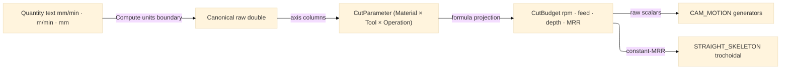

# [RASM_FABRICATION_CUT_PARAMETER]

The feeds-and-speeds policy table: `CutParameter` the one frozen `material × tool × operation` cross-product owner projecting each row to the raw `(SpindleRpm, FeedRate, DepthOfCut, MaterialRemovalRate)` cut budget the `toolpath/motion#CAM_MOTION` and `toolpath/skeleton#STRAIGHT_SKELETON` generators read as settled scalars. The table is data-driven dispatch keyed by the composite `(Material, Tool, Operation)` smart-enum triple — a new material, tool, or operation is one row, never a per-generator magic number. Quantity-bearing ingress (a feed in `mm/min`, a spindle speed in `rpm`, a depth in `mm`) admits ONCE through the `Rasm.Compute/units/quantities#QUANTITIES` UnitsNet boundary, the canonical quantity-admission owner; this table stores and projects only the canonical-unit raw doubles the boundary emits, because the toolpath interior operates on raw coordinate/rate doubles and a unit-bearing quantity in a generator signature is the seam violation the frontier owner forbids. The trochoidal generator reads the `MaterialRemovalRate` budget in real `mm³/min` instead of a dimensionless constant, holding constant radial engagement across materials. It composes the `frontier/owner#FABRICATION_OWNER` shared vocabulary as the consumer seam; it computes no hash and operates on raw doubles at the interior.

Wire posture: HOST-LOCAL. The `CutBudget` scalars cross only the in-process seam to the toolpath generators — never a browser or peer wire. The `Material`/`Tool`/`Operation` vocabularies and the `CutBudget` record are host-local types that never sit between wire and rail.

## [1]-[INDEX]

One cluster: `[2]-[CUT_PARAMETER]` owns the `Material`/`Tool`/`Operation` cross-product axes, the `CutBudget` projected-scalar receipt, and the `CutParameter` frozen policy table — the `material × tool × operation` rows projecting to the spindle-speed, feed-rate, depth-of-cut, and material-removal-rate budget the toolpath generators read.

## [2]-[CUT_PARAMETER]

- Owner: `Material` `[SmartEnum<string>]` the stock-material axis (`aluminium`/`mild-steel`/`stainless`/`acrylic`/`plywood`) carrying a per-material surface-speed column; `Tool` `[SmartEnum<string>]` the cutter axis (`endmill-3mm`/`endmill-6mm`/`endmill-10mm`/`drill-6mm`) carrying a diameter and a flute-count column; `Operation` `[SmartEnum<string>]` the cut-operation axis (`contour`/`pocket`/`drill`/`trochoidal`) carrying a chip-load and an engagement column; `CutBudget` the projected raw-scalar receipt (spindle rpm, feed mm/min, depth-of-cut mm, material-removal-rate mm³/min); `CutParameter` the static surface owning the frozen `(Material, Tool, Operation)`-keyed table and the `Budget` projection from the row columns.
- Cases: `Material` rows `aluminium` · `mild-steel` · `stainless` · `acrylic` · `plywood` (5); `Tool` rows `endmill-3mm` · `endmill-6mm` · `endmill-10mm` · `drill-6mm` (4); `Operation` rows `contour` · `pocket` · `drill` · `trochoidal` (4); the cut budget is the cross-product projection `spindle = surfaceSpeed · 1000 / (π · diameter)`, `feed = spindle · flutes · chipLoad`, `depth = engagement · diameter`, `mrr = depth · engagement · diameter · feed` — each a settled formula over the axis columns, the table the composite-key admission factory the generators read.
- Entry: `public static CutBudget Budget(Material material, Tool tool, Operation operation)` — the ONE projection discriminating by the composite `(Material, Tool, Operation)` key, total over every cross-product (each axis closed, the projection a pure formula over the columns), no rail because a budget is always derivable from the three settled rows; `public static Fin<CutBudget> Admit(ReadOnlySpan<char> material, ReadOnlySpan<char> tool, ReadOnlySpan<char> operation)` is the span-keyed boundary admitting external text through each axis's generated `Validate`, routing the kernel `GeometryFault.DegenerateInput` on an unknown key.
- Auto: `CutParameter.Budget` reads the surface speed off the `Material` column, the diameter and flute count off the `Tool` column, and the chip load and radial engagement off the `Operation` column, then projects the four budget scalars by the settled feeds-and-speeds formulae — the spindle rpm from the constant-surface-speed relation, the feed from the chip-load-per-tooth relation, the depth from the engagement fraction, and the material-removal-rate from the swept volume per minute. Quantity text (a feed entered as `"3000 mm/min"`, a surface speed as `"200 m/min"`) admits through the `Rasm.Compute/units/quantities#QUANTITIES` boundary which canonicalizes to the `Speed`/`Length` SI scalar; this table never re-mints a UnitsNet member and stores only the canonical raw double. The `toolpath/motion#CAM_MOTION` `Cam.Solve` and `toolpath/skeleton#STRAIGHT_SKELETON` trochoidal generator read the `CutBudget` scalars directly — the `MaterialRemovalRate` field is the constant-MRR budget the adaptive-clearing strategy holds, replacing the dimensionless step-over constant.
- Receipt: the `CutBudget` carries the four raw cut scalars directly — the projected budget IS the evidence the generators read; no generic parameter ledger and no quantity type escaping the boundary.
- Packages: `Rasm`/Vectors (composed at the consumer seam), Thinktecture.Runtime.Extensions (`[SmartEnum<string>]`), LanguageExt.Core, BCL inbox; UnitsNet is composed ONLY through the `Rasm.Compute/units/quantities#QUANTITIES` boundary at quantity ingress, never referenced directly in this folder.
- Growth: a new material, tool, or operation is one `[SmartEnum<string>]` row plus its axis columns, the cross-product projection unchanged; a new budget scalar (coolant pressure, plunge rate) is one `CutBudget` field plus one projection formula; a fully tabulated per-cell override (a hand-measured budget defeating the formula projection) is one frozen `(Material, Tool, Operation)`-keyed override row consulted before the formula; zero new surface.
- Boundary: `CutParameter` is the ONE feeds-and-speeds owner and a per-generator magic number is the deleted form — the trochoidal step-over, the contour feed, and the pocket depth all read the `CutBudget` row; the table is the cross-product composite-key factory and a `MaterialTable`/`ToolTable`/`OperationTable` sibling triple is the deleted form — one `(Material, Tool, Operation)` key over the three closed axes; the quantity admission is the one `Rasm.Compute/units/quantities#QUANTITIES` boundary and a UnitsNet member spelled in this folder is the seam violation — the boundary emits the canonical raw double and this table stores it; the generators read raw `double` budgets and a `Speed`/`RotationalSpeed`/`Length` quantity in a `Cam`/`StraightSkeleton` signature is the named seam violation the frontier owner's interior-double law forbids; the cross-product projection is a settled formula over the axis columns and a parallel per-cell lookup that duplicates the formula is the rejected form unless a measured override defeats it.

```csharp signature
// --- [RUNTIME_PRELUDE] --------------------------------------------------------------------
using System.Collections.Frozen;
using LanguageExt;
using LanguageExt.Common;
using Rasm.Geometry;
using Thinktecture;
using static LanguageExt.Prelude;

namespace Rasm.Fabrication.ProcessPhysics;

// --- [TYPES] ------------------------------------------------------------------------------
[SmartEnum<string>]
public sealed partial class Material {
    public static readonly Material Aluminium = new("aluminium", surfaceSpeed: 300.0);
    public static readonly Material MildSteel = new("mild-steel", surfaceSpeed: 90.0);
    public static readonly Material Stainless = new("stainless", surfaceSpeed: 45.0);
    public static readonly Material Acrylic = new("acrylic", surfaceSpeed: 500.0);
    public static readonly Material Plywood = new("plywood", surfaceSpeed: 600.0);

    public double SurfaceSpeed { get; }
}

[SmartEnum<string>]
public sealed partial class Tool {
    public static readonly Tool Endmill3 = new("endmill-3mm", diameter: 3.0, flutes: 2);
    public static readonly Tool Endmill6 = new("endmill-6mm", diameter: 6.0, flutes: 3);
    public static readonly Tool Endmill10 = new("endmill-10mm", diameter: 10.0, flutes: 4);
    public static readonly Tool Drill6 = new("drill-6mm", diameter: 6.0, flutes: 2);

    public double Diameter { get; }
    public int Flutes { get; }
}

[SmartEnum<string>]
public sealed partial class Operation {
    public static readonly Operation Contour = new("contour", chipLoad: 0.05, engagement: 1.0);
    public static readonly Operation Pocket = new("pocket", chipLoad: 0.04, engagement: 0.5);
    public static readonly Operation Drill = new("drill", chipLoad: 0.03, engagement: 1.0);
    public static readonly Operation Trochoidal = new("trochoidal", chipLoad: 0.06, engagement: 0.1);

    public double ChipLoad { get; }
    public double Engagement { get; }
}

// --- [MODELS] -----------------------------------------------------------------------------
public readonly record struct CutBudget(double SpindleRpm, double FeedRate, double DepthOfCut, double MaterialRemovalRate);

// --- [OPERATIONS] -------------------------------------------------------------------------
public static class CutParameter {
    public static CutBudget Budget(Material material, Tool tool, Operation operation) {
        double spindle = material.SurfaceSpeed * 1000.0 / (Math.PI * tool.Diameter);
        double feed = spindle * tool.Flutes * operation.ChipLoad;
        double depth = operation.Engagement * tool.Diameter;
        double width = operation.Engagement * tool.Diameter;
        return new CutBudget(spindle, feed, depth, depth * width * feed);
    }

    // --- [BOUNDARIES] ---------------------------------------------------------------------
    public static Fin<CutBudget> Admit(ReadOnlySpan<char> material, ReadOnlySpan<char> tool, ReadOnlySpan<char> operation) =>
        Material.Validate(material, null, out var m) is { } mf ? Fin.Fail<CutBudget>(GeometryFault.DegenerateInput($"cut-parameter:material:{mf.Message}").ToError())
        : Tool.Validate(tool, null, out var t) is { } tf ? Fin.Fail<CutBudget>(GeometryFault.DegenerateInput($"cut-parameter:tool:{tf.Message}").ToError())
        : Operation.Validate(operation, null, out var o) is { } of ? Fin.Fail<CutBudget>(GeometryFault.DegenerateInput($"cut-parameter:operation:{of.Message}").ToError())
        : Fin.Succ(Budget(m!, t!, o!));
}
```


