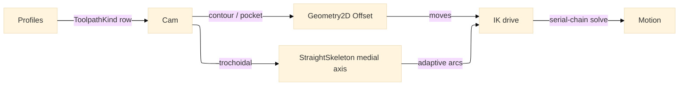

# [RASM_FABRICATION_MOTION]

The CAM-motion owner: the toolpath motion kernel one `Cam` static fold dispatches over a closed `ToolpathKind` (`contour`/`pocket`/`drill`/`trochoidal`), generating the cut moves. Contour and pocket route their offsetting through the `geometry2d/clipper#POLYGON_ALGEBRA` Clipper2 substrate — the constant-offset contour rings and the inward pocket clearing are integer-robust polygon offsets, never a hand-rolled per-vertex-normal `OffsetRing` that self-intersects on a reflex vertex. The `trochoidal` row is the dominant HEM (high-efficiency machining) class — an adaptive-clearing toolpath holding constant material-removal rate and radial engagement — driven by the `toolpath/skeleton#STRAIGHT_SKELETON` straight-skeleton/medial-axis primitive, the one place no managed library exists and the author-kernel posture is correct and forward. The kernel composes the `frontier/owner#FABRICATION_OWNER` `Loop`/`Move`/`FrontierPolicy.Cam`/`FrontierResult.Motion` shared vocabulary, drives each move target through the `kinematics/serial-chain#SERIAL_CHAIN` FK/IK solver, and reads the kernel `Rasm.Geometry/numerics/predicates#ROBUST_PREDICATES` `Predicate.Orient2D` exact orientation where a side verdict is needed. It is dispatched by the `frontier/owner#FABRICATION_OWNER` `Run` fold's `Cam` policy case; it mints no second frontier surface, computes no hash, and operates on raw coordinate doubles at the interior.

Wire posture: HOST-LOCAL. The `Motion` toolpath/joint stream crosses only the in-process seam to the `posting/program#CUT_PROGRAM` emitter — never a browser or peer wire.

## [1]-[INDEX]

One cluster: `[2]-[CAM_MOTION]` owns the `ToolpathKind` contour/pocket/drill/trochoidal move generators over the Geometry2D offset and the `Cam` fold driving each move target through the serial-chain IK; one motion owner over the kind axis.

## [2]-[CAM_MOTION]

- Owner: `ToolpathKind` `[SmartEnum<string>]` the toolpath strategy axis (`contour`/`pocket`/`drill`/`trochoidal`), the per-kind move-generation behavior carried by the `Generate` generated total `Switch` arm rather than a parallel behavior flag the dispatch re-derives; `Cam` the static motion fold over the `ToolpathKind` axis generating the cut moves, then driving each move target through the FK/IK chain and emitting the `Motion` joint stream.
- Cases: `ToolpathKind` rows `contour` (constant-offset boundary passes via Geometry2D `Offset`) · `pocket` (inward continuous spiral via repeated Geometry2D `Offset` rings) · `drill` (peck-cycle point set) · `trochoidal` (adaptive-clearing HEM over the straight-skeleton medial axis, constant MRR and radial engagement) (4).
- Entry: `public static Fin<FrontierResult> Solve(FrontierPolicy.Cam policy, FrontierInput input)` — `Fin<T>` routes `FabricationFault.OpenLoop` on a non-closed toolpath boundary, the kernel `GeometryFault.DegenerateInput` on an empty profile, and `FabricationFault.Unreachable` when a reach-strict `IkPolicy.ReachStrict` solve does not converge, each lowered with `.ToError()`; the body dispatches the `ToolpathKind` to the move generator, then runs the FK chain to verify reach and the IK solver to drive the end-effector to each move target, emitting the `Motion` joint stream.
- Auto: `Cam.Solve` dispatches the `ToolpathKind` through the generated total `Switch` in `Generate`, threading the `(policy, loop)` state into each case arm — `contour` folds the boundary loop inward by `ToolRadius + k·StepOver` constant Geometry2D offsets for `Passes` rings; `pocket` generates the inward clearing as successive Geometry2D offset rings stitched into one continuous path so the cutter never lifts; `drill` emits a peck point per profile centroid with retract moves between; `trochoidal` reads the `toolpath/skeleton#STRAIGHT_SKELETON` medial axis of the pocket, then walks it laying down adaptive-radius circular arcs whose radial step holds constant material engagement (the constant-MRR HEM strategy naive constant-offset clearing cannot give). After move generation the fold drives each move target through the `kinematics/serial-chain#SERIAL_CHAIN` IK solver, warm-starting each solve from the previous move's joint solution; under a permissive `IkPolicy` it emits the `Motion` with the per-target joint stream, the final residual, and the reached conjunction, and under `IkPolicy.ReachStrict` a non-converged reached conjunction routes `FabricationFault.Unreachable` carrying the residual — `Cam.Solve` is the one in-folder producer of `Unreachable` since `Ik.Solve` stays total and never decides the reach contract.
- Receipt: the `Motion` carries the ordered `Move` list (rapid/feed with feedrate), the per-target joint-angle stream, the final IK position residual, and the reached flag — the typed motion evidence the posting owner consumes; no generic motion ledger.
- Packages: `Rasm`/Vectors (`Point3d`/`Vector3d` — composed), `Rasm.Geometry.Numerics` (`Predicate.Orient2D` — settled, the side verdict), Clipper2 (via `geometry2d/clipper#POLYGON_ALGEBRA` — the contour/pocket offset), Thinktecture.Runtime.Extensions, LanguageExt.Core, BCL inbox.
- Growth: a new toolpath strategy is one `ToolpathKind` row plus one `Generate` `Switch` arm, the generated dispatch breaking the build until the arm lands; a collision-aware retract is one `Move`-fold arm reading the settled `SpatialIndex`; a 5-axis tilt strategy is one orientation column on the trochoidal arm; zero new surface.
- Boundary: CAM is the ONE motion owner over the `ToolpathKind` axis and a `ContourPath`/`PocketPath`/`DrillCycle` sibling triple is the deleted form; the per-kind behavior lives in the `Generate` generated total `Switch` arm and a parallel `Spiral`/`Adaptive` boolean column on `ToolpathKind` beside the case the dispatch already reads is the deleted form — one axis carries one discriminant, the union case, never a second flag the arm re-derives; the contour and pocket offsetting route the one `geometry2d/clipper#POLYGON_ALGEBRA` Clipper2 owner and a hand-rolled `OffsetRing` is the deleted form; the trochoidal adaptive clearing reads the `toolpath/skeleton#STRAIGHT_SKELETON` medial-axis primitive and a per-vertex spiral approximation of HEM is the rejected form; the FK/IK chain is owned at `kinematics/serial-chain#SERIAL_CHAIN` and a CAM-local kinematics re-mint is the deleted form; the side verdict reads `Predicate.Orient2D` exact sign and a `double` cross at the call site is the named robustness defect.

```csharp signature
// --- [RUNTIME_PRELUDE] --------------------------------------------------------------------
using LanguageExt;
using LanguageExt.Common;
using Rasm.Fabrication.Frontier;
using Rasm.Fabrication.Geometry2D;
using Rasm.Fabrication.Kinematics;
using Rasm.Geometry;
using Rasm.Geometry.Numerics;
using Rhino.Geometry;
using Thinktecture;
using static LanguageExt.Prelude;

namespace Rasm.Fabrication.Toolpath;

// --- [TYPES] ------------------------------------------------------------------------------
[SmartEnum<string>]
public sealed partial class ToolpathKind {
    public static readonly ToolpathKind Contour = new("contour");
    public static readonly ToolpathKind Pocket = new("pocket");
    public static readonly ToolpathKind Drill = new("drill");
    public static readonly ToolpathKind Trochoidal = new("trochoidal");
}

// --- [OPERATIONS] -------------------------------------------------------------------------
public static class Cam {
    public static Fin<FrontierResult> Solve(FrontierPolicy.Cam policy, FrontierInput input) =>
        input.Profiles.IsEmpty
            ? Fin.Fail<FrontierResult>(GeometryFault.DegenerateInput("cam:no-profile").ToError())
            : input.Profiles.Find(static l => !l.Closed).Match(
                Some: _ => Fin.Fail<FrontierResult>(FabricationFault.OpenLoop("cam:open-boundary").ToError()),
                None: () => {
                    Seq<Move> moves = toSeq(input.Profiles).Bind(loop => Generate(policy, loop.AsCcw()));
                    var fold = input.Chain.IsEmpty
                        ? (Joints: Seq<double[]>(), Seed: Array.Empty<double>(), Residual: 0.0, Reached: true)
                        : moves.Fold((Joints: Seq<double[]>(), Seed: new double[input.Chain.Count], Residual: 0.0, Reached: true),
                            (acc, move) => {
                                var (theta, residual, ok) = Ik.Solve(input.Chain.ToArray(), acc.Seed, move.To, policy.Ik);
                                return (acc.Joints.Add(theta), theta, residual, acc.Reached && ok);
                            });
                    return policy.Ik.ReachStrict && !fold.Reached
                        ? Fin.Fail<FrontierResult>(FabricationFault.Unreachable($"cam:ik-residual:{fold.Residual:0.###}").ToError())
                        : Fin.Succ((FrontierResult)new FrontierResult.Motion(moves, fold.Joints, fold.Residual, fold.Reached));
                });

    static Seq<Move> Generate(FrontierPolicy.Cam p, Loop loop) =>
        p.Kind.Switch(
            state:      (p, loop),
            contour:    static s => Contour(s.loop, s.p.ToolRadius, s.p.StepOver, s.p.Passes),
            pocket:     static s => Pocket(s.loop, s.p.ToolRadius, s.p.StepOver),
            drill:      static s => Peck(s.loop, s.p.ToolRadius),
            trochoidal: static s => Trochoidal(s.loop, s.p.ToolRadius, s.p.StepOver));

    static Seq<Move> Contour(Loop loop, double radius, double stepOver, int passes) =>
        toSeq(Enumerable.Range(0, Math.Max(1, passes)))
            .Bind(k => PolygonAlgebra.Offset(Seq(loop), -(radius + k * stepOver), OffsetEnds.Polygon).IfFail(Seq<Loop>()))
            .Bind(ring => toSeq(ring.Vertices))
            .Map(p => new Move(p, Rapid: false, Feed: 1.0));

    static Seq<Move> Pocket(Loop loop, double radius, double stepOver) {
        Seq<Move> Rings(double depth) =>
            PolygonAlgebra.Offset(Seq(loop), -(radius + depth), OffsetEnds.Polygon).Match(
                Succ: ring => ring.IsEmpty
                    ? Seq<Move>()
                    : toSeq(ring).Bind(r => toSeq(r.Vertices)).Map(p => new Move(p, Rapid: false, Feed: 1.0)).Concat(Rings(depth + stepOver)),
                Fail: _ => Seq<Move>());
        return Rings(0.0);
    }

    static Seq<Move> Peck(Loop loop, double radius) {
        Point3d c = Centroid(loop);
        return Seq(new Move(c with { Z = c.Z + 5.0 }, Rapid: true, Feed: 0.0), new Move(c, Rapid: false, Feed: 0.5));
    }

    static Seq<Move> Trochoidal(Loop loop, double radius, double stepOver) =>
        StraightSkeleton.MedialAxis(loop).Match(
            Succ: axis => axis.Bind(seg => Engage(seg, radius, stepOver)),
            Fail: _ => Seq<Move>());

    static Seq<Move> Engage(Edge3 seg, double radius, double stepOver) {
        double len = seg.A.DistanceTo(seg.B);
        int steps = Math.Max(1, (int)Math.Ceiling(len / Math.Max(stepOver, 1e-6)));
        return toSeq(Enumerable.Range(0, steps + 1)).Map(i => {
            double t = i / (double)steps;
            return new Move(seg.A + t * (seg.B - seg.A), Rapid: i == 0, Feed: 1.0);
        });
    }

    static Point3d Centroid(Loop loop) =>
        loop.Vertices.Fold(Point3d.Origin, static (acc, v) => acc + v) / Math.Max(1, loop.Count);
}
```


